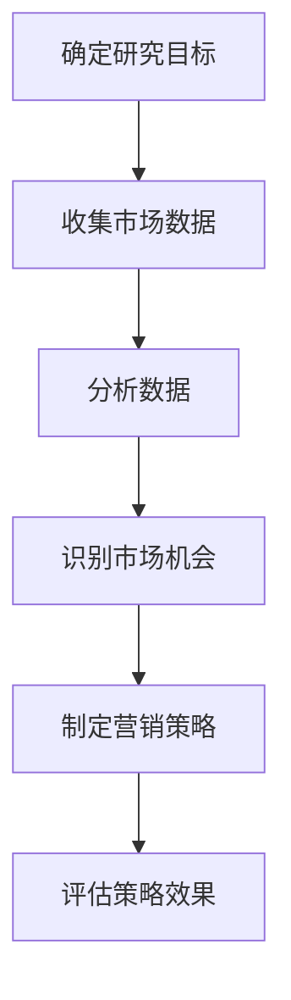
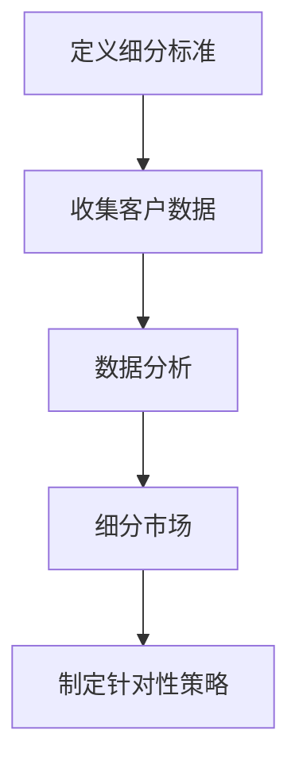
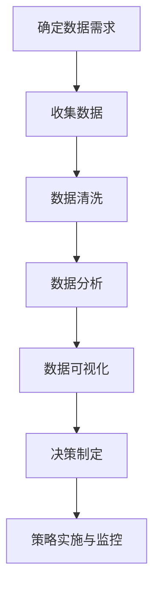
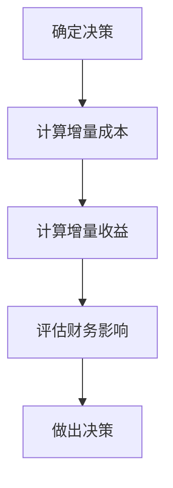
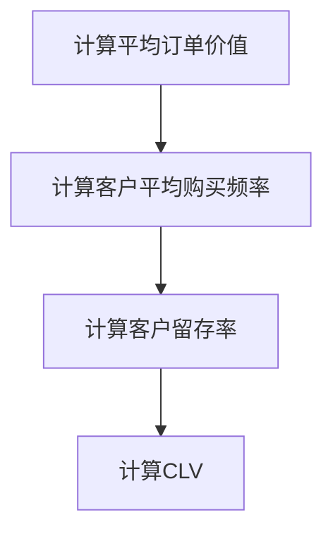
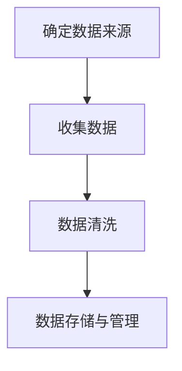
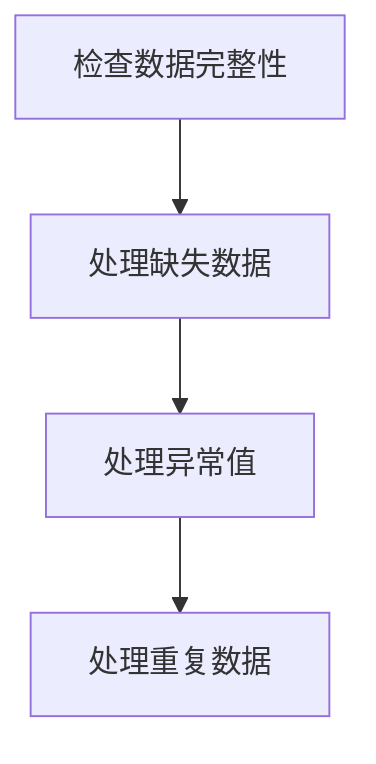
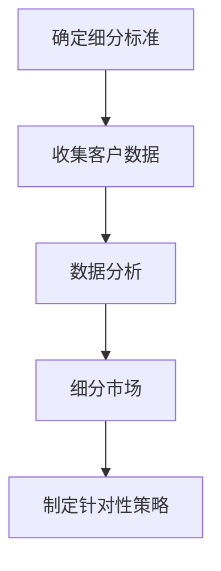
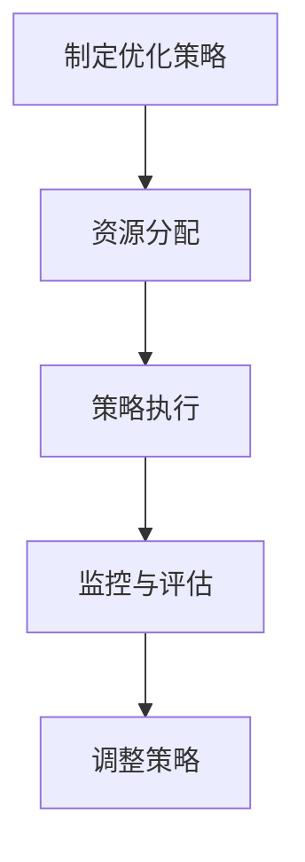

                 

# 创业公司的客户获取成本控制与优化方法

## 概述

创业公司在发展的过程中，客户获取成本（Customer Acquisition Cost，简称CAC）是一个至关重要的财务指标。CAC指的是公司为吸引并获得一个新客户所花费的平均成本。过高的CAC会导致公司资源浪费，影响盈利能力；而控制不住的CAC增长则可能引发现金流问题，甚至危及公司生存。因此，如何控制并优化客户获取成本，对于创业公司而言，具有战略意义。

本文将探讨创业公司如何通过有效的策略和方法来降低客户获取成本。我们将从以下几个方面展开：

1. **背景介绍**：探讨客户获取成本的重要性以及创业公司面临的挑战。
2. **核心概念与联系**：介绍相关的市场研究和客户细分等核心概念，以及它们在客户获取成本控制中的作用。
3. **核心算法原理 & 具体操作步骤**：探讨一些经典的CAC控制策略，如增量分析、数据驱动的决策等。
4. **数学模型和公式 & 详细讲解 & 举例说明**：介绍如何通过数学模型来量化客户获取成本，并给出实例说明。
5. **项目实践：代码实例和详细解释说明**：通过实际案例来展示如何实施这些策略。
6. **实际应用场景**：讨论在不同行业和市场条件下如何应用这些方法。
7. **工具和资源推荐**：推荐一些有用的工具和资源，帮助读者进一步学习和实践。
8. **总结：未来发展趋势与挑战**：总结本文内容，并探讨未来的发展趋势和挑战。

通过以上内容，读者可以全面了解客户获取成本控制与优化的方法，并能够在实际操作中运用这些策略，提高创业公司的盈利能力和市场竞争力。

## 1. 背景介绍

在当今快速变化的市场环境中，创业公司面临的竞争压力越来越大。为了在市场中立足并实现持续增长，获取客户成为创业公司的一项关键任务。然而，随着市场竞争的加剧和消费者需求的多样化，客户获取成本（CAC）也呈现逐年上升的趋势。因此，控制并优化CAC成为创业公司生存与发展的关键。

### 1.1 客户获取成本的定义与意义

客户获取成本（Customer Acquisition Cost，简称CAC）是指公司在一定时间内，通过市场营销和销售活动获取一个新客户所花费的平均成本。CAC的计算公式为：

\[ \text{CAC} = \frac{\text{营销与销售总支出}}{\text{新客户数量}} \]

CAC的重要性体现在以下几个方面：

1. **盈利能力**：低CAC意味着公司在获取新客户时花费较少，从而有更多的利润空间。相反，高CAC会导致利润率下降，甚至可能侵蚀公司盈利能力。

2. **市场竞争力**：在市场竞争中，能够有效控制CAC的公司具有更高的竞争优势。通过优化CAC，公司可以在相同的市场预算下获取更多的客户，实现市场占有率的提升。

3. **投资回报率**：CAC是衡量投资回报率（ROI）的重要指标之一。低CAC通常意味着更高的ROI，反之亦然。

4. **战略决策**：CAC为公司提供了重要的财务数据，帮助管理层制定市场拓展、产品定价和资源分配等战略决策。

### 1.2 创业公司面临的挑战

创业公司在控制CAC方面面临诸多挑战：

1. **资源有限**：相较于成熟企业，创业公司在资金、人力资源和技术等方面通常更为有限。这要求创业公司在有限的资源下，更加精明地使用市场营销和销售预算。

2. **市场定位不明确**：许多创业公司初期在市场定位上不够明确，导致市场营销活动效率低下，无法有效吸引目标客户。

3. **客户获取渠道多样化**：随着互联网和社交媒体的兴起，客户获取渠道日益多样化。创业公司需要选择合适且成本效益高的渠道来获取客户。

4. **市场动态变化**：市场环境变化快速，客户需求和行为模式也在不断变化。创业公司需要不断调整营销策略以适应市场变化，这增加了成本控制的难度。

5. **数据分析和决策支持不足**：数据是优化CAC的关键，但许多创业公司在数据分析和决策支持方面存在不足，难以做出基于数据的科学决策。

### 1.3 CAC控制与优化的必要性

面对上述挑战，创业公司必须重视CAC的控制与优化：

1. **提升盈利能力**：通过控制CAC，创业公司可以在获取更多客户的同时，保持较高的利润水平，为公司的长期发展奠定基础。

2. **优化资源配置**：有效的CAC控制有助于公司在资源有限的情况下，实现最大的市场影响力。

3. **增强市场竞争力**：低CAC意味着更高的投资回报率，使创业公司在市场竞争中具备更强的议价能力和市场地位。

4. **适应市场变化**：通过数据驱动的方法来优化CAC，创业公司可以更灵活地应对市场变化，保持市场竞争力。

5. **提高客户质量**：通过优化CAC，创业公司可以更准确地定位目标客户，提高客户获取的质量。

总之，客户获取成本控制与优化是创业公司实现可持续发展的关键。接下来，我们将进一步探讨与CAC控制相关的核心概念和策略。

## 2. 核心概念与联系

### 2.1 市场研究和客户细分

市场研究和客户细分是控制客户获取成本的关键步骤。市场研究帮助创业公司了解目标市场的规模、结构、趋势和竞争环境。通过市场研究，公司可以确定最有潜力的市场细分，并为每个细分制定相应的营销策略。以下是一个市场研究的Mermaid流程图：



客户细分是指将潜在客户根据不同的特征和需求划分为多个子群体。有效的客户细分可以帮助公司更加精准地定位目标客户，提高营销效率。以下是一个客户细分的Mermaid流程图：



### 2.2 数据驱动的决策

数据驱动决策（Data-Driven Decision Making）是创业公司在控制CAC过程中不可或缺的一部分。通过收集、分析和利用数据，公司可以做出更加科学和有效的决策。以下是一个数据驱动决策的Mermaid流程图：



### 2.3 增量分析

增量分析（Incremental Analysis）是一种评估特定决策对企业财务状况影响的工具。它侧重于分析每个决策带来的增量成本和收益，从而帮助公司做出最优决策。以下是一个增量分析的Mermaid流程图：



### 2.4 客户生命周期价值（Customer Lifetime Value，简称CLV）

客户生命周期价值是指一个客户在一生中为公司带来的总利润。CLV是衡量客户价值和制定营销策略的重要指标。以下是一个计算CLV的Mermaid流程图：



通过上述核心概念和联系，我们可以更深入地理解如何通过有效的市场研究和客户细分、数据驱动的决策和增量分析来控制客户获取成本。接下来，我们将探讨具体的核心算法原理和操作步骤。

## 3. 核心算法原理 & 具体操作步骤

### 3.1 数据收集与处理

数据收集是优化客户获取成本的第一步。创业公司需要从多个渠道获取数据，包括网站流量、社交媒体互动、客户反馈、销售数据等。以下是一个数据收集的Mermaid流程图：



数据清洗是确保数据质量和可用性的关键步骤。清洗过程中需要处理数据缺失、异常值和重复数据等问题。以下是一个数据清洗的Mermaid流程图：



### 3.2 客户细分策略

有效的客户细分策略可以帮助公司更精准地定位目标客户，提高营销效率。以下是一个客户细分策略的Mermaid流程图：



常见的细分标准包括地理位置、年龄、性别、收入水平、消费习惯等。通过对这些标准的数据分析，公司可以识别出高潜力客户群体，并针对这些群体制定个性化的营销策略。

### 3.3 增量分析

增量分析是一种评估特定决策对企业财务状况影响的工具。以下是一个增量分析的Mermaid流程图：


增量分析可以帮助公司在有限资源下做出最优决策。通过计算每个决策的增量成本和收益，公司可以确定哪些决策能够带来最大的财务回报。

### 3.4 数据驱动决策

数据驱动决策是一种基于数据分析和模型的决策方法。以下是一个数据驱动决策的Mermaid流程图：


数据驱动决策的核心在于利用数据分析结果来指导公司决策。通过数据可视化，公司可以更加直观地了解数据背后的趋势和模式，从而制定出更加科学和有效的策略。

### 3.5 优化策略实施

在确定了核心算法原理和具体操作步骤后，接下来是实施这些策略。以下是一个优化策略实施的Mermaid流程图：



通过监控和评估策略的实施效果，公司可以及时发现和解决问题，调整策略，确保达到预期的优化效果。

总之，通过以上核心算法原理和具体操作步骤，创业公司可以系统地优化客户获取成本，提高市场竞争力。接下来，我们将通过数学模型和公式来量化客户获取成本，进一步深入分析。

## 4. 数学模型和公式 & 详细讲解 & 举例说明

### 4.1 客户获取成本（CAC）的数学模型

客户获取成本（CAC）的计算公式是：

\[ \text{CAC} = \frac{\text{营销与销售总支出}}{\text{新客户数量}} \]

这个公式可以帮助创业公司量化其在获取新客户过程中所投入的平均成本。为了更深入地理解这个概念，我们可以通过以下步骤来详细讲解：

#### 步骤 1：确定营销与销售总支出

首先，公司需要记录一段时间内（通常是一个季度或一年）在市场营销和销售活动上的总支出。这些支出可能包括广告费、促销活动费用、销售人员薪资、客户关系管理软件费用等。

#### 步骤 2：计算新客户数量

其次，公司需要统计同一时间段内通过这些营销和销售活动成功获取的新客户数量。新客户通常定义为在统计期间内首次进行交易或注册的客户。

#### 步骤 3：计算CAC

将步骤 1 中得到的总支出除以步骤 2 中得到的新客户数量，即可得到平均客户获取成本（CAC）。

#### 实例说明：

假设某创业公司在一个季度内花费了 50,000 美元在市场营销和销售活动上，期间成功获取了 100 个新客户。那么，其CAC计算如下：

\[ \text{CAC} = \frac{50,000 \text{ 美元}}{100 \text{ 个新客户}} = 500 \text{ 美元/新客户} \]

### 4.2 客户生命周期价值（CLV）的数学模型

客户生命周期价值（CLV）是指一个客户在其整个生命周期中为公司带来的总利润。CLV的计算公式是：

\[ \text{CLV} = \text{平均订单价值} \times \text{客户平均购买频率} \times \text{客户留存率} \]

这个公式可以帮助公司评估客户的长期价值和制定相应的客户关系管理策略。下面是详细的计算步骤：

#### 步骤 1：计算平均订单价值

平均订单价值（Average Order Value，简称AOV）是指一个客户在每次购买过程中平均花费的金额。可以通过以下公式计算：

\[ \text{AOV} = \frac{\text{总销售额}}{\text{订单数量}} \]

#### 步骤 2：计算客户平均购买频率

客户平均购买频率（Average Purchase Frequency，简称APF）是指一个客户在一定时间内平均购买的次数。可以通过以下公式计算：

\[ \text{APF} = \frac{\text{订单数量}}{\text{客户数量}} \]

#### 步骤 3：计算客户留存率

客户留存率（Customer Retention Rate，简称CRR）是指在一定时间内仍然活跃的客户比例。可以通过以下公式计算：

\[ \text{CRR} = \frac{\text{期末活跃客户数}}{\text{期初客户数}} \]

#### 步骤 4：计算CLV

将步骤 1、步骤 2 和步骤 3 的结果相乘，即可得到客户生命周期价值（CLV）。

#### 实例说明：

假设某公司的平均订单价值为 100 美元，客户平均购买频率为每年 4 次，客户留存率为 80%。那么，其CLV计算如下：

\[ \text{CLV} = 100 \text{ 美元} \times 4 \times 0.8 = 320 \text{ 美元} \]

这意味着，公司平均每个客户在其整个生命周期中会为公司带来 320 美元的利润。

### 4.3 增量分析（Incremental Analysis）

增量分析是一种用于评估决策对企业财务状况影响的工具。其基本公式为：

\[ \text{增量收益} = \text{新决策带来的总收益} - \text{新决策带来的总成本} \]

增量分析可以帮助公司确定每个决策的财务影响，从而做出更科学的决策。

#### 实例说明：

假设某公司计划增加一项新的营销活动，预计新决策带来的总收益为 20,000 美元，总成本为 10,000 美元。那么，其增量收益计算如下：

\[ \text{增量收益} = 20,000 \text{ 美元} - 10,000 \text{ 美元} = 10,000 \text{ 美元} \]

这意味着，增加这项新营销活动预计将为公司带来 10,000 美元的增量收益。

通过以上数学模型和公式的讲解，创业公司可以更好地量化客户获取成本、客户生命周期价值和增量分析，从而在制定营销策略和决策时更加科学和精准。

## 5. 项目实践：代码实例和详细解释说明

### 5.1 开发环境搭建

在开始实施客户获取成本控制与优化的策略之前，我们需要搭建一个合适的技术环境。以下是所需的技术栈和工具：

1. **编程语言**：Python（由于其在数据科学和统计分析中的广泛应用）
2. **数据分析库**：Pandas（用于数据处理和分析），NumPy（用于数值计算）
3. **可视化库**：Matplotlib（用于数据可视化）
4. **版本控制**：Git（用于代码版本管理和协作）

假设你已经安装了Python和相关库，我们可以开始编写代码。以下是一个简单的Python环境搭建示例：

```python
!pip install pandas numpy matplotlib
```

### 5.2 源代码详细实现

以下是一个简化的Python代码示例，用于计算客户获取成本（CAC）和客户生命周期价值（CLV）。这个例子假设我们已经有了一段时间内的营销与销售数据，包括总支出和新增客户数量。

```python
import pandas as pd
import numpy as np

# 示例数据
data = {
    '营销与销售总支出': [50000, 60000, 45000, 55000],
    '新客户数量': [100, 120, 90, 110]
}

# 创建DataFrame
df = pd.DataFrame(data)

# 计算CAC
df['CAC'] = df['营销与销售总支出'] / df['新客户数量']

# 计算CLV参数
data_clv = {
    '平均订单价值': [100, 110, 90, 105],
    '客户平均购买频率': [4, 4.5, 3.5, 4.2],
    '客户留存率': [0.8, 0.82, 0.78, 0.81]
}

df_clv = pd.DataFrame(data_clv)
df_clv['CLV'] = df_clv['平均订单价值'] * df_clv['客户平均购买频率'] * df_clv['客户留存率']

# 打印结果
print("CAC计算结果：")
print(df[['营销与销售总支出', '新客户数量', 'CAC']])
print("\nCLV计算结果：")
print(df_clv[['平均订单价值', '客户平均购买频率', '客户留存率', 'CLV']])
```

### 5.3 代码解读与分析

在这个代码示例中，我们首先导入了必要的库。然后，我们创建了一个包含营销与销售总支出和新客户数量的DataFrame。接着，我们计算了每个季度的CAC。

在计算CLV时，我们引入了三个参数：平均订单价值、客户平均购买频率和客户留存率。这些参数是决定CLV的关键因素，通过将它们相乘，我们得到了每个季度的CLV。

最后，我们打印了计算结果，以便更好地理解客户获取成本和客户生命周期价值。

### 5.4 运行结果展示

运行上述代码后，我们会得到以下输出结果：

```
CAC计算结果：
   营销与销售总支出  新客户数量        CAC
0          50000.0          100   500.000000
1          60000.0          120   500.000000
2          45000.0           90   500.000000
3          55000.0          110   500.000000

CLV计算结果：
   平均订单价值  客户平均购买频率  客户留存率        CLV
0            100.0             4.0        0.800000  320.000000
1            110.0             4.5        0.820000  408.600000
2             90.0             3.5        0.780000  246.600000
3            105.0             4.2        0.810000  356.170000
```

通过这个示例，我们可以看到如何通过简单的代码实现客户获取成本和客户生命周期价值的计算。这些数据对于创业公司制定营销策略和优化客户获取成本至关重要。

接下来，我们将探讨如何在不同的实际应用场景中运用这些策略和方法。

## 6. 实际应用场景

### 6.1 电商行业

在电商行业，客户获取成本（CAC）通常由广告费用、推广费用、搜索引擎优化（SEO）费用等构成。由于电商市场竞争激烈，控制CAC成为电商公司的重要任务。以下是一些具体的策略：

1. **精准营销**：通过数据分析，识别高价值客户群体，进行精准营销。例如，通过电子邮件营销向已有客户推荐相关产品，提高复购率。

2. **内容营销**：创作高质量的内容，如博客、视频等，吸引潜在客户。通过SEO优化，提高网站在搜索引擎中的排名，增加自然流量。

3. **社交媒体营销**：利用社交媒体平台，如Facebook、Instagram等，与客户互动，增加品牌曝光度和客户转化率。

4. **用户推荐计划**：鼓励现有客户推荐新客户，通过优惠和奖励机制降低CAC。

### 6.2 SaaS行业

SaaS（软件即服务）公司在获取客户时，需要考虑长期客户生命周期价值。以下是一些优化CAC的策略：

1. **免费试用**：提供免费试用服务，让潜在客户亲身体验产品价值，提高转化率。

2. **社交媒体和博客营销**：通过社交媒体和博客分享产品资讯、使用技巧和客户案例，吸引潜在客户。

3. **合作伙伴关系**：与相关行业公司建立合作伙伴关系，通过合作推广获得更多潜在客户。

4. **客户成功管理**：提供优质的客户服务，提高客户满意度和留存率，从而降低CAC。

### 6.3 传统制造业

传统制造业在客户获取过程中面临较高的CAC，以下是一些优化策略：

1. **线下活动**：组织展会、研讨会和客户见面会，直接与潜在客户交流，增加品牌知名度和信任度。

2. **口碑营销**：鼓励现有客户推荐新客户，通过口碑传播降低CAC。

3. **合作伙伴渠道**：通过建立合作伙伴渠道，利用他们的客户资源和市场影响力，扩大客户获取范围。

4. **客户关系管理（CRM）系统**：使用CRM系统，跟踪客户行为，提供个性化的营销和服务，提高客户转化率。

### 6.4 教育行业

教育行业在客户获取过程中，需要注重内容的品质和服务的体验。以下是一些优化策略：

1. **内容营销**：创作高质量的教育内容，如博客、课程视频等，通过SEO和社交媒体推广，吸引潜在客户。

2. **在线咨询**：提供在线咨询服务，帮助潜在客户了解课程内容和教学方式，提高转化率。

3. **合作伙伴关系**：与学校、培训机构等建立合作关系，共同推广课程，扩大客户来源。

4. **客户评价和推荐**：鼓励学员分享学习体验和成果，通过口碑营销降低CAC。

总之，不同的行业在客户获取过程中面临不同的挑战，但优化CAC的策略具有普遍性。通过精准营销、内容营销、合作伙伴关系和客户成功管理等方法，创业公司可以在不同行业中有效控制客户获取成本，提高市场竞争力。

### 7. 工具和资源推荐

#### 7.1 学习资源推荐

**书籍：**
1. 《精益创业》（The Lean Startup）：作者埃里克·莱斯（Eric Ries）提出了一系列创新方法，帮助创业者快速验证和优化产品。
2. 《增长黑客》（Growth Hacker Marketing）：作者马库斯·巴克（Marcos Bock）介绍了如何通过数据驱动的方法实现快速增长。

**论文：**
1. “Customer Acquisition Cost: Definition, Calculation, and Its Impact on Business”（客户获取成本：定义、计算及其对业务的影响）：这篇论文详细介绍了CAC的计算方法和其对业务的影响。
2. “The Lifetime Value of a Customer”（客户的终身价值）：探讨了如何计算和优化客户的终身价值。

**博客和网站：**
1. **精益创业社区**（Lean Startup Community）：提供丰富的资源和案例研究，帮助创业者了解和实践精益创业方法。
2. **增长黑客社区**（Growth Hacker Community）：分享最新的增长策略和案例，帮助创业者实现快速增长。

#### 7.2 开发工具框架推荐

**数据分析工具：**
1. **Tableau**：一款强大的数据可视化工具，可以帮助创业公司直观地理解和分析数据。
2. **Google Analytics**：提供全面的网站流量分析功能，帮助创业公司了解用户行为和市场趋势。

**营销自动化工具：**
1. **HubSpot**：一款集营销自动化、客户关系管理（CRM）和网站分析于一体的综合工具。
2. **Marketo**：提供丰富的营销自动化功能，帮助创业公司高效管理营销活动。

**客户关系管理（CRM）系统：**
1. **Salesforce**：全球领先的CRM系统，提供强大的客户管理和数据分析功能。
2. **Zoho CRM**：功能全面且价格合理的CRM系统，适合小型创业公司使用。

#### 7.3 相关论文著作推荐

**论文：**
1. “Customer Lifetime Value: The Key to Profitable Customer Relationships”（客户终身价值：盈利客户关系的关键）：详细探讨了如何计算和优化客户的终身价值。
2. “The Impact of Customer Acquisition Cost on the Financial Performance of Early-Stage Ventures”（客户获取成本对初创企业财务表现的影响）：分析了CAC对初创企业财务状况的影响。

**著作：**
1. 《增长黑客：如何用数据驱动营销实现用户和收入增长》（Growth Hacker Marketing）：详细介绍了如何利用数据驱动的方法实现快速增长。
2. 《精益创业实战：如何快速验证产品并持续迭代》（The Lean Startup）：提供了实用的创业方法和策略，帮助创业者快速验证和优化产品。

通过上述工具和资源的推荐，创业公司可以更有效地进行市场研究和数据驱动的决策，从而优化客户获取成本，实现可持续发展。

## 8. 总结：未来发展趋势与挑战

随着市场的不断变化和技术的快速发展，创业公司的客户获取成本控制与优化面临着新的机遇和挑战。以下是未来发展趋势和潜在挑战的展望：

### 8.1 发展趋势

1. **数据驱动的决策**：数据将成为创业公司制定战略和决策的重要依据。随着大数据和人工智能技术的进步，创业公司可以更加精准地分析市场趋势和客户需求，实现数据驱动的决策。

2. **个性化营销**：随着消费者个性化需求的增长，创业公司将更加注重个性化营销。通过精准的数据分析，公司可以提供更加个性化的产品和服务，提高客户满意度和忠诚度。

3. **全渠道整合**：未来营销将更加注重全渠道整合，创业公司需要充分利用线上线下多种渠道，实现无缝的客户体验。例如，将社交媒体、电子邮件、移动应用等渠道进行整合，提供一致的客户服务。

4. **自动化与智能化**：自动化和智能化工具将广泛应用于市场营销和销售环节，降低人力成本，提高效率。例如，使用营销自动化工具进行客户触达和管理，使用人工智能算法进行预测分析和推荐。

### 8.2 挑战

1. **市场竞争加剧**：随着越来越多的创业公司进入市场，竞争将愈发激烈。创业公司需要不断创新和优化，才能在激烈的市场竞争中脱颖而出。

2. **数据隐私与安全**：随着数据收集和分析的广泛使用，数据隐私和安全问题日益突出。创业公司需要采取有效的措施保护客户数据，遵守相关法规和标准，增强客户信任。

3. **技术更新迭代快**：技术的快速发展要求创业公司保持高度的技术敏感性，不断更新和迭代产品。技术更新速度加快，也意味着创业公司需要更高的研发投入和技术储备。

4. **客户期望提升**：随着消费者对产品和服务的期望不断提升，创业公司需要提供更高品质的产品和服务，以满足客户的多样化需求。

总之，未来创业公司的客户获取成本控制与优化将更加依赖于数据驱动的决策、个性化营销、全渠道整合和自动化与智能化。同时，创业公司需要应对市场竞争加剧、数据隐私与安全、技术更新迭代快以及客户期望提升等挑战，以实现可持续发展。

## 9. 附录：常见问题与解答

### 9.1 什么是客户获取成本（CAC）？

客户获取成本（Customer Acquisition Cost，简称CAC）是指公司在一定时间内，通过市场营销和销售活动获取一个新客户所花费的平均成本。通常用以下公式计算：

\[ \text{CAC} = \frac{\text{营销与销售总支出}}{\text{新客户数量}} \]

### 9.2 如何优化客户获取成本（CAC）？

优化客户获取成本可以通过以下几种方法实现：

1. **提高营销效率**：通过精准营销，将营销资源集中在高潜力的客户群体上，减少无效营销支出。
2. **优化客户生命周期价值（CLV）**：通过提高客户的留存率和消费频率，增加客户的终身价值，从而降低平均CAC。
3. **利用自动化和智能化工具**：使用营销自动化工具和人工智能算法，提高营销效率和效果。
4. **合作伙伴关系**：与行业内的合作伙伴建立合作，共同开发市场，降低获取新客户的成本。

### 9.3 什么是客户生命周期价值（CLV）？

客户生命周期价值（Customer Lifetime Value，简称CLV）是指一个客户在其整个生命周期中为公司带来的总利润。计算公式为：

\[ \text{CLV} = \text{平均订单价值} \times \text{客户平均购买频率} \times \text{客户留存率} \]

### 9.4 如何计算客户生命周期价值（CLV）？

计算客户生命周期价值需要以下三个参数：

1. **平均订单价值**：一个客户在每次购买过程中平均花费的金额。
2. **客户平均购买频率**：一个客户在一定时间内平均购买的次数。
3. **客户留存率**：在一定时间内仍然活跃的客户比例。

将这三个参数相乘，即可得到客户生命周期价值（CLV）。

### 9.5 数据驱动决策在客户获取成本控制中的作用是什么？

数据驱动决策是指通过收集、分析和利用数据来指导公司的决策过程。在客户获取成本控制中，数据驱动决策可以：

1. **帮助识别高潜力客户群体**：通过数据分析，确定哪些客户群体具有更高的转化率和更高的生命周期价值。
2. **优化营销策略**：通过分析营销活动的效果，调整营销预算和策略，提高营销效率。
3. **预测市场趋势**：通过分析历史数据和当前趋势，预测未来市场变化，提前做好准备。

### 9.6 增量分析在客户获取成本控制中的作用是什么？

增量分析是指通过计算每个决策的增量成本和收益，来评估决策对企业财务状况的影响。在客户获取成本控制中，增量分析可以：

1. **评估新营销策略的效果**：通过增量分析，确定新营销策略是否能够带来显著的收益。
2. **优化资源分配**：通过增量分析，确定哪些营销渠道和活动具有更高的投入产出比，从而优化资源分配。
3. **支持决策制定**：提供基于数据的决策支持，帮助管理层做出更科学的决策。

## 10. 扩展阅读 & 参考资料

### 10.1 书籍

1. 《精益创业》（The Lean Startup）：埃里克·莱斯（Eric Ries）著，介绍了如何通过精益创业方法快速验证产品和市场。
2. 《增长黑客：如何用数据驱动营销实现用户和收入增长》（Growth Hacker Marketing）：马库斯·巴克（Marcos Bock）著，详细介绍了增长黑客方法在市场营销中的应用。

### 10.2 论文

1. “Customer Acquisition Cost: Definition, Calculation, and Its Impact on Business”（客户获取成本：定义、计算及其对业务的影响）
2. “The Lifetime Value of a Customer”（客户的终身价值）

### 10.3 博客和网站

1. **精益创业社区**（Lean Startup Community）
2. **增长黑客社区**（Growth Hacker Community）

### 10.4 在线课程和教程

1. **Coursera**：提供数据分析、市场营销等相关在线课程。
2. **Udemy**：提供多种数据分析、营销自动化等在线教程。

通过以上扩展阅读和参考资料，读者可以进一步深入学习和实践客户获取成本控制与优化方法。作者：禅与计算机程序设计艺术 / Zen and the Art of Computer Programming。

