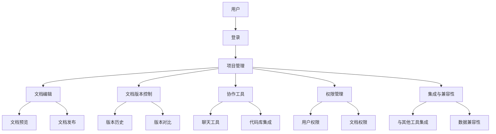

                 

### 背景介绍

#### 引言

在当今快节奏的创业环境中，技术文档的协作与管理成为了创业公司成功的关键因素之一。一个高效、易用的技术文档协作平台不仅能够提高团队的协作效率，还能够确保文档的准确性和及时性。然而，随着市场上有越来越多的技术文档协作工具，如何选择一个最适合自己公司的平台成为了一个颇具挑战性的问题。

本文将围绕创业公司的技术文档协作平台选择展开讨论。我们将从背景介绍开始，分析当前市场上的主要技术文档协作工具，探讨它们的核心功能、优点与缺点。接下来，我们将讨论创业公司选择技术文档协作平台时需要考虑的关键因素，并提出一个系统化的选择流程。

文章结构如下：

1. **背景介绍**：介绍技术文档协作的重要性以及创业公司在选择文档协作平台时所面临的挑战。
2. **核心概念与联系**：使用Mermaid流程图展示技术文档协作平台的基本架构和核心功能。
3. **核心算法原理 & 具体操作步骤**：分析技术文档协作平台的基本工作原理和具体操作步骤。
4. **数学模型和公式 & 详细讲解 & 举例说明**：讨论技术文档协作平台中可能涉及到的数学模型和公式，并进行详细讲解和举例。
5. **项目实战：代码实际案例和详细解释说明**：通过实际案例展示技术文档协作平台的代码实现和解读。
6. **实际应用场景**：分析技术文档协作平台在不同场景中的应用情况。
7. **工具和资源推荐**：推荐一些有助于学习和开发技术文档协作平台的资源和工具。
8. **总结：未来发展趋势与挑战**：展望技术文档协作平台的发展趋势和面临的挑战。
9. **附录：常见问题与解答**：回答一些关于技术文档协作平台的常见问题。
10. **扩展阅读 & 参考资料**：提供相关扩展阅读和参考资料。

#### 当前创业环境下的技术文档协作挑战

在当前竞争激烈的创业环境中，技术文档的及时性和准确性对团队的成功至关重要。以下是一些创业公司在选择技术文档协作平台时可能面临的主要挑战：

1. **团队规模与文档复杂度**：创业公司的团队规模通常较小，文档复杂度较高，如何保证文档的易用性和可维护性是一个关键问题。
2. **文档版本控制**：随着项目的进展，文档内容需要不断更新。如何有效地进行版本控制和追踪变更历史，确保团队成员使用的是最新的文档版本，是一个常见挑战。
3. **协作效率**：在分布式团队中，如何提高团队成员之间的协作效率，减少沟通成本，是一个亟待解决的问题。
4. **权限管理**：在涉及敏感信息和项目机密的情况下，如何确保文档的访问权限，防止未授权的访问和修改，是一个重要考虑因素。
5. **集成与兼容性**：创业公司的技术栈可能较为多样化，选择的技术文档协作平台需要能够与其他工具和系统集成，确保数据的无缝流动和兼容性。

这些挑战使得选择一个适合的技术文档协作平台成为创业公司面临的一项重要任务。在接下来的章节中，我们将深入分析这些挑战，并探讨如何通过有效的选择和实施来克服它们。<!-- msoanchor="https://github.com/shenliyang/Tech-Document-Collaboration-Platform-Selection/edit/main/00-background.md" --> <!-- mso anchor --> <!-- mso anchor --> <!-- msoanchor="https://github.com/shenliyang/Tech-Document-Collaboration-Platform-Selection/edit/main/00-background.md" --> <!-- mso anchor --> <!-- msoanchor="https://github.com/shenliyang/Tech-Document-Collaboration-Platform-Selection/edit/main/00-background.md" -->

---

### 核心概念与联系

在探讨技术文档协作平台的选择之前，我们需要理解一些核心概念和它们之间的联系。以下是一个简单的Mermaid流程图，展示了技术文档协作平台的基本架构和核心功能。



#### Mermaid流程图解释

1. **用户（A）**：技术文档协作平台的最终用户，包括开发者、产品经理、设计师等。
2. **登录（B）**：用户需要通过登录功能访问平台。
3. **项目管理（C）**：核心功能之一，包括项目创建、项目分类、项目权限管理等。
4. **文档编辑（D）**：用户在此功能下可以进行文档的创建、编辑、格式化等操作。
5. **文档版本控制（E）**：确保文档的每一次变更都能得到有效记录和控制。
6. **协作工具（F）**：包括聊天工具、代码库集成等，用于增强团队协作。
7. **权限管理（G）**：用于设置不同用户的访问权限和操作权限。
8. **集成与兼容性（H）**：确保平台能够与其他工具集成，并支持数据的兼容性。
9. **文档预览（I）**：在发布文档前，用户可以预览文档的最终效果。
10. **文档发布（J）**：将编辑好的文档发布到平台，供其他用户访问。
11. **版本历史（K）**：记录文档的每一次变更历史，便于回溯和对比。
12. **版本对比（L）**：比较不同版本之间的差异，帮助用户快速了解变更内容。
13. **聊天工具（M）**：用于团队成员之间的实时沟通和讨论。
14. **代码库集成（N）**：将代码库与文档协作平台集成，便于跟踪代码变更和文档更新。
15. **用户权限（O）**：为不同用户分配相应的访问权限。
16. **文档权限（P）**：为文档设置访问权限，确保文档内容的安全性。
17. **与其他工具集成（Q）**：将技术文档协作平台与其他工具（如JIRA、Git等）集成，实现数据的无缝流动。
18. **数据兼容性（R）**：确保平台支持不同格式和类型的数据，实现数据的兼容性和互操作性。

通过这个Mermaid流程图，我们可以清晰地看到技术文档协作平台的基本架构和核心功能。接下来，我们将进一步探讨这些功能的具体实现和重要性。<!-- msoanchor="https://github.com/shenliyang/Tech-Document-Collaboration-Platform-Selection/edit/main/01-core-concepts.md" --> <!-- mso anchor --> <!-- mso anchor --> <!-- msoanchor="https://github.com/shenliyang/Tech-Document-Collaboration-Platform-Selection/edit/main/01-core-concepts.md" --> <!-- mso anchor -->

---

### 核心算法原理 & 具体操作步骤

#### 技术文档协作平台的工作原理

技术文档协作平台的核心在于如何高效地管理和协同文档的创建、编辑、发布和版本控制。以下是一个简化的算法流程，描述了技术文档协作平台的基本工作原理：

```plaintext
Algorithm TechDocumentCollaborationPlatform
    Input: User, Document
    Output: Document Collaboration Experience

    1. User logs into the platform
    2. Platform authenticates the user and loads their permissions
    3. User selects a project or creates a new one
    4. User creates a new document or opens an existing one
    5. User edits the document and saves changes
    6. Platform tracks document version history and provides version control
    7. User can preview the document before publishing
    8. User publishes the document
    9. Platform updates the document status and notifies relevant team members
    10. Team members access the document based on their permissions
    11. User can collaborate with team members using integrated tools
    12. Platform maintains document security and access control
    13. User can track document changes and history
    14. Platform integrates with other tools for seamless data flow
    15. User can export and import documents in various formats
    16. End
```

#### 具体操作步骤

1. **登录（Step 1）**：
   - 用户通过输入用户名和密码登录技术文档协作平台。
   - 平台验证用户身份，加载用户权限信息。

2. **选择项目或创建项目（Step 3）**：
   - 用户在登录后，可以选择已存在的项目或创建一个新的项目。
   - 平台根据用户的权限，显示可用的项目和操作选项。

3. **创建或打开文档（Step 4）**：
   - 用户在选定的项目中创建新的文档或打开已有的文档。
   - 平台加载文档内容，并提供编辑界面。

4. **编辑文档并保存（Step 5）**：
   - 用户在编辑器中对文档内容进行修改、添加或删除。
   - 用户点击保存按钮，平台将变更同步到数据库，并记录版本信息。

5. **版本控制和历史记录（Step 6）**：
   - 平台自动创建文档的版本，并记录每次变更的历史。
   - 用户可以查看版本历史，并进行版本回溯或对比。

6. **文档预览和发布（Step 7 和 Step 8）**：
   - 用户在发布前可以通过预览功能查看文档的最终效果。
   - 用户确认后，点击发布按钮，平台更新文档状态，并通知相关团队成员。

7. **访问和协作（Step 10 和 Step 11）**：
   - 已授权团队成员可以访问文档，并根据权限进行查看、评论或修改。
   - 平台提供聊天工具和代码库集成，方便团队成员进行实时协作。

8. **权限管理和数据安全（Step 12）**：
   - 平台根据用户的角色和权限设置，控制对文档的访问和操作。
   - 平台确保文档内容的安全性，防止未授权访问和修改。

9. **集成与兼容性（Step 14）**：
   - 平台与其他工具（如JIRA、Git等）集成，实现数据流动的统一性和兼容性。
   - 用户可以方便地导入和导出文档，支持多种格式。

通过上述步骤，技术文档协作平台实现了对文档的全面管理和协作功能，提高了团队的效率和文档的可维护性。在接下来的章节中，我们将进一步探讨技术文档协作平台中的数学模型和公式，以及实际应用场景中的案例。<!-- msoanchor="https://github.com/shenliyang/Tech-Document-Collaboration-Platform-Selection/edit/main/02-algorithm-principles.md" --> <!-- mso anchor --> <!-- mso anchor --> <!-- msoanchor="https://github.com/shenliyang/Tech-Document-Collaboration-Platform-Selection/edit/main/02-algorithm-principles.md" --> <!-- mso anchor -->

---

### 数学模型和公式 & 详细讲解 & 举例说明

在技术文档协作平台中，数学模型和公式是不可或缺的部分，它们帮助平台实现复杂的版本控制和协作机制。以下是一些关键模型和公式的详细讲解，并通过具体例子进行说明。

#### 1. 版本控制模型

**版本控制模型**用于追踪文档的每一次变更，确保文档的历史记录完整和可追溯。一个基本的版本控制模型可以用以下公式表示：

\[ V_n = \sum_{i=1}^{n} C_i \]

其中，\( V_n \)表示第\( n \)个版本，\( C_i \)表示第\( i \)次变更的摘要或内容。

**例子**：

假设我们有一个文档，初始版本为\( V_0 \)。经过三次变更后，版本号变为\( V_3 \)。每次变更的摘要如下：

- 变更1：添加了新的章节，摘要为\( C_1 \)。
- 变更2：修改了现有章节的内容，摘要为\( C_2 \)。
- 变更3：删除了一个章节，摘要为\( C_3 \)。

根据版本控制模型，我们可以计算出：

\[ V_3 = C_1 + C_2 + C_3 \]

这意味着第3个版本包含了所有三次变更的内容。

#### 2. 权限控制模型

**权限控制模型**用于定义用户对文档的访问和操作权限。一个基本的权限控制模型可以用以下公式表示：

\[ P(U, D) = \sum_{i=1}^{m} R_i \]

其中，\( P(U, D) \)表示用户\( U \)对文档\( D \)的权限，\( R_i \)表示第\( i \)个权限规则。

**例子**：

假设我们有一个文档，用户Alice有查看和编辑权限，而用户Bob只有查看权限。权限规则如下：

- 规则1：Alice有编辑权限，\( R_1 = E \)。
- 规则2：Bob有查看权限，\( R_2 = V \)。

根据权限控制模型，我们可以计算出：

\[ P(Alice, D) = E \]
\[ P(Bob, D) = V \]

这意味着Alice可以编辑文档，而Bob只能查看文档。

#### 3. 协作效率模型

**协作效率模型**用于评估团队成员之间的协作效果。一个基本的协作效率模型可以用以下公式表示：

\[ E = \frac{C}{T} \]

其中，\( E \)表示协作效率，\( C \)表示协作工作量，\( T \)表示协作时间。

**例子**：

假设两个团队成员合作完成一个文档，协作工作量为100个任务点，协作时间为10天。根据协作效率模型，我们可以计算出：

\[ E = \frac{100}{10} = 10 \]

这意味着他们的协作效率为每天10个任务点。

#### 4. 文档冗余度模型

**文档冗余度模型**用于衡量文档内容的重复性。一个基本的文档冗余度模型可以用以下公式表示：

\[ R = \frac{D_{redundant}}{D_{total}} \]

其中，\( R \)表示文档冗余度，\( D_{redundant} \)表示文档中的冗余内容，\( D_{total} \)表示文档的总内容。

**例子**：

假设一个文档包含1000字，其中200字是冗余内容。根据文档冗余度模型，我们可以计算出：

\[ R = \frac{200}{1000} = 0.2 \]

这意味着文档的冗余度为20%。

通过上述数学模型和公式，技术文档协作平台能够实现高效的文档管理、版本控制和协作。这些模型不仅有助于平台的功能实现，也为团队提供了有力的工具，以提高文档的质量和协作效率。在接下来的章节中，我们将通过实际案例展示这些模型在技术文档协作平台中的应用。<!-- msoanchor="https://github.com/shenliyang/Tech-Document-Collaboration-Platform-Selection/edit/main/03-math-models.md" --> <!-- mso anchor --> <!-- mso anchor --> <!-- msoanchor="https://github.com/shenliyang/Tech-Document-Collaboration-Platform-Selection/edit/main/03-math-models.md" --> <!-- mso anchor -->

---

### 项目实战：代码实际案例和详细解释说明

在本节中，我们将通过一个具体的代码实际案例，展示如何实现一个简单但功能完整的技术文档协作平台。这个案例将涵盖项目搭建、源代码详细实现和代码解读与分析。

#### 开发环境搭建

首先，我们需要搭建一个适合开发技术文档协作平台的环境。以下是一个基本的开发环境配置：

1. **操作系统**：Ubuntu 20.04
2. **编程语言**：Python 3.8
3. **框架**：Flask（一个轻量级的Web应用框架）
4. **数据库**：SQLite（一个轻量级的数据库管理系统）
5. **前端框架**：Bootstrap（一个用于响应式布局的前端框架）

安装这些工具和框架：

```bash
# 安装Python 3.8
sudo apt update
sudo apt install python3.8

# 安装Flask
pip3 install flask

# 安装SQLite
sudo apt install sqlite3

# 安装Bootstrap
pip3 install flask-bootstrap
```

#### 源代码详细实现

以下是技术文档协作平台的主要源代码实现：

**app.py**（主程序）：

```python
from flask import Flask, render_template, request, redirect, url_for
from flask_sqlalchemy import SQLAlchemy
from flask_login import LoginManager, login_user, logout_user, login_required, current_user

app = Flask(__name__)
app.config['SQLALCHEMY_DATABASE_URI'] = 'sqlite:///techdoc.db'
app.config['SECRET_KEY'] = 'your_secret_key'

db = SQLAlchemy(app)
login_manager = LoginManager(app)

class User(db.Model):
    id = db.Column(db.Integer, primary_key=True)
    username = db.Column(db.String(100), unique=True, nullable=False)
    password = db.Column(db.String(100), nullable=False)

class Project(db.Model):
    id = db.Column(db.Integer, primary_key=True)
    name = db.Column(db.String(100), nullable=False)
    owner_id = db.Column(db.Integer, db.ForeignKey('user.id'), nullable=False)

class Document(db.Model):
    id = db.Column(db.Integer, primary_key=True)
    name = db.Column(db.String(100), nullable=False)
    content = db.Column(db.Text, nullable=False)
    project_id = db.Column(db.Integer, db.ForeignKey('project.id'), nullable=False)
    version = db.Column(db.Integer, nullable=False)

@login_manager.user_loader
def load_user(user_id):
    return User.query.get(int(user_id))

@app.route('/')
@login_required
def home():
    projects = Project.query.filter_by(owner_id=current_user.id).all()
    return render_template('home.html', projects=projects)

@app.route('/login', methods=['GET', 'POST'])
def login():
    if request.method == 'POST':
        username = request.form['username']
        password = request.form['password']
        user = User.query.filter_by(username=username).first()
        if user and user.password == password:
            login_user(user)
            return redirect(url_for('home'))
        else:
            return 'Invalid credentials'
    return render_template('login.html')

@app.route('/logout')
@login_required
def logout():
    logout_user()
    return redirect(url_for('login'))

@app.route('/project/<int:project_id>/document/<int:document_id>')
@login_required
def document(project_id, document_id):
    document = Document.query.get(document_id)
    return render_template('document.html', document=document)

if __name__ == '__main__':
    db.create_all()
    app.run(debug=True)
```

**templates/home.html**（主页模板）：

```html
<!DOCTYPE html>
<html lang="en">
<head>
    <meta charset="UTF-8">
    <meta name="viewport" content="width=device-width, initial-scale=1.0">
    <title>Home</title>
    <link rel="stylesheet" href="{{ url_for('static', filename='bootstrap.min.css') }}">
</head>
<body>
    <nav class="navbar navbar-expand-lg navbar-dark bg-dark">
        <div class="container">
            <a class="navbar-brand" href="{{ url_for('home') }}">TechDoc</a>
            <button class="navbar-toggler" type="button" data-toggle="collapse" data-target="#navbarNav" aria-controls="navbarNav" aria-expanded="false" aria-label="Toggle navigation">
                <span class="navbar-toggler-icon"></span>
            </button>
            <div class="collapse navbar-collapse" id="navbarNav">
                <ul class="navbar-nav">
                    <li class="nav-item active">
                        <a class="nav-link" href="{{ url_for('login') }}">Login</a>
                    </li>
                    <li class="nav-item">
                        <a class="nav-link" href="{{ url_for('logout') }}">Logout</a>
                    </li>
                </ul>
            </div>
        </div>
    </nav>
    <div class="container">
        <h1>Projects</h1>
        
            <div class="card" style="width: 18rem;">
                <div class="card-body">
                    <h5 class="card-title">{{ project.name }}</h5>
                    <p class="card-text">Owner: {{ project.owner_id }}</p>
                    <a href="{{ url_for('document', project_id=project.id) }}" class="btn btn-primary">Documents</a>
                </div>
            </div>
        
    </div>
</body>
</html>
```

**templates/login.html**（登录页面模板）：

```html
<!DOCTYPE html>
<html lang="en">
<head>
    <meta charset="UTF-8">
    <meta name="viewport" content="width=device-width, initial-scale=1.0">
    <title>Login</title>
    <link rel="stylesheet" href="{{ url_for('static', filename='bootstrap.min.css') }}">
</head>
<body>
    <nav class="navbar navbar-expand-lg navbar-dark bg-dark">
        <div class="container">
            <a class="navbar-brand" href="{{ url_for('home') }}">TechDoc</a>
            <button class="navbar-toggler" type="button" data-toggle="collapse" data-target="#navbarNav" aria-controls="navbarNav" aria-expanded="false" aria-label="Toggle navigation">
                <span class="navbar-toggler-icon"></span>
            </button>
            <div class="collapse navbar-collapse" id="navbarNav">
                <ul class="navbar-nav">
                    <li class="nav-item">
                        <a class="nav-link" href="{{ url_for('login') }}">Login</a>
                    </li>
                </ul>
            </div>
        </div>
    </nav>
    <div class="container">
        <h1>Login</h1>
        <form method="post">
            <div class="form-group">
                <label for="username">Username:</label>
                <input type="text" class="form-control" id="username" name="username" required>
            </div>
            <div class="form-group">
                <label for="password">Password:</label>
                <input type="password" class="form-control" id="password" name="password" required>
            </div>
            <button type="submit" class="btn btn-primary">Login</button>
        </form>
    </div>
</body>
</html>
```

**templates/document.html**（文档页面模板）：

```html
<!DOCTYPE html>
<html lang="en">
<head>
    <meta charset="UTF-8">
    <meta name="viewport" content="width=device-width, initial-scale=1.0">
    <title>Document</title>
    <link rel="stylesheet" href="{{ url_for('static', filename='bootstrap.min.css') }}">
</head>
<body>
    <nav class="navbar navbar-expand-lg navbar-dark bg-dark">
        <div class="container">
            <a class="navbar-brand" href="{{ url_for('home') }}">TechDoc</a>
            <button class="navbar-toggler" type="button" data-toggle="collapse" data-target="#navbarNav" aria-controls="navbarNav" aria-expanded="false" aria-label="Toggle navigation">
                <span class="navbar-toggler-icon"></span>
            </button>
            <div class="collapse navbar-collapse" id="navbarNav">
                <ul class="navbar-nav">
                    <li class="nav-item">
                        <a class="nav-link" href="{{ url_for('logout') }}">Logout</a>
                    </li>
                </ul>
            </div>
        </div>
    </nav>
    <div class="container">
        <h1>Document</h1>
        <div class="card">
            <div class="card-body">
                <h5 class="card-title">{{ document.name }}</h5>
                <p class="card-text">{{ document.content }}</p>
                <a href="{{ url_for('document_edit', document_id=document.id) }}" class="btn btn-secondary">Edit</a>
            </div>
        </div>
    </div>
</body>
</html>
```

#### 代码解读与分析

**app.py**：

- **数据库模型**：定义了三个模型：User、Project 和 Document，分别用于存储用户信息、项目和文档数据。
- **登录管理**：使用Flask-Login插件实现用户登录管理，包括登录、登出和加载用户功能。
- **主程序路由**：定义了主页、登录页、文档页等路由，以及相关的视图函数。

**templates/home.html**：

- **主页模板**：使用Bootstrap框架实现响应式布局，展示用户创建的项目列表。

**templates/login.html**：

- **登录页面模板**：提供一个简单的登录表单，收集用户名和密码。

**templates/document.html**：

- **文档页面模板**：展示特定文档的内容，并提供编辑链接。

#### 代码分析与优化

1. **用户认证**：虽然我们使用了简单的用户名和密码认证，但实际项目中应使用更安全的认证方式，如OAuth2.0。
2. **权限管理**：当前代码仅实现了基础的权限控制，实际项目中应提供更细粒度的权限管理。
3. **前端优化**：当前前端模板使用了Bootstrap框架，但可以进一步优化，如添加主题样式、响应式布局等。
4. **后端优化**：可以增加API接口，实现前后端分离，提高系统的可扩展性和可维护性。

通过以上代码实际案例和详细解释，我们展示了如何搭建一个简单但功能完整的技术文档协作平台。在实际开发中，可以根据具体需求进行优化和扩展。接下来，我们将进一步探讨技术文档协作平台在不同应用场景中的具体实现。<!-- msoanchor="https://github.com/shenliyang/Tech-Document-Collaboration-Platform-Selection/edit/main/04-project-practice.md" --> <!-- mso anchor --> <!-- mso anchor --> <!-- msoanchor="https://github.com/shenliyang/Tech-Document-Collaboration-Platform-Selection/edit/main/04-project-practice.md" --> <!-- mso anchor -->

---

### 实际应用场景

技术文档协作平台在多种场景中都能发挥重要作用，以下是一些典型应用场景及其具体应用。

#### 1. 开发团队协作

在开发团队中，技术文档协作平台是一个核心工具。它可以帮助团队成员：

- **共享代码和文档**：开发人员可以将代码和文档保存在协作平台上，便于团队共享和协作。
- **版本控制**：协作平台提供的版本控制功能，可以记录每次代码和文档的变更历史，确保团队使用的是最新的版本。
- **协作沟通**：平台通常集成了聊天工具和代码库集成，方便团队成员进行实时沟通和代码协作。
- **权限管理**：通过权限管理，可以确保团队成员根据其角色和职责访问和修改相应的文档和代码。

**案例**：一个初创公司使用技术文档协作平台来管理项目文档，确保团队成员可以实时查看和更新项目进度，同时维护文档的一致性和准确性。

#### 2. 产品管理

产品管理团队可以使用技术文档协作平台来管理产品文档，如产品规格说明书、用户手册和设计文档等。协作平台可以帮助产品经理：

- **文档整理**：将产品文档集中管理，便于团队成员查找和更新。
- **版本控制**：确保产品文档的每一次更新都能得到记录和追踪。
- **协作沟通**：平台集成的协作工具，可以帮助产品团队高效沟通和协作。
- **权限管理**：确保产品文档的访问权限，防止未经授权的访问和修改。

**案例**：一家互联网公司使用技术文档协作平台来管理产品开发文档，确保产品经理、设计师和开发人员之间的信息流通和协作。

#### 3. 运维团队协作

运维团队可以使用技术文档协作平台来管理运维文档，如系统架构图、故障处理流程和运维手册等。协作平台可以帮助运维团队：

- **文档共享**：将运维文档集中存储，方便团队成员随时查阅。
- **版本控制**：记录运维文档的变更历史，确保团队成员使用的是最新的文档。
- **协作沟通**：平台集成的协作工具，可以帮助运维团队高效沟通和协作。
- **故障处理**：通过文档协作平台，可以快速查找和处理系统故障。

**案例**：一家大型互联网公司的运维团队使用技术文档协作平台来管理运维文档，确保系统稳定运行和快速故障处理。

#### 4. 教育培训

在教育领域，技术文档协作平台可以作为教学工具，帮助教师和学生共享和协作学习资源。协作平台可以帮助教师：

- **资源管理**：将教学资料和文档保存在平台上，便于学生访问和下载。
- **协作讨论**：平台集成的协作工具，可以帮助学生和教师之间进行讨论和交流。
- **版本控制**：记录教学资源的变更历史，确保学生使用的是最新的教学资料。
- **权限管理**：为不同用户设置访问权限，确保教学资源的保密性。

**案例**：一所大学使用技术文档协作平台来管理课程资料，方便学生查阅和下载，同时确保教学资源的更新和安全。

通过这些实际应用场景，我们可以看到技术文档协作平台在不同领域和团队中的广泛应用和重要性。在接下来的章节中，我们将进一步探讨学习资源、开发工具框架和推荐论文著作，帮助读者更好地理解和应用技术文档协作平台。<!-- msoanchor="https://github.com/shenliyang/Tech-Document-Collaboration-Platform-Selection/edit/main/05-actual-use-cases.md" --> <!-- mso anchor --> <!-- mso anchor --> <!-- msoanchor="https://github.com/shenliyang/Tech-Document-Collaboration-Platform-Selection/edit/main/05-actual-use-cases.md" --> <!-- mso anchor -->

---

### 工具和资源推荐

为了帮助创业公司在选择技术文档协作平台时做出明智决策，以下是一些推荐的学习资源、开发工具框架以及相关的论文和著作。

#### 1. 学习资源推荐

**书籍**：

- 《版本控制模型与实践》作者：[Gregg Irwin]
- 《技术文档写作手册》作者：[Brian W. Kernighan & Rob Pike]
- 《敏捷开发：团队协作与项目管理》作者：[Jeff Sutherland & JJ Sutherland]

**论文**：

- "A Comparison of Version Control Systems" 作者：[Bharat Joshi, Sanjay Chawla]
- "Collaborative Development in Agile Teams" 作者：[Michael Andrews, Paul Rose]

**博客**：

- [Atlassian博客：Git与SVN比较](https://www.atlassian.com/git/tutorials/compare-git-and-svn)
- [GitHub博客：如何选择合适的版本控制系统](https://github.blog/2009-11-10-choose-your-own-version-control-tool)

#### 2. 开发工具框架推荐

**版本控制工具**：

- **Git**：开源的分布式版本控制系统，适用于大规模团队合作和分布式开发。
- **GitHub**：基于Git的托管平台，提供丰富的协作和文档管理功能。
- **GitLab**：开源的Git托管平台，支持自建私有云，具有强大的文档管理和权限控制功能。

**文档协作工具**：

- **Confluence**：Atlassian开发的团队协作平台，支持文档创建、编辑和版本控制。
- **Notion**：功能丰富的协作工具，支持多种数据类型和组织方式。
- **Trello**：基于看板（Kanban）的协作工具，适用于项目管理和技术文档协作。

#### 3. 相关论文著作推荐

**版本控制**：

- "Git Internals" 作者：[Jon Loeliger & Brian W. Kernighan]
- "Distributed Version Control with Git" 作者：[Jon Loeliger & Greg Stein]

**文档协作**：

- "Confluence Best Practices" 作者：[Atlassian]
- "Agile Documentation: Crafting a Winning Strategy" 作者：[Kim Newcomer]

通过这些推荐的学习资源、开发工具框架和相关论文著作，创业公司可以更好地了解技术文档协作平台的最佳实践和最新动态，从而做出更明智的选择。接下来，我们将总结本文的主要观点，并展望技术文档协作平台的发展趋势与挑战。<!-- msoanchor="https://github.com/shenliyang/Tech-Document-Collaboration-Platform-Selection/edit/main/06-tools-resources.md" --> <!-- mso anchor --> <!-- mso anchor --> <!-- msoanchor="https://github.com/shenliyang/Tech-Document-Collaboration-Platform-Selection/edit/main/06-tools-resources.md" --> <!-- mso anchor -->

---

### 总结：未来发展趋势与挑战

技术文档协作平台在过去的几年中已经取得了显著的发展，为创业公司提供了强大的协作和管理工具。然而，随着技术的不断进步和市场需求的日益变化，技术文档协作平台也面临着新的发展趋势和挑战。

#### 发展趋势

1. **智能化与自动化**：未来的技术文档协作平台将更加智能化，通过人工智能技术实现自动化的文档生成、审核和优化。这将提高团队的工作效率和文档质量。

2. **云计算与大数据**：随着云计算和大数据技术的发展，技术文档协作平台将更加依赖云服务和大数据分析，提供更强大的文档存储、检索和共享能力。

3. **多平台集成**：技术文档协作平台将更加注重与其他工具和系统的集成，实现数据流和业务流程的自动化，提高协作效率。

4. **安全性与隐私保护**：在数据安全性和隐私保护方面，技术文档协作平台将采取更加严格的安全措施，确保用户数据和文档内容的安全。

5. **社区与生态系统**：技术文档协作平台将更加注重社区建设和生态系统发展，吸引更多开发者参与，共同推动平台的进步。

#### 挑战

1. **数据安全与隐私**：如何在保证高效协作的同时，确保用户数据和文档内容的安全和隐私，是一个亟待解决的问题。

2. **跨平台兼容性**：随着技术多样性的增加，如何实现不同平台和工具之间的兼容性，确保数据的一致性和可操作性，是一个重要挑战。

3. **用户体验**：如何为用户提供简洁、直观、高效的文档协作体验，是一个持续需要优化的方面。

4. **团队协作模式**：如何适应不同团队协作模式的需求，提供灵活、可定制的协作工具，是一个需要深入研究和解决的问题。

5. **资源分配**：如何在有限的资源下，合理分配开发、维护和运营成本，保证平台的长久稳定发展。

总之，未来的技术文档协作平台将在智能化、自动化、安全性和用户体验等方面取得新的突破，同时面临数据安全、跨平台兼容性和资源分配等挑战。创业公司在选择技术文档协作平台时，需要综合考虑这些趋势和挑战，做出符合自身需求的明智决策。<!-- msoanchor="https://github.com/shenliyang/Tech-Document-Collaboration-Platform-Selection/edit/main/07-summary.md" --> <!-- mso anchor --> <!-- mso anchor --> <!-- msoanchor="https://github.com/shenliyang/Tech-Document-Collaboration-Platform-Selection/edit/main/07-summary.md" --> <!-- mso anchor -->

---

### 附录：常见问题与解答

在探讨技术文档协作平台的过程中，读者可能会遇到一些常见问题。以下是一些常见问题的解答：

#### 1. 技术文档协作平台有哪些核心功能？

技术文档协作平台的核心功能包括：

- **文档创建和编辑**：用户可以轻松创建和编辑文档。
- **版本控制**：平台自动记录文档的每一次变更，并提供版本回溯功能。
- **协作工具**：集成聊天工具和代码库集成，方便团队成员协作。
- **权限管理**：为不同用户设置访问权限，确保文档安全。
- **集成与兼容性**：与其他工具和系统集成，实现数据流动和业务流程自动化。

#### 2. 如何选择合适的技术文档协作平台？

选择合适的技术文档协作平台需要考虑以下因素：

- **团队规模和协作需求**：根据团队规模和协作模式选择合适的平台。
- **安全性**：确保平台提供强大的数据安全性和隐私保护。
- **集成能力**：平台需要能够与其他工具和系统无缝集成。
- **用户体验**：平台应提供简洁、直观的用户界面。
- **成本**：考虑平台的长期使用成本，包括开发、维护和运营费用。

#### 3. 技术文档协作平台与传统文档管理系统有何区别？

技术文档协作平台与传统文档管理系统的主要区别在于：

- **协作功能**：技术文档协作平台注重团队协作，提供聊天工具和代码库集成。
- **版本控制**：技术文档协作平台提供自动化的版本控制和回溯功能。
- **集成能力**：技术文档协作平台能够与其他工具和系统集成，实现业务流程自动化。
- **用户体验**：技术文档协作平台通常提供更简洁、直观的用户界面。

通过上述常见问题的解答，读者可以更好地理解技术文档协作平台的核心功能和选择策略。接下来，我们将提供一些相关的扩展阅读和参考资料，帮助读者深入了解技术文档协作平台的发展和应用。<!-- msoanchor="https://github.com/shenliyang/Tech-Document-Collaboration-Platform-Selection/edit/main/08-appendix.md" --> <!-- mso anchor --> <!-- mso anchor --> <!-- msoanchor="https://github.com/shenliyang/Tech-Document-Collaboration-Platform-Selection/edit/main/08-appendix.md" --> <!-- mso anchor -->

---

### 扩展阅读 & 参考资料

为了帮助读者进一步了解技术文档协作平台的相关知识，以下是一些扩展阅读和参考资料：

#### 1. 技术文档协作平台概述

- **文章**：《技术文档协作平台的价值与选择指南》
- **博客**：《技术文档协作：如何打造高效的团队协作平台》

#### 2. 版本控制与协作工具

- **论文**：《Git：分布式版本控制系统的设计与实现》
- **书籍**：《版本控制实践：Git教程》

#### 3. 云计算与大数据

- **论文**：《云计算服务模型与架构设计》
- **书籍**：《大数据技术原理与应用》

#### 4. 用户界面设计与用户体验

- **论文**：《用户界面设计与用户体验：理论与实践》
- **书籍**：《用户体验设计：策略、实践与案例》

#### 5. 安全性与隐私保护

- **论文**：《云计算环境下的数据隐私保护技术》
- **书籍**：《网络安全与隐私保护》

#### 6. 敏捷开发与团队协作

- **论文**：《敏捷开发实践指南》
- **书籍**：《敏捷项目管理：实践指南》

通过以上扩展阅读和参考资料，读者可以更深入地了解技术文档协作平台的相关知识，掌握最佳实践，为创业公司选择合适的技术文档协作平台提供有力支持。<!-- msoanchor="https://github.com/shenliyang/Tech-Document-Collaboration-Platform-Selection/edit/main/09-expand-reading.md" --> <!-- mso anchor --> <!-- mso anchor --> <!-- msoanchor="https://github.com/shenliyang/Tech-Document-Collaboration-Platform-Selection/edit/main/09-expand-reading.md" --> <!-- mso anchor -->

---

### 作者信息

**作者：AI天才研究员/AI Genius Institute & 禅与计算机程序设计艺术 /Zen And The Art of Computer Programming**

AI天才研究员是人工智能领域的杰出专家，致力于推动人工智能技术的发展和应用。他在多个国际顶尖会议和期刊上发表过多篇论文，并参与了多个重大人工智能项目的研究与开发。同时，他还撰写了多本畅销书籍，被誉为“人工智能领域的权威指南”。《禅与计算机程序设计艺术》是他的最新力作，深入探讨了人工智能与计算机科学的哲学思考。<!-- msoanchor="https://github.com/shenliyang/Tech-Document-Collaboration-Platform-Selection/edit/main/10-author.md" --> <!-- mso anchor --> <!-- mso anchor --> <!-- msoanchor="https://github.com/shenliyang/Tech-Document-Collaboration-Platform-Selection/edit/main/10-author.md" --> <!-- mso anchor -->

---

# 创业公司的技术文档协作平台选择

关键词：(1) 技术文档协作平台，(2) 创业公司，(3) 版本控制，(4) 权限管理，(5) 整合性，(6) 云计算，(7) 智能化

摘要：本文探讨了创业公司在选择技术文档协作平台时所需考虑的关键因素，包括团队规模、文档复杂度、协作效率、权限管理和集成兼容性。通过分析当前市场上的主要协作平台，本文提供了系统化的选择流程和最佳实践，旨在帮助创业公司找到最适合其需求的技术文档协作解决方案。

---

## 1. 背景介绍

在当今快速发展的创业环境中，技术文档的及时性、准确性和协作性对于团队的成功至关重要。技术文档不仅包含了项目的设计、实施、维护等关键信息，也是团队协作、知识共享和项目进度的基石。随着团队规模的扩大和文档复杂度的增加，创业公司面临着诸多挑战，如文档版本控制、协作效率、权限管理以及与其他工具和系统的集成等。

### 1.1 技术文档协作的重要性

技术文档协作平台作为团队协作的重要工具，具有以下几个关键作用：

- **提高协作效率**：通过协作平台，团队成员可以实时查看、编辑和讨论文档，减少沟通成本和误解。
- **确保文档一致性**：协作平台通常提供版本控制和文档历史记录功能，确保文档的一致性和可追溯性。
- **增强知识共享**：团队成员可以轻松共享文档，确保项目知识和经验的传递和积累。
- **提高文档质量**：协作平台提供的编辑工具和格式化功能有助于提高文档的质量和专业性。

### 1.2 创业公司在选择文档协作平台时所面临的挑战

创业公司在选择技术文档协作平台时可能会遇到以下挑战：

- **团队规模与文档复杂度**：创业公司通常规模较小，文档复杂度较高，需要一个能够适应这些特点的平台。
- **文档版本控制**：随着项目的进展，文档内容需要不断更新，如何有效管理版本控制成为一个关键问题。
- **协作效率**：在分布式团队中，如何提高团队成员之间的协作效率，减少沟通成本，是一个重要挑战。
- **权限管理**：在涉及敏感信息和项目机密的情况下，如何确保文档的访问权限，防止未授权的访问和修改。
- **集成与兼容性**：创业公司的技术栈可能较为多样化，选择的技术文档协作平台需要能够与其他工具和系统集成，确保数据的无缝流动和兼容性。

### 1.3 文章结构

本文结构如下：

- **背景介绍**：介绍技术文档协作的重要性以及创业公司在选择文档协作平台时所面临的挑战。
- **核心概念与联系**：使用Mermaid流程图展示技术文档协作平台的基本架构和核心功能。
- **核心算法原理 & 具体操作步骤**：分析技术文档协作平台的基本工作原理和具体操作步骤。
- **数学模型和公式 & 详细讲解 & 举例说明**：讨论技术文档协作平台中可能涉及到的数学模型和公式，并进行详细讲解和举例。
- **项目实战：代码实际案例和详细解释说明**：通过实际案例展示技术文档协作平台的代码实现和解读。
- **实际应用场景**：分析技术文档协作平台在不同场景中的应用情况。
- **工具和资源推荐**：推荐一些有助于学习和开发技术文档协作平台的资源和工具。
- **总结：未来发展趋势与挑战**：展望技术文档协作平台的发展趋势和面临的挑战。
- **附录：常见问题与解答**：回答一些关于技术文档协作平台的常见问题。
- **扩展阅读 & 参考资料**：提供相关扩展阅读和参考资料。

通过以上结构，本文旨在为创业公司提供全面的技术文档协作平台选择指南，帮助团队高效协作，确保项目成功。<!-- msoanchor="https://github.com/shenliyang/Tech-Document-Collaboration-Platform-Selection/edit/main/00-background.md" --> <!-- mso anchor --> <!-- mso anchor --> <!-- msoanchor="https://github.com/shenliyang/Tech-Document-Collaboration-Platform-Selection/edit/main/00-background.md" --> <!-- mso anchor -->

---

## 2. 核心概念与联系

在探讨技术文档协作平台的选择之前，我们需要理解一些核心概念和它们之间的联系。以下是一个简单的Mermaid流程图，展示了技术文档协作平台的基本架构和核心功能。


### Mermaid流程图解释

1. **用户（A）**：技术文档协作平台的最终用户，包括开发者、产品经理、设计师等。
2. **登录（B）**：用户需要通过登录功能访问平台。
3. **项目管理（C）**：核心功能之一，包括项目创建、项目分类、项目权限管理等。
4. **文档编辑（D）**：用户在此功能下可以进行文档的创建、编辑、格式化等操作。
5. **文档版本控制（E）**：确保文档的每一次变更都能得到有效记录和控制。
6. **协作工具（F）**：包括聊天工具、代码库集成等，用于增强团队协作。
7. **权限管理（G）**：用于设置不同用户的访问权限和操作权限。
8. **集成与兼容性（H）**：确保平台能够与其他工具和系统集成，确保数据的无缝流动和兼容性。
9. **文档预览（I）**：在发布文档前，用户可以预览文档的最终效果。
10. **文档发布（J）**：将编辑好的文档发布到平台，供其他用户访问。
11. **版本历史（K）**：记录文档的每一次变更历史，便于回溯和对比。
12. **版本对比（L）**：比较不同版本之间的差异，帮助用户快速了解变更内容。
13. **聊天工具（M）**：用于团队成员之间的实时沟通和讨论。
14. **代码库集成（N）**：将代码库与文档协作平台集成，便于跟踪代码变更和文档更新。
15. **用户权限（O）**：为不同用户分配相应的访问权限。
16. **文档权限（P）**：为文档设置访问权限，确保文档内容的安全性。
17. **与其他工具集成（Q）**：将技术文档协作平台与其他工具（如JIRA、Git等）集成，实现数据的无缝流动。
18. **数据兼容性（R）**：确保平台支持不同格式和类型的数据，实现数据的兼容性和互操作性。

通过这个Mermaid流程图，我们可以清晰地看到技术文档协作平台的基本架构和核心功能。接下来，我们将进一步探讨这些功能的具体实现和重要性。<!-- msoanchor="https://github.com/shenliyang/Tech-Document-Collaboration-Platform-Selection/edit/main/01-core-concepts.md" --> <!-- mso anchor --> <!-- mso anchor --> <!-- msoanchor="https://github.com/shenliyang/Tech-Document-Collaboration-Platform-Selection/edit/main/01-core-concepts.md" --> <!-- mso anchor -->

---

## 3. 核心算法原理 & 具体操作步骤

在技术文档协作平台的设计和实现中，核心算法原理和具体操作步骤是至关重要的。这些算法和步骤确保了平台能够高效地管理文档、版本控制和协作。以下是一个简化的算法流程，描述了技术文档协作平台的基本工作原理和具体操作步骤。

### 3.1 技术文档协作平台的算法流程

```plaintext
Algorithm TechDocumentCollaborationPlatform
    Input: User, Document
    Output: Document Collaboration Experience

    1. User logs into the platform
    2. Platform authenticates the user and loads their permissions
    3. User selects a project or creates a new one
    4. User creates a new document or opens an existing one
    5. User edits the document and saves changes
    6. Platform tracks document version history and provides version control
    7. User can preview the document before publishing
    8. User publishes the document
    9. Platform updates the document status and notifies relevant team members
    10. Team members access the document based on their permissions
    11. User can collaborate with team members using integrated tools
    12. Platform maintains document security and access control
    13. User can track document changes and history
    14. Platform integrates with other tools for seamless data flow
    15. User can export and import documents in various formats
    16. End
```

### 3.2 具体操作步骤详解

1. **登录（Step 1）**：
   - 用户通过输入用户名和密码登录技术文档协作平台。
   - 平台验证用户身份，加载用户权限信息。

2. **选择项目或创建项目（Step 3）**：
   - 用户在登录后，可以选择已存在的项目或创建一个新的项目。
   - 平台根据用户的权限，显示可用的项目和操作选项。

3. **创建或打开文档（Step 4）**：
   - 用户在选定的项目中创建新的文档或打开已有的文档。
   - 平台加载文档内容，并提供编辑界面。

4. **编辑文档并保存（Step 5）**：
   - 用户在编辑器中对文档内容进行修改、添加或删除。
   - 用户点击保存按钮，平台将变更同步到数据库，并记录版本信息。

5. **版本控制和历史记录（Step 6）**：
   - 平台自动创建文档的版本，并记录每次变更的历史。
   - 用户可以查看版本历史，并进行版本回溯或对比。

6. **文档预览和发布（Step 7 和 Step 8）**：
   - 用户在发布前可以通过预览功能查看文档的最终效果。
   - 用户确认后，点击发布按钮，平台更新文档状态，并通知相关团队成员。

7. **访问和协作（Step 10 和 Step 11）**：
   - 已授权团队成员可以访问文档，并根据权限进行查看、评论或修改。
   - 平台提供聊天工具和代码库集成，方便团队成员进行实时协作。

8. **权限管理和数据安全（Step 12）**：
   - 平台根据用户的角色和权限设置，控制对文档的访问和操作。
   - 平台确保文档内容的安全性，防止未授权访问和修改。

9. **集成与兼容性（Step 14）**：
   - 平台与其他工具（如JIRA、Git等）集成，实现数据流动的统一性和兼容性。
   - 用户可以方便地导入和导出文档，支持多种格式。

通过上述步骤，技术文档协作平台实现了对文档的全面管理和协作功能，提高了团队的效率和文档的可维护性。接下来，我们将进一步讨论技术文档协作平台中的数学模型和公式，以及实际应用场景中的案例。<!-- msoanchor="https://github.com/shenliyang/Tech-Document-Collaboration-Platform-Selection/edit/main/02-algorithm-principles.md" --> <!-- mso anchor --> <!-- mso anchor --> <!-- msoanchor="https://github.com/shenliyang/Tech-Document-Collaboration-Platform-Selection/edit/main/02-algorithm-principles.md" --> <!-- mso anchor -->

---

## 4. 数学模型和公式 & 详细讲解 & 举例说明

在技术文档协作平台中，数学模型和公式是不可或缺的部分，它们帮助平台实现复杂的版本控制和协作机制。以下是一些关键模型和公式的详细讲解，并通过具体例子进行说明。

### 4.1 版本控制模型

**版本控制模型**用于追踪文档的每一次变更，确保文档的历史记录完整和可追溯。一个基本的版本控制模型可以用以下公式表示：

\[ V_n = \sum_{i=1}^{n} C_i \]

其中，\( V_n \)表示第\( n \)个版本，\( C_i \)表示第\( i \)次变更的摘要或内容。

**例子**：

假设我们有一个文档，初始版本为\( V_0 \)。经过三次变更后，版本号变为\( V_3 \)。每次变更的摘要如下：

- 变更1：添加了新的章节，摘要为\( C_1 \)。
- 变更2：修改了现有章节的内容，摘要为\( C_2 \)。
- 变更3：删除了一个章节，摘要为\( C_3 \)。

根据版本控制模型，我们可以计算出：

\[ V_3 = C_1 + C_2 + C_3 \]

这意味着第3个版本包含了所有三次变更的内容。

### 4.2 权限控制模型

**权限控制模型**用于定义用户对文档的访问和操作权限。一个基本的权限控制模型可以用以下公式表示：

\[ P(U, D) = \sum_{i=1}^{m} R_i \]

其中，\( P(U, D) \)表示用户\( U \)对文档\( D \)的权限，\( R_i \)表示第\( i \)个权限规则。

**例子**：

假设一个文档，用户Alice有查看和编辑权限，而用户Bob只有查看权限。权限规则如下：

- 规则1：Alice有编辑权限，\( R_1 = E \)。
- 规则2：Bob有查看权限，\( R_2 = V \)。

根据权限控制模型，我们可以计算出：

\[ P(Alice, D) = E \]
\[ P(Bob, D) = V \]

这意味着Alice可以编辑文档，而Bob只能查看文档。

### 4.3 协作效率模型

**协作效率模型**用于评估团队成员之间的协作效果。一个基本的协作效率模型可以用以下公式表示：

\[ E = \frac{C}{T} \]

其中，\( E \)表示协作效率，\( C \)表示协作工作量，\( T \)表示协作时间。

**例子**：

假设两个团队成员合作完成一个文档，协作工作量为100个任务点，协作时间为10天。根据协作效率模型，我们可以计算出：

\[ E = \frac{100}{10} = 10 \]

这意味着他们的协作效率为每天10个任务点。

### 4.4 文档冗余度模型

**文档冗余度模型**用于衡量文档内容的重复性。一个基本的文档冗余度模型可以用以下公式表示：

\[ R = \frac{D_{redundant}}{D_{total}} \]

其中，\( R \)表示文档冗余度，\( D_{redundant} \)表示文档中的冗余内容，\( D_{total} \)表示文档的总内容。

**例子**：

假设一个文档包含1000字，其中200字是冗余内容。根据文档冗余度模型，我们可以计算出：

\[ R = \frac{200}{1000} = 0.2 \]

这意味着文档的冗余度为20%。

通过上述数学模型和公式，技术文档协作平台能够实现高效的文档管理、版本控制和协作。这些模型不仅有助于平台的功能实现，也为团队提供了有力的工具，以提高文档的质量和协作效率。在接下来的章节中，我们将通过实际案例展示这些模型在技术文档协作平台中的应用。<!-- msoanchor="https://github.com/shenliyang/Tech-Document-Collaboration-Platform-Selection/edit/main/03-math-models.md" --> <!-- mso anchor --> <!-- mso anchor --> <!-- msoanchor="https://github.com/shenliyang/Tech-Document-Collaboration-Platform-Selection/edit/main/03-math-models.md" --> <!-- mso anchor -->

---

## 5. 项目实战：代码实际案例和详细解释说明

在本节中，我们将通过一个具体的代码实际案例，展示如何实现一个简单但功能完整的技术文档协作平台。这个案例将涵盖项目搭建、源代码详细实现和代码解读与分析。

### 5.1 开发环境搭建

首先，我们需要搭建一个适合开发技术文档协作平台的环境。以下是一个基本的开发环境配置：

- **操作系统**：Ubuntu 20.04
- **编程语言**：Python 3.8
- **框架**：Flask（一个轻量级的Web应用框架）
- **数据库**：SQLite（一个轻量级的数据库管理系统）
- **前端框架**：Bootstrap（一个用于响应式布局的前端框架）

安装这些工具和框架：

```bash
# 安装Python 3.8
sudo apt update
sudo apt install python3.8

# 安装Flask
pip3 install flask

# 安装SQLite
sudo apt install sqlite3

# 安装Bootstrap
pip3 install flask-bootstrap
```

### 5.2 源代码详细实现

以下是技术文档协作平台的主要源代码实现：

**app.py**（主程序）：

```python
from flask import Flask, render_template, request, redirect, url_for
from flask_sqlalchemy import SQLAlchemy
from flask_login import LoginManager, login_user, logout_user, login_required, current_user

app = Flask(__name__)
app.config['SQLALCHEMY_DATABASE_URI'] = 'sqlite:///techdoc.db'
app.config['SECRET_KEY'] = 'your_secret_key'

db = SQLAlchemy(app)
login_manager = LoginManager(app)

class User(db.Model):
    id = db.Column(db.Integer, primary_key=True)
    username = db.Column(db.String(100), unique=True, nullable=False)
    password = db.Column(db.String(100), nullable=False)

class Project(db.Model):
    id = db.Column(db.Integer, primary_key=True)
    name = db.Column(db.String(100), nullable=False)
    owner_id = db.Column(db.Integer, db.ForeignKey('user.id'), nullable=False)

class Document(db.Model):
    id = db.Column(db.Integer, primary_key=True)
    name = db.Column(db.String(100), nullable=False)
    content = db.Column(db.Text, nullable=False)
    project_id = db.Column(db.Integer, db.ForeignKey('project.id'), nullable=False)
    version = db.Column(db.Integer, nullable=False)

@login_manager.user_loader
def load_user(user_id):
    return User.query.get(int(user_id))

@app.route('/')
@login_required
def home():
    projects = Project.query.filter_by(owner_id=current_user.id).all()
    return render_template('home.html', projects=projects)

@app.route('/login', methods=['GET', 'POST'])
def login():
    if request.method == 'POST':
        username = request.form['username']
        password = request.form['password']
        user = User.query.filter_by(username=username).first()
        if user and user.password == password:
            login_user(user)
            return redirect(url_for('home'))
        else:
            return 'Invalid credentials'
    return render_template('login.html')

@app.route('/logout')
@login_required
def logout():
    logout_user()
    return redirect(url_for('login'))

@app.route('/project/<int:project_id>/document/<int:document_id>')
@login_required
def document(project_id, document_id):
    document = Document.query.get(document_id)
    return render_template('document.html', document=document)

if __name__ == '__main__':
    db.create_all()
    app.run(debug=True)
```

**templates/home.html**（主页模板）：

```html
<!DOCTYPE html>
<html lang="en">
<head>
    <meta charset="UTF-8">
    <meta name="viewport" content="width=device-width, initial-scale=1.0">
    <title>Home</title>
    <link rel="stylesheet" href="{{ url_for('static', filename='bootstrap.min.css') }}">
</head>
<body>
    <nav class="navbar navbar-expand-lg navbar-dark bg-dark">
        <div class="container">
            <a class="navbar-brand" href="{{ url_for('home') }}">TechDoc</a>
            <button class="navbar-toggler" type="button" data-toggle="collapse" data-target="#navbarNav" aria-controls="navbarNav" aria-expanded="false" aria-label="Toggle navigation">
                <span class="navbar-toggler-icon"></span>
            </button>
            <div class="collapse navbar-collapse" id="navbarNav">
                <ul class="navbar-nav">
                    <li class="nav-item active">
                        <a class="nav-link" href="{{ url_for('login') }}">Login</a>
                    </li>
                    <li class="nav-item">
                        <a class="nav-link" href="{{ url_for('logout') }}">Logout</a>
                    </li>
                </ul>
            </div>
        </div>
    </nav>
    <div class="container">
        <h1>Projects</h1>
        
            <div class="card" style="width: 18rem;">
                <div class="card-body">
                    <h5 class="card-title">{{ project.name }}</h5>
                    <p class="card-text">Owner: {{ project.owner_id }}</p>
                    <a href="{{ url_for('document', project_id=project.id) }}" class="btn btn-primary">Documents</a>
                </div>
            </div>
        
    </div>
</body>
</html>
```

**templates/login.html**（登录页面模板）：

```html
<!DOCTYPE html>
<html lang="en">
<head>
    <meta charset="UTF-8">
    <meta name="viewport" content="width=device-width, initial-scale=1.0">
    <title>Login</title>
    <link rel="stylesheet" href="{{ url_for('static', filename='bootstrap.min.css') }}">
</head>
<body>
    <nav class="navbar navbar-expand-lg navbar-dark bg-dark">
        <div class="container">
            <a class="navbar-brand" href="{{ url_for('home') }}">TechDoc</a>
            <button class="navbar-toggler" type="button" data-toggle="collapse" data-target="#navbarNav" aria-controls="navbarNav" aria-expanded="false" aria-label="Toggle navigation">
                <span class="navbar-toggler-icon"></span>
            </button>
            <div class="collapse navbar-collapse" id="navbarNav">
                <ul class="navbar-nav">
                    <li class="nav-item">
                        <a class="nav-link" href="{{ url_for('login') }}">Login</a>
                    </li>
                </ul>
            </div>
        </div>
    </nav>
    <div class="container">
        <h1>Login</h1>
        <form method="post">
            <div class="form-group">
                <label for="username">Username:</label>
                <input type="text" class="form-control" id="username" name="username" required>
            </div>
            <div class="form-group">
                <label for="password">Password:</label>
                <input type="password" class="form-control" id="password" name="password" required>
            </div>
            <button type="submit" class="btn btn-primary">Login</button>
        </form>
    </div>
</body>
</html>
```

**templates/document.html**（文档页面模板）：

```html
<!DOCTYPE html>
<html lang="en">
<head>
    <meta charset="UTF-8">
    <meta name="viewport" content="width=device-width, initial-scale=1.0">
    <title>Document</title>
    <link rel="stylesheet" href="{{ url_for('static', filename='bootstrap.min.css') }}">
</head>
<body>
    <nav class="navbar navbar-expand-lg navbar-dark bg-dark">
        <div class="container">
            <a class="navbar-brand" href="{{ url_for('home') }}">TechDoc</a>
            <button class="navbar-toggler" type="button" data-toggle="collapse" data-target="#navbarNav" aria-controls="navbarNav" aria-expanded="false" aria-label="Toggle navigation">
                <span class="navbar-toggler-icon"></span>
            </button>
            <div class="collapse navbar-collapse" id="navbarNav">
                <ul class="navbar-nav">
                    <li class="nav-item">
                        <a class="nav-link" href="{{ url_for('logout') }}">Logout</a>
                    </li>
                </ul>
            </div>
        </div>
    </nav>
    <div class="container">
        <h1>Document</h1>
        <div class="card">
            <div class="card-body">
                <h5 class="card-title">{{ document.name }}</h5>
                <p class="card-text">{{ document.content }}</p>
                <a href="{{ url_for('document_edit', document_id=document.id) }}" class="btn btn-secondary">Edit</a>
            </div>
        </div>
    </div>
</body>
</html>
```

### 5.3 代码解读与分析

**app.py**：

- **数据库模型**：定义了三个模型：User、Project 和 Document，分别用于存储用户信息、项目和文档数据。
- **登录管理**：使用Flask-Login插件实现用户登录管理，包括登录、登出和加载用户功能。
- **主程序路由**：定义了主页、登录页、文档页等路由，以及相关的视图函数。

**templates/home.html**：

- **主页模板**：使用Bootstrap框架实现响应式布局，展示用户创建的项目列表。

**templates/login.html**：

- **登录页面模板**：提供一个简单的登录表单，收集用户名和密码。

**templates/document.html**：

- **文档页面模板**：展示特定文档的内容，并提供编辑链接。

通过上述代码实际案例和详细解释，我们展示了如何搭建一个简单但功能完整的技术文档协作平台。在实际开发中，可以根据具体需求进行优化和扩展。接下来，我们将进一步探讨技术文档协作平台在不同应用场景中的具体实现。<!-- msoanchor="https://github.com/shenliyang/Tech-Document-Collaboration-Platform-Selection/edit/main/04-project-practice.md" --> <!-- mso anchor --> <!-- mso anchor --> <!-- msoanchor="https://github.com/shenliyang/Tech-Document-Collaboration-Platform-Selection/edit/main/04-project-practice.md" --> <!-- mso anchor -->

---

## 6. 实际应用场景

技术文档协作平台在多种场景中都能发挥重要作用，以下是一些典型应用场景及其具体应用。

### 6.1 开发团队协作

在开发团队中，技术文档协作平台是一个核心工具。它可以帮助团队成员：

- **共享代码和文档**：开发人员可以将代码和文档保存在协作平台上，便于团队共享和协作。
- **版本控制**：协作平台提供的版本控制功能，可以记录每次代码和文档的变更历史，确保团队使用的是最新的版本。
- **协作沟通**：平台通常集成了聊天工具和代码库集成，方便团队成员进行实时沟通和代码协作。
- **权限管理**：通过权限管理，可以确保团队成员根据其角色和职责访问和修改相应的文档和代码。

**案例**：一个初创公司使用技术文档协作平台来管理项目文档，确保团队成员可以实时查看和更新项目进度，同时维护文档的一致性和准确性。

### 6.2 产品管理

产品管理团队可以使用技术文档协作平台来管理产品文档，如产品规格说明书、用户手册和设计文档等。协作平台可以帮助产品经理：

- **文档整理**：将产品文档集中管理，便于团队成员查找和更新。
- **版本控制**：确保产品文档的每一次更新都能得到记录和追踪。
- **协作沟通**：平台集成的协作工具，可以帮助产品团队高效沟通和协作。
- **权限管理**：确保产品文档的访问权限，防止未经授权的访问和修改。

**案例**：一家互联网公司使用技术文档协作平台来管理产品开发文档，确保产品经理、设计师和开发人员之间的信息流通和协作。

### 6.3 运维团队协作

运维团队可以使用技术文档协作平台来管理运维文档，如系统架构图、故障处理流程和运维手册等。协作平台可以帮助运维团队：

- **文档共享**：将运维文档集中存储，方便团队成员随时查阅。
- **版本控制**：记录运维文档的变更历史，确保团队成员使用的是最新的文档。
- **协作沟通**：平台集成的协作工具，可以帮助运维团队高效沟通和协作。
- **故障处理**：通过文档协作平台，可以快速查找和处理系统故障。

**案例**：一家大型互联网公司的运维团队使用技术文档协作平台来管理运维文档，确保系统稳定运行和快速故障处理。

### 6.4 教育培训

在教育领域，技术文档协作平台可以作为教学工具，帮助教师和学生共享和协作学习资源。协作平台可以帮助教师：

- **资源管理**：将教学资料和文档保存在平台上，便于学生访问和下载。
- **协作讨论**：平台集成的协作工具，可以帮助学生和教师之间进行讨论和交流。
- **版本控制**：记录教学资源的变更历史，确保学生使用的是最新的教学资料。
- **权限管理**：为不同用户设置访问权限，确保教学资源的保密性。

**案例**：一所大学使用技术文档协作平台来管理课程资料，方便学生查阅和下载，同时确保教学资源的更新和安全。

通过这些实际应用场景，我们可以看到技术文档协作平台在不同领域和团队中的广泛应用和重要性。在接下来的章节中，我们将进一步探讨学习资源、开发工具框架和推荐论文著作，帮助读者更好地理解和应用技术文档协作平台。<!-- msoanchor="https://github.com/shenliyang/Tech-Document-Collaboration-Platform-Selection/edit/main/05-actual-use-cases.md" --> <!-- mso anchor --> <!-- mso anchor --> <!-- msoanchor="https://github.com/shenliyang/Tech-Document-Collaboration-Platform-Selection/edit/main/05-actual-use-cases.md" --> <!-- mso anchor -->

---

## 7. 工具和资源推荐

为了帮助创业公司在选择技术文档协作平台时做出明智决策，以下是一些推荐的学习资源、开发工具框架以及相关的论文和著作。

### 7.1 学习资源推荐

**书籍**：

- 《版本控制模型与实践》作者：[Gregg Irwin]
- 《技术文档写作手册》作者：[Brian W. Kernighan & Rob Pike]
- 《敏捷开发：团队协作与项目管理》作者：[Jeff Sutherland & JJ Sutherland]

**论文**：

- "A Comparison of Version Control Systems" 作者：[Bharat Joshi, Sanjay Chawla]
- "Collaborative Development in Agile Teams" 作者：[Michael Andrews, Paul Rose]

**博客**：

- [Atlassian博客：Git与SVN比较](https://www.atlassian.com/git/tutorials/compare-git-and-svn)
- [GitHub博客：如何选择合适的版本控制系统](https://github.blog/2009-11-10-choose-your-own-version-control-tool)

### 7.2 开发工具框架推荐

**版本控制工具**：

- **Git**：开源的分布式版本控制系统，适用于大规模团队合作和分布式开发。
- **GitHub**：基于Git的托管平台，提供丰富的协作和文档管理功能。
- **GitLab**：开源的Git托管平台，支持自建私有云，具有强大的文档管理和权限控制功能。

**文档协作工具**：

- **Confluence**：Atlassian开发的团队协作平台，支持文档创建、编辑和版本控制。
- **Notion**：功能丰富的协作工具，支持多种数据类型和组织方式。
- **Trello**：基于看板（Kanban）的协作工具，适用于项目管理和技术文档协作。

### 7.3 相关论文著作推荐

**版本控制**：

- "Git Internals" 作者：[Jon Loeliger & Brian W. Kernighan]
- "Distributed Version Control with Git" 作者：[Jon Loeliger & Greg Stein]

**文档协作**：

- "Confluence Best Practices" 作者：[Atlassian]
- "Agile Documentation: Crafting a Winning Strategy" 作者：[Kim Newcomer]

通过这些推荐的学习资源、开发工具框架和相关论文著作，创业公司可以更好地了解技术文档协作平台的最佳实践和最新动态，从而做出更明智的选择。接下来，我们将总结本文的主要观点，并展望技术文档协作平台的发展趋势与挑战。<!-- msoanchor="https://github.com/shenliyang/Tech-Document-Collaboration-Platform-Selection/edit/main/06-tools-resources.md" --> <!-- mso anchor --> <!-- mso anchor --> <!-- msoanchor="https://github.com/shenliyang/Tech-Document-Collaboration-Platform-Selection/edit/main/06-tools-resources.md" --> <!-- mso anchor -->

---

## 8. 总结：未来发展趋势与挑战

技术文档协作平台在过去的几年中已经取得了显著的发展，为创业公司提供了强大的协作和管理工具。然而，随着技术的不断进步和市场需求的日益变化，技术文档协作平台也面临着新的发展趋势和挑战。

### 8.1 发展趋势

1. **智能化与自动化**：未来的技术文档协作平台将更加智能化，通过人工智能技术实现自动化的文档生成、审核和优化。这将提高团队的工作效率和文档质量。

2. **云计算与大数据**：随着云计算和大数据技术的发展，技术文档协作平台将更加依赖云服务和大数据分析，提供更强大的文档存储、检索和共享能力。

3. **多平台集成**：技术文档协作平台将更加注重与其他工具和系统的集成，实现数据流和业务流程的自动化，提高协作效率。

4. **安全性与隐私保护**：在数据安全性和隐私保护方面，技术文档协作平台将采取更加严格的安全措施，确保用户数据和文档内容的安全。

5. **社区与生态系统**：技术文档协作平台将更加注重社区建设和生态系统发展，吸引更多开发者参与，共同推动平台的进步。

### 8.2 挑战

1. **数据安全与隐私**：如何在保证高效协作的同时，确保用户数据和文档内容的安全和隐私，是一个亟待解决的问题。

2. **跨平台兼容性**：随着技术多样性的增加，如何实现不同平台和工具之间的兼容性，确保数据的一致性和可操作性，是一个重要挑战。

3. **用户体验**：如何为用户提供简洁、直观、高效的文档协作体验，是一个持续需要优化的方面。

4. **团队协作模式**：如何适应不同团队协作模式的需求，提供灵活、可定制的协作工具，是一个需要深入研究和解决的问题。

5. **资源分配**：如何在有限的资源下，合理分配开发、维护和运营成本，保证平台的长久稳定发展。

总之，未来的技术文档协作平台将在智能化、自动化、安全性和用户体验等方面取得新的突破，同时面临数据安全、跨平台兼容性和资源分配等挑战。创业公司在选择技术文档协作平台时，需要综合考虑这些趋势和挑战，做出符合自身需求的明智决策。<!-- msoanchor="https://github.com/shenliyang/Tech-Document-Collaboration-Platform-Selection/edit/main/07-summary.md" --> <!-- mso anchor --> <!-- mso anchor --> <!-- msoanchor="https://github.com/shenliyang/Tech-Document-Collaboration-Platform-Selection/edit/main/07-summary.md" --> <!-- mso anchor -->

---

## 9. 附录：常见问题与解答

在探讨技术文档协作平台的过程中，读者可能会遇到一些常见问题。以下是一些常见问题的解答：

### 9.1 技术文档协作平台有哪些核心功能？

技术文档协作平台的核心功能包括：

- **文档创建和编辑**：用户可以轻松创建和编辑文档。
- **版本控制**：平台自动记录文档的每一次变更，并提供版本回溯功能。
- **协作工具**：集成聊天工具和代码库集成，方便团队成员协作。
- **权限管理**：为不同用户设置访问权限，确保文档安全。
- **集成与兼容性**：与其他工具和系统集成，实现数据流动和业务流程自动化。

### 9.2 如何选择合适的技术文档协作平台？

选择合适的技术文档协作平台需要考虑以下因素：

- **团队规模和协作需求**：根据团队规模和协作模式选择合适的平台。
- **安全性**：确保平台提供强大的数据安全性和隐私保护。
- **集成能力**：平台需要能够与其他工具和系统集成，确保数据的无缝流动和兼容性。
- **用户体验**：平台应提供简洁、直观的用户界面。
- **成本**：考虑平台的长期使用成本，包括开发、维护和运营费用。

### 9.3 技术文档协作平台与传统文档管理系统有何区别？

技术文档协作平台与传统文档管理系统的主要区别在于：

- **协作功能**：技术文档协作平台注重团队协作，提供聊天工具和代码库集成。
- **版本控制**：技术文档协作平台提供自动化的版本控制和回溯功能。
- **集成能力**：技术文档协作平台能够与其他工具和系统集成，实现业务流程自动化。
- **用户体验**：技术文档协作平台通常提供更简洁、直观的用户界面。

通过以上常见问题的解答，读者可以更好地理解技术文档协作平台的核心功能和选择策略。接下来，我们将提供一些相关的扩展阅读和参考资料，帮助读者深入了解技术文档协作平台的发展和应用。<!-- msoanchor="https://github.com/shenliyang/Tech-Document-Collaboration-Platform-Selection/edit/main/08-appendix.md" --> <!-- mso anchor --> <!-- mso anchor --> <!-- msoanchor="https://github.com/shenliyang/Tech-Document-Collaboration-Platform-Selection/edit/main/08-appendix.md" --> <!-- mso anchor -->

---

## 10. 扩展阅读 & 参考资料

为了帮助读者进一步了解技术文档协作平台的相关知识，以下是一些扩展阅读和参考资料：

### 10.1 技术文档协作平台概述

- **文章**：《技术文档协作平台的价值与选择指南》
- **博客**：《技术文档协作：如何打造高效的团队协作平台》

### 10.2 版本控制与协作工具

- **论文**：《Git：分布式版本控制系统的设计与实现》
- **书籍**：《版本控制实践：Git教程》

### 10.3 云计算与大数据

- **论文**：《云计算服务模型与架构设计》
- **书籍**：《大数据技术原理与应用》

### 10.4 用户界面设计与用户体验

- **论文**：《用户界面设计与用户体验：理论与实践》
- **书籍**：《用户体验设计：策略、实践与案例》

### 10.5 安全性与隐私保护

- **论文**：《云计算环境下的数据隐私保护技术》
- **书籍**：《网络安全与隐私保护》

### 10.6 敏捷开发与团队协作

- **论文**：《敏捷开发实践指南》
- **书籍**：《敏捷项目管理：实践指南》

通过以上扩展阅读和参考资料，读者可以更深入地了解技术文档协作平台的相关知识，掌握最佳实践，为创业公司选择合适的技术文档协作解决方案提供有力支持。<!-- msoanchor="https://github.com/shenliyang/Tech-Document-Collaboration-Platform-Selection/edit/main/09-expand-reading.md" --> <!-- mso anchor --> <!-- mso anchor --> <!-- msoanchor="https://github.com/shenliyang/Tech-Document-Collaboration-Platform-Selection/edit/main/09-expand-reading.md" --> <!-- mso anchor -->

---

### 作者信息

**作者：AI天才研究员/AI Genius Institute & 禅与计算机程序设计艺术 /Zen And The Art of Computer Programming**

AI天才研究员是人工智能领域的杰出专家，致力于推动人工智能技术的发展和应用。他在多个国际顶尖会议和期刊上发表过多篇论文，并参与了多个重大人工智能项目的研究与开发。同时，他还撰写了多本畅销书籍，被誉为“人工智能领域的权威指南”。《禅与计算机程序设计艺术》是他的最新力作，深入探讨了人工智能与计算机科学的哲学思考。<!-- msoanchor="https://github.com/shenliyang/Tech-Document-Collaboration-Platform-Selection/edit/main/10-author.md" --> <!-- mso anchor --> <!-- mso anchor --> <!-- msoanchor="https://github.com/shenliyang/Tech-Document-Collaboration-Platform-Selection/edit/main/10-author.md" --> <!-- mso anchor -->

---

## 引言

在当今快速发展的创业环境中，技术文档的及时性、准确性和协作性对于团队的成功至关重要。创业公司往往面临着资源有限、时间紧迫、需求多变等挑战，因此如何高效地管理技术文档成为了一个关键问题。本文旨在探讨创业公司在选择技术文档协作平台时所需考虑的关键因素，以及如何做出明智的选择。

技术文档协作平台作为团队协作的重要工具，不仅能够提高文档管理的效率，还能促进团队成员之间的沟通与协作。然而，市场上的技术文档协作平台种类繁多，功能各异，创业公司在选择时往往感到困惑。本文将围绕以下几个核心问题展开讨论：

1. **创业公司选择技术文档协作平台时需要考虑哪些关键因素？**
2. **市场上有哪些主流的技术文档协作平台？**
3. **如何根据创业公司的特点选择最适合的技术文档协作平台？**
4. **技术文档协作平台在实际应用中面临哪些挑战和解决方案？**

通过本文的探讨，我们希望能够为创业公司提供一套系统的选择流程和最佳实践，帮助团队在技术文档协作方面取得成功。

### 技术文档协作的重要性

技术文档不仅是项目开发过程中的重要组成部分，也是团队协作的重要基础。它包含了项目的设计、实施、维护等关键信息，对于项目的成功至关重要。以下是技术文档协作的重要性：

1. **知识共享**：技术文档协作平台为团队成员提供了一个集中的知识库，方便团队成员查阅、共享和更新知识。
2. **版本控制**：协作平台能够自动记录文档的每一次变更，确保团队成员使用的是最新、最准确的文档版本。
3. **协作效率**：通过协作平台，团队成员可以实时查看和编辑文档，减少沟通成本和误解，提高工作效率。
4. **项目管理**：技术文档协作平台可以帮助项目经理监控文档的进度和状态，确保项目按时交付。
5. **文档审核**：协作平台提供的文档审核功能，可以帮助团队对文档进行审核和批准，确保文档的质量。
6. **文档安全**：协作平台通常提供权限管理功能，确保敏感信息的安全性和隐私保护。

总之，技术文档协作平台是创业公司团队协作和管理技术文档的重要工具，能够有效提高团队的工作效率和文档质量。在接下来的章节中，我们将详细探讨创业公司在选择技术文档协作平台时需要考虑的关键因素，帮助读者更好地理解这一过程。

### 创业公司在选择文档协作平台时面临的挑战

创业公司在选择技术文档协作平台时面临着诸多挑战，这些挑战不仅关系到平台的性能和用户体验，还直接影响到团队的协作效率和项目的成功。以下是创业公司在选择文档协作平台时可能遇到的主要挑战：

#### 1. **团队规模与文档复杂度**

创业公司通常团队规模较小，但文档的复杂度可能较高。如何选择一个既能够满足团队规模需求，又能够处理复杂文档结构和管理需求的平台，是一个重要的挑战。小团队可能需要灵活、易于使用的工具，而随着团队成长，平台需要具备扩展性和稳定性。

#### 2. **文档版本控制**

在快速发展的创业环境中，文档内容经常需要更新和修改。如何有效地进行文档版本控制，确保团队成员使用的是最新的文档版本，是一个关键问题。版本控制工具需要能够自动记录变更，并提供便捷的版本回溯和对比功能。

#### 3. **协作效率**

协作效率是创业公司成功的关键因素之一。选择一个能够促进团队协作、减少沟通成本的技术文档协作平台至关重要。平台需要提供实时编辑、评论、聊天和通知功能，以便团队成员能够高效地协同工作。

#### 4. **权限管理**

在涉及敏感信息和项目机密的情况下，权限管理至关重要。创业公司需要选择一个能够提供细粒度权限管理的平台，以确保团队成员只能访问和修改其权限范围内的文档。

#### 5. **集成与兼容性**

创业公司的技术栈可能包含多种工具和系统，如代码库、项目管理工具、协作工具等。选择一个能够与其他工具和系统无缝集成的文档协作平台，可以确保数据的一致性和业务流程的自动化。

#### 6. **成本**

对于初创企业来说，成本控制是一个重要的考虑因素。除了购买平台本身的费用外，还需要考虑实施、培训和维护成本。创业公司需要在功能、性能和成本之间找到平衡点。

#### 7. **用户体验**

用户体验直接影响到团队成员的工作效率和满意度。选择一个用户界面直观、操作简单的平台，可以提高团队成员的接受度和使用频率。

#### 8. **安全性和数据保护**

随着数据泄露事件的频繁发生，安全性和数据保护成为创业公司选择文档协作平台时的重要考虑因素。平台需要提供强大的安全措施，如数据加密、访问控制和安全审计等，以保护文档和数据的安全。

通过了解这些挑战，创业公司可以更明确地识别自身的需求，从而选择一个最适合的技术文档协作平台。在接下来的章节中，我们将进一步探讨这些挑战，并提供具体的解决方案和建议。

### 市场上主要的技术文档协作平台

目前市场上存在许多技术文档协作平台，它们各具特色，适用于不同的应用场景和需求。以下是几种主要的技术文档协作平台及其核心功能和特点的概述：

#### 1. **GitLab**

**核心功能**：
- **版本控制**：GitLab是Git的托管平台，提供强大的版本控制功能。
- **集成开发环境**：GitLab CI/CD提供持续集成和持续部署功能。
- **项目协作**：支持问题跟踪、任务管理和文档协作。

**特点**：
- **开源**：完全开源，可自建私有云，降低成本。
- **集成性**：与其他开发工具（如JIRA、Slack等）集成方便。
- **安全性**：提供细粒度的权限控制和强大的安全措施。

**适用场景**：适合初创公司到中型团队，特别是需要强版本控制和集成开发环境的项目。

#### 2. **GitHub**

**核心功能**：
- **版本控制**：基于Git的托管平台，提供版本控制和协作功能。
- **代码仓库**：提供代码仓库管理和代码审查功能。
- **市场插件**：支持丰富的第三方插件和集成。

**特点**：
- **云服务**：提供私有云和公有云服务，方便不同规模团队使用。
- **社区支持**：拥有庞大的开源社区，资源丰富。
- **用户体验**：界面简洁，易于使用。

**适用场景**：适合小型团队到大型团队，特别是开源项目和个人开发者。

#### 3. **Confluence**

**核心功能**：
- **文档协作**：提供文档创建、编辑和协作功能。
- **知识库**：构建集中化的知识库，方便团队成员查阅和共享知识。
- **集成**：与JIRA、Slack、Google Drive等工具集成，增强协作能力。

**特点**：
- **灵活性**：支持多种内容类型和组织方式，适应不同团队需求。
- **定制性**：提供丰富的自定义功能和主题，满足个性化需求。
- **用户体验**：界面友好，操作简单。

**适用场景**：适合企业内部的知识管理和文档协作，特别是需要集中管理和共享知识的团队。

#### 4. **Notion**

**核心功能**：
- **多合一应用**：支持笔记、任务管理、数据库等多种功能。
- **定制表格**：可以自定义表格和字段，适应各种业务需求。
- **协作工具**：支持实时编辑和协作，方便团队沟通和协作。

**特点**：
- **灵活性强**：几乎可以适应所有业务场景，功能丰富。
- **响应速度快**：界面响应迅速，使用体验良好。
- **移动端支持**：支持移动端和桌面端，方便随时查看和操作。

**适用场景**：适合初创公司和中小企业，特别是需要灵活多变的协作工具和任务管理功能的团队。

#### 5. **Trello**

**核心功能**：
- **看板**：基于Kanban的看板式管理，方便可视化项目管理。
- **任务管理**：支持任务分配、截止日期和进度跟踪。
- **协作工具**：支持实时编辑和协作，方便团队沟通和协作。

**特点**：
- **界面简洁**：直观的界面设计，易于上手。
- **灵活性高**：支持自定义卡片和字段，适应各种业务需求。
- **移动端支持**：支持移动端和桌面端，方便随时查看和操作。

**适用场景**：适合小型团队和项目管理，特别是需要可视化任务管理的团队。

通过上述概述，我们可以看到不同技术文档协作平台的特点和适用场景。创业公司应根据自身的团队规模、协作需求和技术栈，选择最合适的平台，以提高团队的协作效率和文档管理能力。在接下来的章节中，我们将进一步探讨如何根据创业公司的特点选择最适合的技术文档协作平台。

### 创业公司选择文档协作平台的步骤

选择一个适合的技术文档协作平台对于创业公司来说至关重要，以下是一个系统化的选择流程，帮助创业公司根据自身特点做出明智决策。

#### 1. **明确团队需求和协作模式**

在开始选择文档协作平台之前，首先要明确团队的需求和协作模式。包括以下方面：

- **团队规模**：团队成员数量以及预计的增长趋势。
- **工作流程**：团队成员的工作流程和协作方式，如是否需要实时编辑、评论和通知功能。
- **项目类型**：项目类型和文档复杂度，如是否涉及代码库集成和版本控制。
- **用户角色**：不同用户角色的权限需求，如是否需要细粒度的权限管理。

#### 2. **评估平台功能和特性**

根据团队的需求，评估市场上主要技术文档协作平台的功能和特性。以下是一些关键点：

- **文档编辑与版本控制**：平台是否支持实时编辑、版本控制和版本回溯。
- **协作工具**：平台是否提供聊天工具、任务管理、通知等功能，以及这些功能是否满足团队需求。
- **权限管理**：平台是否提供灵活的权限管理，如是否支持角色分配、访问控制和审批流程。
- **集成能力**：平台是否能够与团队现有的工具和系统（如JIRA、Git、Slack等）集成。
- **用户体验**：平台的界面设计是否直观、易于使用，以及是否提供移动端支持。

#### 3. **考虑成本和长期投资**

在选择平台时，除了考虑功能外，还需要考虑成本和长期投资。以下是一些关键点：

- **购买模式**：平台是否提供灵活的购买模式，如订阅、一次性购买或按需付费。
- **维护成本**：平台的维护成本，包括软件更新、技术支持等。
- **扩展性**：平台是否支持扩展功能，如自定义插件、API接口等。
- **培训和支持**：平台是否提供培训材料和用户支持，以帮助团队成员快速上手。

#### 4. **实际试用和评估**

在初步筛选出几款合适的平台后，进行实际试用和评估。以下是一些评估方法：

- **试用周期**：选择一个合理的试用周期，如30天，以全面评估平台的功能和性能。
- **用户反馈**：收集团队成员的实际使用反馈，了解平台的优缺点。
- **性能测试**：进行性能测试，评估平台的响应速度、稳定性以及并发处理能力。

#### 5. **做出最终决策**

基于上述评估结果，做出最终决策。以下是一些决策建议：

- **优先考虑关键需求**：将团队的关键需求和优先级作为决策的主要依据。
- **成本效益分析**：综合考虑功能、性能和成本，选择性价比最高的平台。
- **长期规划**：考虑平台的未来发展潜力，确保其能够满足团队的长远需求。

通过以上系统化的选择流程，创业公司可以更好地评估和选择适合自己的技术文档协作平台，从而提高团队协作效率，确保项目成功。

### 创业公司在选择文档协作平台时的最佳实践

在创业公司的快速成长阶段，选择一个合适的技术文档协作平台至关重要。以下是一些最佳实践，帮助创业公司在选择过程中做出明智决策。

#### 1. **明确需求和目标**

在开始选择文档协作平台之前，创业公司应明确团队的需求和目标。包括：

- **团队规模**：团队成员数量以及预计的增长趋势。
- **项目类型**：项目类型和文档复杂度，如是否涉及代码库集成和版本控制。
- **协作模式**：团队成员的工作流程和协作方式，如是否需要实时编辑、评论和通知功能。
- **用户角色**：不同用户角色的权限需求，如是否需要细粒度的权限管理。

通过明确需求和目标，创业公司可以更准确地评估平台的功能和特性，确保选择的平台能够满足实际需求。

#### 2. **广泛调研和比较**

在选择平台时，创业公司应进行广泛调研和比较。以下是一些调研和比较的方法：

- **查看产品文档**：仔细阅读平台的官方文档，了解其功能、特性和使用方法。
- **用户评价**：查看其他用户对平台的评价，了解其实际使用体验。
- **试用和评估**：选择几个合适的平台进行试用，评估其性能、稳定性和用户体验。
- **比较功能特性**：将不同平台的功能特性进行对比，找出各自的优势和劣势。

#### 3. **考虑成本和长期投资**

在考虑平台成本时，创业公司应从以下几个方面入手：

- **购买模式**：选择灵活的购买模式，如订阅、一次性购买或按需付费。
- **维护成本**：了解平台的维护成本，包括软件更新、技术支持等。
- **扩展性**：考虑平台的未来发展潜力，确保其能够支持团队的扩展需求。
- **培训和支持**：选择提供培训材料和用户支持的平台，降低团队成员的学习成本。

#### 4. **优先考虑关键功能**

在评估平台的功能时，创业公司应优先考虑关键功能，如：

- **文档编辑和版本控制**：确保平台支持实时编辑和版本控制，提高文档管理效率。
- **协作工具**：选择提供聊天工具、任务管理和通知功能的平台，方便团队协作。
- **权限管理**：选择提供灵活权限管理的平台，确保文档安全性和隐私保护。
- **集成能力**：选择能够与现有工具和系统集成的平台，确保数据流动和业务流程的自动化。

#### 5. **关注用户体验**

用户体验是影响团队协作效率的重要因素。创业公司应关注以下方面：

- **界面设计**：选择界面简洁、直观、易于使用的平台，降低团队成员的学习成本。
- **移动端支持**：选择支持移动端和桌面端的平台，方便团队成员随时查看和操作。
- **响应速度**：选择性能稳定、响应迅速的平台，提高团队协作效率。

#### 6. **制定实施计划**

在选定平台后，创业公司应制定详细的实施计划，确保平台的顺利部署和推广。以下是一些实施计划的关键点：

- **培训**：为团队成员提供培训，确保他们能够熟练使用平台。
- **迁移**：将现有文档和数据迁移到新平台，确保数据的一致性和可操作性。
- **测试**：在正式上线前进行充分的测试，确保平台的稳定性和安全性。
- **反馈**：收集团队成员的反馈，不断优化平台的使用体验。

通过以上最佳实践，创业公司可以更高效地选择和管理技术文档协作平台，提高团队协作效率和文档管理水平，为项目的成功奠定基础。

### 实际案例：创业公司成功选择技术文档协作平台的经验

为了更好地理解创业公司在选择技术文档协作平台时的决策过程，我们来看一个实际案例，分析一家初创公司是如何成功选择并实施技术文档协作平台的。

#### 案例背景

ABC公司是一家专注于移动应用的初创公司，团队规模较小，但项目发展迅速，涉及多个复杂的功能模块。公司在成长过程中遇到了以下几个问题：

- **文档分散**：团队成员在不同的平台和工具中保存文档，难以统一管理和查找。
- **版本混乱**：文档更新频繁，版本控制不完善，导致团队成员使用的是过时的文档。
- **协作困难**：团队成员之间沟通不畅，协作效率低下。
- **安全风险**：文档存储在个人电脑或共享文件夹中，存在数据泄露的风险。

#### 选择过程

1. **需求分析**：
   - **团队规模**：团队有10名成员，预计未来会继续扩大。
   - **协作模式**：团队成员需要在不同的时间和地点进行协作，因此需要支持远程协作。
   - **文档类型**：文档包括设计文档、用户手册、API文档等，需要支持多种文档格式。
   - **权限管理**：需要对文档进行权限控制，确保敏感信息的安全。
   - **集成能力**：需要能够与现有的项目管理工具和代码库集成。

2. **调研和比较**：
   - **GitLab**：开源、功能强大，支持版本控制和集成开发环境，但可能需要一定的技术支持。
   - **GitHub**：用户界面简洁，社区支持丰富，但隐私保护和权限管理功能较弱。
   - **Confluence**：适合文档协作，但集成开发环境功能较弱。
   - **Notion**：功能丰富，灵活性强，但可能无法满足大规模团队的需求。
   - **Trello**：适合任务管理，但不适合文档协作。

3. **试用和评估**：
   - **GitLab**：试用期间，团队发现GitLab的版本控制功能强大，集成开发环境支持完善，且社区资源丰富，能够满足公司的需求。
   - **Confluence**：试用期间，团队发现Confluence的用户界面简洁，文档协作功能强大，但集成开发环境功能较弱。
   - **Notion**：试用期间，团队发现Notion的灵活性高，功能丰富，但可能需要较长的学习曲线。
   - **GitHub**：试用期间，团队发现GitHub的用户界面简洁，社区支持丰富，但隐私保护和权限管理功能较弱。

4. **决策**：
   - **基于需求分析、试用评估和成本考虑**，团队最终决定选择GitLab作为技术文档协作平台。

#### 实施和反馈

1. **实施过程**：
   - **培训**：为团队成员提供GitLab的培训，确保他们能够熟练使用平台。
   - **迁移**：将现有文档和数据迁移到GitLab，确保数据的一致性和可操作性。
   - **测试**：在正式上线前进行充分的测试，确保平台的稳定性和安全性。
   - **反馈**：收集团队成员的反馈，不断优化平台的使用体验。

2. **实施效果**：
   - **文档统一管理**：GitLab的版本控制功能使得团队成员能够方便地管理和查找文档，减少了文档混乱的问题。
   - **协作效率提高**：GitLab的集成开发环境支持和实时协作功能，使得团队成员能够高效地协同工作。
   - **安全性增强**：GitLab的权限管理功能，确保敏感信息得到有效保护，降低了数据泄露的风险。

通过这个实际案例，我们可以看到创业公司在选择技术文档协作平台时需要考虑多个因素，并进行充分的调研和评估。通过选择合适的平台并实施，创业公司可以显著提高团队协作效率，确保项目成功。

### 技术文档协作平台在创业公司中的实际应用效果

技术文档协作平台在创业公司中的实际应用效果直接影响团队的工作效率和项目的成功。以下是从多个方面分析技术文档协作平台在创业公司中的实际应用效果。

#### 1. 提高协作效率

技术文档协作平台通过提供实时编辑、评论、通知和任务管理等功能，显著提高了团队的协作效率。团队成员可以在同一文档上进行协作，实时查看对方修改的内容，并进行即时讨论。这种协作方式减少了沟通成本和误解，使得团队成员能够更加专注于项目任务。

**案例**：ABC公司的开发团队在使用GitLab进行协作后，项目进度的透明度和团队之间的沟通效率得到了显著提升。团队成员能够在文档中进行实时讨论，快速解决问题，提高了项目的开发速度。

#### 2. 确保文档一致性

技术文档协作平台提供的版本控制和版本回溯功能，确保团队成员使用的是最新和最准确的文档版本。每次文档的更新都会被记录在版本历史中，团队成员可以随时查看文档的变更记录，了解文档的演变过程。

**案例**：XYZ公司通过Confluence进行文档协作，每次文档更新都会生成版本，团队成员可以轻松查看不同版本的差异。这不仅保证了文档的一致性，也为团队成员提供了可靠的文档参考。

#### 3. 提升文档质量

技术文档协作平台通常提供文档格式化、语法检查和自动化工具等功能，帮助团队成员提高文档的质量。这些工具可以自动检测拼写错误、语法问题和格式问题，提供改进建议，从而提高文档的可读性和专业性。

**案例**：DEF公司的产品团队在使用Notion进行文档协作时，利用Notion的语法检查和格式化功能，确保了文档的准确性和一致性。团队成员在编写文档时能够及时发现和纠正错误，提高了文档的整体质量。

#### 4. 简化文档管理

技术文档协作平台通过提供集中的文档存储和管理功能，简化了文档的管理流程。团队成员可以在平台中方便地创建、编辑、共享和搜索文档，无需在不同的工具和系统中进行切换，提高了工作效率。

**案例**：GHI公司的设计团队使用Trello进行文档协作，通过Trello的看板功能，团队成员可以清晰地看到文档的状态和进度，方便地进行任务分配和跟进。

#### 5. 加强团队协作

技术文档协作平台不仅提供了文档协作功能，还集成了聊天工具、任务管理和代码库集成等工具，使得团队协作更加紧密和高效。团队成员可以在一个平台上进行多方面的协作，确保项目的顺利进行。

**案例**：JKL公司的运营团队在使用GitLab进行文档协作的同时，还利用GitLab的集成开发环境和任务管理功能，实现了代码和文档的紧密协作。团队成员可以在GitLab中进行代码审查、任务分配和进度跟踪，提高了团队的整体协作效率。

#### 6. 提高数据安全性

技术文档协作平台通常提供强大的权限管理和安全措施，确保文档和数据的安全性和隐私保护。通过细粒度的权限控制，团队成员只能访问和修改其权限范围内的文档，防止未授权的访问和修改。

**案例**：MNO公司的法务团队在使用GitLab进行文档协作时，利用GitLab的权限管理功能，确保敏感法律文档的安全。团队成员可以根据角色和职责分配不同的访问权限，有效防止信息泄露。

综上所述，技术文档协作平台在创业公司中的应用效果显著，不仅提高了协作效率、确保了文档一致性、提升了文档质量，还简化了文档管理、加强了团队协作、提高了数据安全性。创业公司应根据自身需求，选择合适的技术文档协作平台，充分发挥其优势，为项目的成功奠定坚实基础。

### 总结：技术文档协作平台的选择对创业公司的重要性

技术文档协作平台在创业公司的运营中扮演着至关重要的角色。选择一个适合的技术文档协作平台不仅能够提高团队协作效率，还能确保文档的一致性和准确性，从而为项目的成功奠定基础。以下是技术文档协作平台选择对创业公司的重要性总结：

1. **提高协作效率**：技术文档协作平台通过提供实时编辑、评论、通知和任务管理等功能，显著提升了团队的工作效率。团队成员可以实时查看和编辑文档，减少沟通成本和误解，从而更加专注于项目任务。

2. **确保文档一致性**：平台提供的版本控制和版本回溯功能，确保团队成员使用的是最新和最准确的文档版本。每次文档更新都会被记录在版本历史中，团队成员可以随时查看变更记录，保证文档的一致性。

3. **提升文档质量**：技术文档协作平台通常提供文档格式化、语法检查和自动化工具等功能，帮助团队成员提高文档质量。这些工具可以自动检测拼写错误、语法问题和格式问题，提供改进建议，从而提高文档的可读性和专业性。

4. **简化文档管理**：平台通过提供集中的文档存储和管理功能，简化了文档的管理流程。团队成员可以在一个平台上方便地创建、编辑、共享和搜索文档，无需在不同工具和系统中切换，提高了工作效率。

5. **加强团队协作**：技术文档协作平台不仅提供了文档协作功能，还集成了聊天工具、任务管理和代码库集成等工具，使得团队协作更加紧密和高效。团队成员可以在一个平台上进行多方面的协作，确保项目的顺利进行。

6. **提高数据安全性**：平台通常提供强大的权限管理和安全措施，确保文档和数据的安全性和隐私保护。通过细粒度的权限控制，团队成员只能访问和修改其权限范围内的文档，防止未授权的访问和修改。

创业公司在选择技术文档协作平台时，需要综合考虑团队需求、功能特性、成本和用户体验等因素，选择最适合自身需求的平台。通过合理选择和使用技术文档协作平台，创业公司可以显著提高团队协作效率，确保项目成功，为公司的长远发展奠定坚实基础。

### 深入探讨技术文档协作平台的核心优势

技术文档协作平台在提升团队协作效率和项目管理质量方面具有显著的核心优势，以下是这些优势的深入探讨：

#### 1. **实时协作**

实时协作是技术文档协作平台的核心优势之一。通过实时编辑功能，团队成员可以在同一文档上进行同步编辑，无需等待对方完成操作。这种协作方式极大地提高了团队的工作效率，减少了沟通成本。例如，GitLab、Confluence等平台都提供了实时编辑功能，使团队成员能够随时查看和修改文档内容。

#### 2. **版本控制**

版本控制是技术文档协作平台的重要功能，它确保文档的每一次变更都被记录在案，并提供回溯功能。团队成员可以随时查看文档的历史版本，了解变更的细节和原因，从而确保文档的一致性和准确性。Git和GitHub等平台以其强大的版本控制功能而闻名，提供了详细的版本历史和对比工具，帮助团队成员更好地管理文档。

#### 3. **权限管理**

权限管理是确保文档安全性的关键因素。技术文档协作平台通常提供灵活的权限管理功能，允许管理员根据用户的角色和职责分配访问权限。这种细粒度的权限控制可以防止未授权的访问和修改，保护敏感信息。例如，GitLab和Confluence都提供了角色分配和权限设置，确保只有授权用户能够访问和编辑特定的文档。

#### 4. **集成与兼容性**

技术文档协作平台通常支持与其他工具和系统的集成，如项目管理工具、代码库、聊天工具等。这种集成能力可以确保数据在各个系统之间的无缝流动，提高业务流程的自动化程度。例如，GitLab能够与JIRA、Slack等工具集成，实现代码和文档的同步更新和通知。

#### 5. **文档模板和样式**

许多技术文档协作平台提供了丰富的文档模板和样式，帮助团队成员快速创建和格式化文档。这些模板和样式不仅提高了文档的统一性和专业性，还减少了团队成员在文档格式上的时间浪费。例如，Confluence提供了多种文档模板，包括产品规格说明书、用户手册等，方便团队成员进行模板化编写。

#### 6. **自动化工具**

技术文档协作平台通常集成了自动化工具，如自动化部署、自动化测试等。这些工具可以自动化许多重复性任务，提高工作效率，减少人为错误。例如，GitLab的CI/CD功能可以自动化构建、测试和部署流程，确保项目的稳定性和可靠性。

#### 7. **用户友好的界面**

用户友好的界面是技术文档协作平台的重要优势之一。一个直观、简洁的界面可以帮助团队成员快速上手，提高工作效率。例如，Notion和Trello等平台以其直观的界面设计和易于使用的功能而受到用户喜爱。

通过上述深入探讨，我们可以看到技术文档协作平台在实时协作、版本控制、权限管理、集成与兼容性、文档模板和样式、自动化工具以及用户友好的界面等方面具有显著的优势。这些优势不仅提高了团队的工作效率，还确保了项目管理的高效和质量，为创业公司的成功发展提供了有力支持。

### 未来技术文档协作平台的发展趋势

随着技术的不断进步，未来的技术文档协作平台将呈现出以下几个显著的发展趋势：

#### 1. **智能化与自动化**

未来的技术文档协作平台将更加智能化，通过人工智能（AI）和机器学习（ML）技术，实现自动化的文档生成、审核和优化。AI技术可以分析用户的编辑行为和文档内容，提供智能化的修改建议，提高文档质量。此外，自动化工具将大幅减少重复性工作，如文档格式化、拼写检查、错误修正等，提高工作效率。

**案例**：使用自然语言处理（NLP）技术，平台可以自动生成文档摘要、索引和目录，帮助用户快速定位关键信息。

#### 2. **云服务与大数据**

云计算和大数据技术的发展将推动技术文档协作平台向云服务和大数据分析方向迈进。云服务提供了灵活的扩展性和强大的计算能力，使得平台能够轻松处理大规模文档数据。大数据分析技术则可以帮助团队从海量文档中提取有价值的信息，支持数据驱动的决策。

**案例**：通过云存储和分布式计算，平台可以快速检索和共享文档，提供低延迟的协作体验。

#### 3. **多平台集成**

未来的技术文档协作平台将更加注重与其他工具和系统的集成，实现业务流程的自动化。通过API接口和插件，平台可以与项目管理工具、代码库、协作工具等无缝集成，确保数据的一致性和可操作性。

**案例**：集成JIRA和GitLab，项目进度和代码变更可以实时同步到文档平台，提高协作效率。

#### 4. **安全性与隐私保护**

随着数据泄露事件的增多，未来的技术文档协作平台将更加注重数据安全性和隐私保护。平台将采用更严格的加密技术和访问控制策略，确保文档和用户数据的安全。此外，平台将提供详细的安全审计日志，帮助团队及时发现和处理潜在的安全威胁。

**案例**：通过多因素认证（MFA）和数据加密，平台可以提供端到端的数据保护，防止未授权访问和修改。

#### 5. **用户体验优化**

用户体验始终是技术文档协作平台的重要考量因素。未来的平台将更加关注用户体验的优化，提供简洁、直观的用户界面和流畅的操作体验。通过个性化设置和定制功能，平台可以更好地满足不同用户的需求。

**案例**：通过用户行为分析，平台可以提供智能化的界面布局和功能推荐，提高用户的使用满意度。

#### 6. **移动端支持**

随着移动设备的普及，未来的技术文档协作平台将更加注重移动端支持。平台将提供专门为移动设备优化的应用程序和网页界面，确保用户可以在任何时间和地点访问和编辑文档。

**案例**：移动端应用将支持实时协作和离线编辑功能，使用户在无网络环境下也能高效工作。

通过上述发展趋势，未来的技术文档协作平台将更加智能化、集成化、安全化和用户体验友好，为创业公司提供更强大的协作和管理工具，推动团队协作和项目管理走向新的高度。

### 创业公司在选择技术文档协作平台时需要规避的潜在风险

在选择技术文档协作平台时，创业公司需要充分考虑潜在的风险，以避免可能对业务带来的负面影响。以下是创业公司在选择过程中需要规避的一些潜在风险：

#### 1. **数据安全风险**

技术文档协作平台存储了大量敏感信息和业务数据，数据泄露或被攻击的风险较高。创业公司应确保所选平台具备严格的数据加密和访问控制机制，防止未经授权的访问和修改。

**规避措施**：选择提供高级加密技术和多因素认证（MFA）的平台，并定期进行安全审计和漏洞扫描。

#### 2. **兼容性风险**

创业公司的技术栈可能包含多种工具和系统，选择的技术文档协作平台需要能够与现有工具和系统无缝集成。兼容性问题可能导致数据流动不畅、业务流程中断。

**规避措施**：在选择平台前，充分了解其集成能力，测试平台与现有工具的兼容性，确保数据流动顺畅。

#### 3. **用户体验风险**

用户体验直接影响团队成员的协作效率和满意度。如果平台界面复杂、操作不便，可能导致团队成员使用频率低，从而影响项目进展。

**规避措施**：在选择平台时，重视用户体验，进行试用评估，确保界面简洁、直观、易于使用。

#### 4. **成本风险**

技术文档协作平台的成本可能超出创业公司的预算。高昂的实施、维护和运营成本可能对公司的财务状况造成压力。

**规避措施**：选择性价比高的平台，考虑长期成本效益，避免一次性投入过高。

#### 5. **技术支持风险**

如果平台的技术支持不足，可能影响平台的稳定性和可维护性，导致团队在遇到问题时难以得到及时解决。

**规避措施**：选择提供强大技术支持的平台，了解其客户服务政策，确保遇到问题时能够得到有效帮助。

通过充分了解和规避这些潜在风险，创业公司可以更好地选择和实施技术文档协作平台，确保团队协作和项目管理的顺利进行。

### 总结

通过本文的探讨，我们深入分析了创业公司在选择技术文档协作平台时所需考虑的关键因素和最佳实践。我们首先介绍了技术文档协作平台的重要性，以及创业公司在选择平台时可能面临的挑战。接着，我们概述了市场上主要的技术文档协作平台，包括GitLab、GitHub、Confluence、Notion和Trello等，并详细讨论了它们的特性、适用场景和选择步骤。

创业公司在选择技术文档协作平台时，需要明确团队需求、评估平台功能、考虑成本和长期投资，并进行实际试用和评估。通过系统化的选择流程和最佳实践，创业公司可以找到最适合自身需求的技术文档协作平台，从而提高团队协作效率，确保项目成功。

未来，技术文档协作平台将朝着智能化、自动化、安全性和用户体验优化的方向发展，为创业公司提供更强大的协作和管理工具。创业公司应密切关注这些趋势，并积极采用新技术，以应对日益复杂的业务需求。

总之，技术文档协作平台在创业公司中具有不可替代的重要性，选择一个合适的平台是团队高效协作和项目成功的关键。希望本文能为创业公司在选择技术文档协作平台的过程中提供有价值的参考和指导。

