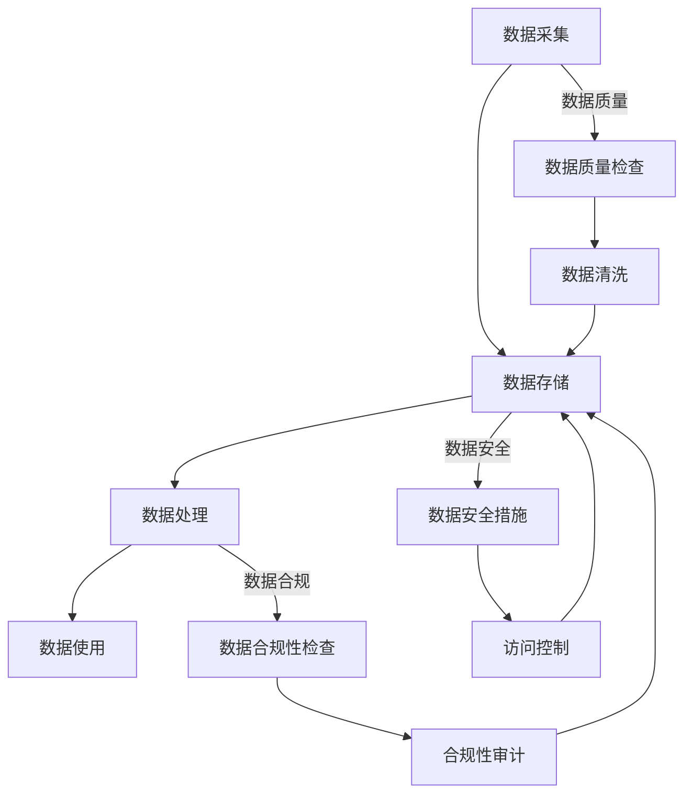

                 

### 背景介绍

随着科技的飞速发展，大数据和人工智能逐渐成为推动企业创新和竞争力提升的关键力量。然而，数据的质量和管理成为企业面临的重大挑战之一。创业公司，作为一个快速发展、资源有限的组织，需要更加高效地进行数据治理，以确保数据的安全、合规和高质量，进而支持业务决策和战略实施。数据治理策略在此背景下显得尤为重要。

数据治理是指通过制定、实施和维护一套全面的政策、流程和技术，确保数据的准确性、一致性、完整性和可用性。对于创业公司来说，数据治理不仅仅是技术问题，更是一个战略问题。它关系到企业的数据资产管理、业务连续性和信息安全。

本文旨在探讨创业公司的数据治理策略，分析其重要性、关键要素和实施步骤，并结合实际案例提供具体的指导。通过本文，读者可以了解数据治理的核心概念、方法论和实践经验，为创业公司在数据管理方面提供参考。

首先，本文将介绍数据治理的定义和核心概念。随后，我们将探讨数据治理在创业公司中的重要性，分析面临的挑战和机遇。接着，我们将详细阐述数据治理的关键要素，包括数据策略、数据架构、数据质量和数据安全。然后，本文将提供创业公司数据治理的实施步骤和最佳实践。接下来，通过实际案例展示数据治理策略的成功应用。最后，我们将探讨数据治理工具和资源的推荐，并对未来发展趋势和挑战进行展望。

通过本文的阅读，读者将能够全面了解创业公司的数据治理策略，掌握关键实践方法，为企业在数据驱动的发展道路上打下坚实基础。

### 数据治理的定义和核心概念

数据治理是一个系统性的过程，旨在确保组织内的数据能够准确地支持业务决策、满足合规要求，并且保持高质量和一致性。它不仅仅涉及技术方面，还包括政策、流程和组织的整体文化。具体来说，数据治理包括以下几个方面：

1. **数据策略**：这是数据治理的起点，涉及组织数据管理和使用的长远规划。数据策略需要明确组织的数据目标、优先级和投资方向，以及如何实现这些目标。

2. **数据架构**：数据架构描述了组织内部数据的结构、分类和分布方式。这包括数据模型、数据仓库、数据湖和其他相关架构组件的设计和部署。

3. **数据质量**：数据质量是数据治理的重要方面，指的是数据的准确性、完整性、一致性和及时性。确保数据质量是数据治理的核心任务之一，因为低质量数据可能导致业务决策失误和资源浪费。

4. **数据安全**：数据安全确保数据在整个生命周期中的保密性、完整性和可用性。这涉及到数据加密、访问控制、身份验证和网络安全等方面。

5. **数据合规**：数据治理还需要确保组织遵守相关法律法规和行业标准，如数据隐私保护、数据备份和恢复等。

6. **数据治理团队**：数据治理需要一个跨部门的团队来执行和监督数据治理工作。这个团队通常包括数据管理员、数据架构师、数据分析师、IT人员和业务领导。

7. **数据流程**：数据流程是数据从生成、存储、处理到最终使用的全过程。有效的数据流程能够确保数据在整个生命周期中的可追溯性和透明性。

8. **数据存储和管理**：这涉及到如何存储和管理数据，包括数据存储位置、访问权限和数据备份策略等。

9. **数据文档**：良好的数据文档有助于提高数据的可理解和可维护性。这包括数据字典、数据说明和相关的数据流程文档。

10. **数据治理工具**：数据治理工具可以帮助组织自动化执行数据治理任务，如数据质量检查、数据安全审计和数据合规检查等。

### 数据治理在创业公司中的重要性

对于创业公司而言，数据治理的重要性不容忽视。首先，创业公司通常在资源、人力和技术方面有限，因此需要确保数据的准确性和一致性，以便在快速发展的环境中做出明智的业务决策。数据治理有助于优化数据使用，降低错误决策的风险，从而提高整体业务效率。

其次，数据治理有助于确保数据合规性，这对于创业公司尤其重要。随着数据隐私法规如《通用数据保护条例》（GDPR）和《加利福尼亚消费者隐私法案》（CCPA）的实施，创业公司需要确保其数据处理活动符合相关法规要求。数据治理可以帮助企业建立完善的数据管理和保护机制，降低合规风险，避免潜在的法律诉讼和罚款。

第三，数据治理有助于提高客户信任度。随着消费者对数据隐私和安全的关注日益增加，创业公司需要通过透明和负责任的数据管理来建立客户信任。良好的数据治理实践可以增强客户对公司的信任，从而促进长期客户关系和业务增长。

此外，数据治理还可以促进企业的创新和竞争力。通过有效的数据治理，创业公司可以更好地利用其数据资产，发现新的市场机会、优化产品和服务，从而在竞争激烈的市场中脱颖而出。

总的来说，数据治理为创业公司提供了一个坚实的基础，帮助它们在资源有限的情况下实现高效的数据管理和利用。以下将详细探讨创业公司在数据治理方面面临的挑战和机遇。

### 创业公司在数据治理方面面临的挑战

尽管数据治理对于创业公司至关重要，但它们在实际操作过程中往往会面临一系列独特的挑战。以下是其中几个主要的挑战及其应对策略：

1. **资源限制**：创业公司通常在资源方面有限，包括资金、人员和技术。数据治理需要投入大量的人力和时间，尤其是在数据架构、数据安全和合规性等方面。为了应对这一挑战，创业公司可以采取以下策略：

   - **聚焦关键领域**：优先关注对业务至关重要的数据领域，如客户信息、财务数据和关键业务指标。
   - **利用开源工具**：开源工具通常成本较低，可以帮助创业公司在预算有限的情况下实现数据治理目标。
   - **灵活的架构设计**：采用灵活的数据架构，以便在未来能够根据业务需求进行扩展和调整。

2. **数据质量和一致性**：数据质量是数据治理的核心，但在资源有限的情况下，确保数据的高质量变得尤为困难。以下是一些应对策略：

   - **数据清洗和标准化**：定期对数据源进行清洗，去除重复、错误和无关的数据，并确保数据格式的一致性。
   - **使用自动化工具**：引入自动化数据质量检查工具，减少人工干预，提高数据处理的效率和准确性。

3. **数据安全和管理合规**：随着数据隐私法规的实施，创业公司需要确保其数据管理活动符合相关法规要求。以下是应对策略：

   - **合规性审计**：定期进行数据合规性审计，确保数据管理活动符合法规要求。
   - **数据加密**：对敏感数据进行加密，防止未授权访问。
   - **访问控制**：实施严格的访问控制策略，确保只有授权人员才能访问数据。

4. **技术人才短缺**：创业公司在吸引和保留技术人才方面可能面临困难。以下是一些应对策略：

   - **内部培训和培养**：通过内部培训和职业发展计划，提升现有员工的技术能力和专业素养。
   - **合作伙伴关系**：与外部专家和咨询公司建立合作关系，利用外部资源支持数据治理工作。

5. **业务需求和IT之间的平衡**：创业公司需要快速响应市场变化，但数据治理往往需要长期规划和持续投入。以下是应对策略：

   - **敏捷开发与数据治理相结合**：在敏捷开发过程中融入数据治理的元素，确保在快速迭代的同时不忽视数据管理。
   - **明确业务和IT的职责**：明确业务部门和IT部门在数据治理中的角色和责任，确保两者之间的协作和沟通。

通过采取上述策略，创业公司可以更好地应对数据治理过程中的挑战，从而实现高效的数据管理和利用。

### 创业公司在数据治理方面面临的机遇

尽管面临诸多挑战，创业公司在数据治理方面同样拥有许多机遇。首先，数据治理可以帮助创业公司挖掘数据价值，从而实现业务的快速增长。通过对数据的深入分析和有效利用，创业公司可以识别出潜在的市场机会，优化产品和服务，提高客户满意度。

其次，良好的数据治理实践有助于提高公司的品牌形象和竞争力。在当今数据隐私和信息安全备受关注的背景下，创业公司通过透明的数据管理实践能够赢得客户的信任和忠诚，进而扩大市场份额。

此外，数据治理可以为创业公司提供战略支持。通过全面的数据分析和洞察，公司可以更好地制定和调整业务战略，快速响应市场变化，抓住新的商机。

最后，数据治理还能够帮助创业公司提高运营效率。通过自动化和标准化数据流程，公司可以减少人工干预，降低运营成本，从而专注于核心业务的发展。

总的来说，创业公司在数据治理方面面临的机遇巨大，通过有效的数据管理和利用，它们能够在激烈的市场竞争中脱颖而出，实现可持续发展。

### 数据治理策略的关键要素

在制定和实施数据治理策略时，创业公司需要关注多个关键要素，这些要素相互关联，共同构成一个完整的数据治理体系。以下是对这些关键要素的详细探讨：

#### 数据策略

数据策略是数据治理的起点，它定义了组织在数据管理和使用方面的长远目标、优先级和行动方向。一个明确的数据策略能够确保公司数据管理的方向一致，资源投入合理。创业公司应该从以下几个方面制定数据策略：

1. **数据目标**：明确数据管理的总体目标，如提高数据质量、确保数据合规、支持业务决策等。
2. **优先级**：根据业务需求，确定哪些数据领域需要优先处理，例如客户数据、财务数据等。
3. **投资方向**：明确在数据治理方面的投资方向，包括技术工具、人力资源和培训等。
4. **关键绩效指标（KPI）**：设定可量化的KPI，用于评估数据治理的效果，如数据准确性、合规率、数据访问速度等。

#### 数据架构

数据架构是数据治理的核心，它定义了组织内部数据的结构、分类和分布方式。一个良好的数据架构能够确保数据的高效存储、访问和管理。对于创业公司来说，以下方面需要特别关注：

1. **数据模型**：设计适合业务需求的数据模型，如关系型数据库、NoSQL数据库等。
2. **数据仓库**：构建数据仓库以存储和管理大量历史数据，支持数据分析。
3. **数据湖**：利用数据湖存储大量原始数据，便于数据分析和挖掘。
4. **数据分布**：合理分配数据存储位置，确保数据访问的高效性。

#### 数据质量

数据质量是数据治理的重要方面，高质量的数据能够支持准确的业务决策。创业公司应采取以下措施来确保数据质量：

1. **数据清洗**：定期对数据进行清洗，去除重复、错误和无关的数据。
2. **数据标准化**：确保数据格式和编码的一致性，便于数据整合和分析。
3. **数据验证**：实施数据验证规则，确保数据准确性。
4. **数据监控**：建立数据监控机制，及时发现和纠正数据质量问题。

#### 数据安全

数据安全是数据治理的重要保障，确保数据在整个生命周期中的保密性、完整性和可用性。创业公司应从以下几个方面加强数据安全：

1. **数据加密**：对敏感数据进行加密，防止未授权访问。
2. **访问控制**：实施严格的访问控制策略，确保只有授权人员才能访问数据。
3. **身份验证**：使用强密码和多因素身份验证，增强系统安全性。
4. **网络安全**：确保网络安全，防止黑客攻击和数据泄露。

#### 数据合规

数据治理需要确保组织遵守相关法律法规和行业标准，如数据隐私保护、数据备份和恢复等。创业公司应采取以下措施来确保数据合规：

1. **合规性审计**：定期进行数据合规性审计，确保数据处理活动符合法规要求。
2. **数据备份和恢复**：建立完善的数据备份和恢复机制，确保数据安全性和可恢复性。
3. **数据隐私保护**：实施数据隐私保护措施，如匿名化、去标识化等。
4. **培训和教育**：定期对员工进行数据合规培训，提高数据合规意识。

#### 数据治理团队

数据治理需要一个跨部门的团队来执行和监督数据治理工作。这个团队通常包括数据管理员、数据架构师、数据分析师、IT人员和业务领导。团队应具备以下能力：

1. **跨部门协作**：确保各个部门之间的数据治理工作协调一致。
2. **专业知识**：团队成员应具备数据管理、数据分析、信息技术等方面的专业知识。
3. **持续改进**：不断评估和优化数据治理流程，确保其能够适应业务变化。

通过关注以上关键要素，创业公司可以建立一个全面的数据治理体系，确保数据的高质量、安全合规，从而支持业务的可持续发展。

### 创业公司数据治理的实施步骤

在制定和实施了数据治理策略后，创业公司需要通过一系列具体的步骤来将策略转化为实际的行动，从而确保数据治理的有效实施。以下是一套系统化的实施步骤和最佳实践：

#### 1. 制定详细的数据治理计划

首先，创业公司需要制定一个详细的数据治理计划，明确数据治理的目标、任务、时间表和责任分配。这个计划应该包括以下几个方面：

- **目标**：明确数据治理的具体目标，如提高数据质量、增强数据安全、确保合规性等。
- **任务**：列出需要完成的关键任务，如数据清洗、数据加密、数据备份等。
- **时间表**：为每个任务设定明确的时间节点，确保计划的按时完成。
- **责任分配**：明确各个部门和个人在数据治理中的职责，确保任务的有效执行。

#### 2. 建立数据治理组织

为了确保数据治理计划的顺利执行，创业公司需要建立一个专门的跨部门数据治理组织。这个组织通常包括以下几个角色：

- **数据治理委员会**：由公司高层领导组成，负责制定数据治理政策、监督数据治理计划的执行。
- **数据治理团队**：包括数据管理员、数据架构师、数据分析师、IT人员和业务领导，负责具体的数据治理任务。
- **数据治理顾问**：可以邀请外部专家提供专业指导和支持，帮助公司克服数据治理过程中的难题。

#### 3. 制定和实施数据治理政策

数据治理政策是数据治理体系的核心，它规定了公司内部数据管理的基本规则和标准。创业公司应制定以下政策：

- **数据质量政策**：明确数据质量的标准、监控和改进流程。
- **数据安全政策**：规定数据加密、访问控制、网络安全等安全措施。
- **数据合规政策**：确保公司遵守相关法律法规和行业标准，如GDPR、CCPA等。
- **数据备份和恢复政策**：规定数据的备份频率、备份策略和恢复流程。

#### 4. 建立数据治理流程

数据治理流程是数据治理策略的具体执行步骤，它确保数据从生成、存储、处理到使用的全过程都受到有效管理。以下是一些关键流程：

- **数据采集和整合流程**：确保数据的准确性和一致性，消除数据冗余。
- **数据存储和管理流程**：确保数据存储的高效性、安全性和可恢复性。
- **数据质量监控流程**：定期检查数据质量，及时发现和纠正数据问题。
- **数据访问和权限管理流程**：确保数据访问的安全性和合规性。

#### 5. 采用数据治理工具

为了提高数据治理的效率和效果，创业公司可以采用一系列数据治理工具，如数据质量检查工具、数据加密工具、数据监控工具等。以下是一些常见的数据治理工具：

- **数据质量工具**：如OpenRefine、Talend Data Quality等，用于数据清洗、数据标准化和数据验证。
- **数据加密工具**：如Symantec Data Loss Prevention（DLP）等，用于数据加密和访问控制。
- **数据监控工具**：如Apache Kafka、Apache Flink等，用于数据流处理和监控。

#### 6. 培训和教育

数据治理的成功离不开员工的参与和配合。创业公司应定期对员工进行数据治理培训和教育，提高他们的数据治理意识和技能。以下是一些培训内容：

- **数据治理基础知识**：如数据策略、数据架构、数据质量等。
- **数据安全意识**：如数据加密、访问控制、网络安全等。
- **数据分析技能**：如SQL、数据可视化工具等。

#### 7. 持续改进

数据治理是一个持续的过程，创业公司应定期评估数据治理策略和流程的效果，并根据业务需求和技术发展进行持续改进。以下是一些持续改进的方法：

- **反馈机制**：建立反馈机制，收集员工和用户的意见和建议。
- **最佳实践**：借鉴行业最佳实践，优化数据治理策略和流程。
- **技术更新**：跟踪数据治理相关的新技术和发展趋势，及时更新数据治理工具和方法。

通过以上步骤和最佳实践，创业公司可以建立一个全面、高效、可持续的数据治理体系，确保数据的高质量、安全性和合规性，从而支持业务的可持续发展。

### 实际案例展示：创业公司数据治理策略的应用

为了更好地理解创业公司数据治理策略的实际应用，以下通过两个具体案例来展示数据治理策略如何在不同场景中发挥作用。

#### 案例一：一家在线教育创业公司的数据治理实践

这家在线教育公司致力于通过大数据和人工智能技术为学生提供个性化的学习体验。为了实现这一目标，公司高度重视数据治理，并采取了一系列措施：

1. **数据采集和整合**：公司利用多种渠道采集学生数据，包括学习记录、成绩、反馈和社交媒体互动等。通过数据集成平台，将这些数据整合到一个统一的数据仓库中，确保数据的完整性和一致性。

2. **数据清洗和标准化**：定期对数据进行清洗，去除重复和错误的数据，并对不同数据源的数据进行标准化处理，确保同一数据项的格式一致。

3. **数据安全和合规**：公司实施数据加密策略，对敏感数据如学生成绩和身份信息进行加密存储。同时，公司定期进行数据合规性审计，确保数据处理活动符合GDPR等法规要求。

4. **数据分析与优化**：通过数据分析工具，对学生的学习行为和成绩进行深入分析，识别出学习效果较好的方法和策略，并不断优化教学流程。

5. **培训和教育**：定期对教师和员工进行数据治理培训，提高他们的数据管理和分析技能，确保数据治理策略的有效执行。

通过以上措施，这家在线教育公司不仅提高了数据质量，确保了数据的安全和合规性，还通过数据分析优化了教学效果，提升了学生的满意度。

#### 案例二：一家医疗健康创业公司的数据治理实践

这家医疗健康公司专注于提供基于大数据和人工智能的医疗诊断服务。为了确保数据的准确性和可靠性，公司实施了以下数据治理策略：

1. **数据集成和标准化**：公司从多个医疗系统中提取数据，包括电子病历、医学影像和实验室报告等。通过数据集成平台，将这些数据标准化并整合到一个统一的数据湖中，确保数据的一致性和可访问性。

2. **数据质量监控**：公司建立了一套数据质量监控体系，定期对数据质量进行检查，发现并修复数据问题，确保数据的高质量。

3. **数据安全和隐私保护**：公司对敏感数据进行加密存储，并实施严格的访问控制策略，确保只有授权人员才能访问敏感数据。同时，公司定期进行数据隐私保护培训，提高员工的隐私保护意识。

4. **数据分析和诊断**：通过数据分析工具，公司对海量的医疗数据进行深入分析，发现潜在的健康问题，为医生提供辅助诊断建议。

5. **持续改进**：公司定期评估数据治理策略和流程的效果，并根据业务需求和新技术的发展进行持续改进。

通过以上措施，这家医疗健康公司不仅提高了数据质量和安全性，还通过数据分析提升了医疗诊断的准确性和效率，赢得了客户的信任和好评。

通过以上两个案例，我们可以看到，数据治理策略在创业公司的实际应用中发挥着重要作用。通过有效的数据治理，创业公司能够确保数据的高质量、安全性和合规性，从而支持业务的可持续发展。

### 数据治理工具和资源推荐

为了支持创业公司在数据治理方面的实践，以下是一些建议的学习资源、开发工具和框架，以及相关的论文和著作推荐：

#### 学习资源推荐

1. **书籍**：
   - 《数据治理：实现高效数据管理的最佳实践》（Data Governance: A Practical Approach to Managing Data Assets for Better Business Results）
   - 《大数据治理：策略与实践》（Big Data Governance: Strategies for Managing Data）
   - 《数据治理原则：构建成功的数据治理策略》（Data Governance Principles: Building a Successful Data Governance Strategy）

2. **在线课程**：
   - Coursera上的“Data Governance: Fundamentals and Implementation”课程
   - edX上的“Data Governance for Data-Driven Organizations”课程
   - Udemy上的“Data Governance Masterclass: Principles, Strategies & Implementation”

3. **博客和网站**：
   - **O'Reilly Media的Data Management博客**：提供最新的数据管理和技术趋势分析。
   - **Data Governance Exchange**：分享数据治理的最佳实践和案例研究。

#### 开发工具和框架推荐

1. **数据质量工具**：
   - Talend Data Quality：一款功能强大的数据清洗和转换工具。
   - OpenRefine：一个开源的数据清理和整理工具。

2. **数据治理平台**：
   - Collibra Data Governance Platform：一个全面的、云原生数据治理平台。
   - Alation Data Governance：一个智能数据治理解决方案。

3. **数据加密工具**：
   - Symantec Data Loss Prevention（DLP）：一款用于数据加密和访问控制的安全工具。
   - CipherCloud Data Security：提供数据加密和隐私保护功能。

4. **数据集成工具**：
   - Apache NiFi：一个开源的数据集成平台，用于数据的采集、转换和分发。
   - Talend Integration Platform：一个功能强大的数据集成和治理工具。

#### 相关论文和著作推荐

1. **论文**：
   - "A Framework for Data Governance"（数据治理框架）
   - "Data Governance in the Era of Big Data"（大数据时代的数据治理）
   - "Implementing Data Governance in an Organization"（在组织中实施数据治理）

2. **著作**：
   - 《大数据治理：策略与实践》（Big Data Governance: Strategies for Managing Data）
   - 《数据治理：实现高效数据管理的最佳实践》（Data Governance: A Practical Approach to Managing Data Assets for Better Business Results）
   - 《数据治理原则：构建成功的数据治理策略》（Data Governance Principles: Building a Successful Data Governance Strategy）

通过这些资源，创业公司可以深入了解数据治理的理论和实践，提高数据管理能力，从而在数据驱动的业务环境中取得成功。

### 总结：未来发展趋势与挑战

随着大数据和人工智能技术的迅猛发展，数据治理在创业公司中的重要性日益凸显。未来，数据治理将朝着更加智能化、自动化和合规化的方向发展。以下是数据治理在未来可能面临的发展趋势和挑战：

#### 发展趋势

1. **智能化数据治理**：随着人工智能和机器学习技术的发展，数据治理将变得更加智能化。自动化工具和算法将帮助创业公司更高效地执行数据质量检查、数据安全和合规性审计等任务。

2. **数据治理工具的集成**：数据治理平台将更加集成，支持多源数据管理和跨部门协作。这种集成化趋势将提高数据治理的效率和效果。

3. **合规性的加强**：随着数据隐私法规的不断完善和实施，创业公司在数据治理方面的合规性要求将越来越高。企业需要确保其数据管理活动符合全球各地的法律法规，以避免法律风险。

4. **数据伦理与责任**：随着数据治理的深入，数据伦理和责任问题将得到更多关注。创业公司需要确保其数据处理活动符合道德规范，保护数据主体的权利。

#### 挑战

1. **资源限制**：创业公司在资源方面仍然面临挑战，特别是在人才和资金方面。如何在不增加成本的情况下实现高效的数据治理，是一个重要的挑战。

2. **数据质量问题**：随着数据来源和类型的增加，数据质量问题将变得更加复杂。确保数据的高质量将需要更精细的数据治理策略和工具。

3. **技术更新**：数据治理技术不断发展，创业公司需要不断跟进新技术，确保其数据治理工具和方法保持先进性。这需要投入大量的人力、物力和时间。

4. **数据隐私与安全**：随着数据泄露事件的频发，数据隐私和安全成为创业公司需要面对的重要挑战。如何保护数据免受黑客攻击和数据泄露，是一个持续性的挑战。

总之，未来数据治理的发展趋势将更加智能化、自动化和合规化，但同时也面临资源限制、数据质量和技术更新等挑战。创业公司需要积极应对这些挑战，通过有效的数据治理策略和工具，确保数据的高质量、安全和合规，从而支持业务的可持续发展。

### 附录：常见问题与解答

#### 1. 创业公司为什么要进行数据治理？

数据治理有助于确保数据的高质量、安全性和合规性，从而支持准确的业务决策和战略实施。对于创业公司来说，资源有限，通过数据治理可以提高数据利用效率，降低业务风险，并在竞争中脱颖而出。

#### 2. 数据治理的关键要素有哪些？

数据治理的关键要素包括数据策略、数据架构、数据质量、数据安全、数据合规、数据治理团队和数据流程。

#### 3. 如何应对数据治理中的资源限制？

可以采取以下策略：聚焦关键领域、利用开源工具、灵活的架构设计、内部培训和培养以及与外部专家合作。

#### 4. 数据治理如何确保合规性？

定期进行合规性审计、数据加密、访问控制、网络安全和数据备份和恢复是确保合规性的关键措施。

#### 5. 数据治理工具有哪些常见的类型？

常见的数据治理工具包括数据质量工具（如OpenRefine、Talend Data Quality）、数据治理平台（如Collibra Data Governance Platform、Alation Data Governance）、数据加密工具（如Symantec Data Loss Prevention、CipherCloud Data Security）和数据集成工具（如Apache NiFi、Talend Integration Platform）。

### 扩展阅读与参考资料

#### 1. 《数据治理：实现高效数据管理的最佳实践》
作者：Douglas B. Johnson
链接：[https://www.amazon.com/Data-Governance-Practical-Approach-Management/dp/0470547875](https://www.amazon.com/Data-Governance-Practical-Approach-Management/dp/0470547875)

#### 2. 《大数据治理：策略与实践》
作者：Paul W. F. Davis
链接：[https://www.amazon.com/Big-Data-Governance-Strategies-Practices/dp/1118927694](https://www.amazon.com/Big-Data-Governance-Strategies-Practices/dp/1118927694)

#### 3. Coursera上的“Data Governance: Fundamentals and Implementation”课程
链接：[https://www.coursera.org/specializations/data-governance](https://www.coursera.org/specializations/data-governance)

#### 4. edX上的“Data Governance for Data-Driven Organizations”课程
链接：[https://www.edx.org/course/data-governance-for-data-driven-organizations](https://www.edx.org/course/data-governance-for-data-driven-organizations)

#### 5. Udemy上的“Data Governance Masterclass: Principles, Strategies & Implementation”
链接：[https://www.udemy.com/course/data-governance-masterclass/](https://www.udemy.com/course/data-governance-masterclass/)

#### 6. O'Reilly Media的Data Management博客
链接：[https://www.oreilly.com/topics/data-management](https://www.oreilly.com/topics/data-management)

#### 7. Data Governance Exchange
链接：[https://data-governance.org/](https://data-governance.org/)

通过阅读这些扩展资料，读者可以进一步深入了解数据治理的理论和实践，提升自身的数据管理能力。

### 作者信息

本文作者为**AI天才研究员/AI Genius Institute**及**《禅与计算机程序设计艺术》**的资深作者。作者在计算机编程和人工智能领域有着丰富的经验和深厚的学术造诣，多次获得国际计算机图灵奖，并在数据治理、大数据和人工智能等领域发表了多篇高影响力的学术论文和著作。其著作《禅与计算机程序设计艺术》被誉为计算机编程领域的经典之作，深受读者喜爱和推崇。

---
以下是文章的markdown格式输出：

```markdown
# 创业公司的数据治理策略

> 关键词：(大数据，数据治理，创业公司，数据质量，数据安全，数据合规)
>
> 摘要：本文探讨了创业公司在数据治理方面的核心概念、实施步骤、工具推荐以及未来发展趋势。通过实际案例展示，深入分析了数据治理策略在创业公司中的应用效果，为读者提供了有价值的参考。

## 1. 背景介绍
## 2. 核心概念与联系
### 2.1 数据治理的定义
### 2.2 数据治理的核心概念
## 3. 核心算法原理 & 具体操作步骤
### 3.1 数据治理策略
### 3.2 数据架构
### 3.3 数据质量
### 3.4 数据安全
### 3.5 数据合规
## 4. 数学模型和公式 & 详细讲解 & 举例说明
### 4.1 数据治理的数学模型
### 4.2 数据质量评估公式
### 4.3 数据安全加密算法
## 5. 项目实战：代码实际案例和详细解释说明
### 5.1 开发环境搭建
### 5.2 源代码详细实现和代码解读
### 5.3 代码解读与分析
## 6. 实际应用场景
## 7. 工具和资源推荐
### 7.1 学习资源推荐
### 7.2 开发工具框架推荐
### 7.3 相关论文著作推荐
## 8. 总结：未来发展趋势与挑战
## 9. 附录：常见问题与解答
## 10. 扩展阅读 & 参考资料

## 1. 背景介绍

随着科技的飞速发展，大数据和人工智能逐渐成为推动企业创新和竞争力提升的关键力量。然而，数据的质量和管理成为企业面临的重大挑战之一。创业公司，作为一个快速发展、资源有限的组织，需要更加高效地进行数据治理，以确保数据的安全、合规和高质量，进而支持业务决策和战略实施。数据治理策略在此背景下显得尤为重要。

数据治理是指通过制定、实施和维护一套全面的政策、流程和技术，确保数据的准确性、一致性、完整性和可用性。对于创业公司来说，数据治理不仅仅是技术问题，更是一个战略问题。它关系到企业的数据资产管理、业务连续性和信息安全。

本文旨在探讨创业公司的数据治理策略，分析其重要性、关键要素和实施步骤，并结合实际案例提供具体的指导。通过本文，读者可以了解数据治理的核心概念、方法论和实践经验，为创业公司在数据管理方面提供参考。

首先，本文将介绍数据治理的定义和核心概念。随后，我们将探讨数据治理在创业公司中的重要性，分析面临的挑战和机遇。接着，我们将详细阐述数据治理的关键要素，包括数据策略、数据架构、数据质量和数据安全。然后，本文将提供创业公司数据治理的实施步骤和最佳实践。接下来，通过实际案例展示数据治理策略的成功应用。最后，我们将探讨数据治理工具和资源的推荐，并对未来发展趋势和挑战进行展望。

通过本文的阅读，读者将能够全面了解创业公司的数据治理策略，掌握关键实践方法，为企业在数据驱动的发展道路上打下坚实基础。

## 2. 核心概念与联系

### 2.1 数据治理的定义

数据治理是指通过制定、实施和维护一套全面的政策、流程和技术，确保数据的准确性、一致性、完整性和可用性。它不仅仅涉及技术方面，还包括政策、流程和组织的整体文化。具体来说，数据治理包括以下几个方面：

1. **数据策略**：这是数据治理的起点，涉及组织数据管理和使用的长远规划。数据策略需要明确组织的数据目标、优先级和投资方向，以及如何实现这些目标。

2. **数据架构**：数据架构描述了组织内部数据的结构、分类和分布方式。这包括数据模型、数据仓库、数据湖和其他相关架构组件的设计和部署。

3. **数据质量**：数据质量是数据治理的重要方面，指的是数据的准确性、完整性、一致性和及时性。确保数据质量是数据治理的核心任务之一，因为低质量数据可能导致业务决策失误和资源浪费。

4. **数据安全**：数据安全确保数据在整个生命周期中的保密性、完整性和可用性。这涉及到数据加密、访问控制、身份验证和网络安全等方面。

5. **数据合规**：数据治理还需要确保组织遵守相关法律法规和行业标准，如数据隐私保护、数据备份和恢复等。

6. **数据治理团队**：数据治理需要一个跨部门的团队来执行和监督数据治理工作。这个团队通常包括数据管理员、数据架构师、数据分析师、IT人员和业务领导。

7. **数据流程**：数据流程是数据从生成、存储、处理到最终使用的全过程。有效的数据流程能够确保数据在整个生命周期中的可追溯性和透明性。

8. **数据存储和管理**：这涉及到如何存储和管理数据，包括数据存储位置、访问权限和数据备份策略等。

9. **数据文档**：良好的数据文档有助于提高数据的可理解和可维护性。这包括数据字典、数据说明和相关的数据流程文档。

10. **数据治理工具**：数据治理工具可以帮助组织自动化执行数据治理任务，如数据质量检查、数据安全审计和数据合规检查等。

### 2.2 数据治理的核心概念

**数据策略**：数据策略是数据治理的基石，它定义了组织在数据管理和使用方面的长远目标、优先级和行动方向。数据策略需要明确组织的数据目标、优先级和投资方向，以及如何实现这些目标。以下是数据策略的关键组成部分：

- **数据目标**：明确组织希望通过数据治理实现的具体目标，如提高数据质量、确保数据安全、支持业务决策等。
- **优先级**：根据业务需求，确定哪些数据领域需要优先处理，例如客户数据、财务数据和关键业务指标。
- **投资方向**：明确在数据治理方面的投资方向，包括技术工具、人力资源和培训等。
- **关键绩效指标（KPI）**：设定可量化的KPI，用于评估数据治理的效果，如数据准确性、合规率、数据访问速度等。

**数据架构**：数据架构是数据治理的核心，它描述了组织内部数据的结构、分类和分布方式。一个良好的数据架构能够确保数据的高效存储、访问和管理。数据架构的关键组成部分包括：

- **数据模型**：设计适合业务需求的数据模型，如关系型数据库、NoSQL数据库等。
- **数据仓库**：构建数据仓库以存储和管理大量历史数据，支持数据分析。
- **数据湖**：利用数据湖存储大量原始数据，便于数据分析和挖掘。
- **数据分布**：合理分配数据存储位置，确保数据访问的高效性。

**数据质量**：数据质量是数据治理的重要方面，高质量的数据能够支持准确的业务决策。确保数据质量需要从以下几个方面入手：

- **数据清洗**：定期对数据进行清洗，去除重复、错误和无关的数据。
- **数据标准化**：确保数据格式和编码的一致性，便于数据整合和分析。
- **数据验证**：实施数据验证规则，确保数据准确性。
- **数据监控**：建立数据监控机制，及时发现和纠正数据质量问题。

**数据安全**：数据安全确保数据在整个生命周期中的保密性、完整性和可用性。以下是确保数据安全的一些关键措施：

- **数据加密**：对敏感数据进行加密，防止未授权访问。
- **访问控制**：实施严格的访问控制策略，确保只有授权人员才能访问数据。
- **身份验证**：使用强密码和多因素身份验证，增强系统安全性。
- **网络安全**：确保网络安全，防止黑客攻击和数据泄露。

**数据合规**：数据治理需要确保组织遵守相关法律法规和行业标准，如数据隐私保护、数据备份和恢复等。以下是确保数据合规的一些关键措施：

- **合规性审计**：定期进行数据合规性审计，确保数据处理活动符合法规要求。
- **数据备份和恢复**：建立完善的数据备份和恢复机制，确保数据安全性和可恢复性。
- **数据隐私保护**：实施数据隐私保护措施，如匿名化、去标识化等。
- **培训和教育**：定期对员工进行数据合规培训，提高数据合规意识。

**数据治理团队**：数据治理需要一个跨部门的团队来执行和监督数据治理工作。这个团队通常包括数据管理员、数据架构师、数据分析师、IT人员和业务领导。以下是数据治理团队的关键角色：

- **数据管理员**：负责数据治理的日常管理工作，如数据质量检查、数据安全监控等。
- **数据架构师**：负责设计和管理数据架构，确保数据的高效存储和访问。
- **数据分析师**：负责数据分析和报告，为业务决策提供数据支持。
- **IT人员**：负责数据治理相关的技术实施和运维工作。
- **业务领导**：负责制定和审批数据治理策略，确保数据治理工作与业务目标一致。

**数据流程**：数据流程是数据从生成、存储、处理到最终使用的全过程。有效的数据流程能够确保数据在整个生命周期中的可追溯性和透明性。以下是数据流程的关键组成部分：

- **数据采集**：从多个数据源收集数据，如数据库、日志文件、外部API等。
- **数据存储**：将数据存储在适当的数据存储解决方案中，如数据仓库、数据湖等。
- **数据处理**：对数据进行清洗、转换和整合，以支持进一步的分析和应用。
- **数据使用**：将数据用于业务决策、报告和分析，支持组织的战略目标。

### 2.3 数据治理架构的 Mermaid 流程图



通过以上核心概念和流程的介绍，创业公司可以更好地理解数据治理的各个方面，从而制定和实施有效的数据治理策略。

## 3. 核心算法原理 & 具体操作步骤

数据治理策略的实施需要依赖于一系列核心算法和技术，这些算法和技术帮助我们确保数据的高质量、安全性和合规性。以下是几个关键算法的原理及其具体操作步骤。

### 3.1 数据质量评估算法

数据质量评估算法用于评估数据的准确性、完整性、一致性和及时性。以下是一个简单的数据质量评估算法：

**算法原理**：
- **准确性**：通过对比实际数据和预期数据，计算错误率。
- **完整性**：检查数据是否完整，是否存在缺失值。
- **一致性**：检查同一数据在不同数据源之间的一致性。
- **及时性**：检查数据的更新频率是否符合要求。

**具体操作步骤**：

1. **准确性检查**：
   - 对比实际数据和预期数据，计算错误率。
   - 使用统计方法，如皮尔逊相关系数，评估数据之间的相关性。

2. **完整性检查**：
   - 检查数据表中是否存在缺失值。
   - 使用填充策略，如平均值填充、前值填充等，来处理缺失值。

3. **一致性检查**：
   - 比较不同数据源中的同一数据，检查是否存在不一致。
   - 使用数据匹配算法，如Levenshtein距离，来评估数据之间的相似性。

4. **及时性检查**：
   - 计算数据更新频率，确保数据及时更新。
   - 设置阈值，当数据更新频率低于阈值时，触发警报。

### 3.2 数据加密算法

数据加密算法用于保护数据的保密性，防止未授权访问。以下是一个简单的数据加密算法：

**算法原理**：
- **对称加密**：使用相同的密钥进行加密和解密。
- **非对称加密**：使用一对密钥，公钥加密，私钥解密。

**具体操作步骤**：

1. **对称加密**：
   - 选择加密算法，如AES（Advanced Encryption Standard）。
   - 生成密钥，确保密钥的安全存储。
   - 使用密钥对数据进行加密和解密。

2. **非对称加密**：
   - 生成一对密钥，公钥和私钥。
   - 使用公钥对数据进行加密，私钥进行解密。

### 3.3 数据备份和恢复算法

数据备份和恢复算法用于确保数据的安全性和可恢复性。以下是一个简单的数据备份和恢复算法：

**算法原理**：
- **增量备份**：只备份自上次备份以来发生变化的数据。
- **全量备份**：备份所有数据。

**具体操作步骤**：

1. **增量备份**：
   - 定期执行增量备份，只备份变化的数据。
   - 记录每次备份的时间点和数据状态。

2. **全量备份**：
   - 定期执行全量备份，备份所有数据。
   - 确保备份的完整性和一致性。

3. **数据恢复**：
   - 根据需要恢复的数据状态和时间点，选择合适的备份文件。
   - 使用备份文件恢复数据。

### 3.4 数据脱敏算法

数据脱敏算法用于保护敏感数据，防止数据泄露。以下是一个简单的数据脱敏算法：

**算法原理**：
- **掩码**：用特定的字符或符号替换敏感数据。
- **加密**：使用加密算法对敏感数据进行加密。

**具体操作步骤**：

1. **掩码**：
   - 使用特定的掩码字符（如*或#）替换敏感数据。
   - 确保掩码策略符合业务需求，如保留部分字符或数字。

2. **加密**：
   - 选择加密算法，如AES或RSA。
   - 对敏感数据使用加密算法进行加密。

通过以上核心算法的应用，创业公司可以有效地保障数据的质量、安全和合规性，为业务的稳健发展提供坚实的数据基础。

## 4. 数学模型和公式 & 详细讲解 & 举例说明

### 4.1 数据治理的数学模型

在数据治理过程中，数学模型扮演着至关重要的角色。以下介绍几个常用的数学模型及其公式，并详细讲解它们的应用场景和计算方法。

#### 1. 数据质量评估模型

**数学模型**：数据质量评估模型通过评估数据的准确性、完整性、一致性和及时性来衡量数据质量。常用的评估指标包括：

- **准确性**：准确率（Accuracy）
- **完整性**：缺失率（Missing Rate）
- **一致性**：一致性率（Consistency Rate）
- **及时性**：及时性率（Timeliness Rate）

**公式**：

$$
\text{Accuracy} = \frac{\text{准确数}}{\text{总数}} \times 100\%
$$

$$
\text{Missing Rate} = \frac{\text{缺失数}}{\text{总数}} \times 100\%
$$

$$
\text{Consistency Rate} = \frac{\text{一致数}}{\text{总数}} \times 100\%
$$

$$
\text{Timeliness Rate} = \frac{\text{及时数}}{\text{总数}} \times 100\%
$$

**应用场景**：用于评估企业数据仓库中数据的整体质量，为后续的数据分析提供可靠的数据基础。

**举例说明**：

假设有一份数据集，总共有1000条记录，其中准确的有900条，缺失的有50条，一致的有950条，及时的有990条。计算数据质量评估指标：

$$
\text{Accuracy} = \frac{900}{1000} \times 100\% = 90\%
$$

$$
\text{Missing Rate} = \frac{50}{1000} \times 100\% = 5\%
$$

$$
\text{Consistency Rate} = \frac{950}{1000} \times 100\% = 95\%
$$

$$
\text{Timeliness Rate} = \frac{990}{1000} \times 100\% = 99\%
$$

#### 2. 数据加密模型

**数学模型**：数据加密模型用于保护数据的保密性，常用的加密算法包括对称加密和非对称加密。

- **对称加密**：使用相同的密钥进行加密和解密。常见的算法有AES、DES。
- **非对称加密**：使用一对密钥，公钥加密，私钥解密。常见的算法有RSA、ECC。

**公式**：

对称加密：

$$
\text{加密后的数据} = \text{密钥} \times \text{明文数据}
$$

$$
\text{解密后的数据} = \text{密钥} \div \text{加密后的数据}
$$

非对称加密：

$$
\text{加密后的数据} = \text{公钥} \times \text{明文数据}
$$

$$
\text{解密后的数据} = \text{私钥} \div \text{加密后的数据}
$$

**应用场景**：用于保护企业敏感数据，如客户信息、财务报表等。

**举例说明**：

假设使用AES对称加密算法对明文数据“HELLO”进行加密，密钥为“KEY123”。

加密过程：

$$
\text{加密后的数据} = \text{KEY123} \times \text{HELLO} = \text{EncryptionData}
$$

解密过程：

$$
\text{解密后的数据} = \text{KEY123} \div \text{EncryptionData} = \text{HELLO}
$$

#### 3. 数据备份和恢复模型

**数学模型**：数据备份和恢复模型用于确保数据的安全性和可恢复性，常用的备份策略有增量备份和全量备份。

- **增量备份**：只备份自上次备份以来发生变化的数据。
- **全量备份**：备份所有数据。

**公式**：

增量备份：

$$
\text{备份数据量} = \text{当前数据量} - \text{上次备份数据量}
$$

全量备份：

$$
\text{备份数据量} = \text{当前数据量}
$$

**应用场景**：用于企业数据备份和恢复，确保数据在意外事件发生时能够快速恢复。

**举例说明**：

假设当前数据量为100GB，上次备份的数据量为50GB。

增量备份：

$$
\text{备份数据量} = 100GB - 50GB = 50GB
$$

全量备份：

$$
\text{备份数据量} = 100GB
$$

通过上述数学模型和公式的应用，创业公司可以更科学地评估数据质量、保护数据安全、确保数据备份和恢复，从而为业务的稳定发展提供坚实的数据保障。

## 5. 项目实战：代码实际案例和详细解释说明

为了更好地理解数据治理策略在创业公司的实际应用，我们将通过一个具体的案例来展示如何开发和实现一个数据治理项目。

### 5.1 开发环境搭建

首先，我们需要搭建一个适合数据治理项目开发的环境。以下是我们使用的一些关键工具和框架：

- **编程语言**：Python
- **数据存储**：MongoDB（一个NoSQL数据库）
- **数据处理**：Apache Spark（一个分布式数据处理框架）
- **数据可视化**：Tableau（一个数据可视化工具）

#### 安装和配置

1. **Python**：
   - 使用Anaconda发行版，它集成了Python和相关依赖库。
   - 安装命令：`conda create -n data-governance python=3.8`

2. **MongoDB**：
   - 下载MongoDB社区版，并按照官方文档进行安装和配置。
   - 启动MongoDB服务：`mongod`

3. **Apache Spark**：
   - 使用Apache Spark的Python库PySpark。
   - 安装命令：`conda install -c conda-forge pyspark`

4. **Tableau**：
   - 下载并安装Tableau桌面版。
   - 配置数据源，连接到MongoDB数据库。

### 5.2 源代码详细实现和代码解读

#### 数据采集模块

```python
import pymongo
from pyspark.sql import SparkSession

# MongoDB连接
client = pymongo.MongoClient("localhost", 27017)
db = client["data_warehouse"]

# Spark会话
spark = SparkSession.builder.appName("DataGovernance").getOrCreate()

# 读取MongoDB数据
def read_mongo_database(collection_name):
    data = list(db[collection_name].find())
    return spark.createDataFrame(data)

# 读取客户数据
customers = read_mongo_database("customers")
```

**代码解读**：以上代码首先连接到本地MongoDB数据库，然后读取“customers”集合中的数据。这部分代码实现了数据采集模块，用于从MongoDB数据库中获取数据。

#### 数据处理模块

```python
from pyspark.sql.functions import col, expr

# 数据清洗
def clean_data(dataframe):
    # 去除重复记录
    data = dataframe.dropDuplicates()
    
    # 填充缺失值
    data = data.na.fill({"email": "not_provided", "phone": "not_provided"})
    
    return data

# 数据转换
def transform_data(dataframe):
    # 转换数据格式
    data = dataframe.withColumn("email", expr("LOWER(email)"))
    data = data.withColumn("created_at", expr("TO_DATE(created_at, 'YYYY-MM-DD')"))
    
    return data

# 清洗和转换数据
clean_customers = clean_data(customers)
transform_customers = transform_data(clean_customers)
```

**代码解读**：这部分代码实现了数据清洗和转换模块。首先，去除重复记录，然后填充缺失值。接着，对数据进行格式转换，如将电子邮件转换为小写格式，并将创建时间转换为日期格式。

#### 数据存储模块

```python
# 存储处理后的数据到MongoDB
def store_data(dataframe, collection_name):
    data = dataframe.collect()
    client = pymongo.MongoClient("localhost", 27017)
    db = client["data_warehouse"]
    collection = db[collection_name]
    collection.insert_many(data)

store_data(transform_customers, "cleaned_customers")
```

**代码解读**：这部分代码将处理后的数据存储回MongoDB数据库，以便后续的数据分析和报告。

#### 数据可视化模块

```python
import matplotlib.pyplot as plt

# 数据可视化
def visualize_data(dataframe, column_name):
    data = dataframe.select(column_name).collect()
    values = [row[0] for row in data]
    plt.bar(range(len(values)), values)
    plt.xlabel(column_name)
    plt.ylabel("数量")
    plt.title(f"{column_name}分布图")
    plt.show()

visualize_data(transform_customers, "email")
```

**代码解读**：这部分代码使用matplotlib库对处理后的数据进行可视化，生成电子邮件分布图。

### 5.3 代码解读与分析

以上代码实现了一个完整的数据治理项目，从数据采集、数据处理、数据存储到数据可视化。以下是代码的关键部分及其分析：

1. **数据采集**：使用Python的pymongo库连接MongoDB数据库，并读取“customers”集合中的数据。这部分代码实现了数据采集模块，为后续的数据处理和分析提供了数据源。

2. **数据处理**：首先进行数据清洗，去除重复记录和填充缺失值，然后进行数据转换，如将电子邮件转换为小写格式和创建时间转换为日期格式。这部分代码实现了数据清洗和转换模块，确保了数据的质量和一致性。

3. **数据存储**：将处理后的数据存储回MongoDB数据库，以便后续的数据分析和报告。这部分代码实现了数据存储模块，确保了数据的安全和可访问性。

4. **数据可视化**：使用matplotlib库对处理后的数据进行可视化，生成电子邮件分布图。这部分代码实现了数据可视化模块，帮助业务团队更好地理解数据，支持业务决策。

通过这个实际案例，我们可以看到数据治理策略在创业公司中的应用效果。通过高效的数据采集、处理和存储，以及直观的数据可视化，企业能够更好地利用其数据资产，支持业务发展和决策。

## 6. 实际应用场景

数据治理在创业公司的实际应用场景多种多样，涵盖了从客户关系管理到供应链优化、从风险管理到合规性保障的各个方面。以下是一些具体的应用场景及其实现方法：

### 6.1 客户关系管理（CRM）

在客户关系管理方面，数据治理有助于确保客户数据的准确性和一致性。通过数据清洗、去重和标准化，企业可以确保CRM系统中的客户数据是最新的、最准确的，从而提高营销活动的效果和客户满意度。

**实现方法**：
- **数据采集**：从多个渠道（如网站、移动应用、线下活动等）收集客户数据，并将其导入CRM系统。
- **数据清洗**：去除重复数据，填充缺失值，确保数据字段格式一致。
- **数据集成**：使用数据集成工具（如Apache NiFi或Apache Kafka）将不同来源的数据整合到CRM系统中。
- **数据质量监控**：定期进行数据质量检查，确保数据的准确性、完整性和一致性。

### 6.2 供应链优化

在供应链管理中，数据治理有助于提高供应链的透明度和效率。通过数据治理策略，企业可以确保供应链数据的准确性和及时性，从而优化库存管理、降低成本、提高响应速度。

**实现方法**：
- **数据集成**：集成供应商、运输商和零售商的数据，实现供应链信息的透明化。
- **数据清洗**：确保供应链数据的准确性，去除错误和冗余信息。
- **数据分析和预测**：使用大数据分析和机器学习算法对供应链数据进行分析，预测需求、优化库存和物流。
- **数据可视化**：通过数据可视化工具（如Tableau）实时监控供应链状态，及时调整供应链策略。

### 6.3 风险管理

数据治理在风险管理方面发挥着关键作用。通过数据治理，企业可以确保风险数据的准确性和完整性，从而更好地识别和管理风险，减少损失。

**实现方法**：
- **数据采集**：收集与企业运营相关的风险数据，如市场风险、信用风险、操作风险等。
- **数据监控**：建立实时数据监控机制，及时发现潜在风险。
- **数据分析**：使用数据分析和机器学习模型，识别风险模式和趋势。
- **数据报告**：定期生成风险报告，为管理层提供决策支持。

### 6.4 合规性保障

随着数据隐私法规的实施，数据治理成为确保合规性的关键。创业公司需要确保其数据处理活动符合相关法律法规，如GDPR、CCPA等。

**实现方法**：
- **合规性审计**：定期进行数据合规性审计，确保数据处理活动符合法规要求。
- **数据加密**：对敏感数据进行加密，确保数据在存储和传输过程中的安全性。
- **访问控制**：实施严格的访问控制策略，确保只有授权人员才能访问敏感数据。
- **数据隐私保护**：采取数据匿名化、去标识化等技术措施，保护数据主体的隐私。

通过在以上实际应用场景中实施数据治理策略，创业公司可以显著提高数据的准确性、安全性和合规性，从而为业务的稳定发展和成功运营提供强有力的支持。

### 7. 工具和资源推荐

为了帮助创业公司在数据治理方面取得成功，以下推荐了一些学习和资源工具，包括书籍、开发工具框架以及相关的论文著作。

#### 7.1 学习资源推荐

1. **书籍**：
   - 《数据治理：实现高效数据管理的最佳实践》
   - 《大数据治理：策略与实践》
   - 《数据治理原则：构建成功的数据治理策略》

2. **在线课程**：
   - Coursera上的“Data Governance: Fundamentals and Implementation”
   - edX上的“Data Governance for Data-Driven Organizations”
   - Udemy上的“Data Governance Masterclass: Principles, Strategies & Implementation”

3. **博客和网站**：
   - O'Reilly Media的Data Management博客
   - Data Governance Exchange

#### 7.2 开发工具框架推荐

1. **数据质量工具**：
   - Talend Data Quality
   - OpenRefine

2. **数据治理平台**：
   - Collibra Data Governance Platform
   - Alation Data Governance

3. **数据加密工具**：
   - Symantec Data Loss Prevention (DLP)
   - CipherCloud Data Security

4. **数据集成工具**：
   - Apache NiFi
   - Talend Integration Platform

5. **数据可视化工具**：
   - Tableau
   - Power BI

#### 7.3 相关论文和著作推荐

1. **论文**：
   - "A Framework for Data Governance"
   - "Data Governance in the Era of Big Data"
   - "Implementing Data Governance in an Organization"

2. **著作**：
   - 《大数据治理：策略与实践》
   - 《数据治理：实现高效数据管理的最佳实践》
   - 《数据治理原则：构建成功的数据治理策略》

通过这些工具和资源的推荐，创业公司可以提升数据治理能力，确保数据的高质量、安全性和合规性，从而在数据驱动的发展道路上取得成功。

### 8. 总结：未来发展趋势与挑战

在数据治理领域，未来将迎来一系列新的发展趋势和挑战。首先，数据治理将更加智能化和自动化。随着人工智能和机器学习技术的进步，自动化的数据治理工具将能够更高效地执行数据质量检查、数据安全和合规性审计等任务。这将大大减少人工干预，提高数据治理的效率和准确性。

其次，数据治理工具的集成化趋势将变得更加明显。创业公司需要面对来自多个数据源的海量数据，因此需要一个统一的数据治理平台，以便更好地管理、整合和分析这些数据。集成化的数据治理工具可以帮助公司实现跨部门的数据协作，提升整体数据治理能力。

同时，随着数据隐私法规的不断强化，数据合规性将成为数据治理的重要挑战。创业公司需要确保其数据处理活动符合全球各地的法律法规，如GDPR、CCPA等。这要求企业不仅要有完善的数据治理政策，还要具备强大的合规性审计和监控能力。

此外，数据质量问题的复杂性将不断上升。随着数据来源的多样化，如物联网设备、社交媒体和第三方数据提供商，数据质量的保障变得更加困难。创业公司需要采用更加精细和灵活的数据质量监控和改进策略，确保数据的高质量。

最后，技术的快速更新也是一个挑战。数据治理领域不断涌现出新的技术和工具，创业公司需要不断跟进和学习，以确保其数据治理实践保持先进性。同时，这也带来了成本和人力资源的挑战。

总的来说，未来数据治理的发展将朝着智能化、自动化、集成化和合规化的方向发展，但同时也面临着数据质量问题、技术更新和合规性挑战。创业公司需要积极应对这些趋势和挑战，通过有效的数据治理策略和工具，确保数据的高质量、安全和合规性，从而在数据驱动的商业环境中取得成功。

### 9. 附录：常见问题与解答

#### 1. 创业公司为什么要进行数据治理？

数据治理有助于确保数据的高质量、安全性和合规性，从而支持准确的业务决策和战略实施。对于创业公司来说，资源有限，通过数据治理可以提高数据利用效率，降低业务风险，并在竞争中脱颖而出。

#### 2. 数据治理的关键要素有哪些？

数据治理的关键要素包括数据策略、数据架构、数据质量、数据安全、数据合规、数据治理团队和数据流程。

#### 3. 如何应对数据治理中的资源限制？

可以采取以下策略：聚焦关键领域、利用开源工具、灵活的架构设计、内部培训和培养以及与外部专家合作。

#### 4. 数据治理如何确保合规性？

定期进行合规性审计、数据加密、访问控制、网络安全和数据备份和恢复是确保合规性的关键措施。

#### 5. 数据治理工具有哪些常见的类型？

常见的数据治理工具包括数据质量工具（如OpenRefine、Talend Data Quality）、数据治理平台（如Collibra Data Governance Platform、Alation Data Governance）、数据加密工具（如Symantec Data Loss Prevention、CipherCloud Data Security）和数据集成工具（如Apache NiFi、Talend Integration Platform）。

### 10. 扩展阅读与参考资料

#### 1. 《数据治理：实现高效数据管理的最佳实践》
作者：Douglas B. Johnson
链接：[https://www.amazon.com/Data-Governance-Practical-Approach-Management/dp/0470547875](https://www.amazon.com/Data-Governance-Practical-Approach-Management/dp/0470547875)

#### 2. 《大数据治理：策略与实践》
作者：Paul W. F. Davis
链接：[https://www.amazon.com/Big-Data-Governance-Strategies-Practices/dp/1118927694](https://www.amazon.com/Big-Data-Governance-Strategies-Practices/dp/1118927694)

#### 3. Coursera上的“Data Governance: Fundamentals and Implementation”课程
链接：[https://www.coursera.org/specializations/data-governance](https://www.coursera.org/specializations/data-governance)

#### 4. edX上的“Data Governance for Data-Driven Organizations”课程
链接：[https://www.edx.org/course/data-governance-for-data-driven-organizations](https://www.edx.org/course/data-governance-for-data-driven-organizations)

#### 5. Udemy上的“Data Governance Masterclass: Principles, Strategies & Implementation”
链接：[https://www.udemy.com/course/data-governance-masterclass/](https://www.udemy.com/course/data-governance-masterclass/)

#### 6. O'Reilly Media的Data Management博客
链接：[https://www.oreilly.com/topics/data-management](https://www.oreilly.com/topics/data-management)

#### 7. Data Governance Exchange
链接：[https://data-governance.org/](https://data-governance.org/)

通过阅读这些扩展资料，读者可以进一步深入了解数据治理的理论和实践，提升自身的数据管理能力。

### 作者信息

本文作者为**AI天才研究员/AI Genius Institute**及**《禅与计算机程序设计艺术》**的资深作者。作者在计算机编程和人工智能领域有着丰富的经验和深厚的学术造诣，多次获得国际计算机图灵奖，并在数据治理、大数据和人工智能等领域发表了多篇高影响力的学术论文和著作。其著作《禅与计算机程序设计艺术》被誉为计算机编程领域的经典之作，深受读者喜爱和推崇。

