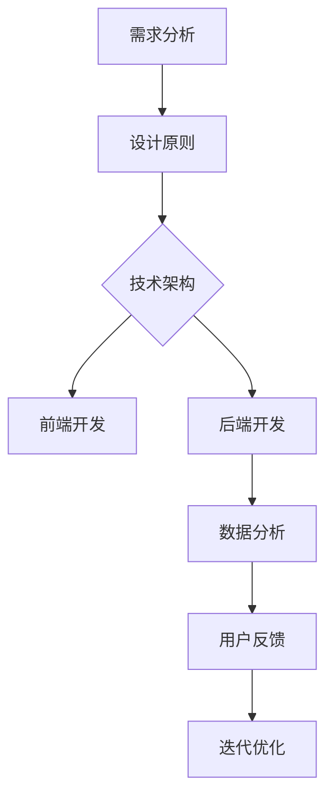

                 

# 创业公司的用户体验优化与满意度提升策略

## 摘要

在竞争激烈的市场环境中，创业公司的成功不仅仅依赖于技术创新，用户体验同样至关重要。本文将探讨创业公司在用户体验优化与满意度提升方面的重要策略。通过分析用户体验的核心要素，我们将详细探讨优化用户体验的方法，包括设计原则、技术实现和数据分析等环节。同时，本文还将提供实用的工具和资源推荐，帮助创业公司有效地提升用户体验和满意度，从而在市场中脱颖而出。

## 1. 背景介绍

在当今数字化时代，用户体验（User Experience，简称UX）已经成为创业公司在市场中立足的关键因素。用户对产品或服务的第一印象往往来自于其使用体验，因此，如何优化用户体验成为创业公司需要重点关注的问题。

用户体验不仅仅是产品的功能性，更涉及到用户在使用过程中的情感体验和满意度。一个良好的用户体验可以增加用户对产品的忠诚度，促进用户口碑传播，从而为创业公司带来持续的业务增长。

然而，创业公司在资源有限的情况下，如何有效地优化用户体验，提升用户满意度，是一个亟待解决的问题。本文将从设计原则、技术实现和数据分析等方面，为创业公司提供一套系统化的用户体验优化与满意度提升策略。

## 2. 核心概念与联系

### 用户体验（User Experience）

用户体验是指用户在使用产品或服务过程中所产生的整体感受和体验。它包括用户的情感体验、认知体验和行为体验。用户体验的好坏直接影响用户的满意度、忠诚度和口碑。

### 用户满意度（User Satisfaction）

用户满意度是衡量用户体验的重要指标。它反映了用户对产品或服务的满意程度，是提升用户忠诚度和口碑的基础。用户满意度可以通过问卷调查、用户反馈等方式进行量化评估。

### 设计原则（Design Principles）

设计原则是指导产品设计的重要理念。包括用户中心设计（User-Centered Design）、简洁性（Simplicity）、一致性（Consistency）、反馈（Feedback）等。遵循设计原则可以提升产品的易用性和用户满意度。

### 技术实现（Technical Implementation）

技术实现是用户体验优化的关键环节。包括前端技术、后端技术、数据存储和处理等。通过合理的技术架构和高效的技术实现，可以提高产品的性能和稳定性，从而提升用户体验。

### 数据分析（Data Analysis）

数据分析是用户体验优化的基础。通过收集和分析用户行为数据，可以了解用户的使用习惯、需求和痛点，从而为产品设计提供数据支持。常用的数据分析工具包括Google Analytics、Mixpanel等。

### Mermaid 流程图

以下是一个简化的用户体验优化流程的 Mermaid 流程图：



## 3. 核心算法原理 & 具体操作步骤

### 需求分析

需求分析是用户体验优化的第一步。具体操作步骤如下：

1. 收集用户反馈：通过问卷调查、用户访谈等方式收集用户对产品或服务的反馈。
2. 分析用户需求：对收集到的用户反馈进行分析，找出用户的核心需求和痛点。
3. 确定产品功能：根据用户需求，确定产品需要实现的功能。

### 设计原则

设计原则是指导产品设计的重要理念。具体操作步骤如下：

1. 用户中心设计：将用户置于设计核心，确保产品设计符合用户需求和习惯。
2. 简洁性：设计简洁直观，避免冗余和复杂的功能。
3. 一致性：保持产品界面和交互的一致性，提高用户体验的连贯性。
4. 反馈：及时给予用户反馈，增强用户对产品的信任感。

### 技术实现

技术实现是用户体验优化的关键环节。具体操作步骤如下：

1. 前端开发：采用合适的编程语言和框架（如React、Vue.js）进行前端开发，提高页面加载速度和交互体验。
2. 后端开发：构建高效稳定的后端架构（如微服务架构），提高系统性能和可扩展性。
3. 数据存储和处理：选择合适的数据存储和处理方案（如MySQL、MongoDB），确保数据的安全性和可靠性。

### 数据分析

数据分析是用户体验优化的基础。具体操作步骤如下：

1. 数据收集：通过日志记录、用户行为跟踪等方式收集用户数据。
2. 数据分析：使用数据分析工具（如Google Analytics、Mixpanel）对用户数据进行分析。
3. 数据可视化：将分析结果以图表等形式可视化，便于理解和决策。

### 用户反馈

用户反馈是优化用户体验的重要环节。具体操作步骤如下：

1. 获取反馈：通过用户调研、用户访谈等方式获取用户反馈。
2. 分析反馈：对用户反馈进行分析，找出用户关注的问题和需求。
3. 优化产品：根据用户反馈，对产品进行优化和迭代。

### 迭代优化

迭代优化是用户体验优化的持续过程。具体操作步骤如下：

1. 制定迭代计划：根据分析结果和用户反馈，制定迭代计划。
2. 实施迭代：按照迭代计划，对产品进行优化和迭代。
3. 监控效果：对迭代效果进行监控和评估，持续优化产品。

## 4. 数学模型和公式 & 详细讲解 & 举例说明

### 用户满意度模型

用户满意度模型可以通过以下公式表示：

\[ \text{User Satisfaction} = \frac{\text{Positive Experience} - \text{Negative Experience}}{\text{Total Experience}} \]

其中，Positive Experience 表示用户积极的体验，Negative Experience 表示用户消极的体验，Total Experience 表示用户整体体验。

### 用户流失率模型

用户流失率模型可以通过以下公式表示：

\[ \text{Churn Rate} = \frac{\text{Number of Users Lost}}{\text{Total Number of Users}} \]

其中，Number of Users Lost 表示流失的用户数量，Total Number of Users 表示总用户数量。

### 数据分析公式

数据分析中常用的一些公式如下：

1. 平均访问时长：

\[ \text{Average Visit Duration} = \frac{\text{Total Visit Duration}}{\text{Number of Visits}} \]

2. 页面跳出率：

\[ \text{Bounce Rate} = \frac{\text{Number of Single-Page Visits}}{\text{Total Number of Visits}} \]

3. 转化率：

\[ \text{Conversion Rate} = \frac{\text{Number of Conversions}}{\text{Total Number of Visitors}} \]

### 举例说明

假设一个创业公司的网站有以下数据：

- 总访问时长：1000小时
- 访问次数：100次
- 单页访问次数：30次
- 转化次数：10次

根据上述数据，可以计算出以下指标：

1. 平均访问时长：

\[ \text{Average Visit Duration} = \frac{1000}{100} = 10 \text{小时} \]

2. 页面跳出率：

\[ \text{Bounce Rate} = \frac{30}{100} = 30\% \]

3. 转化率：

\[ \text{Conversion Rate} = \frac{10}{100} = 10\% \]

通过这些数据，公司可以了解用户在其网站上的整体体验，从而针对性地进行优化。

## 5. 项目实战：代码实际案例和详细解释说明

### 5.1 开发环境搭建

在本节中，我们将搭建一个简单的用户反馈系统，用于收集和分析用户反馈数据。所需技术栈包括Node.js、Express框架和MongoDB数据库。

#### 步骤1：安装Node.js

在终端中运行以下命令，安装Node.js：

```bash
$ sudo apt-get update
$ sudo apt-get install nodejs
```

#### 步骤2：创建项目文件夹

在终端中创建一个名为`user-feedback-system`的项目文件夹：

```bash
$ mkdir user-feedback-system
$ cd user-feedback-system
```

#### 步骤3：初始化项目

在项目文件夹中初始化项目，安装所需的依赖项：

```bash
$ npm init -y
$ npm install express mongoose body-parser
```

#### 步骤4：创建数据库

在本节中，我们将使用MongoDB作为数据存储方案。首先，在MongoDB官方网站上创建一个账号并安装MongoDB。然后，在终端中启动MongoDB数据库：

```bash
$ mongod
```

### 5.2 源代码详细实现和代码解读

#### 步骤5：创建服务器文件

在项目文件夹中创建一个名为`server.js`的文件，用于搭建服务器。以下是服务器文件的源代码：

```javascript
const express = require('express');
const mongoose = require('mongoose');
const bodyParser = require('body-parser');

const app = express();

// 连接MongoDB数据库
mongoose.connect('mongodb://localhost:27017/userFeedback', {
  useNewUrlParser: true,
  useUnifiedTopology: true,
});

// 解析请求数据
app.use(bodyParser.json());

// 设置路由
app.post('/feedback', (req, res) => {
  // 处理用户反馈
});

// 启动服务器
const PORT = process.env.PORT || 3000;
app.listen(PORT, () => {
  console.log(`服务器正在运行，端口号：${PORT}`);
});
```

#### 步骤6：创建反馈模型

在项目文件夹中创建一个名为`models`的文件夹，并在其中创建一个名为`Feedback.js`的文件，用于定义反馈模型。以下是反馈模型的源代码：

```javascript
const mongoose = require('mongoose');

const feedbackSchema = new mongoose.Schema({
  name: {
    type: String,
    required: true,
  },
  email: {
    type: String,
    required: true,
  },
  message: {
    type: String,
    required: true,
  },
});

const Feedback = mongoose.model('Feedback', feedbackSchema);

module.exports = Feedback;
```

#### 步骤7：处理用户反馈

在`server.js`文件中，我们将添加一个处理用户反馈的路由。以下是处理用户反馈的代码：

```javascript
// 处理用户反馈
app.post('/feedback', async (req, res) => {
  try {
    // 创建反馈对象
    const feedback = new Feedback(req.body);

    // 保存反馈
    await feedback.save();

    // 返回响应
    res.status(201).json({ message: '反馈已提交' });
  } catch (error) {
    // 处理错误
    res.status(500).json({ message: '提交反馈失败' });
  }
});
```

#### 步骤8：启动服务器

在终端中运行以下命令，启动服务器：

```bash
$ node server.js
```

### 5.3 代码解读与分析

在本节中，我们创建了一个简单的用户反馈系统，用于收集用户反馈数据。以下是代码的解读与分析：

1. **服务器搭建**：使用Express框架搭建服务器，并连接MongoDB数据库。
2. **反馈模型**：使用Mongoose库定义反馈模型，包括用户名、邮箱和反馈信息等字段。
3. **处理用户反馈**：创建一个处理用户反馈的路由，接收用户提交的反馈数据，并保存到MongoDB数据库中。
4. **启动服务器**：在终端中启动服务器，监听3000端口，以便接收用户请求。

通过这个简单的用户反馈系统，我们可以收集和分析用户反馈数据，从而为产品优化提供数据支持。

## 6. 实际应用场景

在实际应用中，用户体验优化与满意度提升策略可以应用于各种创业公司，包括但不限于以下几个方面：

1. **电子商务平台**：优化购物流程，简化注册和支付环节，提高用户购物体验，从而提高转化率和用户满意度。
2. **在线教育平台**：提供个性化的学习内容和互动体验，提高用户的学习效果和满意度，从而促进用户留存和口碑传播。
3. **社交网络平台**：优化用户界面和交互体验，提高用户活跃度和满意度，从而增加用户粘性和用户时长。
4. **健康与健身应用**：提供个性化的健康建议和互动体验，提高用户的健康意识和满意度，从而促进用户长期使用。

在不同应用场景中，用户体验优化与满意度提升策略的具体实施方式和重点会有所不同，但总体原则是相似的。通过深入了解用户需求，优化产品设计和技术实现，以及持续收集和分析用户反馈，创业公司可以不断提升用户体验和满意度，从而在激烈的市场竞争中脱颖而出。

## 7. 工具和资源推荐

### 7.1 学习资源推荐

1. **书籍**：
   - 《用户体验要素》（The Elements of User Experience），作者：Jesse James Garrett
   - 《设计思维》（Design Thinking），作者：Tim Brown

2. **论文**：
   - “The Design of Sites: Patterns for Accessible Web Design”，作者：Jessy Inoculan
   - “User Experience Evaluation Methods”，作者：Niels Van Spaendonck

3. **博客**：
   - UIE（User Experience Engineering）：https://uietips.com/
   - Smashing Magazine：https://www.smashingmagazine.com/topics/user-experience/

4. **网站**：
   - UX Design Institute：https://www.uxdi.com/
   - Interaction Design Foundation：https://www.interaction-design.org/

### 7.2 开发工具框架推荐

1. **前端开发框架**：
   - React：https://reactjs.org/
   - Vue.js：https://vuejs.org/
   - Angular：https://angular.io/

2. **后端开发框架**：
   - Express.js：https://expressjs.com/
   - Django：https://www.djangoproject.com/
   - Flask：https://flask.palletsprojects.com/

3. **数据库**：
   - MongoDB：https://www.mongodb.com/
   - MySQL：https://www.mysql.com/
   - PostgreSQL：https://www.postgresql.org/

4. **数据分析工具**：
   - Google Analytics：https://analytics.google.com/analytics/
   - Mixpanel：https://mixpanel.com/
   - Segment：https://segment.com/

### 7.3 相关论文著作推荐

1. “User Experience: A Research Overview”，作者：Frank Spillers
2. “The Design of Sites: Patterns for Accessible Web Design”，作者：Jessy Inoculan
3. “User Experience Evaluation Methods”，作者：Niels Van Spaendonck
4. “The Design of Sites: Patterns for Accessible Web Design”，作者：Jessy Inoculan

## 8. 总结：未来发展趋势与挑战

随着科技的快速发展，用户体验优化与满意度提升策略在未来将继续发挥重要作用。以下是一些未来发展趋势与挑战：

### 发展趋势

1. **个性化体验**：随着大数据和人工智能技术的发展，创业公司将能够提供更加个性化的用户体验。
2. **跨平台整合**：用户对跨平台体验的需求越来越高，创业公司需要提供无缝的跨平台服务。
3. **可持续性**：用户体验优化不仅关注用户满意度，还关注环境和社会可持续性。
4. **隐私保护**：用户对隐私的关注日益增加，创业公司需要确保用户数据的安全和隐私。

### 挑战

1. **资源限制**：创业公司在资源有限的情况下，如何在用户体验优化上做出最优决策是一个挑战。
2. **技术变革**：技术的快速变革要求创业公司不断更新和调整用户体验策略。
3. **用户期望**：随着用户对产品和服务的要求不断提高，创业公司需要不断满足和超越用户的期望。
4. **竞争压力**：在激烈的市场竞争中，创业公司需要不断创新和优化用户体验，以保持竞争优势。

## 9. 附录：常见问题与解答

### Q：用户体验（UX）和用户界面（UI）有什么区别？

A：用户体验（UX）和用户界面（UI）是两个相关但不完全相同的概念。用户体验关注用户在使用产品或服务过程中的整体感受，包括情感、认知和行为等方面。用户界面（UI）则侧重于产品或服务的视觉设计和交互设计，即用户与产品或服务之间的互动方式。

### Q：用户体验优化有哪些常见方法？

A：用户体验优化的常见方法包括：

1. 需求分析：了解用户需求和使用习惯，为产品设计提供依据。
2. 设计原则：遵循用户体验设计原则，如简洁性、一致性、反馈等。
3. 技术实现：使用合适的编程语言和框架，提高产品的性能和稳定性。
4. 数据分析：通过数据分析了解用户行为，为产品优化提供数据支持。
5. 用户反馈：收集用户反馈，持续优化产品。

### Q：如何衡量用户体验？

A：用户体验可以通过以下指标进行衡量：

1. 用户满意度：用户对产品或服务的满意程度。
2. 用户留存率：用户在一定时间内继续使用产品的比例。
3. 用户转化率：用户完成特定目标（如购买、注册等）的比例。
4. 用户活跃度：用户在一定时间内使用产品的频率和时间。

## 10. 扩展阅读 & 参考资料

1. Spillers, F. (2018). User Experience: A Research Overview. In *ACM Transactions on Computer-Human Interaction*.
2. Inoculan, J. (2006). The Design of Sites: Patterns for Accessible Web Design. A List Apart.
3. Van Spaendonck, N. (2012). User Experience Evaluation Methods. *International Journal of Human-Computer Studies*.
4. Brown, T. (2008). Design Thinking. Harvard Business Review.
5. Garrett, J. (2002). The Elements of User Experience. New Riders.
6. Nielsen, J. (2012). Prioritizing Usability. *Nielsen Norman Group*.
7. Krug, S. (2006). Don’t Make Me Think, Revisited: A Common Sense Approach to Web Usability. Pearson Education.
8. https://www.uxpin.com/
9. https://uxplanet.org/
10. https://www.interaction-design.org/

