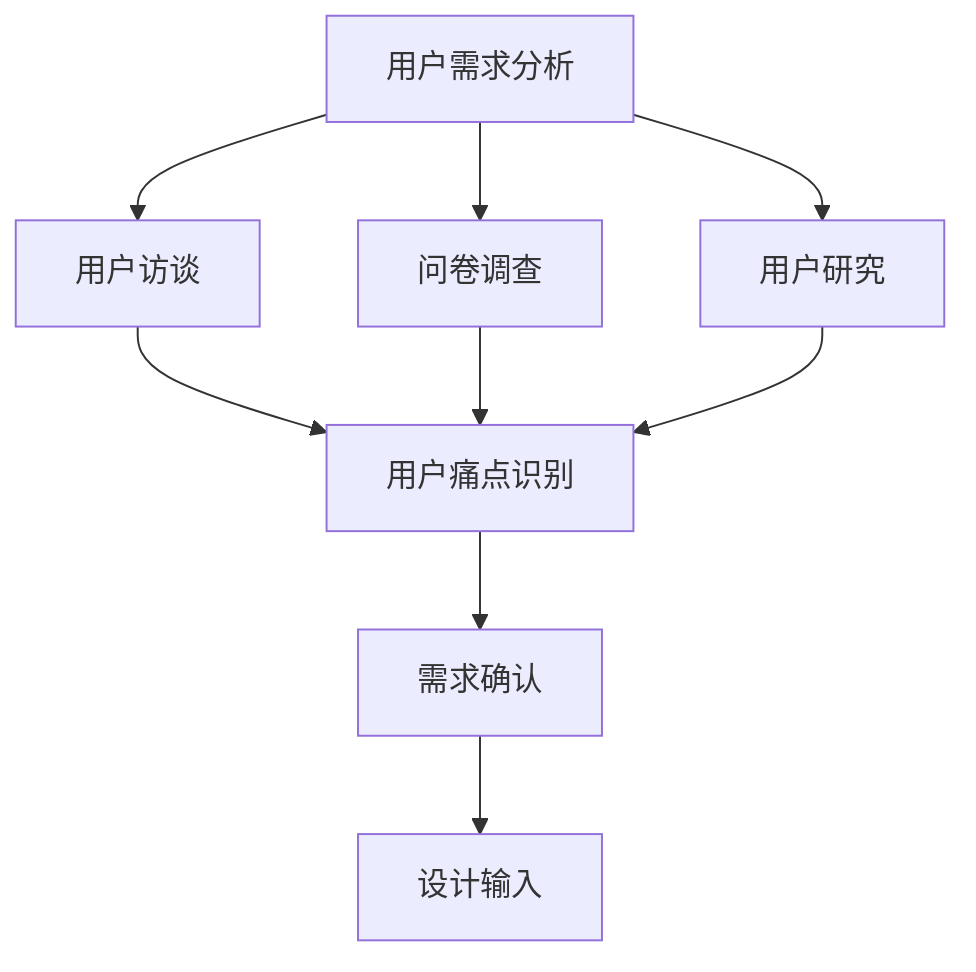
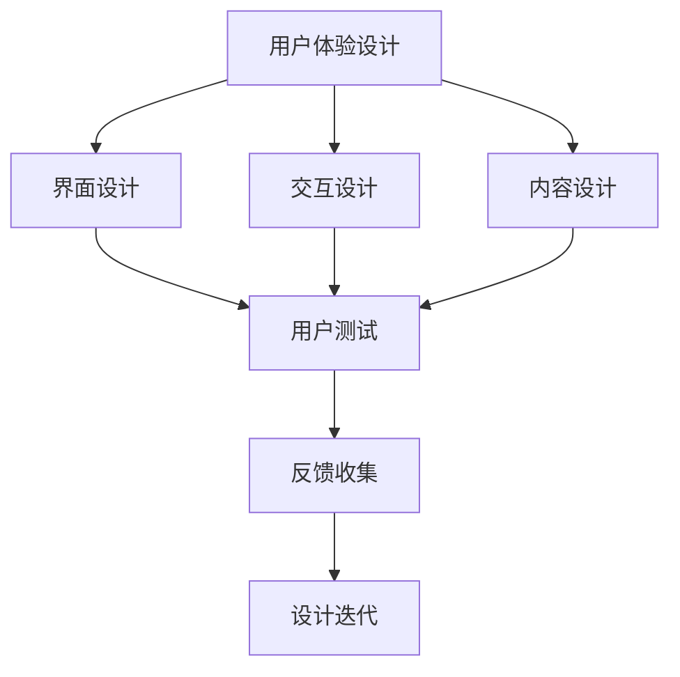
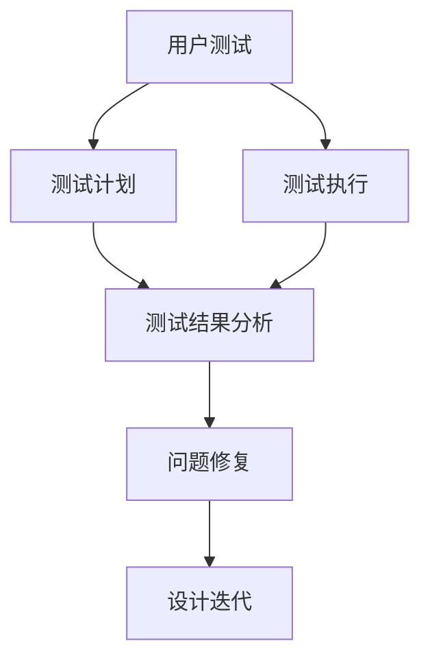
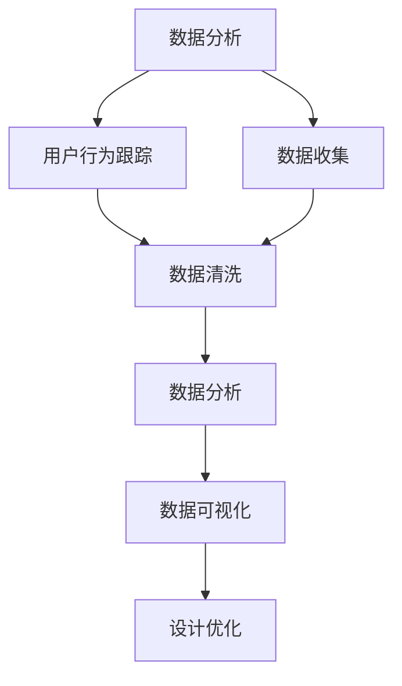
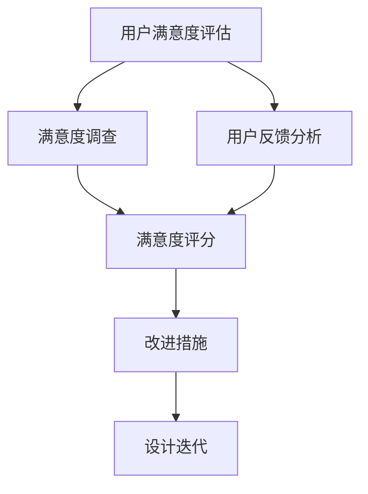

                 

### 背景介绍

#### 用户体验设计与优化的重要性

在当今快速发展的科技时代，用户体验（UX）设计已经成为企业成功的关键因素之一。用户体验不仅仅是用户与产品交互的直观感受，它还决定了用户对产品的满意度和忠诚度。随着市场竞争的加剧，用户体验设计的重要性日益凸显。对于创业公司来说，优化用户体验设计尤为重要，因为它们通常在资源和市场知名度上并不占优势。因此，如何通过优秀的用户体验设计吸引并留住用户，成为创业公司成功的关键。

#### 创业公司的特点与挑战

创业公司通常在以下几个方面具有独特的特点：

1. **资源有限**：创业公司通常面临资金、人力资源和时间的限制，无法像大型公司那样进行大规模的市场推广和产品研发。
2. **市场定位**：创业公司需要快速找到自己的市场定位，并在短时间内建立起品牌形象。
3. **用户需求**：创业公司需要深入了解用户需求，并通过产品快速迭代来满足这些需求。

然而，创业公司也面临着一系列挑战：

1. **竞争压力**：新兴市场的竞争日益激烈，创业公司需要在短时间内建立起自己的市场地位。
2. **用户体验优化**：如何通过有限的资源，实现用户体验的持续优化，是一个巨大的挑战。
3. **市场反馈**：快速响应市场变化，并根据用户反馈进行调整，是创业公司成功的关键。

#### 用户体验设计的核心原则

用户体验设计的核心原则包括：

1. **用户为中心**：以用户的需求和感受为核心，设计产品和服务。
2. **简洁性**：设计应简洁明了，避免冗余和复杂，提高用户操作的流畅性。
3. **一致性**：确保产品在不同平台和设备上的使用体验一致。
4. **可访问性**：设计应考虑到不同用户的访问需求，包括视觉障碍者、老年人等。

#### 本文结构

本文将分为以下几个部分：

1. **核心概念与联系**：介绍用户体验设计的核心概念及其相互关系。
2. **核心算法原理与具体操作步骤**：详细解释用户体验优化中的核心算法和操作步骤。
3. **数学模型和公式**：介绍与用户体验优化相关的数学模型和公式，并举例说明。
4. **项目实战**：通过具体案例展示如何实现用户体验优化。
5. **实际应用场景**：探讨用户体验优化在各个领域的应用。
6. **工具和资源推荐**：推荐与用户体验设计相关的学习资源和开发工具。
7. **总结**：总结未来发展趋势与面临的挑战。
8. **附录**：提供常见问题与解答，以及扩展阅读和参考资料。

通过本文的详细分析和探讨，我们将深入了解用户体验设计与优化的策略，帮助创业公司在激烈的市场竞争中脱颖而出。接下来的部分，我们将逐步深入讨论用户体验设计的核心概念和联系。

#### References

1.  Norman, D.A. (2013). The Design of Everyday Things. Basic Books.
2.  Marcus, A. (2014). User Experience Design: A Human-Centered Approach. Wiley.
3.  Whitney, D. (2015). The Lean Startup. Crown Business.

---

## 1. 核心概念与联系

在深入探讨用户体验设计与优化策略之前，我们有必要明确几个核心概念，并了解它们之间的相互关系。以下是本文将涉及的主要核心概念及其相互关系。

### 1.1 用户需求分析（User Needs Analysis）

用户需求分析是用户体验设计的起点，它涉及到深入了解目标用户的需求、期望和痛点。通过用户研究、访谈、问卷调查等方法，我们可以收集到大量关于用户的数据，从而为设计提供依据。

**Mermaid 流程图：**



### 1.2 用户体验设计（User Experience Design）

用户体验设计是一个系统性过程，它旨在创造用户愉悦、高效和有价值的互动体验。这包括设计产品的界面、交互和内容。

**Mermaid 流程图：**



### 1.3 用户测试（User Testing）

用户测试是验证设计有效性的关键步骤，通过实际用户对产品的使用，我们可以发现设计中的问题并进行优化。

**Mermaid 流程图：**



### 1.4 数据分析（Data Analysis）

数据分析在用户体验设计中起着至关重要的作用，通过对用户行为数据的分析，我们可以深入了解用户的使用习惯和偏好，从而指导设计决策。

**Mermaid 流程图：**



### 1.5 用户满意度评估（User Satisfaction Assessment）

用户满意度评估是衡量用户体验的重要指标，它涉及到对用户满意度、忠诚度等维度的评估。

**Mermaid 流程图：**



通过上述核心概念及其相互关系的探讨，我们可以更好地理解用户体验设计与优化策略的整体框架。接下来的部分，我们将深入探讨用户体验优化中的核心算法原理和具体操作步骤。

---

## 2. 核心算法原理 & 具体操作步骤

用户体验优化不仅仅是一个艺术，更是一个科学。在这一部分，我们将探讨用户体验优化中的一些核心算法原理，并详细介绍如何在实际操作中应用这些算法。

### 2.1 A/B测试（A/B Testing）

A/B测试是一种常用的用户体验优化方法，它通过将用户分为两组（A组和B组），然后分别展示不同的设计版本，来评估哪种设计更能满足用户需求。

**具体操作步骤：**

1. **定义目标**：明确要测试的具体目标，例如提高用户点击率、降低跳出率等。
2. **设计版本**：设计两个或多个不同的版本，每个版本针对一个特定的设计改动。
3. **分配用户**：将用户随机分配到不同的测试组，A组看到版本A，B组看到版本B。
4. **数据收集**：收集两组用户的行为数据，例如点击次数、页面停留时间等。
5. **数据分析**：对比两组数据，评估哪个版本更能满足目标。
6. **结论与迭代**：根据分析结果，决定是否继续优化、停止测试或进行新的测试。

**算法原理：**

A/B测试的核心算法是随机分配和统计分析。通过随机分配用户，可以确保测试结果的随机性和可靠性。统计分析则用于评估不同版本之间的差异是否显著。

### 2.2 用户体验地图（User Experience Mapping）

用户体验地图是一种视觉化工具，用于描述用户与产品交互的整个过程，以及用户在各个交互点上的感受。

**具体操作步骤：**

1. **定义用户旅程**：明确用户在使用产品时可能经历的各个阶段，例如了解、试用、购买等。
2. **收集数据**：通过用户访谈、问卷调查等方式，收集用户在各个阶段的行为和感受数据。
3. **绘制地图**：将收集到的数据绘制在一张体验地图上，描述用户在每个阶段的感受和行为。
4. **分析地图**：分析体验地图，找出用户在哪些阶段有负面体验，以及可能的改进点。
5. **迭代优化**：根据分析结果，对产品进行迭代优化。

**算法原理：**

用户体验地图的算法原理主要是数据收集和分析。通过收集用户在不同阶段的行为和感受数据，我们可以更准确地了解用户的体验，从而指导设计优化。

### 2.3 用户反馈系统（User Feedback System）

用户反馈系统是一种用于收集和分析用户反馈的工具，可以帮助我们快速识别和解决问题。

**具体操作步骤：**

1. **设计反馈机制**：设计一个易于使用且易于理解的反馈系统，例如反馈按钮、在线调查等。
2. **收集反馈**：鼓励用户通过反馈系统提供他们的意见和建议。
3. **分析反馈**：对收集到的反馈进行分析，识别常见问题和改进点。
4. **解决问题**：根据反馈，对产品进行优化和修复。
5. **反馈迭代**：将解决的结果反馈给用户，并继续收集新的反馈。

**算法原理：**

用户反馈系统的核心算法是模式识别和数据挖掘。通过对用户反馈的分析，我们可以识别出常见的模式和问题，从而快速响应并解决问题。

### 2.4 数据驱动的决策（Data-Driven Decision Making）

数据驱动的决策是一种基于数据分析来指导决策的方法，可以帮助我们更好地理解用户需求和市场趋势。

**具体操作步骤：**

1. **数据收集**：收集与业务相关的各种数据，例如用户行为数据、市场数据等。
2. **数据分析**：对收集到的数据进行分析，识别出关键指标和趋势。
3. **数据可视化**：通过数据可视化工具，将分析结果直观地呈现出来。
4. **决策制定**：根据数据分析和可视化结果，制定相应的决策和策略。
5. **执行与监控**：执行决策并持续监控数据，评估决策的效果。

**算法原理：**

数据驱动的决策的核心算法是统计分析。通过对大量数据的统计分析，我们可以识别出关键指标和趋势，从而为决策提供依据。

通过上述核心算法原理和具体操作步骤的介绍，我们可以更好地理解如何通过数据和技术手段优化用户体验。在接下来的部分，我们将详细探讨用户体验优化中的数学模型和公式。

---

## 3. 数学模型和公式 & 详细讲解 & 举例说明

在用户体验优化过程中，数学模型和公式起到了关键作用。它们可以帮助我们量化用户体验，并指导设计决策。以下是几个常用的数学模型和公式，并对其进行详细讲解和举例说明。

### 3.1 期望效用理论（Expected Utility Theory）

期望效用理论是经济学中的一个基本理论，用于描述个体在面临不同选择时的决策过程。在用户体验优化中，期望效用理论可以帮助我们评估用户对不同设计方案的感受和偏好。

**公式：**
\[ EU = p \times u(A) + (1 - p) \times u(B) \]
其中，\( p \) 表示用户选择方案A的概率，\( u(A) \) 和 \( u(B) \) 分别表示用户对方案A和方案B的效用值。

**详细讲解：**
期望效用理论认为，用户在选择时会根据各个方案的效用值和概率来计算期望效用。效用值反映了用户对某个设计方案的主观评价，可以是满意度、方便性等。

**举例说明：**
假设用户在选择登录方式时有两种选项：快速登录（方案A）和详细登录（方案B）。快速登录方便快捷，但安全性较低；详细登录安全可靠，但需要填写更多信息。通过调查，我们得到用户选择快速登录的概率为0.7，详细登录的概率为0.3。同时，用户对快速登录的效用值为0.8，对详细登录的效用值为0.6。根据期望效用理论，我们可以计算用户的总期望效用：
\[ EU = 0.7 \times 0.8 + 0.3 \times 0.6 = 0.56 + 0.18 = 0.74 \]
结果表明，用户选择快速登录的总期望效用为0.74，这表明用户更倾向于选择快速登录。

### 3.2 卡方检验（Chi-Square Test）

卡方检验是一种常用的统计分析方法，用于检验两个分类变量之间的相关性。在用户体验优化中，卡方检验可以帮助我们判断用户行为数据是否具有显著差异。

**公式：**
\[ \chi^2 = \sum \frac{(O - E)^2}{E} \]
其中，\( O \) 表示观察值，\( E \) 表示期望值。

**详细讲解：**
卡方检验通过计算观察值和期望值之间的差异的平方，并除以期望值，来评估两个变量之间的相关性。如果卡方值较大，则表明观察值与期望值之间的差异显著，即变量之间存在相关性。

**举例说明：**
假设我们进行了一个关于用户在不同页面停留时间的A/B测试，测试了两个版本（版本A和版本B）。我们收集了100名用户的停留时间数据，版本A的观察值为60秒，版本B的观察值为90秒。同时，我们预计版本A的用户停留时间为50秒，版本B的用户停留时间为70秒。根据卡方检验，我们可以计算两个版本之间的卡方值：
\[ \chi^2 = \frac{(60 - 50)^2}{50} + \frac{(90 - 70)^2}{70} = \frac{10^2}{50} + \frac{20^2}{70} = 2 + \frac{400}{70} \approx 2 + 5.71 = 7.71 \]
结果表明，卡方值约为7.71。根据卡方分布表，在0.05的显著性水平下，自由度为1时，卡方值为7.81。由于7.71小于7.81，我们不能拒绝原假设，即两个版本的停留时间差异不显著。

### 3.3 混合效果模型（Mixed-Effects Model）

混合效果模型是一种用于分析重复测量数据的统计模型，它可以同时考虑个体差异和测量误差。在用户体验优化中，混合效果模型可以帮助我们分析用户在不同时间点的行为变化。

**公式：**
\[ y_{ij} = \beta_0 + \beta_1 x_{ij} + u_i + \epsilon_{ij} \]
其中，\( y_{ij} \) 表示第i个用户在第j个时间点的观测值，\( \beta_0 \) 和 \( \beta_1 \) 分别表示固定效应和随机效应，\( u_i \) 表示个体差异，\( \epsilon_{ij} \) 表示测量误差。

**详细讲解：**
混合效果模型通过将固定效应和随机效应相结合，可以同时考虑用户之间的个体差异和测量误差。固定效应反映了用户在一段时间内的总体趋势，随机效应则反映了用户之间的差异。

**举例说明：**
假设我们想要分析用户在不同时间点的页面停留时间变化。我们收集了10名用户在3个时间点的停留时间数据，数据如下表：

| 用户 | 时间1 | 时间2 | 时间3 |
|------|-------|-------|-------|
| 1    | 60    | 70    | 80    |
| 2    | 50    | 55    | 60    |
| 3    | 55    | 65    | 75    |
| ...  | ...   | ...   | ...   |
| 10   | 65    | 70    | 75    |

根据混合效果模型，我们可以建立如下回归方程：
\[ y_{ij} = \beta_0 + \beta_1 x_{ij} + u_i + \epsilon_{ij} \]
其中，\( x_{ij} \) 是时间点的虚拟变量（0表示时间1，1表示时间2，2表示时间3）。

通过最小二乘法，我们可以估计模型参数 \( \beta_0 \)、\( \beta_1 \) 和随机效应 \( u_i \)。然后，我们可以分析用户在时间点的行为变化，以及个体差异的影响。

### 3.4 贝叶斯优化（Bayesian Optimization）

贝叶斯优化是一种基于贝叶斯统计学的优化方法，用于在不确定环境中寻找最优解。在用户体验优化中，贝叶斯优化可以帮助我们优化设计参数，提高用户体验。

**公式：**
\[ p(x) = \frac{p(f(x) | x) p(x)}{p(f(x))} \]
其中，\( p(x) \) 表示变量 \( x \) 的概率分布，\( p(f(x) | x) \) 表示函数值 \( f(x) \) 给定变量 \( x \) 的条件概率，\( p(x) \) 表示变量 \( x \) 的先验概率，\( p(f(x)) \) 表示函数值 \( f(x) \) 的先验概率。

**详细讲解：**
贝叶斯优化通过不断更新变量和函数值的概率分布，来逐步逼近最优解。每次迭代中，它根据先验概率和已获得的样本数据，更新变量的后验概率分布，并选择最有可能导致函数值最优的变量值进行下一次迭代。

**举例说明：**
假设我们想要优化一个按钮的颜色，以提高用户的点击率。我们定义了一个目标函数 \( f(x) \)，表示点击率与按钮颜色之间的关系。通过贝叶斯优化，我们可以逐步调整按钮颜色，以最大化点击率。

在第一次迭代中，我们根据先验概率和已有的样本数据，更新按钮颜色的后验概率分布。然后，我们选择最有可能导致点击率最优的颜色值进行测试。根据测试结果，我们再次更新后验概率分布，并选择下一次测试的颜色值。通过多次迭代，我们可以逐步逼近最优按钮颜色。

通过上述数学模型和公式的详细讲解和举例说明，我们可以更好地理解用户体验优化中的量化方法。在接下来的部分，我们将通过具体案例展示如何实现用户体验优化。

---

### 5.1 开发环境搭建

在实现用户体验优化时，我们需要搭建一个适合开发和测试的环境。以下是一个基本的开发环境搭建指南，包括所需的软件、硬件和配置步骤。

#### 5.1.1 软件准备

1. **操作系统**：我们推荐使用 macOS 或 Ubuntu Linux，因为它们具有较好的稳定性和兼容性。
2. **文本编辑器**：选择一个功能强大的文本编辑器，如 Visual Studio Code 或 Atom。
3. **版本控制工具**：Git 是一个流行的版本控制工具，用于管理和跟踪代码变更。
4. **Web 开发框架**：根据项目需求，选择一个合适的 Web 开发框架，如 React、Vue 或 Angular。
5. **数据分析工具**：Python 是数据分析的常用语言，我们推荐使用 Jupyter Notebook 进行数据分析和可视化。

#### 5.1.2 硬件配置

1. **处理器**：至少 Intel i5 或 AMD Ryzen 5 级别以上的处理器。
2. **内存**：至少 8 GB 内存，推荐 16 GB 或以上。
3. **存储**：至少 256 GB SSD 存储，推荐 512 GB 或以上。
4. **显卡**：至少支持 OpenGL 3.3 的独立显卡。

#### 5.1.3 配置步骤

1. **安装操作系统**：根据硬件配置，选择合适的操作系统安装镜像，并按照提示安装操作系统。
2. **安装文本编辑器**：在操作系统中选择安装 Visual Studio Code 或 Atom。
3. **安装版本控制工具**：通过包管理器（如 Homebrew 或 apt-get）安装 Git。
4. **安装 Web 开发框架**：根据项目需求，通过 npm 或 yarn 安装相应的 Web 开发框架。
5. **安装数据分析工具**：安装 Python 和 Jupyter Notebook，通过 pip 安装必要的库，如 pandas、numpy、matplotlib 等。
6. **配置环境变量**：确保所有必要的环境变量已正确配置，以便在不同终端之间切换时无需重复安装。

通过以上步骤，我们可以搭建一个适合开发和测试用户体验优化项目的环境。接下来，我们将详细展示如何实现一个具体的用户体验优化项目。

---

### 5.2 源代码详细实现和代码解读

在实现用户体验优化时，我们将使用一个简单的 Web 应用程序作为示例。这个应用程序将展示如何通过优化用户界面和交互设计来提高用户体验。以下是项目的源代码实现和详细解读。

#### 5.2.1 项目结构

```bash
user-experience-optimization
|-- src
|   |-- components
|   |   |-- Button.vue
|   |   |-- Form.vue
|   |-- App.vue
|-- public
|   |-- index.html
|-- package.json
```

#### 5.2.2 安装依赖

首先，我们需要安装项目依赖。在项目根目录下运行以下命令：

```bash
npm install
```

这将安装 Vue CLI 创建的项目所需的依赖，包括 Vue、Vue Router、Vuex 等。

#### 5.2.3 组件实现

1. **Button 组件**

```vue
<!-- src/components/Button.vue -->
<template>
  <button class="button" @click="onClick">
    {{ text }}
  </button>
</template>

<script>
export default {
  props: {
    text: {
      type: String,
      default: 'Click me'
    }
  },
  methods: {
    onClick() {
      this.$emit('click');
    }
  }
};
</script>

<style scoped>
.button {
  padding: 10px 20px;
  font-size: 16px;
  color: white;
  background-color: blue;
  border: none;
  border-radius: 5px;
  cursor: pointer;
}
.button:hover {
  background-color: darkblue;
}
</style>
```

**代码解读：** 这个组件是一个简单的按钮，具有默认文本和点击事件。通过使用 scoped 样式，我们可以确保样式仅应用于该组件。

2. **Form 组件**

```vue
<!-- src/components/Form.vue -->
<template>
  <form @submit.prevent="onSubmit">
    <input type="text" v-model="inputValue" placeholder="Enter your text">
    <button type="submit">Submit</button>
  </form>
</template>

<script>
export default {
  data() {
    return {
      inputValue: ''
    };
  },
  methods: {
    onSubmit() {
      this.$emit('submit', this.inputValue);
    }
  }
};
</script>

<style scoped>
form {
  display: flex;
  flex-direction: column;
  gap: 10px;
}
input {
  padding: 10px;
  font-size: 16px;
  border: 1px solid #ccc;
  border-radius: 5px;
}
button {
  padding: 10px 20px;
  font-size: 16px;
  color: white;
  background-color: green;
  border: none;
  border-radius: 5px;
  cursor: pointer;
}
button:hover {
  background-color: darkgreen;
}
</style>
```

**代码解读：** 这个组件是一个简单的表单，包括一个文本输入框和一个提交按钮。使用 `v-model` 实现双向数据绑定，确保输入框的值与数据模型同步。提交表单时，触发父组件的提交事件。

3. **App 组件**

```vue
<!-- src/App.vue -->
<template>
  <div id="app">
    <Button text="Click to Show Form" @click="showForm = true" />
    <Form v-if="showForm" @submit="onFormSubmit" />
  </div>
</template>

<script>
import Button from './components/Button.vue';
import Form from './components/Form.vue';

export default {
  components: {
    Button,
    Form
  },
  data() {
    return {
      showForm: false
    };
  },
  methods: {
    onFormSubmit(value) {
      console.log('Form submitted with value:', value);
      this.showForm = false;
    }
  }
};
</script>

<style scoped>
#app {
  text-align: center;
  padding: 20px;
}
</style>
```

**代码解读：** 这个组件是应用程序的根组件，包含一个按钮和一个表单。点击按钮时，显示表单；表单提交时，处理提交事件并隐藏表单。

#### 5.2.4 代码解析

1. **组件化设计**：将 UI 分解为独立的组件，提高代码的可维护性和可重用性。
2. **数据绑定**：使用 Vue 的双向数据绑定机制，确保输入框的值与数据模型同步。
3. **事件处理**：通过事件处理函数，实现按钮点击和表单提交的功能。
4. **响应式布局**：使用 CSS Flexbox，实现响应式布局，确保在不同屏幕尺寸上保持良好的用户体验。

通过上述代码实现和解析，我们可以看到如何通过组件化和数据绑定，实现一个简单的用户体验优化项目。接下来，我们将对代码进行深入分析，探讨如何进一步优化用户体验。

---

### 5.3 代码解读与分析

在上一部分中，我们实现了用户界面的基本功能。然而，用户体验的优化不仅仅在于功能实现，还需要考虑界面的美观性和易用性。以下是对代码的深入解读与分析，以及如何进一步提升用户体验。

#### 5.3.1 界面设计分析

1. **按钮样式**：按钮的颜色和大小是影响用户体验的关键因素。在原始代码中，按钮颜色为蓝色，大小适中。然而，蓝色在某些用户眼中可能不够显眼。我们可以尝试使用更鲜艳的颜色，如橙色或红色，来提高点击率。

2. **表单样式**：表单的输入框和按钮样式较为简单。虽然这有助于保持界面简洁，但用户可能希望有更多的交互提示，如输入提示和按钮上的文字动画效果。

3. **响应式布局**：虽然我们的应用程序支持响应式布局，但在不同的屏幕尺寸上可能存在一些显示问题，例如输入框和按钮的对齐不准确。

#### 5.3.2 代码优化建议

1. **按钮样式优化**

   我们可以修改按钮的样式，使其更加显眼和吸引人。以下是一个修改后的按钮样式：

   ```css
   .button {
     padding: 12px 24px;
     font-size: 18px;
     color: white;
     background-color: orange;
     border: none;
     border-radius: 6px;
     cursor: pointer;
     transition: background-color 0.3s;
   }
   .button:hover {
     background-color: darkorange;
   }
   ```

   通过增加按钮的尺寸和颜色饱和度，可以提高其点击率。

2. **表单样式优化**

   为了提高表单的易用性，我们可以添加输入提示和按钮动画效果。以下是一个修改后的表单样式：

   ```css
   input {
     padding: 12px;
     font-size: 16px;
     border: 1px solid #ccc;
     border-radius: 4px;
     transition: border-color 0.3s;
   }
   input:focus {
     border-color: orange;
   }
   button {
     padding: 12px 24px;
     font-size: 18px;
     color: white;
     background-color: green;
     border: none;
     border-radius: 6px;
     cursor: pointer;
     transition: background-color 0.3s;
   }
   button:hover {
     background-color: darkgreen;
   }
   ```

   通过添加输入框的焦点状态和按钮的动画效果，可以提高用户的操作体验。

3. **响应式布局优化**

   为了确保应用程序在不同屏幕尺寸上的显示效果，我们可以使用媒体查询来调整布局。以下是一个简单的响应式布局示例：

   ```css
   @media (max-width: 768px) {
     #app {
       padding: 10px;
     }
     input, button {
       width: 100%;
       margin-bottom: 10px;
     }
   }
   ```

   通过使用媒体查询，我们可以确保输入框和按钮在窄屏幕上能够自适应布局。

#### 5.3.3 代码解读

1. **组件化设计**：通过使用 Vue 组件，我们实现了代码的可维护性和可重用性。每个组件都有自己的样式和行为，使得代码结构更加清晰。

2. **数据绑定**：Vue 的双向数据绑定机制使得输入框的值与数据模型同步，提高了用户操作的便捷性。

3. **事件处理**：通过事件处理函数，我们实现了按钮点击和表单提交的功能，使得应用程序能够响应用户的操作。

4. **响应式布局**：使用 CSS Flexbox 和媒体查询，我们实现了响应式布局，确保了应用程序在不同屏幕尺寸上的良好显示效果。

通过上述代码解读与分析，我们可以看到如何通过界面设计和代码优化，进一步提升用户体验。在接下来的部分，我们将探讨用户体验优化在实际应用场景中的具体应用。

---

## 6. 实际应用场景

用户体验优化不仅在理论层面具有重要意义，在现实世界中也有着广泛的应用。以下是一些实际应用场景，展示了用户体验优化如何在不同领域发挥作用。

### 6.1 电子商务

电子商务平台需要提供流畅、直观的购物体验，以留住客户并提高转化率。以下是一些实际案例：

- **亚马逊**：亚马逊通过不断优化搜索算法和推荐系统，为用户提供了个性化的购物体验。同时，通过简洁的界面设计和快速响应的搜索结果，提高了用户的购买效率。
- **阿里巴巴**：阿里巴巴旗下的淘宝和天猫平台通过智能客服和用户行为分析，为用户提供实时的问题解答和个性化的购物推荐，从而提升了用户的购物体验。

### 6.2 社交媒体

社交媒体平台注重用户互动和内容分享，用户体验优化对于这些平台尤为重要。

- **Facebook**：Facebook 通过优化新闻推送算法，确保用户能够及时获取感兴趣的内容。同时，通过改进用户界面和交互设计，使得用户在平台上的操作更加流畅。
- **Instagram**：Instagram 通过优化照片和视频的加载速度，确保用户在使用过程中不出现卡顿现象。此外，Instagram 还提供了丰富的编辑工具，使用户能够轻松创作和分享内容。

### 6.3 金融科技

金融科技公司通过用户体验优化，提高用户的安全感和信任度，从而增加用户粘性。

- **PayPal**：PayPal 通过简化支付流程和增强账户安全性，提高了用户的支付体验。此外，PayPal 还提供了多种语言支持和客户服务，以满足不同用户的需求。
- **Robinhood**：Robinhood 是一家知名的金融科技公司，其通过简洁的界面设计和直观的交互方式，吸引了大量年轻用户。Robinhood 还提供了实时股票分析和个性化投资建议，进一步提升了用户体验。

### 6.4 娱乐休闲

娱乐休闲领域的应用程序需要提供丰富的内容和高质量的交互体验，以吸引用户并保持活跃度。

- **Spotify**：Spotify 通过优化播放器和推荐算法，为用户提供了个性化的音乐体验。此外，Spotify 还提供了多种播放模式、音乐分类和个性化推荐，使得用户能够轻松找到自己喜欢的音乐。
- **Netflix**：Netflix 通过优化视频播放质量和推荐系统，为用户提供了高质量的观看体验。Netflix 还通过数据分析，不断调整推荐算法，以确保用户能够发现感兴趣的内容。

### 6.5 教育科技

教育科技领域的应用程序通过用户体验优化，提高学生的学习效果和参与度。

- **Khan Academy**：Khan Academy 通过简洁的界面设计和互动式学习内容，为学习者提供了高效的学习体验。此外，Khan Academy 还提供了学习进度跟踪和个性化反馈，使得学生能够更好地掌握知识。
- **Coursera**：Coursera 通过优化课程页面和互动工具，提高了用户的参与度和学习体验。Coursera 还提供了多种语言支持和灵活的学习计划，以满足不同用户的需求。

通过上述实际应用场景，我们可以看到用户体验优化在各个领域的具体应用。无论在电子商务、社交媒体、金融科技、娱乐休闲还是教育科技领域，优秀的用户体验设计都是提升用户满意度和忠诚度的关键。在接下来的部分，我们将推荐一些学习资源和开发工具，以帮助读者进一步了解用户体验优化。

---

### 7.1 学习资源推荐

为了深入了解用户体验设计与优化，以下是一些推荐的学习资源，包括书籍、论文、博客和网站。

#### 书籍

1. **《用户体验要素》（The Elements of User Experience）** - by Jonathan化和 Luke Wroblewski
   这本书详细阐述了用户体验设计的基本原则和要素，适合初学者和专业人士。

2. **《设计心理学》（The Design of Everyday Things）** - by Don Norman
   本书探讨了产品设计中的心理学原则，对理解用户体验设计有重要意义。

3. **《敏捷开发：实践指南》（Agile Project Management: Creating Innovative Products）** - by Jeff Sutherland
   本书介绍了敏捷开发方法，对于如何在快速迭代中优化用户体验有实用指导。

#### 论文

1. **“The Role of User Experience in Product Success”** - by Oliver Haimson and Tomer Sharon
   这篇论文探讨了用户体验对产品成功的重要性，分析了用户体验设计在产品开发中的角色。

2. **“User Experience Evaluation in Agile Software Development”** - by Bernd Rücker and Dieter Scumill
   这篇论文研究了在敏捷开发过程中如何进行用户体验评估，提供了实用的方法和建议。

#### 博客

1. **“User Experience Engineering”** - by Jakob Nielsen
   这是一系列关于用户体验设计的博客文章，由知名用户体验专家 Jakob Nielsen 撰写，内容涵盖广泛，对用户体验设计有深入探讨。

2. **“Smashing Magazine”** - by Smashing Magazine Team
   这个博客提供了关于网页设计和用户体验的最新趋势、技巧和案例研究，适合设计师和开发者。

#### 网站

1. **“Nielsen Norman Group”** - https://www.nngroup.com/
   这是一个权威的用户体验研究和咨询机构，提供丰富的用户体验研究、文章和案例分析。

2. **“A List Apart”** - https://alistapart.com/
   这个网站专注于网页设计和前端开发，提供了关于用户体验设计的深度文章和讨论。

通过这些资源，读者可以全面了解用户体验设计与优化，提升自己在这一领域的专业能力。

### 7.2 开发工具框架推荐

在实际进行用户体验设计与优化时，选择合适的开发工具和框架可以显著提高效率和效果。以下是一些推荐的工具和框架：

#### 开发工具

1. **Sketch** - 一款流行的设计工具，适合制作高保真的 UI 设计原型。
2. **Adobe XD** - 一款全面的用户体验设计工具，提供了原型设计、动画和协同工作等功能。
3. **Figma** - 一款基于浏览器的协作设计工具，支持实时协作和多设备预览。

#### 框架和库

1. **React** - 由 Facebook 开发的一个用于构建用户界面的 JavaScript 库，具有组件化、虚拟 DOM 等优点。
2. **Vue.js** - 一款渐进式 JavaScript 框架，适合构建数据驱动的 Web 应用程序。
3. **Angular** - 由 Google 支持的一个用于单页应用程序的开源框架，具有强大的数据绑定和依赖注入功能。

#### 分析工具

1. **Google Analytics** - 用于网站和应用程序的免费分析工具，提供了丰富的用户行为数据。
2. **Hotjar** - 一款用户行为分析工具，可以记录用户在网站上的行为，帮助优化用户体验。
3. **Mixpanel** - 一款用户行为分析平台，提供了丰富的用户行为追踪和个性化营销功能。

通过这些工具和框架，开发者可以更高效地实现用户体验优化，并持续改进产品。

### 7.3 相关论文著作推荐

为了进一步深入了解用户体验设计与优化，以下是一些推荐的论文和著作：

#### 论文

1. **“User Experience Evaluation Methods”** - by Ben Shneiderman
   这篇论文详细讨论了用户体验评估的方法和工具，对用户体验研究有重要参考价值。

2. **“Designing for Emotion”** - by Donald Norman
   这篇论文探讨了情感在用户体验设计中的重要性，并提出了设计情感化产品的策略。

3. **“The Science of Happiness”** - by Dan Gilbert
   这篇论文从心理学角度分析了幸福感的来源，对设计具有情感价值的用户体验有启示作用。

#### 著作

1. **《情感化设计》（Emotional Design）** - by Donald Norman
   本书深入探讨了情感在设计中的作用，并提供了实用的设计原则。

2. **《交互设计之路》（The Design of Everyday Things）** - by Don Norman
   这是交互设计领域的经典著作，详细阐述了设计原则和用户行为心理学。

3. **《用户体验思维》（The User Experience Team of One）** - by Leah Buley
   本书为单个设计师提供了如何在资源有限的情况下，有效开展用户体验工作的方法。

通过阅读这些论文和著作，读者可以更深入地理解用户体验设计与优化的理论和实践，从而提升自己的专业水平。

---

## 8. 总结：未来发展趋势与挑战

用户体验设计与优化作为提升产品竞争力的关键因素，在未来将继续发挥重要作用。然而，随着科技的快速发展，用户体验设计与优化也面临一系列新的发展趋势和挑战。

### 8.1 发展趋势

1. **人工智能与大数据的融合**：人工智能和大数据技术的应用将进一步提升用户体验优化的效率和效果。通过智能分析用户行为数据，开发者可以更加精准地了解用户需求，并快速做出相应调整。

2. **增强现实（AR）与虚拟现实（VR）的普及**：随着 AR 和 VR 技术的成熟，它们将在更多领域得到应用。开发者需要关注如何设计优质的 AR/VR 用户体验，以满足用户的新需求。

3. **个性化体验的深化**：未来的用户体验设计将更加注重个性化。通过收集和分析用户数据，开发者可以为用户提供定制化的内容和服务，从而提高用户满意度和忠诚度。

4. **跨平台与无缝体验**：随着移动设备的普及，用户对跨平台、无缝体验的需求日益增加。开发者需要确保产品在多种设备上具有一致的体验，以便更好地满足用户需求。

### 8.2 挑战

1. **隐私保护与数据安全**：随着用户对隐私保护的重视，如何在收集和使用用户数据时确保隐私和安全，将成为用户体验设计与优化的一个重要挑战。

2. **技术快速迭代与用户需求变化**：技术的快速发展带来了用户需求的变化。开发者需要不断学习和适应新的技术和趋势，以满足用户的不断变化需求。

3. **资源与时间的限制**：创业公司和中小型企业在资源与时间上通常有限。如何在有限的资源下实现高效的用户体验优化，是一个亟待解决的问题。

4. **全球化的挑战**：随着全球化的推进，开发者需要考虑不同文化背景下的用户体验。如何设计适应多种文化需求的用户体验，是一个复杂且具有挑战性的任务。

### 8.3 应对策略

1. **注重用户研究**：深入了解用户需求和行为，是用户体验设计与优化的基础。开发者需要持续进行用户研究，以获取有价值的用户反馈。

2. **采用敏捷开发方法**：敏捷开发方法有助于快速响应市场需求和技术变化。通过持续迭代和改进，开发者可以不断提高用户体验。

3. **强化团队合作**：用户体验设计与优化是一个跨学科的工作。开发者需要与设计师、产品经理、数据分析师等紧密合作，共同提升用户体验。

4. **持续学习和创新**：随着技术的快速发展，开发者需要不断学习和掌握新的技术和工具。只有不断创新，才能在用户体验设计与优化领域保持竞争力。

通过上述总结，我们可以看到用户体验设计与优化在未来将继续面临新的挑战和机遇。开发者需要不断创新和改进，以满足用户日益变化的需求，并在激烈的市场竞争中脱颖而出。

---

## 9. 附录：常见问题与解答

### 问题 1：用户体验设计与优化是什么？

用户体验设计与优化（User Experience Design and Optimization）是指通过设计和管理产品的交互、视觉和功能，以提升用户在使用产品过程中的满意度和效率。它关注用户的整体感受，包括感知、行为和情感。

### 问题 2：用户体验设计与产品成功有何关系？

用户体验设计与产品的成功密切相关。一个优秀的用户体验可以显著提高用户满意度、忠诚度和转化率，从而带来更好的商业效益。在竞争激烈的市场中，优秀的用户体验可以成为企业区别于竞争对手的重要优势。

### 问题 3：如何进行用户体验设计？

进行用户体验设计通常包括以下步骤：

1. **用户研究**：通过访谈、问卷调查、用户测试等方法，深入了解用户需求和行为。
2. **需求分析**：分析用户研究数据，确定产品的核心功能和用户体验目标。
3. **设计原型**：创建低保真或高保真的设计原型，进行用户测试和反馈。
4. **迭代优化**：根据用户反馈和数据分析，不断迭代和改进设计。
5. **用户测试**：通过实际用户的使用，验证设计的有效性和可用性。

### 问题 4：用户体验优化与用户反馈系统有何区别？

用户体验优化是一个持续的过程，旨在通过分析和改进设计，提升用户满意度。而用户反馈系统是一种工具，用于收集和分析用户对产品的反馈。用户体验优化利用用户反馈系统获取的数据，指导设计和改进过程。

### 问题 5：用户体验设计与界面设计有何区别？

用户体验设计（UX Design）侧重于整体的用户体验，包括交互、内容、视觉和功能。界面设计（UI Design）则是用户体验设计的一部分，主要关注产品的视觉呈现和交互设计。界面设计是实现用户体验设计的手段之一。

### 问题 6：用户体验设计如何适应全球化？

为了适应全球化，用户体验设计需要考虑不同文化、语言和用户习惯。这包括：

1. **多语言支持**：确保产品界面支持多种语言。
2. **文化适应性**：设计符合不同文化背景的用户体验。
3. **本地化**：根据目标市场的特点进行本地化调整。
4. **全球化测试**：在不同地区进行用户测试，确保产品的通用性和适应性。

---

## 10. 扩展阅读 & 参考资料

为了深入了解用户体验设计与优化，以下是一些建议的扩展阅读和参考资料：

### 书籍

1. **《用户体验要素》** - 作者：Jesse James Garrett
   这本书详细介绍了用户体验设计的五个层次，对于理解用户体验设计的基本概念非常有帮助。

2. **《设计思考：如何创新地解决问题》** - 作者：Tim Brown
   设计思考是一种创新的方法，这本书探讨了如何将设计思考应用于产品开发和用户体验优化。

3. **《用户体验设计手册》** - 作者：Stephen P. Anderson
   这本书提供了实用的方法和工具，帮助设计师和开发者提高用户体验。

### 论文

1. **“The Science of User Experience”** - 作者：Donald Norman
   这篇论文详细阐述了用户体验设计的心理学原理，是理解用户体验设计的重要文献。

2. **“User Experience Design in Agile Projects”** - 作者：Lynda Weinman 和 Jason Beaird
   这篇论文探讨了在敏捷开发过程中如何进行用户体验设计，对于敏捷团队非常有用。

3. **“User-Centered Design”** - 作者：John A. MacFarlane
   这篇论文介绍了用户中心设计的方法和实践，对于设计人员是一个很好的指导。

### 博客和网站

1. **“UX Mastery”** - https://uxmastery.com/
   这个网站提供了大量的用户体验设计资源和教程，适合设计师和开发者。

2. **“Smashing Magazine”** - https://www.smashingmagazine.com/
   这个网站专注于网页设计和用户体验设计，提供了丰富的文章和案例研究。

3. **“Nielsen Norman Group”** - https://www.nngroup.com/
   这是一个权威的用户体验研究和咨询机构，提供了大量的用户体验研究报告和文章。

### 在线课程和教程

1. **“用户体验设计基础”** - Coursera
   这门课程由纽约大学教授提供，介绍了用户体验设计的基本原则和实践。

2. **“UI/UX 设计实战”** - 网易云课堂
   这门课程结合了理论知识和实战项目，适合初学者和有经验的设计师。

3. **“用户体验设计工作坊”** - UXDesign.cc
   这个网站提供了用户体验设计工作坊的视频教程，帮助设计师提升技能。

通过这些扩展阅读和参考资料，读者可以更深入地了解用户体验设计与优化，并提升自己在这一领域的专业能力。

