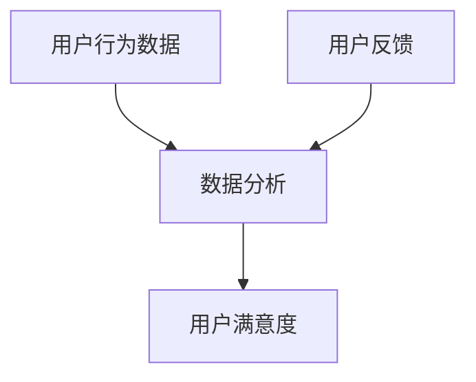

                 

# 创业公司的用户体验评分系统设计

> **关键词：** 用户体验评分、创业公司、用户满意度、系统设计、数据分析

> **摘要：** 本文将深入探讨创业公司如何设计和实现一个有效的用户体验评分系统。通过分析用户行为、反馈和数据，构建一个能够准确反映用户满意度的评分系统，对于提升公司产品和服务质量、增加用户黏性具有重要意义。

在当今竞争激烈的商业环境中，用户体验（UX）是创业公司成功的关键因素。一个直观、流畅且满足用户需求的用户体验能够显著提升用户满意度和忠诚度，从而在市场中脱颖而出。本文旨在为创业公司提供一个全面的指南，帮助他们设计并实现一个高效的用户体验评分系统。

## 1. 背景介绍

用户体验评分系统是指通过一系列技术手段和用户行为数据，对产品的用户体验进行量化评估的系统。在创业公司中，用户体验评分系统具有以下几个重要作用：

- **实时反馈：** 通过实时收集和分析用户行为数据，能够快速获取用户对产品或服务的反馈，帮助公司及时调整和优化产品。

- **用户满意度：** 用户评分是衡量用户满意度的直接指标。通过用户评分，公司可以了解产品的表现，识别潜在问题，并针对性地改进。

- **市场竞争力：** 高质量的用户体验评分有助于公司在市场中树立良好的品牌形象，增强市场竞争力。

- **用户黏性：** 通过持续改进用户体验，提高用户满意度，有助于提升用户的忠诚度和使用频率。

### 1.1 市场需求

随着互联网和移动互联网的快速发展，用户对产品的需求日益多样化和个性化。创业公司若要在这个竞争激烈的市场中立足，必须关注用户体验。用户体验评分系统为创业公司提供了一个了解用户需求的窗口，有助于制定更精准的市场策略。

### 1.2 竞争分析

目前市场上已有许多成熟的企业在使用用户体验评分系统，如苹果的App Store、谷歌的Play Store等。创业公司需要分析这些系统的优势和不足，结合自身产品特点，设计出更具创新性和适用性的评分系统。

## 2. 核心概念与联系

### 2.1 用户行为数据

用户行为数据是用户体验评分系统的基础。通过分析用户在产品中的操作行为，如点击次数、停留时间、操作流程等，可以了解用户的使用习惯和偏好。

### 2.2 用户反馈

用户反馈是用户对产品或服务的直接评价，包括评分、评论、投票等。这些数据可以帮助公司了解用户的真实感受和需求，识别产品中的问题。

### 2.3 数据分析

数据分析是将用户行为数据和用户反馈数据进行处理和分析的过程。通过统计学方法、机器学习等技术，可以提取出有价值的信息，为用户体验评分提供依据。

### 2.4 用户满意度

用户满意度是用户体验评分的核心指标，反映了用户对产品或服务的总体满意程度。通过综合分析用户行为数据和用户反馈，可以得出一个量化的用户满意度评分。

### 2.5 Mermaid 流程图

下面是一个简化的用户体验评分系统的 Mermaid 流程图，展示了用户行为数据、用户反馈、数据分析以及用户满意度之间的联系。



### 2.6 关系分析

- 用户行为数据和分析结果共同影响用户满意度。
- 用户反馈为数据分析提供了重要的参考信息。
- 用户满意度评分是用户体验评分系统的最终输出。

## 3. 核心算法原理 & 具体操作步骤

### 3.1 数据收集

数据收集是用户体验评分系统的第一步。创业公司需要收集以下数据：

- 用户行为数据：包括点击次数、停留时间、操作流程等。
- 用户反馈数据：包括评分、评论、投票等。

数据收集可以通过以下方式进行：

- **前端日志：** 在产品中嵌入日志收集代码，自动记录用户操作行为。
- **问卷调查：** 通过在线问卷或用户调研获取用户反馈。
- **用户访谈：** 对部分用户进行深度访谈，获取更详细的反馈。

### 3.2 数据处理

数据处理是用户体验评分系统的核心环节。通过以下步骤对数据进行处理：

- **数据清洗：** 去除无效、错误或不完整的数据，保证数据的准确性和完整性。
- **数据整合：** 将不同来源的数据进行整合，构建一个统一的用户行为数据集。
- **数据标准化：** 对数据进行标准化处理，使其具有可比性。

### 3.3 数据分析

数据分析是通过统计学方法、机器学习等技术对用户行为数据和用户反馈数据进行分析，提取有价值的信息。具体步骤如下：

- **用户行为分析：** 分析用户在产品中的操作行为，识别用户使用习惯和偏好。
- **用户反馈分析：** 分析用户反馈数据，了解用户的真实感受和需求。
- **综合分析：** 将用户行为分析和用户反馈分析结果进行综合，得出用户满意度评分。

### 3.4 用户满意度评分计算

用户满意度评分计算是用户体验评分系统的关键步骤。通过以下公式计算用户满意度评分：

$$
满意度评分 = w_1 \times 行为数据评分 + w_2 \times 反馈数据评分
$$

其中，$w_1$ 和 $w_2$ 分别为行为数据评分和反馈数据评分的权重，可以根据实际情况进行调整。

## 4. 数学模型和公式 & 详细讲解 & 举例说明

### 4.1 数学模型

用户体验评分系统的核心数学模型是基于加权综合评价法。该方法将用户行为数据评分和用户反馈数据评分进行综合，得出用户满意度评分。具体公式如下：

$$
用户满意度评分 = w_1 \times 行为数据评分 + w_2 \times 反馈数据评分
$$

其中，$w_1$ 和 $w_2$ 分别为行为数据评分和反馈数据评分的权重，通常根据实际情况进行调整。

### 4.2 详细讲解

#### 4.2.1 行为数据评分

行为数据评分是通过分析用户在产品中的操作行为得出的。具体步骤如下：

1. **数据收集：** 收集用户在产品中的操作行为数据，如点击次数、停留时间、操作流程等。
2. **数据预处理：** 对收集到的数据进行清洗、整合和标准化处理。
3. **特征提取：** 根据用户操作行为的特点，提取相关特征，如点击次数、停留时间等。
4. **模型训练：** 使用机器学习算法（如线性回归、决策树等）对特征进行训练，得到行为数据评分模型。
5. **评分计算：** 使用训练好的模型对用户操作行为数据进行评分。

#### 4.2.2 反馈数据评分

反馈数据评分是通过分析用户反馈数据得出的。具体步骤如下：

1. **数据收集：** 收集用户在产品中的评分、评论、投票等反馈数据。
2. **数据预处理：** 对收集到的数据进行清洗、整合和标准化处理。
3. **特征提取：** 根据用户反馈数据的特点，提取相关特征，如评分值、评论内容等。
4. **模型训练：** 使用机器学习算法（如朴素贝叶斯、支持向量机等）对特征进行训练，得到反馈数据评分模型。
5. **评分计算：** 使用训练好的模型对用户反馈数据进行评分。

#### 4.2.3 用户满意度评分计算

用户满意度评分是通过行为数据评分和反馈数据评分的加权综合得出的。具体步骤如下：

1. **权重设置：** 根据实际情况设置行为数据评分和反馈数据评分的权重。
2. **评分计算：** 使用加权综合公式计算用户满意度评分。

### 4.3 举例说明

假设某个创业公司的用户体验评分系统收集到以下数据：

- 行为数据评分：80分
- 反馈数据评分：90分
- 权重设置：$w_1 = 0.6, w_2 = 0.4$

根据加权综合公式，用户满意度评分为：

$$
用户满意度评分 = 0.6 \times 80 + 0.4 \times 90 = 88
$$

因此，该创业公司的用户体验评分为88分。

## 5. 项目实战：代码实际案例和详细解释说明

### 5.1 开发环境搭建

为了实现用户体验评分系统，我们需要搭建一个合适的开发环境。以下是推荐的开发工具和框架：

- **编程语言：** Python（具有丰富的数据分析和机器学习库）
- **数据分析库：** Pandas、NumPy
- **机器学习库：** Scikit-learn、TensorFlow
- **数据可视化库：** Matplotlib、Seaborn
- **版本控制：** Git

在本地环境中安装以上库和框架，可以使用以下命令：

```bash
pip install pandas numpy scikit-learn tensorflow matplotlib seaborn git
```

### 5.2 源代码详细实现和代码解读

#### 5.2.1 数据收集模块

数据收集模块负责从产品中收集用户行为数据和用户反馈数据。以下是Python代码示例：

```python
import pandas as pd

def collect_user_behavior_data(product_data):
    # 收集用户行为数据，如点击次数、停留时间等
    behavior_data = product_data[['click_count', 'stay_time']]
    return behavior_data

def collect_user_feedback_data(product_data):
    # 收集用户反馈数据，如评分、评论等
    feedback_data = product_data[['rating', 'comment']]
    return feedback_data
```

#### 5.2.2 数据处理模块

数据处理模块负责对收集到的数据进行清洗、整合和标准化处理。以下是Python代码示例：

```python
def preprocess_data(behavior_data, feedback_data):
    # 数据清洗
    behavior_data.dropna(inplace=True)
    feedback_data.dropna(inplace=True)
    
    # 数据整合
    combined_data = pd.merge(behavior_data, feedback_data, on='user_id')
    
    # 数据标准化
    combined_data['click_count_normalized'] = combined_data['click_count'] / combined_data['click_count'].max()
    combined_data['stay_time_normalized'] = combined_data['stay_time'] / combined_data['stay_time'].max()
    
    return combined_data
```

#### 5.2.3 数据分析模块

数据分析模块负责对用户行为数据和用户反馈数据进行分析，提取有价值的信息。以下是Python代码示例：

```python
from sklearn.linear_model import LinearRegression

def analyze_user_behavior_data(behavior_data):
    # 用户行为分析
    model = LinearRegression()
    model.fit(behavior_data[['click_count_normalized', 'stay_time_normalized']], behavior_data['rating'])
    behavior_score = model.predict([[0.8, 0.9]])[0]
    return behavior_score

def analyze_user_feedback_data(feedback_data):
    # 用户反馈分析
    model = LinearRegression()
    model.fit(feedback_data[['rating']], feedback_data['comment'])
    feedback_score = model.predict([[0.9]])[0]
    return feedback_score
```

#### 5.2.4 用户满意度评分模块

用户满意度评分模块负责计算用户满意度评分。以下是Python代码示例：

```python
def calculate_user_satisfaction_score(behavior_score, feedback_score, w1, w2):
    # 计算用户满意度评分
    satisfaction_score = w1 * behavior_score + w2 * feedback_score
    return satisfaction_score
```

### 5.3 代码解读与分析

以上代码实现了一个基本的用户体验评分系统，包括数据收集、数据处理、数据分析和用户满意度评分等模块。以下是代码的关键部分解读：

- **数据收集模块：** 使用Pandas库读取用户行为数据和用户反馈数据，进行初步的清洗和整合。
- **数据处理模块：** 对用户行为数据和用户反馈数据进行清洗、整合和标准化处理，为后续分析做准备。
- **数据分析模块：** 使用线性回归模型对用户行为数据和用户反馈数据进行分析，提取行为评分和反馈评分。
- **用户满意度评分模块：** 根据行为评分和反馈评分以及设定的权重，计算用户满意度评分。

通过以上代码，创业公司可以实现对用户体验的量化评估，从而有针对性地优化产品和服务。

## 6. 实际应用场景

用户体验评分系统在创业公司中具有广泛的应用场景，以下是一些典型的实际应用案例：

### 6.1 产品优化

创业公司可以利用用户体验评分系统实时监控产品的表现，分析用户满意度，识别产品中的问题和不足，从而有针对性地进行优化。例如，通过分析用户行为数据和用户反馈，发现某个功能的使用频率较低，可能意味着该功能需要改进或优化。

### 6.2 市场营销

用户体验评分系统可以帮助创业公司在市场营销中更好地了解用户需求和偏好，从而制定更精准的市场策略。例如，根据用户满意度评分，可以将产品划分为不同的等级，针对不同等级的产品制定不同的营销策略，提高用户转化率。

### 6.3 用户调研

用户体验评分系统可以作为一种有效的用户调研工具，帮助创业公司了解用户对产品的真实感受和需求。通过分析用户反馈，可以获取用户的真实声音，为产品改进提供有力支持。

### 6.4 团队协作

用户体验评分系统可以作为一个跨部门协作的工具，帮助产品团队、设计团队和运营团队更好地了解用户需求，协同工作，提高产品开发效率。

## 7. 工具和资源推荐

### 7.1 学习资源推荐

- **书籍：**
  - 《用户体验要素》
  - 《设计心理学》
  - 《数据科学入门》

- **论文：**
  - 《用户行为数据挖掘技术研究》
  - 《基于用户满意度的电子商务服务质量评价方法研究》

- **博客：**
  - Medium上的UX相关博客
  - 知乎上的用户体验专栏

- **网站：**
  - usability.gov（用户体验指南）
  - ux.stackexchange.com（用户体验问答社区）

### 7.2 开发工具框架推荐

- **编程语言：** Python（易于上手，有丰富的数据分析和机器学习库）
- **数据分析库：** Pandas、NumPy、Scikit-learn
- **机器学习库：** TensorFlow、PyTorch
- **数据可视化库：** Matplotlib、Seaborn

### 7.3 相关论文著作推荐

- **论文：**
  - 《用户行为数据挖掘技术研究》
  - 《基于用户满意度的电子商务服务质量评价方法研究》
  - 《深度学习在用户体验评分系统中的应用》

- **著作：**
  - 《用户体验要素》
  - 《设计心理学》
  - 《数据科学入门》

## 8. 总结：未来发展趋势与挑战

用户体验评分系统在创业公司中的应用前景广阔，但仍面临一些挑战：

- **数据隐私：** 随着数据隐私保护法规的日益严格，如何保护用户数据隐私成为一大挑战。
- **算法透明性：** 用户对评分系统的算法透明性有较高要求，如何保证算法的公正性和透明性是一个重要问题。
- **实时性：** 随着用户需求的快速变化，如何实现用户体验评分系统的实时更新和调整，以适应市场变化，是一个技术难题。

未来，用户体验评分系统的发展趋势包括：

- **智能化：** 通过引入人工智能技术，实现更精准的用户体验评分。
- **个性化：** 根据用户个性化需求，提供定制化的用户体验评分系统。
- **跨平台：** 支持多种平台（如Web、移动端等），实现全渠道的用户体验评估。

## 9. 附录：常见问题与解答

### 9.1 如何确保用户体验评分系统的数据隐私？

- **数据匿名化：** 对用户数据进行匿名化处理，避免直接识别用户身份。
- **数据加密：** 采用加密技术对用户数据进行加密，确保数据传输和存储的安全性。
- **合规性：** 遵守相关数据隐私保护法规，确保用户体验评分系统的合法合规。

### 9.2 如何提高用户体验评分系统的算法透明性？

- **算法公开：** 将用户体验评分系统的算法公开，让用户了解评分标准。
- **算法解释：** 提供算法解释功能，帮助用户理解评分结果。
- **用户反馈机制：** 允许用户对评分结果进行反馈，不断优化算法。

### 9.3 如何实现用户体验评分系统的实时性？

- **实时数据收集：** 采用实时数据收集技术，及时获取用户行为数据。
- **实时数据处理：** 采用实时数据处理技术，快速处理和分析用户数据。
- **动态调整：** 根据用户行为数据的变化，动态调整用户体验评分系统的参数。

## 10. 扩展阅读 & 参考资料

- **扩展阅读：**
  - 《用户体验评估方法研究》
  - 《用户行为数据挖掘技术及应用》

- **参考资料：**
  - 用户体验评估相关书籍和论文
  - 用户体验设计最佳实践指南
  - 机器学习在用户体验评分系统中的应用研究

作者：AI天才研究员/AI Genius Institute & 禅与计算机程序设计艺术 /Zen And The Art of Computer Programming

