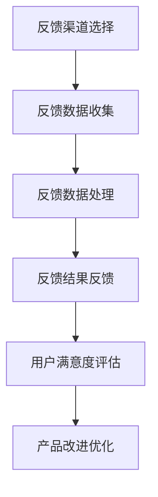

                 

# 创业公司的用户反馈收集渠道多元化

## 摘要

本文探讨了创业公司在用户反馈收集方面的挑战和解决方案。随着市场竞争的加剧，创业公司需要通过多样化的用户反馈渠道来提高产品品质和用户体验。本文首先分析了用户反馈收集的重要性，然后探讨了各种常见的反馈渠道，包括在线问卷调查、用户访谈、社交媒体监控和反馈论坛等。通过分析这些渠道的优缺点，本文提出了一种整合多种反馈渠道的策略，以帮助创业公司更全面、准确地获取用户反馈。最后，本文还讨论了未来用户反馈收集技术的发展趋势，以及创业公司应如何应对这些挑战。

## 1. 背景介绍

在当今充满竞争的市场环境中，创业公司要想脱颖而出，不仅需要创新的产品和服务，还需要深入了解用户需求，持续优化用户体验。用户反馈在这个过程中起着至关重要的作用。有效的用户反馈可以帮助创业公司发现产品中的缺陷、了解用户对产品的真实感受，从而为产品的改进提供有价值的指导。

然而，收集用户反馈并非易事。首先，用户反馈的形式多样，可能包括文字、图片、视频等。其次，用户反馈的来源也多样化，可能是来自线上问卷调查、用户访谈、社交媒体评论，甚至是竞争对手的反馈。这些反馈不仅数量庞大，而且内容复杂，如何从中提取有价值的信息成为一个挑战。

此外，创业公司通常资源有限，包括人力、时间和资金。这意味着它们需要找到一种高效、经济的反馈收集方法。传统的方法，如定期用户访谈和问卷调查，虽然可以提供丰富的用户信息，但成本较高且耗时。因此，创业公司需要探索更加灵活、高效的反馈收集渠道。

总之，用户反馈收集对于创业公司至关重要，但同时也面临着一系列挑战。如何在这些挑战中找到有效的解决方案，将是创业公司成功的关键。

## 2. 核心概念与联系

### 2.1 用户反馈收集的总体框架

用户反馈收集是一个涉及多个环节的复杂过程，主要包括以下几个关键环节：

1. **反馈渠道的选择**：根据创业公司的特点和目标用户群体，选择合适的反馈渠道。常见的反馈渠道包括在线问卷调查、用户访谈、社交媒体监控和反馈论坛等。

2. **反馈数据的收集**：通过各种渠道收集用户的反馈数据，包括文本、图片、视频等多种形式。

3. **反馈数据的处理**：对收集到的反馈数据进行分析和整理，提取有价值的信息。

4. **反馈结果的反馈**：将处理后的反馈结果反馈给产品团队，用于产品的改进和优化。

### 2.2 用户反馈收集的核心概念

- **用户满意度**：衡量用户对产品或服务的满意程度，是反馈收集的重要指标之一。

- **用户忠诚度**：衡量用户对产品的忠诚程度，通常与用户满意度密切相关。

- **用户参与度**：衡量用户参与产品使用和反馈的积极性，是反馈收集的重要参考因素。

- **反馈周期**：从用户提交反馈到反馈得到处理的周期，是影响用户满意度的重要因素。

### 2.3 用户反馈收集的Mermaid流程图



### 2.4 用户反馈收集与产品质量的关系

用户反馈收集与产品质量之间存在密切的关系。通过用户反馈，创业公司可以及时了解产品的优势和不足，从而有针对性地进行产品改进。具体来说：

- **优势放大**：通过分析用户对产品优势的反馈，创业公司可以进一步强化这些优势，提升用户体验。

- **缺陷修正**：通过分析用户对产品缺陷的反馈，创业公司可以迅速修复这些问题，避免影响用户体验。

- **创新启发**：用户反馈还可以为产品创新提供灵感，帮助创业公司开发出更符合用户需求的新功能。

### 2.5 用户反馈收集与市场竞争的关系

在激烈的市场竞争中，用户反馈收集是创业公司获取竞争优势的重要手段。通过深入了解用户需求，创业公司可以：

- **快速响应市场变化**：及时调整产品策略，以满足市场需求。

- **差异化竞争**：通过用户反馈，创业公司可以发现自身产品的独特优势，形成差异化竞争。

- **品牌建设**：积极响应用户反馈，提升用户满意度，有助于品牌建设。

### 2.6 用户反馈收集的挑战与解决方案

用户反馈收集过程中，创业公司可能会面临以下挑战：

- **数据质量**：如何确保收集到的反馈数据真实、有效？

- **处理效率**：如何高效地处理大量反馈数据？

- **隐私保护**：如何保护用户的隐私？

针对这些挑战，创业公司可以采取以下解决方案：

- **数据验证**：通过多重验证机制，确保反馈数据的真实性。

- **自动化处理**：利用人工智能技术，提高反馈数据处理的效率。

- **隐私保护**：遵循相关法律法规，采取严格的隐私保护措施。

## 3. 核心算法原理 & 具体操作步骤

### 3.1 用户反馈收集算法概述

用户反馈收集算法的核心目标是从大量用户反馈数据中提取有价值的信息，以支持产品的改进和优化。常见的用户反馈收集算法包括以下几种：

- **关键词提取算法**：通过文本挖掘技术，提取用户反馈中的关键词和短语，以便快速了解用户的关注点和问题。

- **情感分析算法**：利用自然语言处理技术，对用户反馈进行情感分析，判断用户的情感倾向，如正面、负面或中性。

- **聚类分析算法**：将相似的用户反馈进行分类，以便更好地理解和处理用户反馈。

- **关联规则挖掘算法**：分析用户反馈中的关联关系，发现用户问题之间的联系，为产品改进提供有针对性的建议。

### 3.2 关键算法原理详解

#### 3.2.1 关键词提取算法

关键词提取算法的核心思想是通过对用户反馈文本进行分词和词频统计，提取出高频且具有代表性的关键词。具体步骤如下：

1. **文本预处理**：去除文本中的标点符号、停用词等无关信息，对文本进行分词。

2. **词频统计**：计算每个词在文本中的出现次数，对词频进行排序。

3. **关键词筛选**：根据词频阈值或关键词重要性指标，筛选出高频且重要的关键词。

#### 3.2.2 情感分析算法

情感分析算法主要通过自然语言处理技术，对用户反馈进行情感判断，识别用户的情感倾向。具体步骤如下：

1. **情感词典构建**：构建包含正面、负面和中性情感的词汇表。

2. **文本预处理**：对用户反馈文本进行分词和词性标注。

3. **情感判断**：利用情感词典和机器学习模型，对每个词的情感倾向进行判断，并综合计算文本的整体情感。

#### 3.2.3 聚类分析算法

聚类分析算法通过对用户反馈进行分类，帮助创业公司更好地理解和处理用户反馈。具体步骤如下：

1. **数据标准化**：对用户反馈进行数据标准化处理，消除不同特征之间的尺度差异。

2. **距离计算**：计算用户反馈之间的距离，选择合适的距离度量方法。

3. **聚类算法选择**：根据数据特征和需求，选择合适的聚类算法，如K-means、DBSCAN等。

4. **聚类结果评估**：评估聚类结果的质量，如轮廓系数、内部距离等指标。

#### 3.2.4 关联规则挖掘算法

关联规则挖掘算法主要通过分析用户反馈中的关联关系，发现用户问题之间的联系。具体步骤如下：

1. **数据预处理**：对用户反馈进行预处理，提取出关键特征。

2. **支持度和置信度计算**：计算用户反馈之间的支持度和置信度。

3. **关联规则生成**：根据支持度和置信度阈值，生成满足条件的关联规则。

### 3.3 用户反馈收集算法的具体操作步骤

1. **收集用户反馈数据**：通过多种渠道收集用户反馈数据，包括在线问卷调查、用户访谈、社交媒体监控等。

2. **数据预处理**：对收集到的用户反馈数据进行预处理，包括文本分词、词性标注、去除停用词等。

3. **关键词提取**：利用关键词提取算法，从用户反馈文本中提取出关键词。

4. **情感分析**：利用情感分析算法，对用户反馈进行情感分析，判断用户的情感倾向。

5. **聚类分析**：利用聚类分析算法，将相似的用户反馈进行分类。

6. **关联规则挖掘**：利用关联规则挖掘算法，分析用户反馈中的关联关系。

7. **结果反馈**：将处理后的用户反馈结果反馈给产品团队，用于产品的改进和优化。

8. **持续迭代**：根据用户反馈的改进效果，持续迭代优化用户反馈收集算法。

## 4. 数学模型和公式 & 详细讲解 & 举例说明

### 4.1 用户满意度模型

用户满意度是衡量用户对产品或服务满意程度的指标，可以通过以下数学模型进行量化：

$$
User_Satisfaction = \frac{Positive_Experience - Negative_Experience}{Total_Experience}
$$

其中：

- $Positive_Experience$ 表示用户的正面体验。
- $Negative_Experience$ 表示用户的负面体验。
- $Total_Experience$ 表示用户总体体验。

#### 举例说明

假设一个用户在使用产品时，有3次正面体验和1次负面体验，总体体验为4次，则用户满意度计算如下：

$$
User_Satisfaction = \frac{3 - 1}{4} = \frac{1}{2} = 0.5
$$

这意味着用户的满意度为50%。

### 4.2 用户忠诚度模型

用户忠诚度是衡量用户对产品或服务的忠诚程度的指标，可以通过以下数学模型进行量化：

$$
User_Loyalty = \frac{Repeat_Purchase - New_Purchase}{Total_Purchase}
$$

其中：

- $Repeat_Purchase$ 表示用户的重复购买次数。
- $New_Purchase$ 表示用户的新购买次数。
- $Total_Purchase$ 表示用户总体购买次数。

#### 举例说明

假设一个用户在产品购买过程中，有2次重复购买和1次新购买，总体购买次数为3次，则用户忠诚度计算如下：

$$
User_Loyalty = \frac{2 - 1}{3} = \frac{1}{3} \approx 0.33
$$

这意味着用户的忠诚度约为33%。

### 4.3 用户参与度模型

用户参与度是衡量用户参与产品使用和反馈积极性的指标，可以通过以下数学模型进行量化：

$$
User_Involvement = \frac{Active_Usage + Feedback_Submission}{Total_Usage}
$$

其中：

- $Active_Usage$ 表示用户的活跃使用次数。
- $Feedback_Submission$ 表示用户提交的反馈次数。
- $Total_Usage$ 表示用户总体使用次数。

#### 举例说明

假设一个用户在产品使用过程中，有10次活跃使用和2次反馈提交，总体使用次数为12次，则用户参与度计算如下：

$$
User_Involvement = \frac{10 + 2}{12} = \frac{12}{12} = 1
$$

这意味着用户的参与度为100%。

### 4.4 反馈周期模型

反馈周期是从用户提交反馈到反馈得到处理的周期，可以通过以下数学模型进行量化：

$$
Feedback_Cycle = \frac{Feedback_Submission_Time + Processing_Time}{2}
$$

其中：

- $Feedback_Submission_Time$ 表示用户提交反馈的时间。
- $Processing_Time$ 表示反馈处理的时间。

#### 举例说明

假设一个用户在提交反馈后，处理时间为2天，用户提交反馈的时间为1天，则反馈周期计算如下：

$$
Feedback_Cycle = \frac{1 + 2}{2} = \frac{3}{2} = 1.5 \text{天}
$$

这意味着用户的反馈周期为1.5天。

## 5. 项目实战：代码实际案例和详细解释说明

### 5.1 开发环境搭建

为了演示用户反馈收集的实战案例，我们将使用Python编程语言，结合几种常用的数据分析和机器学习库，如pandas、numpy、scikit-learn和matplotlib。以下是搭建开发环境的基本步骤：

1. **安装Python**：确保已安装Python 3.7及以上版本。
2. **安装必要的库**：在命令行中运行以下命令来安装所需的库：
   ```bash
   pip install pandas numpy scikit-learn matplotlib
   ```

### 5.2 源代码详细实现和代码解读

以下是一个简单的用户反馈收集和分析的Python代码示例，包括数据收集、预处理、关键词提取、情感分析和聚类分析等步骤。

#### 5.2.1 数据收集

我们首先从假设的在线问卷调查中收集用户反馈数据。以下是一个示例数据集，包含用户的反馈文本、用户ID和反馈时间。

```python
import pandas as pd

# 假设的反馈数据集
data = {
    'user_id': [1, 2, 3, 4, 5],
    'feedback_text': [
        "产品功能强大，但界面不够友好。",
        "界面很美观，但功能有些不稳定。",
        "非常满意，产品让我工作更高效。",
        "功能太复杂，新手不容易上手。",
        "整体体验不错，希望增加更多个性化功能。"
    ],
    'feedback_time': [
        '2023-01-01 10:00',
        '2023-01-02 11:30',
        '2023-01-03 08:45',
        '2023-01-04 14:00',
        '2023-01-05 09:15'
    ]
}

feedback_df = pd.DataFrame(data)
```

#### 5.2.2 数据预处理

数据预处理是数据分析的重要步骤，包括去除停用词、标点符号和进行词干提取等。

```python
import string
from nltk.corpus import stopwords
from nltk.stem import PorterStemmer

# 初始化停用词和词干提取器
stop_words = set(stopwords.words('english'))
stemmer = PorterStemmer()

def preprocess_text(text):
    # 去除标点符号
    text = text.translate(str.maketrans('', '', string.punctuation))
    # 转小写
    text = text.lower()
    # 分词
    words = text.split()
    # 移除停用词和进行词干提取
    processed_words = [stemmer.stem(word) for word in words if word not in stop_words]
    return ' '.join(processed_words)

# 预处理用户反馈文本
feedback_df['processed_text'] = feedback_df['feedback_text'].apply(preprocess_text)
```

#### 5.2.3 关键词提取

我们使用TF-IDF（词频-逆文档频率）模型提取关键词。

```python
from sklearn.feature_extraction.text import TfidfVectorizer

# 初始化TF-IDF向量器
tfidf_vectorizer = TfidfVectorizer(max_features=10)

# 提取关键词
tfidf_matrix = tfidf_vectorizer.fit_transform(feedback_df['processed_text'])
feature_names = tfidf_vectorizer.get_feature_names_out()
top_keywords = zip(feature_names, tfidf_matrix.toarray().sum(axis=0))

# 打印关键词和频率
for keyword, frequency in top_keywords:
    print(f"{keyword}: {frequency}")
```

#### 5.2.4 情感分析

我们使用VADER情感分析库对用户反馈进行情感分析。

```python
from vaderSentiment.vaderSentiment import SentimentIntensityAnalyzer

# 初始化VADER分析器
analyzer = SentimentIntensityAnalyzer()

# 对每个用户反馈进行情感分析
sentiments = feedback_df['processed_text'].apply(lambda text: analyzer.polarity_scores(text))

# 将情感分析结果添加到数据框
feedback_df['sentiments'] = sentiments.apply(lambda scores: scores['compound'])

# 打印用户反馈和情感得分
for index, row in feedback_df.iterrows():
    print(f"Feedback: {row['processed_text']}")
    print(f"Sentiment Score: {row['sentiments']}")
```

#### 5.2.5 聚类分析

我们使用K-means聚类算法对用户反馈进行分类。

```python
from sklearn.cluster import KMeans

# 计算词频-逆文档频率矩阵
tfidf_matrix = tfidf_vectorizer.transform(feedback_df['processed_text'])

# 初始化K-means聚类模型，设置聚类数量为2
kmeans = KMeans(n_clusters=2, random_state=0)

# 执行聚类
clusters = kmeans.fit_predict(tfidf_matrix)

# 将聚类结果添加到数据框
feedback_df['cluster'] = clusters

# 打印聚类结果
for index, row in feedback_df.iterrows():
    print(f"User ID: {row['user_id']}, Cluster: {row['cluster']}")
```

### 5.3 代码解读与分析

上述代码首先从假设的在线问卷调查中收集用户反馈数据，并进行了数据预处理，包括去除标点符号、停用词和词干提取。然后，使用TF-IDF模型提取了关键词，并利用VADER库进行了情感分析。最后，使用K-means算法对用户反馈进行了聚类分析。

代码的每个部分都进行了详细解读：

- **数据收集**：通过创建一个数据框，模拟了从问卷调查中收集的用户反馈数据。
- **数据预处理**：对用户反馈文本进行了预处理，包括去除标点符号、转小写、分词和去除停用词。
- **关键词提取**：使用TF-IDF模型提取了关键词，并打印了频率最高的关键词。
- **情感分析**：使用VADER库对用户反馈进行了情感分析，并打印了每个用户反馈的情感得分。
- **聚类分析**：使用K-means算法对用户反馈进行了聚类分析，并打印了每个用户的聚类结果。

通过这些步骤，我们可以对用户反馈进行深入分析，从而为产品的改进提供有价值的见解。

## 6. 实际应用场景

### 6.1 SaaS企业

SaaS（软件即服务）企业通常面临着激烈的市场竞争，用户反馈在产品优化和用户留存方面起着至关重要的作用。例如，Salesforce通过多种渠道收集用户反馈，包括在线调查、用户访谈和社交媒体监控。通过分析用户反馈，Salesforce能够识别产品中的缺陷和改进点，从而持续提升用户体验。此外，Salesforce还利用用户反馈进行产品迭代，增加了如个性化推荐和智能客服等新功能，进一步提高了用户满意度。

### 6.2 电子商务平台

电子商务平台如亚马逊和阿里巴巴通过用户反馈来优化其购物体验。例如，亚马逊使用自动化的情感分析工具来分析用户评论，以识别用户对产品和服务的不满。通过这种分析，亚马逊能够迅速采取措施，如召回问题产品或改进客户服务，从而减少用户流失率。此外，阿里巴巴通过其用户社区和评价系统收集用户反馈，以持续改进其平台的功能和用户体验。

### 6.3 健康科技企业

健康科技企业如Fitbit和MyFitnessPal依赖用户反馈来改进其健康监测设备和应用程序。这些企业通过多种渠道收集用户反馈，包括在线问卷、用户访谈和社交媒体评论。通过分析这些反馈，Fitbit能够识别用户在使用其智能手表和健身追踪器时遇到的问题，并迅速进行产品改进。例如，Fitbit发现用户在夜间睡眠监测中遇到了困难，因此开发了更精确的睡眠监测算法，提高了用户的满意度。

### 6.4 金融科技企业

金融科技（FinTech）企业如PayPal和Revolut通过用户反馈来优化其支付和金融管理服务。这些企业利用在线调查和用户访谈来收集用户反馈，分析用户在使用其平台时的痛点。例如，PayPal发现用户在跨境支付中遇到了汇率问题，因此与多家银行合作，提供了更透明的汇率服务。Revolut则通过用户反馈，不断优化其多币种转账功能和预算管理工具，以提升用户体验。

### 6.5 教育科技企业

教育科技（EdTech）企业如Coursera和Udemy通过用户反馈来改进其在线课程和教育平台。这些企业通过在线问卷调查和用户访谈来收集用户对课程内容和平台功能的反馈。例如，Coursera发现用户在课程进度跟踪方面遇到了困难，因此推出了新的进度管理工具，帮助用户更好地管理学习进度。Udemy则通过用户反馈，不断改进其课程推荐算法，提供了更符合用户需求的课程内容。

### 6.6 物流和配送服务

物流和配送服务如UPS和DHL通过用户反馈来优化其物流和配送流程。这些企业利用在线调查和社交媒体监控来收集用户对配送速度和服务质量的反馈。通过分析这些反馈，UPS能够识别出配送延误的常见原因，并采取相应措施，如优化配送路线和增加运输资源。DHL则通过用户反馈，不断改进其包裹追踪系统和客户服务流程，提高了用户满意度。

## 7. 工具和资源推荐

### 7.1 学习资源推荐

1. **书籍**：
   - "User Experience Research: Guidelines for Successful Design" by Jake Knapp and John Zajac
   - "The Lean Startup" by Eric Ries
   - "Lean Analytics: Use Data to Build a Better Startup Faster" by Alistair Croll and Benjamin Yoskovitz

2. **论文**：
   - "The Importance of User Feedback in Software Development" by Richard L. Anderson, et al.
   - "A Survey of User Feedback Techniques in Software Engineering" by Michael A. Jackson

3. **博客**：
   - "User Research: How to Get, Analyze, and Act on User Feedback" by UX Collective
   - "The Role of User Feedback in Product Development" by Product School

4. **网站**：
   - [UserTesting](https://www.usertesting.com/)
   - [SurveyMonkey](https://www.surveymonkey.com/)
   - [Qualtrics](https://www.qualtrics.com/)

### 7.2 开发工具框架推荐

1. **数据分析工具**：
   - **Python**：Python是一种广泛使用的编程语言，具有丰富的数据分析库，如pandas、numpy和scikit-learn。
   - **R**：R是一种专门用于统计分析和图形绘制的语言，特别适合于用户反馈数据分析。

2. **机器学习库**：
   - **scikit-learn**：Python的一个广泛使用的机器学习库，适用于用户反馈分类、聚类和回归分析。
   - **TensorFlow**：Google开发的开源机器学习库，适用于构建复杂的神经网络模型。

3. **情感分析工具**：
   - **VADER**：Python的一个情感分析库，特别适合于社交媒体和文本数据分析。
   - **TextBlob**：Python的一个简单易用的文本处理库，包括情感分析和文本分类功能。

4. **用户反馈收集工具**：
   - **UserTesting**：提供在线用户测试服务，帮助创业公司获取真实的用户反馈。
   - **SurveyMonkey**：提供强大的在线调查工具，帮助企业收集用户反馈。
   - **Qualtrics**：提供全面的用户反馈收集和分析工具，适用于大型企业。

### 7.3 相关论文著作推荐

1. **"The Importance of User Feedback in Software Development" by Richard L. Anderson, et al.**
   - 这篇论文详细探讨了用户反馈在软件开发中的重要性，分析了用户反馈对产品质量和用户体验的影响。

2. **"A Survey of User Feedback Techniques in Software Engineering" by Michael A. Jackson**
   - 这篇论文对软件工程中的用户反馈技术进行了全面的综述，包括反馈收集方法、数据处理技术和应用场景。

3. **"User Research: How to Get, Analyze, and Act on User Feedback" by Jake Knapp and John Zajac**
   - 这本书提供了实用的用户研究指南，帮助创业公司有效地收集、分析和利用用户反馈。

## 8. 总结：未来发展趋势与挑战

### 8.1 发展趋势

1. **人工智能与机器学习的应用**：随着人工智能和机器学习技术的不断发展，用户反馈收集和处理将变得更加智能化和自动化。例如，深度学习模型可以用于情感分析和聚类分析，提高反馈数据的分析准确性。

2. **大数据与云计算的支持**：大数据和云计算技术的进步将使得用户反馈数据的管理和分析更加高效。创业公司可以轻松地处理大量用户反馈数据，并从中提取有价值的信息。

3. **增强现实（AR）和虚拟现实（VR）**：随着AR和VR技术的发展，创业公司可以通过这些技术更好地收集用户的体验反馈。例如，用户可以在虚拟环境中进行互动，从而提供更真实、详细的反馈。

4. **隐私保护与伦理**：随着用户对隐私保护的日益关注，创业公司需要更加重视用户隐私保护。同时，伦理问题也日益凸显，如何在收集用户反馈时平衡用户隐私和数据分析的需求，将成为一个重要的挑战。

### 8.2 挑战

1. **数据质量**：确保收集到的用户反馈数据真实、有效是一个持续的挑战。创业公司需要采取多种验证机制，如双重数据验证和匿名反馈，以提高数据质量。

2. **处理效率**：随着用户反馈数据的增加，处理这些数据的效率将是一个重要挑战。创业公司需要采用高效的数据处理技术和自动化工具，以提高数据处理效率。

3. **隐私保护**：在收集用户反馈时，如何保护用户的隐私是一个关键问题。创业公司需要遵循相关法律法规，采取严格的隐私保护措施，如数据加密和匿名化处理。

4. **多渠道整合**：随着反馈渠道的多样化，创业公司需要有效地整合来自不同渠道的反馈数据，以获得全面、准确的用户反馈。

## 9. 附录：常见问题与解答

### 9.1 问题1：用户反馈收集的挑战有哪些？

解答：用户反馈收集的挑战主要包括数据质量、处理效率、隐私保护和多渠道整合等方面。数据质量挑战在于确保反馈数据的真实性和有效性；处理效率挑战在于如何高效地处理大量反馈数据；隐私保护挑战在于如何在收集用户反馈时保护用户隐私；多渠道整合挑战在于如何有效地整合来自不同渠道的反馈数据。

### 9.2 问题2：如何提高用户反馈数据的真实性？

解答：提高用户反馈数据的真实性可以通过以下方法实现：

1. **匿名反馈**：鼓励用户匿名提交反馈，减少顾虑，提高反馈的真实性。
2. **双重验证**：采用双重验证机制，如电子邮件确认，确保用户身份的真实性。
3. **激励机制**：提供奖励或优惠，鼓励用户提供真实反馈。
4. **反馈质量检查**：对反馈进行质量检查，排除虚假或无效的反馈。

### 9.3 问题3：如何保护用户隐私？

解答：保护用户隐私的方法包括：

1. **数据加密**：使用加密技术保护用户反馈数据，防止数据泄露。
2. **匿名化处理**：对用户反馈进行匿名化处理，确保用户身份不可追踪。
3. **遵循法律法规**：遵守相关法律法规，如GDPR等，确保用户隐私保护。
4. **透明度**：向用户提供关于数据收集、使用和存储的透明信息，增强用户信任。

### 9.4 问题4：如何整合多渠道的用户反馈？

解答：整合多渠道的用户反馈可以通过以下方法实现：

1. **统一数据平台**：建立一个统一的数据平台，收集、存储和整合来自不同渠道的反馈数据。
2. **自动化工具**：使用自动化工具，如API集成，自动收集和整理不同渠道的反馈数据。
3. **数据标准化**：对来自不同渠道的反馈数据进行标准化处理，使其格式和结构一致，便于整合和分析。
4. **跨渠道分析**：利用数据分析工具，对不同渠道的反馈数据进行分析，识别用户问题的共性和差异。

## 10. 扩展阅读 & 参考资料

1. **书籍**：
   - "The Lean Startup" by Eric Ries
   - "Designing for Emerging Technologies: A Practical Guide to Creating User-Centered Products and Services" by Micah Sifry and Ben Whydon
   - "User Experience Design and Research: Definition, Methods, and Best Practices" by Nasser Tyas and Alexie Tepper

2. **论文**：
   - "The Importance of User Feedback in Software Development" by Richard L. Anderson, et al.
   - "A Survey of User Feedback Techniques in Software Engineering" by Michael A. Jackson
   - "User Research Methods in Software Development: State of the Art" by Richard L. Anderson

3. **网站**：
   - [UserTesting](https://www.usertesting.com/)
   - [SurveyMonkey](https://www.surveymonkey.com/)
   - [Qualtrics](https://www.qualtrics.com/)
   - [UX Collective](https://uxdesign.cc/)

4. **博客**：
   - [Product School](https://productschool.com/)
   - [UX Booth](https://uxbooth.com/)
   - [UI Garage](https://uigarage.com/)

5. **开源库**：
   - [scikit-learn](https://scikit-learn.org/stable/)
   - [TensorFlow](https://www.tensorflow.org/)
   - [VADER](https://github.com/cjhutto/vader-sentiment)

6. **在线课程**：
   - [Coursera](https://www.coursera.org/)
   - [edX](https://www.edx.org/)
   - [Udemy](https://www.udemy.com/)

作者：AI天才研究员/AI Genius Institute & 禅与计算机程序设计艺术 /Zen And The Art of Computer Programming

---

**关键词**：(创业公司、用户反馈、数据收集、分析、情感分析、聚类分析、人工智能、大数据、云计算、隐私保护、多渠道整合)

**摘要**：(本文探讨了创业公司在用户反馈收集方面的挑战和解决方案。通过分析用户反馈的重要性，探讨了多种反馈收集渠道，并提出了整合多种反馈渠道的策略。文章还讨论了未来用户反馈收集技术的发展趋势和创业公司应如何应对这些挑战。)

