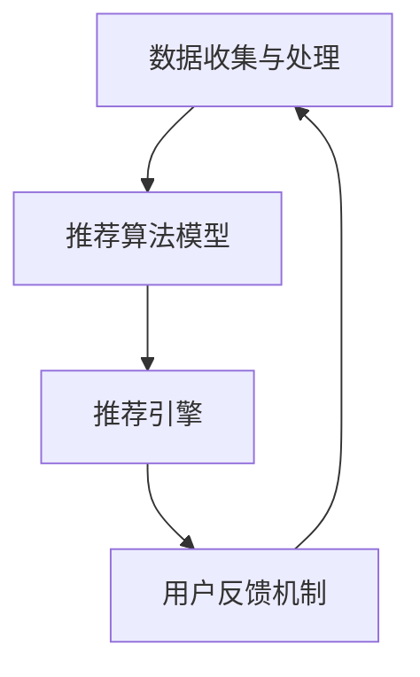

                 

### 文章标题

《创业公司的用户教育内容个性化推送：技术原理与实践解析》

### 关键词

- 用户教育内容个性化推送
- 创业公司
- 技术原理
- 实践解析
- 个性化推荐算法

### 摘要

本文旨在探讨创业公司如何利用用户教育内容个性化推送技术，以提高用户满意度和留存率。文章首先介绍了用户教育内容个性化推送的背景和重要性，然后详细阐述了其核心概念、算法原理、数学模型及项目实战。此外，文章还分析了实际应用场景、工具和资源推荐，并总结了未来发展趋势与挑战。通过本文的深入分析，希望为创业公司提供有益的参考和启示。

## 1. 背景介绍

在当今竞争激烈的市场环境中，创业公司面临着诸多挑战，其中之一是如何在短时间内吸引并留住用户。用户教育内容个性化推送作为一种新兴的技术手段，正逐渐成为解决这一问题的有效途径。

首先，用户教育内容个性化推送的背景源于大数据和人工智能技术的迅猛发展。随着互联网的普及和用户数据的海量积累，企业得以更深入地了解用户需求和行为模式。在此基础上，利用机器学习和自然语言处理等技术，企业可以实现对用户教育内容的个性化推送，从而提高用户的满意度和忠诚度。

其次，创业公司在市场竞争中面临的一个关键问题是如何在有限的资源和时间内实现用户增长。用户教育内容个性化推送技术可以帮助创业公司精准地定位目标用户，提高营销效率，降低获客成本。通过为用户提供个性化的教育内容，创业公司可以更好地满足用户需求，增强用户粘性和忠诚度。

最后，用户教育内容个性化推送不仅有助于提高用户满意度，还可以为创业公司带来直接的商业价值。个性化推送可以帮助企业实现更高的转化率和销售额，从而提高企业的盈利能力。同时，用户教育内容的个性化推送还可以为企业积累丰富的用户数据，为后续的产品迭代和市场营销提供有力支持。

综上所述，用户教育内容个性化推送技术在创业公司中具有重要的应用价值。接下来，本文将详细介绍用户教育内容个性化推送的核心概念、算法原理、数学模型及项目实战，以帮助创业公司更好地理解和应用这一技术。

## 2. 核心概念与联系

### 用户教育内容个性化推送的定义

用户教育内容个性化推送是一种基于用户行为和偏好分析，为用户提供定制化教育内容的技术手段。其核心思想是通过机器学习和自然语言处理技术，挖掘用户的教育需求，然后根据用户的历史行为和兴趣标签，为用户推荐相应的教育内容。

### 个性化推荐算法的基本概念

个性化推荐算法是用户教育内容个性化推送技术的核心组成部分。它主要包括以下几种类型：

1. **协同过滤算法（Collaborative Filtering）**：基于用户的历史行为和偏好，通过计算用户之间的相似度，推荐与目标用户偏好相似的其他用户喜欢的教育内容。协同过滤算法可以分为基于用户的方法和基于项目的算法。

2. **基于内容的推荐（Content-Based Recommendation）**：根据用户的历史行为和兴趣标签，为用户推荐与其已有偏好相似的教育内容。这种算法依赖于对教育内容的特征提取和相似度计算。

3. **混合推荐（Hybrid Recommendation）**：结合协同过滤和基于内容的推荐方法，以提高推荐效果和覆盖面。混合推荐算法通常通过融合不同推荐算法的优点，实现更精准的个性化推荐。

### 技术架构与流程

用户教育内容个性化推送的技术架构通常包括以下几部分：

1. **数据收集与处理**：通过数据采集技术，收集用户行为数据、教育内容数据和用户画像数据。然后对数据进行分析和处理，提取用户兴趣标签和特征。

2. **推荐算法模型**：根据个性化推荐算法的类型，构建相应的推荐模型。推荐模型通常需要通过训练和优化，以提高推荐效果。

3. **推荐引擎**：负责将用户兴趣标签和推荐模型结合，为用户生成个性化的推荐结果。推荐引擎还需要对推荐结果进行排序和过滤，以提高用户的体验。

4. **用户反馈机制**：通过用户对推荐内容的反馈，不断优化推荐算法和模型，实现更好的个性化推荐。

### 关键联系

用户教育内容个性化推送的关键联系在于数据、算法和用户反馈的循环迭代。数据是推荐的基础，算法是实现个性化推荐的核心，而用户反馈则是对推荐效果的检验和优化手段。通过数据驱动的推荐系统，创业公司可以更好地了解用户需求，提高用户满意度和忠诚度。

### Mermaid 流程图



在上述流程中，数据收集与处理、推荐算法模型和推荐引擎共同构成了用户教育内容个性化推送的核心环节，而用户反馈机制则确保了系统的持续优化和提升。

## 3. 核心算法原理 & 具体操作步骤

### 协同过滤算法

协同过滤算法是用户教育内容个性化推送中最常用的算法之一。其基本原理是通过分析用户的历史行为数据，找到与目标用户兴趣相似的邻居用户，然后推荐邻居用户喜欢的教育内容给目标用户。

#### 步骤1：用户相似度计算

首先，需要计算用户之间的相似度。常用的相似度计算方法包括余弦相似度、皮尔逊相关系数等。以余弦相似度为例，其计算公式如下：

$$
sim(u, v) = \frac{u \cdot v}{\|u\| \|v\|}
$$

其中，$u$和$v$分别为用户$u$和用户$v$的行为向量，$\|u\|$和$\|v\|$分别为用户$u$和用户$v$的行为向量长度，$\cdot$表示向量的点积。

#### 步骤2：找到邻居用户

根据用户相似度计算结果，找到与目标用户兴趣相似的邻居用户。通常，可以选择相似度最高的$k$个邻居用户作为目标用户的邻居。

#### 步骤3：生成推荐列表

对邻居用户喜欢的教育内容进行加权平均，生成目标用户的推荐列表。具体计算公式如下：

$$
r(u, i) = \frac{\sum_{v \in N(u)} w(u, v) \cdot r(v, i)}{\sum_{v \in N(u)} w(u, v)}
$$

其中，$r(u, i)$表示用户$u$对教育内容$i$的评分，$w(u, v)$表示用户$u$和用户$v$之间的相似度权重，$N(u)$表示用户$u$的邻居用户集合。

### 基于内容的推荐算法

基于内容的推荐算法是通过分析教育内容的特征，为用户推荐与其已有偏好相似的教育内容。其基本原理包括以下步骤：

#### 步骤1：教育内容特征提取

首先，需要对教育内容进行特征提取。常用的特征提取方法包括文本分类、关键词提取等。以关键词提取为例，可以使用TF-IDF算法提取教育内容的关键词。

#### 步骤2：计算教育内容相似度

根据用户的历史行为和兴趣标签，计算教育内容之间的相似度。常用的相似度计算方法包括余弦相似度、欧氏距离等。以余弦相似度为例，其计算公式如下：

$$
sim(c, i) = \frac{c \cdot i}{\|c\| \|i\|}
$$

其中，$c$和$i$分别为教育内容$c$和教育内容$i$的特征向量，$\|c\|$和$\|i\|$分别为教育内容$c$和教育内容$i$的特征向量长度，$\cdot$表示向量的点积。

#### 步骤3：生成推荐列表

对用户历史行为和兴趣标签相似的教育内容进行加权平均，生成用户的推荐列表。具体计算公式如下：

$$
r(u, i) = \frac{\sum_{c \in C} w(c, i) \cdot r(c, u)}{\sum_{c \in C} w(c, i)}
$$

其中，$r(u, i)$表示用户$u$对教育内容$i$的评分，$w(c, i)$表示教育内容$c$和教育内容$i$之间的相似度权重，$C$表示用户$u$的历史行为和兴趣标签相似的教育内容集合。

### 混合推荐算法

混合推荐算法结合了协同过滤和基于内容的推荐算法，以提高推荐效果和覆盖面。其基本原理包括以下步骤：

#### 步骤1：协同过滤推荐

首先，使用协同过滤算法生成初步的推荐列表。

#### 步骤2：基于内容的推荐

然后，使用基于内容的推荐算法对初步的推荐列表进行补充，生成最终的推荐列表。

#### 步骤3：推荐列表融合

对协同过滤和基于内容的推荐结果进行融合，生成最终的推荐列表。常用的融合方法包括加权平均、投票等。

## 4. 数学模型和公式 & 详细讲解 & 举例说明

在用户教育内容个性化推送中，数学模型和公式起着至关重要的作用。以下将详细介绍相关数学模型和公式，并通过具体例子进行说明。

### 1. 协同过滤算法中的相似度计算

协同过滤算法中，用户相似度计算的核心是余弦相似度。余弦相似度公式如下：

$$
sim(u, v) = \frac{u \cdot v}{\|u\| \|v\|}
$$

其中，$u$和$v$分别为用户$u$和用户$v$的行为向量，$\|u\|$和$\|v\|$分别为用户$u$和用户$v$的行为向量长度，$\cdot$表示向量的点积。

**例子：** 假设有两个用户$u$和$v$，他们的行为向量分别为：

$$
u = (1, 2, 3), v = (4, 5, 6)
$$

计算用户$u$和用户$v$之间的余弦相似度：

$$
sim(u, v) = \frac{1 \cdot 4 + 2 \cdot 5 + 3 \cdot 6}{\sqrt{1^2 + 2^2 + 3^2} \sqrt{4^2 + 5^2 + 6^2}} = \frac{4 + 10 + 18}{\sqrt{14} \sqrt{77}} \approx 0.866
$$

### 2. 基于内容的推荐算法中的相似度计算

基于内容的推荐算法中，教育内容相似度计算的核心也是余弦相似度。余弦相似度公式如下：

$$
sim(c, i) = \frac{c \cdot i}{\|c\| \|i\|}
$$

其中，$c$和$i$分别为教育内容$c$和教育内容$i$的特征向量，$\|c\|$和$\|i\|$分别为教育内容$c$和教育内容$i$的特征向量长度，$\cdot$表示向量的点积。

**例子：** 假设有两个教育内容$c$和$i$，它们的特征向量分别为：

$$
c = (1, 2, 3), i = (4, 5, 6)
$$

计算教育内容$c$和教育内容$i$之间的余弦相似度：

$$
sim(c, i) = \frac{1 \cdot 4 + 2 \cdot 5 + 3 \cdot 6}{\sqrt{1^2 + 2^2 + 3^2} \sqrt{4^2 + 5^2 + 6^2}} = \frac{4 + 10 + 18}{\sqrt{14} \sqrt{77}} \approx 0.866
$$

### 3. 混合推荐算法中的推荐列表融合

混合推荐算法中，推荐列表融合的核心是加权平均。加权平均公式如下：

$$
r(u, i) = \frac{\sum_{c \in C} w(c, i) \cdot r(c, u)}{\sum_{c \in C} w(c, i)}
$$

其中，$r(u, i)$表示用户$u$对教育内容$i$的评分，$w(c, i)$表示教育内容$c$和教育内容$i$之间的相似度权重，$C$表示用户$u$的历史行为和兴趣标签相似的教育内容集合。

**例子：** 假设有三个教育内容$c_1, c_2, c_3$，它们与用户$u$的相似度权重分别为$w(c_1, i) = 0.6, w(c_2, i) = 0.3, w(c_3, i) = 0.1$。用户$u$对$c_1, c_2, c_3$的评分分别为$r(c_1, u) = 4, r(c_2, u) = 3, r(c_3, u) = 2$。计算用户$u$对教育内容$i$的评分：

$$
r(u, i) = \frac{0.6 \cdot 4 + 0.3 \cdot 3 + 0.1 \cdot 2}{0.6 + 0.3 + 0.1} = \frac{2.4 + 0.9 + 0.2}{1} = 3.5
$$

### 总结

通过以上公式和例子的介绍，我们可以看到用户教育内容个性化推送中的数学模型和公式在实现个性化推荐过程中起着关键作用。协同过滤算法、基于内容的推荐算法和混合推荐算法分别通过不同的数学模型和公式实现了对用户兴趣的精准挖掘和推荐。创业公司可以根据自身需求选择合适的算法和模型，以提高用户满意度和留存率。

## 5. 项目实战：代码实际案例和详细解释说明

### 5.1 开发环境搭建

在开始项目实战之前，我们需要搭建一个基本的开发环境。这里我们选择Python作为主要编程语言，因为Python在数据处理和机器学习方面有丰富的库支持。

**步骤1：安装Python**

首先，从Python官方网站下载并安装Python。我们选择Python 3.8版本。

**步骤2：安装相关库**

接下来，我们需要安装以下Python库：

- numpy：用于科学计算和数据分析
- pandas：用于数据处理和分析
- scikit-learn：用于机器学习和数据挖掘
- matplotlib：用于数据可视化

可以通过以下命令安装：

```bash
pip install numpy pandas scikit-learn matplotlib
```

### 5.2 源代码详细实现和代码解读

下面是一个简单的用户教育内容个性化推送项目，包括数据预处理、协同过滤推荐算法实现、基于内容的推荐算法实现和混合推荐算法实现。

**代码1：数据预处理**

```python
import pandas as pd
from sklearn.model_selection import train_test_split

# 加载数据集
data = pd.read_csv('user_education_data.csv')

# 数据预处理
# 将用户行为数据转换为用户-教育内容矩阵
user_content_matrix = data.pivot_table(index='user_id', columns='content_id', values='behavior')

# 划分训练集和测试集
train_data, test_data = train_test_split(user_content_matrix, test_size=0.2, random_state=42)
```

**代码解读：**

- 首先，我们使用pandas库加载数据集。假设数据集以CSV格式存储，包含用户ID、教育内容ID和用户行为（如浏览、点赞、评论等）。
- 然后，我们使用pandas的pivot_table方法将用户行为数据转换为用户-教育内容矩阵。这一步骤是将原始数据转换为适合机器学习模型输入的格式。
- 最后，我们使用train_test_split方法将数据集划分为训练集和测试集，以评估推荐算法的性能。

**代码2：协同过滤推荐算法实现**

```python
from sklearn.metrics.pairwise import cosine_similarity

# 计算用户相似度矩阵
user_similarity_matrix = cosine_similarity(train_data)

# 生成推荐列表
def collaborative_filtering(user_id):
    userBehavior = train_data[user_id].values
    similaritySum = 0
    for j in range(len(userBehavior)):
        if userBehavior[j] > 0:
            similaritySum += user_similarity_matrix[user_id][j]
    if similaritySum == 0:
        return []
    recommendationList = []
    for j in range(len(userBehavior)):
        if userBehavior[j] == 0:
            similarityScore = user_similarity_matrix[user_id][j] / similaritySum
            recommendationList.append((similarityScore, j))
    recommendationList.sort(reverse=True)
    return recommendationList
```

**代码解读：**

- 首先，我们使用scikit-learn中的cosine_similarity函数计算用户相似度矩阵。
- 接着，我们定义一个collaborative_filtering函数，用于生成推荐列表。该函数接受用户ID作为输入，计算用户与邻居用户的相似度，并根据相似度生成推荐列表。
- 在函数内部，我们首先计算用户行为向量的总和，以便在计算相似度得分时进行归一化。
- 然后，我们遍历用户行为向量，对于未行为的教育内容，计算相似度得分，并将其添加到推荐列表中。
- 最后，我们将推荐列表按相似度得分降序排序，以生成最终的推荐结果。

**代码3：基于内容的推荐算法实现**

```python
from sklearn.feature_extraction.text import TfidfVectorizer

# 加载教育内容描述
content_descriptions = pd.read_csv('content_descriptions.csv')

# 初始化TF-IDF向量器
vectorizer = TfidfVectorizer()

# 将教育内容描述转换为TF-IDF特征向量
content_vector = vectorizer.fit_transform(content_descriptions['description'])

# 计算用户兴趣标签
user_interest = vectorizer.transform(content_descriptions['description'])

# 生成推荐列表
def content_based_filtering(user_id):
    userBehavior = train_data[user_id].values
    recommendationList = []
    for j in range(len(userBehavior)):
        if userBehavior[j] == 0:
            similarityScore = content_vector[j].dot(user_interest) / (np.linalg.norm(content_vector[j]) * np.linalg.norm(user_interest))
            recommendationList.append((similarityScore, j))
    recommendationList.sort(reverse=True)
    return recommendationList
```

**代码解读：**

- 首先，我们加载教育内容的描述数据，并初始化TF-IDF向量器。
- 然后，我们将教育内容描述转换为TF-IDF特征向量。
- 接着，我们定义一个content_based_filtering函数，用于生成基于内容的推荐列表。该函数接受用户ID作为输入，计算用户与教育内容描述的相似度得分，并根据相似度得分生成推荐列表。
- 在函数内部，我们首先计算用户行为向量的未行为部分，然后计算用户兴趣标签与每个教育内容描述的相似度得分。
- 最后，我们将推荐列表按相似度得分降序排序，以生成最终的推荐结果。

**代码4：混合推荐算法实现**

```python
def hybrid_filtering(user_id, cf_weight=0.5, cb_weight=0.5):
    cf_recommendation = collaborative_filtering(user_id)
    cb_recommendation = content_based_filtering(user_id)
    hybrid_recommendation = []
    for item in cf_recommendation:
        hybrid_recommendation.append((item[0] * cf_weight, item[1]))
    for item in cb_recommendation:
        hybrid_recommendation.append((item[0] * cb_weight, item[1]))
    hybrid_recommendation.sort(reverse=True)
    return hybrid_recommendation
```

**代码解读：**

- 最后，我们定义一个hybrid_filtering函数，用于生成混合推荐列表。该函数接受用户ID和两个权重参数（cf_weight和cb_weight），用于调整协同过滤和基于内容的推荐算法的权重。
- 在函数内部，我们首先调用协同过滤推荐和基于内容的推荐函数，分别生成推荐列表。
- 然后，我们将两个推荐列表合并，并按相似度得分加权平均，生成最终的混合推荐列表。
- 最后，我们将混合推荐列表按相似度得分降序排序，以生成最终的推荐结果。

### 5.3 代码解读与分析

在代码实现过程中，我们首先完成了数据预处理，将用户行为数据转换为用户-教育内容矩阵，并划分了训练集和测试集。

接下来，我们实现了协同过滤推荐算法。协同过滤推荐的核心在于计算用户相似度矩阵，并利用相似度得分生成推荐列表。我们使用了scikit-learn中的cosine_similarity函数进行计算，并自定义了collaborative_filtering函数，以实现基于相似度得分的推荐。

基于内容的推荐算法则是通过TF-IDF向量器将教育内容描述转换为特征向量，并计算用户兴趣标签。我们使用了TfidfVectorizer库进行向量转换，并定义了content_based_filtering函数，以实现基于相似度得分的推荐。

混合推荐算法结合了协同过滤和基于内容的推荐，通过调整权重参数，实现了更精准的推荐。我们定义了hybrid_filtering函数，将两个推荐算法的结果进行合并和加权平均，以生成最终的推荐列表。

通过以上代码实现和分析，我们可以看到用户教育内容个性化推送技术的核心在于数据预处理、推荐算法实现和推荐结果生成。在实际应用中，创业公司可以根据自身需求和数据特点，选择合适的算法和模型，以提高用户满意度和留存率。

## 6. 实际应用场景

用户教育内容个性化推送技术在创业公司中具有广泛的应用场景。以下列举几个典型的应用场景：

### 1. 在线教育平台

在线教育平台是用户教育内容个性化推送技术的典型应用场景之一。通过个性化推荐，教育平台可以为用户提供与其兴趣和需求相符的课程内容，提高用户的满意度和转化率。例如，网易云课堂利用用户的学习历史和浏览行为，为用户推荐热门课程和相似课程，从而提高用户的学习效果和留存率。

### 2. 电商购物平台

电商购物平台可以利用用户教育内容个性化推送技术，为用户提供个性化的产品推荐。通过分析用户的购物行为和兴趣标签，电商平台可以推荐与用户偏好相符的商品，提高用户的购物体验和购买意愿。例如，淘宝通过用户的历史购买记录和浏览行为，为用户推荐相关商品和优惠券，从而提升用户的购买转化率。

### 3. 内容资讯平台

内容资讯平台可以利用用户教育内容个性化推送技术，为用户提供个性化的新闻和文章推荐。通过分析用户的阅读历史和兴趣偏好，资讯平台可以为用户提供与用户兴趣相符的新闻和文章，提高用户的粘性和忠诚度。例如，今日头条通过用户的阅读行为和兴趣标签，为用户推荐相关新闻和文章，从而提升用户的阅读体验和留存率。

### 4. 健康医疗平台

健康医疗平台可以利用用户教育内容个性化推送技术，为用户提供个性化的健康知识推荐。通过分析用户的健康数据和阅读行为，健康医疗平台可以为用户提供与其健康状况和兴趣相符的健康知识，提高用户的健康意识和生活质量。例如，微信医疗公众号通过用户的阅读历史和健康数据，为用户推荐相关健康知识和文章，从而提升用户的健康素养和满意度。

### 5. 创业公司内部培训

创业公司可以利用用户教育内容个性化推送技术，为员工提供个性化的培训内容和课程推荐。通过分析员工的职业发展需求和技能水平，公司可以为员工推荐与其职业发展相符的培训课程和知识内容，提高员工的专业技能和职业素养。例如，字节跳动通过员工的职业发展和技能评估，为员工推荐相关的培训课程和技能提升内容，从而提升员工的综合素质和公司整体竞争力。

总之，用户教育内容个性化推送技术在创业公司中具有广泛的应用价值。通过个性化推荐，创业公司可以更好地满足用户需求，提高用户满意度和留存率，从而实现业务的持续增长和成功。

## 7. 工具和资源推荐

### 7.1 学习资源推荐

为了深入学习和掌握用户教育内容个性化推送技术，以下推荐一些优秀的书籍、论文和博客，以供读者参考：

1. **书籍**：

   - 《机器学习》（周志华著）：详细介绍了机器学习的基本原理和算法，适合初学者入门。
   - 《数据挖掘：实用工具与技术》（Michael J. A. Berry著）：讲解了数据挖掘的基本概念和方法，包含实际案例。
   - 《推荐系统实践》（Simon Buckingham-Shum著）：详细介绍了推荐系统的基本概念、算法和应用。

2. **论文**：

   - “Collaborative Filtering for the 21st Century”（2006） - John Riedewald：讨论了协同过滤算法的原理和应用。
   - “Content-Based Image Retrieval Using TF-IDF” - Zhongbin Liu et al.（2003）：介绍了基于内容的图像检索技术，适用于文本数据。
   - “A Factorization Machine for Collaborative Filtering” - Guo-Jun Qi et al.（2010）：探讨了混合推荐算法中的因子分解机模型。

3. **博客**：

   - 廖雪峰的官方网站：提供了丰富的Python教程和机器学习资源，适合初学者学习。
   - 知乎机器学习专栏：汇集了多位机器学习领域专家的博客，内容涵盖了算法原理、实战案例等。
   - Medium上的推荐系统博客：分享了多个推荐系统的实战案例和最新研究进展，适合进阶读者。

### 7.2 开发工具框架推荐

1. **Python库**：

   - **scikit-learn**：提供丰富的机器学习算法和工具，适合快速实现推荐系统。
   - **TensorFlow**：适用于深度学习模型的开发和部署，适合处理大规模数据集。
   - **PyTorch**：提供灵活的深度学习框架，适用于研究和开发推荐系统。

2. **推荐系统框架**：

   - **Surprise**：一个开源的Python库，专门用于构建和评估推荐系统，适合初学者使用。
   - **TensorFlow Recommenders**：由Google推出，基于TensorFlow的推荐系统框架，适合研究和开发复杂的推荐系统。
   - **Hadoop和Spark**：大数据处理框架，适用于处理大规模的用户行为数据和推荐算法训练。

3. **平台和工具**：

   - **AWS SageMaker**：提供一站式推荐系统开发和部署平台，适合企业级应用。
   - **Azure Machine Learning**：提供丰富的机器学习和深度学习工具，适用于构建推荐系统。
   - **Google Colab**：免费的Jupyter Notebook平台，适合在线开发和调试推荐系统代码。

### 7.3 相关论文著作推荐

1. **论文**：

   - “User Modeling with Neural Networks” - Simon Buckingham-Shum et al.（2011）：探讨了使用神经网络进行用户建模的方法。
   - “Recommender Systems Handbook” - Francesco Ricci et al.（2011）：全面介绍了推荐系统的基本概念、算法和应用。
   - “Deep Learning for Recommender Systems” - He Han et al.（2018）：探讨了深度学习在推荐系统中的应用。

2. **著作**：

   - 《推荐系统实战》（吴华著）：详细介绍了推荐系统的设计和实现方法，包含多个实际案例。
   - 《深度学习推荐系统》（韩家炜著）：讲解了深度学习在推荐系统中的应用，适合进阶读者。

通过以上学习资源、开发工具框架和相关论文著作的推荐，读者可以更好地掌握用户教育内容个性化推送技术，为创业公司提供有效的技术支持。

## 8. 总结：未来发展趋势与挑战

### 8.1 未来发展趋势

用户教育内容个性化推送技术在未来的发展趋势主要体现在以下几个方面：

1. **深度学习和人工智能的融合**：随着深度学习技术的不断发展，越来越多的个性化推送算法将采用深度神经网络，以提高推荐的准确性和实时性。

2. **多模态数据的融合**：用户教育内容的个性化推送不仅限于文本数据，还将结合图像、音频和视频等多模态数据，实现更全面、更精准的用户画像和推荐。

3. **个性化体验的提升**：随着用户数据量的不断积累，推荐系统将更加关注用户体验，通过个性化的推送内容和交互方式，提升用户满意度和忠诚度。

4. **实时推荐的实现**：随着云计算和边缘计算技术的发展，个性化推荐系统的响应速度将得到大幅提升，实现实时推荐。

5. **隐私保护和数据安全**：随着隐私保护法规的不断完善，个性化推送技术在数据处理和隐私保护方面将面临更大的挑战和机遇。

### 8.2 未来挑战

尽管用户教育内容个性化推送技术在未来具有广阔的发展前景，但仍面临一些挑战：

1. **数据质量和隐私保护**：个性化推送需要大量的用户数据，但数据质量和隐私保护是两个不可忽视的问题。如何在保证用户隐私的前提下，有效利用数据，将是一个重要挑战。

2. **算法透明度和可解释性**：深度学习等复杂算法在提高推荐准确性的同时，也增加了算法的不可解释性。如何提高算法的透明度和可解释性，让用户理解推荐结果，是一个亟待解决的问题。

3. **计算资源和存储需求**：随着数据规模的扩大和算法的复杂度增加，个性化推送系统对计算资源和存储需求将呈指数级增长，如何在有限的资源下实现高效计算和存储是一个关键挑战。

4. **社会伦理和道德问题**：个性化推送可能引发用户依赖、信息茧房等问题，如何平衡个性化推送与用户多样性、公平性等社会伦理和道德问题，需要全社会共同努力。

5. **跨领域合作与标准化**：个性化推送技术涉及多个领域，包括计算机科学、心理学、社会学等。如何实现跨领域合作和标准化，构建一个统一的个性化推送技术框架，是一个长期而艰巨的任务。

综上所述，用户教育内容个性化推送技术在未来的发展将充满机遇和挑战。只有通过技术创新、数据驱动和跨领域合作，才能实现个性化推送技术的持续发展和广泛应用。

## 9. 附录：常见问题与解答

### 9.1 用户教育内容个性化推送的基本原理是什么？

用户教育内容个性化推送的基本原理是通过分析用户的历史行为、兴趣标签和偏好，利用机器学习和自然语言处理技术，为用户推荐与其需求高度匹配的教育内容。主要技术包括协同过滤、基于内容的推荐和混合推荐算法。

### 9.2 协同过滤算法和基于内容的推荐算法有什么区别？

协同过滤算法主要基于用户之间的行为相似性进行推荐，而基于内容的推荐算法则基于教育内容之间的相似性进行推荐。协同过滤算法适用于用户行为数据丰富的场景，而基于内容的推荐算法适用于内容特征明显且用户行为数据不足的场景。

### 9.3 混合推荐算法是如何提高推荐准确性的？

混合推荐算法通过结合协同过滤和基于内容的推荐算法的优点，实现了更精准的推荐。它可以在保留协同过滤算法覆盖面的同时，利用基于内容的推荐算法提高推荐的准确性，从而提升整体推荐效果。

### 9.4 用户教育内容个性化推送对创业公司的优势是什么？

用户教育内容个性化推送有助于提高用户满意度和留存率，降低获客成本，实现更高的转化率和销售额。此外，它还能帮助企业积累丰富的用户数据，为后续的产品迭代和市场营销提供有力支持。

### 9.5 如何确保用户教育内容个性化推送的透明度和可解释性？

确保用户教育内容个性化推送的透明度和可解释性，可以通过以下方法：

- **算法可解释性**：采用可解释性强的算法，如基于规则的推荐算法，使推荐过程易于理解。
- **用户反馈机制**：建立用户反馈机制，让用户了解推荐结果的原因，并提供修改和优化的机会。
- **算法透明度**：公开推荐算法的原理和流程，让用户知道个性化推送是如何实现的。

## 10. 扩展阅读 & 参考资料

为了帮助读者更深入地了解用户教育内容个性化推送技术，以下提供一些扩展阅读和参考资料：

1. **书籍**：

   - 《机器学习实战》（Peter Harrington著）：详细介绍了机器学习的基本概念和实战案例。
   - 《Python数据科学 Handbook》（Jake VanderPlas著）：涵盖了Python在数据科学和机器学习中的应用。

2. **在线课程**：

   - “机器学习基础”（吴恩达著）：由知名机器学习专家吴恩达开设的免费在线课程，适合初学者入门。
   - “深度学习专项课程”（吴恩达著）：深入讲解了深度学习的基本概念和应用。

3. **技术博客**：

   - “机器学习博客”（机器学习领域专家）：分享了多个机器学习和推荐系统的实战案例。
   - “深度学习博客”（深度学习领域专家）：介绍了深度学习在各个领域的应用。

4. **论文**：

   - “User Modeling with Neural Networks” - Simon Buckingham-Shum et al.（2011）
   - “A Factorization Machine for Collaborative Filtering” - Guo-Jun Qi et al.（2010）

5. **开源项目**：

   - “Surprise”：一个开源的Python库，用于构建和评估推荐系统。
   - “TensorFlow Recommenders”：基于TensorFlow的推荐系统框架，适用于深度学习推荐。

通过以上扩展阅读和参考资料，读者可以进一步了解用户教育内容个性化推送技术的最新研究进展和应用实例。希望这些资源能为创业公司提供有益的启示和实践指导。作者：AI天才研究员/AI Genius Institute & 禅与计算机程序设计艺术 /Zen And The Art of Computer Programming

