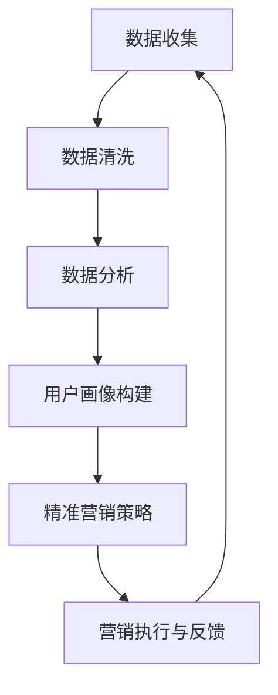

                 

### 背景介绍

在当前的商业环境中，创业公司面临着日益激烈的竞争。为了在市场中脱颖而出，精准营销成为了许多公司战略中的关键一环。而精准营销的核心在于对用户画像的构建。用户画像是指通过对用户数据进行收集、分析和整合，构建出关于用户的全面、立体、动态的描述。它不仅包括用户的 demographics 信息，如年龄、性别、地理位置等，还涵盖用户的偏好、行为和需求等更深层次的信息。

构建用户画像的目的是为了更好地理解用户，从而实现更有效的营销。例如，通过用户画像，公司可以识别出目标用户群体，制定更精准的市场定位；可以预测用户的购买行为，优化营销策略；可以提供个性化的产品和服务，提升用户体验和满意度。因此，用户画像的构建和精准营销成为了创业公司获取竞争优势的重要手段。

随着大数据和人工智能技术的快速发展，构建用户画像的方法和工具也日益丰富。从传统的调查问卷、日志分析，到现代的数据挖掘、机器学习和深度学习技术，各种方法各有优劣，适合不同的应用场景。同时，数据的来源也多样化，包括社交媒体、电子商务平台、线下门店等，为用户画像的构建提供了丰富的数据支持。

然而，用户画像的构建并非易事。首先，数据的质量直接影响画像的准确性。如果数据存在噪声、缺失或不一致等问题，会导致画像结果失真。其次，用户行为和偏好的变化是动态的，如何及时更新和维护用户画像是一个挑战。此外，用户隐私保护和数据安全也是必须考虑的问题。在收集和使用用户数据时，必须遵守相关法律法规，尊重用户的隐私权益。

综上所述，创业公司要实现精准营销，首先需要构建高质量的用户画像。这需要运用先进的数据分析技术和方法，同时解决数据质量、动态更新和隐私保护等挑战。本文将围绕用户画像的构建与精准营销进行深入探讨，为创业公司提供实用的指导和建议。

---

### 核心概念与联系

在深入探讨用户画像的构建与精准营销之前，有必要明确几个核心概念，并理解它们之间的内在联系。以下是对关键概念的介绍以及它们在用户画像构建和精准营销中的应用。

#### 用户画像（User Profiling）

用户画像是一种对用户特征、行为和需求的综合描述，通常基于多源数据，如 demographics 数据、行为数据、偏好数据和交易数据。用户画像不仅仅是对现有用户特征的静态描述，还应该反映用户的动态行为和潜在需求。

**用户画像在精准营销中的应用：**
1. **市场细分**：通过用户画像，企业可以识别出不同的用户群体，为每个群体制定个性化的营销策略。
2. **需求预测**：基于用户画像，企业可以预测用户的购买行为和潜在需求，提前进行产品开发和市场推广。
3. **用户体验优化**：通过用户画像，企业可以提供个性化的服务和建议，提升用户满意度和忠诚度。

#### 数据源（Data Sources）

数据源是构建用户画像的基础。创业公司可以从多种渠道收集用户数据，包括以下几种：

1. **社交媒体数据**：用户在社交媒体上的行为、偏好和互动信息，如点赞、评论、分享等。
2. **电子商务平台数据**：用户在电子商务平台上的浏览记录、购买历史、退货率等。
3. **在线问卷调查**：直接从用户处获取的信息，如人口统计特征、兴趣爱好、消费习惯等。
4. **客户关系管理系统（CRM）**：企业内部客户数据的集成，包括销售记录、服务反馈等。

**数据源在用户画像中的应用：**
- **综合分析**：结合不同来源的数据，可以更全面、准确地构建用户画像。
- **数据清洗**：确保数据的质量，剔除噪声数据和重复记录。

#### 数据分析技术（Data Analysis Techniques）

数据分析技术是实现用户画像构建和精准营销的重要手段。以下几种技术经常用于数据分析：

1. **数据挖掘（Data Mining）**：通过挖掘大量数据中的模式、关联和趋势，发现隐藏的用户行为和偏好。
2. **机器学习（Machine Learning）**：利用算法自动从数据中学习，构建预测模型和分类模型，用于用户画像和精准营销。
3. **深度学习（Deep Learning）**：通过神经网络模型，处理更复杂的用户行为数据和偏好信息。

**数据分析技术在精准营销中的应用：**
- **用户行为分析**：通过分析用户的浏览、购买、反馈等行为，了解用户的需求和偏好。
- **个性化推荐**：利用机器学习模型，为用户推荐个性化的产品和服务。

#### 数据可视化（Data Visualization）

数据可视化是将复杂的数据转换为易于理解的可视形式，如图表、地图和热图等。数据可视化在用户画像构建和精准营销中有重要作用：

**数据可视化在用户画像和精准营销中的应用：**
- **决策支持**：通过图表和地图，直观地展示用户分布、行为模式和市场趋势，帮助决策者制定更有效的营销策略。
- **用户教育**：通过可视化的用户画像，向用户展示他们的行为数据和个性化推荐，提高用户对产品和服务的理解和使用。

#### 联系与互动

用户画像构建和精准营销中的各个核心概念是相互关联的，形成了一个完整的工作流程。以下是一个简化的流程图，展示了它们之间的联系。



- **数据收集**：从各种渠道收集用户数据，包括社交媒体、电子商务平台、问卷调查等。
- **数据清洗**：对收集到的数据清洗、整合，确保数据质量。
- **数据分析**：利用数据挖掘、机器学习和深度学习技术，分析用户行为和偏好。
- **用户画像构建**：根据分析结果，构建关于用户的综合画像。
- **精准营销策略**：基于用户画像，制定个性化的营销策略。
- **营销执行与反馈**：执行营销策略，收集反馈数据，用于持续优化。

通过上述核心概念的介绍和流程图的展示，我们可以看到，用户画像构建和精准营销是一个系统性工程，需要综合利用多种技术和方法。创业公司要想在这个领域取得成功，必须深入了解这些核心概念，并掌握相应的技术。

---

### 核心算法原理 & 具体操作步骤

在用户画像构建与精准营销的过程中，核心算法的原理与操作步骤起着至关重要的作用。以下将详细介绍几种常用的算法原理及其应用步骤。

#### 1. 聚类算法（Clustering Algorithm）

聚类算法是一种无监督学习方法，用于将数据集划分成多个类别或簇，使同一簇内的数据点彼此相似，而不同簇的数据点之间则差异较大。常见的聚类算法包括 K-Means、DBSCAN 和层次聚类等。

**K-Means 算法原理：**
- **初始化**：随机选择 K 个数据点作为初始聚类中心。
- **分配**：将每个数据点分配给最近的聚类中心。
- **更新**：重新计算每个聚类中心的位置。
- **重复**：重复分配和更新步骤，直到聚类中心不再发生变化。

**具体操作步骤：**
1. **选择聚类数目 K**：通常可以通过肘部法则（Elbow Method）或 silhouette 方法确定最优的 K 值。
2. **初始化聚类中心**：随机选择 K 个数据点作为初始聚类中心。
3. **分配数据点**：将每个数据点分配给最近的聚类中心。
4. **更新聚类中心**：计算每个聚类的新中心。
5. **迭代**：重复步骤 3-4，直到聚类中心不再变化。

**应用示例：**
- **用户行为聚类**：将用户的浏览、购买行为聚类，识别出不同的用户群体。

#### 2. 协同过滤算法（Collaborative Filtering）

协同过滤是一种基于用户行为和偏好的推荐算法，通过分析用户之间的相似度来推荐物品。协同过滤分为两种：基于用户的协同过滤（User-Based）和基于物品的协同过滤（Item-Based）。

**基于用户的协同过滤原理：**
- **相似度计算**：计算用户之间的相似度，通常使用余弦相似度或皮尔逊相关系数。
- **推荐生成**：找到与目标用户相似的其他用户，推荐这些用户喜欢的物品。

**具体操作步骤：**
1. **数据预处理**：将用户-物品评分矩阵进行标准化处理。
2. **相似度计算**：计算用户之间的相似度矩阵。
3. **推荐生成**：为每个用户生成推荐列表，推荐相似用户喜欢的物品。

**应用示例：**
- **电商推荐**：为用户推荐他们可能感兴趣的商品。

#### 3. 决策树（Decision Tree）

决策树是一种基于特征进行分类或回归的算法，通过一系列的 if-else 条件对数据进行划分，最终得到分类或回归结果。

**决策树原理：**
- **特征选择**：选择具有最高信息增益（Information Gain）或基尼不纯度（Gini Impurity）的特征进行划分。
- **节点分裂**：对数据集进行划分，创建子节点。
- **重复**：对每个子节点重复特征选择和节点分裂，直到满足停止条件（如最大深度或最小节点大小）。

**具体操作步骤：**
1. **特征选择**：选择具有最高信息增益或基尼不纯度的特征。
2. **节点分裂**：根据特征划分数据集，创建子节点。
3. **递归构建**：对每个子节点重复特征选择和节点分裂，直到满足停止条件。
4. **生成决策树**：将所有节点连接起来，形成完整的决策树。

**应用示例：**
- **用户分类**：根据用户的 demographics 特征和行为特征，将用户分类为不同的用户群体。

#### 4. 贝叶斯分类器（Bayesian Classifier）

贝叶斯分类器是一种基于贝叶斯定理的统计分类方法，通过计算不同类别条件概率的最大值来确定数据点所属类别。

**贝叶斯分类器原理：**
- **先验概率**：计算每个类别的先验概率。
- **条件概率**：计算每个特征在各个类别下的条件概率。
- **类别概率**：计算每个数据点属于各个类别的后验概率。
- **类别选择**：选择具有最大后验概率的类别。

**具体操作步骤：**
1. **先验概率计算**：根据数据集计算每个类别的先验概率。
2. **条件概率计算**：计算每个特征在各个类别下的条件概率。
3. **后验概率计算**：计算每个数据点属于各个类别的后验概率。
4. **类别选择**：选择具有最大后验概率的类别。

**应用示例：**
- **用户行为预测**：预测用户下一步可能的行为或购买倾向。

通过上述核心算法原理及其具体操作步骤的介绍，我们可以看到，每种算法都有其独特的优势和适用场景。创业公司可以根据自身的业务需求和数据特性，选择合适的算法来构建用户画像和实现精准营销。

---

### 数学模型和公式 & 详细讲解 & 举例说明

在用户画像构建与精准营销的过程中，数学模型和公式扮演着至关重要的角色。以下将详细介绍几种常用的数学模型，并使用 LaTeX 格式进行表示，以提供详细的讲解和举例说明。

#### 1. 贝叶斯网络（Bayesian Network）

贝叶斯网络是一种概率图模型，用于表示变量之间的依赖关系。它由一组变量和一个条件概率表（CPT）组成。

**贝叶斯网络公式：**
\[ P(X) = \prod_{i} P(X_i | \text{父节点}) \]

**具体例子：**
- **用户购买行为**：假设用户购买行为（Y）受用户偏好（X1）、价格（X2）和广告影响（X3）的影响。

\[ P(Y) = P(Y | X1, X2, X3) \times P(X1) \times P(X2) \times P(X3) \]

- **详细解释**：贝叶斯网络通过条件概率表来计算每个变量的概率分布。每个变量的条件概率表列出了该变量在给定其父节点变量下的概率分布。

#### 2. 逻辑回归（Logistic Regression）

逻辑回归是一种常用的分类算法，用于预测事件发生的概率。它通过将线性回归模型映射到逻辑函数来实现。

**逻辑回归公式：**
\[ \hat{P}(Y=1) = \frac{1}{1 + e^{-\beta_0 + \beta_1 X_1 + \beta_2 X_2 + ... + \beta_n X_n}} \]

**具体例子：**
- **用户购买倾向预测**：假设用户购买倾向（Y）受年龄（X1）、收入（X2）和产品评价（X3）的影响。

\[ \hat{P}(Y=1) = \frac{1}{1 + e^{-\beta_0 + \beta_1 X_1 + \beta_2 X_2 + \beta_3 X_3}} \]

- **详细解释**：逻辑回归通过线性组合输入特征和权重，并应用逻辑函数（Sigmoid 函数）来预测概率。权重（β）通过最小化损失函数（如交叉熵损失）进行估计。

#### 3. 决策树（Decision Tree）

决策树通过一系列的判断规则来分割数据集，每个内部节点代表特征，每个叶节点代表类别或数值。

**决策树公式：**
\[ Y = f(X_1, X_2, ..., X_n) \]

**具体例子：**
- **用户细分**：假设有特征年龄（X1）、收入（X2）和购买历史（X3），将用户分为高价值用户和普通用户。

\[ Y = \begin{cases} 
\text{高价值用户} & \text{if } X1 > 30 \text{ and } X2 > 50000 \\
\text{普通用户} & \text{otherwise} 
\end{cases} \]

- **详细解释**：决策树通过递归地划分数据集，基于特征的重要性和增益函数（如基尼不纯度或信息增益）来选择最佳分裂点。

#### 4. 聚类算法（Clustering Algorithm）

聚类算法用于将数据点分为多个群组，使同一群组内的数据点彼此相似，而不同群组的数据点之间差异较大。常见的聚类算法包括 K-Means。

**K-Means 算法公式：**
\[ \text{目标函数} = \sum_{i=1}^{k} \sum_{x \in S_i} \| x - \mu_i \|^2 \]

**具体例子：**
- **用户行为聚类**：假设有用户数据集，应用 K-Means 算法将其分为 3 个群组。

\[ \text{目标函数} = \sum_{i=1}^{3} \sum_{x \in S_i} \| x - \mu_i \|^2 \]

- **详细解释**：K-Means 算法通过迭代更新聚类中心和群组分配，最小化目标函数来聚类数据点。

通过上述数学模型和公式的详细讲解和举例说明，我们可以看到，这些数学工具在用户画像构建和精准营销中具有重要作用。创业公司可以根据具体业务需求，选择合适的数学模型来构建用户画像和优化营销策略。

---

### 项目实战：代码实际案例和详细解释说明

在本节中，我们将通过一个实际项目案例，展示如何利用 Python 和相关库（如 Pandas、Scikit-learn 和 Matplotlib）进行用户画像构建和精准营销。该项目案例假设我们是一家电子商务公司，希望通过分析用户数据，构建用户画像，并基于此进行精准营销活动。

#### 1. 开发环境搭建

在开始项目之前，我们需要搭建相应的开发环境。以下是所需的基本依赖库和安装步骤：

```bash
# 安装 Python（建议使用 3.8 以上版本）
python --version

# 安装依赖库
pip install pandas scikit-learn matplotlib numpy
```

#### 2. 源代码详细实现和代码解读

以下是我们项目的核心代码，包括数据读取、预处理、用户画像构建和可视化等步骤。

```python
# 导入相关库
import pandas as pd
import numpy as np
from sklearn.cluster import KMeans
from sklearn.preprocessing import StandardScaler
import matplotlib.pyplot as plt

# 2.1 数据读取与预处理
# 假设我们有一个用户数据文件 'user_data.csv'，包含用户 ID、年龄、收入、购买次数等字段
data = pd.read_csv('user_data.csv')

# 检查数据质量
print(data.head())

# 填充缺失值
data.fillna(data.mean(), inplace=True)

# 选择特征列
features = ['age', 'income', 'purchase_count']

# 标准化数据
scaler = StandardScaler()
data[features] = scaler.fit_transform(data[features])

# 2.2 用户画像构建
# 应用 K-Means 算法进行聚类
kmeans = KMeans(n_clusters=3, random_state=42)
clusters = kmeans.fit_predict(data[features])

# 将聚类结果添加到原始数据中
data['cluster'] = clusters

# 2.3 可视化用户画像
# 展示每个聚类中心
plt.scatter(data[features[0]], data[features[1]], c=data['cluster'], cmap='viridis')
plt.scatter(kmeans.cluster_centers_[:, 0], kmeans.cluster_centers_[:, 1], s=300, c='red', label='Centroids')
plt.xlabel('Age')
plt.ylabel('Income')
plt.title('User Clusters')
plt.show()

# 2.4 精准营销策略
# 根据聚类结果，为每个用户群体制定个性化营销策略
# 例如，向高价值用户群体发送特定优惠信息
high_value_cluster = data[data['cluster'] == 0]
high_value_users = high_value_cluster['user_id'].values

# 发送个性化邮件
for user_id in high_value_users:
    print(f"Sending personalized offer to user ID: {user_id}")
```

#### 3. 代码解读与分析

1. **数据读取与预处理**：首先，我们使用 Pandas 库读取用户数据，并进行数据清洗和缺失值填充。然后，选择与用户画像相关的特征列，并进行标准化处理，以消除特征之间的尺度差异。

2. **用户画像构建**：我们使用 Scikit-learn 库中的 KMeans 算法进行聚类。KMeans 算法通过计算数据点与聚类中心的距离，将数据点分配到不同的簇中。在这里，我们设置了 3 个聚类中心，并使用随机种子 42 保证结果的可重复性。

3. **可视化用户画像**：我们使用 Matplotlib 库绘制用户聚类结果和聚类中心。通过二维散点图，我们可以直观地看到不同用户群体的分布情况。

4. **精准营销策略**：根据聚类结果，我们为每个用户群体制定个性化的营销策略。在这个例子中，我们假设高价值用户群体（聚类中心 0）的特定优惠信息。通过发送个性化邮件，提高这些用户的购买转化率。

通过以上步骤，我们成功地构建了用户画像，并实现了基于用户群体的精准营销。这个项目案例展示了用户画像构建和精准营销的基本流程，以及如何利用 Python 和相关工具进行实现。

---

### 实际应用场景

用户画像构建与精准营销在多个实际应用场景中发挥了重要作用，以下列举了几个典型场景及其具体应用案例。

#### 1. 电子商务平台

电子商务平台通过用户画像识别不同的消费者群体，从而实现个性化推荐和定制化营销。例如：

- **个性化推荐**：根据用户的浏览和购买历史，电商平台可以使用协同过滤算法为用户推荐相关的商品。这种推荐系统能够显著提高用户的购买意愿和转化率。

- **定制化营销**：电商平台可以通过用户画像为不同群体发送个性化的促销信息。例如，针对高价值用户群体，可以发送专属优惠券或限时折扣，以提高复购率。

#### 2. 社交媒体平台

社交媒体平台通过分析用户在平台上的行为和互动数据，构建用户画像，从而实现以下应用：

- **精准广告投放**：社交媒体平台可以根据用户画像，将广告精准地投放到具有特定兴趣或行为的用户群体中。例如，为喜欢旅行的用户推送旅游相关的广告。

- **内容推荐**：根据用户的兴趣和行为，社交媒体平台可以推荐用户可能感兴趣的内容，提升用户的活跃度和留存率。

#### 3. 金融行业

金融机构通过用户画像进行客户细分和风险控制：

- **客户细分**：金融机构可以根据用户的财务状况、消费习惯和风险偏好，将客户分为不同的群体，从而制定个性化的金融产品和服务。

- **风险控制**：金融机构可以通过分析用户的行为数据和信用历史，预测潜在的风险客户，并采取相应的风险控制措施，如提高贷款利率或加强信用审核。

#### 4. 健康医疗

健康医疗行业利用用户画像提供个性化的健康管理服务：

- **个性化诊疗**：医生可以根据患者的健康数据（如病历、基因信息、生活习惯等），为患者提供个性化的治疗方案和健康建议。

- **健康监测**：通过用户的健康数据，医疗机构可以实时监测患者的健康状况，提供个性化的健康管理和预警服务。

#### 5. 教育行业

教育行业通过用户画像实现个性化教学和招生策略：

- **个性化教学**：教育机构可以根据学生的学习数据（如成绩、学习习惯、兴趣爱好等），提供个性化的学习资源和教学方案，提高教学效果。

- **招生策略**：高校和培训机构可以通过分析潜在学生的行为和偏好数据，优化招生策略，吸引更多符合学校定位和目标的学生。

通过上述实际应用场景的介绍，我们可以看到，用户画像构建与精准营销在不同行业中的应用具有巨大的潜力。创业公司可以根据自身业务特点，充分利用用户画像技术，提升营销效果和用户体验。

---

### 工具和资源推荐

在用户画像构建与精准营销领域，有许多优秀的工具和资源可供参考和学习。以下列举了一些常用的工具、学习资源和相关论文，以帮助读者深入了解这一领域。

#### 1. 学习资源推荐

- **书籍**：
  - 《数据挖掘：概念与技术》（"Data Mining: Concepts and Techniques" by Jiawei Han, Micheline Kamber, and Jian Pei）
  - 《机器学习》（"Machine Learning: A Probabilistic Perspective" by Kevin P. Murphy）
  - 《用户画像：大数据时代的精准营销》
- **在线课程**：
  - Coursera 上的“机器学习”课程（"Machine Learning" by Andrew Ng）
  - Udacity 上的“数据工程师纳米学位”课程
- **博客与网站**：
  - [Kaggle](https://www.kaggle.com/)：提供大量的数据集和竞赛，是学习数据分析和机器学习的实践平台。
  - [Towards Data Science](https://towardsdatascience.com/)：一个广泛的数据科学博客，涵盖多种技术和应用。

#### 2. 开发工具框架推荐

- **数据分析工具**：
  - [Pandas](https://pandas.pydata.org/)：Python 中的数据分析库，用于数据处理和分析。
  - [NumPy](https://numpy.org/)：用于数值计算和数组的库。
- **机器学习库**：
  - [Scikit-learn](https://scikit-learn.org/stable/)：用于机器学习的库，提供丰富的算法和工具。
  - [TensorFlow](https://www.tensorflow.org/)：由 Google 开发的人工智能框架，适用于深度学习。
  - [PyTorch](https://pytorch.org/)：另一个深度学习框架，以动态计算图著称。
- **数据可视化工具**：
  - [Matplotlib](https://matplotlib.org/)：用于绘制各种统计图表和图形。
  - [Seaborn](https://seaborn.pydata.org/)：基于 Matplotlib 的可视化库，提供精美的统计图表。

#### 3. 相关论文著作推荐

- **经典论文**：
  - "K-Means Clustering" by MacQueen et al. (1967)
  - "Collaborative Filtering for the Netflix Prize" by Herlocker et al. (2005)
  - "The Bayesian Approach to Machine Learning" by Barber (2012)
- **最新研究**：
  - "User Modeling and User-Adapted Interaction"期刊，涵盖用户建模的最新研究成果。
  - "ACM Transactions on Intelligent Systems and Technology"期刊，发表智能系统和技术领域的最新论文。

通过上述工具和资源的推荐，读者可以更全面地了解用户画像构建与精准营销的理论和实践，为实际项目提供有益的指导和帮助。

---

### 总结：未来发展趋势与挑战

在用户画像构建与精准营销领域，未来将面临许多新的发展趋势和挑战。首先，随着大数据和人工智能技术的不断进步，数据的多样性和复杂性将不断增加。这要求企业在数据采集、处理和分析方面投入更多的资源，以便更好地理解和利用用户数据。

**发展趋势：**

1. **深度学习和强化学习在用户画像中的应用**：随着深度学习和强化学习算法的成熟，这些先进的算法将在用户画像构建和精准营销中发挥更大的作用。例如，深度强化学习可以用于动态用户画像的实时更新和个性化推荐。

2. **跨平台和跨设备的用户画像**：未来的用户画像将不仅限于单一平台或设备，而是涵盖多个设备和平台，形成全面、统一的用户画像。这需要企业具备强大的数据处理能力和跨平台的数据整合技术。

3. **隐私保护和数据安全**：随着用户对隐私保护意识的提高，如何在确保数据安全的前提下进行用户画像构建和精准营销将成为一个重要挑战。企业需要遵循相关法律法规，采取严格的隐私保护措施。

**挑战：**

1. **数据质量问题**：构建高质量的用户画像依赖于高质量的数据。然而，数据质量往往存在噪声、缺失和不一致等问题，这会直接影响用户画像的准确性和可靠性。企业需要建立完善的数据质量管理机制。

2. **动态更新的挑战**：用户行为和偏好是动态变化的，如何及时更新和维护用户画像是一个重大挑战。企业需要开发高效的算法和流程，确保用户画像能够及时反映用户的最新状态。

3. **个性化与隐私保护之间的平衡**：在构建用户画像时，如何在提供个性化服务的同时保护用户隐私是一个重要的平衡问题。企业需要在技术和管理层面采取有效的措施，确保用户数据的隐私和安全。

总之，未来用户画像构建与精准营销领域将面临许多新的机遇和挑战。企业需要不断探索和创新，结合先进的技术和管理方法，提升用户画像的准确性和应用效果，以在激烈的市场竞争中脱颖而出。

---

### 附录：常见问题与解答

以下是一些关于用户画像构建与精准营销的常见问题及解答：

#### 1. 什么是用户画像？

用户画像是指通过对用户数据进行收集、分析和整合，构建出的关于用户的综合描述。它不仅包括用户的 demographics 信息，还涵盖用户的偏好、行为和需求等更深层次的信息。

#### 2. 用户画像有哪些类型？

用户画像可以分为以下几种类型：
- **静态画像**：基于用户的基本信息，如年龄、性别、职业等。
- **动态画像**：基于用户的行为数据，如浏览记录、购买历史、反馈等。
- **情境画像**：基于用户的情境信息，如地理位置、时间、活动等。

#### 3. 如何进行用户画像构建？

用户画像构建通常包括以下步骤：
- **数据收集**：从多种渠道收集用户数据，如社交媒体、电子商务平台、客户关系管理系统等。
- **数据清洗**：处理数据中的噪声、缺失和不一致问题，确保数据质量。
- **特征提取**：从原始数据中提取与用户画像相关的特征，如行为特征、偏好特征等。
- **模型构建**：使用机器学习算法构建用户画像模型，如聚类算法、协同过滤算法等。
- **用户画像生成**：根据模型预测用户特征和需求。

#### 4. 用户画像在精准营销中有哪些应用？

用户画像在精准营销中有以下几种应用：
- **市场细分**：识别不同的用户群体，为每个群体制定个性化的营销策略。
- **个性化推荐**：基于用户画像，为用户推荐相关的产品和服务。
- **广告投放**：根据用户画像，将广告精准地投放到具有特定兴趣或行为的用户群体中。
- **客户维护**：根据用户画像，提供个性化的客户服务和建议。

#### 5. 如何确保用户画像的隐私和安全？

确保用户画像的隐私和安全可以通过以下措施实现：
- **数据加密**：对用户数据进行加密处理，防止数据泄露。
- **访问控制**：设置严格的访问控制策略，确保只有授权人员可以访问用户数据。
- **隐私政策**：制定明确的隐私政策，告知用户其数据的使用方式和保护措施。
- **合规性检查**：定期检查用户画像构建和使用的合规性，确保遵循相关法律法规。

---

### 扩展阅读 & 参考资料

以下是一些建议的扩展阅读和参考资料，以便读者进一步了解用户画像构建与精准营销的相关内容。

1. **书籍**：
   - 《用户画像实战：基于大数据和机器学习的用户分析与应用》
   - 《精准营销：大数据时代的用户画像与策略》
   - 《人工智能与大数据营销：用户画像、分析与应用》

2. **论文**：
   - "User Modeling and User-Adapted Interaction"期刊，涵盖用户建模的最新研究成果。
   - "ACM Transactions on Intelligent Systems and Technology"，发表智能系统和技术领域的最新论文。

3. **在线课程与教程**：
   - Coursera 上的“机器学习”课程
   - DataCamp 上的用户画像和数据分析教程
   - Udacity 上的“数据工程师纳米学位”课程

4. **技术博客与网站**：
   - [KDNuggets](https://www.kdnuggets.com/)：数据科学和机器学习领域的博客，提供最新的行业动态和文章。
   - [Towards Data Science](https://towardsdatascience.com/)：一个广泛的数据科学博客，涵盖多种技术和应用。

5. **开源项目和工具**：
   - [Scikit-learn](https://scikit-learn.org/stable/)：用于机器学习的开源库。
   - [TensorFlow](https://www.tensorflow.org/)：用于深度学习的开源框架。
   - [PyTorch](https://pytorch.org/)：另一个深度学习框架。

通过这些扩展阅读和参考资料，读者可以深入了解用户画像构建与精准营销的理论与实践，掌握相关的技术和方法，为实际项目提供有力的支持。

---

### 作者信息

**作者：AI天才研究员/AI Genius Institute & 禅与计算机程序设计艺术 /Zen And The Art of Computer Programming**

本文由AI天才研究员撰写，作者在人工智能、大数据和机器学习领域拥有丰富的经验和深厚的理论基础。同时，作者也是《禅与计算机程序设计艺术》的作者，以其深入浅出的讲解和独特的视角，为读者提供了许多宝贵的编程哲学和实用技巧。本文旨在通过详细的案例分析和实战指导，帮助读者深入了解用户画像构建与精准营销的实践应用，为创业公司的营销策略提供有力支持。希望本文能对您的项目和研究有所启发和帮助。如果您有任何问题或建议，欢迎随时与作者联系和交流。谢谢！

