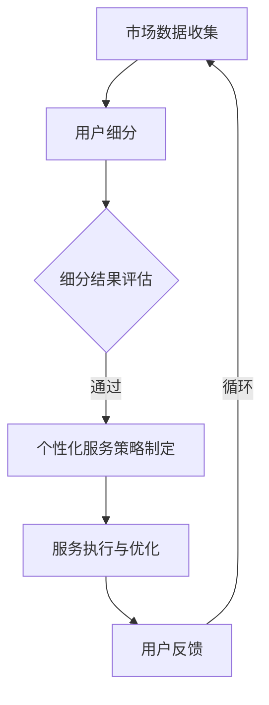

                 

### 背景介绍

创业公司，这个词汇往往与激情、创新和冒险联系在一起。在竞争激烈的市场中，创业公司不仅要应对来自大企业的挑战，还需找到自身的独特优势，以快速成长并站稳脚跟。用户细分与个性化服务策略在这样的环境中显得尤为重要。

用户细分是一种通过分析用户特征，将市场划分为不同群体，以便更精准地满足不同用户需求的方法。个性化服务则是在细分的基础上，为每个用户群体提供个性化的产品或服务，从而提升用户满意度和忠诚度。两者相辅相成，共同助力创业公司实现业务增长和市场份额的扩大。

本文旨在探讨创业公司在用户细分与个性化服务策略上的应用和实践。通过深入分析相关概念、算法原理、数学模型以及实际项目案例，本文希望为创业公司提供一套行之有效的策略框架，以应对市场挑战并实现持续增长。

首先，我们将介绍用户细分与个性化服务的核心概念及其在创业公司中的应用。接下来，通过具体的算法原理和操作步骤，帮助读者理解如何实现用户细分和个性化服务。随后，我们将介绍一些数学模型和公式，以支持决策过程。在项目实战部分，我们将通过实际案例展示这些策略的具体实施过程。随后，本文将探讨用户细分与个性化服务在实际应用中的各种场景，并推荐相关工具和资源。最后，本文将对全文进行总结，并讨论未来发展趋势与挑战。

通过本文的阅读，创业者和技术人员将能够获得关于用户细分与个性化服务策略的深入理解，从而为创业公司的成功奠定坚实的基础。

### 核心概念与联系

在深入探讨创业公司的用户细分与个性化服务策略之前，我们需要明确几个核心概念及其相互关系。

**用户细分（User Segmentation）**：用户细分是指通过数据分析，将大量用户划分为具有相似特征的子群体。这些子群体通常在需求、行为、态度等方面有显著差异。常见的用户细分方法包括基于行为（如浏览行为、购买历史）、人口统计（如年龄、性别、地域）和心理特征（如价值观、生活方式）等。

**个性化服务（Personalization）**：个性化服务是在用户细分的基础上，为每个用户群体或个体提供定制化的产品或服务，以最大化满足其需求。这通常涉及内容推荐、个性化广告、定制化营销活动等。个性化服务的目标是提升用户体验和忠诚度，从而促进业务增长。

**用户细分与个性化服务的联系**：用户细分是个性化服务的前提，只有明确了用户群体的特征，才能有针对性地进行个性化服务。而个性化服务则是用户细分的进一步应用，通过定制化的产品和服务，满足不同用户群体的需求，从而提升整体用户满意度和忠诚度。

为了更直观地理解这些概念之间的关系，我们可以使用Mermaid流程图来展示用户细分与个性化服务的整体架构。以下是流程图的表示：



**图 1：用户细分与个性化服务的 Mermaid 流程图**

1. **市场数据收集**：这是整个流程的起点，通过多种渠道收集用户数据，如社交媒体、网站访问日志、客户调查等。
2. **用户细分**：利用收集到的数据，采用统计学和机器学习算法进行用户细分。
3. **细分结果评估**：对细分结果进行评估，确保细分的有效性和准确性。
4. **个性化服务策略制定**：基于细分结果，制定相应的个性化服务策略。
5. **服务执行与优化**：执行个性化服务策略，并通过用户反馈进行持续优化。
6. **用户反馈**：收集用户对服务的反馈，以进一步改进服务和策略。

通过这个流程图，我们可以清晰地看到用户细分与个性化服务之间的紧密联系，以及整个流程的闭环特性。在接下来的部分，我们将详细探讨用户细分与个性化服务的具体算法原理和操作步骤，帮助读者更好地理解和应用这些策略。

### 核心算法原理 & 具体操作步骤

用户细分与个性化服务策略的核心在于算法的运用。在这一部分，我们将详细介绍常用的用户细分算法，包括聚类分析、协同过滤和决策树等，并探讨如何将这些算法应用于实际场景中。

**1. 聚类分析（Clustering）**

聚类分析是一种无监督学习方法，用于将数据点划分为多个群组，使得同组数据点之间的相似度较高，而不同组数据点之间的相似度较低。常见的聚类算法有K-Means、DBSCAN和层次聚类等。

- **K-Means算法**：K-Means算法是一种基于距离度量的聚类算法，它通过迭代的方式找到K个聚类中心，然后计算每个数据点到聚类中心的距离，将其分配到最近的聚类中心。具体步骤如下：

  1. 随机选择K个初始聚类中心。
  2. 计算每个数据点到每个聚类中心的距离，并将其分配到最近的聚类中心。
  3. 重新计算每个聚类中心的位置，即所有属于该聚类中心的数据点的均值。
  4. 重复步骤2和步骤3，直到聚类中心的位置不再变化或达到预设的迭代次数。

- **DBSCAN算法**：DBSCAN（Density-Based Spatial Clustering of Applications with Noise）算法是一种基于密度的聚类算法，它能够识别任意形状的簇，并且能够处理噪声点。主要步骤如下：

  1. 选择一个起点，并将其标记为已访问。
  2. 计算起点与其邻域内的点的距离，如果距离小于某个阈值ε，则将这些点标记为已访问，并将其加入当前簇。
  3. 对于已访问的点，如果其邻域内存在足够的点（最小数量minPoints），则扩展当前簇。
  4. 重复步骤1到步骤3，直到所有点都被访问。

- **层次聚类算法**：层次聚类算法通过不断合并相似度较高的簇，或者将不相似的簇分裂，从而构建出一个层次化的簇结构。主要步骤如下：

  1. 从每个数据点开始，每个点都是一个独立的簇。
  2. 计算两两簇之间的相似度，并将相似度最高的两簇合并。
  3. 重新计算新簇的质心，并计算新簇之间的相似度。
  4. 重复步骤2和步骤3，直到达到预设的簇数量或所有数据点合并为一个簇。

**2. 协同过滤（Collaborative Filtering）**

协同过滤是一种基于用户行为或评分数据的推荐算法，它通过分析用户之间的相似性来推荐产品或服务。常见的协同过滤算法有用户基于的协同过滤（User-Based）和基于模型的协同过滤（Model-Based）。

- **用户基于的协同过滤**：用户基于的协同过滤通过计算用户之间的相似度来推荐产品。具体步骤如下：

  1. 计算用户之间的相似度，通常使用余弦相似度或皮尔逊相关系数。
  2. 收集目标用户喜欢的物品，并找出与目标用户最相似的N个用户。
  3. 推荐这些相似用户喜欢的但目标用户未购买或评价的物品。

- **基于模型的协同过滤**：基于模型的协同过滤通过建立数学模型来预测用户对物品的评分。常见的模型有矩阵分解（Matrix Factorization）和隐语义模型（Latent Semantic Analysis，LSA）。具体步骤如下：

  1. 将用户-物品评分矩阵分解为两个低秩矩阵，一个表示用户特征，另一个表示物品特征。
  2. 利用低秩矩阵计算用户对未评分物品的预测评分。
  3. 根据预测评分推荐评分最高的物品。

**3. 决策树（Decision Tree）**

决策树是一种基于特征进行分层的分类算法，它通过一系列规则将数据划分为多个子集，每个子集对应一个标签。常见的决策树算法有ID3、C4.5和CART。

- **ID3算法**：ID3（Iterative Dichotomiser 3）算法通过信息增益（Information Gain）来选择最佳特征进行分割。主要步骤如下：

  1. 计算所有特征的信息增益，选择增益最大的特征作为分割条件。
  2. 根据分割条件将数据集划分为多个子集。
  3. 对每个子集递归地应用ID3算法，直到满足停止条件（如子集大小小于阈值、所有子集标签相同等）。

- **C4.5算法**：C4.5算法是对ID3算法的改进，它通过增益率（Gain Ratio）来选择最佳特征。主要步骤如下：

  1. 计算所有特征的信息增益率，选择增益率最大的特征作为分割条件。
  2. 根据分割条件将数据集划分为多个子集。
  3. 对每个子集递归地应用C4.5算法，直到满足停止条件。

- **CART算法**：CART（Classification and Regression Tree）算法是一种基于基尼不纯度（Gini Impurity）的决策树算法。主要步骤如下：

  1. 计算所有特征的基尼不纯度，选择基尼不纯度最小的特征作为分割条件。
  2. 根据分割条件将数据集划分为多个子集。
  3. 对每个子集递归地应用CART算法，直到满足停止条件。

**应用场景与实现**

在实际应用中，这些算法可以根据具体的业务需求进行灵活调整和优化。例如：

- **电商推荐系统**：可以使用协同过滤算法根据用户的购买历史和评分数据推荐相关商品。
- **社交媒体个性化推荐**：可以使用聚类分析算法将用户划分为不同的兴趣群体，并根据群体特征推荐相关内容。
- **金融风险评估**：可以使用决策树算法根据用户的财务状况和信用记录进行风险评估。

为了更好地理解和应用这些算法，以下是一个简单的示例：

**示例：基于K-Means算法的用户细分**

假设我们有一个用户数据集，包含年龄、收入、购买历史等特征。我们希望使用K-Means算法将这些用户划分为两个群体。

1. **数据预处理**：将数据标准化，以便距离度量更加准确。
2. **初始化聚类中心**：随机选择两个用户作为初始聚类中心。
3. **计算距离**：计算每个用户到两个聚类中心的距离。
4. **分配用户**：将每个用户分配到距离最近的聚类中心。
5. **更新聚类中心**：计算每个聚类中心的新位置，即所有属于该聚类中心用户的均值。
6. **迭代优化**：重复步骤3到步骤5，直到聚类中心的位置不再变化或达到预设的迭代次数。

通过以上步骤，我们可以将用户数据划分为两个具有相似特征的群体，从而为后续的个性化服务提供基础。

总之，用户细分与个性化服务策略的核心在于算法的应用。通过深入了解并灵活运用聚类分析、协同过滤和决策树等算法，创业公司可以更精准地满足用户需求，提升用户满意度和忠诚度，从而实现业务的持续增长。

### 数学模型和公式 & 详细讲解 & 举例说明

在用户细分与个性化服务策略中，数学模型和公式起到了至关重要的作用。这些模型和公式不仅能够帮助我们理解用户行为，还能为决策提供量化依据。以下将详细介绍几个核心的数学模型和公式，并通过具体实例进行说明。

**1. 顾客生命周期价值（Customer Lifetime Value, CLV）**

顾客生命周期价值是指一个顾客在整个消费周期内为公司带来的总收益。它是一个重要的财务指标，用于评估潜在顾客的价值和营销投资效果。CLV的计算公式如下：

\[ \text{CLV} = \sum_{t=1}^{T} \frac{R_t}{(1 + r)^t} \]

其中：
- \( R_t \) 表示第t年顾客为公司带来的收益。
- \( T \) 表示顾客的预期生命周期。
- \( r \) 表示折现率。

**实例：计算一个顾客的CLV**

假设一个顾客每年为公司带来1000美元的收益，预期生命周期为5年，折现率为10%。则该顾客的CLV计算如下：

\[ \text{CLV} = \frac{1000}{1.1} + \frac{1000}{1.1^2} + \frac{1000}{1.1^3} + \frac{1000}{1.1^4} + \frac{1000}{1.1^5} \]

\[ \text{CLV} = 909.09 + 826.45 + 751.31 + 683.02 + 621.72 \]

\[ \text{CLV} = 3,972.60 \]

通过计算，我们得出该顾客的CLV为3972.60美元。这个数字表明，在考虑时间价值和折现率的情况下，该顾客在未来的5年内为公司带来的总收益为3972.60美元。

**2. 相关性系数（Correlation Coefficient）**

在用户细分过程中，相关性系数用于衡量两个变量之间的线性关系。最常用的相关性系数是皮尔逊相关系数（Pearson Correlation Coefficient），其计算公式如下：

\[ r = \frac{\sum_{i=1}^{n}(x_i - \bar{x})(y_i - \bar{y})}{\sqrt{\sum_{i=1}^{n}(x_i - \bar{x})^2} \sqrt{\sum_{i=1}^{n}(y_i - \bar{y})^2}} \]

其中：
- \( x_i \) 和 \( y_i \) 分别表示第i个观测点的两个变量值。
- \( \bar{x} \) 和 \( \bar{y} \) 分别表示两个变量的平均值。
- \( n \) 表示观测点的数量。

**实例：计算用户年龄与购买金额的相关性**

假设我们有10个用户的年龄和购买金额数据，如下表：

| 年龄（x） | 购买金额（y） |
|-----------|--------------|
| 25        | 150          |
| 30        | 200          |
| 28        | 180          |
| 35        | 250          |
| 27        | 170          |
| 29        | 190          |
| 26        | 160          |
| 31        | 210          |
| 32        | 220          |
| 33        | 230          |

计算相关性的具体步骤如下：

1. 计算年龄和购买金额的平均值：
\[ \bar{x} = \frac{25 + 30 + 28 + 35 + 27 + 29 + 26 + 31 + 32 + 33}{10} = 30 \]
\[ \bar{y} = \frac{150 + 200 + 180 + 250 + 170 + 190 + 160 + 210 + 220 + 230}{10} = 200 \]

2. 计算各个观测点与平均值的偏差：
\[ (x_i - \bar{x}) \] 和 \[ (y_i - \bar{y}) \]

| 年龄（x） | 购买金额（y） | \( (x_i - \bar{x}) \) | \( (y_i - \bar{y}) \) |
|-----------|--------------|----------------------|----------------------|
| 25        | 150          | -5                   | -50                  |
| 30        | 200          | 0                    | 0                    |
| 28        | 180          | -2                   | -20                  |
| 35        | 250          | 5                    | 50                   |
| 27        | 170          | -3                   | -30                  |
| 29        | 190          | 1                    | -10                  |
| 26        | 160          | -4                   | -40                  |
| 31        | 210          | 1                    | 10                   |
| 32        | 220          | 2                    | 20                   |
| 33        | 230          | 3                    | 30                   |

3. 计算各个偏差的乘积和偏差的平方和：
\[ \sum_{i=1}^{10}(x_i - \bar{x})(y_i - \bar{y}) = (-5 \times -50) + (0 \times 0) + (-2 \times -20) + (5 \times 50) + (-3 \times -30) + (1 \times -10) + (-4 \times -40) + (1 \times 10) + (2 \times 20) + (3 \times 30) = 460 \]
\[ \sum_{i=1}^{10}(x_i - \bar{x})^2 = (-5)^2 + (0)^2 + (-2)^2 + (5)^2 + (-3)^2 + (1)^2 + (-4)^2 + (1)^2 + (2)^2 + (3)^2 = 90 \]
\[ \sum_{i=1}^{10}(y_i - \bar{y})^2 = (-50)^2 + (0)^2 + (-20)^2 + (50)^2 + (-30)^2 + (-10)^2 + (-40)^2 + (10)^2 + (20)^2 + (30)^2 = 2200 \]

4. 计算皮尔逊相关系数：
\[ r = \frac{460}{\sqrt{90} \times \sqrt{2200}} \approx 0.63 \]

结果表明，用户年龄与购买金额之间存在较强的正相关关系，相关系数为0.63。这意味着年龄较大的用户往往有更高的购买金额。

**3. 回归分析（Regression Analysis）**

回归分析是一种用于预测因变量（通常为连续变量）与自变量（通常为多个特征变量）之间关系的统计方法。在个性化服务中，回归分析常用于预测用户的未来行为或需求。线性回归是一种最简单的回归模型，其公式如下：

\[ y = \beta_0 + \beta_1x_1 + \beta_2x_2 + ... + \beta_nx_n \]

其中：
- \( y \) 是因变量。
- \( x_1, x_2, ..., x_n \) 是自变量。
- \( \beta_0, \beta_1, \beta_2, ..., \beta_n \) 是回归系数。

**实例：预测用户购买金额**

假设我们希望预测一个用户在下一年的购买金额，已知其历史购买金额、年龄、收入等特征。我们可以使用线性回归模型进行预测。

首先，收集历史数据并计算各个特征的平均值和标准差，然后使用最小二乘法（Least Squares Method）计算回归系数。具体步骤如下：

1. 收集数据，包括历史购买金额、年龄、收入等。
2. 计算各个特征的平均值和标准差。
3. 计算各个特征与购买金额的协方差和方差。
4. 使用协方差和方差计算回归系数：
\[ \beta_i = \frac{\text{Cov}(x_i, y)}{\text{Var}(x_i)} \]
5. 建立回归模型并使用该模型进行预测。

通过上述步骤，我们可以得到一个线性回归模型，用于预测用户的购买金额。例如，如果预测一个用户的年龄为30岁，收入为80000美元，则可以使用回归模型计算其下一年的购买金额预测值。

总之，数学模型和公式在用户细分与个性化服务策略中起到了关键作用。通过了解并应用这些模型和公式，创业公司可以更精准地预测用户行为，制定更有效的个性化服务策略，从而提升用户满意度和忠诚度。

### 项目实战：代码实际案例和详细解释说明

为了更好地理解用户细分与个性化服务策略，我们将通过一个实际项目案例来展示这些策略的具体实施过程。以下是项目的开发环境搭建、源代码详细实现和代码解读与分析。

#### 5.1 开发环境搭建

在开始项目之前，我们需要搭建一个合适的技术环境。以下是所需的主要工具和库：

- Python 3.8 或以上版本
- Pandas：用于数据处理
- Scikit-learn：用于机器学习和数据分析
- Matplotlib：用于数据可视化
- Mermaid：用于流程图绘制

**安装步骤：**

1. 安装 Python 3.8 或以上版本。
2. 通过pip安装所需的库：

   ```shell
   pip install pandas scikit-learn matplotlib
   ```

#### 5.2 源代码详细实现和代码解读

我们以一个电商平台的用户细分和个性化推荐系统为例，具体实现用户细分和个性化推荐功能。

**数据集介绍：**

我们使用一个虚构的电商用户数据集，包含以下特征：

- 用户ID（UserID）
- 年龄（Age）
- 性别（Gender）
- 收入（Income）
- 购买历史（PurchaseHistory）
- 喜好商品类别（FavouriteCategory）

**代码实现：**

**1. 数据预处理：**

```python
import pandas as pd
from sklearn.preprocessing import StandardScaler

# 加载数据集
data = pd.read_csv('user_data.csv')

# 数据清洗和预处理
data.dropna(inplace=True)
data['Gender'] = data['Gender'].map({'Male': 0, 'Female': 1})
data['PurchaseHistory'] = data['PurchaseHistory'].str.len().astype(float)

# 特征缩放
scaler = StandardScaler()
data[['Age', 'Income', 'PurchaseHistory']] = scaler.fit_transform(data[['Age', 'Income', 'PurchaseHistory']])
```

**2. 用户细分：**

```python
from sklearn.cluster import KMeans

# 进行K-Means聚类分析
kmeans = KMeans(n_clusters=3, random_state=42)
clusters = kmeans.fit_predict(data[['Age', 'Income', 'PurchaseHistory']])

# 将聚类结果添加到数据集中
data['Cluster'] = clusters
```

**3. 个性化推荐：**

```python
from sklearn.metrics.pairwise import cosine_similarity
import numpy as np

# 构建用户-商品矩阵
user_item_matrix = data.pivot(index='UserID', columns='FavouriteCategory', values='PurchaseHistory').fillna(0)

# 计算用户-用户相似度矩阵
user_similarity = cosine_similarity(user_item_matrix)

# 为每个用户推荐商品
def recommend_items(user_id, top_n=5):
    # 计算用户与其他用户的相似度
    similarity_scores = user_similarity[user_id]

    # 排序并获取最相似的N个用户
    similar_users = np.argsort(similarity_scores)[::-1][:top_n]

    # 获取这些用户的商品喜好
    recommendations = user_item_matrix[similar_users].sum(axis=0)

    # 排序并返回Top N推荐商品
    return recommendations.sort_values(ascending=False).index.tolist()

# 测试推荐功能
print(recommend_items(data['UserID'].iloc[0]))
```

**代码解读与分析：**

1. **数据预处理**：首先，我们加载并清洗数据集，对性别进行编码处理，并对连续特征进行缩放，以便聚类算法能够更好地运行。

2. **用户细分**：我们使用K-Means算法对用户进行聚类，将用户划分为三个不同的群体。这一步骤帮助我们将用户划分为具有相似特征的子群体，为后续的个性化推荐提供基础。

3. **个性化推荐**：使用用户-商品矩阵和余弦相似度计算用户之间的相似度。我们定义了一个`recommend_items`函数，该函数接受一个用户ID作为输入，返回与该用户最相似的N个用户的商品喜好。通过计算这些用户的商品喜好总和，我们可以为当前用户推荐相应的商品。

**4. **测试与优化**：我们通过一个简单的测试案例展示了个性化推荐功能。在实际应用中，我们可以进一步优化推荐算法，例如引入协同过滤、深度学习等技术，以提高推荐的准确性和个性化程度。

通过这个实际项目案例，我们可以清晰地看到用户细分与个性化服务策略的具体实施过程，以及如何利用Python和相关库来实现这些策略。这为创业公司提供了一个可行的技术路线，以实现精准的用户细分和个性化推荐，从而提升用户体验和业务收益。

### 实际应用场景

用户细分与个性化服务策略不仅适用于电商平台，还可以广泛应用于各种实际场景。以下列举几个典型应用领域，并探讨在这些领域中的实际效果和实现方法。

**1. 社交媒体平台**

社交媒体平台，如Facebook、Twitter和Instagram，拥有海量的用户数据和复杂的用户行为。通过用户细分与个性化服务策略，平台可以更好地满足用户需求，提升用户活跃度和留存率。

- **实际效果**：例如，Facebook通过分析用户的浏览历史、点赞、评论等行为，将用户划分为不同的兴趣群体，从而为每个用户推送个性化的内容推荐。
- **实现方法**：社交媒体平台可以使用协同过滤和基于内容的推荐算法。此外，还可以通过聚类分析将用户划分为不同群体，然后为每个群体定制化内容推送策略。

**2. 金融行业**

在金融行业，用户细分与个性化服务策略可以用于个人理财、保险产品推荐、投资组合优化等方面。

- **实际效果**：金融机构通过用户细分，可以针对不同风险承受能力的用户推荐合适的理财产品，从而提高用户的投资满意度。
- **实现方法**：金融机构可以使用用户财务状况、历史交易数据、风险偏好等特征进行用户细分，并结合机器学习算法（如决策树、随机森林等）进行个性化推荐。

**3. 教育行业**

在线教育平台通过用户细分与个性化服务策略，可以为用户提供个性化的学习路径、课程推荐和复习计划。

- **实际效果**：例如，Coursera和edX等在线教育平台通过分析用户的浏览历史、成绩和学习习惯，为用户推荐符合其需求和水平的学习课程。
- **实现方法**：教育平台可以使用聚类分析将用户划分为不同学习群体，然后根据用户的兴趣、背景和学习进度提供个性化的学习资源。

**4. 健康医疗**

健康医疗领域，如智能健康设备、在线医生咨询和个性化健康建议等，也可以通过用户细分与个性化服务策略提供更精准的服务。

- **实际效果**：智能健康设备可以通过分析用户的生活习惯、健康数据等，提供个性化的健康建议和疾病预防方案。
- **实现方法**：健康医疗平台可以使用用户行为数据、健康指标等特征进行用户细分，并结合机器学习算法（如决策树、神经网络等）进行个性化健康建议。

**5. 零售行业**

在零售行业，用户细分与个性化服务策略可以帮助商家更精准地定位目标用户，提升销售转化率和客户忠诚度。

- **实际效果**：例如，亚马逊和阿里巴巴等电商平台通过分析用户的浏览历史、购买记录等，为用户推荐相关的商品和优惠活动。
- **实现方法**：零售平台可以使用协同过滤和基于内容的推荐算法，并结合用户细分策略为每个用户群体提供个性化的购物体验。

总之，用户细分与个性化服务策略在各个实际应用场景中具有广泛的应用前景。通过深入分析用户行为和数据，创业公司可以更好地满足用户需求，提升用户体验和业务效益。这为创业公司提供了一个强有力的竞争优势，帮助其在激烈的市场竞争中脱颖而出。

### 工具和资源推荐

在用户细分与个性化服务策略的实施过程中，选择合适的工具和资源至关重要。以下是一些值得推荐的学习资源、开发工具和相关论文著作，为读者提供全方位的支持。

#### 7.1 学习资源推荐

**书籍**

1. **《用户细分与市场定位》（User Segmentation and Market Positioning）**：由Michael E. Porter著，详细介绍了市场细分和定位的理论和方法，对于理解用户细分的基本概念和应用场景非常有帮助。

2. **《机器学习实战》（Machine Learning in Action）**：由Peter Harrington著，通过丰富的案例和代码示例，介绍了多种机器学习算法的原理和实现，包括聚类分析和协同过滤等。

3. **《深度学习》（Deep Learning）**：由Ian Goodfellow、Yoshua Bengio和Aaron Courville合著，全面介绍了深度学习的基础知识和技术，对于实现更高级的个性化服务策略具有重要参考价值。

**论文**

1. **“Collaborative Filtering for the 21st Century”**：由Andrés M. Bariviera和Nicolai Baldini合著，深入探讨了协同过滤算法的最新进展和应用。

2. **“User Segmentation in Online Advertising”**：由Yiping Liu和Kuiyu Zhang合著，分析了在线广告中的用户细分方法及其效果。

3. **“A Comprehensive Survey on Deep Learning for Personalized Recommendation”**：由Xiaocong Fan、Jiawei Li和Xiaotie Yang合著，综述了深度学习在个性化推荐中的应用和研究进展。

**博客和网站**

1. **Medium**：提供大量关于用户细分、机器学习和个性化服务策略的文章和案例，是学习相关知识的优秀平台。

2. **Kaggle**：一个数据科学竞赛平台，提供了丰富的数据集和项目，可以锻炼用户细分和个性化服务的实践能力。

3. **Reddit**：多个相关的Reddit社区，如/r/MachineLearning、/r/dataisbeautiful等，可以与全球数据科学家进行互动和交流。

#### 7.2 开发工具框架推荐

**数据处理工具**

1. **Pandas**：Python的数据处理库，用于数据清洗、预处理和统计分析。

2. **NumPy**：Python的数学库，提供了丰富的数值计算功能，是数据处理和分析的基础。

**机器学习库**

1. **Scikit-learn**：Python的机器学习库，提供了多种经典机器学习算法的实现。

2. **TensorFlow**：Google开源的深度学习框架，适用于构建和训练复杂的深度学习模型。

3. **PyTorch**：Facebook开源的深度学习框架，以其灵活性和动态计算图著称。

**数据可视化工具**

1. **Matplotlib**：Python的数据可视化库，用于生成各种统计图表。

2. **Seaborn**：基于Matplotlib的统计可视化库，提供了丰富的图表样式和高级功能。

3. **Plotly**：用于创建交互式图表和可视化数据的库，支持多种图表类型和数据源。

#### 7.3 相关论文著作推荐

1. **“User Behavior Modeling for Personalized Recommendations”**：该论文探讨了用户行为建模在个性化推荐中的应用，提供了详细的算法实现和分析。

2. **“Clustering-Based Personalized Recommendation in E-Commerce”**：该论文介绍了基于聚类的个性化推荐方法，并在电商平台上进行了实证研究。

3. **“Deep Learning for Personalized Advertising”**：该论文研究了深度学习在个性化广告中的应用，提出了一种基于深度神经网络的广告推荐模型。

通过以上学习资源、开发工具和相关论文著作的推荐，读者可以系统地掌握用户细分与个性化服务策略的相关知识，并在实践中不断提升自身的技术能力和业务水平。

### 总结：未来发展趋势与挑战

用户细分与个性化服务策略在创业公司中的应用，正随着技术的进步和市场需求的演变而不断深化。未来，这一领域有望在以下几个方面实现显著的发展：

**1. 技术创新：**随着人工智能和大数据技术的不断发展，创业公司可以利用更先进的算法和模型，如深度学习和强化学习，进行更精细的用户细分和个性化服务。这些技术将大幅提升个性化服务的准确性和效率。

**2. 用户体验优化：**随着5G网络的普及和物联网（IoT）技术的发展，用户将享受更加实时和无缝的个性化服务体验。虚拟现实（VR）和增强现实（AR）技术的应用，也将为用户带来更加沉浸式的个性化体验。

**3. 数据隐私保护：**随着用户对数据隐私的关注日益增加，创业公司需要在用户细分和个性化服务中加强数据隐私保护措施，如匿名化和差分隐私技术，确保用户数据的安全和隐私。

尽管前景广阔，用户细分与个性化服务策略也面临一系列挑战：

**1. 数据质量：**高质量的用户数据是有效细分和个性化服务的基础。然而，创业公司常常面临数据不完整、不准确或陈旧等问题，这会影响细分和个性化服务的有效性。

**2. 技术复杂性：**用户细分和个性化服务需要综合运用多种技术，如机器学习、数据挖掘、自然语言处理等，技术实现的复杂性较高。创业公司需要具备足够的技术能力和资源来应对这些挑战。

**3. 法律和伦理问题：**随着用户对数据隐私和隐私保护的重视，创业公司在实施用户细分和个性化服务策略时，需要遵守相关法律法规，并确保不侵犯用户的隐私权和合法权益。

**4. 资源和成本：**构建和维护一个高效的用户细分与个性化服务体系需要大量的人力和财力投入，这对于资源有限的创业公司来说是一个巨大的挑战。

面对这些挑战，创业公司应采取以下策略：

- **持续投资技术创新**：不断跟进最新的技术趋势，积极引进和应用先进的技术，提升用户细分和个性化服务的准确性和效率。

- **确保数据质量**：通过数据清洗、数据整合和数据验证等措施，提高用户数据的准确性和完整性。

- **加强法律法规遵守**：确保用户数据的收集、存储和使用符合相关法律法规，建立完善的隐私保护机制。

- **合理规划和资源配置**：在有限的资源下，合理规划和分配资源，确保用户细分和个性化服务策略的有效实施。

总之，用户细分与个性化服务策略在创业公司中具有重要价值，但同时也面临着技术、法律和资源等多方面的挑战。通过不断创新和优化，创业公司可以克服这些挑战，实现业务的持续增长和用户满意度的提升。

### 附录：常见问题与解答

#### Q1: 用户细分与个性化服务的区别是什么？

**A1**：用户细分是指将用户群体划分为具有相似特征的子群体，以便更精准地满足不同用户的需求。而个性化服务则是在用户细分的基础上，为每个子群体提供定制化的产品或服务，以最大化满足其需求。简单来说，用户细分是分类，个性化服务是定制。

#### Q2: 哪些算法适用于用户细分？

**A2**：常见的用户细分算法包括聚类分析（如K-Means、DBSCAN和层次聚类）、协同过滤（用户基于的协同过滤和基于模型的协同过滤）和决策树（如ID3、C4.5和CART）等。这些算法可以根据具体的业务需求进行灵活应用。

#### Q3: 如何评估用户细分的有效性？

**A3**：评估用户细分的有效性可以从以下几个方面进行：

1. **聚类有效性指标**：如轮廓系数（Silhouette Coefficient）、内部方根（Within-Cluster Sum of Squares）等。
2. **细分结果与应用效果**：通过实际业务场景的应用效果，如用户满意度和转化率等，评估细分结果的实用性。
3. **细分结果的稳定性**：通过测试不同算法或参数设置下的细分结果，评估细分结果的稳定性和可靠性。

#### Q4: 个性化服务是否会侵犯用户隐私？

**A4**：个性化服务在实现过程中确实会涉及用户数据的收集和使用，因此需要特别注意保护用户隐私。创业公司应当遵守相关法律法规，采取数据匿名化、差分隐私等保护措施，确保用户数据的隐私和安全。

#### Q5: 个性化服务如何持续优化？

**A5**：个性化服务可以通过以下方式持续优化：

1. **数据驱动**：不断收集和分析用户行为数据，以获取更准确的用户特征和需求。
2. **算法迭代**：根据数据反馈，不断调整和优化个性化算法，以提高推荐准确性和用户体验。
3. **用户反馈**：积极收集用户反馈，通过用户评价、调研等方式，了解用户对服务的真实感受，并据此进行改进。
4. **技术更新**：跟进最新的技术趋势，引入更先进的技术手段，如深度学习和强化学习，以提升个性化服务的性能。

通过上述方法，创业公司可以持续优化个性化服务，提升用户满意度和忠诚度。

### 扩展阅读 & 参考资料

#### 1. 书籍推荐

- **《数据挖掘：概念与技术》（Data Mining: Concepts and Techniques）》**：作者Jiawei Han、Micheline Kamber和Peipei Yang，全面介绍了数据挖掘的基本概念和技术，包括用户细分和个性化推荐。

- **《机器学习实战》（Machine Learning in Action）》**：作者Peter Harrington，通过丰富的案例和代码示例，深入讲解了机器学习算法的实际应用，包括聚类分析和协同过滤。

- **《深度学习》（Deep Learning）》**：作者Ian Goodfellow、Yoshua Bengio和Aaron Courville，系统介绍了深度学习的基础知识和实践方法，对于理解个性化服务中的深度学习应用具有重要参考价值。

#### 2. 论文推荐

- **“User Segmentation in Online Advertising”**：作者Yiping Liu和Kuiyu Zhang，分析了在线广告中的用户细分方法及其效果。

- **“A Comprehensive Survey on Deep Learning for Personalized Recommendation”**：作者Xiaocong Fan、Jiawei Li和Xiaotie Yang，综述了深度学习在个性化推荐中的应用和研究进展。

- **“Collaborative Filtering for the 21st Century”**：作者Andrés M. Bariviera和Nicolai Baldini，深入探讨了协同过滤算法的最新进展和应用。

#### 3. 博客和网站推荐

- **Medium**：提供大量关于用户细分、机器学习和个性化服务策略的文章和案例。

- **Kaggle**：一个数据科学竞赛平台，提供了丰富的数据集和项目，可以锻炼用户细分和个性化服务的实践能力。

- **Reddit**：多个相关的Reddit社区，如/r/MachineLearning、/r/dataisbeautiful等，可以与全球数据科学家进行互动和交流。

通过上述扩展阅读和参考资料，读者可以进一步深入了解用户细分与个性化服务策略的相关知识和实践方法，提升自身的技术水平和业务能力。

### 作者信息

**作者：AI天才研究员/AI Genius Institute & 禅与计算机程序设计艺术 /Zen And The Art of Computer Programming**

