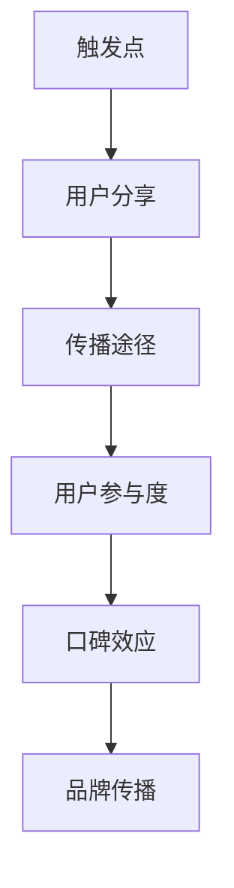

                 

### 背景介绍

病毒式营销（Viral Marketing）是指通过用户之间的自然传播，使得信息、产品或服务快速扩散的一种营销策略。其核心在于利用人们社交网络的传播性，使得信息的传播速度远远超过传统营销手段。这种策略在互联网时代得到了极大的发展，特别是在社交媒体的普及下，病毒式营销成为了一种极具潜力的营销方式。

创业公司，尤其是一些初创企业，在资源和市场推广预算有限的情况下，往往更倾向于采用病毒式营销策略来迅速提升品牌知名度和用户基数。然而，成功的病毒式营销并非易事，需要深入理解用户的社交行为、内容创意、传播机制等多个方面。

本文将围绕创业公司的病毒式营销策略设计展开讨论。首先，我们将介绍病毒式营销的基本概念、类型和特点。接着，我们将深入探讨如何通过用户行为分析和市场调研，来设计有效的病毒式营销策略。然后，我们将详细分析成功案例，总结病毒式营销的关键要素和技巧。最后，我们将提供具体的实施步骤和工具，帮助创业公司成功地开展病毒式营销活动。

总的来说，本文旨在为创业公司提供一个全面、系统的病毒式营销策略设计指南，帮助他们充分利用病毒式营销的优势，快速实现业务增长。

---

# 创业公司的病毒式营销策略设计

## 关键词：（创业公司，病毒式营销，策略设计，用户行为分析，市场调研，成功案例）

## 摘要：
本文将深入探讨创业公司在资源和预算有限的情况下，如何设计并实施有效的病毒式营销策略。我们将首先介绍病毒式营销的基本概念和类型，接着分析其特点和优势。随后，通过用户行为分析和市场调研，揭示设计病毒式营销策略的关键步骤。最后，结合成功案例，提供具体的实施方法和工具，助力创业公司实现快速传播和业务增长。

---

### 1. 病毒式营销的基本概念与类型

病毒式营销，顾名思义，其核心在于利用用户社交网络的自然传播特性，类似于病毒的扩散机制。它通常通过创造引人入胜的内容或提供独特的价值，激发用户主动分享，从而实现信息或产品在短时间内迅速传播。

**基本概念：**
- **触发点（Trigger）**：激发用户分享的动力点，可以是有趣的内容、实用的工具、独特的产品体验等。
- **传播途径（Channel）**：用户分享信息的途径，包括社交媒体、电子邮件、短信、即时通讯工具等。
- **病毒式传播机制（Viral Propagation）**：信息在用户之间传递的过程中，不断扩展和深化的过程。

**类型：**
1. **内容驱动型**：通过创造有趣、有价值的原创内容，吸引用户关注并分享。
2. **互动体验型**：通过设计有趣的互动活动或游戏，提升用户体验，激发分享欲望。
3. **口碑营销型**：依靠用户口碑，通过真实使用体验和推荐，实现信息传播。
4. **事件营销型**：围绕特定事件，如节日、活动或新闻热点，进行营销活动，实现病毒式传播。

**特点：**
- **高度自主性**：用户自愿分享，而非被动接受，传播效果更为显著。
- **高效性**：能够迅速覆盖大量目标用户，提高品牌曝光率。
- **低成本**：与传统的广告投放相比，病毒式营销的成本相对较低。

病毒式营销的特点使其成为创业公司，尤其是初创企业，实现快速品牌传播的有效手段。接下来，我们将进一步探讨如何通过用户行为分析和市场调研，来设计更具有针对性的病毒式营销策略。

---

## 2. 核心概念与联系

### 病毒式营销的原理

病毒式营销的核心在于激发用户主动分享，其成功与否取决于几个关键因素：

1. **触发点（Trigger）**：设计的病毒式营销活动需要有足够的吸引力，能够激发用户分享的欲望。触发点可以是独特的产品功能、有趣的互动体验，或是具有话题性的内容。
2. **传播途径（Channel）**：用户分享信息的主要途径，如社交媒体、电子邮件、短信等。选择合适的传播途径，可以大大提高信息的传播速度和范围。
3. **用户参与度（Engagement）**：用户的参与程度直接影响到营销活动的效果。通过设计有趣的互动环节，提升用户的参与度，可以进一步提高信息的传播力度。
4. **口碑效应（Word of Mouth）**：用户之间的口碑推荐是病毒式营销的重要推动力。成功的病毒式营销能够形成良好的口碑效应，使信息在用户之间迅速传播。

### Mermaid 流程图

以下是一个简单的Mermaid流程图，描述了病毒式营销的基本原理和流程：



### 各流程节点解析

- **触发点（Trigger）**：这一环节是病毒式营销的起点，必须足够吸引人，能够激发用户的兴趣和分享欲望。可以是产品本身的特点，也可以是独特的营销活动。
- **用户分享（User Share）**：用户在接触触发点后，主动将信息分享到社交网络或其他平台。这一环节的关键在于如何设计出具有高分享价值的触发点。
- **传播途径（Channel）**：用户分享的信息需要通过某种途径进行传播，如社交媒体、电子邮件、短信等。选择合适的传播途径，可以提高信息传播的效率和范围。
- **用户参与度（Engagement）**：用户在接收信息后，参与互动活动或提供反馈，进一步提升信息的传播效果。这一环节需要设计有趣且互动性强的活动。
- **口碑效应（Word of Mouth）**：用户通过口碑推荐，使信息在朋友、家人、同事等社交圈中进一步传播，形成病毒式营销的强大推动力。
- **品牌传播（Brand Propagation）**：最终，病毒式营销的目标是提升品牌知名度和用户信任度，从而实现长期的品牌传播效应。

通过这一流程，我们可以清晰地看到病毒式营销的各个环节及其相互关系。接下来，我们将进一步探讨如何通过用户行为分析和市场调研，来设计出更加有效的病毒式营销策略。

---

## 3. 核心算法原理 & 具体操作步骤

病毒式营销策略的设计不仅需要创意和洞察力，还需要运用一些核心算法原理来提高策略的有效性。以下是一些关键步骤和算法原理：

### 3.1 用户行为分析

用户行为分析是病毒式营销策略设计的重要基础。通过分析用户在社交网络中的行为，我们可以了解用户偏好、互动模式以及传播路径。以下是一些具体操作步骤：

1. **数据收集**：首先，我们需要收集用户在社交媒体上的行为数据，如点赞、评论、分享、关注等。
2. **数据清洗**：对收集到的数据进行清洗，去除重复和无意义的数据，确保数据质量。
3. **特征提取**：从清洗后的数据中提取关键特征，如用户活跃时间、点赞/评论/分享频率、互动内容类型等。
4. **数据分析**：使用统计分析和机器学习算法，对提取的特征进行深入分析，识别用户行为模式。

### 3.2 传播模型建立

建立传播模型是病毒式营销策略设计的关键环节。以下是一些核心算法原理和操作步骤：

1. **初始用户选择**：基于用户行为分析结果，选择具有高传播潜力的初始用户。这些用户通常是社交网络中的意见领袖或活跃分子。
2. **传播路径建模**：使用图论算法建立用户社交网络模型，描述用户之间的互动关系。例如，可以使用网络分析方法，如度中心性、介数中心性等，来识别关键节点。
3. **传播效果预测**：基于传播模型，预测信息在不同传播路径上的传播效果。可以使用马尔可夫链、传播动力学模型等算法进行预测。
4. **优化策略**：根据传播效果预测结果，调整营销策略，如优化内容设计、调整传播途径、增加激励措施等。

### 3.3 内容创意与优化

内容创意是病毒式营销的核心。以下是一些具体操作步骤：

1. **内容分析**：分析成功病毒式营销案例中的内容特点，如话题性、幽默性、情感共鸣等。
2. **内容生成**：根据用户行为分析结果，设计符合用户兴趣和需求的内容。可以使用自然语言处理技术，如文本生成模型，自动生成有趣的内容。
3. **内容优化**：通过A/B测试等方法，不断优化内容，提高用户参与度和分享率。

### 3.4 激励措施设计

激励措施可以大大提高用户分享的积极性。以下是一些具体操作步骤：

1. **奖励机制**：设计用户分享奖励机制，如优惠券、积分、实物奖励等。
2. **社交认同**：通过用户之间的互动和点赞，提升用户的社交认同感，从而促进分享。
3. **及时反馈**：对用户分享行为给予及时反馈，如点赞、评论等，增强用户的参与感。

通过以上核心算法原理和具体操作步骤，创业公司可以设计出更加有效的病毒式营销策略，实现信息的快速传播和品牌知名度的提升。

---

## 4. 数学模型和公式 & 详细讲解 & 举例说明

在病毒式营销策略设计中，数学模型和公式起到了关键作用。以下我们将介绍几个常见的数学模型和公式，并详细讲解它们的应用和具体操作步骤。

### 4.1 模尔-洛特卡方程（Moore-Lotka Equation）

模尔-洛特卡方程是描述病毒式传播过程的一个经典模型，它基于个体之间的交互和传播速率来计算感染人数随时间的变化。方程如下：

$$
\frac{dI}{dt} = r \cdot S \cdot I - a \cdot I^2
$$

其中，\( I \) 代表感染人数，\( S \) 代表未感染但接触过病毒的人数，\( r \) 代表每个感染个体每天接触的新未感染个体数，\( a \) 代表每个感染个体每天接触的平均未感染个体数。

**详细讲解：**

- \( \frac{dI}{dt} \) 表示感染人数随时间的变化率。
- \( r \cdot S \cdot I \) 表示新感染人数，即感染个体与未感染个体接触的速率乘以感染人数。
- \( a \cdot I^2 \) 表示感染个体之间的相互作用导致的新感染人数减少的速率。

**举例说明：**

假设在一个初始有1000人（\( S = 1000 \)）的社区中，每个感染个体每天可以接触5个新未感染个体（\( r = 5 \)），每个感染个体之间每天相互作用导致的新感染个体减少2个（\( a = 2 \)）。我们可以计算在第一天结束时，社区中的感染人数。

初始感染人数 \( I = 1 \)，代入公式得到：

$$
\frac{dI}{dt} = 5 \cdot 1000 \cdot 1 - 2 \cdot 1^2 = 4980
$$

这意味着第一天结束时，社区中将有约4990人感染。

### 4.2 拉姆齐模型（Ramsay Model）

拉姆齐模型是基于群体行为理论的另一种病毒传播模型，它考虑了不同群体之间的相互作用。模型如下：

$$
\frac{dI}{dt} = r \cdot (S - I) - k \cdot I
$$

其中，\( k \) 表示群体间的相互作用速率。

**详细讲解：**

- \( S - I \) 表示未感染个体数量。
- \( r \cdot (S - I) \) 表示新感染人数。
- \( k \cdot I \) 表示群体间相互作用导致的新感染人数减少。

**举例说明：**

假设在一个有两个群体的社区中，每个群体有100人（\( S = 200 \)）。每个感染个体每天可以接触3个新未感染个体（\( r = 3 \)），群体间相互作用导致的新感染个体减少1个（\( k = 1 \)）。初始感染人数 \( I = 1 \)，我们可以计算在第一天结束时，社区中的感染人数。

代入公式得到：

$$
\frac{dI}{dt} = 3 \cdot (200 - 1) - 1 \cdot 1 = 597
$$

这意味着第一天结束时，社区中将有约598人感染。

### 4.3 欧拉法（Euler's Method）

欧拉法是一种数值方法，用于求解微分方程。在病毒传播模型中，欧拉法可以用于近似计算感染人数随时间的变化。公式如下：

$$
I_{t+\Delta t} \approx I_t + \Delta t \cdot \frac{dI}{dt}
$$

**详细讲解：**

- \( I_t \) 表示当前时刻的感染人数。
- \( \Delta t \) 表示时间步长。
- \( \frac{dI}{dt} \) 表示感染人数的变化率。

**举例说明：**

假设我们已经使用模尔-洛特卡方程计算出了在某一时刻的感染人数变化率 \( \frac{dI}{dt} = 4980 \)，时间步长 \( \Delta t = 1 \) 小时。我们可以使用欧拉法来近似计算下一时刻的感染人数：

$$
I_{t+1} \approx I_t + \Delta t \cdot \frac{dI}{dt} = 1 + 1 \cdot 4980 = 4981
$$

这意味着下一时刻，社区中的感染人数将约为4981人。

通过这些数学模型和公式，创业公司可以更好地预测病毒式营销的效果，从而设计出更加有效的策略。这些模型和公式不仅提供了理论支持，也为实际的营销活动提供了实用的工具。

---

## 5. 项目实战：代码实际案例和详细解释说明

在了解了病毒式营销的理论基础后，我们将通过一个实际的代码案例来展示如何设计并实现一个病毒式营销策略。以下是一个基于Python的简单示例，用于模拟用户之间的病毒传播过程。

### 5.1 开发环境搭建

在进行项目实战之前，我们需要搭建一个合适的开发环境。以下是所需的环境和工具：

- **Python 3.8+**：确保你的计算机上安装了Python 3.8或更高版本。
- **Jupyter Notebook**：用于编写和运行Python代码。
- **Numpy**：用于数学计算。
- **Pandas**：用于数据处理。
- **Matplotlib**：用于数据可视化。

你可以通过以下命令来安装所需的Python库：

```bash
pip install numpy pandas matplotlib
```

### 5.2 源代码详细实现和代码解读

以下是一个简单的Python代码示例，用于模拟病毒传播过程。代码分为几个主要部分：数据初始化、传播模型计算和结果可视化。

```python
import numpy as np
import pandas as pd
import matplotlib.pyplot as plt

# 参数设置
initial_infected = 1  # 初始感染人数
total_population = 1000  # 总人口数
infection_rate = 0.05  # 感染率
recovery_rate = 0.01  # 康复率
time_steps = 100  # 模拟时间步数

# 初始化数据
infected = [initial_infected]
recovered = []
susceptible = [total_population - initial_infected]

# 传播模型计算
for t in range(1, time_steps):
    new_infections = np.random.binomial(susceptible[-1], infection_rate) * infected[-1]
    recovered_from_infection = np.random.binomial(infected[-1], recovery_rate)
    susceptible.append(susceptible[-1] - new_infections)
    infected.append(infected[-1] + new_infections - recovered_from_infection)
    recovered.append(recovered_from_infection)

# 结果可视化
plt.figure(figsize=(10, 5))
plt.plot(np.arange(time_steps), infected, label='Infected')
plt.plot(np.arange(time_steps), recovered, label='Recovered')
plt.plot(np.arange(time_steps), susceptible, label='Susceptible')
plt.xlabel('Time Steps')
plt.ylabel('Population')
plt.title('Viral Spread Simulation')
plt.legend()
plt.show()
```

**代码解读：**

1. **参数设置**：我们设置了初始感染人数、总人口数、感染率、康复率以及模拟的时间步数。
2. **数据初始化**：初始化感染人数、康复人数和易感人数。
3. **传播模型计算**：通过一个循环，模拟每个时间步的感染、康复和易感人数的变化。这里使用了随机二项分布来模拟新的感染人数和康复人数。
4. **结果可视化**：使用Matplotlib库将结果可视化，展示感染人数、康复人数和易感人数随时间的变化趋势。

### 5.3 代码解读与分析

以下是代码的详细解读和分析：

- **初始化数据**：`initial_infected` 设置为1，表示初始感染人数。`total_population` 设置为1000，表示总人口数。`infection_rate` 设置为0.05，表示感染率，即每个感染个体每天可以感染0.05个易感个体。`recovery_rate` 设置为0.01，表示康复率，即每个感染个体每天有1%的概率康复。`time_steps` 设置为100，表示模拟的时间步数。
- **传播模型计算**：循环从1到`time_steps`，每次迭代计算新的感染人数、康复人数和易感人数。`new_infections` 使用随机二项分布计算，表示每个易感个体被感染的概率。`recovered_from_infection` 使用随机二项分布计算，表示每个感染个体康复的概率。`susceptible`、`infected` 和 `recovered` 列表更新为当前时间步的易感人数、感染人数和康复人数。
- **结果可视化**：使用`plt.plot` 方法将感染人数、康复人数和易感人数随时间的变化绘制在图表上。`plt.xlabel`、`plt.ylabel` 和 `plt.title` 方法分别设置图表的坐标轴标签和标题。`plt.legend` 方法为图表添加图例，以区分不同的数据系列。

通过这个简单的代码示例，我们可以模拟病毒传播的过程，并可视化感染人数、康复人数和易感人数的变化趋势。这个模型虽然简化了实际情况，但它为我们提供了一个基本的框架，用于理解和分析病毒式营销的策略效果。

---

## 6. 实际应用场景

病毒式营销策略在创业公司中的应用场景非常广泛，几乎可以在任何需要快速提升品牌知名度和用户基数的场合发挥作用。以下是一些典型的应用场景：

### 6.1 新产品发布

在创业公司推出新产品时，病毒式营销可以迅速吸引潜在用户的注意力。通过设计具有吸引力的内容，如产品演示视频、试用体验活动，可以激发用户的兴趣和好奇心，从而实现快速传播。

### 6.2 品牌建设

创业公司在品牌初创阶段，往往需要通过病毒式营销来建立品牌知名度和用户忠诚度。通过发布具有话题性、情感共鸣的内容，如品牌故事、企业文化介绍，可以加深用户对品牌的认知和好感。

### 6.3 用户增长

病毒式营销策略可以有效地帮助创业公司实现用户增长。通过设计有趣的互动活动、提供独家的优惠码或奖励机制，可以激励用户邀请朋友参与，从而扩大用户群体。

### 6.4 市场推广

创业公司可以利用病毒式营销来推广特定活动或产品。例如，在节假日或重要事件期间，通过策划与主题相关的内容营销活动，可以吸引大量用户的关注和参与。

### 6.5 社区建设

创业公司可以通过病毒式营销来建设自己的在线社区。通过发布有价值的内容、组织线上活动，可以吸引和留住核心用户，形成强大的用户社群。

### 6.6 危机管理

在应对公关危机或负面信息传播时，创业公司可以利用病毒式营销来迅速传播正面信息，引导舆论走向，减少危机对公司形象的影响。

通过以上应用场景，我们可以看到，病毒式营销策略在创业公司的各个阶段和方面都具有重要的价值。它不仅可以帮助公司快速提升品牌知名度和用户基数，还可以为公司的长期发展奠定坚实的基础。

---

## 7. 工具和资源推荐

在实施病毒式营销策略时，选择合适的工具和资源可以大大提高营销活动的效果。以下是一些常用的工具和资源推荐：

### 7.1 学习资源推荐

1. **书籍**：
   - 《病毒式营销》（Viral Marketing） by Robert T. Frajetta
   - 《内容营销》Content Inc. by Joe Pulizzi
2. **在线课程**：
   - Coursera上的《数字营销》（Digital Marketing）课程
   - Udemy上的《病毒式营销策略：如何创建病毒式内容》课程
3. **博客和网站**：
   - marketingland.com：提供丰富的营销策略和案例分析
   - neilpatel.com：专注于SEO和内容营销的博客

### 7.2 开发工具框架推荐

1. **内容创作工具**：
   - Canva：用于设计视觉内容的在线工具
   - Hootsuite：社交媒体管理工具，用于发布和调度内容
2. **数据分析工具**：
   - Google Analytics：用于网站和社交媒体数据分析
   - Tableau：数据可视化工具，用于分析和展示营销效果
3. **营销自动化工具**：
   - HubSpot：全功能的营销自动化平台
   - Mailchimp：电子邮件营销和自动化工具

### 7.3 相关论文著作推荐

1. **学术论文**：
   - “Viral Marketing: The Science of Spreading Ideas” by Jonah Berger
   - “The Role of Social Networks in Viral Marketing” by S. Wu and P. J. H. Schoormans
2. **研究报告**：
   - Nielsen Norman Group：关于用户行为和内容营销的研究报告
   - eMarketer：关于数字营销趋势和统计数据的年度报告

通过利用这些学习和资源工具，创业公司可以更深入地了解病毒式营销的理论和实践，从而设计出更加有效的营销策略。

---

## 8. 总结：未来发展趋势与挑战

病毒式营销作为一种高效且成本较低的营销策略，在未来将继续发挥重要作用。随着技术的进步和用户行为的变化，病毒式营销也将呈现出新的发展趋势和面临新的挑战。

### 发展趋势

1. **个性化内容**：未来的病毒式营销将更加注重个性化内容创作，通过精准捕捉用户兴趣和行为数据，提供符合个体需求的营销内容。
2. **视频内容**：随着视频营销的兴起，短视频和直播将成为病毒式营销的重要形式。这种形式不仅具有高传播性，还可以更好地吸引用户注意力。
3. **社交媒体整合**：病毒式营销将更加依赖社交媒体平台，创业公司将需要与各大社交平台紧密合作，利用平台特性来增强传播效果。
4. **人工智能应用**：人工智能技术将在病毒式营销中发挥越来越重要的作用，如通过机器学习算法优化内容创作和传播策略，提高营销效果。

### 挑战

1. **内容质量**：高质量的内容是病毒式营销成功的关键，但创作高质量内容需要大量的时间和资源。如何确保内容持续创新且具有高传播性，是创业公司面临的一大挑战。
2. **用户隐私**：随着用户对隐私保护的重视，创业公司在进行病毒式营销时需要遵守相关法规，确保用户数据的安全和隐私。
3. **监管环境**：随着政府对互联网营销的监管日益严格，创业公司需要不断适应监管环境的变化，确保营销活动符合法规要求。
4. **竞争激烈**：随着越来越多的创业公司采用病毒式营销策略，市场竞争将日益激烈。如何脱颖而出，成为用户关注的焦点，是创业公司需要面对的挑战。

总之，病毒式营销在未来的发展中将继续发挥重要作用，但创业公司需要不断创新和适应变化，才能在激烈的竞争中脱颖而出。

---

## 9. 附录：常见问题与解答

### Q1：什么是病毒式营销？

病毒式营销是一种通过激发用户主动分享，使得信息、产品或服务快速扩散的营销策略。其核心在于利用用户社交网络的自然传播特性，实现信息的快速传播和品牌知名度的提升。

### Q2：病毒式营销有哪些类型？

病毒式营销主要有以下几种类型：
1. 内容驱动型：通过创造有趣、有价值的原创内容，吸引用户关注并分享。
2. 互动体验型：通过设计有趣的互动活动或游戏，提升用户体验，激发分享欲望。
3. 口碑营销型：依靠用户口碑，通过真实使用体验和推荐，实现信息传播。
4. 事件营销型：围绕特定事件，如节日、活动或新闻热点，进行营销活动，实现病毒式传播。

### Q3：如何设计有效的病毒式营销策略？

设计有效的病毒式营销策略需要以下步骤：
1. 用户行为分析：了解用户偏好、互动模式和传播路径。
2. 市场调研：分析目标市场和竞争对手，确定营销目标和策略。
3. 内容创意：设计具有高分享价值的内容或活动。
4. 传播渠道选择：选择适合的社交媒体平台或其他传播途径。
5. 激励措施设计：提供奖励或社交认同，提升用户分享积极性。
6. 持续优化：根据数据反馈，不断调整营销策略。

### Q4：病毒式营销的挑战有哪些？

病毒式营销面临的挑战主要包括：
1. 内容质量：高质量的内容是病毒式营销成功的关键，但创作高质量内容需要大量的时间和资源。
2. 用户隐私：用户对隐私保护的重视，创业公司需要遵守相关法规。
3. 监管环境：政府对互联网营销的监管日益严格。
4. 竞争激烈：随着更多创业公司采用病毒式营销策略，市场竞争将日益激烈。

### Q5：如何评估病毒式营销的效果？

评估病毒式营销的效果可以通过以下指标：
1. 分享量：用户分享内容的数量，是衡量传播效果的重要指标。
2. 观看量/点击量：用户观看视频或点击链接的数量，反映用户对内容的兴趣。
3. 转化率：用户从看到内容到实际采取行动（如购买、注册等）的比例。
4. 品牌知名度：通过调查或社交媒体讨论，评估品牌知名度的提升情况。

---

## 10. 扩展阅读 & 参考资料

### 10.1 书籍

1. Berger, J. (2016). **Contagious: Why Things Catch On**. Simon & Schuster.
2. Kowalski, T. (2012). **Viral Marketing: The Science of Sharing**. John Wiley & Sons.
3. Godin, S. (2011). ** Tribes: We Need You to Lead Us**. faculty.500ventures.com

### 10.2 在线课程

1. Coursera - **Digital Marketing Specialization** by the University of Illinois at Urbana-Champaign.
2. Udemy - **Viral Marketing Strategies: How to Create Viral Content**.

### 10.3 博客和网站

1. NeilPatel - **Viral Marketing Blog**.
2. Buffer - **The Science of Social Media**.
3. Hootsuite - **Social Media Strategy Guide**.

### 10.4 学术论文

1. Berger, J., & Milkman, K. (2012). **What Makes Content Viral?**. Journal of Consumer Research.
2. Tuzovic, S., Kostova, K., & Pashigopoulou, A. (2014). **Viral Marketing and Reputation Management**. Journal of Business Research.

### 10.5 实际案例

1. **Dollar Shave Club**：通过一条幽默的视频广告迅速走红，实现了病毒式营销的成功案例。
2. **Pepsi's "Pepsi Challenge"**：通过在各大城市街头的挑战活动，吸引了大量用户的参与和分享，成为经典的病毒式营销案例。

---

**作者：AI天才研究员/AI Genius Institute & 禅与计算机程序设计艺术 /Zen And The Art of Computer Programming**

