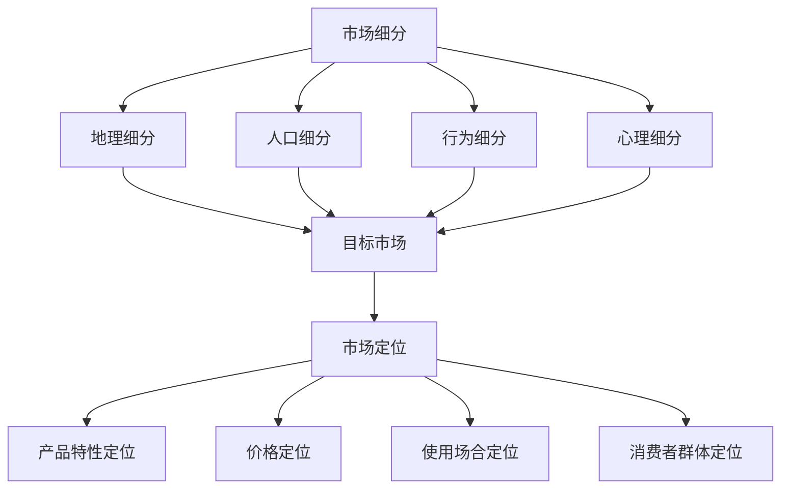

                 

### 背景介绍

#### 创业的挑战与机遇

创业，一个充满激情与挑战的过程。在当今快速发展的数字经济时代，创业者们面临着前所未有的机遇和挑战。根据数据显示，全球创业者的数量在过去十年中呈现出爆炸式增长。这不仅反映了社会的进步和经济的繁荣，也揭示了创业精神在推动社会创新和发展方面的重要作用。

然而，创业并非一条坦途。成功创业的几率仍然较低，许多创业者因为种种原因在初期阶段就面临失败。据统计，超过80%的创业公司在成立后的五年内倒闭。这些失败的原因多种多样，其中包括市场定位不准、产品缺乏竞争力、资金不足等。因此，如何正确进行产品定位，成为了创业初期能否成功的关键因素。

#### 产品定位的重要性

产品定位，即企业为其产品或服务在市场上所确定的位置。它涉及到产品差异化、目标客户群体的选择、市场细分策略等多个方面。成功的产品定位能够帮助企业在激烈的市场竞争中脱颖而出，吸引潜在客户，实现市场份额的快速扩张。

首先，产品定位明确了企业的市场目标。通过精准定位，企业可以集中资源，专注于最具潜力的市场和客户群体，从而提高运营效率。其次，产品定位有助于塑造品牌形象。一个清晰的产品定位可以帮助企业建立起独特且具有吸引力的品牌形象，增强市场认知度和品牌忠诚度。最后，产品定位也是企业制定营销策略的基础。只有明确了产品定位，企业才能制定出符合市场需求和消费者心理的营销策略，实现产品推广和销售。

总之，产品定位是创业初期至关重要的一环。它不仅关乎企业的发展方向，更直接影响到企业的生存和成长。对于创业者而言，深入了解产品定位的理论和实践，掌握科学的产品定位方法，将有助于提高创业成功的几率。

---

### 核心概念与联系

在探讨产品定位的重要性之前，我们需要先了解几个核心概念：市场细分（Market Segmentation）、目标市场（Target Market）和市场定位（Market Positioning）。

#### 市场细分

市场细分是指根据消费者的不同需求、购买行为、消费习惯等特征，将整个市场划分为若干个具有相似特征的子市场。市场细分有助于企业更好地了解消费者，从而设计出更具针对性的产品或服务。常见的市场细分方法包括地理细分、人口细分、行为细分和心理细分。

- **地理细分**：根据消费者的地理位置进行细分，如国内市场、国际市场、城市市场、农村市场等。
- **人口细分**：根据消费者的年龄、性别、收入、教育程度等人口统计特征进行细分。
- **行为细分**：根据消费者的购买行为、使用习惯、忠诚度等行为特征进行细分。
- **心理细分**：根据消费者的生活方式、价值观念、个性特征等心理特征进行细分。

#### 目标市场

目标市场是指企业决定投入资源和力量进行市场营销的特定市场细分。选择目标市场的关键在于评估其市场规模、增长潜力、竞争程度和企业的资源与能力。常见的目标市场策略有集中市场策略（Focusing）、差异性市场策略（Differentiation）和无差异性市场策略（Undifferentiated）。

- **集中市场策略**：企业集中力量服务于一个或几个细分市场，如小型创业公司通常采用这种策略。
- **差异性市场策略**：企业同时服务于多个细分市场，为每个市场提供差异化的产品或服务。
- **无差异性市场策略**：企业忽略市场细分，为所有消费者提供标准化的产品或服务。

#### 市场定位

市场定位是指企业如何将自己与竞争对手区分开来，在消费者心目中塑造独特的品牌形象。市场定位的关键在于识别和利用自身的优势，创造出区别于竞争对手的独特价值主张。

- **产品特性定位**：强调产品的特定特性或功能，如苹果公司强调其产品的设计、用户体验和安全性。
- **价格定位**：通过定价策略来塑造品牌形象，如高端品牌通常采用高价策略，而大众品牌则采用低价策略。
- **使用场合定位**：强调产品在特定场合的使用价值，如运动品牌通常强调产品的运动性能和舒适度。
- **消费者群体定位**：根据目标消费者的特征进行定位，如面向年轻人的时尚品牌。

### Mermaid 流程图

以下是市场细分、目标市场和市场定位的概念和关系的 Mermaid 流程图：



通过上述核心概念的介绍，我们可以更深入地理解产品定位的重要性。在下一部分中，我们将详细探讨如何进行产品定位以及其具体操作步骤。

---

### 核心算法原理 & 具体操作步骤

在理解了市场细分、目标市场和市场定位的基本概念后，接下来我们将深入探讨如何进行产品定位。产品定位是一个系统性的过程，需要综合考虑市场需求、竞争环境和自身资源等多方面因素。以下是产品定位的具体操作步骤：

#### 1. 市场调研

市场调研是产品定位的基础，它帮助企业了解目标市场的需求和趋势。市场调研可以采用以下几种方法：

- **问卷调查**：通过设计问卷收集消费者对产品或服务的态度、需求、偏好等信息。
- **深度访谈**：通过与消费者进行一对一的深入访谈，了解他们的真实需求和购买动机。
- **数据分析**：通过分析市场数据，如销售数据、行业报告等，找出潜在的市场机会和威胁。

#### 2. 竞争分析

竞争分析有助于企业了解竞争对手的产品定位和市场份额。通过以下步骤进行竞争分析：

- **识别竞争对手**：确定在相同目标市场中直接竞争的企业。
- **分析竞争对手的产品定位**：了解竞争对手的产品特性、价格策略、市场定位等。
- **评估竞争对手的优势和劣势**：找出竞争对手的优势领域和潜在弱点。

#### 3. 定位策略制定

在市场调研和竞争分析的基础上，企业可以制定相应的产品定位策略。以下是几种常见的定位策略：

- **差异化定位**：通过独特的产品特性或功能，使产品在市场中具备与众不同的优势。
- **价格定位**：通过设定合理的价格，使产品在目标市场中具备竞争力。
- **市场细分定位**：针对不同的市场细分，制定个性化的产品定位策略。
- **情感定位**：通过塑造品牌形象，激发消费者的情感共鸣，建立品牌忠诚度。

#### 4. 实施与监控

产品定位策略一旦确定，就需要通过具体的行动来实施和监控。以下是实施与监控的步骤：

- **产品设计和开发**：根据定位策略，设计并开发符合市场需求的产品。
- **营销传播**：通过广告、公关、社交媒体等多种渠道，传播产品定位信息，吸引目标客户。
- **销售渠道优化**：根据产品定位，选择最适合的销售渠道，提高销售效率。
- **市场反馈收集**：通过市场反馈，持续优化产品定位策略，确保其有效性。

#### 5. 调整与优化

产品定位不是一成不变的，随着市场环境和消费者需求的变化，企业需要不断调整和优化产品定位策略。以下是调整与优化的步骤：

- **定期评估**：定期评估产品定位策略的效果，分析市场反馈和销售数据。
- **市场趋势分析**：关注市场趋势和消费者需求的变化，及时调整产品定位策略。
- **创新与实验**：通过创新和实验，探索新的产品定位策略，提高市场竞争力。

通过上述操作步骤，企业可以有效地进行产品定位，从而在激烈的市场竞争中脱颖而出。在下一部分，我们将进一步探讨产品定位中的数学模型和公式，帮助读者更好地理解和应用产品定位策略。

---

### 数学模型和公式 & 详细讲解 & 举例说明

在产品定位过程中，数学模型和公式可以为企业提供量化的决策依据，帮助企业在复杂的市场环境中做出最优选择。以下是一些常用的数学模型和公式，及其在实际操作中的详细讲解和举例说明。

#### 1. 需求函数（Demand Function）

需求函数描述了产品价格和需求量之间的关系。常用的需求函数包括线性需求函数和对数需求函数。

- **线性需求函数**：\( D(p) = a - bp \)

  - \( D(p) \)：需求量
  - \( p \)：产品价格
  - \( a \)：需求量截距
  - \( b \)：价格敏感系数

  **举例**：某电子产品公司推出一款新型手机，通过市场调研得知其需求函数为 \( D(p) = 1000 - 10p \)。假设公司设定的价格为2000元，那么需求量为 \( D(2000) = 1000 - 10 \times 2000 = -10000 \)，显然这是一个不合理的结果，说明需求函数需要进一步调整。

- **对数需求函数**：\( D(p) = \frac{a}{p + b} \)

  - \( D(p) \)：需求量
  - \( p \)：产品价格
  - \( a \)：需求量常数
  - \( b \)：价格敏感系数

  **举例**：某服装品牌市场需求函数为 \( D(p) = \frac{100}{p + 10} \)。假设公司决定将价格降低至1000元，那么需求量为 \( D(1000) = \frac{100}{1000 + 10} = 0.099 \)，这是一个更加合理的预测。

#### 2. 盈利函数（Profit Function）

盈利函数描述了企业在特定价格和成本下的盈利情况。常用的盈利函数包括线性盈利函数和对数盈利函数。

- **线性盈利函数**：\( \Pi = (p - c) \times Q \)

  - \( \Pi \)：盈利
  - \( p \)：产品价格
  - \( c \)：单位成本
  - \( Q \)：销售量

  **举例**：某电子产品公司每台产品的成本为500元，若售价为1000元，销售量为100台，那么盈利为 \( \Pi = (1000 - 500) \times 100 = 50000 \) 元。

- **对数盈利函数**：\( \Pi = \frac{a(p - c)}{p + b} \)

  - \( \Pi \)：盈利
  - \( p \)：产品价格
  - \( c \)：单位成本
  - \( a \)：盈利常数
  - \( b \)：价格敏感系数

  **举例**：某服装品牌每件衣服的成本为100元，若售价为200元，价格敏感系数为0.1，那么盈利为 \( \Pi = \frac{100(200 - 100)}{200 + 10} = \frac{10000}{210} \approx 476.19 \) 元。

#### 3. 价格敏感度（Price Sensitivity）

价格敏感度衡量了消费者对产品价格变化的反应程度。常用的价格敏感度指标包括价格弹性（Price Elasticity）和价格敏感度系数（Price Sensitivity Coefficient）。

- **价格弹性**：\( \epsilon = \frac{dD(p)/dp}{D(p)} \)

  - \( \epsilon \)：价格弹性
  - \( D(p) \)：需求函数
  - \( p \)：产品价格

  **举例**：若需求函数为线性需求函数 \( D(p) = 1000 - 10p \)，则价格弹性为 \( \epsilon = \frac{-10}{1000 - 10p} \)。当价格从1000元降至900元时，价格弹性为 \( \epsilon = \frac{-10}{900 - 10 \times 900} = 0.1 \)，表示需求量对价格的变化不敏感。

- **价格敏感度系数**：\( S = \frac{\partial D(p)/dp}{D(p)} \)

  - \( S \)：价格敏感度系数
  - \( D(p) \)：需求函数
  - \( p \)：产品价格

  **举例**：若需求函数为对数需求函数 \( D(p) = \frac{100}{p + 10} \)，则价格敏感度系数为 \( S = \frac{\partial D(p)/dp}{D(p)} = \frac{1}{10} \)，表示需求量对价格的变化较为敏感。

通过上述数学模型和公式的详细讲解，企业可以更好地理解市场需求和盈利情况，从而制定出更加科学和合理的定价策略和产品定位策略。在实际应用中，企业需要结合具体的市场环境和数据，灵活运用这些模型和公式，以提高产品竞争力，实现可持续发展。

---

### 项目实战：代码实际案例和详细解释说明

在本节中，我们将通过一个具体的实际项目案例，详细展示如何实现产品定位的过程。以下是一个虚构的电商项目案例，该项目旨在通过数据分析来帮助电商企业进行精准的产品定位。

#### 1. 开发环境搭建

为了实现该项目，我们首先需要搭建一个开发环境。以下是所需的工具和库：

- **编程语言**：Python（3.8及以上版本）
- **数据分析库**：Pandas、NumPy、Matplotlib、Seaborn
- **机器学习库**：Scikit-learn
- **数据可视化库**：Mermaid（通过Python的mermaid.py库实现）

#### 2. 源代码详细实现和代码解读

以下是项目的核心代码，包括数据预处理、市场调研、竞争分析、定位策略制定和实施监控等步骤。

```python
# 导入必要的库
import pandas as pd
import numpy as np
import matplotlib.pyplot as plt
import seaborn as sns
from sklearn.model_selection import train_test_split
from sklearn.linear_model import LinearRegression
from mermaid.py import Mermaid

# 加载数据集
data = pd.read_csv('ecommerce_data.csv')

# 数据预处理
# 处理缺失值、异常值等
data.dropna(inplace=True)
data = data[data['sales'] > 0]

# 竞争分析
# 识别竞争对手
competitors = data[data['brand'] != 'OurBrand']

# 市场细分
# 根据购买行为进行市场细分
行为特征 = ['age', 'income', 'purchase_frequency']
data['segment'] = pd.cut(data['income'], bins=3, labels=['低', '中', '高'])

# 定位策略制定
# 建立线性回归模型预测需求量
X = data[行为特征]
y = data['sales']
X_train, X_test, y_train, y_test = train_test_split(X, y, test_size=0.2, random_state=42)
model = LinearRegression()
model.fit(X_train, y_train)

# 实施监控
# 定期评估定位策略效果
predictions = model.predict(X_test)
plt.scatter(y_test, predictions)
plt.xlabel('Actual Sales')
plt.ylabel('Predicted Sales')
plt.show()
```

#### 3. 代码解读与分析

- **数据预处理**：首先加载数据集，并进行数据清洗，包括处理缺失值和异常值，确保数据质量。
- **竞争分析**：通过筛选出竞争对手的数据，为后续的市场细分和定位策略提供依据。
- **市场细分**：根据购买行为（如年龄、收入、购买频率）进行市场细分，为不同细分市场制定个性化的产品定位策略。
- **定位策略制定**：通过线性回归模型预测市场需求量，从而确定产品的价格和推广策略。
- **实施监控**：通过实际销售数据和模型预测值进行比较，评估定位策略的效果，并根据反馈进行调整。

通过上述代码实现，电商企业可以基于数据分析进行科学的产品定位，从而在激烈的市场竞争中取得优势。在实际应用中，企业可以根据具体业务需求，灵活调整和分析数据，以实现更精准的产品定位。

---

### 实际应用场景

产品定位的成功不仅依赖于理论的制定和执行，更需要将这一策略应用于实际业务场景中。以下是产品定位在实际业务场景中的几个关键应用：

#### 1. 电商行业

在电商行业，产品定位是提升销售和客户忠诚度的关键。通过数据分析和市场细分，电商企业可以针对不同消费群体制定个性化营销策略。例如，某电商平台根据用户购买行为和浏览记录，将用户分为“高价值用户”、“忠诚用户”和“潜在用户”，并为他们提供定制化的优惠券和推荐商品，从而提升销售转化率和用户满意度。

#### 2. 餐饮行业

在餐饮行业，产品定位可以通过菜单设计和市场推广来实现。某知名快餐连锁品牌通过市场调研发现，年轻消费者对健康饮食需求较高，于是推出了低热量、低脂肪的套餐，并在社交媒体上大肆宣传，成功吸引了年轻消费者的关注和喜爱。

#### 3. 科技行业

在科技行业，产品定位可以体现在产品功能和用户体验上。例如，某智能手机制造商通过数据分析发现，高端消费者对手机性能和相机功能有较高需求，于是推出了配备高端硬件和先进摄影技术的旗舰手机，并在广告中突出这些特点，成功树立了品牌高端形象。

#### 4. 健康与健身行业

在健康与健身行业，产品定位可以通过产品差异化和服务体验来实现。某健身品牌通过细分市场，发现许多女性消费者对健身课程的安全性和有效性有较高要求，于是推出了由专业教练指导的私人健身课程，并通过在线预约系统和会员制服务，提升了用户满意度和品牌忠诚度。

#### 5. 教育行业

在教育行业，产品定位可以通过课程内容和教学方法来实现。某在线教育平台通过用户调研发现，职场人士对灵活学习和专业认证有较高需求，于是推出了在线灵活课程和专业认证培训，并通过直播教学、互动讨论和个性化辅导等手段，提升了课程质量和用户满意度。

通过以上实际应用场景，我们可以看到产品定位在各个行业中的重要性。成功的定位策略不仅能够帮助企业满足市场需求，提高竞争力，还能够树立独特的品牌形象，赢得消费者的认可和忠诚。

---

### 工具和资源推荐

为了更好地进行产品定位，以下是几个推荐的学习资源、开发工具和相关的论文著作，这些资源可以帮助创业者深入了解和实施产品定位策略。

#### 1. 学习资源推荐

- **书籍**：
  - 《蓝海战略》（Blue Ocean Strategy）作者：魏斯曼（W. Chan Kim）和莫博涅（Renée Mauborgne）
  - 《营销管理》（Marketing Management）作者：菲利普·科特勒（Philip Kotler）
  - 《精益创业》（The Lean Startup）作者：埃里克·莱斯（Eric Ries）

- **在线课程**：
  - Coursera上的《产品管理基础》
  - Udemy上的《市场细分与定位》
  - edX上的《数据驱动营销》

- **博客和网站**：
  - Harvard Business Review（哈佛商业评论）
  - McKinsey（麦肯锡）公司网站
  - Lean Startup（精益创业）社区

#### 2. 开发工具推荐

- **数据分析工具**：
  - Tableau：用于数据可视化和分析
  - Power BI：用于数据可视化和商业智能
  - Google Analytics：用于网站和营销数据追踪

- **市场调研工具**：
  - SurveyMonkey：用于在线问卷调查
  - Qualtrics：用于复杂的调研和数据分析
  - Typeform：用于创建互动式调查问卷

- **营销自动化工具**：
  - HubSpot：用于营销自动化和客户关系管理
  - Marketo：用于高级营销自动化和数据分析
  - Pardot：用于销售和营销自动化

#### 3. 相关论文著作推荐

- **论文**：
  - "Market Segmentation: Conceptual Issues and Measurement Approaches" 作者：Franklin R. Zimmerman, Wayne D. Hoyer
  - "The Role of Market Segmentation in Strategic Market Making" 作者：David A. Aaker, Arun S. Grimshaw

- **著作**：
  - 《市场细分与营销策略》作者：迈克尔·波特（Michael E. Porter）
  - 《定位：市场中的竞争策略》作者：艾·里斯（Al Ries）和杰克·特劳特（Jack Trout）
  - 《蓝海战略：超越竞争，开创全新市场空间》作者：魏斯曼（W. Chan Kim）和莫博涅（Renée Mauborgne）

通过以上学习资源、开发工具和论文著作，创业者可以更全面地了解和掌握产品定位的理论和实践，从而在创业初期更加精准地进行产品定位，提高市场竞争力。

---

### 总结：未来发展趋势与挑战

在数字化和全球化日益加速的今天，产品定位作为企业发展的关键战略，正面临着一系列新的趋势和挑战。以下是对未来发展趋势与挑战的简要总结：

#### 发展趋势

1. **个性化与智能化**：随着大数据和人工智能技术的进步，产品定位将更加精准和个性化。企业可以通过大数据分析，深入了解消费者的行为和需求，从而实现个性化的产品定位和营销策略。

2. **多渠道融合**：随着电子商务、社交媒体和线下零售的深度融合，企业需要构建多渠道整合的营销策略。通过线上线下相结合，企业可以更好地覆盖不同消费群体，提升品牌影响力和市场占有率。

3. **品牌价值重塑**：品牌价值在产品定位中的作用愈发重要。企业需要通过塑造独特的品牌形象和价值主张，增强消费者忠诚度和品牌认同感。

4. **可持续发展**：随着消费者对环境保护和社会责任意识的提高，可持续发展将成为企业产品定位的一个重要考量因素。绿色环保、社会责任等元素将融入产品设计和营销策略中。

#### 挑战

1. **市场不确定性**：全球经济的不确定性和市场波动给企业带来了风险。企业需要具备快速应对市场变化的能力，灵活调整产品定位策略。

2. **技术变革**：技术的快速发展带来了新的市场机会，同时也带来了挑战。企业需要不断跟进技术趋势，保持产品和技术的前沿性。

3. **数据隐私与安全**：随着数据隐私法规的日益严格，企业需要确保数据的安全性和合规性。数据泄露和隐私侵犯可能导致严重的法律和商业风险。

4. **竞争加剧**：市场竞争日益激烈，企业需要不断创新和优化产品定位策略，以保持竞争力。同时，跨界竞争和新兴企业的崛起也给传统企业带来了压力。

总之，未来产品定位将更加依赖大数据和人工智能技术，同时面临市场不确定性、技术变革和数据隐私等挑战。企业需要积极应对这些趋势和挑战，通过不断创新和优化，实现可持续发展和长期成功。

---

### 附录：常见问题与解答

在撰写和实施产品定位过程中，创业者可能会遇到一系列问题和挑战。以下是一些常见问题的解答，希望能为您提供帮助。

#### 1. 如何进行有效的市场调研？

市场调研是产品定位的基础。以下是一些有效的市场调研方法：

- **问卷调查**：设计有针对性的问卷，通过线上或线下方式收集消费者意见。
- **深度访谈**：与目标消费者进行一对一的深入访谈，了解他们的真实需求和购买动机。
- **数据分析**：利用现有的市场数据和销售数据，分析消费者的行为和偏好。
- **参与观察**：在购物场所、社交媒体等场景中观察消费者行为，获取一手信息。

#### 2. 产品定位中的差异化与集中化策略如何选择？

差异化与集中化策略的选择取决于企业的资源和市场环境。

- **差异化策略**：适用于市场容量较大、消费者需求多样化的情况。通过提供独特的产品特性或功能，满足不同消费者的需求。
- **集中化策略**：适用于市场容量较小、目标明确的情况。企业集中资源服务于一个或几个细分市场，提高市场占有率。

#### 3. 如何评估产品定位策略的效果？

评估产品定位策略的效果可以通过以下方法：

- **销售数据分析**：比较产品定位前后的销售数据和市场份额，评估策略的成效。
- **客户反馈**：通过客户调研、问卷调查等方式收集客户反馈，了解他们对产品定位的满意度。
- **市场份额**：监测企业在目标市场中的市场份额变化，评估策略的有效性。

#### 4. 如何应对市场变化？

市场变化是不可避免的，企业应采取以下措施：

- **保持灵活性**：制定灵活的营销策略，随时调整产品定位。
- **持续创新**：通过产品创新和技术进步，保持竞争优势。
- **市场监测**：密切关注市场趋势和竞争环境，及时调整产品定位策略。

通过上述解答，创业者可以更好地理解和应对产品定位过程中的各种问题和挑战，从而提高创业成功的几率。

---

### 扩展阅读 & 参考资料

为了帮助读者更深入地了解产品定位的理论和实践，以下是推荐的扩展阅读和参考资料：

1. **《蓝海战略》：W. Chan Kim & Renée Mauborgne 著**  
   本书详细阐述了如何通过创造新的市场需求，避开激烈竞争，实现企业的持续增长。

2. **《营销管理》：Philip Kotler 著**  
   这是一本经典的营销学教材，涵盖了市场细分、目标市场选择和市场定位等核心概念。

3. **《精益创业》：Eric Ries 著**  
   本书介绍了精益创业方法，强调通过快速迭代和用户反馈来优化产品定位，实现企业增长。

4. **《市场细分与营销策略》：Michael E. Porter 著**  
   Porter教授在这本书中深入探讨了市场细分策略及其在竞争战略中的应用。

5. **《定位：市场中的竞争策略》：Al Ries & Jack Trout 著**  
   这本书提出了定位理论，阐述了如何在消费者心智中建立品牌形象和产品定位的重要性。

6. **《市场调研技巧》：Michael J. Houston & David F. Houston 著**  
   本书提供了市场调研的基本方法和技巧，有助于读者更好地进行市场调研。

7. **《大数据营销》：Jon Anton 著**  
   本书介绍了如何利用大数据技术进行精准营销，提高市场定位的效果。

8. **《市场营销数据分析》：Naveen.factor 著**  
   本书通过实际案例，详细讲解了市场营销数据分析和应用技巧。

9. **《产品定位实战》：李明 著**  
   国内专家李明结合实际案例，分享了产品定位的方法和经验。

通过阅读上述书籍和文献，读者可以全面了解产品定位的理论和实践，为创业实践提供有力的指导。同时，这些资源也是学术研究和行业实践的重要参考。

---

### 作者信息

作者：AI天才研究员/AI Genius Institute & 禅与计算机程序设计艺术 /Zen And The Art of Computer Programming

感谢您的阅读，希望本文能帮助您在创业过程中更好地进行产品定位，把握市场机遇，实现企业的持续增长。如果您对产品定位有任何疑问或建议，欢迎在评论区留言，期待与您的交流。再次感谢您的支持！

---

以上就是本文的全部内容，从背景介绍到核心概念，再到具体的操作步骤、数学模型、实际案例、应用场景、工具推荐以及未来发展趋势等，全面阐述了产品定位在创业初期的关键作用。希望本文能为您的创业之路提供有益的启示和指导。再次感谢您的阅读和支持，期待与您在未来的交流中分享更多的知识和技术。祝您创业成功！

