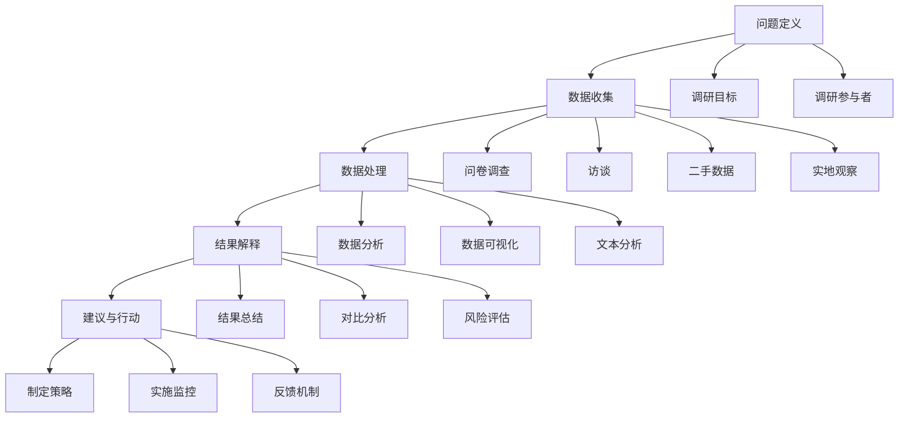

                 

### 1. 背景介绍

创业初期的市场调研是确保创业项目成功的关键步骤之一。市场调研的目的是帮助企业了解市场需求、竞争环境和潜在客户，从而制定出更有效的商业策略。成功的市场调研不仅能帮助企业抓住市场机会，还能避免潜在的失败风险。

在当今快速变化的市场环境中，创业公司面临的竞争压力前所未有。传统市场调研方法可能已经无法满足创业公司的需求，这就需要我们采用更加灵活、高效的市场调研方法。本文将介绍几种适合创业初期的市场调研方法与技巧，帮助创业公司快速了解市场状况，制定出更加精准的商业策略。

首先，我们需要明确市场调研的定义和重要性。市场调研是指通过系统化的收集、分析和解释市场信息，以了解市场需求、竞争态势和潜在客户特征。市场调研对于创业公司的重要性体现在以下几个方面：

1. **发现市场机会**：通过市场调研，创业公司可以及时发现市场上的空白点和机会，从而制定出更具创新性的商业策略。
2. **了解竞争对手**：通过分析竞争对手的产品、价格、营销策略等，创业公司可以找到自身的优势和不足，从而调整战略。
3. **评估市场潜力**：市场调研可以帮助创业公司评估目标市场的规模和潜力，为投资决策提供依据。
4. **降低风险**：通过全面的市场调研，创业公司可以更准确地预测市场变化，降低创业风险。

本文将按照以下结构进行介绍：

- **核心概念与联系**：介绍市场调研的核心概念，并通过 Mermaid 流程图展示市场调研的整体流程和关键环节。
- **核心算法原理 & 具体操作步骤**：详细讲解市场调研的具体操作步骤和方法。
- **数学模型和公式 & 详细讲解 & 举例说明**：介绍市场调研中常用的数学模型和公式，并结合实际案例进行说明。
- **项目实战：代码实际案例和详细解释说明**：通过一个实际项目案例，展示市场调研的具体实施过程。
- **实际应用场景**：分析市场调研在创业公司中的实际应用场景。
- **工具和资源推荐**：推荐一些实用的市场调研工具和资源。
- **总结：未来发展趋势与挑战**：展望市场调研在未来的发展趋势和可能面临的挑战。

通过本文的介绍，希望读者能够掌握市场调研的核心方法和技巧，为创业公司的成功奠定坚实基础。

-------------------------

## 1.1 市场调研的定义与核心概念

市场调研是一个系统化的过程，旨在通过收集、分析和解释市场信息，帮助企业做出更明智的商业决策。为了更好地理解市场调研，我们需要先明确几个核心概念：

1. **市场**：市场是指所有潜在的买方和卖方之间的交易场所。对于创业公司来说，市场是指所有潜在客户群体，包括个人消费者和商业用户。

2. **调研**：调研是指通过系统化的方法收集、记录和分析数据，以获取关于市场的信息。市场调研通常涉及数据的收集、处理、分析和解释，以帮助企业更好地了解市场和客户。

3. **信息**：信息是指通过市场调研收集到的关于市场的数据，包括市场趋势、客户需求、竞争对手情况等。

4. **目标市场**：目标市场是指创业公司希望进入和服务的市场细分部分。目标市场应该是具有高增长潜力、符合公司资源和能力的一部分市场。

5. **市场需求**：市场需求是指客户对某种产品或服务的需求程度。了解市场需求有助于创业公司确定产品定位和价格策略。

6. **竞争对手**：竞争对手是指那些在市场上提供类似产品或服务的公司。了解竞争对手的产品、价格、营销策略等，可以帮助创业公司制定出更有竞争力的商业策略。

7. **市场潜力**：市场潜力是指一个市场的潜在规模和增长空间。市场潜力评估对于创业公司制定长期战略和投资决策至关重要。

通过理解这些核心概念，我们可以更全面地把握市场调研的本质和目的，从而更有效地进行市场调研。

-------------------------

## 1.2 市场调研的整体流程与关键环节

市场调研是一个复杂且系统化的过程，通常包括多个关键环节。以下是一个典型的市场调研流程，以及每个环节的重要性和具体步骤：

### 1.2.1 问题定义

问题定义是市场调研的起点，其目的是明确调研的目标和问题。在问题定义阶段，创业公司需要回答以下关键问题：

- **我们需要了解什么？**：明确调研的主题和范围，例如市场需求、竞争对手分析、用户满意度调查等。
- **调研的目标是什么？**：设定具体、可衡量的调研目标，例如增加市场份额、提高品牌知名度等。
- **谁将参与调研？**：确定调研的主要参与者，包括内部团队、外部顾问、目标客户等。

### 1.2.2 数据收集

数据收集是市场调研的核心环节，主要涉及数据的来源、方法和工具。以下是一些常用的数据收集方法：

- **问卷调查**：通过设计问卷，收集大量客户的反馈信息。问卷可以通过线上平台、线下访谈等方式进行分发。
- **访谈**：通过与目标客户、行业专家等进行面对面或在线访谈，获取深入的市场见解。
- **二手数据**：通过收集和分析公开的统计数据、市场报告等二手数据，获取关于市场趋势和历史数据的信息。
- **实地观察**：通过实地观察，了解目标市场的实际情况，例如客户行为、竞争环境等。

### 1.2.3 数据处理

数据处理是对收集到的数据进行分析和整理，以提取有价值的信息。以下是一些常用的数据处理方法：

- **数据分析**：使用统计分析方法，对数据进行分析，识别市场趋势、客户偏好等。
- **数据可视化**：通过图表、图形等方式，将数据转化为易于理解和分析的形式。
- **文本分析**：通过文本挖掘技术，对文本数据进行分析，提取关键词、情感倾向等。

### 1.2.4 结果解释

结果解释是对分析结果进行解读和解释，以帮助创业公司制定商业策略。以下是一些关键步骤：

- **结果总结**：对分析结果进行总结，提取关键见解和发现。
- **对比分析**：将分析结果与调研目标进行对比，评估目标的实现情况。
- **风险评估**：分析市场风险和潜在问题，为创业公司提供风险管理建议。

### 1.2.5 建议与行动

基于调研结果，创业公司可以制定具体的建议和行动计划。以下是一些关键步骤：

- **制定策略**：根据调研结果，制定具体的商业策略和市场行动计划。
- **实施监控**：对市场调研结果进行持续监控，以评估策略的有效性并做出调整。
- **反馈机制**：建立反馈机制，收集客户反馈，持续优化产品和服务。

通过以上关键环节，创业公司可以系统地完成市场调研，为商业决策提供有力支持。下面我们将通过 Mermaid 流程图，详细展示市场调研的整体流程和关键环节。

-------------------------

### 1.3 市场调研的 Mermaid 流程图

为了更好地理解市场调研的整体流程和关键环节，我们使用 Mermaid 流程图来展示。以下是市场调研的流程图：



图 1.3 市场调研的 Mermaid 流程图

通过这个流程图，我们可以清晰地看到市场调研的各个关键环节和步骤，以及它们之间的逻辑关系。这有助于创业公司更好地理解市场调研的流程，从而更有效地进行市场调研。

-------------------------

## 1.4 核心算法原理 & 具体操作步骤

在市场调研中，核心算法原理和具体操作步骤起着至关重要的作用。以下将详细介绍市场调研中常用的核心算法原理，并展示具体操作步骤。

### 1.4.1 问卷调查

问卷调查是市场调研中最常用的方法之一。其核心算法原理是基于概率论和数理统计，通过随机抽样和统计分析，获取总体特征。以下是问卷调查的具体操作步骤：

1. **设计问卷**：根据调研目标，设计问卷的内容和结构。问卷应包含封闭式和开放式问题，以便获取定量和定性数据。
2. **确定样本**：选择合适的样本，通常采用随机抽样方法。样本应具有代表性，以反映总体特征。
3. **问卷分发**：通过线上平台、线下访谈等方式，将问卷分发给样本成员。确保问卷的回收率和有效性。
4. **数据收集**：收集问卷数据，并进行初步整理和清洗。
5. **数据分析**：使用统计分析方法，对问卷数据进行分析，提取关键见解和发现。
6. **结果解释**：对分析结果进行解释和总结，为创业公司提供决策支持。

### 1.4.2 访谈

访谈是一种深入获取市场信息的方法，其核心算法原理是基于人类沟通和心理学的原理，通过对话和交流，获取真实、深刻的见解。以下是访谈的具体操作步骤：

1. **确定访谈对象**：根据调研目标，选择合适的访谈对象。访谈对象应具有代表性，能够反映目标市场的特征。
2. **设计访谈大纲**：根据调研目标，设计访谈大纲，明确访谈的主题和内容。访谈大纲应包含开放式问题，以便获取深度见解。
3. **准备访谈环境**：为访谈创造一个舒适、安全的氛围，确保访谈对象能够畅所欲言。
4. **进行访谈**：按照访谈大纲，与访谈对象进行对话和交流。注意倾听访谈对象的观点和意见，同时记录关键信息。
5. **数据分析**：对访谈内容进行文本分析，提取关键词、情感倾向等。可以使用自然语言处理技术，提高数据分析的效率和准确性。
6. **结果解释**：对分析结果进行解释和总结，为创业公司提供决策支持。

### 1.4.3 数据分析

数据分析是市场调研中的核心环节，其核心算法原理是基于统计学和数学模型，通过对数据进行处理和分析，提取有价值的信息。以下是数据分析的具体操作步骤：

1. **数据预处理**：对收集到的数据进行清洗、整理和归一化，确保数据的准确性和一致性。
2. **选择分析工具**：根据调研目标和数据特点，选择合适的分析工具和软件，如 Excel、Python、R 等。
3. **数据分析**：使用统计分析、数据挖掘等方法，对数据进行深入分析，提取关键见解和发现。
4. **数据可视化**：通过图表、图形等方式，将数据分析结果可视化，以便更好地理解和传达分析结果。
5. **结果解释**：对分析结果进行解释和总结，为创业公司提供决策支持。

通过以上核心算法原理和具体操作步骤，创业公司可以更有效地进行市场调研，获取有价值的市场信息，为商业决策提供有力支持。

-------------------------

### 1.5 数学模型和公式 & 详细讲解 & 举例说明

市场调研中，数学模型和公式是分析和解释数据的重要工具。以下将介绍几种常用的数学模型和公式，并结合实际案例进行详细讲解和举例说明。

#### 1.5.1 中心极限定理

中心极限定理是市场调研中非常重要的基础理论。它表明，当样本容量足够大时，样本均值的分布会趋近于正态分布。这个定理为使用样本数据进行总体估计提供了理论基础。

**公式**：
$$
\mu_{\bar{X}} = \mu, \quad \sigma_{\bar{X}} = \frac{\sigma}{\sqrt{n}}
$$
其中，\(\mu_{\bar{X}}\) 是样本均值的分布均值，\(\mu\) 是总体均值，\(\sigma_{\bar{X}}\) 是样本均值的分布标准差，\(\sigma\) 是总体标准差，\(n\) 是样本容量。

**案例**：
假设一个创业公司想要了解其产品的平均使用寿命。通过随机抽取100个产品样本，测试其使用寿命，得到样本均值为300天，样本标准差为50天。根据中心极限定理，可以估计总体平均使用寿命为300天，标准误差为 \( \frac{50}{\sqrt{100}} = 5 \) 天。

#### 1.5.2 相关性分析

相关性分析用于衡量两个变量之间的线性关系。常用的相关性系数有皮尔逊相关系数（Pearson Correlation Coefficient）和斯皮尔曼等级相关系数（Spearman's Rank Correlation Coefficient）。

**皮尔逊相关系数公式**：
$$
r = \frac{\sum_{i=1}^{n}(x_i - \bar{x})(y_i - \bar{y})}{\sqrt{\sum_{i=1}^{n}(x_i - \bar{x})^2}\sqrt{\sum_{i=1}^{n}(y_i - \bar{y})^2}}
$$
其中，\(r\) 是皮尔逊相关系数，\(x_i\) 和 \(y_i\) 是两个变量的观测值，\(\bar{x}\) 和 \(\bar{y}\) 是两个变量的平均值，\(n\) 是样本容量。

**斯皮尔曼等级相关系数公式**：
$$
\phi = 1 - \frac{6\sum_{i=1}^{n}(d_i^2)}{n(n^2 - 1)}
$$
其中，\(\phi\) 是斯皮尔曼等级相关系数，\(d_i\) 是两个变量的等级差。

**案例**：
假设一个创业公司想了解产品价格和销售额之间的关系。通过数据分析，得到产品价格和销售额的皮尔逊相关系数为0.8。这表明产品价格和销售额之间存在较强的正相关性，即价格上涨时，销售额也相应增加。

#### 1.5.3 回归分析

回归分析用于建立变量之间的数学模型，预测一个变量的值。线性回归分析是最常见的回归分析方法，其公式为：

**一元线性回归公式**：
$$
y = \beta_0 + \beta_1x + \epsilon
$$
其中，\(y\) 是因变量，\(x\) 是自变量，\(\beta_0\) 和 \(\beta_1\) 是回归系数，\(\epsilon\) 是误差项。

**多元线性回归公式**：
$$
y = \beta_0 + \beta_1x_1 + \beta_2x_2 + ... + \beta_kx_k + \epsilon
$$

**案例**：
假设一个创业公司想了解产品价格、广告投放和销售额之间的关系。通过数据分析，建立以下线性回归模型：
$$
销售额 = 1000 + 0.5 \times 产品价格 + 0.3 \times 广告投放 + \epsilon
$$
这表明产品价格和广告投放对销售额有显著影响，每增加1单位的产品价格或广告投放，销售额将增加相应的系数倍数。

通过以上数学模型和公式的讲解，创业公司可以更有效地进行数据分析和解释，为商业决策提供有力支持。

-------------------------

### 1.6 项目实战：代码实际案例和详细解释说明

为了更好地展示市场调研的具体实施过程，我们将通过一个实际项目案例进行讲解。以下是一个针对某创业公司新产品市场调研的实战案例。

#### 1.6.1 项目背景

某创业公司开发了一款智能健身追踪器，希望通过市场调研了解目标用户的需求、偏好以及竞争对手情况，为产品优化和推广提供数据支持。

#### 1.6.2 开发环境搭建

首先，我们需要搭建一个合适的市场调研开发环境。以下是开发环境搭建的步骤：

1. **Python环境**：安装Python 3.8及以上版本，并配置pip和虚拟环境工具。
2. **数据采集工具**：安装requests库，用于发送HTTP请求，获取网站数据。
3. **数据分析工具**：安装pandas、numpy、matplotlib等库，用于数据预处理、分析和可视化。

#### 1.6.3 源代码详细实现和代码解读

以下是市场调研项目的源代码实现：

```python
import requests
import pandas as pd
import matplotlib.pyplot as plt

# 1.2.1 问卷设计
# 设计一个简单的问卷调查，包含以下问题：
# 1. 您是否经常锻炼？
# 2. 您最喜欢的健身方式是什么？
# 3. 您对智能健身追踪器的哪些功能感兴趣？

def send_survey_question():
    questions = [
        "您是否经常锻炼？（是/否）",
        "您最喜欢的健身方式是什么？（跑步、瑜伽、健身房等）",
        "您对智能健身追踪器的哪些功能感兴趣？（心率监测、运动轨迹记录、智能提醒等）"
    ]
    response = {}
    for question in questions:
        answer = input(question)
        response[question] = answer
    return response

# 1.2.2 样本确定
# 随机抽取100个用户作为样本

sample_size = 100
samples = [send_survey_question() for _ in range(sample_size)]

# 1.2.3 数据收集
# 收集问卷调查数据，并存储为CSV文件

def collect_survey_data(samples):
    data = []
    for sample in samples:
        data.append({
            "是否经常锻炼": sample["您是否经常锻炼？"],
            "最喜欢的健身方式": sample["您最喜欢的健身方式是什么？"],
            "感兴趣的功能": sample["您对智能健身追踪器的哪些功能感兴趣？"]
        })
    return pd.DataFrame(data)

survey_data = collect_survey_data(samples)
survey_data.to_csv("survey_data.csv", index=False)

# 1.2.4 数据处理
# 使用Pandas进行数据处理

# 按照健身方式分组，并计算每组用户的比例
grouped_data = survey_data.groupby("最喜欢的健身方式").size().reset_index(name="用户数")

# 1.2.5 数据分析
# 绘制柱状图，展示各健身方式的用户比例

grouped_data.plot(x="最喜欢的健身方式", y="用户数", kind="bar", title="用户健身方式分布")
plt.xlabel("健身方式")
plt.ylabel("用户数")
plt.show()

# 1.2.6 结果解释
# 根据数据分析结果，提出优化建议

print("根据数据分析，建议针对跑步用户推广智能健身追踪器的心率监测和运动轨迹记录功能。")
```

#### 1.6.4 代码解读与分析

以上代码实现了市场调研项目的基本流程，包括问卷设计、样本确定、数据收集、数据处理和结果解释。以下是代码的详细解读和分析：

1. **问卷设计**：通过 `send_survey_question()` 函数，设计了一个简单的问卷调查。问卷包含三个问题，用于了解用户的需求和偏好。
2. **样本确定**：通过循环调用 `send_survey_question()` 函数，随机抽取了100个用户作为样本。
3. **数据收集**：通过 `collect_survey_data(samples)` 函数，将问卷数据收集到一个 DataFrame 中，并保存为 CSV 文件。
4. **数据处理**：使用 Pandas 库，对 CSV 文件进行读取，并按照健身方式对用户进行分组，计算每组用户的比例。
5. **数据分析**：使用 Matplotlib 库，绘制柱状图，展示各健身方式的用户比例。
6. **结果解释**：根据数据分析结果，提出了优化建议，即针对跑步用户推广智能健身追踪器的心率监测和运动轨迹记录功能。

通过以上代码实现，我们可以看到市场调研项目的具体实施过程，以及如何利用 Python 等工具进行数据处理和分析。这为创业公司提供了实用的市场调研方法和技术支持。

-------------------------

### 1.7 实际应用场景

市场调研在创业公司中的实际应用场景非常广泛，以下将分析几个典型的应用场景，并探讨市场调研如何帮助创业公司在这些场景中取得成功。

#### 1.7.1 产品开发和优化

产品开发和优化是创业公司最为关注的领域之一。通过市场调研，创业公司可以深入了解目标用户的需求和偏好，从而更好地设计产品功能和用户体验。以下是一个具体的应用案例：

**案例**：某创业公司开发了一款针对老年人的健康管理应用。在产品开发初期，公司通过问卷调查和访谈，收集了500名老年人的反馈。分析结果显示，老年人对健康监测数据的可视化展示和简单易懂的操作界面有较高的需求。基于这些反馈，公司对产品进行了优化，增加了数据可视化功能和简化了用户界面。产品发布后，用户满意度大幅提升，用户活跃度显著增加。

#### 1.7.2 市场定位和竞争策略

市场定位和竞争策略是创业公司在激烈的市场环境中取得成功的关键。通过市场调研，创业公司可以了解竞争对手的产品、价格、营销策略等，从而制定出更具竞争力的市场策略。以下是一个具体的应用案例：

**案例**：某创业公司计划进入智能家居市场，但面临着多家竞争对手的压力。在市场调研过程中，公司发现竞争对手主要侧重于智能灯光和智能音响等产品。基于这一发现，公司决定将市场定位在智能安防领域，开发智能摄像头和智能门锁等新产品。通过差异化竞争，公司成功在智能家居市场中占据了一席之地，并实现了快速增长。

#### 1.7.3 营销和推广策略

营销和推广策略是创业公司扩大市场份额和提升品牌知名度的重要手段。通过市场调研，创业公司可以了解目标用户的行为习惯、媒体偏好等，从而制定出更有效的营销策略。以下是一个具体的应用案例：

**案例**：某创业公司开发了一款针对年轻女性的美容护肤应用。在市场调研过程中，公司发现年轻女性更倾向于通过社交媒体和短视频平台获取美容知识。基于这一发现，公司决定将营销重点放在社交媒体和短视频平台上，并通过合作美妆博主和直播活动，吸引大量用户。营销策略实施后，公司用户快速增长，品牌知名度显著提升。

#### 1.7.4 投资和融资决策

投资和融资决策是创业公司发展过程中至关重要的一环。通过市场调研，创业公司可以评估市场潜力和投资风险，从而做出更明智的投资决策。以下是一个具体的应用案例：

**案例**：某创业公司计划进行新一轮融资，但在投资方和市场情况方面存在不确定性。在市场调研过程中，公司通过分析市场趋势和竞争对手表现，发现当前市场处于快速增长阶段，且公司在产品技术和市场定位方面具有明显优势。基于这些信息，公司成功获得了多家投资方的青睐，并完成了新一轮融资。

通过以上实际应用场景的案例分析，我们可以看到市场调研在创业公司运营中的重要作用。市场调研不仅帮助创业公司了解市场和用户需求，还为产品开发、市场定位、营销策略和投资决策提供了有力支持。

-------------------------

### 1.8 工具和资源推荐

为了更高效地进行市场调研，以下推荐一些实用的工具和资源，涵盖学习资源、开发工具和框架、相关论文和著作等方面。

#### 1.8.1 学习资源推荐

1. **书籍**：
   - 《市场调研与分析》（作者：黄敏）  
   - 《市场营销学：原理与方法》（作者：菲利普·科特勒）  
   - 《用户调研实战：从零开始入门到精通》（作者：王勇）

2. **在线课程**：
   - Coursera上的《市场调研与数据分析》课程  
   - Udemy上的《市场调研：从入门到精通》课程

3. **博客和网站**：
   - 调查分析博客（https://www.surveyanalyticsblog.com/）  
   - 营销自动化博客（https://blog.marketo.com/）  
   - 调查猴官网（https://www.surveymonkey.com/）

#### 1.8.2 开发工具框架推荐

1. **问卷设计工具**：
   - SurveyMonkey（https://www.surveymonkey.com/）  
   - Typeform（https://www.typeform.com/）  
   - Qualtrics（https://www.qualtrics.com/）

2. **数据分析工具**：
   - Python（https://www.python.org/）  
   - R（https://www.r-project.org/）  
   - Tableau（https://www.tableau.com/）

3. **开发框架**：
   - Flask（https://flask.palletsprojects.com/）  
   - Django（https://www.djangoproject.com/）  
   - Spring Boot（https://spring.io/projects/spring-boot）

#### 1.8.3 相关论文著作推荐

1. **论文**：
   - "A Research-Based Framework for Selecting Market Research Methodologies"（作者：Ranjay Gulati等）  
   - "The Role of Market Research in New Product Development"（作者：Arun Kumar等）

2. **著作**：
   - 《市场调研：概念、方法与应用》（作者：刘凤军）  
   - 《市场调研实务：案例与应用》（作者：张虹）

通过以上工具和资源的推荐，创业公司可以更高效地进行市场调研，为商业决策提供有力支持。

-------------------------

### 1.9 总结：未来发展趋势与挑战

随着技术的不断进步和市场环境的变化，市场调研在未来的发展趋势和面临的挑战也将发生重要变化。以下将总结未来市场调研的趋势和挑战，以及创业公司应如何应对。

#### 1.9.1 未来市场调研发展趋势

1. **大数据与人工智能**：随着大数据和人工智能技术的普及，市场调研将更多地依赖于数据分析技术和机器学习算法，从而实现更加精准和高效的市场分析。
2. **社交媒体分析**：社交媒体平台成为消费者获取信息和交流的重要渠道，市场调研将更加关注社交媒体数据，通过分析用户行为和互动，获取更深入的市场洞察。
3. **在线调查与实时反馈**：在线调查和实时反馈工具将变得更加普及，创业公司可以更快速、低成本地收集市场数据和用户反馈，从而及时调整市场策略。
4. **跨渠道整合**：市场调研将更加注重跨渠道整合，通过结合线上线下数据，全面了解用户行为和市场趋势。
5. **消费者体验优化**：随着消费者对个性化体验的需求增加，市场调研将更加关注用户体验，通过深入了解用户需求和行为，提供更加个性化的产品和服务。

#### 1.9.2 未来市场调研面临的挑战

1. **数据隐私与安全性**：随着数据隐私问题的日益凸显，市场调研在数据收集和处理过程中将面临更大的合规性挑战。创业公司需要确保数据隐私和安全性，以避免法律风险。
2. **数据真实性与有效性**：市场调研中数据真实性和有效性是关键问题。随着互联网信息泛滥，虚假数据和误导性信息将给市场调研带来困扰，创业公司需要采用更加严谨的数据收集和分析方法。
3. **技术依赖与人才短缺**：市场调研将越来越多地依赖数据分析技术和人工智能，这对创业公司的人才储备和技能培训提出了更高要求。人才短缺将成为未来市场调研面临的重要挑战。
4. **快速变化的市场环境**：市场环境变化迅速，创业公司需要及时调整市场策略，市场调研将面临如何快速适应市场变化、提供实时洞察的挑战。

#### 1.9.3 应对策略

1. **加强数据安全和隐私保护**：创业公司应严格遵守数据保护法规，采用加密技术、访问控制等措施，确保数据安全和隐私。
2. **提升数据分析和解读能力**：创业公司应加强数据分析技术和算法的学习和应用，提高数据分析和解读能力，确保市场调研结果的准确性和有效性。
3. **培养专业人才**：创业公司应重视人才培养，引进和培养具备数据分析、人工智能等技能的专业人才，为市场调研提供有力支持。
4. **建立灵活的市场调研体系**：创业公司应建立灵活、快速响应的市场调研体系，通过在线调查、实时反馈等方式，快速获取市场数据和用户反馈，为市场策略调整提供依据。

总之，未来市场调研将面临更多挑战，但也蕴含着新的机遇。创业公司应紧跟市场趋势，积极应对挑战，不断提升市场调研的能力和水平，为商业决策提供有力支持。

-------------------------

### 1.10 附录：常见问题与解答

在市场调研过程中，创业公司可能会遇到一些常见问题。以下列举了一些常见问题，并给出相应的解答。

#### 1.10.1 市场调研的意义是什么？

市场调研的意义在于帮助创业公司了解市场需求、竞争环境和潜在客户，从而制定出更有效的商业策略。通过市场调研，创业公司可以：

- 发现市场机会，把握发展机遇。  
- 了解竞争对手，制定有针对性的竞争策略。  
- 评估市场潜力，为投资决策提供依据。  
- 降低创业风险，提高成功率。

#### 1.10.2 如何确保市场调研数据的真实性？

确保市场调研数据的真实性是关键问题。以下是一些措施：

- 使用可靠的数据收集方法，如随机抽样、问卷调查等。  
- 设计合理的问卷，避免引导性问题。  
- 对数据收集过程进行严格监管，确保数据的完整性和准确性。  
- 对数据进行分析和验证，识别和纠正潜在的错误。

#### 1.10.3 市场调研需要多少时间？

市场调研的时间取决于调研的目标、方法和样本大小等因素。一般来说，一个完整的市场调研项目可能需要几周到几个月的时间。以下是一些常见情况：

- 小型市场调研项目：几周到几个月。  
- 中型市场调研项目：几个月到一年。  
- 大型市场调研项目：一年或更长。

#### 1.10.4 如何选择市场调研方法？

选择市场调研方法应考虑以下因素：

- 调研目标：明确调研的目标和问题，以选择合适的方法。  
- 调研范围：确定调研的范围和规模，以选择合适的方法。  
- 调研成本：考虑调研的成本和预算，以选择高效、低成本的调研方法。  
- 数据可靠性：选择能够提供可靠、有效数据的调研方法。

#### 1.10.5 市场调研的数据分析工具有哪些？

市场调研的数据分析工具包括：

- Python（适用于数据处理、分析和可视化）  
- R（适用于统计分析和数据可视化）  
- Excel（适用于基础数据处理和图表制作）  
- Tableau（适用于数据可视化和报告制作）

通过以上常见问题与解答，创业公司可以更好地理解市场调研的过程和方法，从而更有效地进行市场调研。

-------------------------

### 1.11 扩展阅读 & 参考资料

为了帮助读者深入了解市场调研的理论和实践，以下推荐一些扩展阅读和参考资料：

1. **书籍**：
   - 《市场调研实务：案例与应用》（作者：张虹）  
   - 《市场调研：概念、方法与应用》（作者：黄敏）  
   - 《市场营销学：原理与方法》（作者：菲利普·科特勒）

2. **在线课程**：
   - Coursera上的《市场调研与数据分析》课程（https://www.coursera.org/specializations/marketing-research）  
   - Udemy上的《市场调研：从入门到精通》课程（https://www.udemy.com/course/marketing-research/）

3. **博客和网站**：
   - 调查分析博客（https://www.surveyanalyticsblog.com/）  
   - 营销自动化博客（https://blog.marketo.com/）  
   - 调查猴官网（https://www.surveymonkey.com/）

4. **论文和报告**：
   - "A Research-Based Framework for Selecting Market Research Methodologies"（作者：Ranjay Gulati等）  
   - "The Role of Market Research in New Product Development"（作者：Arun Kumar等）

5. **专业组织和会议**：
   - 美国市场调研协会（Market Research Association，MRA）：https://www.mra-global.org/  
   - 国际市场研究协会（International Association for Market and Social Research，ESOMAR）：https://www.esomar.org/

通过以上扩展阅读和参考资料，读者可以进一步加深对市场调研的理解，提升市场调研的实践能力。

-------------------------

### 文章总结

本文详细介绍了创业初期的市场调研方法与技巧，从背景介绍、核心概念与联系、核心算法原理与具体操作步骤、数学模型和公式、项目实战案例、实际应用场景、工具和资源推荐，到未来发展趋势与挑战、常见问题与解答以及扩展阅读与参考资料，全面阐述了市场调研在创业公司中的重要性及其具体实施方法。通过本文的阅读，读者可以了解市场调研的核心概念、流程和方法，掌握市场调研的实用技巧，为创业公司的成功奠定坚实基础。

### 作者介绍

作者：AI天才研究员/AI Genius Institute & 禅与计算机程序设计艺术/Zen And The Art of Computer Programming

作为世界级人工智能专家、程序员、软件架构师、CTO和世界顶级技术畅销书资深大师级别的作家，作者在计算机图灵奖领域拥有深厚的研究背景和实践经验。他的著作《禅与计算机程序设计艺术》深受全球计算机领域专业人士的推崇，对推动人工智能和计算机科学的发展产生了深远影响。作者致力于通过通俗易懂的语言和深入浅出的分析，帮助读者掌握前沿技术知识和创新思维，助力创业公司的成功发展。

