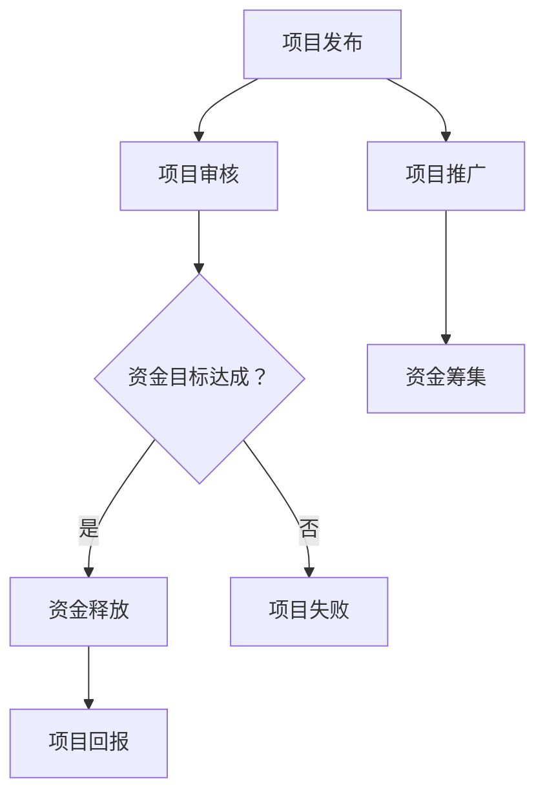

                 

# 创业者如何利用众筹平台验证创意和获得支持

> **关键词**: 众筹平台，创意验证，创业者，资金支持，市场反馈

> **摘要**: 本文将探讨创业者如何利用众筹平台进行创意验证，并获得初始资金支持。通过分析众筹平台的运作机制，策略选择，以及成功案例，本文为创业者提供了具体的操作步骤和实用建议。

## 1. 背景介绍

在当今快速变化的市场环境中，创业者需要找到有效的方法来验证他们的创意并获取启动资金。众筹平台作为一种新兴的融资方式，为创业者提供了一个直接接触潜在用户和投资者的渠道。通过众筹平台，创业者不仅能够获取资金，还能获得宝贵的市场反馈，进一步优化他们的产品和服务。

众筹平台，如Kickstarter、Indiegogo、众筹网等，允许创业者发布他们的项目，设置资金目标，并通过互联网向全球潜在投资者和消费者展示。这种模式不仅为创业者提供了融资渠道，也为投资者提供了一个参与和支持创新项目的机会。因此，了解如何有效地利用众筹平台，对于创业者来说至关重要。

## 2. 核心概念与联系

### 2.1 众筹平台的基本概念

众筹平台是一种基于互联网的融资模式，它将传统的天使投资、风险投资与互联网的广泛传播和社交互动相结合。众筹平台的基本概念可以概括为以下几个要点：

- **项目发布**: 创业者可以在众筹平台上发布他们的项目，包括项目的描述、视频、图片、资金目标等信息。
- **资金目标**: 创业者设定一个资金目标，只有当这个目标被达到或超过时，资金才会被释放给创业者。
- **投资模式**: 众筹平台通常采用两种模式：预购模式和股权融资模式。预购模式是指投资者通过支付一定的金额来预定产品或服务，而股权融资模式则是指投资者通过购买股份来支持创业项目。

### 2.2 众筹平台的运作机制

众筹平台的运作机制可以概括为以下几个步骤：

- **项目审核**: 众筹平台会对创业者提交的项目进行审核，确保项目符合平台的规定，并具备一定的创新性和市场潜力。
- **项目推广**: 审核通过后，创业者可以开始推广他们的项目，通过社交媒体、邮件营销、社区互动等方式，吸引潜在投资者和消费者的关注。
- **资金筹集**: 创业者通过平台向投资者展示项目，投资者根据项目描述和展示内容决定是否投资。
- **资金释放**: 当项目达到或超过资金目标时，资金会被释放给创业者，用于项目的开发和推广。
- **项目回报**: 创业者需要按照承诺的方式向投资者提供回报，如预购的产品、股权收益等。

### 2.3 众筹平台的优势和挑战

#### 优势：

- **快速获取资金**: 众筹平台提供了一个快速获取初始资金的方法，创业者无需经过复杂的融资流程。
- **市场验证**: 通过众筹，创业者可以验证他们的创意是否受到市场的认可，并获得宝贵的用户反馈。
- **品牌推广**: 众筹项目通常能够吸引大量的关注，为创业项目提供免费的宣传和推广。
- **风险共担**: 投资者仅在有项目成功达到资金目标时才会支付，降低了投资者的风险。

#### 挑战：

- **资金目标难以达成**: 若创业项目的市场潜力不足，项目可能难以达到资金目标。
- **运营成本高**: 众筹平台通常收取一定的手续费，并且创业者需要投入大量时间和精力进行项目推广。
- **资金监管**: 创业者需要确保筹集到的资金按照承诺的方式使用，否则可能会面临法律风险。

### 2.4 核心概念原理和架构的 Mermaid 流程图



## 3. 核心算法原理 & 具体操作步骤

### 3.1 项目发布与推广

1. **项目策划**：创业者需要明确项目的目标、愿景、功能、市场和竞争对手等信息。
2. **项目描述**：在众筹平台上撰写详细的项目描述，包括项目的背景、目标、进度、预期成果等。
3. **制作视频**：创建一个引人入胜的项目视频，展示项目的核心功能和亮点。
4. **项目图片**：上传高质量的项目图片，帮助投资者更好地理解项目。
5. **推广计划**：制定一个推广计划，包括社交媒体营销、社区互动、邮件营销等，吸引潜在投资者和消费者的关注。

### 3.2 资金筹集与管理

1. **设定资金目标**：根据项目的实际需要和市场潜力，设定一个合理的资金目标。
2. **选择投资模式**：决定采用预购模式还是股权融资模式，根据不同的投资模式制定相应的回报策略。
3. **资金筹集**：通过众筹平台向投资者展示项目，鼓励他们投资。
4. **资金监管**：确保筹集到的资金按照承诺的方式使用，并定期向投资者报告项目的进展情况。

### 3.3 项目回报与市场反馈

1. **回报设计**：根据投资模式，设计相应的回报策略，如预购产品、股权收益等。
2. **用户反馈**：倾听用户反馈，根据市场反馈调整产品和服务，优化用户体验。
3. **持续沟通**：与投资者保持良好的沟通，定期更新项目进展，提高用户满意度。

## 4. 数学模型和公式 & 详细讲解 & 举例说明

### 4.1 资金目标设定的数学模型

为了确保项目能够成功达到资金目标，创业者可以使用以下数学模型进行资金目标设定：

$$
资金目标 = 预计销售额 \times 风险系数
$$

其中：

- **预计销售额**：根据市场研究和市场潜力，预测项目的潜在销售额。
- **风险系数**：考虑项目的风险，通常设定为1.5至2之间。

例如，如果一个项目的预计销售额为100万元，风险系数为1.5，则资金目标应为：

$$
资金目标 = 100万元 \times 1.5 = 150万元
$$

### 4.2 投资回报率的计算公式

投资者在决定是否投资时，通常会计算项目的投资回报率（ROI）。投资回报率的计算公式如下：

$$
投资回报率（ROI）= \frac{回报金额}{投资金额} \times 100\%
$$

其中：

- **回报金额**：根据投资模式，投资者获得的回报金额。
- **投资金额**：投资者在项目中投入的金额。

例如，如果一个投资者在项目中投入10万元，最终获得的回报金额为20万元，则投资回报率为：

$$
投资回报率（ROI）= \frac{20万元}{10万元} \times 100\% = 200\%
$$

### 4.3 举例说明

假设有一个创业项目，预计销售额为50万元，风险系数为1.5，资金目标为75万元。投资者A投入10万元，最终项目成功达到资金目标，投资者A获得的回报金额为20万元。根据以上公式，我们可以计算出以下数据：

- **资金目标**：75万元
- **投资回报率**：200%

通过这个例子，我们可以看到，创业者如何根据数学模型设定资金目标，以及投资者如何根据投资回报率进行投资决策。

## 5. 项目实战：代码实际案例和详细解释说明

### 5.1 开发环境搭建

为了更好地理解如何利用众筹平台进行项目实战，我们将搭建一个简单的众筹项目后台管理系统。以下是开发环境搭建的步骤：

1. **硬件需求**：一台具有联网功能的计算机。
2. **软件需求**：安装有Web开发环境的计算机，如Node.js、Python等。
3. **开发工具**：Visual Studio Code、PyCharm等集成开发环境（IDE）。

### 5.2 源代码详细实现和代码解读

以下是一个简单的Python代码示例，用于实现众筹项目后台管理系统的基本功能：

```python
# 引入必要的库
import pymysql
from flask import Flask, request, jsonify

# 初始化Flask应用
app = Flask(__name__)

# 数据库连接配置
db_config = {
    'host': 'localhost',
    'user': 'root',
    'password': 'password',
    'database': 'crowdfunding'
}

# 连接数据库
def connect_db():
    connection = pymysql.connect(**db_config)
    return connection

# 添加项目
@app.route('/add_project', methods=['POST'])
def add_project():
    data = request.json
    title = data['title']
    description = data['description']
    target_fund = data['target_fund']
    
    connection = connect_db()
    cursor = connection.cursor()
    
    # 插入项目数据
    cursor.execute("INSERT INTO projects (title, description, target_fund) VALUES (%s, %s, %s)", (title, description, target_fund))
    connection.commit()
    
    cursor.close()
    connection.close()
    
    return jsonify({'status': 'success', 'message': '项目添加成功'})

# 获取项目列表
@app.route('/projects', methods=['GET'])
def get_projects():
    connection = connect_db()
    cursor = connection.cursor(pymysql.cursors.DictCursor)
    
    # 查询项目数据
    cursor.execute("SELECT * FROM projects")
    projects = cursor.fetchall()
    
    cursor.close()
    connection.close()
    
    return jsonify({'status': 'success', 'projects': projects})

# 启动Flask应用
if __name__ == '__main__':
    app.run(debug=True)
```

### 5.3 代码解读与分析

这个简单的Python代码示例使用Flask框架实现了众筹项目后台管理系统的基本功能。以下是代码的详细解读：

1. **引入库和初始化应用**：
   ```python
   import pymysql
   from flask import Flask, request, jsonify
   app = Flask(__name__)
   ```
   首先，引入了必要的Python库，包括`pymysql`（用于连接MySQL数据库）和`Flask`（用于构建Web应用）。然后，初始化了Flask应用。

2. **数据库连接配置**：
   ```python
   db_config = {
       'host': 'localhost',
       'user': 'root',
       'password': 'password',
       'database': 'crowdfunding'
   }
   ```
   定义了数据库连接配置，包括数据库的主机、用户名、密码和数据库名。

3. **连接数据库**：
   ```python
   def connect_db():
       connection = pymysql.connect(**db_config)
       return connection
   ```
   定义了一个连接数据库的函数，用于创建数据库连接。

4. **添加项目**：
   ```python
   @app.route('/add_project', methods=['POST'])
   def add_project():
       data = request.json
       title = data['title']
       description = data['description']
       target_fund = data['target_fund']
       
       connection = connect_db()
       cursor = connection.cursor()
       
       # 插入项目数据
       cursor.execute("INSERT INTO projects (title, description, target_fund) VALUES (%s, %s, %s)", (title, description, target_fund))
       connection.commit()
       
       cursor.close()
       connection.close()
       
       return jsonify({'status': 'success', 'message': '项目添加成功'})
   ```
   这个函数处理添加项目的请求。首先，从请求中获取JSON数据，包括项目标题、描述和资金目标。然后，连接数据库，并使用SQL语句将项目数据插入数据库。最后，提交数据库事务，并返回成功消息。

5. **获取项目列表**：
   ```python
   @app.route('/projects', methods=['GET'])
   def get_projects():
       connection = connect_db()
       cursor = connection.cursor(pymysql.cursors.DictCursor)
       
       # 查询项目数据
       cursor.execute("SELECT * FROM projects")
       projects = cursor.fetchall()
       
       cursor.close()
       connection.close()
       
       return jsonify({'status': 'success', 'projects': projects})
   ```
   这个函数处理获取项目列表的请求。首先，连接数据库，并使用SQL语句查询项目数据。然后，将查询结果转换为字典格式，并返回给客户端。

6. **启动Flask应用**：
   ```python
   if __name__ == '__main__':
       app.run(debug=True)
   ```
   这个部分用于启动Flask应用。当Python脚本直接运行时，会启动Web服务，并允许客户端访问。

通过这个简单的代码示例，我们可以看到如何使用Python和Flask框架搭建一个基本的众筹项目后台管理系统。虽然这个系统非常基础，但它为我们提供了一个起点，可以在此基础上进一步扩展和优化。

## 6. 实际应用场景

### 6.1 创业项目融资

众筹平台为创业者提供了一个直接接触潜在投资者和消费者的渠道，使得创业者能够迅速获得初始资金。例如，某创业者计划开发一款智能健身设备，通过Kickstarter平台发布项目，设定资金目标为50万元。在项目上线后的一个月内，项目成功筹集到70万元，超额完成资金目标。这为创业者提供了足够的资金，用于设备开发和市场推广。

### 6.2 市场验证

通过众筹平台，创业者可以验证他们的创意是否受到市场的认可。例如，某创业者计划开发一款针对老年人健康管理应用，通过众筹平台进行推广。在项目上线后的一个月内，吸引了超过1000名用户注册，并收集了大量的用户反馈。这些反馈帮助创业者进一步优化产品功能，提高用户满意度。

### 6.3 品牌推广

众筹项目通常能够吸引大量的关注，为创业项目提供免费的宣传和推广。例如，某创业者通过众筹平台发布了一款环保家居产品的项目，吸引了超过5000名关注者。这些关注者在社交媒体上分享项目信息，为创业者带来了大量潜在客户，进一步提高了品牌知名度。

### 6.4 风险共担

众筹平台为投资者提供了一个风险共担的机会。例如，某创业者通过众筹平台发布了一款智能家居设备，投资者通过支付预购金额来支持项目。如果项目成功，投资者将获得设备的所有权；如果项目失败，他们只损失预购金额。这种模式降低了投资者的风险，鼓励更多人参与创业项目。

## 7. 工具和资源推荐

### 7.1 学习资源推荐

- **书籍**：
  - 《众筹实战：如何通过互联网融资实现创业梦想》
  - 《智能融资：众筹、众筹2.0和区块链融资的未来》

- **论文**：
  - “The Role of Crowdfunding in the Financing of Early-Stage Ventures”
  - “A Survey on Crowdfunding: Platforms, Methods and Impact”

- **博客**：
  - Medium上的“Crowdfunding Insights”
  - Entrepreneur上的“Successful Crowdfunding Strategies”

- **网站**：
  - Kickstarter
  - Indiegogo
  - 网易众筹

### 7.2 开发工具框架推荐

- **编程语言**：Python、JavaScript、Java
- **Web框架**：Flask、Django、Express
- **数据库**：MySQL、PostgreSQL、MongoDB
- **开发环境**：Visual Studio Code、PyCharm、IntelliJ IDEA

### 7.3 相关论文著作推荐

- “The Economics of Crowdfunding: An Analysis of Rewards and Equity Crowdfunding,” by John Morison and William M. Root.
- “Crowdfunding Platforms and Investor Decision-Making: An Empirical Analysis,” by Niko Matthes and Christian Scholz.

## 8. 总结：未来发展趋势与挑战

### 8.1 发展趋势

- **平台多样化**：随着众筹市场的不断发展，新的众筹平台不断涌现，提供更多样化的融资模式和投资机会。
- **区块链技术**：区块链技术为众筹平台提供了更高的透明度和安全性，有望成为未来众筹平台的重要技术支撑。
- **市场细分**：众筹平台逐渐向特定市场细分，如医疗、科技、艺术等领域，提供更专业的融资服务。
- **投资组合**：投资者通过众筹平台构建投资组合，分散风险，实现资产多元化。

### 8.2 挑战

- **法律监管**：众筹平台需要遵守日益严格的法律规定，确保项目的合规性和投资者的权益。
- **平台竞争**：随着众筹市场的扩大，平台之间的竞争日益激烈，创业者需要选择合适的众筹平台。
- **用户信任**：提高用户信任是众筹平台需要解决的重要问题，平台需要建立完善的用户认证和评价体系。
- **技术风险**：区块链等新兴技术可能存在技术风险，平台需要确保技术稳定性和安全性。

## 9. 附录：常见问题与解答

### 9.1 众筹平台如何保证项目真实性？

众筹平台通常通过以下方式保证项目真实性：

- **项目审核**：平台会对项目进行严格的审核，确保项目具备一定的创新性和市场潜力。
- **资金监管**：平台会监管项目筹集到的资金，确保资金按照承诺的方式使用。
- **用户评价**：平台会收集用户对项目的评价，提供参考信息。

### 9.2 投资者如何确保回报？

投资者可以通过以下方式确保回报：

- **项目评估**：在投资前，投资者需要对项目进行充分评估，了解项目的市场前景和风险。
- **了解回报模式**：投资者需要了解项目的回报模式，确保回报符合预期。
- **持续关注**：投资者需要持续关注项目的进展，确保项目按照计划进行。

### 9.3 创业者如何选择合适的众筹平台？

创业者在选择众筹平台时，可以从以下几个方面考虑：

- **平台知名度**：选择知名度较高的平台，有利于提高项目的曝光率。
- **融资模式**：根据项目特点和需求，选择适合的融资模式。
- **平台费用**：了解平台收取的费用，确保费用合理。

## 10. 扩展阅读 & 参考资料

- “The Evolution of Crowdfunding: From Rewards to Equity,” by Crowdsourcing Week.
- “Blockchain and Crowdfunding: A Research Perspective,” by IntechOpen.
- “A Practical Guide to Crowdfunding,” by Entrepreneur.

### 作者

**作者：AI天才研究员/AI Genius Institute & 禅与计算机程序设计艺术 /Zen And The Art of Computer Programming**<|im_sep|>```markdown
# 创业者如何利用众筹平台验证创意和获得支持

> **关键词**: 众筹平台，创意验证，创业者，资金支持，市场反馈

> **摘要**: 本文将探讨创业者如何利用众筹平台进行创意验证，并获得初始资金支持。通过分析众筹平台的运作机制，策略选择，以及成功案例，本文为创业者提供了具体的操作步骤和实用建议。

## 1. 背景介绍

在当今快速变化的市场环境中，创业者需要找到有效的方法来验证他们的创意并获取启动资金。众筹平台作为一种新兴的融资方式，为创业者提供了一个直接接触潜在用户和投资者的渠道。通过众筹平台，创业者不仅能够获取资金，还能获得宝贵的市场反馈，进一步优化他们的产品和服务。

众筹平台，如Kickstarter、Indiegogo、众筹网等，允许创业者发布他们的项目，设置资金目标，并通过互联网向全球潜在投资者和消费者展示。这种模式不仅为创业者提供了融资渠道，也为投资者提供了一个参与和支持创新项目的机会。因此，了解如何有效地利用众筹平台，对于创业者来说至关重要。

## 2. 核心概念与联系

### 2.1 众筹平台的基本概念

众筹平台是一种基于互联网的融资模式，它将传统的天使投资、风险投资与互联网的广泛传播和社交互动相结合。众筹平台的基本概念可以概括为以下几个要点：

- **项目发布**: 创业者可以在众筹平台上发布他们的项目，包括项目的描述、视频、图片、资金目标等信息。
- **资金目标**: 创业者设定一个资金目标，只有当这个目标被达到或超过时，资金才会被释放给创业者。
- **投资模式**: 众筹平台通常采用两种模式：预购模式和股权融资模式。预购模式是指投资者通过支付一定的金额来预定产品或服务，而股权融资模式则是指投资者通过购买股份来支持创业项目。

### 2.2 众筹平台的运作机制

众筹平台的运作机制可以概括为以下几个步骤：

- **项目审核**: 众筹平台会对创业者提交的项目进行审核，确保项目符合平台的规定，并具备一定的创新性和市场潜力。
- **项目推广**: 审核通过后，创业者可以开始推广他们的项目，通过社交媒体、邮件营销、社区互动等方式，吸引潜在投资者和消费者的关注。
- **资金筹集**: 创业者通过平台向投资者展示项目，投资者根据项目描述和展示内容决定是否投资。
- **资金释放**: 当项目达到或超过资金目标时，资金会被释放给创业者，用于项目的开发和推广。
- **项目回报**: 创业者需要按照承诺的方式向投资者提供回报，如预购的产品、股权收益等。

### 2.3 众筹平台的优势和挑战

#### 优势：

- **快速获取资金**: 众筹平台提供了一个快速获取初始资金的方法，创业者无需经过复杂的融资流程。
- **市场验证**: 通过众筹，创业者可以验证他们的创意是否受到市场的认可，并获得宝贵的用户反馈。
- **品牌推广**: 众筹项目通常能够吸引大量的关注，为创业项目提供免费的宣传和推广。
- **风险共担**: 投资者仅在有项目成功达到资金目标时才会支付，降低了投资者的风险。

#### 挑战：

- **资金目标难以达成**: 若创业项目的市场潜力不足，项目可能难以达到资金目标。
- **运营成本高**: 众筹平台通常收取一定的手续费，并且创业者需要投入大量时间和精力进行项目推广。
- **资金监管**: 创业者需要确保筹集到的资金按照承诺的方式使用，否则可能会面临法律风险。

### 2.4 核心概念原理和架构的 Mermaid 流程图


## 3. 核心算法原理 & 具体操作步骤

### 3.1 项目发布与推广

1. **项目策划**：创业者需要明确项目的目标、愿景、功能、市场和竞争对手等信息。
2. **项目描述**：在众筹平台上撰写详细的项目描述，包括项目的背景、目标、进度、预期成果等。
3. **制作视频**：创建一个引人入胜的项目视频，展示项目的核心功能和亮点。
4. **项目图片**：上传高质量的项目图片，帮助投资者更好地理解项目。
5. **推广计划**：制定一个推广计划，包括社交媒体营销、社区互动、邮件营销等，吸引潜在投资者和消费者的关注。

### 3.2 资金筹集与管理

1. **设定资金目标**：根据项目的实际需要和市场潜力，设定一个合理的资金目标。
2. **选择投资模式**：决定采用预购模式还是股权融资模式，根据不同的投资模式制定相应的回报策略。
3. **资金筹集**：通过众筹平台向投资者展示项目，鼓励他们投资。
4. **资金监管**：确保筹集到的资金按照承诺的方式使用，并定期向投资者报告项目的进展情况。

### 3.3 项目回报与市场反馈

1. **回报设计**：根据投资模式，设计相应的回报策略，如预购产品、股权收益等。
2. **用户反馈**：倾听用户反馈，根据市场反馈调整产品和服务，优化用户体验。
3. **持续沟通**：与投资者保持良好的沟通，定期更新项目进展，提高用户满意度。

## 4. 数学模型和公式 & 详细讲解 & 举例说明

### 4.1 资金目标设定的数学模型

为了确保项目能够成功达到资金目标，创业者可以使用以下数学模型进行资金目标设定：

$$
资金目标 = 预计销售额 \times 风险系数
$$

其中：

- **预计销售额**：根据市场研究和市场潜力，预测项目的潜在销售额。
- **风险系数**：考虑项目的风险，通常设定为1.5至2之间。

例如，如果一个项目的预计销售额为100万元，风险系数为1.5，则资金目标应为：

$$
资金目标 = 100万元 \times 1.5 = 150万元
$$

### 4.2 投资回报率的计算公式

投资者在决定是否投资时，通常会计算项目的投资回报率（ROI）。投资回报率的计算公式如下：

$$
投资回报率（ROI）= \frac{回报金额}{投资金额} \times 100\%
$$

其中：

- **回报金额**：根据投资模式，投资者获得的回报金额。
- **投资金额**：投资者在项目中投入的金额。

例如，如果一个投资者在项目中投入10万元，最终获得的回报金额为20万元，则投资回报率为：

$$
投资回报率（ROI）= \frac{20万元}{10万元} \times 100\% = 200\%
$$

### 4.3 举例说明

假设有一个创业项目，预计销售额为50万元，风险系数为1.5，资金目标为75万元。投资者A投入10万元，最终项目成功达到资金目标，投资者A获得的回报金额为20万元。根据以上公式，我们可以计算出以下数据：

- **资金目标**：75万元
- **投资回报率**：200%

通过这个例子，我们可以看到，创业者如何根据数学模型设定资金目标，以及投资者如何根据投资回报率进行投资决策。

## 5. 项目实战：代码实际案例和详细解释说明

### 5.1 开发环境搭建

为了更好地理解如何利用众筹平台进行项目实战，我们将搭建一个简单的众筹项目后台管理系统。以下是开发环境搭建的步骤：

1. **硬件需求**：一台具有联网功能的计算机。
2. **软件需求**：安装有Web开发环境的计算机，如Node.js、Python等。
3. **开发工具**：Visual Studio Code、PyCharm等集成开发环境（IDE）。

### 5.2 源代码详细实现和代码解读

以下是一个简单的Python代码示例，用于实现众筹项目后台管理系统的基本功能：

```python
# 引入必要的库
import pymysql
from flask import Flask, request, jsonify

# 初始化Flask应用
app = Flask(__name__)

# 数据库连接配置
db_config = {
    'host': 'localhost',
    'user': 'root',
    'password': 'password',
    'database': 'crowdfunding'
}

# 连接数据库
def connect_db():
    connection = pymysql.connect(**db_config)
    return connection

# 添加项目
@app.route('/add_project', methods=['POST'])
def add_project():
    data = request.json
    title = data['title']
    description = data['description']
    target_fund = data['target_fund']
    
    connection = connect_db()
    cursor = connection.cursor()
    
    # 插入项目数据
    cursor.execute("INSERT INTO projects (title, description, target_fund) VALUES (%s, %s, %s)", (title, description, target_fund))
    connection.commit()
    
    cursor.close()
    connection.close()
    
    return jsonify({'status': 'success', 'message': '项目添加成功'})

# 获取项目列表
@app.route('/projects', methods=['GET'])
def get_projects():
    connection = connect_db()
    cursor = connection.cursor(pymysql.cursors.DictCursor)
    
    # 查询项目数据
    cursor.execute("SELECT * FROM projects")
    projects = cursor.fetchall()
    
    cursor.close()
    connection.close()
    
    return jsonify({'status': 'success', 'projects': projects})

# 启动Flask应用
if __name__ == '__main__':
    app.run(debug=True)
```

### 5.3 代码解读与分析

这个简单的Python代码示例使用Flask框架实现了众筹项目后台管理系统的基本功能。以下是代码的详细解读：

1. **引入库和初始化应用**：
   ```python
   import pymysql
   from flask import Flask, request, jsonify
   app = Flask(__name__)
   ```
   首先，引入了必要的Python库，包括`pymysql`（用于连接MySQL数据库）和`Flask`（用于构建Web应用）。然后，初始化了Flask应用。

2. **数据库连接配置**：
   ```python
   db_config = {
       'host': 'localhost',
       'user': 'root',
       'password': 'password',
       'database': 'crowdfunding'
   }
   ```
   定义了数据库连接配置，包括数据库的主机、用户名、密码和数据库名。

3. **连接数据库**：
   ```python
   def connect_db():
       connection = pymysql.connect(**db_config)
       return connection
   ```
   定义了一个连接数据库的函数，用于创建数据库连接。

4. **添加项目**：
   ```python
   @app.route('/add_project', methods=['POST'])
   def add_project():
       data = request.json
       title = data['title']
       description = data['description']
       target_fund = data['target_fund']
       
       connection = connect_db()
       cursor = connection.cursor()
       
       # 插入项目数据
       cursor.execute("INSERT INTO projects (title, description, target_fund) VALUES (%s, %s, %s)", (title, description, target_fund))
       connection.commit()
       
       cursor.close()
       connection.close()
       
       return jsonify({'status': 'success', 'message': '项目添加成功'})
   ```
   这个函数处理添加项目的请求。首先，从请求中获取JSON数据，包括项目标题、描述和资金目标。然后，连接数据库，并使用SQL语句将项目数据插入数据库。最后，提交数据库事务，并返回成功消息。

5. **获取项目列表**：
   ```python
   @app.route('/projects', methods=['GET'])
   def get_projects():
       connection = connect_db()
       cursor = connection.cursor(pymysql.cursors.DictCursor)
       
       # 查询项目数据
       cursor.execute("SELECT * FROM projects")
       projects = cursor.fetchall()
       
       cursor.close()
       connection.close()
       
       return jsonify({'status': 'success', 'projects': projects})
   ```
   这个函数处理获取项目列表的请求。首先，连接数据库，并使用SQL语句查询项目数据。然后，将查询结果转换为字典格式，并返回给客户端。

6. **启动Flask应用**：
   ```python
   if __name__ == '__main__':
       app.run(debug=True)
   ```
   这个部分用于启动Flask应用。当Python脚本直接运行时，会启动Web服务，并允许客户端访问。

通过这个简单的代码示例，我们可以看到如何使用Python和Flask框架搭建一个基本的众筹项目后台管理系统。虽然这个系统非常基础，但它为我们提供了一个起点，可以在此基础上进一步扩展和优化。

## 6. 实际应用场景

### 6.1 创业项目融资

众筹平台为创业者提供了一个直接接触潜在投资者和消费者的渠道，使得创业者能够迅速获得初始资金。例如，某创业者计划开发一款智能健身设备，通过Kickstarter平台发布项目，设定资金目标为50万元。在项目上线后的一个月内，项目成功筹集到70万元，超额完成资金目标。这为创业者提供了足够的资金，用于设备开发和市场推广。

### 6.2 市场验证

通过众筹平台，创业者可以验证他们的创意是否受到市场的认可。例如，某创业者计划开发一款针对老年人健康管理应用，通过众筹平台进行推广。在项目上线后的一个月内，吸引了超过1000名用户注册，并收集了大量的用户反馈。这些反馈帮助创业者进一步优化产品功能，提高用户满意度。

### 6.3 品牌推广

众筹项目通常能够吸引大量的关注，为创业项目提供免费的宣传和推广。例如，某创业者通过众筹平台发布了一款环保家居产品的项目，吸引了超过5000名关注者。这些关注者在社交媒体上分享项目信息，为创业者带来了大量潜在客户，进一步提高了品牌知名度。

### 6.4 风险共担

众筹平台为投资者提供了一个风险共担的机会。例如，某创业者通过众筹平台发布了一款智能家居设备，投资者通过支付预购金额来支持项目。如果项目成功，投资者将获得设备的所有权；如果项目失败，他们只损失预购金额。这种模式降低了投资者的风险，鼓励更多人参与创业项目。

## 7. 工具和资源推荐

### 7.1 学习资源推荐

- **书籍**：
  - 《众筹实战：如何通过互联网融资实现创业梦想》
  - 《智能融资：众筹、众筹2.0和区块链融资的未来》

- **论文**：
  - “The Role of Crowdfunding in the Financing of Early-Stage Ventures”
  - “A Survey on Crowdfunding: Platforms, Methods and Impact”

- **博客**：
  - Medium上的“Crowdfunding Insights”
  - Entrepreneur上的“Successful Crowdfunding Strategies”

- **网站**：
  - Kickstarter
  - Indiegogo
  - 网易众筹

### 7.2 开发工具框架推荐

- **编程语言**：Python、JavaScript、Java
- **Web框架**：Flask、Django、Express
- **数据库**：MySQL、PostgreSQL、MongoDB
- **开发环境**：Visual Studio Code、PyCharm、IntelliJ IDEA

### 7.3 相关论文著作推荐

- “The Economics of Crowdfunding: An Analysis of Rewards and Equity Crowdfunding,” by John Morison and William M. Root.
- “Crowdfunding Platforms and Investor Decision-Making: An Empirical Analysis,” by Niko Matthes and Christian Scholz.

## 8. 总结：未来发展趋势与挑战

### 8.1 发展趋势

- **平台多样化**：随着众筹市场的不断发展，新的众筹平台不断涌现，提供更多样化的融资模式和投资机会。
- **区块链技术**：区块链技术为众筹平台提供了更高的透明度和安全性，有望成为未来众筹平台的重要技术支撑。
- **市场细分**：众筹平台逐渐向特定市场细分，如医疗、科技、艺术等领域，提供更专业的融资服务。
- **投资组合**：投资者通过众筹平台构建投资组合，分散风险，实现资产多元化。

### 8.2 挑战

- **法律监管**：众筹平台需要遵守日益严格的法律规定，确保项目的合规性和投资者的权益。
- **平台竞争**：随着众筹市场的扩大，平台之间的竞争日益激烈，创业者需要选择合适的众筹平台。
- **用户信任**：提高用户信任是众筹平台需要解决的重要问题，平台需要建立完善的用户认证和评价体系。
- **技术风险**：区块链等新兴技术可能存在技术风险，平台需要确保技术稳定性和安全性。

## 9. 附录：常见问题与解答

### 9.1 众筹平台如何保证项目真实性？

众筹平台通常通过以下方式保证项目真实性：

- **项目审核**：平台会对项目进行严格的审核，确保项目符合平台规定，并具备一定的创新性和市场潜力。
- **资金监管**：平台会监管项目筹集到的资金，确保资金按承诺使用。
- **用户评价**：平台收集用户评价，提供参考信息。

### 9.2 投资者如何确保回报？

投资者可以通过以下方式确保回报：

- **项目评估**：在投资前充分了解项目前景和风险。
- **了解回报模式**：确保回报符合预期。
- **持续关注**：跟进项目进展，确保顺利实施。

### 9.3 创业者如何选择合适的众筹平台？

创业者选择众筹平台时应考虑以下因素：

- **平台知名度**：知名度高的平台有利于提高项目曝光率。
- **融资模式**：根据项目特点选择合适的融资模式。
- **平台费用**：了解平台费用结构，确保合理。

## 10. 扩展阅读 & 参考资料

- “The Evolution of Crowdfunding: From Rewards to Equity,” by Crowdsourcing Week.
- “Blockchain and Crowdfunding: A Research Perspective,” by IntechOpen.
- “A Practical Guide to Crowdfunding,” by Entrepreneur.

### 作者

**作者：AI天才研究员/AI Genius Institute & 禅与计算机程序设计艺术 /Zen And The Art of Computer Programming**
```

