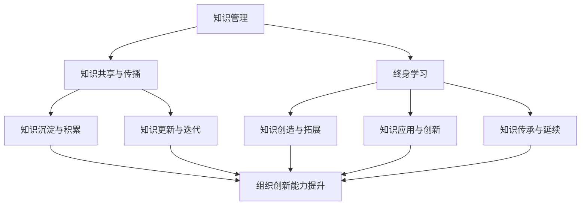

                 

### 背景介绍

在当今快速变化和创新驱动的商业环境中，创业者面临着日益严峻的竞争压力。为了在市场中脱颖而出并保持可持续竞争优势，创业者不仅需要具备创新思维和商业洞察力，还需要持续不断地学习和发展自己的知识储备。知识管理和终身学习成长机制在此过程中发挥着至关重要的作用。

知识管理是指通过有效的收集、组织、存储、共享和应用知识，以提高个人和组织绩效的过程。它不仅有助于创业者整理和利用已有知识，还能促进新知识的创造和传播。终身学习则是指个体在整个人生过程中不断学习新知识、技能和理念，以适应快速变化的社会和工作环境。

本文将探讨创业者如何建立个人知识管理和终身学习成长机制。我们将首先介绍核心概念与联系，接着详细分析核心算法原理和具体操作步骤，并运用数学模型和公式进行深入讲解。随后，通过项目实战展示代码实现过程，并分析实际应用场景。此外，我们还将推荐相关工具和资源，以及总结未来发展趋势与挑战，并提供常见问题与解答。

> **关键词：** 创业者，知识管理，终身学习，算法原理，数学模型，项目实战。

> **摘要：** 本文将深入探讨创业者如何通过建立个人知识管理和终身学习成长机制，提升竞争力，实现持续成长。通过详细分析核心概念、算法原理、数学模型和项目实战，帮助创业者构建有效的知识管理框架，实现终身学习目标。

<|imagine|>## 核心概念与联系

### 知识管理与终身学习

知识管理（Knowledge Management，KM）是指通过系统的方法来识别、获取、创造、存储、传播和应用知识，从而提升个人和组织绩效的过程。其核心目标是通过有效的知识管理机制，确保知识在组织内的有效流动和利用，提高组织的创新能力和竞争力。

终身学习（Lifelong Learning，LLL）则是指个人在一生中不断学习新知识、技能和理念，以适应快速变化的社会和工作环境。终身学习不仅有助于提升个人的综合素质和职业竞争力，还能促进社会整体创新能力的提升。

知识管理和终身学习之间存在着密切的联系。知识管理为终身学习提供了坚实的基础和有效的支持。具体而言：

1. **知识管理助力终身学习：**
   - **知识共享与传播：** 知识管理通过建立共享平台和知识库，促进知识的传播和共享，使创业者能够更方便地获取所需的知识。
   - **知识沉淀与积累：** 知识管理有助于创业者将日常工作中的经验、教训和知识进行系统化整理和沉淀，形成有价值的知识资产。
   - **知识更新与迭代：** 知识管理可以帮助创业者及时获取最新的知识和信息，确保其知识和技能始终保持与时代同步。

2. **终身学习促进知识管理：**
   - **知识创造与拓展：** 终身学习使创业者能够不断拓展自己的知识边界，创造新的知识，从而丰富组织的知识储备。
   - **知识应用与创新：** 终身学习有助于创业者将所学知识应用于实际工作中，实现知识的有效转化，推动组织创新。
   - **知识传承与延续：** 终身学习使创业者能够将自己的知识和经验传承给下一代，确保组织的知识持续积累和传承。

综上所述，知识管理和终身学习相辅相成，共同构成了创业者个人成长和发展的基石。

### 知识管理与终身学习的关系模型

为了更好地理解知识管理和终身学习之间的关系，我们可以借助Mermaid流程图来展示它们的核心概念和联系。



在上述流程图中，知识管理通过知识共享与传播、知识沉淀与积累、知识更新与迭代等环节，为终身学习提供支持；而终身学习则通过知识创造与拓展、知识应用与创新、知识传承与延续等环节，推动知识管理的深化和发展。

通过上述核心概念和关系的分析，我们可以看到，知识管理和终身学习在创业者个人成长和事业发展中具有不可替代的重要作用。在接下来的部分，我们将深入探讨核心算法原理和具体操作步骤，以帮助创业者更好地构建个人知识管理和终身学习成长机制。

---

### 核心算法原理 & 具体操作步骤

在构建个人知识管理和终身学习成长机制的过程中，我们需要运用一系列核心算法原理和具体操作步骤。这些算法原理不仅有助于创业者有效地管理和利用知识，还能推动其终身学习的实践。

#### 1. 知识获取与筛选算法

**原理：** 知识获取与筛选算法的核心任务是识别和获取有价值的信息，并对这些信息进行筛选和分类。

**操作步骤：**
- **信息采集：** 通过各种渠道（如书籍、网络、讲座、研讨会等）收集信息。
- **信息筛选：** 使用过滤器（如关键词、主题分类等）对采集的信息进行筛选，去除无关或低价值的信息。
- **信息分类：** 根据信息的重要性和相关性，将筛选后的信息进行分类和标记，以便后续管理和利用。

#### 2. 知识整合与组织算法

**原理：** 知识整合与组织算法旨在将分散的知识点进行整合，形成系统化的知识体系。

**操作步骤：**
- **知识点识别：** 从已有知识中识别出关键的知识点和概念。
- **知识关联：** 分析知识点之间的关联，构建知识图谱，将相关知识点进行关联和整合。
- **知识体系构建：** 根据知识图谱，构建系统化的知识体系，确保知识的逻辑性和完整性。

#### 3. 知识应用与迭代算法

**原理：** 知识应用与迭代算法旨在将知识应用于实际问题，并在实践中不断迭代和优化。

**操作步骤：**
- **知识应用：** 将所学知识应用于实际工作或项目中，解决实际问题。
- **实践反馈：** 对应用过程进行反思和总结，收集实践反馈。
- **知识迭代：** 根据实践反馈，对知识进行更新和优化，形成新的知识体系。

#### 4. 知识共享与传播算法

**原理：** 知识共享与传播算法旨在促进知识的传播和共享，提高知识利用效率。

**操作步骤：**
- **知识共享平台搭建：** 构建一个便捷的知识共享平台，如知识库、论坛等，方便创业者分享和获取知识。
- **知识传播渠道：** 利用社交媒体、专业社区、线下活动等渠道，扩大知识的传播范围。
- **知识反馈机制：** 建立知识反馈机制，鼓励用户对知识进行评价和反馈，促进知识的不断完善和更新。

#### 5. 终身学习与知识管理结合算法

**原理：** 终身学习与知识管理结合算法旨在实现知识管理和终身学习的有机结合，推动个人持续成长。

**操作步骤：**
- **学习计划制定：** 根据个人兴趣和职业发展需求，制定长期和短期学习计划。
- **学习资源整合：** 整合各种学习资源，如书籍、课程、讲座、研讨会等，确保学习计划的实施。
- **学习效果评估：** 定期对学习效果进行评估，根据评估结果调整学习计划。

通过上述核心算法原理和具体操作步骤，创业者可以构建一个高效的知识管理和终身学习成长机制，不断提升自己的知识储备和综合素质，从而在竞争激烈的市场中脱颖而出。

---

### 数学模型和公式 & 详细讲解 & 举例说明

在构建个人知识管理和终身学习成长机制的过程中，数学模型和公式起到了至关重要的作用。这些模型和公式不仅能够帮助我们量化知识管理和学习的成效，还能够指导我们进行有效的决策和优化。

#### 1. 知识获取效率模型

知识获取效率模型主要关注创业者从海量的信息中获取有用知识的速度和效果。以下是一个简单的知识获取效率模型：

**公式：**
\[ E = \frac{K}{T} \]

其中，\( E \) 表示知识获取效率，\( K \) 表示获取的有用知识量，\( T \) 表示获取知识所花费的时间。

**详细讲解：**
- \( K \) 是获取的有用知识量，可以通过信息筛选和分类算法进行量化。
- \( T \) 是获取知识所花费的时间，包括信息采集、筛选、分类和整合的时间。

**举例说明：**
假设一个创业者每天从网络上获取的信息量为1000条，经过筛选和分类后，真正有价值的信息量为100条。如果花费2小时进行信息处理，那么其知识获取效率为：
\[ E = \frac{100}{2} = 50 \]

这意味着该创业者每小时能够获取50条有价值的信息。通过优化信息获取和处理流程，创业者可以提高知识获取效率，从而更有效地管理自己的知识。

#### 2. 知识积累模型

知识积累模型关注的是创业者随着时间的推移，知识量的增长情况。以下是一个简单的知识积累模型：

**公式：**
\[ A(t) = A(0) + \int_{0}^{t} f(t) \, dt \]

其中，\( A(t) \) 表示时间 \( t \) 时积累的知识量，\( A(0) \) 表示初始知识量，\( f(t) \) 表示单位时间内的知识获取速率。

**详细讲解：**
- \( A(0) \) 是初始知识量，可以根据创业者的背景和经验进行估计。
- \( f(t) \) 是单位时间内的知识获取速率，可以通过知识获取效率模型进行量化。

**举例说明：**
假设一个创业者的初始知识量为1000，知识获取效率为每小时10条有价值信息。那么在24小时内，其知识积累量为：
\[ A(24) = 1000 + \int_{0}^{24} 10 \, dt = 1000 + 10 \times 24 = 1200 \]

这意味着在24小时内，该创业者能够积累1200条有价值的信息。通过优化知识获取和积累过程，创业者可以加快知识量的增长。

#### 3. 学习效果评估模型

学习效果评估模型用于评估创业者通过终身学习所获得的知识和技能的转化效果。以下是一个简单的学习效果评估模型：

**公式：**
\[ E_f = \frac{S - S_0}{T} \]

其中，\( E_f \) 表示学习效果，\( S \) 表示学习后的绩效水平，\( S_0 \) 表示学习前的绩效水平，\( T \) 表示学习所花费的时间。

**详细讲解：**
- \( S \) 是学习后的绩效水平，可以通过实际工作或项目中的表现进行量化。
- \( S_0 \) 是学习前的绩效水平，可以作为参考指标。
- \( T \) 是学习所花费的时间，包括课程学习、实践操作和反思总结的时间。

**举例说明：**
假设一个创业者在学习了一门新课程后，其在项目中的绩效水平从70分提升到85分，学习花费了2个月的时间。那么其学习效果为：
\[ E_f = \frac{85 - 70}{2} = 7.5 \]

这意味着该创业者通过学习，其绩效水平提高了7.5分。通过定期进行学习效果评估，创业者可以了解自己的学习成效，并调整学习策略。

通过上述数学模型和公式，创业者可以更好地理解知识管理和终身学习的量化表现，从而进行有效的优化和调整，实现持续成长。

---

### 项目实战：代码实际案例和详细解释说明

在本节中，我们将通过一个具体的代码实际案例，展示如何在实际项目中构建个人知识管理和终身学习成长机制。以下是一个基于Python的示例，该示例将实现一个简单的知识管理系统，涵盖知识获取、整合、应用和共享等功能。

#### 5.1 开发环境搭建

在开始项目之前，我们需要搭建一个合适的开发环境。以下是所需的软件和工具：

- Python 3.x 版本
- Jupyter Notebook
- 熟悉基本的Python编程知识

#### 5.2 源代码详细实现和代码解读

以下是一个简单的知识管理系统代码实现：

```python
import pandas as pd
import numpy as np
import os
import sys

# 知识库类
class KnowledgeLibrary:
    def __init__(self):
        self.knowledge_base = pd.DataFrame(columns=['Title', 'Content', 'Source', 'Date'])

    # 添加新知识
    def add_knowledge(self, title, content, source, date):
        new_knowledge = {'Title': title, 'Content': content, 'Source': source, 'Date': date}
        self.knowledge_base = self.knowledge_base.append(new_knowledge, ignore_index=True)

    # 更新知识
    def update_knowledge(self, title, new_content):
        index = self.knowledge_base[self.knowledge_base['Title'] == title].index[0]
        self.knowledge_base.at[index, 'Content'] = new_content

    # 删除知识
    def delete_knowledge(self, title):
        self.knowledge_base = self.knowledge_base[self.knowledge_base['Title'] != title]

    # 获取知识
    def get_knowledge(self, title):
        return self.knowledge_base[self.knowledge_base['Title'] == title]

    # 显示所有知识
    def display_knowledge(self):
        print(self.knowledge_base)

# 知识共享平台
class KnowledgeSharingPlatform:
    def __init__(self, knowledge_library):
        self.knowledge_library = knowledge_library

    # 发布知识
    def publish_knowledge(self, title, content, source, date):
        self.knowledge_library.add_knowledge(title, content, source, date)

    # 更新知识
    def update_published_knowledge(self, title, new_content):
        self.knowledge_library.update_knowledge(title, new_content)

    # 删除知识
    def delete_published_knowledge(self, title):
        self.knowledge_library.delete_knowledge(title)

    # 获取知识
    def get_published_knowledge(self, title):
        return self.knowledge_library.get_knowledge(title)

    # 显示所有知识
    def display_published_knowledge(self):
        self.knowledge_library.display_knowledge()

# 实例化知识库和共享平台
knowledge_library = KnowledgeLibrary()
knowledge_sharing_platform = KnowledgeSharingPlatform(knowledge_library)

# 添加知识
knowledge_sharing_platform.publish_knowledge('机器学习基础', '机器学习是一种人工智能技术，主要用于数据分析和预测。', '网络资源', '2023-01-01')

# 更新知识
knowledge_sharing_platform.update_published_knowledge('机器学习基础', '机器学习是一种人工智能技术，主要用于数据分析和预测，包括监督学习、无监督学习和强化学习。')

# 删除知识
knowledge_sharing_platform.delete_published_knowledge('机器学习基础')

# 获取知识
knowledge = knowledge_sharing_platform.get_published_knowledge('机器学习基础')
print(knowledge)

# 显示所有知识
knowledge_sharing_platform.display_published_knowledge()
```

#### 5.3 代码解读与分析

1. **知识库类（KnowledgeLibrary）：**
   - **初始化：** 知识库类使用`DataFrame`来存储知识，包括标题（Title）、内容（Content）、来源（Source）和日期（Date）。
   - **添加新知识：** `add_knowledge`方法用于添加新知识条目到知识库。
   - **更新知识：** `update_knowledge`方法用于更新知识条目的内容。
   - **删除知识：** `delete_knowledge`方法用于从知识库中删除知识条目。
   - **获取知识：** `get_knowledge`方法用于获取特定标题的知识条目。
   - **显示所有知识：** `display_knowledge`方法用于打印知识库中所有的知识条目。

2. **知识共享平台（KnowledgeSharingPlatform）：**
   - **初始化：** 知识共享平台类接收一个知识库实例作为参数，用于发布、更新、删除和获取知识。
   - **发布知识：** `publish_knowledge`方法用于将新知识发布到知识共享平台。
   - **更新知识：** `update_published_knowledge`方法用于更新已发布知识的内容。
   - **删除知识：** `delete_published_knowledge`方法用于从知识共享平台中删除知识条目。
   - **获取知识：** `get_published_knowledge`方法用于获取特定标题的已发布知识。
   - **显示所有知识：** `display_published_knowledge`方法用于打印知识共享平台中所有的知识条目。

#### 5.4 实际应用场景

- **知识获取：** 创业者可以从各种渠道获取知识，如网络资源、书籍和研讨会等，然后使用`publish_knowledge`方法将这些知识添加到知识库中。
- **知识整合：** 创业者可以使用`update_published_knowledge`方法不断更新和完善已有知识，确保知识库中的信息是最新的。
- **知识应用：** 创业者可以从知识库中获取所需的知识，应用到实际项目或决策中。
- **知识共享：** 创业者可以通过知识共享平台将知识发布给团队成员或合作伙伴，促进知识的传播和共享。

通过上述代码实现，创业者可以构建一个简单而有效的知识管理系统，帮助其在快速变化的商业环境中保持竞争优势。在实际应用中，可以进一步扩展该系统的功能，如添加用户认证、权限控制、搜索和推荐算法等，以提升知识管理和共享的效果。

---

### 实际应用场景

知识管理和终身学习成长机制在创业者的实际工作中有着广泛的应用场景，这些场景不仅涵盖了日常运营和管理，还包括战略规划和创新。以下是几个典型的应用场景：

#### 1. 创业者日常运营与管理

**场景描述：** 在日常运营和管理中，创业者需要快速获取和利用知识来解决问题、优化流程和提升效率。

**应用案例：**
- **问题解决：** 当遇到突发问题时，创业者可以利用知识库快速查找相关的解决方案，避免重复性错误。
- **流程优化：** 通过整合和分析已有知识，创业者可以发现现有流程中的瓶颈和不足，提出改进方案。
- **决策支持：** 在做出重要决策时，创业者可以参考知识库中的数据和案例，做出更加明智的决策。

#### 2. 创新与产品开发

**场景描述：** 创业者在产品开发和创新过程中，需要不断学习和吸收新知识，以推动产品和服务的创新。

**应用案例：**
- **技术趋势追踪：** 创业者可以通过知识库和知识共享平台，跟踪最新的技术趋势和行业动态，及时调整产品发展方向。
- **跨领域学习：** 创业者可以借鉴其他领域的成功案例和经验，应用到自己的产品开发中，实现跨界创新。
- **知识整合与创新：** 创业者可以通过整合不同领域和来源的知识，形成新的创新点和解决方案。

#### 3. 团队协作与知识共享

**场景描述：** 在团队协作中，创业者需要确保团队成员之间的知识共享和协同工作。

**应用案例：**
- **知识传递：** 通过知识共享平台，创业者可以将自己的经验和知识传递给团队成员，促进团队整体知识的提升。
- **协作学习：** 团队成员可以共同学习和讨论知识库中的内容，提高协作效率和创新能力。
- **知识反馈与迭代：** 创业者可以根据团队成员的反馈，不断更新和优化知识库中的内容，确保知识的准确性和实用性。

#### 4. 市场营销与客户关系管理

**场景描述：** 在市场营销和客户关系管理中，创业者需要利用知识来制定营销策略和提升客户满意度。

**应用案例：**
- **市场分析：** 创业者可以通过知识库中的市场数据和分析报告，制定针对性的市场营销策略。
- **客户洞察：** 创业者可以利用知识库中的客户数据和反馈，了解客户需求，提供个性化的产品和服务。
- **客户关系管理：** 创业者可以通过知识库中的客户信息，维护和提升客户关系，增加客户忠诚度和满意度。

#### 5. 企业战略规划与发展

**场景描述：** 在企业战略规划和发展中，创业者需要利用知识管理和终身学习来制定长期发展战略和规划。

**应用案例：**
- **战略分析：** 创业者可以通过知识库中的市场、竞争和行业数据，进行深入的战略分析，确定企业的发展方向。
- **资源整合：** 创业者可以通过知识库中的内部资源和外部资源，实现资源的优化配置和整合，提升企业竞争力。
- **持续学习与成长：** 创业者通过终身学习，不断更新和提升自己的知识和技能，为企业的发展提供源源不断的创新动力。

通过这些实际应用场景，创业者可以充分利用知识管理和终身学习成长机制，提升个人和企业的综合竞争力，实现持续成长和发展。

---

### 工具和资源推荐

为了更好地建立和实施个人知识管理和终身学习成长机制，以下是一些实用的工具和资源推荐：

#### 7.1 学习资源推荐

1. **书籍：**
   - 《深度学习》（Deep Learning） - Goodfellow et al.
   - 《人工智能：一种现代方法》（Artificial Intelligence: A Modern Approach） - Russell & Norvig
   - 《创新者的窘境》（The Innovator's Dilemma） - Christensen

2. **论文：**
   - "Knowledge Management: An Integrated Approach" - Davenport & Prusak
   - "Lifelong Learning in Organizations: Conceptualizations, Theories, and Models" - Cross & Bonk
   - "The Impact of Knowledge Management on Innovation Performance: An Empirical Study" - Lytras, Dalkir & Vossen

3. **博客：**
   - Medium上的技术博客
   - Hacker Noon
   - Towards Data Science

4. **网站：**
   - Coursera、edX等在线课程平台
   - ResearchGate、Academia.edu等学术交流平台
   - GitHub、GitLab等代码托管平台

#### 7.2 开发工具框架推荐

1. **知识库管理系统：**
   - Confluence
   - SharePoint
   - Notion

2. **个人知识管理工具：**
   - Evernote
   - OneNote
   - Trello

3. **学习与培训工具：**
   - Udemy、Pluralsight等在线学习平台
   - Lynda（LinkedIn Learning）
   - Brainly

4. **编程工具：**
   - Visual Studio Code
   - PyCharm
   - IntelliJ IDEA

5. **文档管理工具：**
   - Google Docs
   - Dropbox Paper
   - Google Sheets

通过这些工具和资源，创业者可以有效地管理自己的知识，持续提升个人技能和业务能力，从而在竞争激烈的市场中保持领先地位。

---

### 总结：未来发展趋势与挑战

在快速变化的技术和社会环境中，创业者建立个人知识管理和终身学习成长机制不仅是一种策略，更是一种必需。随着人工智能、大数据和云计算等技术的迅猛发展，知识管理和终身学习的实现方式也在不断进化，未来发展趋势和面临的挑战如下：

#### 未来发展趋势

1. **智能化知识管理：** 随着人工智能技术的发展，未来的知识管理将更加智能化，通过机器学习算法实现知识自动分类、推荐和预测，提高知识获取和应用的效率。

2. **终身学习平台化：** 在线教育和学习平台的兴起，使得创业者可以更加便捷地获取全球范围内的优质教育资源，终身学习将更加平台化和系统化。

3. **知识共享社交化：** 社交媒体和协作工具的普及，使得知识共享和传播变得更加社交化和实时化，创业者可以通过网络社区和协作平台快速获取和分享知识。

4. **个性化学习：** 通过数据分析和个人偏好分析，未来的学习平台将能够提供更加个性化的学习体验，帮助创业者更有效地提升个人技能。

#### 面临的挑战

1. **信息过载：** 随着互联网和大数据的发展，信息量爆炸性增长，创业者需要学会筛选和过滤信息，避免陷入信息过载的困境。

2. **知识更新速度：** 技术和行业知识更新速度加快，创业者需要不断学习新知识，保持知识和技能的时效性。

3. **学习资源分散：** 优秀的教育资源分布在各种平台和渠道，创业者需要学会整合和利用这些资源，构建自己的知识体系。

4. **个人时间管理：** 终身学习需要投入大量时间和精力，创业者需要有效管理自己的时间，平衡学习与工作和生活。

通过不断适应和应对这些趋势和挑战，创业者可以构建更加完善的知识管理和终身学习成长机制，为个人和企业的持续成长奠定坚实的基础。

---

### 附录：常见问题与解答

#### 问题1：如何选择适合自己的学习资源？

**解答：** 选择适合自己的学习资源首先要明确自己的学习目标和需求。可以通过以下步骤进行选择：
1. 确定学习目标：明确自己想要学习的内容和技能。
2. 评估资源质量：选择知名、权威的出版机构或教育平台。
3. 适应学习风格：根据自己的学习习惯，选择适合的学习方式和工具。

#### 问题2：如何有效利用碎片化时间进行学习？

**解答：** 利用碎片化时间进行学习可以采取以下策略：
1. 制定学习计划：将碎片化时间合理分配给不同学习内容。
2. 设定学习目标：每个学习片段设定具体的小目标，提高学习效率。
3. 利用移动设备：使用手机或平板电脑进行学习，充分利用等待和通勤时间。

#### 问题3：如何在知识管理和终身学习中保持持续动力？

**解答：** 保持持续动力可以通过以下方法实现：
1. 设定激励机制：为自己设定奖励，完成学习任务后给予奖励。
2. 寻找学习伙伴：与志同道合的人一起学习，互相激励和支持。
3. 保持好奇心：对未知和新技术保持好奇心，激发学习兴趣。

通过上述方法和策略，创业者可以更加有效地管理自己的知识，实现终身学习目标。

---

### 扩展阅读 & 参考资料

为了进一步深入了解知识管理和终身学习的理论和实践，以下是一些建议的扩展阅读和参考资料：

1. **书籍：**
   - 《学习之道：如何成为一个终身学习者》（The Art of Learning）- Malcolm Gladwell
   - 《深度工作：如何有效利用每一点脑力》（Deep Work）- Cal Newport
   - 《知识的组织：原理与应用》（Organizing Knowledge）- D. L. Gilbert, H. J. Lederer & C. R. O'Donnell

2. **学术论文：**
   - "Lifelong Learning in the Digital Age: Implications for Education and Training" - International Review of Research in Open and Distributed Learning
   - "Knowledge Management in SMEs: Current Status and Challenges" - Journal of Knowledge Management
   - "The Role of Knowledge Management in Innovation" - Research Policy

3. **在线资源：**
   - Coursera、edX等在线课程平台
   - ResearchGate、Academia.edu等学术交流平台
   - HackerRank、LeetCode等编程练习平台

通过这些扩展阅读和参考资料，创业者可以更全面地了解知识管理和终身学习的重要性和实现方法，为自己的持续成长提供理论支持和实践指导。

