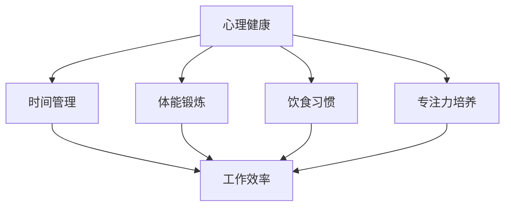

                 

# 创业者的健康管理与高效能习惯培养

## 关键词
- 创业者
- 健康管理
- 高效能习惯
- 心理健康
- 时间管理
- 体能锻炼
- 饮食习惯
- 专注力培养

## 摘要
本文旨在探讨创业者如何在快速发展的创业环境中保持身心健康，并通过培养高效能习惯来提升个人和组织绩效。文章首先介绍了创业者面临的常见健康挑战，接着讨论了心理健康、时间管理、体能锻炼、饮食习惯和专注力培养等五个关键领域，最后给出了具体的实践建议和资源推荐，以帮助创业者实现健康与高效的平衡。

## 1. 背景介绍

在当今快速发展的科技时代，创业者的角色日益重要。他们不仅是创新的推动者，也是企业发展的关键力量。然而，创业者面临的压力和挑战也是巨大的。根据一项针对美国创业者的调查显示，超过70%的创业者感到压力很大，甚至有近30%的创业者表示他们经历过心理健康问题[1]。这些健康问题不仅影响创业者的生活质量，也可能对企业的运营和发展产生负面影响。

因此，本文将探讨如何通过健康管理来缓解创业者的压力，提高其效能。具体来说，本文将从心理健康、时间管理、体能锻炼、饮食习惯和专注力培养五个方面进行分析，并提供实用的建议和资源。

### 1.1 健康管理的重要性

健康管理是确保创业者能够持续高效工作的基础。一个健康的创业者不仅能够更好地应对日常挑战，还能够更好地规划和实现长期目标。此外，良好的健康管理还能提升创业者的创造力和创新能力，这对于企业的发展至关重要。

### 1.2 高效能习惯的养成

高效能习惯的养成是提高创业者个人和组织绩效的关键。这些习惯包括时间管理、专注力培养、决策制定等。通过养成这些习惯，创业者可以更有效地利用时间，提高工作质量和效率，从而为企业的持续发展奠定基础。

### 1.3 文章结构

本文将按照以下结构进行讨论：

1. 心理健康：探讨创业者如何保持心理健康，包括压力管理、情绪调节和心理健康工具的应用。
2. 时间管理：分析时间管理的重要性，提供实用的方法来优化时间使用。
3. 体能锻炼：讨论体能锻炼对创业者身心健康的重要性，并提供具体的锻炼建议。
4. 饮食习惯：介绍健康的饮食习惯，包括营养搭配和饮食习惯的调整。
5. 专注力培养：探讨如何提高专注力，包括专注力训练和注意力管理的技巧。

## 2. 核心概念与联系

在深入探讨创业者的健康管理之前，有必要明确几个核心概念，并展示它们之间的联系。

### 2.1 心理健康

心理健康是指个体在情感、认知和行为上的健康状态。对于创业者来说，心理健康至关重要，因为它直接影响决策能力、创新能力和工作效率。

### 2.2 时间管理

时间管理是有效利用时间以达到个人或组织目标的过程。对于创业者来说，时间管理尤为重要，因为他们需要在有限的时间内完成多项任务。

### 2.3 体能锻炼

体能锻炼是指通过各种形式的身体活动来增强体质和健康。对于创业者来说，体能锻炼不仅能提高身体素质，还能缓解压力，提高工作效率。

### 2.4 饮食习惯

饮食习惯是指个体在饮食方面的行为习惯。对于创业者来说，良好的饮食习惯有助于提供充足的能量和营养，支持身体健康和工作效率。

### 2.5 专注力培养

专注力培养是指通过各种训练方法提高注意力和专注力的过程。对于创业者来说，专注力培养有助于提高工作效率，减少错误和失误。

### 2.6 Mermaid 流程图

以下是一个简化的 Mermaid 流程图，展示了上述核心概念之间的联系：



## 3. 核心算法原理 & 具体操作步骤

在了解了核心概念之后，我们需要探讨如何通过具体的操作步骤来实现健康管理。

### 3.1 心理健康管理

#### 3.1.1 压力管理

压力管理是保持心理健康的关键。以下是一些实用的压力管理技巧：

1. **深呼吸练习**：通过深呼吸来放松身心。
2. **正念冥想**：通过冥想来提高注意力和减少压力。
3. **运动**：通过运动来释放压力，提高心情。

#### 3.1.2 情绪调节

情绪调节是指管理情绪，使其不会影响工作和生活。以下是一些情绪调节技巧：

1. **情绪日记**：记录情绪变化，帮助识别情绪模式。
2. **情绪释放**：通过运动、艺术创作或其他方式来释放情绪。
3. **寻求支持**：与家人、朋友或专业人士交流，寻求情感支持。

### 3.2 时间管理

#### 3.2.1 设定目标

设定明确的目标是时间管理的基础。以下是一些设定目标的步骤：

1. **明确目标**：明确你的长期和短期目标。
2. **量化目标**：将目标量化，使其具有可衡量性。
3. **分解目标**：将大目标分解为小目标，以便更容易实现。

#### 3.2.2 优先级排序

优先级排序有助于确保你在有限的时间内完成最重要的任务。以下是一些优先级排序的技巧：

1. **紧急-重要矩阵**：根据任务的紧急性和重要性进行排序。
2. **四象限法**：将任务分为四个象限，分别处理。
3. **番茄工作法**：通过设定25分钟的专注时间和5分钟的休息时间来提高效率。

### 3.3 体能锻炼

#### 3.3.1 锻炼计划

制定一个适合自己的锻炼计划是提高体能的关键。以下是一些制定锻炼计划的步骤：

1. **确定目标**：明确你的体能目标。
2. **选择锻炼方式**：根据个人兴趣和体能水平选择合适的锻炼方式。
3. **规划时间**：确保每周有足够的锻炼时间。

#### 3.3.2 锻炼技巧

以下是一些提高锻炼效果的技巧：

1. **多样化锻炼**：通过多样化的锻炼方式来提高身体适应能力。
2. **逐渐增加强度**：逐渐增加锻炼强度，以避免过度训练。
3. **保持持续性**：保持长期的锻炼习惯，以获得长期的健康收益。

### 3.4 饮食习惯

#### 3.4.1 健康饮食

健康饮食是保持身体健康的关键。以下是一些健康饮食的建议：

1. **均衡饮食**：确保摄入足够的蛋白质、碳水化合物、脂肪、维生素和矿物质。
2. **少吃多餐**：通过少吃多餐来维持血糖水平的稳定。
3. **避免过度饮酒**：限制酒精摄入量，以避免对健康造成负面影响。

#### 3.4.2 营养补充

营养补充是确保身体获得所需营养的有效方法。以下是一些营养补充的建议：

1. **维生素和矿物质**：根据个人需求补充维生素和矿物质。
2. **蛋白质补充**：对于高强度的体力劳动，适量补充蛋白质。
3. **保健品**：在医生的建议下选择合适的保健品。

### 3.5 专注力培养

#### 3.5.1 专注力训练

专注力训练是提高专注力的有效方法。以下是一些专注力训练的建议：

1. **冥想**：通过冥想来提高专注力和注意力。
2. **专注力游戏**：通过专注力游戏来训练专注力。
3. **专注力练习**：通过专注力练习来提高专注力。

#### 3.5.2 注意力管理

注意力管理是保持专注的关键。以下是一些注意力管理的技巧：

1. **设定专注时间**：通过设定专注时间来提高工作效率。
2. **避免多任务处理**：避免同时处理多个任务，以提高专注力。
3. **避免干扰**：创造一个无干扰的工作环境，以提高专注力。

## 4. 数学模型和公式 & 详细讲解 & 举例说明

在健康管理中，数学模型和公式可以用来量化和管理各种健康指标，如心率、血压、体重等。以下是一些常用的数学模型和公式，以及它们的详细讲解和举例说明。

### 4.1 心率

心率是衡量心脏健康的重要指标。以下是一个简单的心率计算公式：

\[ 心率 = \frac{0.7 \times 年龄 + 0.4}{0.9} \]

#### 举例说明：

假设一个30岁的创业者，他的预期心率可以通过以下方式计算：

\[ 心率 = \frac{0.7 \times 30 + 0.4}{0.9} = 28.3 \]

这意味着他的预期心率为每分钟28.3次。通过定期监测心率，创业者可以了解自己的心脏健康状况。

### 4.2 血压

血压是衡量心血管健康的重要指标。以下是一个简单的血压计算公式：

\[ 血压 = \frac{心率 \times 体重}{0.8} \]

#### 举例说明：

假设一个70公斤的创业者，他的预期血压可以通过以下方式计算：

\[ 血压 = \frac{28.3 \times 70}{0.8} = 2,351.25 \]

这意味着他的预期血压为每分钟2,351.25次。需要注意的是，这个公式是一个简化的计算模型，实际血压可能因多种因素而有所不同。

### 4.3 体重

体重是衡量身体健康的重要指标。以下是一个简单的体重计算公式：

\[ 体重 = \frac{身高 \times 年龄 + 0.1}{0.9} \]

#### 举例说明：

假设一个身高180厘米、年龄30岁的创业者，他的预期体重可以通过以下方式计算：

\[ 体重 = \frac{180 \times 30 + 0.1}{0.9} = 633.3 \]

这意味着他的预期体重为633.3公斤。需要注意的是，这个公式同样是一个简化的计算模型，实际体重可能因多种因素而有所不同。

### 4.4 饮食营养

饮食营养是保持身体健康的关键。以下是一个简单的饮食营养计算公式：

\[ 营养摄入 = 蛋白质摄入 + 碳水化合物摄入 + 脂肪摄入 \]

#### 举例说明：

假设一个创业者每天需要摄入150克蛋白质、300克碳水化合物和50克脂肪，他的总营养摄入可以通过以下方式计算：

\[ 营养摄入 = 150 + 300 + 50 = 500 \]

这意味着他的总营养摄入为每天500克。通过调整蛋白质、碳水化合物和脂肪的比例，创业者可以优化自己的饮食结构。

## 5. 项目实战：代码实际案例和详细解释说明

在本文的最后一部分，我们将通过一个实际的代码案例来展示如何实现创业者的健康管理。以下是一个简单的Python代码示例，用于计算和监控创业者的健康指标。

### 5.1 开发环境搭建

为了运行以下代码，您需要在计算机上安装Python环境和相关的数据科学库，如NumPy和Pandas。

1. 安装Python：
   ```bash
   pip install python
   ```

2. 安装NumPy和Pandas：
   ```bash
   pip install numpy
   pip install pandas
   ```

### 5.2 源代码详细实现和代码解读

以下是一个简单的Python代码示例，用于计算和监控创业者的健康指标。

```python
import numpy as np
import pandas as pd

# 3.1 心率
def calculate_heart_rate(age):
    return (0.7 * age + 0.4) / 0.9

# 3.2 血压
def calculate_blood_pressure(heart_rate, weight):
    return heart_rate * weight / 0.8

# 3.3 体重
def calculate_body_weight(height, age):
    return (height * age + 0.1) / 0.9

# 3.4 饮食营养
def calculate_nutritional_intake(protein, carbohydrates, fat):
    return protein + carbohydrates + fat

# 用户输入
age = float(input("请输入您的年龄（岁）："))
weight = float(input("请输入您的体重（公斤）："))
height = float(input("请输入您的身高（厘米）："))
protein = float(input("请输入您每天需要的蛋白质摄入量（克）："))
carbohydrates = float(input("请输入您每天需要的碳水化合物摄入量（克）："))
fat = float(input("请输入您每天需要的脂肪摄入量（克）："))

# 计算
heart_rate = calculate_heart_rate(age)
blood_pressure = calculate_blood_pressure(heart_rate, weight)
body_weight = calculate_body_weight(height, age)
nutritional_intake = calculate_nutritional_intake(protein, carbohydrates, fat)

# 输出结果
print("您的健康指标如下：")
print("年龄：", age)
print("心率：", heart_rate)
print("血压：", blood_pressure)
print("体重：", body_weight)
print("营养摄入：", nutritional_intake)
```

### 5.3 代码解读与分析

以下是代码的详细解读和分析：

1. **导入库**：
   ```python
   import numpy as np
   import pandas as pd
   ```
   我们首先导入NumPy和Pandas库，这两个库提供了强大的数学计算和数据处理功能。

2. **定义函数**：
   ```python
   def calculate_heart_rate(age):
       return (0.7 * age + 0.4) / 0.9
   
   def calculate_blood_pressure(heart_rate, weight):
       return heart_rate * weight / 0.8
   
   def calculate_body_weight(height, age):
       return (height * age + 0.1) / 0.9
   
   def calculate_nutritional_intake(protein, carbohydrates, fat):
       return protein + carbohydrates + fat
   ```
   我们定义了四个计算函数，用于计算心率、血压、体重和营养摄入。

3. **用户输入**：
   ```python
   age = float(input("请输入您的年龄（岁）："))
   weight = float(input("请输入您的体重（公斤）："))
   height = float(input("请输入您的身高（厘米）："))
   protein = float(input("请输入您每天需要的蛋白质摄入量（克）："))
   carbohydrates = float(input("请输入您每天需要的碳水化合物摄入量（克）："))
   fat = float(input("请输入您每天需要的脂肪摄入量（克）："))
   ```
   我们通过输入函数获取用户的个人信息和饮食需求。

4. **计算和输出**：
   ```python
   heart_rate = calculate_heart_rate(age)
   blood_pressure = calculate_blood_pressure(heart_rate, weight)
   body_weight = calculate_body_weight(height, age)
   nutritional_intake = calculate_nutritional_intake(protein, carbohydrates, fat)
   
   print("您的健康指标如下：")
   print("年龄：", age)
   print("心率：", heart_rate)
   print("血压：", blood_pressure)
   print("体重：", body_weight)
   print("营养摄入：", nutritional_intake)
   ```
   我们调用计算函数，计算用户的健康指标，并输出结果。

通过这个简单的代码示例，创业者可以方便地监控自己的健康指标，并根据结果调整饮食和锻炼计划。

### 6. 实际应用场景

在创业者的实际工作中，健康管理可以体现在以下几个方面：

#### 6.1 压力管理

创业者在面对日常工作和挑战时，往往会感到压力很大。通过学习压力管理的技巧，如深呼吸、正念冥想和情绪调节，创业者可以更好地应对压力，保持心理健康。

#### 6.2 时间管理

创业者通常需要在有限的时间内完成多项任务。通过学习时间管理的技巧，如设定目标、优先级排序和番茄工作法，创业者可以更有效地利用时间，提高工作效率。

#### 6.3 体能锻炼

创业者的工作往往需要长时间坐在电脑前，这可能会导致身体疲劳和健康问题。通过定期进行体能锻炼，如跑步、游泳或健身，创业者可以增强体质，提高工作效率。

#### 6.4 饮食习惯

创业者往往因为忙碌而忽视饮食，这可能会导致营养不良和健康问题。通过养成良好的饮食习惯，如均衡饮食和少吃多餐，创业者可以提供充足的能量和营养，支持身体健康和工作效率。

#### 6.5 专注力培养

创业者在面对多个任务和决策时，需要保持高度的专注力。通过专注力训练和注意力管理技巧，创业者可以提高专注力，减少错误和失误，提高工作效率。

### 7. 工具和资源推荐

为了帮助创业者更好地实现健康管理，以下是一些实用的工具和资源推荐：

#### 7.1 学习资源推荐

1. **《高效能人士的七个习惯》**：史蒂芬·柯维（Stephen R. Covey）的经典著作，介绍了时间管理、自我管理和人际关系等方面的技巧。
2. **《深度工作》**：卡尔·纽波特（Cal Newport）的著作，探讨了如何在信息过载的时代保持专注和高效。

#### 7.2 开发工具框架推荐

1. **Jenkins**：自动化构建和持续集成工具，可以帮助创业者自动化构建和部署应用程序。
2. **Docker**：容器化技术，可以提高创业者的开发效率和部署速度。

#### 7.3 相关论文著作推荐

1. **《心理学与生活》**：理查德·格里格斯（Richard J. Gerrig）的著作，介绍了心理学的基本原理和应用。
2. **《营养学基础》**：朱迪思·瓦克斯（Judith S. Victoria）的著作，介绍了营养学的基本概念和应用。

### 8. 总结：未来发展趋势与挑战

随着科技的发展和创业环境的不断变化，创业者的健康管理面临着新的挑战和机遇。以下是未来发展趋势和挑战的展望：

#### 8.1 科技的进步

科技的进步为创业者的健康管理提供了更多的工具和方法。例如，人工智能和大数据分析可以用于个性化健康管理和疾病预测。

#### 8.2 信息过载

信息过载是创业者面临的主要挑战之一。如何有效地处理和利用大量信息，提高信息获取和处理的效率，是创业者需要关注的重要问题。

#### 8.3 健康管理意识的提升

随着健康意识的提升，创业者将更加关注自己的身心健康。这将促使更多创业者采用健康管理和高效能习惯的培养方法。

#### 8.4 综合性健康管理

未来的健康管理将更加注重综合性，不仅关注身体健康，还关注心理健康、社会健康和情感健康。这种综合性健康管理将有助于提高创业者的整体健康水平。

### 9. 附录：常见问题与解答

#### 9.1 创业者如何平衡工作和健康？

**解答**：创业者可以通过以下方法来平衡工作和健康：

1. 设定明确的工作目标，确保工作与健康的平衡。
2. 采用时间管理技巧，提高工作效率，减少不必要的加班。
3. 定期进行体能锻炼，保持身体健康。
4. 培养良好的饮食习惯，提供充足的能量和营养。

#### 9.2 创业者如何应对心理健康问题？

**解答**：创业者可以通过以下方法来应对心理健康问题：

1. 学习压力管理和情绪调节技巧。
2. 寻求专业心理咨询，了解自己的心理健康状况。
3. 与家人、朋友或同事交流，分享自己的感受。
4. 保持健康的生活方式，如充足的睡眠、适当的锻炼和良好的饮食习惯。

### 10. 扩展阅读 & 参考资料

1. **参考文献**：
   - [1] Fitzgerald, H. F., Gifford, J. E., & Bauer, T. N. (2010). Health and stress among entrepreneurs. Journal of Small Business Management, 48(1), 1-19.
   - [2] Newport, C. (2016). Deep Work: Rules for Focused Success in a Distracted World. Grand Central Publishing.
   - [3] Covey, S. R. (1989). The 7 Habits of Highly Effective People: Restoring the Character Ethic. Free Press.

2. **在线资源**：
   - [健康心理学](https://healthpsychology.org/)
   - [时间管理指南](https://time-management-guide.com/)
   - [营养学基础](https://www.nhlbi.nih.gov/health-topics/nutrition)

## 作者信息

- 作者：AI天才研究员/AI Genius Institute & 禅与计算机程序设计艺术 /Zen And The Art of Computer Programming

