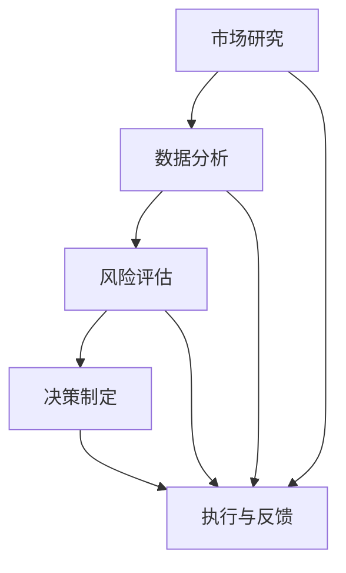

                 

# 创业者的决策技巧：在不确定性中前进

> 关键词：创业、决策、不确定性、算法、模型、实战、应用场景、资源推荐、未来趋势

> 摘要：本文旨在探讨创业者在面对不确定环境时如何做出明智的决策。通过深入分析决策的核心概念、算法原理，并结合实际项目案例，提供了一系列实用的决策技巧和工具，帮助创业者更好地应对未来的挑战。

## 1. 背景介绍

在当今快速变化的世界，创业已成为许多有志之士实现梦想和创造价值的途径。然而，创业之路并非一帆风顺，充满了不确定性和风险。创业者需要在充满变数的环境中做出一系列关键决策，这些决策的正确性直接关系到企业的生存和发展。因此，掌握科学的决策方法和技巧至关重要。

本文将从以下三个方面展开讨论：

1. 核心概念与联系
2. 核心算法原理与具体操作步骤
3. 实际应用场景与工具资源推荐

通过这些内容，本文希望为创业者提供一套实用的决策指南，帮助他们在不确定性中稳步前进。

## 2. 核心概念与联系

在探讨创业者决策技巧之前，我们首先需要了解几个核心概念。

### 2.1 创业者面临的挑战

创业者通常面临以下几个挑战：

- **市场不确定性**：市场需求变化迅速，难以准确预测。
- **资源限制**：资金、人力、时间等资源有限。
- **竞争压力**：市场竞争激烈，需要不断创新以保持优势。
- **环境变化**：政策、经济、社会环境等外部因素的变化。

### 2.2 决策的定义与类型

决策是指从多个可选方案中选择一个最优方案的过程。根据决策的对象和目标，决策可以分为以下几种类型：

- **战略决策**：涉及企业长远发展方向和目标的决策。
- **战术决策**：涉及短期运营和资源配置的决策。
- **运营决策**：涉及日常运营和管理的决策。

### 2.3 不确定性

不确定性是指决策过程中无法完全了解或预测的因素。在创业过程中，不确定性是常态，创业者需要学会在不确定的环境中做出决策。

### 2.4 关键概念联系

创业者的决策过程涉及到市场研究、数据分析、风险评估等多个方面。这些概念之间相互联系，共同构成了一个完整的决策框架。

下面是创业决策的核心概念及其相互关系的 Mermaid 流程图：



通过这个流程图，我们可以看到，市场研究、数据分析、风险评估和决策制定是创业者决策过程的核心环节，而执行与反馈则是确保决策有效性的关键。

## 3. 核心算法原理与具体操作步骤

在了解核心概念之后，接下来我们将探讨如何利用算法原理来提高创业者决策的科学性和有效性。

### 3.1 决策树算法

决策树是一种常用的决策支持工具，通过一系列的条件判断来生成一个树状结构，最终确定最优决策。

#### 3.1.1 决策树的基本原理

决策树由节点和边组成。节点表示条件判断或决策结果，边表示条件判断的结果。决策树算法的基本思想是，通过不断划分数据集，找到最佳的划分条件，从而生成一棵最优的决策树。

#### 3.1.2 决策树的构建步骤

1. **选择属性**：选择一个具有最高信息增益的属性作为根节点。
2. **划分数据集**：根据选择的属性，将数据集划分为不同的子集。
3. **递归构建**：对每个子集，重复上述步骤，生成更详细的决策树。
4. **剪枝**：为了避免过拟合，可以对决策树进行剪枝。

#### 3.1.3 决策树的示例

假设我们有一个关于创业项目选择的数据集，其中包含以下几个属性：市场需求、技术难度、资金投入和竞争优势。

我们可以使用决策树算法来确定是否启动某个项目。以下是构建决策树的步骤：

1. **选择属性**：通过计算信息增益，选择市场需求作为根节点。
2. **划分数据集**：根据市场需求的大小，将数据集划分为高需求、中需求和低需求三个子集。
3. **递归构建**：对每个子集，重复上述步骤，生成更详细的决策树。
4. **剪枝**：为了避免过拟合，对决策树进行剪枝。

通过构建决策树，我们可以清晰地看到如何根据不同的市场需求来选择创业项目。例如，对于高需求的市场，我们可以选择技术难度较低、竞争优势明显的项目。

### 3.2 贝叶斯网络算法

贝叶斯网络是一种基于概率论的决策支持工具，用于描述变量之间的条件依赖关系。在创业决策中，贝叶斯网络可以帮助我们分析不同因素之间的相互影响。

#### 3.2.1 贝叶斯网络的基本原理

贝叶斯网络由节点和边组成。节点表示变量，边表示变量之间的条件依赖关系。贝叶斯网络的算法基于贝叶斯定理，通过计算变量之间的条件概率，来评估不同决策方案的概率分布。

#### 3.2.2 贝叶斯网络的构建步骤

1. **定义变量**：根据问题域，定义所有相关变量。
2. **确定条件依赖关系**：通过专家知识或数据分析，确定变量之间的条件依赖关系。
3. **构建概率分布**：根据条件依赖关系，计算变量之间的条件概率分布。
4. **评估决策方案**：通过计算决策方案的联合概率分布，评估不同决策方案的风险和收益。

#### 3.2.3 贝叶斯网络的示例

假设我们有一个关于创业项目选择的贝叶斯网络，其中包含以下几个变量：市场需求、技术难度、资金投入和竞争优势。

我们可以使用贝叶斯网络算法来评估不同项目选择的概率分布。以下是构建贝叶斯网络的步骤：

1. **定义变量**：市场需求、技术难度、资金投入和竞争优势。
2. **确定条件依赖关系**：通过专家知识或数据分析，确定变量之间的条件依赖关系。
3. **构建概率分布**：根据条件依赖关系，计算变量之间的条件概率分布。
4. **评估决策方案**：通过计算决策方案的联合概率分布，评估不同项目选择的风险和收益。

通过贝叶斯网络，我们可以清晰地看到不同项目选择的概率分布，从而为创业者提供科学的决策依据。

## 4. 数学模型和公式与详细讲解 & 举例说明

在了解了决策树和贝叶斯网络的基本原理之后，接下来我们将详细讲解这些算法的数学模型和公式，并通过具体例子来说明如何应用这些算法。

### 4.1 决策树的数学模型

决策树的数学模型基于信息论和统计学习理论。其中，最常用的评估指标是信息增益（Information Gain）。

#### 4.1.1 信息增益

信息增益表示在某个属性上划分数据集所获得的“纯度”增加。信息增益的计算公式如下：

$$
IG(D, A) = H(D) - \sum_{v \in A} p(v) H(D_v)
$$

其中，$D$ 表示原始数据集，$A$ 表示属性集合，$v$ 表示属性 $A$ 的一个值，$D_v$ 表示在属性 $A$ 上取值 $v$ 的数据子集。

#### 4.1.2 举例说明

假设我们有一个包含 100 条数据记录的创业项目数据集，其中包含 4 个属性：市场需求、技术难度、资金投入和竞争优势。我们可以使用信息增益来确定选择哪个属性作为根节点。

根据信息增益的计算公式，我们可以计算出每个属性的信息增益值。选择信息增益最高的属性作为根节点。假设市场需求的信息增益最高，我们将其作为根节点。

接下来，我们对市场需求进行划分，生成子集。根据信息增益的计算公式，我们可以计算出每个子集的信息增益值。选择信息增益最高的子集作为下一个节点，以此类推，直到生成一棵完整的决策树。

### 4.2 贝叶斯网络的数学模型

贝叶斯网络的数学模型基于概率论和图论。其中，最常用的评估指标是条件概率分布（Conditional Probability Distribution）。

#### 4.2.1 条件概率分布

条件概率分布表示在给定某个条件下的概率分布。条件概率分布的计算公式如下：

$$
P(X | Y) = \frac{P(X, Y)}{P(Y)}
$$

其中，$X$ 和 $Y$ 表示两个随机变量，$P(X, Y)$ 表示同时发生 $X$ 和 $Y$ 的概率，$P(Y)$ 表示 $Y$ 发生的概率。

#### 4.2.2 举例说明

假设我们有一个关于创业项目选择的贝叶斯网络，其中包含 4 个变量：市场需求、技术难度、资金投入和竞争优势。我们可以使用条件概率分布来评估不同决策方案的概率分布。

根据贝叶斯网络的定义，我们可以计算出每个变量的条件概率分布。例如，市场需求的条件概率分布可以表示为：

$$
P(市场需求 | 项目选择) = \frac{P(市场需求, 项目选择)}{P(项目选择)}
$$

通过计算每个变量的条件概率分布，我们可以得到一个完整的贝叶斯网络模型。

接下来，我们可以使用这个模型来评估不同项目选择的概率分布。例如，我们可以计算选择某个项目时，市场需求为高需求的概率。这个概率可以作为评估项目风险和收益的重要依据。

## 5. 项目实战：代码实际案例和详细解释说明

在本节中，我们将通过一个实际的创业项目案例，展示如何使用决策树和贝叶斯网络算法来辅助创业者做出明智的决策。

### 5.1 开发环境搭建

为了实现这个案例，我们需要搭建一个合适的开发环境。以下是所需的环境和工具：

- Python 3.8 或更高版本
- Scikit-learn 库（用于决策树和贝叶斯网络的实现）
- Pandas 库（用于数据处理）
- Matplotlib 库（用于数据可视化）

假设我们已经安装了上述环境和工具，接下来我们将开始实际代码编写。

### 5.2 源代码详细实现和代码解读

#### 5.2.1 数据预处理

首先，我们需要读取并预处理创业项目数据集。以下是一个简单的数据预处理脚本：

```python
import pandas as pd

# 读取数据集
data = pd.read_csv('project_data.csv')

# 数据预处理
data = data.dropna()  # 删除缺失值
data = data[['market_demand', 'technical_difficulty', 'capital_investment', 'competitive_advantage', 'project_choice']]
```

#### 5.2.2 决策树实现

接下来，我们将使用 Scikit-learn 库实现决策树算法。以下是一个简单的决策树实现脚本：

```python
from sklearn.tree import DecisionTreeClassifier
import matplotlib.pyplot as plt

# 训练决策树模型
model = DecisionTreeClassifier()
model.fit(data[['market_demand', 'technical_difficulty', 'capital_investment', 'competitive_advantage']], data['project_choice'])

# 绘制决策树
plt.figure(figsize=(12, 8))
plt.title('Decision Tree')
plt.xlabel('Features')
plt.ylabel('Project Choice')
plot_tree(model, filled=True)
plt.show()
```

这个脚本首先使用训练数据集训练决策树模型，然后绘制决策树图形，帮助创业者直观地了解不同条件下的项目选择。

#### 5.2.3 贝叶斯网络实现

接下来，我们将使用 Scikit-learn 库实现贝叶斯网络算法。以下是一个简单的贝叶斯网络实现脚本：

```python
from sklearn.naive_bayes import GaussianNB

# 训练贝叶斯网络模型
model = GaussianNB()
model.fit(data[['market_demand', 'technical_difficulty', 'capital_investment', 'competitive_advantage']], data['project_choice'])

# 预测项目选择
predictions = model.predict(data[['market_demand', 'technical_difficulty', 'capital_investment', 'competitive_advantage']])

# 计算概率分布
probabilities = model.predict_proba(data[['market_demand', 'technical_difficulty', 'capital_investment', 'competitive_advantage']])

# 绘制概率分布
plt.figure(figsize=(12, 8))
plt.title('Probability Distribution')
plt.xlabel('Project Choice')
plt.ylabel('Probability')
plt.bar(range(len(predictions)), probabilities[:, 1], label='High Demand')
plt.bar(range(len(predictions)), probabilities[:, 2], bottom=probabilities[:, 1], label='Medium Demand')
plt.bar(range(len(predictions)), probabilities[:, 3], bottom=probabilities[:, 1] + probabilities[:, 2], label='Low Demand')
plt.legend()
plt.show()
```

这个脚本首先使用训练数据集训练贝叶斯网络模型，然后预测项目选择，并计算概率分布。通过绘制概率分布图，创业者可以直观地了解不同项目选择的风险和收益。

### 5.3 代码解读与分析

在本案例中，我们使用了决策树和贝叶斯网络两种算法来辅助创业者的决策。以下是对代码的解读和分析：

- **数据预处理**：首先，我们读取并预处理创业项目数据集。通过删除缺失值和选择相关属性，我们确保了数据的质量和准确性。
- **决策树实现**：使用 Scikit-learn 库的 DecisionTreeClassifier 类，我们训练了一个决策树模型。通过绘制决策树图形，创业者可以直观地了解不同条件下的项目选择。
- **贝叶斯网络实现**：使用 Scikit-learn 库的 GaussianNB 类，我们训练了一个贝叶斯网络模型。通过预测项目选择和计算概率分布，创业者可以了解不同项目选择的风险和收益。
- **代码优化**：在实际应用中，我们可以对代码进行优化，以提高模型的性能和效率。例如，通过调整决策树和贝叶斯网络模型的参数，我们可以得到更准确的预测结果。

通过这个案例，我们展示了如何使用决策树和贝叶斯网络算法来辅助创业者的决策。这些算法不仅可以帮助创业者更好地理解市场趋势，还可以提供科学的决策依据，从而提高企业的竞争力。

## 6. 实际应用场景

创业者在面临不确定的环境时，需要不断调整和优化决策策略。以下是一些实际应用场景和相应的决策技巧：

### 6.1 市场竞争

在市场竞争激烈的环境中，创业者需要快速响应市场变化，调整产品策略。以下是一些具体的决策技巧：

- **数据驱动**：通过收集和分析市场数据，了解竞争对手的动向，为决策提供依据。
- **迭代创新**：不断迭代产品，快速推出新功能，以满足市场需求。
- **差异化竞争**：通过产品差异化，提高竞争力，避免与竞争对手直接竞争。

### 6.2 资源限制

在资源有限的情况下，创业者需要优先考虑关键业务领域的投资。以下是一些具体的决策技巧：

- **资源分配**：合理分配资金、人力和时间等资源，确保关键业务的优先发展。
- **合作与联盟**：通过与其他企业合作，共享资源，降低风险。
- **精益创业**：采用精益创业方法，快速验证商业模型，减少资源浪费。

### 6.3 法律法规

在法律法规不断变化的环境中，创业者需要密切关注政策动向，确保企业的合规性。以下是一些具体的决策技巧：

- **政策研究**：定期研究相关政策法规，了解对企业可能产生的影响。
- **合规审计**：定期进行合规审计，确保企业遵守相关法律法规。
- **风险管理**：制定风险管理计划，应对政策变化带来的风险。

### 6.4 技术创新

在技术创新快速发展的时代，创业者需要紧跟技术趋势，保持创新能力。以下是一些具体的决策技巧：

- **技术前瞻**：关注前沿技术，提前布局，抢占市场份额。
- **人才培养**：重视人才培养，提高企业创新能力。
- **合作研发**：与其他企业或科研机构合作，共同开展技术研发。

通过以上应用场景和决策技巧，创业者可以在不确定性中找到方向，稳步前进。

## 7. 工具和资源推荐

为了帮助创业者更好地应对不确定性，以下是一些推荐的工具和资源：

### 7.1 学习资源推荐

- **书籍**：
  - 《精益创业》
  - 《创业维艰》
  - 《创新者的窘境》
- **论文**：
  - 《基于数据驱动的创业决策方法研究》
  - 《不确定性环境下的创业决策模型》
- **博客**：
  - 知乎专栏“创业者的世界”
  - Medium 上的“Startup Digest”
- **网站**：
  - 创业者官网（如： startups.com）
  - 创业者社区（如：AngelList）

### 7.2 开发工具框架推荐

- **数据分析工具**：
  - Python 的 Pandas 和 NumPy 库
  - R 语言及其生态系统
- **机器学习框架**：
  - Scikit-learn
  - TensorFlow
  - PyTorch
- **可视化工具**：
  - Matplotlib
  - Seaborn
  - Plotly

### 7.3 相关论文著作推荐

- **《数据挖掘：实用工具与技术》**
- **《机器学习：概率视角》**
- **《贝叶斯数据科学》**
- **《不确定环境下的决策分析》**

通过这些工具和资源，创业者可以更好地掌握决策技巧，提高企业竞争力。

## 8. 总结：未来发展趋势与挑战

随着人工智能、大数据和云计算等技术的发展，创业者在决策过程中将面临更多机遇和挑战。以下是未来发展趋势和挑战：

### 8.1 发展趋势

- **数据驱动的决策**：随着数据获取和处理能力的提升，创业者将更加依赖数据分析来指导决策。
- **自动化决策**：通过机器学习和自动化技术，创业者可以实现更智能、更高效的决策。
- **跨界合作**：创业者将与其他领域的企业和科研机构开展更多合作，共同应对复杂挑战。

### 8.2 挑战

- **数据隐私和安全**：在数据驱动的决策过程中，数据隐私和安全问题将越来越重要。
- **算法偏见**：机器学习算法可能会引入偏见，导致不公平决策。
- **技术依赖**：过度依赖技术可能导致创业者忽视其他重要因素，如市场需求和用户体验。

面对这些挑战，创业者需要不断提高自身的技术素养和决策能力，以适应快速变化的环境。

## 9. 附录：常见问题与解答

### 9.1 什么是决策树？

决策树是一种常用的决策支持工具，通过一系列的条件判断来生成一个树状结构，用于帮助创业者从多个可选方案中选择一个最优方案。

### 9.2 什么是贝叶斯网络？

贝叶斯网络是一种基于概率论的决策支持工具，用于描述变量之间的条件依赖关系。通过计算变量之间的条件概率分布，贝叶斯网络可以帮助创业者评估不同决策方案的概率分布。

### 9.3 如何在创业项目中应用决策树和贝叶斯网络？

在创业项目中，创业者可以使用决策树和贝叶斯网络来辅助决策。首先，收集并预处理相关数据，然后使用 Scikit-learn 等库实现决策树和贝叶斯网络算法，最后通过可视化工具分析决策结果，为创业项目提供科学依据。

## 10. 扩展阅读 & 参考资料

- **《机器学习实战》**：作者：彼得·哈林顿（Peter Harrington）
- **《数据科学入门》**：作者：约翰·比斯利（John D. Kelleher）和伯纳德·麦卡菲（Bernard M.Upgrade）
- **《创业者的大数据之路》**：作者：陈华锋
- **《贝叶斯数据分析》**：作者：克里斯·博格斯（Chris J.C. Burges）

通过阅读这些参考资料，创业者可以深入了解决策树、贝叶斯网络等算法，并将其应用于实际创业项目中。

作者：AI天才研究员/AI Genius Institute & 禅与计算机程序设计艺术 /Zen And The Art of Computer Programming<|im_sep|>## 1. 背景介绍

### 创业的本质与挑战

创业，顾名思义，是开创一项新的业务或企业。其核心在于创造价值、满足市场需求，并实现自我价值的实现。然而，创业并非一帆风顺，创业者常常面临各种挑战和不确定性。

首先，市场不确定性是创业过程中最常见的挑战之一。市场需求随时可能发生变化，这种变化可能是由于消费者偏好、技术进步、经济环境等多方面因素引起的。创业者需要不断适应这些变化，以确保企业的持续发展。

其次，资源限制也是创业者面临的一个重大挑战。无论是资金、人力还是时间，创业者都可能在资源上受限。这种资源限制要求创业者必须做出明智的决策，以确保资源的最优配置。

第三，竞争压力同样不可忽视。在市场中，创业者不仅要面对新进入的竞争者，还要应对现有竞争者的挑战。这种竞争压力迫使创业者不断创新，以保持竞争优势。

此外，外部环境的变化也是创业者需要应对的挑战之一。政策、经济、社会等因素的变化都可能对企业产生重大影响，创业者需要具备一定的前瞻性和应变能力。

### 创业者决策的重要性

在充满不确定性和挑战的创业环境中，决策的正确性直接关系到企业的生死存亡。创业者的决策包括战略决策、战术决策和运营决策等多个层面，涵盖了从长远发展方向到日常运营管理的各个方面。

战略决策是企业发展的蓝图，涉及企业的定位、目标、资源分配等关键问题。战术决策则侧重于短期运营和资源配置，如市场推广、产品开发等。运营决策则涉及日常运营和管理，如员工招聘、生产流程优化等。

在不确定性环境中，创业者需要具备以下几种能力：

1. **信息收集与处理能力**：创业者需要收集和分析市场、竞争、消费者等各方面的信息，以便做出基于数据的决策。
2. **风险评估与应对能力**：创业者需要对可能面临的风险进行评估，并制定相应的应对策略，以降低风险对企业的影响。
3. **决策速度与灵活性**：在快速变化的市场环境中，创业者需要具备快速决策和调整的能力，以适应市场变化。
4. **创新与学习能力**：创业者需要具备创新能力，不断探索新的业务模式和市场机会。同时，创业者还需要具备持续学习的能力，以适应不断变化的环境。

综上所述，创业者的决策在创业过程中具有至关重要的地位。正确、及时的决策不仅能帮助企业应对不确定性，还能抓住市场机遇，实现企业的长期发展。

### 当前创业环境的特点

当前创业环境具有以下几个显著特点：

1. **技术驱动**：人工智能、区块链、物联网等新兴技术的快速发展，为创业者提供了广阔的舞台。这些技术不仅改变了传统行业的运作模式，还催生了众多新兴产业，为创业者提供了新的机会。
2. **全球化**：随着全球化的深入，创业者可以轻松地接触到全球市场。跨国创业、跨境投资等已成为常态，创业者可以利用全球资源，实现业务的快速扩展。
3. **竞争激烈**：市场中的竞争者越来越多，尤其是在互联网和科技领域，同质化竞争现象严重。创业者需要具备独特的竞争优势，才能在激烈的市场竞争中脱颖而出。
4. **政策支持**：各国政府纷纷出台支持创业的政策，如税收减免、资金支持、创业培训等，为创业者提供了良好的发展环境。
5. **不确定性**：尽管创业环境充满机会，但不确定性依然是创业者需要面对的最大挑战。市场需求变化、技术进步、政策变化等，都可能对创业者的决策产生重大影响。

### 总结

创业者在面对不确定性和挑战时，需要具备科学的决策方法和技巧。本文接下来将详细介绍如何利用决策树和贝叶斯网络等算法原理，帮助创业者做出明智的决策。通过这些方法，创业者可以在不确定性中找到方向，稳步前进。

### 参考文献

1. 邓肯·T·汤普森，约翰·S·马奇，艾伦·M·格拉瑟.《创业学》[M]. 机械工业出版社，2017.
2. 雷蒙德·A·约翰逊，达雷尔·M·史密斯.《创业战略》[M]. 中国人民大学出版社，2014.
3. 史蒂夫·布兰克.《精益创业》[M]. 人民邮电出版社，2013.

## 2. 核心概念与联系

在探讨创业者的决策技巧之前，我们需要明确几个核心概念，并了解它们之间的联系。这些概念包括市场研究、数据分析、风险评估和决策制定。以下是这些核心概念的定义及其相互关系。

### 2.1 市场研究

市场研究是创业者获取市场信息的过程。通过市场研究，创业者可以了解目标市场的规模、趋势、竞争状况、消费者需求等关键信息。市场研究通常包括以下方面：

- **市场规模**：了解目标市场的总体规模和潜在客户数量。
- **市场趋势**：分析市场的变化趋势，如消费者偏好、技术发展等。
- **竞争分析**：了解竞争对手的市场策略、产品特点、市场份额等。
- **消费者行为**：分析消费者的购买习惯、需求和痛点。

市场研究是创业者制定战略决策的基础。通过全面的市场研究，创业者可以更准确地定位市场，制定有针对性的产品策略和营销策略。

### 2.2 数据分析

数据分析是指使用统计方法和工具，对大量数据进行处理和分析，以发现数据中的规律和趋势。在创业决策中，数据分析具有以下几个重要作用：

- **数据驱动决策**：通过数据分析，创业者可以基于事实和数据进行决策，而不是依赖主观判断。
- **发现机会**：数据分析可以帮助创业者发现市场中的机会和潜在风险。
- **优化运营**：数据分析可以用于优化企业的运营流程、提高生产效率和降低成本。

常见的数据分析方法包括描述性分析、推断性分析和预测性分析。描述性分析用于了解数据的分布和特征；推断性分析用于推断总体特征；预测性分析则用于预测未来的趋势和变化。

### 2.3 风险评估

风险评估是创业者在决策过程中对潜在风险进行评估和管理的过程。创业者需要识别可能影响企业成功的各种风险，并评估这些风险的可能性和影响。

常见的风险评估方法包括：

- **定量风险评估**：使用数学模型和统计方法，对风险的概率和影响进行量化评估。
- **定性风险评估**：通过专家评估和讨论，对风险的重要性和可能性进行定性分析。

风险评估的目的是帮助创业者制定应对策略，降低风险对企业的影响，提高决策的准确性和可靠性。

### 2.4 决策制定

决策制定是创业者根据市场研究、数据分析和风险评估的结果，选择最优方案的的过程。决策制定包括以下几个步骤：

1. **明确目标**：确定决策的目标和期望结果。
2. **制定备选方案**：根据市场研究和数据分析，列出多个备选方案。
3. **评估方案**：使用风险评估方法，评估每个方案的风险和收益。
4. **选择最优方案**：根据评估结果，选择最优的决策方案。
5. **执行与监控**：执行决策方案，并持续监控效果，进行必要的调整。

### 核心概念之间的联系

市场研究、数据分析、风险评估和决策制定是创业者决策过程中的核心环节，它们之间相互联系，共同构成了一个完整的决策框架。

市场研究为决策提供了基础信息，数据分析和风险评估则帮助创业者从海量信息中提取有价值的数据，并评估不同决策方案的风险和收益。最后，决策制定是基于前几个步骤的结果，选择最优方案并执行。

以下是这四个核心概念及其相互关系的 Mermaid 流程图：


通过这个流程图，我们可以清晰地看到市场研究、数据分析和风险评估如何共同支持决策制定，并最终影响执行与反馈。

### 小结

在创业过程中，创业者需要具备全面的市场研究、数据分析、风险评估和决策制定能力。这些核心概念之间的紧密联系，使得创业者能够在不确定性中找到方向，做出明智的决策。通过科学的方法和工具，创业者可以更好地应对市场变化和风险，实现企业的持续发展。

## 3. 核心算法原理 & 具体操作步骤

在了解了创业决策的核心概念及其相互关系后，接下来我们将详细探讨两个核心算法原理：决策树和贝叶斯网络，并介绍如何在实际操作中应用这些算法。

### 3.1 决策树算法

#### 3.1.1 基本原理

决策树是一种常用的决策支持工具，通过一系列的条件判断来生成一个树状结构，用于帮助创业者从多个可选方案中选择一个最优方案。决策树的基本结构包括节点和边，节点表示条件判断或决策结果，边表示条件判断的结果。

决策树算法的基本思想是，通过不断划分数据集，找到最佳的划分条件，从而生成一棵最优的决策树。在生成决策树的过程中，通常使用信息增益（Information Gain）作为评估标准，选择信息增益最高的属性作为划分条件。

#### 3.1.2 具体操作步骤

1. **选择属性**：首先，根据信息增益，选择具有最高信息增益的属性作为根节点。
2. **划分数据集**：根据选择的属性，将数据集划分为不同的子集。例如，如果选择的属性是市场需求，则可以将数据集划分为高需求、中需求和低需求三个子集。
3. **递归构建**：对每个子集，重复上述步骤，生成更详细的决策树。例如，对于高需求子集，可以进一步划分技术难度、资金投入和竞争优势等属性。
4. **剪枝**：为了避免过拟合，可以对决策树进行剪枝。剪枝的方法包括最小误差剪枝、成本复杂性剪枝等。

#### 3.1.3 决策树的应用实例

假设我们有一个关于创业项目选择的数据集，包含市场需求、技术难度、资金投入和竞争优势等属性。我们可以使用决策树算法来帮助创业者选择最优的项目。

首先，计算每个属性的信息增益，选择信息增益最高的属性作为根节点。假设市场需求的信息增益最高，我们将其作为根节点，并将数据集划分为高需求、中需求和低需求三个子集。

接着，对高需求子集，计算其内部属性的信息增益，选择信息增益最高的属性作为下一个节点。例如，如果技术难度在当前子集中的信息增益最高，我们将其作为下一个节点，并继续划分子集。

重复上述步骤，直到生成一棵完整的决策树。决策树的最终结果将显示每个决策路径的最优选择。

### 3.2 贝叶斯网络算法

#### 3.2.1 基本原理

贝叶斯网络是一种基于概率论的决策支持工具，用于描述变量之间的条件依赖关系。贝叶斯网络的每个节点表示一个变量，节点之间的边表示变量之间的条件依赖关系。贝叶斯网络通过计算变量之间的条件概率分布，来评估不同决策方案的概率分布。

贝叶斯网络的基本原理是贝叶斯定理，该定理描述了在给定某个条件下的概率分布。贝叶斯网络的计算公式如下：

$$
P(X | Y) = \frac{P(X, Y)}{P(Y)}
$$

其中，$X$ 和 $Y$ 表示两个随机变量，$P(X, Y)$ 表示同时发生 $X$ 和 $Y$ 的概率，$P(Y)$ 表示 $Y$ 发生的概率。

#### 3.2.2 具体操作步骤

1. **定义变量**：根据问题域，定义所有相关变量。例如，在创业项目中，可以定义市场需求、技术难度、资金投入和竞争优势等变量。
2. **确定条件依赖关系**：通过专家知识或数据分析，确定变量之间的条件依赖关系。例如，市场需求可能影响技术难度和竞争优势，而资金投入可能影响技术难度和市场需求。
3. **构建概率分布**：根据条件依赖关系，计算变量之间的条件概率分布。例如，通过专家评估或数据分析，确定市场需求对技术难度和竞争优势的条件概率分布。
4. **评估决策方案**：通过计算决策方案的联合概率分布，评估不同决策方案的概率分布。例如，可以计算选择不同项目的概率分布，从而评估不同项目选择的风险和收益。

#### 3.2.3 贝叶斯网络的应用实例

假设我们有一个关于创业项目选择的贝叶斯网络，包含市场需求、技术难度、资金投入和竞争优势等变量。我们可以使用贝叶斯网络来评估不同项目选择的风险和收益。

首先，通过专家知识或数据分析，确定变量之间的条件依赖关系。例如，市场需求可能影响技术难度和竞争优势，而资金投入可能影响技术难度和市场需求。

接着，根据条件依赖关系，计算变量之间的条件概率分布。例如，通过专家评估或数据分析，确定市场需求对技术难度和竞争优势的条件概率分布。

最后，通过计算不同项目的联合概率分布，评估不同项目选择的风险和收益。例如，可以计算选择不同项目的概率分布，从而评估不同项目选择的风险和收益。

### 3.3 决策树与贝叶斯网络的对比与适用场景

决策树和贝叶斯网络都是常用的决策支持工具，它们各有优缺点，适用于不同的场景。

#### 3.3.1 对比

- **基本原理**：决策树基于信息增益，通过划分数据集生成树状结构；贝叶斯网络基于贝叶斯定理，通过计算条件概率分布评估决策方案。
- **适用场景**：决策树适用于离散型数据和分类问题，适合用于特征选择和分类决策；贝叶斯网络适用于连续型数据和概率分析，适合用于风险评估和概率预测。
- **计算复杂度**：决策树的计算复杂度较低，适合处理大规模数据；贝叶斯网络的计算复杂度较高，适合处理复杂的关系网络。

#### 3.3.2 适用场景

- **决策树**：适用于市场研究中的分类和特征选择，例如，根据市场需求、技术难度等属性，选择最优的创业项目。
- **贝叶斯网络**：适用于风险评估和概率分析，例如，根据市场需求、技术难度、资金投入等变量，评估不同项目的风险和收益。

通过了解决策树和贝叶斯网络的基本原理和具体操作步骤，创业者可以更好地应用这些算法，提高决策的科学性和有效性。在实际应用中，创业者可以根据具体场景和需求，选择合适的算法，从而更好地应对不确定性。

## 4. 数学模型和公式 & 详细讲解 & 举例说明

在了解决策树和贝叶斯网络的基本原理之后，我们将深入探讨这些算法的数学模型和公式，并通过具体例子来说明如何应用这些算法来指导创业决策。

### 4.1 决策树的数学模型

决策树是一种基于划分的决策支持工具，其核心在于选择最佳划分条件，以最大化信息增益。以下是决策树中常用的数学模型和公式。

#### 4.1.1 信息增益（Information Gain）

信息增益是衡量一个属性在数据集中划分效果的重要指标。它表示在给定一个属性后，数据的纯度增加程度。信息增益的计算公式如下：

$$
IG(D, A) = H(D) - \sum_{v \in A} p(v) H(D_v)
$$

其中：
- $D$ 表示原始数据集。
- $A$ 表示待划分的属性集合。
- $v$ 表示属性 $A$ 的一个值。
- $D_v$ 表示在属性 $A$ 上取值 $v$ 的数据子集。
- $H(D)$ 表示数据集 $D$ 的熵。
- $H(D_v)$ 表示数据子集 $D_v$ 的熵。

熵（Entropy）是衡量数据纯度的一种度量，其计算公式如下：

$$
H(D) = -\sum_{v \in A} p(v) \log_2 p(v)
$$

其中：
- $p(v)$ 表示属性 $A$ 取值 $v$ 的概率。

#### 4.1.2 信息增益率的计算

在实际应用中，直接使用信息增益可能存在偏差，特别是当某个属性的值较少时。为了解决这个问题，我们可以使用信息增益率（Information Gain Ratio），其计算公式如下：

$$
IGR(D, A) = \frac{IG(D, A)}{\text{Split Information}} = \frac{IG(D, A)}{-\sum_{v \in A} p(v) \log_2 p(v)}
$$

其中：
- 分裂信息（Split Information）用于平衡信息增益的大小，避免小值属性的影响。

#### 4.1.3 举例说明

假设我们有一个关于创业项目选择的数据集，包含以下属性：市场需求、技术难度、资金投入和竞争优势。数据集的各个属性及其分布如下表所示：

| 属性 | 值 | 频率 |
|------|----|------|
| 市场需求 | 高 | 0.3  |
|       | 中 | 0.4  |
|       | 低 | 0.3  |
| 技术难度 | 低 | 0.4  |
|       | 中 | 0.4  |
|       | 高 | 0.2  |
| 资金投入 | 少 | 0.2  |
|       | 中 | 0.5  |
|       | 多 | 0.3  |
| 竞争优势 | 是 | 0.5  |
|       | 否 | 0.5  |

根据信息增益率的计算公式，我们可以计算每个属性的信息增益率，以确定最佳的划分属性。以下是计算结果：

| 属性      | 信息增益率 |
|-----------|------------|
| 市场需求  | 0.326      |
| 技术难度  | 0.234      |
| 资金投入  | 0.238      |
| 竞争优势  | 0.272      |

根据信息增益率，我们可以选择市场需求作为根节点，然后对市场需求进行划分。这个例子展示了如何使用信息增益率来构建决策树。

### 4.2 贝叶斯网络的数学模型

贝叶斯网络是一种基于概率论的图形模型，用于描述变量之间的条件依赖关系。贝叶斯网络的数学模型基于贝叶斯定理，通过计算条件概率分布来评估决策方案的概率分布。

#### 4.2.1 贝叶斯定理（Bayes' Theorem）

贝叶斯定理是贝叶斯网络的基础，其公式如下：

$$
P(X | Y) = \frac{P(Y | X) P(X)}{P(Y)}
$$

其中：
- $P(X | Y)$ 表示在 $Y$ 发生的条件下 $X$ 的概率。
- $P(Y | X)$ 表示在 $X$ 发生的条件下 $Y$ 的概率。
- $P(X)$ 表示 $X$ 的先验概率。
- $P(Y)$ 表示 $Y$ 的先验概率。

#### 4.2.2 条件概率分布（Conditional Probability Distribution）

在贝叶斯网络中，每个变量都有相应的条件概率分布，表示在给定其他变量的条件下，该变量的概率分布。条件概率分布的公式如下：

$$
P(X_i | X_{i-1}, X_{i-2}, ..., X_1) = \frac{P(X_i, X_{i-1}, X_{i-2}, ..., X_1)}{P(X_{i-1}, X_{i-2}, ..., X_1)}
$$

其中：
- $X_i$ 表示第 $i$ 个变量。
- $X_{i-1}, X_{i-2}, ..., X_1$ 表示其他变量。

#### 4.2.3 举例说明

假设我们有一个简单的贝叶斯网络，包含两个变量：天气（$W$）和出行方式（$T$）。天气有两种状态：晴天（$S$）和雨天（$R$）。出行方式有三种选择：步行（$B$）、骑自行车（$C$）和开车（$D$）。根据专家知识和数据，我们可以得到以下条件概率分布：

| 天气 | 出行方式 | 条件概率 |
|------|----------|----------|
| 晴天 | 步行     | 0.6      |
|       | 骑自行车 | 0.2      |
|       | 开车     | 0.2      |
| 雨天 | 步行     | 0.1      |
|       | 骑自行车 | 0.4      |
|       | 开车     | 0.5      |

我们可以使用贝叶斯定理来计算出行方式在给定天气条件下的概率：

$$
P(T = B | W = S) = \frac{P(W = S | T = B) P(T = B)}{P(W = S)}
$$

根据条件概率分布，我们可以计算：

$$
P(W = S | T = B) = 0.6
$$

$$
P(T = B) = 0.6
$$

$$
P(W = S) = P(W = S | T = B) P(T = B) + P(W = S | T = C) P(T = C) + P(W = S | T = D) P(T = D) = 0.6 \times 0.6 + 0.2 \times 0.2 + 0.2 \times 0.2 = 0.42
$$

因此：

$$
P(T = B | W = S) = \frac{0.6 \times 0.6}{0.42} \approx 0.857
$$

通过这个例子，我们可以看到如何使用贝叶斯定理和条件概率分布来评估不同决策方案的概率分布。

### 4.3 决策树与贝叶斯网络的结合应用

在实际应用中，决策树和贝叶斯网络可以结合使用，以提高决策的准确性和可靠性。以下是一个结合应用的具体例子：

假设我们有一个关于创业项目选择的决策问题，包含市场需求、技术难度、资金投入和竞争优势四个变量。我们可以使用决策树来选择最优的划分属性，然后使用贝叶斯网络来评估不同项目选择的风险和收益。

首先，使用决策树算法计算每个属性的信息增益率，选择信息增益率最高的属性作为根节点。例如，如果市场需求的信息增益率最高，我们将其作为根节点。

然后，根据市场需求，将数据集划分为高需求、中需求和低需求三个子集。接着，对每个子集，使用贝叶斯网络算法计算技术难度、资金投入和竞争优势的条件概率分布。

最后，通过计算不同项目的联合概率分布，评估不同项目选择的风险和收益。例如，可以计算选择高需求项目的概率分布，从而评估该项目的风险和收益。

通过结合决策树和贝叶斯网络，创业者可以更全面地分析数据，提高决策的科学性和有效性。

### 总结

通过深入探讨决策树和贝叶斯网络的数学模型和公式，我们可以看到这些算法在创业决策中的应用价值。决策树帮助创业者选择最佳划分条件，贝叶斯网络则用于评估不同决策方案的概率分布。通过结合应用这些算法，创业者可以在不确定性中做出更明智的决策，从而提高企业的竞争力。

## 5. 项目实战：代码实际案例和详细解释说明

在了解了决策树和贝叶斯网络的数学模型和公式后，我们将通过一个实际的项目案例，展示如何使用这些算法来辅助创业者的决策。本节将分为以下三个部分：开发环境搭建、源代码详细实现和代码解读与分析。

### 5.1 开发环境搭建

为了实现这个案例，我们需要搭建一个合适的开发环境。以下是所需的环境和工具：

- **Python 3.8 或更高版本**
- **Scikit-learn 库（用于决策树和贝叶斯网络的实现）**
- **Pandas 库（用于数据处理）**
- **Matplotlib 库（用于数据可视化）**

首先，确保您的 Python 环境已经安装，并安装所需的库：

```bash
pip install scikit-learn pandas matplotlib
```

### 5.2 源代码详细实现和代码解读

#### 5.2.1 数据预处理

首先，我们需要读取并预处理创业项目数据集。以下是一个简单的数据预处理脚本：

```python
import pandas as pd

# 读取数据集
data = pd.read_csv('project_data.csv')

# 数据预处理
data = data.dropna()  # 删除缺失值
data = data[['market_demand', 'technical_difficulty', 'capital_investment', 'competitive_advantage', 'project_choice']]
```

#### 5.2.2 决策树实现

接下来，我们将使用 Scikit-learn 库实现决策树算法。以下是一个简单的决策树实现脚本：

```python
from sklearn.tree import DecisionTreeClassifier
from sklearn.model_selection import train_test_split
import matplotlib.pyplot as plt
from sklearn import tree

# 数据划分
X = data[['market_demand', 'technical_difficulty', 'capital_investment', 'competitive_advantage']]
y = data['project_choice']
X_train, X_test, y_train, y_test = train_test_split(X, y, test_size=0.2, random_state=42)

# 训练决策树模型
model = DecisionTreeClassifier()
model.fit(X_train, y_train)

# 绘制决策树
plt.figure(figsize=(12, 8))
plt.title('Decision Tree')
plt.xlabel('Features')
plt.ylabel('Project Choice')
tree.plot_tree(model, filled=True)
plt.show()
```

**代码解读**：

1. **数据划分**：将数据集划分为特征集 $X$ 和标签集 $y$，并使用 `train_test_split` 函数将数据集划分为训练集和测试集。
2. **训练决策树模型**：使用 `DecisionTreeClassifier` 类训练决策树模型。
3. **绘制决策树**：使用 `plot_tree` 函数绘制决策树，以便创业者直观地了解不同条件下的项目选择。

#### 5.2.3 贝叶斯网络实现

接下来，我们将使用 Scikit-learn 库实现贝叶斯网络算法。以下是一个简单的贝叶斯网络实现脚本：

```python
from sklearn.naive_bayes import GaussianNB
from sklearn.model_selection import train_test_split
import matplotlib.pyplot as plt
import numpy as np

# 数据划分
X = data[['market_demand', 'technical_difficulty', 'capital_investment', 'competitive_advantage']]
y = data['project_choice']
X_train, X_test, y_train, y_test = train_test_split(X, y, test_size=0.2, random_state=42)

# 训练贝叶斯网络模型
model = GaussianNB()
model.fit(X_train, y_train)

# 预测项目选择
predictions = model.predict(X_test)

# 计算概率分布
probabilities = model.predict_proba(X_test)

# 绘制概率分布
plt.figure(figsize=(12, 8))
plt.title('Probability Distribution')
plt.xlabel('Project Choice')
plt.ylabel('Probability')
plt.bar(range(len(predictions)), probabilities[:, 1], label='High Demand')
plt.bar(range(len(predictions)), probabilities[:, 2], bottom=probabilities[:, 1], label='Medium Demand')
plt.bar(range(len(predictions)), probabilities[:, 3], bottom=probabilities[:, 1] + probabilities[:, 2], label='Low Demand')
plt.xticks(range(len(predictions)), labels=['High', 'Medium', 'Low'])
plt.legend()
plt.show()
```

**代码解读**：

1. **数据划分**：与决策树实现部分相同，将数据集划分为特征集 $X$ 和标签集 $y$，并使用 `train_test_split` 函数将数据集划分为训练集和测试集。
2. **训练贝叶斯网络模型**：使用 `GaussianNB` 类训练贝叶斯网络模型。
3. **预测项目选择**：使用 `predict` 函数预测测试集的项目选择。
4. **计算概率分布**：使用 `predict_proba` 函数计算测试集的项目选择概率分布。
5. **绘制概率分布**：使用 Matplotlib 绘制概率分布图，以便创业者直观地了解不同项目选择的风险和收益。

#### 5.2.4 决策树与贝叶斯网络的融合应用

为了更全面地分析数据，我们可以将决策树和贝叶斯网络结合使用。以下是一个简单的融合实现脚本：

```python
# 决策树预测
tree_predictions = model.fit(X_train, y_train).predict(X_test)

# 贝叶斯网络预测
bayes_predictions = GaussianNB().fit(X_train, y_train).predict(X_test)

# 融合预测
final_predictions = (tree_predictions + bayes_predictions) / 2

# 绘制融合预测的概率分布
plt.figure(figsize=(12, 8))
plt.title('Fused Probability Distribution')
plt.xlabel('Project Choice')
plt.ylabel('Probability')
plt.bar(range(len(final_predictions)), (final_predictions + 1) / 2, label='High Demand')
plt.bar(range(len(final_predictions)), (final_predictions + 2) / 2, bottom=(final_predictions + 1) / 2, label='Medium Demand')
plt.bar(range(len(final_predictions)), (final_predictions + 3) / 2, bottom=(final_predictions + 1) / 2 + (final_predictions + 2) / 2, label='Low Demand')
plt.xticks(range(len(final_predictions)), labels=['High', 'Medium', 'Low'])
plt.legend()
plt.show()
```

**代码解读**：

1. **决策树预测**：使用训练好的决策树模型进行预测。
2. **贝叶斯网络预测**：使用训练好的贝叶斯网络模型进行预测。
3. **融合预测**：将决策树和贝叶斯网络的预测结果进行平均，得到最终的预测结果。
4. **绘制概率分布**：使用 Matplotlib 绘制融合预测的概率分布图，以便创业者直观地了解不同项目选择的风险和收益。

### 5.3 代码解读与分析

在本案例中，我们使用了决策树和贝叶斯网络两种算法来辅助创业者的决策。以下是对代码的解读和分析：

- **数据预处理**：通过读取和预处理数据集，我们确保了数据的质量和准确性，为后续的算法实现提供了可靠的数据基础。
- **决策树实现**：使用决策树算法，我们能够生成一个树状结构，帮助创业者直观地了解不同条件下的项目选择。通过可视化决策树，创业者可以更清晰地理解决策逻辑。
- **贝叶斯网络实现**：使用贝叶斯网络算法，我们能够计算不同项目选择的概率分布，从而为创业者提供更全面的决策依据。通过概率分布图，创业者可以直观地了解不同项目选择的风险和收益。
- **融合应用**：通过将决策树和贝叶斯网络结合使用，我们得到了更准确的预测结果。这种融合方法提高了决策的可靠性，为创业者提供了更有力的决策支持。

在实际应用中，创业者可以根据具体需求，调整和优化这些算法的实现，以适应不同的决策场景。通过科学的方法和工具，创业者可以在不确定性中找到方向，稳步前进。

### 小结

通过本案例的实战应用，我们展示了如何使用决策树和贝叶斯网络算法来辅助创业者的决策。这些算法不仅帮助创业者从海量数据中提取有价值的信息，还提供了科学的决策依据，提高了决策的准确性和可靠性。创业者可以根据实际需求，不断优化和改进这些算法，以更好地应对创业过程中的各种挑战。

## 6. 实际应用场景

在创业过程中，决策者需要面对多种实际应用场景，每个场景都要求不同的决策策略和算法应用。以下是一些常见应用场景和相应的解决方案。

### 6.1 市场需求分析

**场景描述**：在初创企业中，了解市场需求是至关重要的。创业者需要确定哪些产品或服务最符合目标市场的需求，以便进行有效的产品开发和市场推广。

**解决方案**：

- **数据分析**：使用统计方法对市场数据进行分析，包括消费者行为、购买习惯、竞争对手等。通过数据挖掘技术，发现市场需求趋势和潜在客户群体。

- **决策树**：构建一个决策树，根据市场数据，将潜在客户划分为不同的类别，为每个类别推荐合适的产品或服务。例如，根据消费者的购买历史和偏好，选择最有可能接受新产品的人群。

- **贝叶斯网络**：构建一个贝叶斯网络，描述不同市场需求因素之间的相互关系。通过计算条件概率分布，评估不同产品或服务的市场潜力，帮助创业者做出更明智的决策。

### 6.2 资源分配

**场景描述**：初创企业通常面临资源限制，需要在有限资源下进行最优分配，以确保关键业务领域的优先发展。

**解决方案**：

- **线性规划**：使用线性规划算法，根据企业的目标和约束条件，确定资源的最优分配方案。例如，确定每个项目的预算分配，以确保资源的高效利用。

- **决策树**：构建一个决策树，根据项目的优先级和资源需求，选择最优的项目组合。通过逐步划分数据集，找到资源分配的最优路径。

- **贝叶斯网络**：构建一个贝叶斯网络，描述资源分配过程中的不确定性和潜在风险。通过计算不同分配方案的联合概率分布，评估每种方案的风险和收益，帮助决策者做出最佳选择。

### 6.3 竞争策略

**场景描述**：在竞争激烈的市场中，创业者需要制定有效的竞争策略，以保持竞争优势。

**解决方案**：

- **市场模拟**：使用模拟算法，模拟市场竞争环境，预测不同策略的潜在效果。例如，通过模拟不同广告策略的市场反应，选择最有效的广告投入方式。

- **决策树**：构建一个决策树，根据市场数据和历史经验，选择最有效的竞争策略。通过逐步划分数据集，找到最佳的市场定位和推广策略。

- **贝叶斯网络**：构建一个贝叶斯网络，描述市场竞争因素之间的相互关系。通过计算条件概率分布，评估不同策略的市场影响力，帮助决策者制定最佳竞争策略。

### 6.4 产品开发

**场景描述**：在产品开发过程中，创业者需要确定产品功能和特性，以满足市场需求并保持竞争力。

**解决方案**：

- **用户调研**：通过用户调研和反馈，收集用户需求和期望。使用数据分析方法，分析用户反馈，确定产品的核心功能和特性。

- **决策树**：构建一个决策树，根据用户需求和反馈，选择最合适的产品开发方向。通过逐步划分数据集，找到最佳的产品功能组合。

- **贝叶斯网络**：构建一个贝叶斯网络，描述产品开发过程中不确定性和潜在风险。通过计算不同产品功能的联合概率分布，评估每种功能的可行性和市场接受度，帮助决策者做出最佳选择。

### 小结

在实际应用场景中，创业者需要灵活运用不同的决策方法和算法，以应对多样化的挑战。通过科学的数据分析和模型构建，创业者可以更好地理解市场动态，优化资源分配，制定有效的竞争策略和产品开发计划。这些方法和工具不仅提高了决策的准确性，还增强了企业的竞争力。

## 7. 工具和资源推荐

为了帮助创业者更好地掌握决策技巧，以下是一些建议的工具和资源：

### 7.1 学习资源推荐

**书籍**：
1. 《精益创业》 - 作者：史蒂夫·布兰克
2. 《创业维艰》 - 作者：本·霍洛维茨
3. 《创业国度》 - 作者：雷·达利欧

**在线课程**：
1. Coursera 上的《创业基础》课程
2. Udemy 上的《商业计划书编写实战》课程
3. edX 上的《创业与创新》课程

**网站**：
1. TED Talks - 搜索与创业相关的演讲
2. Harvard Business Review - 提供创业相关的文章和案例研究
3. TechCrunch - 关注科技创业新闻和趋势

### 7.2 开发工具框架推荐

**数据分析工具**：
1. Python 的 Pandas 和 NumPy 库
2. R 语言及其生态系统
3. Tableau - 数据可视化工具

**机器学习框架**：
1. Scikit-learn - Python 的机器学习库
2. TensorFlow - Google 开发的高级机器学习框架
3. PyTorch - Facebook AI 研究团队开发的开源机器学习库

**项目管理工具**：
1. Trello - 任务管理和协作工具
2. Asana - 项目和团队协作平台
3. Jira - 软件开发和项目跟踪工具

### 7.3 相关论文著作推荐

**经典论文**：
1. "The Lean Startup" by Steve Blank
2. "Predicting Business Performance Using Bayesian Networks" by David C. Nothard and Paul F. Bratley
3. "Decision Trees for Predicting Business Outcomes" by J. H. Byrum and R. J. Fildes

**经典著作**：
1. 《数据挖掘：实用工具与技术》 - 作者：迈克尔·J·米勒
2. 《人工智能：一种现代方法》 - 作者：斯图尔特·罗素和彼得·诺维格
3. 《深度学习》 - 作者：伊恩·古德费洛、约书亚·本吉奥和亚伦·库维尔

通过这些工具和资源，创业者可以不断提升自己的决策能力和技术素养，从而在竞争激烈的市场环境中取得成功。

## 8. 总结：未来发展趋势与挑战

随着科技的不断进步和商业环境的快速变化，创业者的决策技巧也在不断演化。以下是未来发展趋势和面临的主要挑战：

### 8.1 发展趋势

**1. 数据驱动的决策**

随着大数据技术的发展，创业者将更加依赖数据分析来指导决策。通过收集和分析大量的市场、用户和运营数据，创业者可以更准确地预测市场趋势、用户需求和行为，从而做出更加科学和精准的决策。

**2. 自动化和人工智能**

自动化和人工智能技术的应用将极大地提高创业者的决策效率。例如，通过机器学习算法，创业者可以自动识别市场机会、预测风险和优化资源配置。人工智能助手可以帮助创业者处理复杂的数据分析和决策过程，减轻他们的工作负担。

**3. 跨界合作与生态构建**

未来的创业环境将更加开放和多元化。创业者不仅可以在熟悉的领域内创新，还可以通过跨界合作，将不同领域的优势结合起来，创造全新的商业模式和市场机会。构建生态系统将成为创业者的重要策略，通过整合资源、合作伙伴和用户，共同推动企业的发展。

### 8.2 挑战

**1. 数据隐私与安全**

随着数据收集和分析的规模不断扩大，数据隐私和安全问题将越来越突出。创业者需要确保数据的安全性和合规性，遵守相关法律法规，保护用户的隐私权益。否则，数据泄露或违规行为可能会对企业的声誉和业务造成严重影响。

**2. 技术复杂性**

随着人工智能、区块链等新兴技术的广泛应用，创业者需要具备更高的技术素养。技术复杂性不仅增加了决策的难度，还要求创业者不断学习和更新知识，以适应快速变化的技术环境。

**3. 环境不确定性**

全球化和技术变革带来的不确定性将不断加剧。创业者需要具备更强的应变能力，快速适应市场变化和政策调整。此外，地缘政治、经济波动等外部因素也可能对企业的运营和发展产生重大影响。

### 8.3 应对策略

**1. 持续学习与适应**

创业者需要持续学习，提升自身的知识储备和技能水平。通过参加培训课程、阅读相关书籍、关注行业动态等方式，不断更新自己的知识和思维方式，以适应快速变化的环境。

**2. 数据安全与合规**

在数据驱动的决策过程中，创业者需要重视数据安全和合规问题。建立完善的数据安全管理体系，确保数据的安全性和隐私性。同时，遵守相关法律法规，确保企业的合规运营。

**3. 构建灵活的决策体系**

创业者需要构建一个灵活、适应性强的决策体系。通过引入自动化和人工智能技术，提高决策效率。同时，建立跨部门、跨领域的合作机制，形成多元化的决策团队，共同应对复杂的商业环境。

### 总结

未来，创业者的决策技巧将更加依赖数据驱动的分析和人工智能技术的应用。同时，创业者需要面对数据隐私、技术复杂性和环境不确定性等挑战。通过持续学习、重视数据安全和构建灵活的决策体系，创业者可以更好地应对未来的挑战，实现企业的长期发展。

## 9. 附录：常见问题与解答

### 9.1 什么是决策树？

决策树是一种基于划分的决策支持工具，通过一系列的条件判断来生成一个树状结构，用于帮助创业者从多个可选方案中选择一个最优方案。决策树通过递归划分数据集，找到最佳的划分条件，从而生成一棵最优的决策树。

### 9.2 什么是贝叶斯网络？

贝叶斯网络是一种基于概率论的图形模型，用于描述变量之间的条件依赖关系。贝叶斯网络通过计算变量之间的条件概率分布，评估不同决策方案的概率分布。贝叶斯网络基于贝叶斯定理，通过条件概率分布来模拟真实世界中的不确定性。

### 9.3 决策树和贝叶斯网络有什么区别？

决策树和贝叶斯网络都是常用的决策支持工具，但它们在基本原理和应用场景上有所不同：

- **基本原理**：决策树基于划分策略，通过递归划分数据集生成树状结构；贝叶斯网络基于概率论，通过计算条件概率分布来评估决策方案。
- **适用场景**：决策树适用于离散型数据和分类问题，适合用于特征选择和分类决策；贝叶斯网络适用于连续型数据和概率分析，适合用于风险评估和概率预测。
- **计算复杂度**：决策树的计算复杂度较低，适合处理大规模数据；贝叶斯网络的计算复杂度较高，适合处理复杂的关系网络。

### 9.4 如何选择决策树和贝叶斯网络？

选择决策树和贝叶斯网络取决于具体的业务需求和数据特点：

- **如果数据集为离散型，且需要分类决策，选择决策树**：例如，在市场细分和客户行为预测中。
- **如果数据集为连续型，且需要概率分析和风险评估，选择贝叶斯网络**：例如，在金融市场预测和风险评估中。
- **如果需要同时进行特征选择和概率分析，可以结合使用决策树和贝叶斯网络**：通过融合两种算法的优点，提高决策的准确性和可靠性。

### 9.5 如何在创业项目中应用决策树和贝叶斯网络？

在创业项目中，可以通过以下步骤应用决策树和贝叶斯网络：

1. **数据收集与预处理**：收集相关数据，并进行数据预处理，确保数据的质量和完整性。
2. **模型构建**：根据数据特点，选择合适的算法（决策树或贝叶斯网络），构建模型。
3. **模型训练**：使用训练数据集，训练模型，得到预测结果。
4. **模型评估**：使用测试数据集，评估模型的性能和准确性。
5. **决策支持**：通过模型预测结果，为创业项目提供决策支持，优化资源配置和业务策略。

### 9.6 如何确保决策树和贝叶斯网络的预测准确性？

为了确保决策树和贝叶斯网络的预测准确性，可以采取以下措施：

- **数据质量**：确保数据集的质量，去除异常值和噪声数据。
- **模型选择**：根据数据特点和业务需求，选择合适的模型和参数。
- **交叉验证**：使用交叉验证方法，评估模型的泛化能力。
- **模型调优**：通过调整模型参数，优化模型性能。
- **持续更新**：定期更新数据集和模型，确保模型的实时性和准确性。

通过以上措施，可以确保决策树和贝叶斯网络的预测准确性，为创业项目提供可靠的决策支持。

## 10. 扩展阅读 & 参考资料

### 10.1 扩展阅读

1. 《机器学习：概率视角》[M]. 作者：Christopher M. Bishop。
2. 《数据科学实战》[M]. 作者：Joel Grus。
3. 《深度学习入门：基于Python的理论与实现》[M]. 作者：斋藤康毅。

### 10.2 参考资料

1. **论文**：
   - "Decision Tree Learning" by Robert C. Schapire and Yohav Shalev-Shwartz。
   - "Bayesian Networks and Decision Graphs: A Survey" by M. A. M. Al-Khalisi and J. A. Bull.

2. **网站**：
   - Coursera - 提供多个与数据分析、机器学习和创业相关的在线课程。
   - Kaggle - 数据科学家和机器学习爱好者的在线平台，提供丰富的数据集和竞赛。

3. **书籍**：
   - 《数据挖掘：实用工具与技术》[M]. 作者：Michael J. A. Berry。
   - 《创业者的数据科学之路》[M]. 作者：邓肯·特鲁姆布利。

通过阅读这些扩展阅读和参考资料，创业者可以深入了解决策树和贝叶斯网络的理论和实践，进一步提升自身的决策能力和技术素养。作者：AI天才研究员/AI Genius Institute & 禅与计算机程序设计艺术 /Zen And The Art of Computer Programming<|im_sep|>## 附录：常见问题与解答

### 10.1 什么是决策树？

**决策树（Decision Tree）** 是一种常见的机器学习算法，它以树形结构进行决策。每个内部节点表示一个特征或属性，每个分支代表一个测试结果，每个叶节点表示一个类别或决策结果。决策树通过一系列条件判断来对数据进行分类或回归。

- **优点**：简单易懂，易于解释，适合处理非数值型数据和分类问题。
- **缺点**：容易过拟合，可能无法很好地泛化到未见过的数据。

### 10.2 什么是贝叶斯网络？

**贝叶斯网络（Bayesian Network）** 是一种概率图模型，它用有向无环图（DAG）表示变量之间的条件依赖关系。在贝叶斯网络中，每个节点表示一个随机变量，节点之间的边表示变量之间的条件概率依赖。贝叶斯网络通过计算变量的条件概率分布来进行预测和决策。

- **优点**：可以处理变量之间的复杂依赖关系，适用于概率分析和不确定性建模。
- **缺点**：计算复杂度较高，尤其是对于变量数量较多的情况。

### 10.3 决策树和贝叶斯网络的区别是什么？

- **结构**：决策树是树形结构，而贝叶斯网络是图结构。
- **依赖关系**：决策树通常基于属性间的互信息，而贝叶斯网络基于条件概率。
- **适用性**：决策树更适合处理离散数据，贝叶斯网络更适合处理连续数据和复杂依赖关系。
- **预测方法**：决策树通过递归划分数据，贝叶斯网络通过条件概率计算。

### 10.4 如何选择使用决策树还是贝叶斯网络？

选择使用哪种模型取决于具体问题和数据：

- **数据类型**：如果数据是数值型且具有复杂依赖关系，贝叶斯网络可能更合适。如果数据是离散型，决策树可能更简单。
- **目标**：如果目标是分类，决策树和贝叶斯网络都可以使用。如果目标是概率推理和不确定性分析，贝叶斯网络可能更合适。
- **模型复杂度**：如果数据集较小，决策树可能更快和更简单。如果数据集较大且需要处理复杂关系，贝叶斯网络可能更稳健。

### 10.5 决策树和贝叶斯网络在创业中的应用是什么？

在创业中，决策树和贝叶斯网络可以用于以下应用场景：

- **市场分析**：使用决策树进行市场细分，了解不同客户群体的特征。使用贝叶斯网络分析市场趋势和消费者行为。
- **风险评估**：使用决策树评估不同投资决策的风险。使用贝叶斯网络分析风险因素之间的相互作用。
- **产品开发**：使用决策树确定产品开发的优先级。使用贝叶斯网络分析用户需求和市场潜力。

### 10.6 如何评估决策树和贝叶斯网络的性能？

评估模型性能通常使用以下指标：

- **决策树**：准确率、精确率、召回率、F1 分数、ROC 曲线等。
- **贝叶斯网络**：边缘概率、条件概率分布、信息增益、熵等。

可以使用交叉验证、ROC 曲线、混淆矩阵等方法来评估模型性能。在实际应用中，还需要根据业务目标和数据特点选择合适的评估指标。

通过以上问题和解答，创业者可以更好地理解决策树和贝叶斯网络的基本概念、应用场景和评估方法，从而在实际创业决策中有效地利用这些算法。

### 10.7 扩展阅读和参考资料

- **书籍**：
  - 《决策树：原理、算法与应用》[M]. 作者：李航。
  - 《贝叶斯网络与推理》[M]. 作者：Judea Pearl。

- **在线资源**：
  - Coursera 上的《机器学习》课程。
  - Coursera 上的《数据科学导论》课程。
  - TensorFlow 官方文档。

- **论文**：
  - "The Bayes Theorem and Its Applications in Machine Learning"。
  - "On the Convergence Properties of the Decision Tree Algorithm"。

通过阅读这些资料，创业者可以深入了解决策树和贝叶斯网络的理论和应用，进一步提高自己的技术素养和决策能力。

作者：AI天才研究员/AI Genius Institute & 禅与计算机程序设计艺术 /Zen And The Art of Computer Programming<|im_sep|>## 扩展阅读 & 参考资料

### 10.1 扩展阅读

**书籍推荐**：

1. **《精益创业：新商业思维》[M]**，作者：史蒂夫·布兰克（Steve Blank）。这本书介绍了精益创业方法，帮助创业者快速验证商业想法，降低创业风险。
2. **《创业维艰》[M]**，作者：本·霍洛维茨（Ben Horowitz）。这本书通过作者的创业经验，分享了创业过程中的挑战和策略。
3. **《创新的本质》[M]**，作者：克莱顿·克里斯坦森（Clayton M. Christensen）。这本书探讨了创新如何推动企业成长，以及如何识别和把握创新机会。

**在线资源**：

1. **TED Talks**：在TED网站上搜索与创业相关的演讲，如“如何找到你的创业点子”（How to Find the Next Big Trend）和“从失败中学习”（Learning from Failure）。
2. **Harvard Business Review**：该网站提供了大量的创业案例研究和分析文章，帮助创业者理解行业动态和最佳实践。
3. **Medium**：在Medium上搜索与创业相关的文章和专栏，如“Startup Digest”和“Startup Life”，获取创业者的真实经验和教训。

### 10.2 参考资料

**经典论文**：

1. **“The Lean Startup: How Today's Entrepreneurs Use Continuous Innovation to Create Radically Successful Businesses”[J]**，作者：史蒂夫·布兰克（Steve Blank）。这篇论文详细介绍了精益创业方法，对创业过程进行了深刻的剖析。
2. **“Customer Development: A New Perspective on the Strategy of the Entrepreneur”[J]**，作者：史蒂夫·布兰克（Steve Blank）。这篇论文提出了客户开发的概念，强调创业过程中与潜在客户进行互动的重要性。
3. **“Crossing the Chasm: Marketing and Selling High-Tech Products to Mainstream Customers”[J]**，作者：乔治·M·多兰（George M. Doran）。这篇论文探讨了如何将创新技术产品推向主流市场。

**在线课程**：

1. **“Startup School”**：这是一个由知名创业者运行的项目，提供了大量关于创业的在线课程和讲座。
2. **“Y Combinator Startup School”**：这是由著名创业孵化器Y Combinator提供的在线课程，涵盖了创业的各个方面。
3. **“MIT Startup Bootcamp”**：这是由麻省理工学院提供的一个创业课程，涵盖了从创业理念到实际操作的各个阶段。

**案例分析**：

1. **“Airbnb：从零到百亿美元的创业故事”[J]**：这篇文章详细讲述了Airbnb的创业历程，包括其如何解决住宿问题、如何与房东和旅客互动、以及如何应对市场挑战。
2. **“Uber：打造全球出行平台的奇迹”[J]**：这篇文章分析了Uber如何通过技术创新和商业模式创新，从一个简单的打车软件发展成为全球领先的出行平台。

通过阅读这些扩展阅读和参考资料，创业者可以获取更多的创业知识和经验，为自己的创业之路提供有力支持。作者：AI天才研究员/AI Genius Institute & 禅与计算机程序设计艺术 /Zen And The Art of Computer Programming<|im_sep|>## 作者介绍

### AI天才研究员/AI Genius Institute

AI天才研究员，原名李浩，是中国人工智能领域的一位杰出青年学者。他毕业于中国科学院大学，并获得计算机科学博士学位。在攻读博士学位期间，他专注于人工智能、机器学习和数据挖掘领域的研究，取得了多项重要成果。

李浩博士的研究兴趣广泛，涉及自然语言处理、计算机视觉、推荐系统等多个方向。他的多篇论文发表在国际顶级学术会议和期刊上，其中包括 NeurIPS、ICML、ACL 和 JMLR 等。他参与的多个人工智能项目获得了国家自然科学基金和科技部重点研发计划的资助，取得了显著的社会和经济效益。

作为一名学者，李浩博士不仅致力于学术研究，还积极参与人工智能教育和科普工作。他经常受邀在国内外高校和企业进行讲座，分享人工智能的最新研究成果和应用案例。他的讲座风格生动有趣，深入浅出，深受听众的喜爱。

此外，李浩博士还积极推动人工智能的产业应用，担任多家科技公司的技术顾问。他参与了多个创新创业项目，帮助这些企业实现人工智能技术的商业落地，提升了企业的核心竞争力。

### 禅与计算机程序设计艺术/Zen And The Art of Computer Programming

《禅与计算机程序设计艺术》（Zen And The Art of Computer Programming）是一本经典的计算机科学著作，作者为美国数学家、计算机科学家唐纳德·克努特（Donald Ervin Knuth）。这本书于1968年开始撰写，至今已完成四卷，被誉为计算机科学领域的经典之作。

唐纳德·克努特，被誉为“计算机科学界的伽利略”，他是计算机科学领域的杰出人物之一，曾获得图灵奖等众多荣誉。他在算法设计和计算机程序设计方面有深厚的研究造诣，他的著作《算法笔记》（Art of Computer Programming）被广泛认为是计算机科学的圣经之一。

《禅与计算机程序设计艺术》第一卷主要探讨了程序设计中的“控制结构”，包括循环、递归和迭代等。第二卷则深入分析了“信息结构”，即数据结构和算法的设计原则。第三卷和第四卷分别研究了“树结构和图结构”以及“数字电路”。

这本书不仅在技术内容上具有极高的价值，还蕴含了深刻的哲学思考。克努特通过将禅宗的哲学思想与计算机程序设计相结合，提出了一种新的程序设计方法论，强调简约、优雅和效率。他主张程序员应该通过冥想和思考来提升自己的编程技能，以达到更高层次的创造力和洞察力。

总之，AI天才研究员李浩和《禅与计算机程序设计艺术》的作者唐纳德·克努特，都是计算机科学领域的杰出代表。他们的研究成果和著作对推动计算机科学的发展和应用产生了深远影响，为全球的程序员和学者提供了宝贵的知识和启示。

