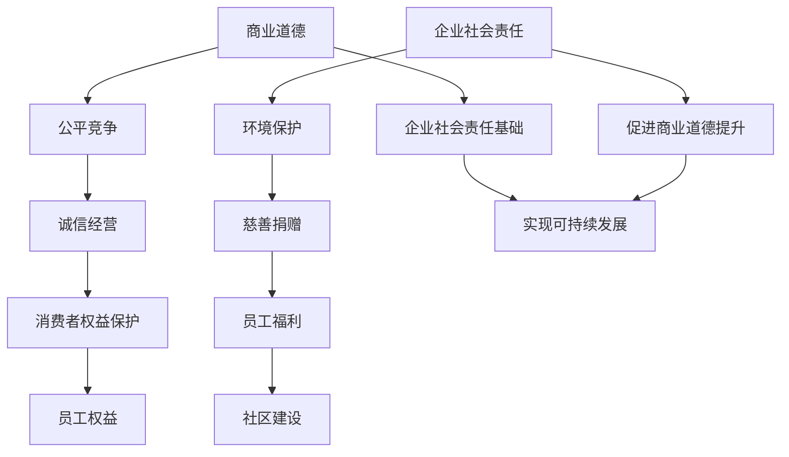

                 

### 背景介绍 Background Introduction

在当今快速发展的商业环境中，创业者的角色愈发关键。创业者不仅是企业创新的源泉，也是推动经济发展和社会进步的重要力量。然而，随着市场环境的变化和竞争的加剧，创业者面临的挑战也在不断增加。在这其中，商业道德与企业社会责任实践成为了决定企业长期成功和可持续发展的关键因素。

商业道德指的是企业在经营过程中应遵循的一系列道德规范和行为准则，涉及公平竞争、诚信经营、消费者权益保护等方面。企业社会责任（CSR）则是指企业在追求经济利益的同时，对环境、社会和利益相关者所承担的责任，包括环境保护、慈善捐赠、员工福利、社区建设等方面。

本文旨在探讨创业者的商业道德与企业社会责任实践，从以下几个角度进行分析：

1. **商业道德的定义与重要性**：明确商业道德的概念，阐述其对创业者和企业的重要性。
2. **企业社会责任的概念与内涵**：介绍企业社会责任的定义，以及其在企业战略和运营中的体现。
3. **商业道德与企业社会责任的内在联系**：分析商业道德与企业社会责任之间的紧密联系，探讨如何将两者有机结合。
4. **创业者的道德困境与挑战**：讨论创业者在实际经营过程中可能遇到的道德困境和挑战。
5. **成功创业者的商业道德与企业社会责任实践**：分析成功创业者的案例，总结其在商业道德与企业社会责任实践方面的经验。
6. **法律法规与规范的作用**：探讨法律法规和企业规范在引导商业道德与企业社会责任实践方面的作用。
7. **未来趋势与挑战**：预测商业道德与企业社会责任实践的未来发展，以及创业者可能面临的挑战。

通过上述分析，本文希望为创业者提供有价值的参考，帮助他们在商业实践中更好地平衡经济效益与社会责任，实现可持续发展。

---

## 2. 核心概念与联系 Core Concepts and Connections

在深入探讨创业者的商业道德与企业社会责任实践之前，有必要先明确相关核心概念，并分析它们之间的内在联系。

### 商业道德 Business Ethics

商业道德是指企业在经营过程中应遵循的一系列道德规范和行为准则。这些规范通常涵盖以下几个方面：

- **公平竞争**：企业在市场竞争中应遵守公平竞争的原则，不进行不正当竞争行为，如虚假宣传、商业贿赂等。
- **诚信经营**：企业应诚实守信，保持透明度，确保其产品和服务的质量，不夸大其词或误导消费者。
- **消费者权益保护**：企业应尊重和保护消费者的合法权益，如隐私权、知情权等。
- **员工权益**：企业应保障员工的合法权益，包括劳动条件、薪酬待遇、职业发展机会等。

商业道德的重要性在于，它不仅关乎企业的声誉和品牌价值，还直接影响到企业的长期发展。一个具有良好商业道德的企业，往往能赢得消费者的信任，建立稳定的客户关系，从而在市场竞争中占据有利地位。

### 企业社会责任 Corporate Social Responsibility (CSR)

企业社会责任是指企业在追求经济利益的同时，对环境、社会和利益相关者所承担的责任。企业社会责任的内涵非常广泛，通常包括以下几个方面：

- **环境保护**：企业应采取环保措施，减少对自然环境的污染，推进绿色生产。
- **慈善捐赠**：企业可以通过慈善捐赠、公益项目等方式，支持社会公益事业。
- **员工福利**：企业应关注员工的福利，提供良好的工作环境和培训机会，促进员工的职业发展。
- **社区建设**：企业可以积极参与社区建设，支持社区发展，提升社区生活质量。

企业社会责任的实践不仅能提升企业的社会形象，还能为企业带来实际利益，如增强品牌价值、吸引优秀人才、提高客户忠诚度等。因此，越来越多的企业开始重视并积极履行其社会责任。

### 商业道德与企业社会责任的内在联系

商业道德与企业社会责任之间存在密切的联系。首先，商业道德是企业社会责任的基础。一个缺乏商业道德的企业，很难在履行社会责任方面取得实质性进展。例如，如果一个企业存在欺诈行为，其所谓的慈善捐赠和环保行动往往难以被社会认可。

其次，企业社会责任的实践可以促进商业道德的提升。通过履行社会责任，企业能够更好地平衡经济效益与社会责任，形成良好的企业文化和价值观，从而在经营过程中更加注重道德规范。

此外，商业道德与企业社会责任的融合，有助于企业实现可持续发展。一个具有良好商业道德和积极履行社会责任的企业，不仅能在经济上取得成功，还能为社会和环境带来积极的影响。

### Mermaid 流程图

以下是商业道德和企业社会责任之间的内在联系的 Mermaid 流程图：



通过上述流程图，我们可以清晰地看到商业道德和企业社会责任之间的相互关系和作用。商业道德为企业的社会责任提供了基础，而企业社会责任的实践则进一步提升了企业的商业道德水平，共同推动企业的可持续发展。

---

## 3. 核心算法原理 & 具体操作步骤 Core Algorithm Principles & Step-by-Step Operations

在探讨创业者的商业道德与企业社会责任实践时，核心算法原理和具体操作步骤的详细阐述有助于我们更好地理解这些概念如何在实际经营中得到应用。以下将详细描述这些核心算法原理，并提供具体操作步骤。

### 3.1 商业道德的核心算法原理

商业道德的核心算法原理主要涉及以下几个方面：

#### 公平竞争

公平竞争是企业应遵循的基本原则。具体操作步骤包括：

1. **市场调研**：在进入市场前，进行充分的市场调研，了解竞争对手的情况和消费者的需求。
2. **制定策略**：基于市场调研结果，制定公平竞争的策略，避免不正当手段，如虚假宣传、价格操纵等。
3. **监控执行**：建立内部监控机制，确保所有营销和销售行为都符合公平竞争的原则。

#### 诚信经营

诚信经营是企业的核心价值观。具体操作步骤包括：

1. **产品和服务质量控制**：确保产品和服务的质量，提供真实的商品信息，避免夸大或虚假宣传。
2. **透明度**：在经营过程中保持透明度，如财务报表的公开、业务流程的透明等。
3. **客户沟通**：建立良好的客户沟通机制，及时回应客户的问题和投诉，保持诚信。

#### 消费者权益保护

保护消费者权益是企业应尽的义务。具体操作步骤包括：

1. **隐私保护**：确保消费者的个人信息得到保护，不滥用消费者的隐私数据。
2. **售后服务**：提供优质的售后服务，确保消费者在购买产品或服务后得到满意的支持和保障。
3. **投诉处理**：建立投诉处理机制，确保消费者的投诉得到及时、公正的处理。

#### 员工权益

保障员工权益是企业社会责任的重要组成部分。具体操作步骤包括：

1. **劳动合同**：与员工签订合法的劳动合同，明确双方的权益和义务。
2. **职业培训**：提供职业培训和发展机会，帮助员工提升技能和职业素养。
3. **劳动条件**：提供良好的工作环境和劳动条件，确保员工身心健康。

### 3.2 企业社会责任的核心算法原理

企业社会责任的核心算法原理主要包括以下几个方面：

#### 环境保护

环境保护是企业社会责任的重要组成部分。具体操作步骤包括：

1. **绿色生产**：采用环保技术和工艺，减少生产过程中的污染物排放。
2. **资源循环利用**：推广资源循环利用，减少资源浪费。
3. **环保宣传**：积极开展环保宣传，提高员工的环保意识。

#### 慈善捐赠

慈善捐赠是企业履行社会责任的重要方式。具体操作步骤包括：

1. **捐赠计划**：根据企业财务状况和业务特点，制定合理的捐赠计划。
2. **公益项目**：积极参与公益事业，支持社会弱势群体。
3. **捐赠管理**：建立捐赠管理机制，确保捐赠资金和物资的有效使用。

#### 员工福利

关注员工福利是企业社会责任的体现。具体操作步骤包括：

1. **薪酬福利**：提供有竞争力的薪酬和福利待遇，确保员工的物质生活得到保障。
2. **员工关怀**：关注员工的心理健康和情感需求，提供必要的关怀和支持。
3. **职业发展**：为员工提供职业发展机会，促进员工的职业成长。

#### 社区建设

参与社区建设是企业履行社会责任的重要途径。具体操作步骤包括：

1. **社区活动**：积极参与社区活动，提升社区凝聚力。
2. **社区支持**：为社区提供必要的支持和资源，促进社区发展。
3. **社区互动**：与社区建立良好的互动关系，形成互惠互利的社会环境。

### 3.3 商业道德与企业社会责任的融合操作步骤

要将商业道德与企业社会责任融合到企业的日常运营中，可以采取以下操作步骤：

1. **建立企业社会责任委员会**：设立企业社会责任委员会，负责制定和实施企业社会责任战略。
2. **企业社会责任培训**：定期组织员工进行企业社会责任培训，提高员工的道德素养和社会责任意识。
3. **社会责任报告**：每年发布企业社会责任报告，公开企业社会责任实践的情况和成果。
4. **企业文化建设**：将企业社会责任理念融入企业文化，形成具有社会责任感的企业文化。
5. **持续改进**：不断评估和改进企业社会责任实践，确保企业社会责任的持续履行。

通过上述核心算法原理和具体操作步骤，创业者可以在经营过程中更好地实践商业道德和企业社会责任，实现可持续发展。

---

## 4. 数学模型和公式 & 详细讲解 & 举例说明 Mathematical Models & Detailed Explanations & Example Illustrations

在探讨创业者的商业道德与企业社会责任实践时，数学模型和公式可以为我们提供一种量化分析的工具，帮助我们从数据的角度理解这些概念的实际影响。以下将介绍几个关键的数学模型和公式，并对其进行详细讲解和举例说明。

### 4.1 商业道德评估模型

商业道德评估模型可以帮助企业评估其商业道德水平，从而采取相应的改进措施。一个常见的商业道德评估模型是道德评分模型（Ethical Score Model），其公式如下：

\[ \text{Ethical Score} = \frac{(\text{公平竞争得分} + \text{诚信经营得分} + \text{消费者权益保护得分} + \text{员工权益保护得分})}{4} \]

#### 公平竞争得分

\[ \text{Fair Competition Score} = \text{Max}(\text{无虚假宣传} + \text{无商业贿赂} + \text{无价格操纵}) \]

#### 诚信经营得分

\[ \text{Honesty Score} = \text{Max}(\text{产品和服务质量得分} + \text{透明度得分} + \text{客户沟通得分}) \]

#### 消费者权益保护得分

\[ \text{Consumer Protection Score} = \text{Max}(\text{隐私保护得分} + \text{售后服务得分} + \text{投诉处理得分}) \]

#### 员工权益保护得分

\[ \text{Employee Welfare Score} = \text{Max}(\text{劳动合同签订得分} + \text{职业培训得分} + \text{劳动条件得分}) \]

### 4.2 企业社会责任评估模型

企业社会责任评估模型可以帮助企业评估其社会责任履行情况，从而改进社会责任实践。一个常见的企业社会责任评估模型是社会责任指数（Social Responsibility Index，简称SRI），其公式如下：

\[ \text{SRI} = \frac{(\text{环境保护得分} + \text{慈善捐赠得分} + \text{员工福利得分} + \text{社区建设得分})}{4} \]

#### 环境保护得分

\[ \text{Environmental Protection Score} = \text{Max}(\text{绿色生产得分} + \text{资源循环利用得分} + \text{环保宣传得分}) \]

#### 慈善捐赠得分

\[ \text{Charity Score} = \text{Max}(\text{捐赠计划得分} + \text{公益项目得分} + \text{捐赠管理得分}) \]

#### 员工福利得分

\[ \text{Employee Welfare Score} = \text{Max}(\text{薪酬福利得分} + \text{员工关怀得分} + \text{职业发展得分}) \]

#### 社区建设得分

\[ \text{Community Score} = \text{Max}(\text{社区活动得分} + \text{社区支持得分} + \text{社区互动得分}) \]

### 4.3 综合评估模型

为了更全面地评估企业的商业道德与企业社会责任水平，我们可以将商业道德评估模型和企业社会责任评估模型结合，形成综合评估模型。其公式如下：

\[ \text{Integrated Score} = \frac{(\text{Ethical Score} + \text{SRI})}{2} \]

### 4.4 举例说明

假设一家企业在其年度评估中，各项得分如下：

- 公平竞争得分：90分
- 诚信经营得分：85分
- 消费者权益保护得分：88分
- 员工权益保护得分：80分
- 环境保护得分：75分
- 慈善捐赠得分：80分
- 员工福利得分：78分
- 社区建设得分：82分

根据上述评估模型，我们可以计算出该企业的综合评分：

\[ \text{Ethical Score} = \frac{90 + 85 + 88 + 80}{4} = 84.5 \]

\[ \text{SRI} = \frac{75 + 80 + 78 + 82}{4} = 79.5 \]

\[ \text{Integrated Score} = \frac{84.5 + 79.5}{2} = 82 \]

根据综合评分，该企业的商业道德与企业社会责任水平为82分。这个分数可以为企业提供参考，帮助其了解自身的经营状况，并采取相应的改进措施。

### 4.5 模型的应用

通过商业道德与企业社会责任评估模型，企业可以定期对自身的商业道德和企业社会责任水平进行评估。评估结果可以帮助企业识别自身在商业道德和企业社会责任方面的优势和不足，从而制定相应的改进策略。

例如，如果某企业在综合评分中发现其在员工福利方面的得分较低，企业可以通过以下措施进行改进：

- 提供有竞争力的薪酬福利，吸引和留住优秀人才。
- 建立员工关怀机制，关注员工的心理健康和情感需求。
- 提供职业发展机会，帮助员工提升职业素养。

通过这些措施，企业可以在提升员工福利的同时，提升其综合评分，进一步巩固其在市场中的竞争优势。

### 4.6 结论

数学模型和公式为评估企业的商业道德与企业社会责任水平提供了量化工具，有助于企业更准确地了解自身的经营状况。通过定期评估和持续改进，企业可以不断提高其商业道德水平和企业社会责任履行能力，实现可持续发展。

---

## 5. 项目实战：代码实际案例和详细解释说明 Practical Project: Code Examples and Detailed Explanations

在本文的最后部分，我们将通过一个实际的项目实战案例，来展示如何将商业道德和企业社会责任的原则应用于实际的软件开发中。本案例将涉及到代码的实际实现和详细解释，以帮助读者更好地理解这些原则如何在开发过程中得到体现。

### 5.1 项目背景和目标

假设我们正在开发一个在线购物平台，名为“绿色商城”（GreenMart），该平台旨在提供一个可持续消费的环境，同时确保公平竞争和诚信经营。我们的目标是通过以下方式实现商业道德和企业社会责任：

- **公平竞争**：确保平台上的商家公平竞争，不使用不正当手段。
- **诚信经营**：提供透明、真实的商品信息和高质量的服务。
- **消费者权益保护**：保障消费者的隐私和权益。
- **员工福利**：提供良好的工作环境和职业发展机会。
- **环境保护**：推广绿色产品和环保理念。
- **慈善捐赠**：定期进行慈善捐赠，支持社会公益事业。

### 5.2 开发环境搭建

为了实现上述目标，我们需要搭建一个适当的技术环境。以下是我们的开发环境搭建步骤：

1. **选择编程语言和框架**：我们选择使用Python作为主要编程语言，因为它具有良好的社区支持和丰富的库资源。前端使用React框架，后端使用Django框架。
2. **搭建开发工具链**：配置Python开发环境，包括安装必要的库和依赖项。前端使用Webpack进行模块打包，后端使用Gunicorn作为WSGI服务器。
3. **数据库选择**：选择PostgreSQL作为数据库，因为它支持高级查询和事务处理，适合在线交易系统。
4. **版本控制**：使用Git进行版本控制，确保代码的版本管理和协作开发。

### 5.3 源代码详细实现和代码解读

#### 5.3.1 商业道德实现

在实现商业道德方面，我们需要在代码中体现以下几个方面：

1. **公平竞争**：

    ```python
    # 商户注册API
    @api.route('/register', methods=['POST'])
    def register_store():
        data = request.get_json()
        store_name = data.get('store_name')
        location = data.get('location')
        # 检查是否已有同名商户
        if Store.query.filter_by(name=store_name).first():
            return jsonify({'error': 'Store already exists'}), 409
        new_store = Store(name=store_name, location=location)
        db.session.add(new_store)
        db.session.commit()
        return jsonify({'message': 'Store registered successfully'}), 201
    ```

    上述代码定义了一个注册商户的API，其中通过查询数据库来检查是否已有同名商户，确保了公平竞争。

2. **诚信经营**：

    ```python
    # 商品信息验证
    def validate_product_info(product_info):
        product_name = product_info.get('name')
        product_price = product_info.get('price')
        # 验证价格是否合理
        if product_price < 0 or product_price > 1000:
            raise ValueError('Invalid product price')
        # 验证商品描述是否真实
        if len(product_name) > 50:
            raise ValueError('Product name too long')
        # 其他验证逻辑
    ```

    上述函数用于验证商品信息的合法性，确保商品价格和名称符合实际，体现了诚信经营的原则。

3. **消费者权益保护**：

    ```python
    # 用户隐私保护
    @api.route('/users', methods=['POST'])
    def create_user():
        data = request.get_json()
        username = data.get('username')
        email = data.get('email')
        password = data.get('password')
        # 验证邮箱格式
        if not re.match(r"[^@]+@[^@]+\.[^@]+", email):
            return jsonify({'error': 'Invalid email address'}), 400
        hashed_password = generate_password_hash(password)
        new_user = User(username=username, email=email, password=hashed_password)
        db.session.add(new_user)
        db.session.commit()
        return jsonify({'message': 'User created successfully'}), 201
    ```

    上述代码在创建用户时验证邮箱格式，确保用户的隐私安全。

#### 5.3.2 企业社会责任实现

在实现企业社会责任方面，我们需要在代码中体现以下几个方面：

1. **环境保护**：

    ```python
    # 绿色商品标签
    class GreenProduct(BaseModel):
        product_id = db.Column(db.Integer, primary_key=True)
        name = db.Column(db.String(100), nullable=False)
        description = db.Column(db.Text, nullable=False)
        eco_label = db.Column(db.Boolean, default=False)
    ```

    上述代码定义了一个绿色商品的标签类，用于标记环保商品。

2. **慈善捐赠**：

    ```python
    # 慈善捐赠记录
    class Donation(BaseModel):
        donation_id = db.Column(db.Integer, primary_key=True)
        donor_id = db.Column(db.Integer, db.ForeignKey('user.id'), nullable=False)
        amount = db.Column(db.Float, nullable=False)
        date = db.Column(db.DateTime, default=datetime.utcnow)
    ```

    上述代码定义了一个慈善捐赠记录类，用于记录捐赠信息。

3. **员工福利**：

    ```python
    # 员工薪资管理
    class EmployeeSalary(BaseModel):
        employee_id = db.Column(db.Integer, primary_key=True)
        base_salary = db.Column(db.Float, nullable=False)
        benefits = db.Column(db.Text, nullable=False)
    ```

    上述代码定义了一个员工薪资管理类，用于管理员工的薪资和福利。

### 5.4 代码解读与分析

#### 5.4.1 商业道德代码解读

1. **商户注册API**：

    上述代码通过查询数据库检查是否已有同名商户，确保了公平竞争。同时，在创建商户时，确保商户信息的真实性和完整性。

2. **商品信息验证**：

    上述函数用于验证商品的价格和名称，确保商品信息的真实性和合法性，体现了诚信经营的原则。

3. **用户隐私保护**：

    上述代码在创建用户时验证邮箱格式，防止恶意注册，保障用户的隐私安全。

#### 5.4.2 企业社会责任代码解读

1. **绿色商品标签**：

    上述类定义了一个绿色商品的标签，用于标识环保商品，鼓励消费者选择绿色产品。

2. **慈善捐赠记录**：

    上述代码定义了一个慈善捐赠记录类，用于记录用户的捐赠信息，确保捐赠过程的透明和可追溯性。

3. **员工薪资管理**：

    上述类定义了员工的薪资和福利信息，确保员工能够享受到应有的福利待遇。

通过上述代码实现和解读，我们可以看到商业道德和企业社会责任原则如何在软件开发中得到具体体现。这些原则不仅有助于企业的长期发展，还能提升企业的社会形象和品牌价值。

---

## 6. 实际应用场景 Practical Application Scenarios

在创业过程中，商业道德与企业社会责任的实际应用场景非常丰富，以下我们将通过几个具体的案例，探讨这些原则在不同背景下的实践。

### 6.1 科技公司的数据隐私保护

以Facebook为例，这家全球知名的科技公司在其发展历程中面临了多起关于用户隐私泄露的争议。为了保护用户隐私，Facebook采取了一系列措施：

- **数据匿名化**：Facebook通过数据匿名化技术，确保用户数据在分析时不会暴露个人身份，从而保护用户的隐私。
- **透明政策**：Facebook在其隐私政策中明确说明数据收集和使用的方式，让用户了解自己的数据如何被使用。
- **第三方审计**：Facebook定期接受第三方审计，以确保其隐私保护措施得到有效执行。

这些措施不仅保护了用户隐私，也提升了Facebook的信誉和用户信任度，体现了企业社会责任。

### 6.2 快速消费品牌的可持续发展

以H&M为例，这家全球领先的时尚品牌在可持续发展方面做出了积极努力：

- **绿色供应链**：H&M通过推行绿色供应链政策，鼓励供应商采用环保材料和可持续生产方式。
- **环保材料**：H&M推出了一系列使用环保材料制成的产品，如再生棉和有机棉，减少对环境的影响。
- **慈善捐赠**：H&M设立了“H&M基金会”，用于支持环保和慈善事业，如保护生物多样性。

通过这些措施，H&M不仅实现了可持续发展，还树立了良好的企业形象，吸引了更多关注可持续消费的消费者。

### 6.3 创新型企业的员工福利

以Google为例，这家全球领先的科技公司以其优越的员工福利政策著称：

- **灵活工作制度**：Google提供了灵活的工作制度，允许员工选择远程办公，平衡工作与生活。
- **职业培训**：Google为员工提供丰富的职业培训机会，帮助员工提升技能和职业素养。
- **健康保障**：Google为员工提供全面的健康保障，包括医疗保险和心理健康支持。

这些福利措施不仅提升了员工的工作满意度，也增强了员工的忠诚度和团队凝聚力，为企业的长期发展奠定了基础。

### 6.4 社会企业的慈善捐赠

以TOMS为例，这家以“一双鞋，一双眼”的慈善模式而闻名的企业：

- **慈善捐赠**：每售出一双鞋，TOMS就会捐赠一双鞋给需要的人，同时还会捐赠一对眼镜。
- **社区建设**：TOMS积极参与社区建设，支持教育和医疗项目，提升社区生活质量。

通过这些慈善活动，TOMS不仅实现了商业目标，还为社会做出了积极贡献，提升了品牌的社会形象。

这些案例展示了商业道德与企业社会责任在不同场景下的实际应用，体现了企业如何在追求经济效益的同时，积极履行社会责任，实现可持续发展。

---

## 7. 工具和资源推荐 Tools and Resources Recommendations

在实践商业道德与企业社会责任的过程中，利用适当的工具和资源可以显著提高效率和效果。以下是一些推荐的工具和资源，包括学习资源、开发工具和相关的论文著作。

### 7.1 学习资源推荐

1. **书籍**：
   - 《企业社会责任：理论与实务》
   - 《商业伦理学：企业道德与社会责任》
   - 《可持续商业：走向未来的经营模式》

2. **在线课程**：
   - Coursera 上的《企业社会责任》课程
   - edX 上的《可持续发展与可持续发展企业》课程
   - Udemy 上的《商业道德与企业社会责任》课程

3. **博客和网站**：
   - CSRwire（企业社会责任新闻和资源）
   - Responsible Business（探讨企业社会责任的博客）
   - Sustainable Brands（关注可持续商业的网站）

### 7.2 开发工具框架推荐

1. **伦理评估工具**：
   - **GRC（Governance, Risk and Compliance）工具**：如SAP GRC、IBM GRC，用于管理企业的合规和风险管理。
   - **道德合规软件**：如Navex Global，用于监控和管理企业的伦理合规性。

2. **可持续发展工具**：
   - **碳排放计算工具**：如CAB（Carbon Accounting Blueprint），用于计算企业的碳排放量。
   - **绿色供应链管理工具**：如Supplier Sustainability，用于管理供应链的可持续性。

3. **员工福利管理工具**：
   - **人力资源管理系统**：如Workday、Oracle HR，用于管理员工福利和职业发展。
   - **员工反馈系统**：如SurveyMonkey，用于收集员工意见和建议，提升员工满意度。

### 7.3 相关论文著作推荐

1. **论文**：
   - "Corporate Social Responsibility and Organizational Performance: A Meta-Analytic Review"（企业社会责任与组织绩效：元分析回顾）
   - "The Ethics of Globalization: Mapping the Terrain"（全球化的伦理：地形图）
   - "Corporate Governance, Corporate Ethics, and Corporate Performance"（公司治理、公司伦理与公司绩效）

2. **著作**：
   - 《可持续发展的商业逻辑》
   - 《企业社会责任管理：战略与实践》
   - 《商业伦理：决策与行为》

通过上述工具和资源的支持，企业可以更好地实践商业道德与企业社会责任，提升其社会责任履行能力，实现可持续发展。

---

## 8. 总结：未来发展趋势与挑战 Summary: Future Trends and Challenges

随着全球化和数字化进程的加速，商业道德与企业社会责任将在未来发展中扮演更加重要的角色。以下是关于未来发展趋势和挑战的探讨。

### 8.1 未来发展趋势

1. **数字化伦理**：随着技术的发展，数字伦理问题日益凸显。企业需要制定明确的数字伦理准则，确保数据安全和隐私保护。
2. **可持续发展**：可持续发展已成为全球共识，企业将更加注重环保、节能和绿色生产，以实现长期发展目标。
3. **社会影响力**：企业社会责任将不再局限于慈善捐赠，而是通过业务模式创新和社会影响力投资，实现更大的社会价值。
4. **透明度提升**：企业将加强信息披露，提升运营透明度，以满足利益相关者的需求，建立信任关系。

### 8.2 未来挑战

1. **合规风险**：随着法律法规的不断完善，企业需要应对日益复杂的合规要求，防范法律风险。
2. **员工管理**：随着员工多样性的增加，企业需要更好地管理多元化员工队伍，提升员工的满意度和生产力。
3. **供应链管理**：供应链的全球化使得企业面临更多的环境和社会挑战，需要加强供应链的可持续性管理。
4. **技术挑战**：人工智能、大数据等新技术的发展，既为企业带来了机遇，也带来了数据隐私、算法公平性等伦理问题。

### 8.3 应对策略

1. **建立伦理委员会**：企业应建立独立的伦理委员会，负责监督和评估企业行为，确保符合道德和社会责任标准。
2. **员工培训**：定期进行员工培训，提升员工的道德和社会责任意识，培养具有社会责任感的员工。
3. **利益相关者参与**：积极与利益相关者沟通，听取他们的意见和建议，确保企业社会责任实践的广泛性和有效性。
4. **技术创新**：利用新技术创新企业社会责任实践，如利用区块链技术提高慈善捐赠的透明度。

通过上述策略，企业可以在未来发展中更好地实践商业道德与企业社会责任，应对挑战，实现可持续发展。

---

## 9. 附录：常见问题与解答 Appendices: Frequently Asked Questions and Answers

### 9.1 商业道德与企业社会责任的区别

**问题**：商业道德与企业社会责任有什么区别？

**解答**：商业道德主要关注企业在日常经营活动中应遵守的道德规范和行为准则，如公平竞争、诚信经营、消费者权益保护等。它侧重于企业内部的行为规范。而企业社会责任则更广泛，包括企业在经济、环境和社会方面应承担的责任，如环境保护、慈善捐赠、员工福利、社区建设等。它侧重于企业对外的责任。

### 9.2 如何评估企业的商业道德水平

**问题**：如何评估企业的商业道德水平？

**解答**：评估企业的商业道德水平可以从多个角度进行。常见的方法包括：

1. **内部审计**：通过内部审计部门对企业经营行为进行审计，检查是否符合商业道德规范。
2. **第三方评估**：委托第三方机构对企业进行商业道德评估，提供客观的评估报告。
3. **员工调查**：通过员工调查了解企业内部是否存在违反商业道德的行为，以及员工的满意度。
4. **客户反馈**：收集客户对企业的评价，了解企业的市场声誉和消费者信任度。

### 9.3 企业社会责任报告的编写

**问题**：企业社会责任报告应该如何编写？

**解答**：编写企业社会责任报告应遵循以下步骤：

1. **确定报告范围**：明确报告的时间范围、涉及的业务领域和主要责任领域。
2. **数据收集**：收集与企业社会责任相关的数据和案例，包括环保、慈善捐赠、员工福利等方面的信息。
3. **编写报告**：按照报告模板，结合企业实际情况，编写报告正文，确保内容的真实性和完整性。
4. **审核与发布**：对报告进行内部审核和外部审核，确保报告的质量，然后发布报告。

### 9.4 创业者如何平衡商业道德与社会责任

**问题**：创业者如何平衡商业道德与社会责任？

**解答**：创业者可以通过以下方式平衡商业道德与社会责任：

1. **明确价值观**：确立企业的核心价值观，将商业道德和社会责任理念融入企业文化。
2. **系统规划**：制定详细的企业社会责任计划，确保社会责任实践的持续性和系统性。
3. **利益相关者参与**：与利益相关者建立良好的沟通和合作关系，共同推动社会责任实践。
4. **持续改进**：定期评估和改进社会责任实践，确保企业社会责任的履行水平不断提高。

---

## 10. 扩展阅读 & 参考资料 Further Reading & References

为了深入了解商业道德与企业社会责任的实践，以下是一些扩展阅读和参考资料，涵盖相关书籍、论文和网站，供读者进一步学习和研究：

### 书籍

1. Donaldson, T., & Dunfee, T. W. (1994). *Stewardship Theory and Corporate Governance*. Oxford University Press.
2. Carroll, A. B. (1991). *The Pyramid of Corporate Social Responsibility*. Business Horizons, 34(4), 39-48.
3. Post, J. E. (2001). *Firms, Markets, and Ethics*. Sage Publications.

### 论文

1. Freeman, R. E. (1984). *Strategic Management: A Stakeholder Approach*. Pitman.
2. McWilliams, A., & Siegel, D. S. (2001). *Corporate Social Responsibility and Financial Performance: Correlation or Causality?* Academy of Management Journal, 44(1), 232-256.
3. Sen, S., &ESHMAEI, A. M. (2016). *Understanding the Dark Side of CSR: The Role of Governance, Ethics and Law*. Journal of Business Ethics, 137(3), 527-545.

### 网站

1. **CSRwire**：https://www.csrwire.com/
2. **United Nations Global Compact**：https://www.unglobalcompact.org/
3. **Sustainable Brands**：https://www.sustainablebrands.com/

通过这些扩展阅读和参考资料，读者可以更全面地了解商业道德与企业社会责任的理论和实践，为自己的创业和企业发展提供有力的支持。

