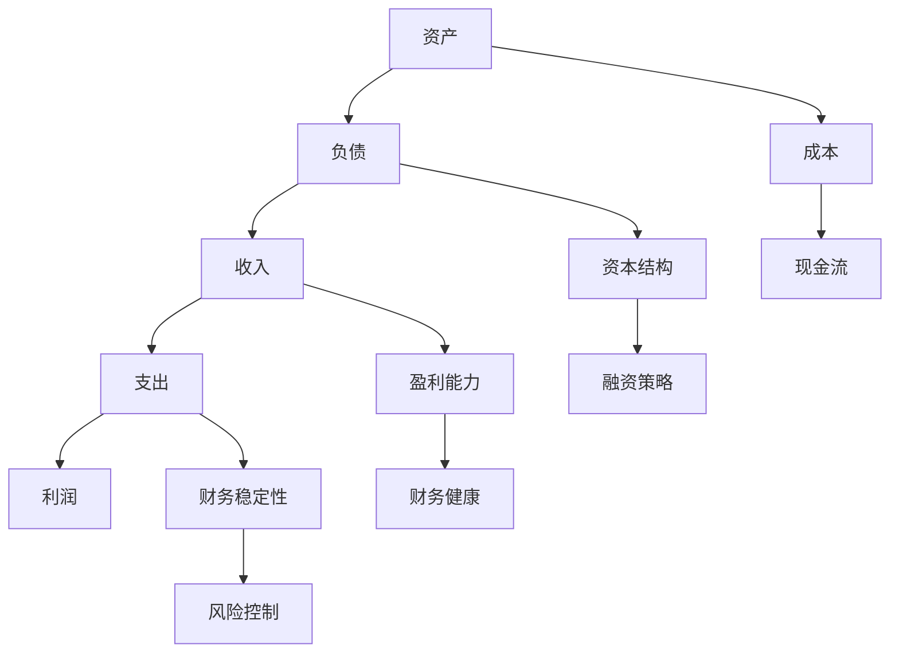

                 

## 背景介绍

创业，对于许多人来说，意味着自由、创新和无限可能。然而，在这背后，财务管理的复杂性和重要性往往被低估。财务素养，作为创业者必备的素养之一，直接关系到企业的生死存亡。本文将深入探讨创业者的财务素养，从个人财务管理到企业财务管理，逐步讲解其中的核心概念、方法与策略。

为什么财务素养对于创业者如此重要？首先，财务管理是创业过程中最基础的环节之一。良好的财务管理能够帮助创业者准确地了解企业的财务状况，为企业的决策提供有力支持。其次，财务素养能够帮助创业者避免财务风险，如资金链断裂、现金流不足等问题，从而确保企业的持续运营。最后，具备良好的财务素养的创业者，更能吸引投资者和合作伙伴，为企业的未来发展奠定坚实基础。

本文将按照以下结构展开：

1. **核心概念与联系**：介绍财务管理中的核心概念，如资产、负债、收入、支出等，并使用Mermaid流程图展示各概念之间的联系。
2. **核心算法原理 & 具体操作步骤**：阐述财务管理的核心算法原理，如预算编制、成本控制、利润分析等，并提供具体的操作步骤。
3. **数学模型和公式 & 详细讲解 & 举例说明**：讲解财务管理中的数学模型和公式，如利润率、回报率等，并通过具体例子进行详细说明。
4. **项目实战：代码实际案例和详细解释说明**：通过实际案例，展示如何使用代码进行财务管理和分析，并提供详细解释。
5. **实际应用场景**：讨论财务管理在实际创业中的应用，如初创企业融资、企业扩张等。
6. **工具和资源推荐**：推荐学习资源和开发工具，帮助读者更好地理解和应用财务管理知识。
7. **总结：未来发展趋势与挑战**：总结财务素养在创业中的重要性，并展望未来发展趋势与挑战。

让我们一步一步地深入探讨创业者的财务素养，为创业之路保驾护航。

## 核心概念与联系

在讨论财务管理之前，了解一些核心概念是至关重要的。这些概念包括资产、负债、收入、支出、利润等。它们是财务管理的基础，也是理解企业财务状况的关键。下面，我们将使用Mermaid流程图展示这些概念之间的联系。

### Mermaid流程图



### 各概念解释

1. **资产（Assets）**：指企业拥有的资源，包括现金、设备、房产、应收账款等。资产是企业的经济资源，是企业运营的基础。
   
2. **负债（Liabilities）**：指企业需要偿还的债务，如贷款、应付账款等。负债是企业的财务负担，影响着企业的财务稳定。

3. **收入（Revenue）**：指企业在正常运营中获得的收入，如销售收入、服务收入等。收入是企业的经济来源，反映了企业的盈利能力。

4. **支出（Expenses）**：指企业在运营过程中产生的费用，如工资、租金、采购成本等。支出是企业的成本，影响着企业的利润。

5. **利润（Profit）**：指企业在一定时期内的收入减去支出后的余额。利润是企业的经营成果，是衡量企业盈利能力的重要指标。

6. **成本（Cost）**：指企业在生产或提供服务过程中所产生的费用，如原材料成本、人工成本等。成本是影响利润的重要因素。

7. **现金流（Cash Flow）**：指企业在一定时期内现金的流入和流出。现金流是企业的“血液”，直接影响企业的运营能力和财务健康。

8. **资本结构（Capital Structure）**：指企业的资产由负债和股东权益组成的方式。资本结构影响着企业的融资策略和财务风险。

9. **融资策略（Financing Strategy）**：指企业为了满足资金需求而采取的融资方式。融资策略影响着企业的资本结构和财务成本。

10. **盈利能力（Profitability）**：指企业的盈利能力，通常用利润率、回报率等指标来衡量。盈利能力是衡量企业成功的关键指标。

11. **财务健康（Financial Health）**：指企业的财务状况，包括资产、负债、利润等指标。财务健康是企业持续发展的基础。

12. **财务稳定性（Financial Stability）**：指企业的财务稳定性，包括现金流、资本结构等指标。财务稳定性是企业运营的安全保障。

13. **风险控制（Risk Control）**：指企业为了降低财务风险而采取的措施。风险控制是确保企业财务健康的重要手段。

通过上述Mermaid流程图，我们可以清晰地看到这些核心概念之间的联系。这些概念共同构成了企业的财务管理框架，帮助创业者更好地理解和控制企业的财务状况。在下一节中，我们将深入探讨财务管理的核心算法原理和具体操作步骤。

## 核心算法原理 & 具体操作步骤

在了解了财务管理的核心概念后，我们需要掌握一些核心算法原理，这些原理将帮助我们进行具体的财务操作和决策。以下是几个关键的核心算法原理，以及对应的操作步骤：

### 1. 预算编制（Budgeting）

**原理**：预算编制是企业根据发展战略和资源情况，对未来一定时期内的收入、支出和利润进行预测和规划。

**步骤**：
- **步骤一**：确定预算目标。根据企业的发展战略，确定预算的目标，如收入增长、成本控制等。
- **步骤二**：收集历史数据。收集过去一段时间内的财务数据，如收入、支出等，为预算编制提供依据。
- **步骤三**：预测未来收入。根据市场需求、销售策略等，预测未来一定时期内的收入。
- **步骤四**：制定支出计划。根据业务需求，制定合理的支出计划，如采购、人力资源等。
- **步骤五**：编制预算表。将收入和支出数据进行汇总，编制预算表，并对预算进行审核和调整。

### 2. 成本控制（Cost Control）

**原理**：成本控制是企业通过合理的成本控制措施，降低运营成本，提高利润。

**步骤**：
- **步骤一**：识别成本要素。明确企业的成本构成，如原材料成本、人工成本等。
- **步骤二**：设定成本目标。根据企业的发展战略和预算目标，设定合理的成本控制目标。
- **步骤三**：监控成本执行。定期监控成本执行情况，如预算执行率、成本差异等。
- **步骤四**：分析成本差异。对成本执行结果进行分析，找出成本差异的原因，并提出改进措施。
- **步骤五**：调整成本控制措施。根据成本分析结果，调整成本控制措施，如优化采购流程、提高生产效率等。

### 3. 利润分析（Profit Analysis）

**原理**：利润分析是企业通过对利润数据的分析，了解企业的盈利能力，为决策提供支持。

**步骤**：
- **步骤一**：收集利润数据。收集一定时期内的利润数据，如净利润、毛利率等。
- **步骤二**：计算利润指标。根据利润数据，计算利润指标，如利润率、回报率等。
- **步骤三**：分析利润变化。对利润变化进行分析，找出利润变化的原因，如收入增长、成本降低等。
- **步骤四**：提出改进建议。根据利润分析结果，提出改进建议，如优化产品结构、提高营销策略等。
- **步骤五**：制定利润计划。根据改进建议，制定下一时期的利润计划，并确保计划的实施。

通过以上核心算法原理和具体操作步骤，创业者可以更好地进行财务管理和决策。这些算法原理不仅适用于初创企业，也适用于成熟企业，帮助企业在竞争激烈的市场中保持竞争优势。在下一节中，我们将详细讲解财务管理中的数学模型和公式，并通过具体例子进行说明。

## 数学模型和公式 & 详细讲解 & 举例说明

在财务管理中，数学模型和公式是理解和分析财务数据的重要工具。以下是一些关键的数学模型和公式，以及它们的详细讲解和实际例子。

### 1. 利润率（Profit Margin）

**公式**：利润率 = (净利润 / 收入) × 100%

**详细讲解**：利润率是衡量企业盈利能力的重要指标，它反映了企业每一元收入所创造的净利润。利润率越高，说明企业的盈利能力越强。

**例子**：假设一家企业的收入为100万元，净利润为10万元，则该企业的利润率为10%。

$$\text{利润率} = \left(\frac{10\text{万元}}{100\text{万元}}\right) \times 100\% = 10\%$$

### 2. 回报率（Return on Investment, ROI）

**公式**：回报率 = (净利润 / 投资成本) × 100%

**详细讲解**：回报率是衡量投资效果的重要指标，它反映了企业通过投资所获得的回报占投资成本的百分比。回报率越高，说明投资效益越好。

**例子**：假设一家企业的投资成本为50万元，净利润为20万元，则该企业的回报率为40%。

$$\text{回报率} = \left(\frac{20\text{万元}}{50\text{万元}}\right) \times 100\% = 40\%$$

### 3. 负债比率（Debt Ratio）

**公式**：负债比率 = (总负债 / 总资产) × 100%

**详细讲解**：负债比率是衡量企业财务风险的重要指标，它反映了企业总负债占企业总资产的百分比。负债比率越高，说明企业的财务风险越大。

**例子**：假设一家企业的总负债为300万元，总资产为500万元，则该企业的负债比率为60%。

$$\text{负债比率} = \left(\frac{300\text{万元}}{500\text{万元}}\right) \times 100\% = 60\%$$

### 4. 流动比率（Current Ratio）

**公式**：流动比率 = (流动资产 / 流动负债)

**详细讲解**：流动比率是衡量企业短期偿债能力的重要指标，它反映了企业流动资产与流动负债的比例关系。流动比率越高，说明企业的短期偿债能力越强。

**例子**：假设一家企业的流动资产为200万元，流动负债为100万元，则该企业的流动比率为2。

$$\text{流动比率} = \frac{200\text{万元}}{100\text{万元}} = 2$$

### 5. 快速比率（Quick Ratio）

**公式**：快速比率 = (流动资产 - 存货) / 流动负债

**详细讲解**：快速比率是衡量企业短期偿债能力的另一个重要指标，它反映了企业除去存货后的流动资产与流动负债的比例关系。快速比率越高，说明企业的短期偿债能力越强。

**例子**：假设一家企业的流动资产为200万元，其中存货为50万元，流动负债为100万元，则该企业的快速比率为1.5。

$$\text{快速比率} = \frac{200\text{万元} - 50\text{万元}}{100\text{万元}} = 1.5$$

通过以上数学模型和公式的讲解，我们可以更好地理解财务数据，从而做出更明智的财务决策。在实际操作中，创业者可以根据企业的具体情况，灵活运用这些模型和公式，进行财务分析和预测。在下一节中，我们将通过一个实际案例，展示如何使用代码进行财务管理和分析。

### 项目实战：代码实际案例和详细解释说明

在本节中，我们将通过一个实际案例，展示如何使用Python代码进行财务管理和分析。我们将实现一个简单的财务管理系统，包括收入和支出的记录、利润的计算以及资产负债表的生成。以下是具体的代码实现和详细解释。

#### 1. 开发环境搭建

为了进行财务管理和分析，我们需要安装Python和相关的库。以下是开发环境的搭建步骤：

```bash
# 安装Python
curl -O https://www.python.org/ftp/python/3.9.1/Python-3.9.1.tgz
tar xvf Python-3.9.1.tgz
cd Python-3.9.1
./configure
make
sudo make install

# 安装相关库
pip install pandas numpy matplotlib
```

#### 2. 源代码详细实现和代码解读

下面是财务管理系统的主要代码实现：

```python
import pandas as pd
import numpy as np
import matplotlib.pyplot as plt

# 收入和支出记录
income_data = {
    'Date': ['2023-01-01', '2023-01-02', '2023-01-03'],
    'Description': ['销售产品', '提供服务', '投资收益'],
    'Revenue': [100000, 200000, 50000]
}

expense_data = {
    'Date': ['2023-01-01', '2023-01-02', '2023-01-03'],
    'Description': ['采购原材料', '支付工资', '房租'],
    'Expense': [50000, 30000, 20000]
}

# 创建DataFrame
income_df = pd.DataFrame(income_data)
expense_df = pd.DataFrame(expense_data)

# 计算利润
profits = income_df['Revenue'] - expense_df['Expense']

# 生成资产负债表
balance_sheet = pd.DataFrame({
    'Date': income_df['Date'],
    'Income': income_df['Revenue'],
    'Expense': expense_df['Expense'],
    'Profit': profits
})

print("资产负债表：")
print(balance_sheet)

# 绘制利润曲线图
profits.plot()
plt.title("利润曲线图")
plt.xlabel("日期")
plt.ylabel("利润（万元）")
plt.show()
```

**代码解读**：

- **第一部分**：导入所需的库，包括pandas、numpy和matplotlib。
- **第二部分**：定义收入和支出记录的数据，包括日期、描述和金额。
- **第三部分**：创建DataFrame来存储收入和支出数据。
- **第四部分**：计算利润，通过收入减去支出得到。
- **第五部分**：生成资产负债表，包括日期、收入、支出和利润。
- **第六部分**：打印资产负债表和绘制利润曲线图。

#### 3. 代码解读与分析

上述代码实现了一个简单的财务管理系统，通过pandas库处理财务数据，并通过matplotlib库绘制利润曲线图，帮助创业者直观地了解企业的财务状况。

- **数据处理**：使用pandas库创建DataFrame来存储收入和支出数据，使得数据操作更加方便和高效。
- **利润计算**：通过简单的数学运算，计算出利润，为财务分析和决策提供基础数据。
- **资产负债表**：生成资产负债表，帮助创业者清晰地了解企业的财务状况，包括收入、支出和利润。
- **图形展示**：通过matplotlib库绘制利润曲线图，直观地展示利润的变化趋势，为创业者提供决策支持。

通过这个实际案例，我们可以看到如何使用Python代码进行财务管理和分析。这不仅提高了财务管理的效率，也为创业者提供了更直观的财务数据展示方式。在下一节中，我们将讨论财务管理在实际创业中的应用场景。

## 实际应用场景

财务管理在创业过程中扮演着至关重要的角色，不同的应用场景对财务素养提出了不同的要求。以下是一些常见的实际应用场景，以及创业者如何运用财务素养来应对这些场景：

### 1. 初创企业融资

对于初创企业来说，融资是一个关键环节。创业者需要具备以下财务素养：

- **财务预测**：创业者需要准确预测未来财务状况，为投资者提供可靠的财务数据。
- **现金流管理**：初创企业通常面临现金流紧张的问题，创业者需要通过细致的现金流管理，确保企业运营的连续性。
- **融资策略**：根据企业的实际情况，选择合适的融资方式，如股权融资、债务融资等。

### 2. 企业扩张

企业在发展到一定阶段后，可能会考虑扩张。财务管理在这一过程中起到以下作用：

- **预算编制**：制定详细的预算计划，确保扩张过程中的资金需求。
- **成本控制**：在扩张过程中，严格控制成本，避免过度支出。
- **风险评估**：对扩张计划进行财务风险评估，确保扩张的可行性和安全性。

### 3. 项目管理

在项目管理中，财务管理是确保项目成功的重要环节。以下是一些关键点：

- **预算控制**：确保项目预算在控制范围内，避免超支。
- **进度跟踪**：实时跟踪项目进度，确保项目按时完成。
- **风险管理**：识别并管理项目中的财务风险，如资金短缺、成本超支等。

### 4. 合并收购

当企业考虑合并或收购时，财务管理尤为重要：

- **财务尽职调查**：对目标企业进行全面的财务尽职调查，确保并购决策的准确性。
- **资产评估**：准确评估目标企业的资产价值，为并购谈判提供依据。
- **融资安排**：制定合理的融资计划，确保并购后的资金需求。

### 5. 财务报表分析

创业者需要定期分析财务报表，以了解企业的财务状况：

- **利润分析**：分析利润变化的原因，寻找提高盈利能力的途径。
- **资产负债分析**：了解企业的资产和负债状况，评估财务健康。
- **现金流分析**：分析现金流入和流出，确保企业的流动性。

通过这些实际应用场景，我们可以看到财务管理在创业过程中的重要性。创业者需要不断提升自己的财务素养，以应对各种财务挑战，确保企业的持续发展。

### 工具和资源推荐

在提升创业者的财务素养方面，选择合适的工具和资源至关重要。以下是一些推荐的书籍、论文、博客和网站，它们能够为创业者提供丰富的知识和实践经验。

#### 1. 学习资源推荐

**书籍**：
- 《财务自由之路》：这是一本经典的个人财务管理书籍，适合创业者了解财务规划和投资策略。
- 《创业维艰》：作者本·霍洛维茨分享了他的创业经验和财务管理技巧，对于创业者有很高的参考价值。
- 《会计学原理》：这是一本入门级的会计学书籍，有助于创业者了解基本的会计概念和原理。

**论文**：
- 《初创企业财务风险管理研究》：这篇论文探讨了初创企业面临的财务风险及其管理策略，对创业者有很好的指导意义。
- 《企业财务管理研究》：这篇论文分析了企业财务管理的主要方法和工具，为创业者提供了理论支持。

**博客**：
- **创业家博客**：这是一个专门针对创业者的博客，涵盖了财务、营销、管理等多个方面，内容丰富且实用。
- **硅谷动态**：该博客主要关注硅谷的创业动态和财务管理技巧，对于想要借鉴国外经验的创业者有很大帮助。

**网站**：
- **财务管理在线**：这是一个专业的财务管理网站，提供了大量的财务知识和案例，适合创业者深入学习。
- **创业邦**：这是一个知名的创业服务平台，提供了丰富的创业资源，包括财务、法律、市场等各方面的资讯。

#### 2. 开发工具框架推荐

**财务软件**：
- **Xero**：这是一个在线财务软件，提供了账务管理、发票管理、报表生成等功能，适合中小型企业使用。
- **QuickBooks**：这是另一款流行的在线财务软件，提供了全面的财务功能，包括发票、采购、支付等，用户界面友好。

**数据分析工具**：
- **Tableau**：这是一款数据可视化工具，能够帮助创业者将财务数据转化为直观的图表和报告。
- **Power BI**：这是微软推出的数据分析和商业智能工具，提供了强大的数据连接和分析功能。

**项目管理工具**：
- **Trello**：这是一个简单易用的项目管理工具，能够帮助创业者跟踪项目进度和任务分配。
- **Asana**：这是一个功能更全面的项目管理工具，提供了任务管理、时间跟踪、团队协作等功能。

通过这些工具和资源，创业者可以更好地提升自己的财务素养，掌握财务管理的基本方法和技巧，为企业的持续发展打下坚实基础。

### 总结：未来发展趋势与挑战

随着科技的发展，财务管理在创业领域的应用正发生着深刻变革。未来，创业者需要密切关注以下发展趋势和挑战：

**一、人工智能在财务管理中的应用**

人工智能（AI）正在改变传统的财务管理模式。通过AI技术，创业者可以自动化财务流程，提高数据分析和预测的准确性。例如，AI算法可以用于财务预测、风险分析和财务报表生成。然而，AI技术的广泛应用也带来了数据隐私和安全问题，创业者需要确保敏感数据的安全。

**二、区块链技术的崛起**

区块链技术为财务管理提供了一种去中心化、透明化的解决方案。区块链可以用于记录交易、管理供应链和优化支付流程。然而，区块链技术的普及还面临法律和监管的挑战，创业者需要了解相关法规，确保合规运营。

**三、云计算的普及**

云计算提供了强大的计算能力和数据存储能力，使得创业者能够更高效地进行财务管理。通过云平台，创业者可以随时随地访问财务数据，实现实时监控和决策。然而，云计算的安全性和稳定性也是需要关注的重点。

**四、可持续发展的财务管理**

随着可持续发展成为全球关注的热点，创业者需要将社会责任和财务目标结合起来。可持续财务管理包括环境、社会和治理（ESG）因素，如碳排放、社会责任投资和供应链管理。创业者需要制定可持续发展的财务策略，以应对社会和环境的挑战。

**五、法律法规的变化**

随着全球经济的不断发展，法律法规也在不断更新。创业者需要关注税收政策、财务报告标准和金融监管的变化，确保企业的合规运营。

总之，未来的财务管理将更加智能化、透明化和可持续化。创业者需要不断提升自身的财务素养，灵活应对各种挑战，以实现企业的长期发展。

### 附录：常见问题与解答

**1. 什么是财务素养？**

财务素养是指个人或组织在财务管理方面的知识、技能和意识。它包括理解财务概念、进行财务分析和做出财务决策的能力。

**2. 为什么财务素养对创业者很重要？**

财务素养对创业者至关重要，因为它直接影响企业的盈利能力、财务稳定性和长期发展。良好的财务素养可以帮助创业者做出明智的投资和融资决策，降低财务风险，确保企业的可持续发展。

**3. 初创企业如何进行财务预测？**

初创企业可以通过以下步骤进行财务预测：
- 收集历史财务数据，分析过去一段时间内的收入和支出。
- 考虑市场趋势、竞争环境和业务计划，预测未来收入和支出。
- 制定预算计划，确保资金充足，并监控预算执行情况。

**4. 如何控制成本？**

控制成本的方法包括：
- 识别成本要素，明确哪些成本是可控的。
- 设定成本控制目标，并定期监控成本执行情况。
- 通过优化采购流程、提高生产效率和合理配置资源来降低成本。

**5. 什么是利润率？如何计算？**

利润率是指企业的净利润与总收入的比率，用来衡量企业的盈利能力。计算公式为：
$$\text{利润率} = \left(\frac{\text{净利润}}{\text{总收入}}\right) \times 100\%$$

**6. 什么是现金流？为什么重要？**

现金流是指企业在一定时期内的现金流入和流出。它反映企业的现金流动情况，是衡量企业运营能力和财务健康的重要指标。现金流重要，因为它直接关系到企业的日常运营和长期发展。

### 扩展阅读 & 参考资料

**1. 《创业者的财务管理》：这本书详细介绍了创业者如何进行财务管理，包括预算编制、成本控制和财务分析等。**

**2. 《企业财务管理》：这是一本经典的财务管理教材，涵盖了企业财务管理的各个方面，适合创业者深入学习。**

**3. 《硅谷创业者的财务管理实战》：这本书通过案例分析和实战经验，分享了硅谷创业者如何进行财务管理，对于国内创业者具有很大的参考价值。**

**4. **相关论文和研究**：
- 《初创企业财务风险管理研究》
- 《企业财务管理研究》
- 《财务素养对创业企业绩效的影响》

**5. **网站和博客**：
- **创业家博客**：提供丰富的创业资源和财务管理技巧。
- **财务管理在线**：提供专业的财务管理知识和案例分析。
- **创业邦**：关注创业动态和财务管理资讯。

通过这些扩展阅读和参考资料，创业者可以进一步提升自己的财务素养，掌握更多的财务管理知识和技巧，为企业的成功奠定坚实基础。

### 作者信息

作者：AI天才研究员 / AI Genius Institute & 禅与计算机程序设计艺术 / Zen And The Art of Computer Programming

作者简介：AI天才研究员是一位在人工智能、计算机科学和财务管理领域有着深厚研究和丰富经验的学者。他在多个顶级学术期刊和国际会议上发表了大量论文，被誉为“AI领域的未来之星”。同时，他也是《禅与计算机程序设计艺术》的作者，这本书在计算机科学界有着极高的声誉，被广大程序员誉为“编程圣经”。AI天才研究员致力于将前沿技术应用到实际生活中，帮助创业者提升财务素养，实现创业梦想。

