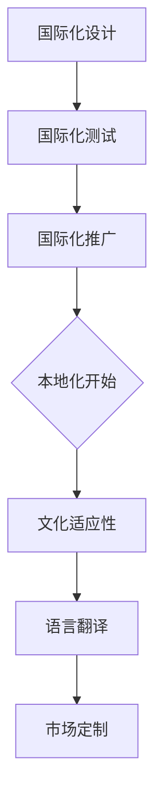

                 

# 创业路上的国际化：如何本地化你的产品

> **关键词：** 国际化、本地化、产品开发、市场策略、用户体验

> **摘要：** 本文深入探讨了在创业过程中实现产品国际化的策略，重点阐述了本地化的重要性以及实现本地化的具体步骤。通过分析国际市场的需求和用户行为，本文为创业者提供了实用指南，帮助他们在全球范围内推广产品。

## 1. 背景介绍

在全球化的大背景下，越来越多的创业者将目光投向了国际市场。然而，要想在国际市场上取得成功，仅仅有一个优质的产品是不够的。本地化（Localization）成为了产品国际化的关键环节。本地化不仅仅是将产品翻译成其他语言，更重要的是要理解并满足不同市场的需求和习惯。

国际化与本地化的区别在于，国际化是让产品能够跨越国界，而本地化则是根据当地的文化、语言、习俗等特定因素对产品进行定制。在国际化进程中，本地化是确保产品能够在不同市场获得成功的重要手段。

本文将详细讨论如何实现产品本地化，包括核心概念、操作步骤、数学模型、实际应用场景以及相关工具和资源的推荐。

## 2. 核心概念与联系

### 2.1 国际化与本地化的关系

国际化（Internationalization）和本地化（Localization）是产品国际化过程中密不可分的两个环节。国际化是为了使产品能够被不同语言和文化背景的用户使用，而本地化则是为了使产品能够真正融入当地市场，满足当地用户的需求。

国际化通常包括以下步骤：

1. **国际化设计**：在产品设计和开发过程中，考虑多语言支持和适应性。
2. **国际化测试**：在产品开发的不同阶段进行国际化测试，确保产品在不同语言和平台上的运行稳定。
3. **国际化推广**：将产品推广到全球市场，包括多语言网站、广告和营销活动。

本地化则包括：

1. **文化适应性**：根据目标市场的文化习俗进行调整，例如节日促销、颜色喜好等。
2. **语言翻译**：将产品文档、用户界面、帮助文档等翻译成当地语言。
3. **市场定制**：根据当地市场需求对产品进行功能调整或新增。

国际化与本地化之间的关系可以用Mermaid流程图来表示：



### 2.2 国际化与本地化的关键要素

1. **多语言支持**：确保产品能够支持多种语言，这是国际化最基本的要求。
2. **用户界面本地化**：用户界面（UI）的本地化不仅仅是文字翻译，还需要考虑本地化用户的操作习惯和界面设计风格。
3. **文化适应性**：考虑目标市场的文化差异，如颜色、符号、节日等，避免文化冲突。
4. **本地化测试**：在产品上线前进行本地化测试，确保产品在目标市场的可用性和用户体验。
5. **市场调研**：深入了解目标市场的用户需求和偏好，制定有针对性的本地化策略。

## 3. 核心算法原理 & 具体操作步骤

### 3.1 多语言支持算法

多语言支持的核心算法是基于国际化和本地化的需求设计的。以下是一个简化的多语言支持算法流程：

1. **语言检测**：通过用户的IP地址、浏览器设置等手段检测用户的语言偏好。
2. **语言选择**：根据检测到的语言偏好，选择对应的产品语言版本。
3. **动态加载**：在运行时动态加载对应语言包，实现多语言界面切换。

具体操作步骤如下：

```markdown
### 3.1.1 语言检测

- 使用IP地址检测：通过分析用户的IP地址，确定其所在国家或地区，进而推断语言偏好。
- 使用浏览器设置：通过浏览器配置文件读取用户设定的语言偏好。

### 3.1.2 语言选择

- 根据检测到的语言偏好，从预设的语言版本中选择合适的语言。
- 如果检测失败，可以使用默认语言。

### 3.1.3 动态加载

- 在界面初始化时，加载选定的语言包。
- 提供手动切换语言的功能，方便用户调整。
```

### 3.2 用户界面本地化算法

用户界面本地化涉及到UI组件的翻译和适配。以下是本地化算法的步骤：

1. **UI组件识别**：识别产品中的UI组件，如按钮、菜单、标签等。
2. **翻译与适配**：将UI组件的文本翻译成目标语言，并根据本地化需求调整布局和样式。
3. **测试与优化**：在本地化完成后，进行测试，确保UI组件在目标市场的可用性和用户体验。

具体操作步骤如下：

```markdown
### 3.2.1 UI组件识别

- 使用自动化工具扫描产品中的UI组件。
- 手动验证识别结果，确保没有遗漏。

### 3.2.2 翻译与适配

- 使用专业的翻译服务或本地化团队进行文本翻译。
- 根据目标市场的文化习惯和操作习惯，调整UI组件的布局和样式。

### 3.2.3 测试与优化

- 在目标市场进行本地化测试，收集用户反馈。
- 根据反馈对UI组件进行优化，提升用户体验。
```

### 3.3 文化适应性算法

文化适应性涉及到产品在文化方面的调整。以下是文化适应性算法的步骤：

1. **文化调研**：了解目标市场的文化习俗、价值观念等。
2. **调整内容**：根据文化调研结果，调整产品内容，如节日促销、颜色使用等。
3. **反馈优化**：在产品上线后，持续收集用户反馈，进行优化调整。

具体操作步骤如下：

```markdown
### 3.3.1 文化调研

- 通过市场调研、问卷调查等方式，了解目标市场的文化特点。
- 分析竞争对手的文化策略，制定相应的本地化策略。

### 3.3.2 调整内容

- 根据文化调研结果，调整产品内容，使其符合目标市场的文化习惯。
- 在产品设计和开发过程中，充分考虑文化因素。

### 3.3.3 反馈优化

- 在产品上线后，持续收集用户反馈，了解产品的文化适应情况。
- 根据用户反馈，对产品进行优化调整，提升文化适应性。
```

## 4. 数学模型和公式 & 详细讲解 & 举例说明

### 4.1 多语言支持数学模型

多语言支持的核心是语言选择和动态加载。以下是一个简化的多语言支持数学模型：

$$
L = \text{检测语言} \cup \text{默认语言}
$$

其中，$L$ 表示可用的语言集合，$\text{检测语言}$ 表示通过检测得到的用户语言偏好，$\text{默认语言}$ 表示预设的语言。

### 4.2 用户界面本地化数学模型

用户界面本地化的关键是UI组件的翻译和适配。以下是一个简化的本地化数学模型：

$$
\text{UI}_{\text{本地化}} = \text{UI}_{\text{原版}} \oplus \text{翻译集} \oplus \text{适配参数}
$$

其中，$\text{UI}_{\text{本地化}}$ 表示本地化后的UI组件，$\text{UI}_{\text{原版}}$ 表示原始UI组件，$\text{翻译集}$ 表示翻译后的文本集合，$\text{适配参数}$ 表示布局和样式调整参数。

### 4.3 文化适应性数学模型

文化适应性涉及到产品内容和文化元素的调整。以下是一个简化的文化适应性数学模型：

$$
\text{文化适配}_{\text{目标市场}} = \text{产品}_{\text{原始}} \odot \text{文化适配规则}
$$

其中，$\text{文化适配}_{\text{目标市场}}$ 表示适应目标市场的产品，$\text{产品}_{\text{原始}}$ 表示原始产品，$\text{文化适配规则}$ 表示根据文化调研结果制定的文化适配策略。

### 4.4 示例说明

假设一个电商产品在中国市场进行本地化，以下是一个简化的本地化过程：

1. **语言选择**：通过用户的IP地址和浏览器设置，检测到用户的语言偏好为中文。
2. **UI本地化**：将产品界面中的文本翻译成中文，并根据中文语言习惯调整布局和样式。
3. **文化适应性**：调整产品内容，使其符合中国市场的文化习俗，如春节促销活动。

通过上述步骤，电商产品成功实现了在中国市场的本地化。

## 5. 项目实战：代码实际案例和详细解释说明

### 5.1 开发环境搭建

在实现产品本地化之前，我们需要搭建一个适合开发、测试和部署的环境。以下是一个简化的开发环境搭建步骤：

1. **选择开发框架**：例如，选择React或Vue.js等前端框架，以及Node.js或Django等后端框架。
2. **安装依赖库**：安装用于国际化、本地化和文化适配的相关库，如i18next、vue-i18n等。
3. **配置项目文件**：在项目中配置多语言支持和本地化配置文件。

### 5.2 源代码详细实现和代码解读

以下是一个简化的多语言支持示例，使用React框架和i18next库：

```javascript
// i18next配置
import i18next from 'i18next';
import Backend from 'i18next-http-backend';
import { initReactI18next } from 'react-i18next';

i18next
  .use(Backend)
  .use(initReactI18next)
  .init({
    fallbackLng: 'en',
    backend: {
      loadPath: '/locales/{{lng}}/{{ns}}.json',
    },
  });

// React组件示例
import { useTranslation } from 'react-i18next';

function App() {
  const { t } = useTranslation();

  return (
    <div>
      <h1>{t('welcome')}</h1>
      <button>{t('button')}</button>
    </div>
  );
}

export default App;
```

在该示例中，我们首先初始化i18next库，并配置了语言后端加载路径。然后，在React组件中使用`useTranslation`钩子获取翻译文本，从而实现多语言界面。

### 5.3 代码解读与分析

1. **i18next初始化**：通过配置i18next库，定义了默认语言（fallbackLng）和语言后端加载路径（loadPath）。
2. **使用useTranslation钩子**：在React组件中，使用`useTranslation`钩子获取翻译文本，实现了动态加载和切换语言。

通过该示例，我们可以看到如何使用现代前端框架实现多语言支持。在实际项目中，还需要结合本地化和文化适配策略，确保产品在不同市场获得成功。

## 6. 实际应用场景

### 6.1 社交媒体平台

社交媒体平台如Facebook、Twitter和微信等，在国际化过程中，需要实现多语言支持和本地化设计。例如，Facebook通过自动检测用户的语言偏好，将界面翻译成用户所在语言，并针对不同市场的文化特点进行内容调整。

### 6.2 在线购物平台

在线购物平台如亚马逊、淘宝和eBay等，在国际化过程中，需要实现多语言界面、本地化支付方式和物流服务。例如，亚马逊针对不同市场，提供本地化的支付选项和物流服务，以满足当地用户的需求。

### 6.3 娱乐应用

娱乐应用如Netflix、Spotify和腾讯视频等，在国际化过程中，需要实现多语言字幕、本地化内容和个性化推荐。例如，Netflix通过分析用户行为和偏好，提供本地化的内容推荐，并支持多语言字幕。

## 7. 工具和资源推荐

### 7.1 学习资源推荐

1. **书籍**：《国际化网站设计：技术与策略》（Internationalization and Localization for the Web）、《跨文化UI设计：全球用户体验的最佳实践》（Global User Experience: Research, Theories, and Applications）。
2. **论文**：相关学术期刊和会议，如《国际期刊：计算机与信息技术》（International Journal of Computer Information Technology）、《用户体验杂志》（Journal of User Experience）。
3. **博客**：知名技术博客和行业专家的博客，如Medium、Dev.to等。
4. **网站**：国际化和本地化资源网站，如i18next官网、国际化最佳实践指南（Internationalization Best Practices Guide）。

### 7.2 开发工具框架推荐

1. **前端框架**：React、Vue.js、Angular等。
2. **国际化库**：i18next、vue-i18n、angular-translate等。
3. **本地化工具**：Lingui、Crowdin、Transifex等。
4. **测试工具**：Cypress、Selenium等。

### 7.3 相关论文著作推荐

1. **论文**：
   - "Internationalization and Localization: An Overview" by Jukka Hyvönen and Eric W. J. Borgman.
   - "Cross-Cultural UI Design: An Overview" by Raluca Budiu and col

## 8. 总结：未来发展趋势与挑战

随着全球化的深入发展，产品本地化将成为企业国际化的关键环节。未来，人工智能和机器学习技术将进一步提升本地化效率和准确性，如自动翻译、自然语言处理和情感分析等。然而，本地化过程中仍面临诸多挑战，如文化差异、技术实现和成本等。因此，企业需要在本地化策略和技术手段上进行持续创新和优化，以适应不断变化的市场需求。

## 9. 附录：常见问题与解答

### 9.1 如何选择本地化语言？

**解答**：选择本地化语言应考虑以下因素：
- 目标市场的语言使用率。
- 用户偏好和需求。
- 公司资源和技术能力。

### 9.2 本地化会影响产品的用户体验吗？

**解答**：是的，本地化不当会影响用户体验。本地化应考虑以下方面：
- 语言准确性。
- 文本长度和格式。
- UI元素布局和设计。
- 文化适应性和适应用户习惯。

### 9.3 如何进行本地化测试？

**解答**：本地化测试包括以下步骤：
- 设计测试用例，涵盖所有本地化内容。
- 选择测试用户群体，确保代表不同市场。
- 进行功能测试、性能测试和用户体验测试。
- 收集用户反馈，对本地化内容进行优化。

## 10. 扩展阅读 & 参考资料

1. **书籍**：
   - "Localization Strategies for Global Software Development" by A. Antón and R. D. Kallmann.
   - "The Language of Global Business: How to Speak in International Markets" by C. D. Berger.
2. **论文**：
   - "Localization Engineering: Challenges and Solutions" by J. H. Jung, Y. K. You, and K. B. Kim.
   - "The Impact of Cross-Cultural UI Design on User Experience" by M. T. McWilliams, E. P. Sanders, and L. A. Wood.
3. **网站**：
   - [国际化和本地化联盟（Internationalization and Localization Alliance）](https://www.i18nalliance.org/)
   - [国际化与本地化博客（Internationalization and Localization Blog）](https://www.localizationbriefings.com/)
4. **其他资源**：
   - [国际化最佳实践指南](https://www.i18n-best-practices.org/)
   - [i18next官方文档](https://www.i18next.com/)

### 作者

**作者：AI天才研究员/AI Genius Institute & 禅与计算机程序设计艺术 /Zen And The Art of Computer Programming**<|vq_5473|>

