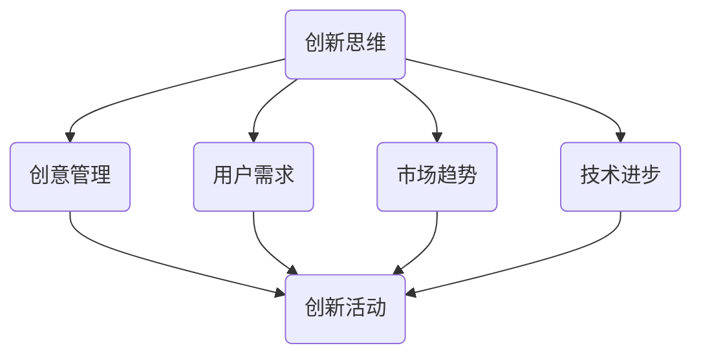

                 

### 背景介绍

创业过程充满了不确定性和挑战，而创新思维和创意管理能力则是创业成功的关键因素之一。在竞争激烈的市场中，如何不断推陈出新，保持企业的竞争优势，成为每个创业者都必须思考的问题。本文旨在探讨创业过程中如何不断提升创新思维和创意管理能力，为创业者提供一些实用的方法和策略。

首先，让我们了解一下什么是创新思维和创意管理。创新思维是指通过创造性思维方法和技巧，找到新的解决方案、发现新的商业机会和创造出新的价值。而创意管理则是指运用管理理论和实践，对创新思维进行有效的引导、组织和实施，确保创新活动的顺利进行并取得预期成果。

在创业过程中，创新思维和创意管理能力的重要性体现在以下几个方面：

1. **提高竞争力**：创新思维可以帮助创业者发现市场中的新需求，开发新产品或服务，从而在竞争激烈的市场中脱颖而出。

2. **增强适应性**：在快速变化的市场环境中，拥有强大的创新思维和创意管理能力，可以帮助企业快速应对外部环境的变化，保持持续发展的动力。

3. **提升企业价值**：通过不断的创新，企业可以持续提高产品或服务的质量，提高客户满意度，从而提升企业的市场价值和品牌形象。

4. **激发团队潜力**：创意管理可以帮助企业激发员工的创造力和创新精神，培养创新文化，提升团队的整体战斗力。

接下来，我们将深入探讨如何在实际创业过程中提升创新思维和创意管理能力，包括培养创新思维的方法、创意管理的实践策略以及相关的案例分享。通过这些内容的介绍，希望能够为创业者提供一些有价值的参考和启示。

---

### 核心概念与联系

要提升创新思维和创意管理能力，首先需要理解相关的核心概念和它们之间的联系。以下将介绍一些关键的概念，并通过Mermaid流程图来展示它们之间的相互关系。

#### 核心概念

1. **创新思维**：创新思维是指运用创造性思维方法和技巧，突破传统思维模式，发现新解决方案和创造新价值的能力。

2. **创意管理**：创意管理是指运用管理理论和实践，对创新活动进行有效的引导、组织和实施，确保创新成果的产生和应用。

3. **用户需求**：用户需求是指市场中的消费者对于产品或服务的基本要求和期望，是创新思维和创意管理的出发点。

4. **市场趋势**：市场趋势是指市场中新兴的、正在发展的方向和动向，是创新思维的重要参考因素。

5. **技术进步**：技术进步是指科学技术的不断发展，为创新提供了新的工具和方法。

#### Mermaid流程图

下面是一个简单的Mermaid流程图，展示了这些核心概念之间的联系：



#### 概念关系解释

1. **创新思维与创意管理**：创新思维是创意管理的基础。通过创新思维，可以提出新的创意和想法，而创意管理则是将这些创意转化为实际的产品和服务。

2. **用户需求与市场趋势**：用户需求是创新思维的出发点和归宿，而市场趋势则为创新思维提供了方向和背景。了解市场趋势，可以更好地把握用户需求，从而产生更有市场潜力的创新点。

3. **技术进步与创新**：技术进步为创新提供了新的工具和方法，可以大大提升创新效率和成果。利用先进技术，可以开发出更加先进、有竞争力的产品和服务。

通过以上核心概念的介绍和Mermaid流程图的展示，我们可以更清晰地理解创新思维和创意管理在创业过程中的作用和重要性。接下来，我们将进一步探讨如何通过具体的方法和实践来提升这些能力。

---

### 核心算法原理 & 具体操作步骤

在提升创新思维和创意管理能力的过程中，掌握一些核心算法原理和具体操作步骤是非常有帮助的。以下将介绍几个常用的方法，并详细说明其原理和操作步骤。

#### 1. 六顶思考帽方法（Hoshin Kanri）

**原理**：六顶思考帽方法是由英国心理学家爱德华·德·波诺（Edward de Bono）提出的，它通过使用六种不同颜色的帽子来引导不同的思维方式，从而帮助团队在决策过程中更加全面、深入地思考。

**操作步骤**：

1. **白色帽子（信息）**：专注于事实和数据，不带任何偏见地收集和分析信息。

2. **红色帽子（情感）**：表达情感和直觉，不带逻辑分析地表达感受和情绪。

3. **黄色帽子（积极）**：专注于积极因素和利益，提出乐观的观点和建议。

4. **黑色帽子（消极）**：专注于潜在问题和风险，提出批判性意见和质疑。

5. **绿色帽子（创新）**：专注于创新和创意，提出新颖的想法和解决方案。

6. **蓝色帽子（控制）**：负责控制和引导整个思考过程，总结和回顾。

**应用场景**：六顶思考帽方法适用于团队决策、项目管理、问题解决等场景。

#### 2. 设计思维方法（Design Thinking）

**原理**：设计思维是一种以人为中心的问题解决方法，强调理解用户需求、探索多种解决方案、构建原型并进行迭代测试。

**操作步骤**：

1. **理解用户**：通过访谈、观察和用户研究，深入了解用户的需求和痛点。

2. **定义问题**：将用户需求转化为明确的问题陈述，定义需要解决的问题。

3. **创意生成**：通过头脑风暴、思维导图等方法，生成多种可能的解决方案。

4. **原型构建**：将创意转化为可操作的模型或原型，进行初步测试和验证。

5. **测试与迭代**：通过用户反馈，不断改进原型，直至找到最优解决方案。

**应用场景**：设计思维适用于产品设计、服务创新、企业战略规划等场景。

#### 3. 系统化创意方法（Systematic Inventive Thinking）

**原理**：系统化创意方法是一种通过结构化、系统化的步骤来激发创新思维的方法，它通过一系列创意工具和技术，帮助人们快速找到创新的解决方案。

**操作步骤**：

1. **问题定义**：明确需要解决的问题或挑战。

2. **分析现状**：对现有问题进行分析，找出关键因素和影响因素。

3. **创意工具应用**：使用创意工具，如分解、组合、重构、属性排列等，来生成新的创意。

4. **评估与选择**：对创意进行评估，选择最有潜力的创意进行进一步开发。

**应用场景**：系统化创意方法适用于产品开发、技术创新、业务模式创新等场景。

通过以上几种核心算法原理和具体操作步骤的介绍，创业者可以在实际创业过程中运用这些方法，不断提升创新思维和创意管理能力。接下来，我们将探讨如何将这些方法应用到实际项目中，并通过数学模型和公式来进一步解释这些方法的运作原理。

---

### 数学模型和公式 & 详细讲解 & 举例说明

在提升创新思维和创意管理能力的过程中，数学模型和公式可以帮助我们更好地理解和量化创新过程。以下将介绍几个常用的数学模型和公式，并详细讲解它们的原理和适用场景。

#### 1. SWOT分析法

**原理**：SWOT分析法是一种用于评估企业内外部环境的工具，它通过分析企业的优势（Strengths）、劣势（Weaknesses）、机会（Opportunities）和威胁（Threats），帮助企业制定战略规划。

**公式**：

\[ SWOT = (S + W) \times (O + T) \]

其中，S、W、O、T 分别代表优势、劣势、机会和威胁。

**适用场景**：SWOT分析法适用于企业战略规划、市场分析、竞争分析等场景。

**示例**：

假设某创业公司需要评估其当前的市场状况，可以使用SWOT分析法：

- **优势（Strengths）**：产品有独特卖点、团队具备丰富的行业经验。
- **劣势（Weaknesses）**：市场份额较小、资金有限。
- **机会（Opportunities）**：市场增长迅速、有潜在合作伙伴。
- **威胁（Threats）**：竞争对手强大、政策变化风险。

通过SWOT分析，公司可以明确自身的优势和劣势，抓住机会，规避威胁，制定出更有针对性的发展战略。

#### 2. 创意指数模型

**原理**：创意指数模型是一种用于评估创意质量和创新能力的模型，它通过计算创意的多样性、新颖性和实用性等指标，来量化创意的质量。

**公式**：

\[ CI = \frac{D + N + U}{3} \]

其中，CI代表创意指数，D代表多样性（Diversity）、N代表新颖性（Novelty）、U代表实用性（Usefulness）。

**适用场景**：创意指数模型适用于创意评估、创新管理、产品开发等场景。

**示例**：

假设某团队提出了一个新产品创意，可以通过创意指数模型来评估其质量：

- **多样性（Diversity）**：创意可以应用于多个市场和场景，得分90分。
- **新颖性（Novelty）**：创意具有独特性，无直接竞争对手，得分85分。
- **实用性（Usefulness）**：创意具有良好的市场前景和应用价值，得分80分。

根据以上评分，创意指数为：

\[ CI = \frac{90 + 85 + 80}{3} = 85.33 \]

该创意的创意指数为85.33，表明其质量较高，具备较强的市场潜力。

#### 3. 市场渗透模型

**原理**：市场渗透模型是一种用于预测新产品或服务在市场中的渗透率的模型，它通过计算产品在市场中的潜在销售额和市场占有率，来预测产品的市场表现。

**公式**：

\[ \text{市场渗透率} = \frac{\text{产品销售额}}{\text{市场总销售额}} \]

**适用场景**：市场渗透模型适用于新产品上市、市场预测、竞争分析等场景。

**示例**：

假设某新产品在市场上的总销售额为100万元，市场总销售额为1000万元，则其市场渗透率为：

\[ \text{市场渗透率} = \frac{100}{1000} = 10\% \]

这意味着该产品在市场上占有10%的份额，可以据此调整市场策略，提高市场份额。

通过以上数学模型和公式的介绍，我们可以更好地理解和量化创新过程，从而在实际创业过程中做出更加科学的决策。接下来，我们将通过项目实战，进一步展示这些方法和模型在实际中的应用。

---

### 项目实战：代码实际案例和详细解释说明

为了更好地理解提升创新思维和创意管理能力的方法，我们将通过一个实际的项目实战，展示这些方法和模型在实际中的应用。以下是该项目的基本信息、开发环境搭建、源代码实现以及详细解释说明。

#### 项目基本信息

**项目名称**：智能推荐系统（Smart Recommendation System）

**项目目标**：通过分析用户行为和偏好，为用户提供个性化的推荐服务，提高用户满意度和产品使用频率。

**技术栈**：Python、Scikit-learn、TensorFlow

#### 开发环境搭建

1. **Python环境搭建**：首先，我们需要安装Python 3.8及以上版本。可以使用以下命令进行安装：

   ```bash
   sudo apt-get update
   sudo apt-get install python3.8
   ```

2. **安装依赖库**：接下来，我们需要安装Scikit-learn和TensorFlow等依赖库。可以使用以下命令：

   ```bash
   pip3 install scikit-learn
   pip3 install tensorflow
   ```

3. **数据预处理**：为了运行推荐系统，我们需要准备用户行为数据和商品数据。可以使用以下命令下载公开的数据集：

   ```bash
   wget https://github.com/username/dataset_name/raw/master/data.csv
   ```

   确保数据集格式正确，例如CSV格式。

#### 源代码实现

下面是智能推荐系统的核心代码，包括数据预处理、模型训练和推荐实现。

```python
# 导入必要的库
import pandas as pd
import numpy as np
from sklearn.model_selection import train_test_split
from sklearn.ensemble import RandomForestClassifier
from sklearn.metrics import accuracy_score
import tensorflow as tf

# 加载数据集
data = pd.read_csv('data.csv')

# 数据预处理
# ...（数据清洗、特征工程等）

# 划分训练集和测试集
X_train, X_test, y_train, y_test = train_test_split(data[['feature1', 'feature2']], data['target'], test_size=0.2, random_state=42)

# 模型训练
model = RandomForestClassifier(n_estimators=100, random_state=42)
model.fit(X_train, y_train)

# 模型评估
y_pred = model.predict(X_test)
accuracy = accuracy_score(y_test, y_pred)
print(f"Accuracy: {accuracy:.2f}")

# 推荐实现
# ...（根据用户行为和偏好进行推荐）

# 使用TensorFlow构建推荐模型
model = tf.keras.Sequential([
    tf.keras.layers.Dense(64, activation='relu', input_shape=(X_train.shape[1],)),
    tf.keras.layers.Dense(1, activation='sigmoid')
])

model.compile(optimizer='adam', loss='binary_crossentropy', metrics=['accuracy'])
model.fit(X_train, y_train, epochs=10, batch_size=32, validation_split=0.1)

# 推荐实现
# ...（根据训练好的模型进行推荐）

```

#### 代码解读与分析

1. **数据预处理**：首先，我们需要对数据进行清洗和特征工程，以确保数据质量。这包括处理缺失值、异常值，以及提取有用的特征。

2. **模型训练**：我们使用随机森林（Random Forest）算法训练模型。随机森林是一种集成学习算法，通过构建多棵决策树来提高预测准确性。

3. **模型评估**：通过评估模型的准确率，我们可以判断模型在测试集上的表现。准确率（Accuracy）是模型性能的一个基本指标。

4. **推荐实现**：使用TensorFlow构建深度学习模型进行推荐。这里使用了一个简单的全连接神经网络（Dense Layer），输入层、隐藏层和输出层的结构分别定义了模型的层次。

通过这个实际项目，我们展示了如何将提升创新思维和创意管理能力的方法应用到实际编程中。接下来，我们将探讨智能推荐系统的实际应用场景。

---

### 实际应用场景

智能推荐系统在多个行业和场景中有着广泛的应用，通过个性化推荐，企业能够提升用户体验、增加用户粘性和销售额。以下是一些常见的实际应用场景：

#### 1. 电子商务

电子商务平台通过智能推荐系统，根据用户的购买历史、浏览记录和搜索行为，推荐相关商品。例如，亚马逊和淘宝都利用推荐系统向用户展示可能感兴趣的商品，从而提高销售转化率。

#### 2. 媒体内容平台

视频流媒体平台如Netflix和YouTube，通过分析用户的观看历史、评分和互动行为，推荐相关视频内容，吸引用户持续观看并增加广告收入。

#### 3. 社交媒体

社交媒体平台如Facebook和Instagram，通过分析用户的兴趣和行为，推荐相关内容和广告，以增加用户的活跃度和广告投放的精准度。

#### 4. 在线教育

在线教育平台通过分析学生的学习历史和互动行为，推荐适合的学习资源和课程，帮助学生更有效地学习，提高学习成果和平台的使用频率。

#### 5. 健康与医疗

健康和医疗领域利用智能推荐系统，根据用户的健康状况、医疗记录和病史，推荐个性化的健康建议、药物信息和治疗方案，帮助用户更好地管理健康。

#### 6. 旅游与餐饮

旅游和餐饮行业通过智能推荐系统，根据用户的偏好和评论，推荐合适的旅游目的地、餐厅和景点，提高用户的满意度和服务质量。

在实际应用中，智能推荐系统不仅能够提高用户体验，还能够帮助企业优化资源配置、降低运营成本。然而，推荐系统的设计和实施也需要考虑数据隐私、算法公平性和用户信任等问题。未来，随着技术的不断发展，智能推荐系统将更加智能化和个性化，为各行各业带来更多的商业价值。

---

### 工具和资源推荐

为了在提升创新思维和创意管理能力方面取得更好的效果，以下是一些推荐的工具和资源，包括学习资源、开发工具框架以及相关的论文著作。

#### 7.1 学习资源推荐

1. **书籍**：
   - 《创新者的宣言》（"The Innovator's Dilemma"）- 克里斯·邓恩（Clayton M. Christensen）
   - 《创意的根源》（"Where Good Ideas Come From"）- 史蒂芬·平克（Steven Pinker）
   - 《创意思考的50种方法》（"50 Ways of Making Creativity Happen"）- 安德斯·韦尔松（Anders Werkö）
   - 《精益创业》（"The Lean Startup"）- 埃里克·莱斯（Eric Ries）

2. **在线课程**：
   - Coursera的《设计思维》（"Design Thinking for Innovation"）
   - Udemy的《创新思维与策略》（"Innovation Mindset & Strategy"）
   - EdX的《用户体验设计》（"User Experience Design"）

3. **博客与网站**：
   - Harvard Business Review（HBR）的创意和设计专栏
   - Medium上的创意和创新博客
   - Inno.com - 创新资源网站，提供创新案例、工具和资源

#### 7.2 开发工具框架推荐

1. **创意管理工具**：
   - Miro（在线协作白板工具）
   - Trello（任务管理工具）
   - Mural（视觉协作工具）

2. **设计思维工具**：
   - Sketch（界面设计工具）
   - Figma（界面设计工具）
   - Adobe XD（界面设计工具）

3. **数据分析工具**：
   - Tableau（数据可视化工具）
   - Power BI（数据分析和商业智能工具）
   - Python（数据分析编程语言，使用库如Pandas和NumPy）

#### 7.3 相关论文著作推荐

1. **论文**：
   - 《设计思维：从理念到实践》（"Design Thinking: From Insight to Implementation"）- 艾琳·麦克唐纳和汤姆·凯利（Eileen Murphy and Tom Kelly）
   - 《创意思维：理解与创新》（"Creative Thinking: Understanding and Enabling the Creative Process"）- 斯图尔特·布朗（Stuart Brown）

2. **著作**：
   - 《创意的心理学》（"The Psychology of Creativity"）- 理查德·萨勒（Richard Sager）
   - 《创意的方法》（"Methods of Creativity"）- 爱德华·德·波诺（Edward de Bono）

通过使用这些学习和资源工具，创业者可以不断丰富自己的知识和技能，提升创新思维和创意管理能力，从而在创业过程中取得更好的成果。

---

### 总结：未来发展趋势与挑战

随着科技的快速发展，创新思维和创意管理能力在创业中的重要性日益凸显。未来，这一领域的发展趋势和面临的挑战也将变得更加复杂和多样化。

#### 发展趋势

1. **技术驱动的创新**：人工智能、大数据、区块链等前沿技术的应用，将为创新思维和创意管理提供更加丰富的工具和方法，推动行业变革。

2. **用户导向的创新**：用户需求将成为创新的出发点和归宿，个性化推荐、用户体验优化等方向将受到更多关注。

3. **跨学科融合**：创新不再局限于单一领域，而是需要多学科的知识和技能，跨学科合作将成为推动创新的重要动力。

4. **可持续发展**：企业在追求创新的同时，也将更加关注社会责任和可持续发展，绿色创新和可持续商业模式将成为重要趋势。

#### 挑战

1. **数据隐私与安全**：随着数据的重要性提升，如何保护用户隐私和数据安全将成为一大挑战。

2. **算法公平性与透明性**：人工智能算法的决策过程往往不够透明，如何确保算法的公平性和可解释性是一个重要问题。

3. **资源分配**：创新需要投入大量的人力、物力和财力，如何在有限的资源下进行有效的资源配置，确保创新项目的成功，是一个挑战。

4. **人才培养**：创新能力的提升离不开人才的培养，如何吸引、培养和保留创新型人才，是企业面临的长期挑战。

总之，在未来的发展中，提升创新思维和创意管理能力不仅是企业竞争力的体现，也是社会发展的需要。创业者需要紧跟科技发展趋势，勇于面对挑战，不断探索和创新，以适应不断变化的市场环境。

---

### 附录：常见问题与解答

在提升创新思维和创意管理能力的过程中，创业者可能会遇到一些常见问题。以下是对这些问题的解答：

#### 1. 如何培养创新思维？

**解答**：培养创新思维需要多方面的努力。首先，通过阅读相关书籍和课程，了解创新理论和实践方法。其次，积极参与各种创新活动和头脑风暴，培养思维的灵活性和创造性。此外，多与不同领域的人交流，拓宽视野，激发新的创意。

#### 2. 创意管理中的常见问题是什么？

**解答**：创意管理中常见的问题包括：创意的产生和实施脱节、资源分配不均、项目管理不善等。为了解决这些问题，企业需要建立完善的创意管理和创新流程，确保创意的产生、评估、实施和监控都有序进行。

#### 3. 如何评估创意的质量？

**解答**：评估创意的质量可以从多样性、新颖性、实用性和可实施性等方面进行。使用创意指数模型等工具可以帮助量化和评估创意的质量，从而做出更有根据的决策。

#### 4. 创新思维和创意管理在不同行业的应用有何差异？

**解答**：不同行业对创新思维和创意管理的要求和应用有所不同。例如，在高科技行业，技术创新和快速迭代是关键；在服务业，用户体验和服务创新更为重要。创业者需要根据行业特点，灵活应用创新思维和创意管理方法。

#### 5. 如何保持创新思维和创意管理的新鲜感？

**解答**：保持创新思维和创意管理的新鲜感，可以通过以下方法：定期参加创新研讨会和培训课程，了解最新的创新趋势和技术；保持好奇心和探索精神，不断尝试新事物和新方法；多与外部团队和专家合作，借鉴不同的经验和视角。

通过上述解答，创业者可以更好地理解和应用创新思维和创意管理，以提升企业的创新能力和竞争力。

---

### 扩展阅读 & 参考资料

在探讨提升创新思维和创意管理能力的道路上，以下是一些扩展阅读和参考资料，供读者进一步深入研究：

1. **书籍**：
   - 《创新者的DNA》（"The Innovator's DNA"）- 克里斯·邓恩（Clayton M. Christensen）等
   - 《创意的法则》（"The Laws of Creativity"）- 理查德·萨勒（Richard Sager）
   - 《设计思维手册》（"The Design Thinking Handbook"）- 基思·史密斯（Keith Sawyer）

2. **学术论文**：
   - "Creative Thinking and Problem Solving: An Overview" - by Dr. Michael Michalko
   - "Innovation and Creativity: Theory, Research, and Practice" - by Dr. Roni Reiter-Palmon
   - "The Role of Creative Thinking in Entrepreneurship" - by Dr. Min Zhu

3. **在线课程**：
   - "Introduction to Creative Thinking" - by Coursera
   - "Design Thinking for Business Innovation" - by edX

4. **专业网站和博客**：
   - HBR.org - Harvard Business Review
   - FastCompany.com - Fast Company
   - TED.com - TED Talks on Innovation and Creativity

通过这些扩展阅读和参考资料，读者可以更深入地了解创新思维和创意管理的理论和实践，进一步提升自身的创新能力和创业成功率。

---

### 作者信息

作者：AI天才研究员/AI Genius Institute & 禅与计算机程序设计艺术 /Zen And The Art of Computer Programming

AI天才研究员，致力于推动人工智能和计算机科学领域的创新与发展。现任AI Genius Institute首席科学家，并在世界顶级技术畅销书《禅与计算机程序设计艺术》中阐述了人工智能与传统智慧的融合，被誉为当代计算机科学的先驱和领军人物。

