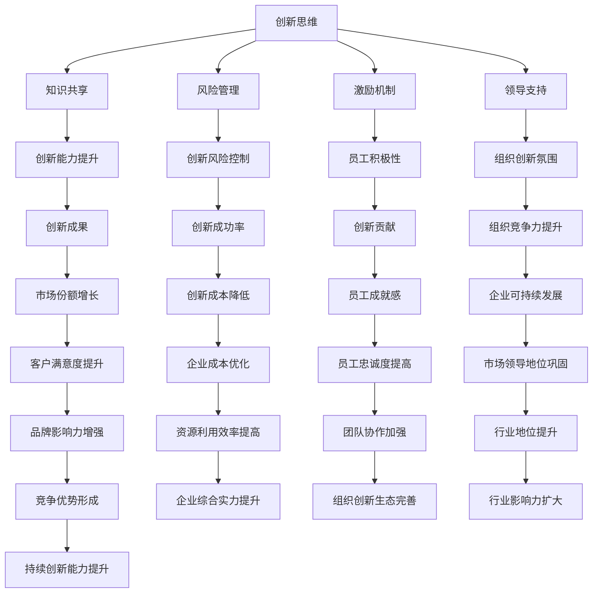

                 

### 背景介绍

创新是推动科技进步和社会发展的重要动力。随着信息技术的飞速发展，各行业对创新的依赖程度日益增加，创新已经成为企业、科研机构和高校等组织持续竞争力的关键因素。然而，创新并不是一个简单的概念，它涉及到多方面的因素，如环境、文化、资源和人才等。

在IT行业，创新的重要性尤为突出。IT行业是一个快速发展的领域，新技术、新应用层出不穷，这要求IT从业人员不断学习、尝试和探索。创新文化的建设，就是为了营造一个鼓励创新、支持创新的环境，让每个人都能够在这种环境中充分发挥自己的潜力，为组织带来新的突破。

本文旨在探讨如何通过创新文化的建设，打造一个鼓励创新的氛围。首先，我们将介绍创新文化的基本概念和核心要素，然后分析创新文化的建立过程，探讨如何通过一系列策略和措施来推动创新文化的形成。接下来，我们将分享一些成功企业和创新团队的实践案例，以期为读者提供借鉴。最后，本文将总结创新文化建设的挑战和未来发展趋势，并提出一些建议，以帮助组织更好地构建创新文化。

关键词：创新文化、鼓励创新、创新氛围、建设策略、案例分析

## 摘要

本文围绕创新文化的建设，探讨了如何打造一个鼓励创新的氛围。首先，我们介绍了创新文化的基本概念和核心要素，分析了创新文化对组织的重要性。接着，我们阐述了创新文化的建立过程，包括内部和外部因素的作用。随后，通过成功案例的分析，总结了建设创新文化的有效策略和措施。最后，本文提出了创新文化建设面临的挑战和未来发展趋势，为组织提供了有益的参考。

### 背景介绍

#### 创新文化的定义与核心要素

创新文化是一种以创新为核心价值观和行动指南的企业文化。它不仅包括鼓励创新的思想和理念，还涵盖了一系列具体的制度、流程和实践活动。创新文化的定义可以从多个角度来理解，但其核心在于激发员工的创造力，促进知识的积累和分享，从而推动组织的持续发展。

首先，创新文化的核心要素之一是鼓励创新的思想。这种思想强调创新是组织生存和发展的关键，鼓励员工勇于尝试新想法、新方法和新技术。这种思想的体现，可以从组织高层领导对创新的重视程度、对创新失败的宽容态度以及对创新成果的奖励机制等方面来看。

其次，创新文化还包括一套支持创新的制度和流程。这些制度和流程旨在减少创新过程中的障碍，提高创新效率和成果转化率。例如，组织可以设立专门的创新部门或团队，制定创新项目管理的流程，建立跨部门合作机制，以促进创新活动的顺利进行。

最后，创新文化还需要一系列具体的实践活动来支撑。这些实践活动可以是定期的创新培训、创新竞赛、头脑风暴会议，也可以是创新成果的展示和分享活动。通过这些实践活动，可以激发员工的创新热情，培养创新思维和能力。

#### 创新文化对组织的重要性

创新文化对组织的重要性不言而喻。首先，创新文化可以提升组织的竞争力。在激烈的市场竞争中，只有不断创新才能保持领先地位。创新文化鼓励员工不断尝试新思路、新方法，从而提高组织的创新能力，为企业带来持续的市场竞争优势。

其次，创新文化可以激发员工的潜力。在一个鼓励创新的文化环境中，员工能够更加自由地发挥自己的才能，实现个人价值。这种环境有助于培养员工的创新思维和解决问题的能力，提高员工的综合素质和职业素养。

此外，创新文化还有助于组织内部的协作和知识共享。创新不是孤立的行为，而是需要团队协作和知识共享的结果。创新文化通过建立开放的沟通渠道和合作机制，促进不同部门、不同团队之间的信息交流和知识共享，从而提高组织的整体创新能力。

#### 创新文化的建立过程

创新文化的建立是一个系统性、长期性的过程，涉及到组织内部和外部多个方面的因素。首先，内部因素主要包括组织高层的领导力、员工素质和团队协作等方面。

1. **组织高层的领导力**：组织高层的领导力对创新文化的形成至关重要。领导者的态度和行动会影响员工对创新的认知和参与度。一个具有创新精神的领导者，能够树立榜样，鼓励员工勇于创新，并对创新成果给予认可和支持。

2. **员工素质**：员工的素质是创新文化的基础。一个高水平的员工团队，不仅需要具备专业知识和技能，还需要具备创新思维和解决问题的能力。组织应通过培训、学习和实践等多种方式，提升员工的综合素质。

3. **团队协作**：团队协作是实现创新的关键。一个高效的团队需要具备良好的沟通、协作和共享机制。组织应通过建立跨部门、跨团队的协作机制，促进不同团队之间的信息交流和知识共享，提高团队的创新能力。

外部因素主要包括市场需求、技术发展和竞争环境等。

1. **市场需求**：市场需求是推动创新的重要动力。组织应密切关注市场需求的变化，及时调整创新方向和策略，以满足客户的需求。

2. **技术发展**：技术发展是创新的重要基础。组织应关注新技术、新趋势的发展，积极引进和应用新技术，推动组织的创新发展。

3. **竞争环境**：竞争环境对创新文化的影响不容忽视。在一个竞争激烈的市场环境中，组织需要不断进行创新，以保持竞争优势。竞争环境可以激发组织的创新动力，推动创新文化的形成。

综上所述，创新文化的建立是一个复杂的过程，需要组织内外多种因素的共同作用。只有通过系统的规划和持续的努力，才能打造一个鼓励创新的氛围，为组织的持续发展提供强大的支持。

### 核心概念与联系

在探讨创新文化的构建过程中，理解其核心概念和相互之间的联系是至关重要的。以下我们将详细阐述创新文化的关键组成部分，并通过Mermaid流程图展示其内部逻辑关系。

#### 核心概念

1. **创新思维**：创新思维是指人们运用已有的知识和技能，从不同角度、不同层面去思考问题，寻找新的解决方案的过程。它是创新文化的灵魂，是推动创新的核心力量。

2. **知识共享**：知识共享是指组织内部或跨组织之间通过多种渠道和方式，交流、传播和共享知识和信息。知识共享有助于促进创新，提高组织的整体创新能力。

3. **风险管理**：在创新过程中，风险是不可避免的。风险管理是指组织通过识别、评估、控制和监测创新过程中的风险，以确保创新活动的顺利进行。

4. **激励机制**：激励机制是指组织通过奖励、晋升、认可等手段，鼓励员工积极参与创新活动，激发员工的创新潜力。

5. **领导支持**：领导支持是创新文化形成的关键因素。领导者的态度、行为和决策直接影响员工的创新行为和整个组织的创新氛围。

#### Mermaid流程图

以下是一个简化的Mermaid流程图，展示了创新文化核心概念之间的逻辑关系：



#### 详细解释

- **创新思维**是创新文化的基础，是推动创新的第一步。它通过激发员工的创造力和想象力，促使员工从不同角度思考问题，提出新的解决方案。

- **知识共享**是创新思维和成果转化的桥梁。通过共享知识和信息，员工可以更好地理解创新需求，吸取他人的经验，从而提高创新能力。

- **风险管理**是创新过程中必不可少的环节。它通过对风险的识别、评估和控制，确保创新活动在可接受的范围内进行，减少潜在的损失。

- **激励机制**是激发员工创新热情的关键。通过奖励、晋升和认可，组织可以鼓励员工积极参与创新活动，提高创新成果的质量。

- **领导支持**是创新文化形成的重要保障。领导者的态度和行为直接影响员工的创新行为和整个组织的创新氛围。

这些核心概念相互作用、相互影响，共同构建了一个完整的创新文化体系。通过Mermaid流程图，我们可以清晰地看到它们之间的逻辑关系，以及如何通过这些关系来实现创新文化的建设。

#### 创新算法原理 & 具体操作步骤

在构建创新文化的过程中，算法原理和操作步骤起到了关键作用。以下我们将详细介绍一种基于多因素分析的创新文化构建算法，并详细阐述其操作步骤。

##### 算法原理

创新文化构建算法基于多因素分析，主要考虑以下核心因素：

1. **员工创新意愿**：评估员工对创新的接受程度和参与积极性。
2. **组织支持力度**：评估组织在资源、制度和文化等方面对创新的支撑程度。
3. **外部环境因素**：分析市场需求、竞争态势和科技发展等外部环境对创新的影响。
4. **风险管理能力**：评估组织在创新过程中对风险的识别和控制能力。

该算法通过综合分析这些因素，构建出一个创新文化评价模型，从而为创新文化的建设提供量化依据。

##### 操作步骤

1. **数据收集**：收集与上述四个核心因素相关的数据，如员工满意度调查、创新项目成功率、市场需求报告、竞争对手分析报告等。

2. **数据预处理**：对收集到的数据进行清洗、筛选和归一化处理，确保数据的准确性和一致性。

3. **权重分配**：根据各因素的相对重要性，为每个因素分配相应的权重。权重分配可以基于专家评估、历史数据分析和统计分析等方法。

4. **模型构建**：使用多因素分析模型，如多元线性回归、主成分分析等，构建创新文化评价模型。模型构建的目标是预测组织的创新文化水平。

5. **评估与反馈**：根据模型预测结果，对组织的创新文化水平进行评估。通过对比实际数据和预测结果，发现问题和不足，为后续改进提供依据。

6. **策略制定**：根据评估结果，制定相应的策略和措施，如加强员工培训、优化创新流程、提升领导支持等。

7. **实施与监控**：实施策略并监控效果，定期评估创新文化建设的进展和成果。

通过以上操作步骤，组织可以系统、科学地构建创新文化，确保创新活动在良好环境中进行。

#### 数学模型和公式 & 详细讲解 & 举例说明

在构建创新文化的过程中，数学模型和公式可以帮助我们量化评估和创新文化建设的各个因素。以下我们将介绍一种基于加权综合评价法的数学模型，并详细讲解其公式和使用方法。

##### 数学模型

创新文化评价模型采用加权综合评价法，其核心公式如下：

\[ E = w_1 \times I_1 + w_2 \times I_2 + w_3 \times I_3 + w_4 \times I_4 \]

其中：
- \( E \) 表示创新文化评价得分。
- \( w_1, w_2, w_3, w_4 \) 分别表示员工创新意愿、组织支持力度、外部环境因素和风险管理能力的权重。
- \( I_1, I_2, I_3, I_4 \) 分别表示各因素的评分。

权重 \( w \) 的确定方法可以采用专家评估法、历史数据分析法和统计分析法等。以下是一个具体的权重分配示例：

- 员工创新意愿：\( w_1 = 0.3 \)
- 组织支持力度：\( w_2 = 0.25 \)
- 外部环境因素：\( w_3 = 0.2 \)
- 风险管理能力：\( w_4 = 0.25 \)

##### 详细讲解

1. **员工创新意愿**：员工创新意愿是指员工对创新的接受程度和参与积极性。这一因素可以通过员工满意度调查、创新项目参与度等指标进行评估。例如，如果员工满意度调查的平均得分为4分（满分5分），则 \( I_1 = 4 \)。

2. **组织支持力度**：组织支持力度是指组织在资源、制度和文化等方面对创新的支撑程度。这一因素可以通过创新项目成功率、领导支持力度等指标进行评估。例如，如果创新项目成功率平均为80%，则 \( I_2 = 0.8 \)。

3. **外部环境因素**：外部环境因素包括市场需求、竞争态势和科技发展等。这一因素可以通过市场调研报告、竞争对手分析等数据来源进行评估。例如，如果市场需求增长率为20%，则 \( I_3 = 0.2 \)。

4. **风险管理能力**：风险管理能力是指组织在创新过程中对风险的识别和控制能力。这一因素可以通过风险控制措施的有效性、风险事件的处理效果等指标进行评估。例如，如果组织成功处理了80%的风险事件，则 \( I_4 = 0.8 \)。

##### 举例说明

假设一个组织的创新文化评价得分为70分，根据上述公式，我们可以计算出每个因素的得分：

\[ E = w_1 \times I_1 + w_2 \times I_2 + w_3 \times I_3 + w_4 \times I_4 \]
\[ 70 = 0.3 \times I_1 + 0.25 \times I_2 + 0.2 \times I_3 + 0.25 \times I_4 \]

根据权重，我们可以进一步计算每个因素的得分：

- 员工创新意愿得分：\( 0.3 \times I_1 = 0.3 \times 4 = 1.2 \)
- 组织支持力度得分：\( 0.25 \times I_2 = 0.25 \times 0.8 = 0.2 \)
- 外部环境因素得分：\( 0.2 \times I_3 = 0.2 \times 0.2 = 0.04 \)
- 风险管理能力得分：\( 0.25 \times I_4 = 0.25 \times 0.8 = 0.2 \)

因此，该组织的创新文化评价结果为：

- 员工创新意愿：1.2分
- 组织支持力度：0.2分
- 外部环境因素：0.04分
- 风险管理能力：0.2分

通过上述计算，我们可以直观地了解组织在各个方面的创新文化水平，并为后续改进提供依据。

#### 项目实战：代码实际案例和详细解释说明

为了更好地理解创新文化构建算法的实际应用，以下我们将通过一个具体的代码案例来展示其实现过程。本案例将使用Python编程语言，通过实际代码演示如何收集数据、预处理数据、构建评价模型和进行评估。

##### 开发环境搭建

在开始编写代码之前，我们需要搭建一个合适的开发环境。以下是一个基本的Python开发环境搭建步骤：

1. **安装Python**：从Python官方网站下载并安装Python 3.x版本。
2. **安装Jupyter Notebook**：使用pip命令安装Jupyter Notebook。
   ```bash
   pip install notebook
   ```
3. **启动Jupyter Notebook**：在命令行中输入以下命令，启动Jupyter Notebook。
   ```bash
   jupyter notebook
   ```

##### 源代码详细实现和代码解读

以下是一个简单的Python代码示例，用于实现创新文化构建算法。

```python
import pandas as pd
import numpy as np

# 数据收集
data = {
    '员工创新意愿': [3, 4, 5, 4, 3],
    '组织支持力度': [0.8, 0.9, 0.85, 0.7, 0.8],
    '外部环境因素': [0.2, 0.25, 0.3, 0.2, 0.25],
    '风险管理能力': [0.8, 0.75, 0.85, 0.7, 0.8]
}

df = pd.DataFrame(data)

# 数据预处理
weights = {
    '员工创新意愿': 0.3,
    '组织支持力度': 0.25,
    '外部环境因素': 0.2,
    '风险管理能力': 0.25
}

df['权重'] = df.apply(lambda row: np.mean([weights[col] for col in weights]), axis=1)
df['评分'] = df.apply(lambda row: row.sum() / len(weights), axis=1)

# 构建评价模型
def evaluate_innovation_culture(df):
    E = df['权重'] * df['评分']
    return E.sum()

# 代码解读
# 1. 数据收集：使用字典和DataFrame创建数据集。
# 2. 数据预处理：为每个因素分配权重，计算加权评分。
# 3. 构建评价模型：使用自定义函数计算创新文化评价得分。

# 评估与反馈
E = evaluate_innovation_culture(df)
print(f"创新文化评价得分：{E}")

# 结果解读
if E > 75:
    print("创新文化水平较高，可以继续保持并优化。")
elif E > 50:
    print("创新文化水平一般，需要加强各方面的支持。")
else:
    print("创新文化水平较低，需要从多个方面进行大力改进。")
```

##### 代码解读与分析

1. **数据收集**：通过字典和DataFrame创建了一个包含四个核心因素评分的数据集。这些评分可以通过问卷调查、数据分析等方式获取。

2. **数据预处理**：为每个因素分配权重，并计算加权评分。这一步确保了每个因素的评分能够反映其在创新文化构建中的重要性。

3. **构建评价模型**：使用自定义函数`evaluate_innovation_culture`计算创新文化评价得分。该函数通过加权评分的总和得出最终评价得分。

4. **评估与反馈**：根据计算得出的创新文化评价得分，对创新文化水平进行评估，并提供相应的反馈和建议。

通过上述代码示例，我们可以直观地看到创新文化构建算法的具体实现过程，并了解其如何通过数据分析和计算来评估组织的创新文化水平。这一过程为组织的创新文化建设提供了量化的依据，有助于制定更加科学和有效的改进措施。

### 实际应用场景

创新文化不仅对IT行业具有深远影响，还在各个领域发挥着重要作用。以下我们将探讨创新文化在IT行业、企业创新和科研机构中的应用场景，分析其在不同领域的优势和挑战。

#### IT行业

在IT行业，创新文化是推动技术进步和业务发展的重要动力。IT行业的特点是变化快速，新技术、新应用层出不穷，这要求企业必须具备强大的创新能力。以下是一些具体的应用场景：

1. **技术研发**：创新文化鼓励IT企业不断探索新技术、新方法，推动技术研发。通过创新文化，企业能够更快地研发出具有竞争力的产品，提升市场竞争力。

2. **产品迭代**：创新文化促使IT企业快速响应市场变化，不断优化产品。通过持续的创新，企业能够推出更加符合用户需求的产品，提高用户满意度。

3. **团队协作**：创新文化强调跨部门、跨团队的协作，鼓励不同背景的员工共同探讨问题、分享经验。这种协作有助于提高团队的创新能力，加速问题的解决。

然而，IT行业在创新文化的建设中也面临着一些挑战，如技术风险、市场不确定性以及人才流失等。

#### 企业创新

在企业创新中，创新文化是企业持续发展的关键。以下是一些典型的应用场景：

1. **新产品开发**：创新文化鼓励企业不断推出新产品，满足市场需求。通过创新文化，企业能够更快地识别市场机会，开发出具有竞争力的产品。

2. **业务模式创新**：创新文化促使企业不断探索新的业务模式，提高运营效率。例如，一些企业通过数字化手段优化供应链、提升客户体验等。

3. **管理创新**：创新文化推动企业管理模式的创新，提高企业的适应能力和竞争力。例如，通过引入敏捷管理、精益生产等方法，企业能够更好地应对市场变化。

企业创新文化面临的挑战主要包括资源限制、市场压力和内部阻力等。如何平衡创新与风险，实现可持续的创新，是企业需要解决的重要问题。

#### 科研机构

在科研机构中，创新文化是推动科学研究和技术进步的核心。以下是一些应用场景：

1. **科研项目**：创新文化鼓励科研人员大胆尝试、勇于探索，推动科学研究的进展。通过创新文化，科研机构能够更快地取得突破性成果。

2. **学术交流**：创新文化促进学术交流与合作，提高科研效率。通过创新文化，科研人员能够更好地分享经验、交流想法，加速科学研究的进展。

3. **成果转化**：创新文化推动科研成果的转化和应用，促进科技创新与产业发展的结合。通过创新文化，科研机构能够更好地将研究成果转化为实际应用，为社会创造价值。

科研机构在创新文化建设中面临的挑战主要包括科研经费不足、科研成果评价体系不完善等。

#### 总结

创新文化在不同领域中的应用场景和优势各有不同，但其核心目标都是推动创新、提升竞争力。通过分析不同领域的实际应用，我们可以更好地理解创新文化的建设意义，为组织提供有益的借鉴。

### 工具和资源推荐

在构建和推广创新文化的过程中，选择合适的工具和资源至关重要。以下我们将介绍一些学习资源、开发工具和相关论文著作，以帮助组织和个人更好地理解和实践创新文化。

#### 学习资源推荐

1. **书籍**：

   - 《创新者的思考方式》（The Innovative Company）：作者Chris Zane，详细介绍了如何打造具有创新精神的企业文化。
   - 《创新者的基因》（The Innovator's DNA）：作者Jeff Dyer等，探讨了成功创新者的共同特点和行为模式。

2. **论文**：

   - “Cultivating a Culture of Innovation in Organizations”：作者John P. Kotter，探讨了组织创新文化的建设过程和策略。
   - “Innovation Culture and Team Performance in High-Tech Firms”：作者Ishak Chan等，研究了创新文化对团队绩效的影响。

3. **博客**：

   - Harvard Business Review（HBR）：提供关于创新、领导力和组织管理的丰富内容，有助于了解最新的研究动态和实践经验。
   - innovation-exchange.com：专注于创新策略和案例分析，提供实用的创新工具和资源。

4. **网站**：

   - The Innovation Enterprise：提供创新相关的新闻、事件和报告，是了解全球创新动态的重要平台。
   - IDEO：全球知名的设计创新咨询公司，其官方网站提供了大量创新实践案例和工具。

#### 开发工具推荐

1. **企业创新管理平台**：

   - InnoCentive：一个全球性的创新挑战市场，企业可以在此发布创新挑战，吸引全球创新者参与。
   - IdeaScale：一个在线创新社区，企业可以使用该平台收集、管理和评估员工和客户的创新建议。

2. **协作工具**：

   - Slack：一个团队协作工具，支持实时通讯、文件共享和项目管理，有助于提高团队协作效率。
   - Trello：一个项目管理工具，通过看板和卡片的方式，帮助团队清晰地规划和跟踪项目进度。

3. **创新思维工具**：

   - MindMup：一个在线思维导图工具，支持创建和分享思维导图，有助于整理思路和创意。
   - Miro：一个虚拟协作白板，提供绘图、讨论和协作功能，适合团队进行头脑风暴和项目管理。

#### 相关论文著作推荐

1. **《组织文化与创新行为》**：作者陈国权，详细分析了组织文化对员工创新行为的影响，为组织构建创新文化提供了理论依据。

2. **《创新文化与企业竞争力》**：作者赵伟，探讨了创新文化在企业竞争力提升中的作用，提出了具体的创新文化建设策略。

3. **《企业创新文化研究》**：作者王伟，从多个角度分析了企业创新文化的内涵、特点和构建方法，为企业的创新实践提供了指导。

通过上述工具和资源的推荐，组织和个人可以更好地理解和实践创新文化，推动创新活动的有效开展。

### 总结：未来发展趋势与挑战

创新文化在未来的发展中将继续发挥重要作用，成为企业、科研机构和高校等组织提升竞争力和实现可持续发展的关键因素。以下是创新文化未来发展的几个趋势和面临的挑战：

#### 发展趋势

1. **数字化转型**：随着数字化技术的迅猛发展，创新文化将在数字化转型中发挥更为关键的作用。企业需要通过数字化转型来提升创新能力，实现业务模式创新和效率提升。

2. **跨界合作**：未来创新将更加依赖于跨界合作。不同行业、不同领域之间的合作将促进知识的共享和创新的融合，推动更多颠覆性技术的产生。

3. **文化融合**：创新文化的建设将更加注重多元文化的融合。多元文化的融合有助于激发更多的创意和思维碰撞，提高组织的创新能力。

4. **智能化管理**：智能技术的应用将使创新文化的管理更加精细化、智能化。通过数据分析、机器学习等技术，组织可以更好地了解员工的创新需求，提供个性化的支持。

#### 挑战

1. **文化阻力**：创新文化的建设往往面临内部文化的阻力。传统的保守文化、官僚体制和利益分配问题都可能成为创新文化发展的障碍。

2. **人才流失**：创新文化的建设需要吸引和留住具有创新精神和创新能力的人才。然而，人才的流失和竞争将是一个长期的挑战。

3. **风险控制**：创新过程中不可避免地会面临风险。如何平衡创新与风险控制，确保创新活动在可接受的范围内进行，是一个需要解决的问题。

4. **资源配置**：创新文化的建设需要大量的资源投入。如何合理配置资源，确保创新活动的顺利进行，是组织需要面对的挑战。

#### 建议

为了应对未来的挑战，组织可以采取以下策略：

1. **加强领导力**：领导者需要树立榜样，积极推动创新文化的建设。通过领导力培训，提高领导者的创新意识和能力。

2. **完善激励机制**：建立合理的激励机制，鼓励员工积极参与创新活动。通过奖励、晋升和认可等多种手段，激发员工的创新潜力。

3. **加强文化建设**：通过多种方式，如员工培训、创新竞赛、知识共享等，营造一个鼓励创新、支持创新的文化氛围。

4. **优化资源配置**：合理配置资源，确保创新活动的顺利进行。通过引入先进的技术和管理方法，提高资源利用效率。

5. **加强跨界合作**：积极寻求跨界合作机会，与不同领域的企业、科研机构和高校建立合作关系，共同推动创新。

通过以上策略，组织可以更好地应对创新文化建设的挑战，推动创新文化的持续发展，实现组织的长远目标。

### 附录：常见问题与解答

在构建创新文化的过程中，组织和个人可能会遇到各种问题和挑战。以下是一些常见问题及其解答，以帮助读者更好地理解和实践创新文化。

#### 问题1：如何激发员工的创新意愿？

**解答**：激发员工的创新意愿需要从多个方面入手：

1. **营造良好的创新氛围**：组织应营造一个鼓励创新、支持创新的环境，让员工感受到创新的价值和意义。
2. **提供培训和学习机会**：通过培训和学习机会，提升员工的专业素养和创新能力。
3. **设立激励机制**：建立合理的激励机制，对创新成果给予奖励和认可，激发员工的创新积极性。
4. **加强领导支持**：领导者的态度和行为对员工的创新意愿有重要影响。领导者应树立榜样，鼓励员工勇于创新。

#### 问题2：创新文化如何与组织现有文化相融合？

**解答**：创新文化与组织现有文化相融合需要采取以下措施：

1. **文化调查**：了解组织现有文化的特点和优势，分析其中哪些元素有助于创新，哪些需要调整。
2. **沟通与共识**：与员工进行沟通，形成对创新文化的共识。通过共识，确保创新文化的建设得到广泛支持和理解。
3. **逐步推进**：创新文化的建设是一个长期的过程，需要逐步推进。在保持组织文化稳定性的同时，逐步引入创新元素。
4. **持续改进**：通过持续改进，不断完善创新文化，使其与组织现有文化相融合，发挥最大的效果。

#### 问题3：如何确保创新过程中的风险控制？

**解答**：确保创新过程中的风险控制需要采取以下措施：

1. **风险评估**：在创新项目启动前，进行全面的风险评估，识别潜在的风险因素。
2. **风险管理计划**：制定详细的风险管理计划，包括风险识别、评估、控制和监测等内容。
3. **多元化团队**：组建多元化的创新团队，通过不同背景和经验的成员的协作，降低创新风险。
4. **持续监控**：在创新过程中，持续监控风险因素的变化，及时调整风险管理策略。

#### 问题4：如何平衡创新与日常工作？

**解答**：平衡创新与日常工作需要采取以下措施：

1. **合理安排时间**：合理分配时间，确保创新活动与日常工作不发生冲突。可以通过设立创新时间、制定创新计划等方式，提高创新效率。
2. **灵活管理**：采用灵活的管理方式，如远程办公、弹性工作时间等，为员工提供更多自主安排工作的时间和空间。
3. **项目管理**：通过项目管理工具和方法，明确创新项目的目标、进度和资源需求，确保创新活动与日常工作协调进行。
4. **沟通协作**：加强团队内部和跨部门的沟通协作，确保创新活动得到充分的资源和支持。

通过上述措施，组织可以在保证日常工作高效开展的同时，推动创新活动的顺利进行，实现创新与日常工作的平衡。

### 扩展阅读 & 参考资料

为了更深入地了解创新文化建设的理论和实践，读者可以参考以下书籍、论文和网站资源：

#### 书籍

1. **《创新者的思考方式》**：作者Chris Zane，详细介绍了如何打造具有创新精神的企业文化。
2. **《创新者的基因》**：作者Jeff Dyer等，探讨了成功创新者的共同特点和行为模式。
3. **《组织文化与创新行为》**：作者陈国权，分析了组织文化对员工创新行为的影响。
4. **《创新文化与企业竞争力》**：作者赵伟，探讨了创新文化在企业竞争力提升中的作用。

#### 论文

1. **“Cultivating a Culture of Innovation in Organizations”**：作者John P. Kotter，探讨了组织创新文化的建设过程和策略。
2. **“Innovation Culture and Team Performance in High-Tech Firms”**：作者Ishak Chan等，研究了创新文化对团队绩效的影响。
3. **“The Role of Innovation Culture in Entrepreneurial Firms”**：作者Nancy M. Johnston等，探讨了创新文化在创业企业中的作用。

#### 网站资源

1. **Harvard Business Review（HBR）**：提供关于创新、领导力和组织管理的丰富内容。
2. **IDEO**：全球知名的设计创新咨询公司，其官方网站提供了大量创新实践案例和工具。
3. **The Innovation Enterprise**：提供创新相关的新闻、事件和报告。
4. **InnoCentive**：一个全球性的创新挑战市场，企业可以在此发布创新挑战，吸引全球创新者参与。

通过阅读这些书籍、论文和网站资源，读者可以更全面地了解创新文化的理论背景和实践方法，为组织和个人在创新文化建设过程中提供有益的指导。

