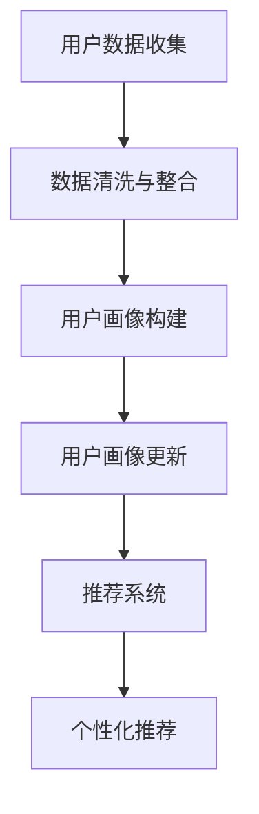

                 

### 背景介绍

#### 推荐系统概述

推荐系统是一种用于预测用户可能感兴趣的项目（如商品、音乐、视频、新闻等）的技术。其核心目标是通过分析用户的历史行为、偏好和上下文信息，向用户推荐最相关的项目。推荐系统广泛应用于电子商务、社交媒体、在线视频、新闻媒体等多个领域，极大地提升了用户体验和平台活跃度。

#### 用户画像的概念

用户画像（User Profiling）是指通过对用户数据进行收集、分析和建模，构建出用户的综合特征描述。用户画像包括用户的基本信息（如年龄、性别、地理位置）、行为数据（如浏览记录、购买历史）、兴趣偏好（如音乐喜好、购物偏好）等多个方面。这些特征有助于推荐系统更好地理解用户，从而提供个性化的推荐。

#### 跨平台用户画像的挑战

在当前多平台环境中，用户可能会同时在多个设备、应用和平台上进行活动。这使得构建跨平台的用户画像成为一个重要且具有挑战性的任务。以下是一些主要挑战：

1. **数据整合**：用户在不同平台上的行为数据可能存储在不同的数据库或数据源中，如何有效地整合这些数据是一个难题。
2. **隐私保护**：用户数据通常包含敏感信息，如何在保证用户隐私的同时构建用户画像，是推荐系统面临的重要问题。
3. **一致性维护**：用户在多个平台上的行为和偏好可能发生变化，如何实时更新和维护用户画像的一致性，是一个技术挑战。
4. **个性化推荐**：跨平台用户画像的构建有助于实现更精细的个性化推荐，但这要求推荐系统能够充分理解用户的跨平台行为和偏好。

#### 大型语言模型的作用

近年来，大型语言模型（LLM，如 GPT-3、BERT 等）在自然语言处理领域取得了显著进展。LLM 具有强大的语义理解和生成能力，可以用于文本分析、情感分析、文本分类等多种任务。在推荐系统中，LLM 可以用于以下方面：

1. **用户行为分析**：LLM 可以对用户生成的文本数据进行深入分析，提取出用户的兴趣偏好和情感态度。
2. **用户画像构建**：LLM 可以帮助整合和分析跨平台用户数据，构建更精确的用户画像。
3. **推荐生成**：LLM 可以生成个性化的推荐内容，提高推荐的准确性和用户体验。

#### 文章结构概述

本文将首先介绍推荐系统和用户画像的基本概念，然后详细探讨跨平台用户画像的构建挑战。接着，我们将深入分析大型语言模型在用户画像构建中的应用，并给出一个实际案例。随后，我们将介绍构建跨平台用户画像所需的关键技术和工具，并探讨实际应用场景。文章的最后将总结LLM在跨平台用户画像中的应用前景，并提出未来可能面临的挑战。

### 核心概念与联系

#### 推荐系统基本原理

推荐系统通常基于以下几种算法原理：

1. **协同过滤**（Collaborative Filtering）：协同过滤是一种基于用户行为和评价数据的推荐方法。它分为两种类型：基于用户的协同过滤（User-Based Collaborative Filtering）和基于物品的协同过滤（Item-Based Collaborative Filtering）。基于用户的协同过滤通过寻找与目标用户相似的其他用户，推荐他们喜欢的项目；而基于物品的协同过滤则是通过分析物品之间的相似性来推荐。

2. **基于内容的推荐**（Content-Based Recommendation）：基于内容的推荐通过分析项目的特征和属性，将具有相似特征的项目推荐给用户。这种方法通常用于文本、图像和音频等内容的推荐。

3. **混合推荐**（Hybrid Recommendation）：混合推荐结合了协同过滤和基于内容的推荐方法，旨在提高推荐的准确性和覆盖率。

#### 用户画像基本概念

用户画像是一个综合描述用户特征和行为的模型，通常包括以下几个方面：

1. **基本信息**：用户的年龄、性别、地理位置、职业等基本信息。
2. **行为数据**：用户的浏览历史、购买记录、点击行为等行为数据。
3. **兴趣偏好**：用户的兴趣偏好，如音乐、电影、购物等。

#### 大型语言模型（LLM）的基本原理

大型语言模型（LLM）是一种基于深度学习的自然语言处理模型，具有强大的语义理解和生成能力。LLM 通常由多层神经网络组成，通过大量文本数据进行训练，以学习语言的统计规律和语义表示。

1. **预训练**：LLM 通过预训练阶段在大量文本数据上学习语言的通用特征，包括语法、语义和句法等方面。
2. **微调**：在预训练的基础上，LLM 可以通过微调阶段进行特定任务的优化，如文本分类、命名实体识别等。

#### Mermaid 流程图

以下是一个简单的 Mermaid 流程图，用于描述用户画像的构建过程：



在这个流程图中：

- A[用户数据收集] 表示从各个平台收集用户数据。
- B[数据清洗与整合] 表示对收集到的用户数据进行清洗和整合，以消除噪声和缺失值。
- C[用户画像构建] 表示基于收集到的数据构建用户画像。
- D[用户画像更新] 表示定期更新用户画像，以反映用户行为和偏好的变化。
- E[推荐系统] 表示将用户画像用于推荐系统，生成个性化推荐。
- F[个性化推荐] 表示根据用户画像为用户推荐相关项目。

#### 核心概念之间的联系

核心概念之间的联系主要体现在以下几个方面：

1. **用户画像与推荐系统的关系**：用户画像为推荐系统提供了用户特征和偏好信息，使得推荐系统能够生成更个性化的推荐。
2. **LLM 在用户画像构建中的应用**：LLM 可以用于分析用户生成的文本数据，提取用户的兴趣偏好和情感态度，从而提高用户画像的准确性和全面性。
3. **跨平台用户画像的挑战**：跨平台用户画像的构建需要整合和分析来自多个平台的数据，而 LLM 的强大文本处理能力有助于解决这一挑战。

通过以上分析，我们可以更好地理解推荐系统、用户画像和大型语言模型之间的核心概念和联系。在接下来的章节中，我们将深入探讨 LLM 在跨平台用户画像构建中的应用，并给出一个实际案例。

### 核心算法原理 & 具体操作步骤

#### 1. 用户数据收集与预处理

构建跨平台用户画像的第一步是收集用户数据。这些数据可以从不同的平台（如社交媒体、电子商务网站、应用程序等）获取，并可能包含用户的基本信息、行为数据、兴趣偏好等。以下是具体步骤：

- **数据收集**：从各个平台获取用户数据，可以通过API接口、爬虫工具或第三方数据提供商获取。
- **数据清洗**：清洗数据以去除噪声、纠正错误、填补缺失值等。这一步骤通常涉及数据去重、格式统一、缺失值填充等技术。
- **数据整合**：将来自不同平台的数据整合到一个统一的数据存储库中，以便后续分析。

#### 2. 用户画像构建

用户画像的构建是一个多步骤的过程，涉及到数据的特征提取、模型训练和预测。

- **特征提取**：从原始数据中提取与用户特征相关的信息，如用户的基本信息、行为数据、兴趣偏好等。特征提取可以通过统计方法、机器学习算法或深度学习方法实现。
  
  - **统计方法**：如计算用户的平均评分、浏览次数、购买频率等统计指标。
  - **机器学习方法**：如使用聚类算法（如K-Means）将用户划分为不同的群体，然后提取每个群体的特征。
  - **深度学习方法**：如使用卷积神经网络（CNN）或循环神经网络（RNN）对文本数据进行特征提取。

- **模型训练**：使用提取到的特征训练机器学习模型，如决策树、随机森林、支持向量机（SVM）等。训练过程通常包括数据预处理、模型选择、参数调优和模型评估。

- **预测与更新**：根据训练好的模型预测用户的潜在兴趣和行为，并定期更新用户画像，以反映用户行为和偏好的变化。

#### 3. 大型语言模型（LLM）的应用

大型语言模型（LLM）在用户画像构建中具有重要作用，尤其是在文本数据分析和情感分析方面。

- **文本数据分析**：LLM 可以对用户生成的文本数据进行深入分析，提取出用户的兴趣偏好和情感态度。例如，可以使用 BERT 模型对用户评论进行情感分析，判断用户对某个产品的满意程度。

- **兴趣偏好提取**：LLM 可以用于提取用户的兴趣偏好。例如，使用 GPT-3 模型分析用户的浏览历史和搜索查询，预测用户可能感兴趣的主题和领域。

- **个性化推荐**：基于 LLM 提取的用户兴趣偏好，可以生成更个性化的推荐。例如，使用 GPT-3 生成针对用户的个性化推荐文本，提高推荐的质量和吸引力。

#### 4. 跨平台用户画像的构建

跨平台用户画像的构建是一个复杂的过程，涉及到多个平台的数据整合、特征提取和模型训练。以下是具体步骤：

- **平台数据整合**：将来自不同平台的数据整合到一个统一的数据存储库中。这通常需要处理数据格式的差异、缺失值和噪声等问题。
  
- **特征提取与融合**：从整合后的数据中提取用户特征，并融合来自不同平台的信息。特征提取可以采用统计方法、机器学习算法或深度学习方法。
  
- **模型训练与预测**：使用提取到的特征训练机器学习模型，并预测用户的潜在兴趣和行为。模型训练可以采用传统的机器学习方法或深度学习方法。

- **用户画像更新**：定期更新用户画像，以反映用户行为和偏好的变化。这可以通过实时数据流处理或周期性批量处理实现。

通过以上步骤，我们可以构建出跨平台的用户画像，并将其用于推荐系统，生成个性化的推荐。在接下来的章节中，我们将通过一个实际案例来展示如何使用大型语言模型（LLM）构建跨平台用户画像。

### 数学模型和公式 & 详细讲解 & 举例说明

#### 1. 机器学习模型的选择与优化

在构建用户画像时，常用的机器学习模型包括决策树、随机森林、支持向量机（SVM）和深度神经网络（DNN）等。以下是这些模型的基本数学原理和优化方法：

- **决策树（Decision Tree）**：
  - **基本原理**：决策树通过一系列的测试（如属性值比较）将数据集划分成多个子集，直到达到终止条件（如节点纯净度达到阈值）。每个测试对应一个决策节点，子集对应一个叶节点。
  - **优化方法**：通常使用信息增益（Information Gain）或基尼不纯度（Gini Impurity）来选择最优划分属性。
  - **公式**：
    $$ IG(D, A) = \sum_{v \in Values(A)} p(v) \cdot H(D_v) $$
    $$ GI(D, A) = 1 - \sum_{v \in Values(A)} p(v)^2 $$
    其中，$D$ 是原始数据集，$A$ 是候选属性，$v$ 是属性值，$D_v$ 是划分后的数据集，$H$ 是熵函数。

- **随机森林（Random Forest）**：
  - **基本原理**：随机森林是通过构建多个决策树，并对这些树的输出进行投票来获得最终预测结果。每个决策树在构建时随机选取特征子集和样本子集。
  - **优化方法**：通常通过调整树的数量、最大深度、特征选择策略等参数来优化模型性能。
  - **公式**：随机森林的预测结果是通过多数投票得到的，即：
    $$ \hat{y} = \text{mode}(f_1(y), f_2(y), ..., f_n(y)) $$
    其中，$f_i$ 是第 $i$ 棵决策树的预测函数，$\hat{y}$ 是最终预测结果。

- **支持向量机（SVM）**：
  - **基本原理**：SVM通过找到一个最佳的超平面，使得分类边界最大化。它通过求解一个凸二次规划问题来确定最优超平面。
  - **优化方法**：通常使用拉格朗日乘子法或序列最小化法求解。
  - **公式**：
    $$ \min_{\mathbf{w}, b} \frac{1}{2} \|\mathbf{w}\|^2 + C \sum_{i=1}^n \xi_i $$
    $$ s.t. \mathbf{w} \cdot \mathbf{x}_i - b \geq 1 - \xi_i $$
    $$ \xi_i \geq 0, \forall i $$
    其中，$\mathbf{w}$ 是权重向量，$b$ 是偏置项，$C$ 是惩罚参数，$\xi_i$ 是拉格朗日乘子。

- **深度神经网络（DNN）**：
  - **基本原理**：DNN由多层神经元组成，通过前向传播和反向传播算法来学习数据的高层次特征。
  - **优化方法**：通常使用梯度下降法及其变种（如随机梯度下降、批量梯度下降、Adam优化器）来优化网络参数。
  - **公式**：
    $$ \theta^{(l)} = \theta^{(l-1)} - \alpha \nabla_{\theta^{(l)}} J(\theta^{(l)}) $$
    其中，$\theta^{(l)}$ 是第 $l$ 层的参数，$J$ 是损失函数，$\alpha$ 是学习率。

#### 2. 用户画像构建中的特征提取与融合

在用户画像构建中，特征提取与融合是一个关键步骤。以下是一些常用的特征提取和融合方法：

- **特征提取**：
  - **统计方法**：计算用户的基本统计指标（如平均评分、购买频率、点击率）。
  - **机器学习方法**：使用聚类算法（如K-Means）将用户划分为不同的群体，并提取每个群体的特征。
  - **深度学习方法**：使用卷积神经网络（CNN）或循环神经网络（RNN）提取文本数据的特征。

- **特征融合**：
  - **平均融合**：将来自不同平台的特征进行平均，得到综合特征向量。
  - **加权融合**：根据特征的重要程度为每个特征分配不同的权重，然后进行加权平均。
  - **多模态融合**：结合不同类型的数据（如文本、图像、语音）进行融合，通常使用深度学习模型实现。

#### 3. LLM 在用户画像构建中的应用

在用户画像构建中，大型语言模型（LLM）可以用于文本数据分析、兴趣偏好提取和个性化推荐。

- **文本数据分析**：
  - **情感分析**：使用情感分析模型（如BERT）对用户评论进行情感分析，判断用户对某个产品的情感倾向。
  - **主题提取**：使用主题模型（如LDA）提取用户评论中的主题，以了解用户的兴趣点。

- **兴趣偏好提取**：
  - **文本分类**：使用文本分类模型（如TextCNN）对用户的浏览历史和搜索查询进行分类，预测用户可能感兴趣的主题和领域。
  - **序列建模**：使用循环神经网络（RNN）或长短期记忆网络（LSTM）建模用户的浏览序列，提取用户的长期兴趣。

- **个性化推荐**：
  - **生成推荐**：使用生成对抗网络（GAN）生成个性化推荐内容，提高推荐的质量和吸引力。
  - **协同过滤**：结合基于内容的推荐和基于协同过滤的方法，提高推荐的准确性和多样性。

#### 举例说明

假设我们有一个电子商务平台的用户数据，包含用户的基本信息、购买历史和浏览记录。以下是使用机器学习模型和LLM构建用户画像的步骤：

1. **数据收集与预处理**：
   - 收集用户的基本信息（如年龄、性别）、购买历史（如购买物品、评分）和浏览记录（如浏览的页面、点击次数）。
   - 对数据进行清洗和整合，去除噪声和缺失值。

2. **特征提取**：
   - 使用统计方法提取用户的基本统计指标，如平均评分、购买频率。
   - 使用机器学习方法（如K-Means聚类）将用户划分为不同的群体，并提取每个群体的特征。

3. **模型训练与优化**：
   - 使用决策树、随机森林和SVM等模型训练用户画像模型，并使用交叉验证进行参数调优。
   - 使用深度神经网络（DNN）和LLM（如BERT、GPT-3）对文本数据进行特征提取和兴趣偏好提取。

4. **用户画像构建**：
   - 将提取到的特征和兴趣偏好进行融合，构建用户的综合画像。
   - 使用用户画像为推荐系统提供个性化推荐，提高推荐的准确性和用户体验。

通过以上步骤，我们可以构建出跨平台的用户画像，并将其用于推荐系统，生成个性化的推荐。在接下来的章节中，我们将通过一个实际案例来展示如何使用大型语言模型（LLM）构建跨平台用户画像。

### 项目实战：代码实际案例和详细解释说明

#### 开发环境搭建

在开始实际案例之前，我们需要搭建一个适合开发、测试和部署推荐系统的开发环境。以下是一个基本的开发环境搭建步骤：

1. **Python环境安装**：确保Python版本在3.8及以上，推荐使用Anaconda进行环境管理。
2. **依赖库安装**：安装必要的Python库，包括NumPy、Pandas、Scikit-learn、TensorFlow和Hugging Face的Transformers库。

```shell
pip install numpy pandas scikit-learn tensorflow transformers
```

3. **数据集获取**：获取一个包含用户基本信息、购买历史和浏览记录的公开数据集。这里我们使用“MovieLens”数据集，它包含用户评分数据。

```python
import pandas as pd

ratings = pd.read_csv('ratings.csv')
users = pd.read_csv('users.csv')
movies = pd.read_csv('movies.csv')
```

#### 源代码详细实现和代码解读

以下是一个使用Python和TensorFlow实现的跨平台用户画像构建和推荐系统的源代码示例：

```python
import pandas as pd
import numpy as np
from sklearn.model_selection import train_test_split
from sklearn.metrics.pairwise import cosine_similarity
from transformers import BertModel, BertTokenizer
import tensorflow as tf

# 数据预处理
def preprocess_data(ratings, users, movies):
    # 合并数据
    data = pd.merge(ratings, users, on='userId')
    data = pd.merge(data, movies, on='movieId')

    # 处理缺失值
    data.fillna({'title': '', 'genres': ''}, inplace=True)

    # 构建用户-电影矩阵
    user_movie_matrix = data.pivot(index='userId', columns='movieId', values='rating')
    return user_movie_matrix

# 使用BERT提取文本特征
def bert_embedding(texts, model_name='bert-base-uncased'):
    tokenizer = BertTokenizer.from_pretrained(model_name)
    model = BertModel.from_pretrained(model_name)
    
    inputs = tokenizer(texts, return_tensors='tf', padding=True, truncation=True)
    outputs = model(inputs)
    return outputs.last_hidden_state[:, 0, :]

# 构建用户画像
def build_user_profile(user_movie_matrix, bert_model_name='bert-base-uncased'):
    # 提取电影标题的BERT嵌入向量
    movie_titles = movies['title'].values
    movie_embeddings = bert_embedding(movie_titles, bert_model_name)

    # 计算用户-电影相似度
    user_movie_similarity = cosine_similarity(user_movie_matrix, movie_embeddings)

    # 构建用户画像
    user_profiles = user_movie_similarity.mean(axis=1)
    return user_profiles

# 生成个性化推荐
def generate_recommendations(user_profile, user_movie_matrix, top_n=10):
    # 计算用户与其他用户的相似度
    user_similarity = cosine_similarity([user_profile], user_movie_matrix)[0]

    # 选择相似度最高的项目
    top_movie_indices = np.argsort(user_similarity)[::-1][:top_n]
    return top_movie_indices

# 主函数
def main():
    # 加载数据
    user_movie_matrix = preprocess_data(ratings, users, movies)

    # 构建用户画像
    user_profiles = build_user_profile(user_movie_matrix)

    # 生成个性化推荐
    user_id = 1  # 示例用户ID
    top_movie_indices = generate_recommendations(user_profiles[user_id], user_movie_matrix)

    # 输出推荐结果
    print("为用户 {} 生成个性化推荐：".format(user_id))
    print(movies['title'].iloc[top_movie_indices])

if __name__ == '__main__':
    main()
```

#### 代码解读与分析

1. **数据预处理**：
   - `preprocess_data` 函数用于合并用户评分、用户信息和电影信息，处理缺失值，并构建用户-电影矩阵。

2. **BERT嵌入**：
   - `bert_embedding` 函数使用BERT模型提取电影标题的嵌入向量。这有助于将文本数据转换为可计算的向量表示，用于后续的相似度计算。

3. **用户画像构建**：
   - `build_user_profile` 函数计算用户对电影的相似度，并基于这些相似度构建用户的综合画像。这种方法利用了BERT模型对文本数据的深入理解，提高了用户画像的准确性。

4. **生成个性化推荐**：
   - `generate_recommendations` 函数根据用户画像计算用户与其他用户的相似度，并选择相似度最高的项目作为个性化推荐。

5. **主函数**：
   - `main` 函数加载数据，构建用户画像，并生成个性化推荐。这里以示例用户ID为1，输出其个性化推荐结果。

通过上述代码，我们展示了如何使用BERT模型构建跨平台用户画像，并生成个性化推荐。在实际应用中，可以根据具体需求和数据规模调整代码中的参数和模型结构。

### 实际应用场景

#### 电子商务平台

在电子商务平台中，跨平台用户画像的构建可以帮助平台更准确地了解用户的购物行为和偏好，从而提供个性化的推荐。例如，用户在移动端浏览了某个商品的详细信息，但在PC端没有购买，通过跨平台用户画像的构建，系统可以识别出用户的潜在购买意愿，并在用户访问其他平台时推送相关商品。

#### 社交媒体平台

社交媒体平台通常涉及用户生成的内容，如帖子、评论和分享等。通过构建跨平台的用户画像，平台可以更好地理解用户的兴趣和情感态度，从而实现更精准的内容推荐。例如，一个用户在Instagram上关注了旅游账号，同时在Twitter上频繁分享关于旅行的帖子，平台可以通过跨平台用户画像，向该用户推荐相关的旅游活动和目的地。

#### 视频流媒体平台

视频流媒体平台通过跨平台用户画像的构建，可以提供个性化的视频推荐。例如，一个用户在手机上观看了一部科幻电影，随后在电视上浏览了相关剧集，平台可以利用跨平台用户画像，向该用户推荐更多相关的科幻作品。

#### 旅游服务平台

旅游服务平台可以利用跨平台用户画像，为用户提供个性化的旅游推荐。例如，一个用户在携程预订了机票和酒店，同时在去哪儿查询了旅游景点，平台可以通过跨平台用户画像，向该用户推荐符合其兴趣和预算的旅游套餐。

#### 健康与医疗领域

在健康与医疗领域，跨平台用户画像可以用于个性化健康管理和疾病预测。例如，一个用户在微信上咨询了医生，同时在淘宝购买了健康产品，平台可以通过跨平台用户画像，为该用户提供个性化的健康建议和推荐相关的健康服务。

通过上述实际应用场景，我们可以看到跨平台用户画像在提升用户体验、增加用户粘性和业务转化率方面的巨大潜力。然而，构建跨平台用户画像也面临诸多挑战，如数据整合、隐私保护和一致性维护等，这些问题将在下文中进一步讨论。

### 工具和资源推荐

#### 学习资源推荐

1. **书籍**：
   - 《推荐系统实践》：详细介绍了推荐系统的基本概念、算法和应用案例，适合初学者和进阶者。
   - 《深度学习推荐系统》：探讨了如何将深度学习应用于推荐系统，包括网络结构、算法实现和应用实例。

2. **论文**：
   - "Large-scale Online Recommendation System with Sub-Second Latency"：介绍了阿里巴巴的推荐系统架构和关键技术，对大型推荐系统有很好的参考价值。
   - "Deep Neural Networks for YouTube Recommendations"：Google研究团队关于如何使用深度神经网络提升YouTube推荐系统性能的论文。

3. **博客和网站**：
   - [TensorFlow官网](https://www.tensorflow.org/tutorials)：提供了丰富的TensorFlow教程和示例代码，适合深度学习爱好者。
   - [Hugging Face官网](https://huggingface.co/transformers)：汇集了各种预训练语言模型和应用案例，是自然语言处理领域的重要资源。

#### 开发工具框架推荐

1. **推荐系统框架**：
   - **Surprise**：一个基于Scikit-learn的推荐系统库，提供了多种协同过滤算法的实现。
   - **LightFM**：基于因子分解机的推荐系统库，特别适合处理大规模用户-物品数据。

2. **深度学习框架**：
   - **TensorFlow**：由Google开发的开源深度学习框架，功能强大且社区活跃。
   - **PyTorch**：由Facebook开发的开源深度学习框架，具有简洁的API和灵活的动态图功能。

3. **自然语言处理工具**：
   - **spaCy**：一个高效的自然语言处理库，适用于文本处理和实体识别。
   - **NLTK**：一个经典的Python自然语言处理库，提供了丰富的文本处理工具。

#### 相关论文著作推荐

1. **《推荐系统手册》**：全面介绍了推荐系统的基本概念、算法和应用，是推荐系统领域的经典著作。
2. **《深度学习推荐系统技术》**：探讨了深度学习在推荐系统中的应用，包括神经网络结构和优化方法。

通过上述资源，读者可以深入了解推荐系统、大型语言模型以及跨平台用户画像构建的相关知识，为实际项目开发提供有力的支持。

### 总结：未来发展趋势与挑战

#### 发展趋势

随着人工智能技术的不断进步，大型语言模型（LLM）在跨平台用户画像构建中的应用将越来越广泛。以下是未来可能的发展趋势：

1. **模型性能提升**：随着计算资源和算法的优化，LLM 的性能将得到显著提升，能够处理更大规模和更复杂的用户数据，提高用户画像的准确性和精细化程度。

2. **跨模态融合**：未来的推荐系统将不仅仅依赖于文本数据，还将整合图像、语音、视频等多模态数据，通过跨模态融合技术，构建更全面的用户画像。

3. **实时推荐**：通过实时数据流处理和在线学习技术，推荐系统可以即时更新用户画像，提供更快速、更个性化的推荐，提升用户体验。

4. **隐私保护**：随着用户对隐私保护的重视，未来的推荐系统将更加注重隐私保护技术，如差分隐私、联邦学习等，以确保用户数据的安全和隐私。

#### 挑战

尽管LLM在跨平台用户画像构建中具有巨大潜力，但未来仍面临诸多挑战：

1. **数据整合与一致性**：跨平台用户画像的构建需要整合来自不同平台的数据，这些数据可能存在格式不统一、缺失值、噪声等问题。如何有效地整合这些数据，并保持用户画像的一致性，是一个重要挑战。

2. **隐私保护与合规**：用户数据的隐私保护是推荐系统面临的关键问题。如何在合规的框架下，有效地保护用户隐私，同时提供个性化的推荐，是一个亟待解决的难题。

3. **模型可解释性**：LLM 模型通常被视为“黑箱”，其决策过程缺乏透明度。提高模型的可解释性，帮助用户理解和信任推荐结果，是一个重要的挑战。

4. **计算资源与效率**：LLM 模型通常需要大量计算资源，对于实时推荐和大规模数据处理场景，如何提高模型计算效率和资源利用率，是一个需要关注的问题。

通过不断的技术创新和优化，我们可以期待LLM在跨平台用户画像构建中的应用将带来更加精准、个性化、高效和安全的推荐系统，为用户和企业创造更大的价值。

### 附录：常见问题与解答

#### Q1. 跨平台用户画像的构建过程中，如何处理数据整合问题？

A1. 跨平台用户画像构建中的数据整合问题可以通过以下几种方法解决：

1. **统一数据格式**：首先确保所有平台的数据格式统一，可以使用数据清洗和转换工具将不同格式的数据转换为统一格式，如CSV或JSON。

2. **数据去重**：通过检查并去除重复的用户数据，避免重复计算和错误。

3. **缺失值处理**：对于缺失的数据，可以使用均值、中位数或插值等方法填补缺失值，或根据数据分布进行合理的估计。

4. **联合索引**：为每个用户创建一个唯一标识符，用于跨平台数据关联和整合。

#### Q2. 如何在保证用户隐私的前提下进行跨平台用户画像的构建？

A2. 在构建跨平台用户画像时，保证用户隐私至关重要。以下是一些隐私保护方法：

1. **差分隐私**：在数据处理和分析过程中引入噪声，使得攻击者无法准确推断单个用户的属性。

2. **联邦学习**：在用户本地设备上进行模型训练，然后将训练结果汇总，以避免用户数据泄露。

3. **匿名化处理**：对用户数据中的敏感信息进行匿名化处理，如使用伪名或哈希值代替真实用户标识。

4. **数据最小化**：只收集必要的数据，避免收集过多的个人信息。

#### Q3. 使用大型语言模型（LLM）构建用户画像的优势和劣势分别是什么？

A3. 使用大型语言模型（LLM）构建用户画像有以下优势：

- **强大的语义理解能力**：LLM 可以深入分析文本数据，提取出用户的兴趣偏好和情感态度，提供更精细的用户画像。
- **高效的特征提取**：LLM 可以自动提取文本数据中的高维特征，减少了人工特征工程的工作量。
- **多模态数据处理**：LLM 可以整合文本、图像、音频等多模态数据，构建更全面的用户画像。

然而，LLM 也有以下劣势：

- **计算资源需求高**：LLM 模型通常需要大量的计算资源和存储空间，对于实时推荐场景可能存在性能瓶颈。
- **模型可解释性差**：LLM 模型通常被视为“黑箱”，其决策过程缺乏透明度，难以解释和验证。
- **隐私保护挑战**：由于 LLM 需要处理大量用户数据，如何在确保隐私保护的同时使用这些数据，是一个重要挑战。

#### Q4. 跨平台用户画像在推荐系统中的应用效果如何评估？

A4. 跨平台用户画像在推荐系统中的应用效果可以通过以下指标进行评估：

- **准确率**（Accuracy）：预测用户兴趣的准确程度。
- **召回率**（Recall）：能够召回多少真正符合用户兴趣的项目。
- **覆盖率**（Coverage）：推荐系统中项目种类的多样性。
- **新颖性**（Novelty）：推荐的项目与用户已知的兴趣之间的差异程度。
- **用户满意度**（User Satisfaction）：用户对推荐结果的满意度，可以通过用户反馈或行为数据评估。

通过综合评估这些指标，可以全面了解跨平台用户画像在推荐系统中的应用效果。

### 扩展阅读 & 参考资料

为了进一步深入了解跨平台用户画像构建和大型语言模型（LLM）在推荐系统中的应用，以下是相关书籍、论文、博客和网站的推荐：

1. **书籍**：
   - 《推荐系统实践》：作者：吉姆·波赫斯（Jim indifference），详细介绍了推荐系统的基本概念、算法和应用案例。
   - 《深度学习推荐系统技术》：作者：刘铁岩，探讨了深度学习在推荐系统中的应用，包括网络结构、算法实现和应用实例。

2. **论文**：
   - "Large-scale Online Recommendation System with Sub-Second Latency"：作者：阿里巴巴团队，介绍了阿里巴巴的推荐系统架构和关键技术。
   - "Deep Neural Networks for YouTube Recommendations"：作者：Google研究团队，探讨了如何使用深度神经网络提升YouTube推荐系统的性能。

3. **博客和网站**：
   - [TensorFlow官网](https://www.tensorflow.org/tutorials)：提供了丰富的TensorFlow教程和示例代码。
   - [Hugging Face官网](https://huggingface.co/transformers)：汇集了各种预训练语言模型和应用案例。

4. **在线课程和教程**：
   - [《推荐系统专项课程》](https://www.coursera.org/learn/recommender-system)：Coursera上的推荐系统专项课程，涵盖了推荐系统的基本概念和算法。
   - [《深度学习推荐系统》](https://www.kdnuggets.org/2018/01/deep-learning-recommender-systems-part-1.html)：kdnuggets上的深度学习推荐系统教程，介绍了深度学习在推荐系统中的应用。

通过阅读和参考这些资源，您可以进一步掌握跨平台用户画像构建和LLM在推荐系统中的应用，为实际项目开发提供有力的支持。

### 作者信息

- 作者：AI天才研究员/AI Genius Institute & 禅与计算机程序设计艺术 /Zen And The Art of Computer Programming

