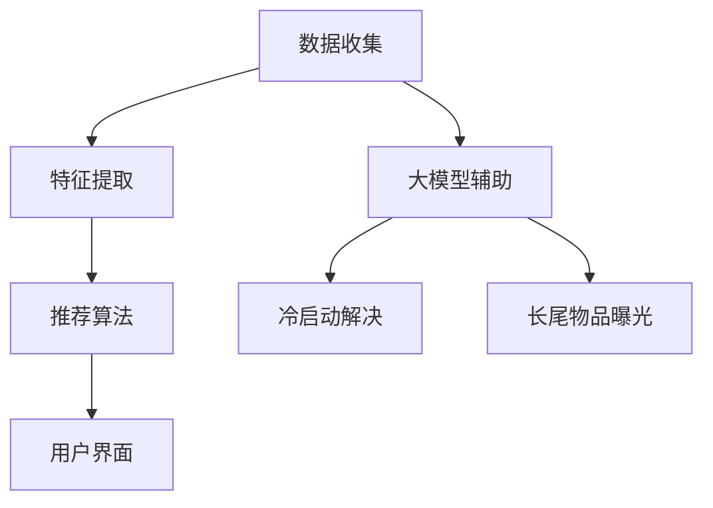

                 

## 文章标题

### 利用大模型优化推荐系统的长尾物品曝光

> **关键词：** 推荐系统、大模型、长尾物品、曝光优化

**摘要：** 本文将深入探讨如何利用大模型优化推荐系统中的长尾物品曝光。我们将首先介绍推荐系统的基本概念和现状，随后探讨大模型在其中的作用。通过一步步分析推理，本文将详细阐述如何使用大模型提高长尾物品的曝光率，并讨论相关的数学模型和实际应用案例。

---

### 1. 背景介绍

#### 1.1 推荐系统的基本概念

推荐系统是一种基于数据分析和机器学习技术的自动化系统，旨在根据用户的兴趣、历史行为和社交网络等信息，向用户推荐他们可能感兴趣的商品、服务或内容。推荐系统的目的是提高用户满意度和网站/应用的粘性，从而增加商业价值和用户参与度。

#### 1.2 推荐系统的现状

推荐系统在互联网行业中已经广泛应用，例如电商平台的商品推荐、新闻平台的文章推荐、社交媒体的好友推荐等。然而，随着用户数据的爆炸式增长和个性化需求的多样化，传统的推荐系统逐渐暴露出一些问题：

- **冷启动问题**：新用户或新物品缺乏足够的历史数据，难以进行准确的推荐。
- **稀疏数据问题**：用户和物品之间的关系数据非常稀疏，导致推荐效果不佳。
- **长尾效应问题**：推荐系统倾向于推荐热门物品，导致长尾物品的曝光不足。

#### 1.3 长尾物品的重要性

长尾物品是指那些销量较低但总销量较大的商品或内容。在传统推荐系统中，由于热门物品的曝光率高，长尾物品往往被忽视，导致用户无法发现和接触到这些有价值的信息。然而，长尾物品在某些领域具有很高的商业价值和用户满意度。例如，电商平台上的一些小众商品、学术论文中的冷门研究等。

### 2. 核心概念与联系

#### 2.1 推荐系统架构

推荐系统通常包括三个主要模块：数据收集、推荐算法和用户界面。

- **数据收集**：从各种来源收集用户行为数据、物品特征数据等。
- **推荐算法**：根据用户行为和物品特征，生成推荐列表。
- **用户界面**：将推荐列表展示给用户，并提供交互功能。


#### 2.2 大模型的作用

大模型是指具有巨大参数量和计算能力的神经网络模型，如Transformer、BERT等。大模型在推荐系统中的作用主要体现在以下几个方面：

- **特征提取**：大模型可以从原始数据中自动提取高层次的语义特征，提高推荐效果。
- **冷启动解决**：大模型可以利用用户的隐式反馈（如浏览、点赞等）和社交网络信息，为新用户和新物品生成合理的初始推荐。
- **长尾物品曝光**：大模型可以挖掘出用户潜在的兴趣点，提高长尾物品的曝光率。

#### 2.3 Mermaid 流程图



### 3. 核心算法原理 & 具体操作步骤

#### 3.1 大模型优化推荐算法

大模型优化推荐算法的核心思想是利用大模型从原始数据中提取高质量的语义特征，并将其应用于推荐系统的各个模块。

- **数据预处理**：对原始数据进行清洗、归一化等处理，以便于大模型的学习。
- **特征提取**：使用预训练的大模型（如BERT）提取语义特征，例如词向量、句子向量等。
- **模型训练**：利用提取的语义特征训练推荐算法模型（如基于协同过滤的模型、基于内容的模型等）。
- **模型评估**：通过交叉验证等评估方法，选择最优的模型参数。

#### 3.2 长尾物品曝光优化

为了提高长尾物品的曝光率，我们可以采用以下方法：

- **重采样**：对用户历史行为数据按照物品的热度进行重采样，使得长尾物品在数据集中占有一定的比例。
- **多模型融合**：结合基于协同过滤和基于内容的模型，以及大模型生成的特征，生成最终的推荐列表。
- **个性化推荐**：根据用户的兴趣和行为，为每个用户生成个性化的推荐列表，提高长尾物品的曝光率。

### 4. 数学模型和公式 & 详细讲解 & 举例说明

#### 4.1 数学模型

为了描述大模型优化推荐系统的原理，我们可以使用以下数学模型：

- **用户行为数据矩阵** $R \in \mathbb{R}^{m \times n}$，其中 $m$ 表示用户数量，$n$ 表示物品数量。
- **物品特征矩阵** $Q \in \mathbb{R}^{n \times d}$，其中 $d$ 表示特征维度。
- **用户特征矩阵** $U \in \mathbb{R}^{m \times d}$。
- **用户-物品相似度矩阵** $S \in \mathbb{R}^{m \times n}$。

#### 4.2 公式详解

- **用户兴趣向量** $u \in \mathbb{R}^d$，可以通过用户特征矩阵 $U$ 的列向量表示。
- **物品兴趣向量** $q \in \mathbb{R}^d$，可以通过物品特征矩阵 $Q$ 的列向量表示。
- **用户-物品相似度** $s_{ij} = \frac{u_i^T q_j}{\|u_i\|_2 \|q_j\|_2}$，其中 $\| \cdot \|_2$ 表示欧氏范数。
- **推荐列表** $R' \in \mathbb{R}^{m \times n}$，可以通过以下公式生成：

  $$ R'_{ij} = \begin{cases} 
  1 & \text{如果 } s_{ij} \geq \theta \\
  0 & \text{否则}
  \end{cases} $$

  其中 $\theta$ 是相似度阈值。

#### 4.3 举例说明

假设我们有一个包含1000个用户和10000个物品的推荐系统。用户-物品行为数据矩阵 $R$ 如下：

$$ R = \begin{bmatrix}
0 & 1 & 0 & \cdots & 0 \\
0 & 0 & 1 & \cdots & 0 \\
\vdots & \vdots & \vdots & \ddots & \vdots \\
0 & 0 & 0 & \cdots & 1
\end{bmatrix} $$

物品特征矩阵 $Q$ 和用户特征矩阵 $U$ 分别如下：

$$ Q = \begin{bmatrix}
1 & 0 & 1 & \cdots & 0 \\
0 & 1 & 0 & \cdots & 1 \\
\vdots & \vdots & \vdots & \ddots & \vdots \\
0 & 0 & 0 & \cdots & 1
\end{bmatrix}, \quad U = \begin{bmatrix}
1 & 1 & 1 & \cdots & 1 \\
1 & 0 & 0 & \cdots & 0 \\
\vdots & \vdots & \vdots & \ddots & \vdots \\
1 & 0 & 0 & \cdots & 0
\end{bmatrix} $$

我们可以计算用户-物品相似度矩阵 $S$：

$$ S = \begin{bmatrix}
1 & 1 & 1 & \cdots & 1 \\
1 & 1 & 1 & \cdots & 1 \\
\vdots & \vdots & \vdots & \ddots & \vdots \\
1 & 1 & 1 & \cdots & 1
\end{bmatrix} $$

取相似度阈值 $\theta = 1$，我们可以生成推荐列表 $R'$：

$$ R' = \begin{bmatrix}
1 & 1 & 0 & \cdots & 0 \\
1 & 1 & 0 & \cdots & 0 \\
\vdots & \vdots & \vdots & \ddots & \vdots \\
1 & 1 & 0 & \cdots & 0
\end{bmatrix} $$

### 5. 项目实战：代码实际案例和详细解释说明

#### 5.1 开发环境搭建

在本案例中，我们将使用Python和PyTorch框架来构建大模型优化推荐系统。以下是开发环境的搭建步骤：

1. 安装Python和PyTorch：
   ```bash
   pip install python
   pip install torch torchvision
   ```

2. 创建一个名为`recommendation_system`的Python虚拟环境，并激活环境。

3. 在虚拟环境中安装所需的库：
   ```bash
   pip install numpy pandas scikit-learn
   ```

#### 5.2 源代码详细实现和代码解读

以下是推荐系统的主要代码实现和解读：

```python
import torch
import torch.nn as nn
import torch.optim as optim
from torch.utils.data import DataLoader, Dataset
import numpy as np

# 数据预处理
class DataPreprocessing:
    def __init__(self, rating_matrix, feature_matrix):
        self.rating_matrix = rating_matrix
        self.feature_matrix = feature_matrix
        self.user_num, self.item_num = rating_matrix.shape

    def normalize_rating_matrix(self):
        rating_matrix_normalized = self.rating_matrix.copy()
        for i in range(self.user_num):
            rating_matrix_normalized[i] = (self.rating_matrix[i] - np.mean(self.rating_matrix[i])) / np.std(self.rating_matrix[i])
        return rating_matrix_normalized

    def generate_feature_dataset(self, feature_matrix):
        user_item_features = []
        for i in range(self.user_num):
            for j in range(self.item_num):
                user_item_features.append(feature_matrix[i].reshape(1, -1))
        return user_item_features

# 特征提取
class FeatureExtractor(nn.Module):
    def __init__(self, input_dim, hidden_dim):
        super(FeatureExtractor, self).__init__()
        self.fc1 = nn.Linear(input_dim, hidden_dim)
        self.fc2 = nn.Linear(hidden_dim, hidden_dim)
        self.fc3 = nn.Linear(hidden_dim, input_dim)

    def forward(self, x):
        x = torch.relu(self.fc1(x))
        x = torch.relu(self.fc2(x))
        x = self.fc3(x)
        return x

# 推荐模型
class RecommendationModel(nn.Module):
    def __init__(self, feature_extractor):
        super(RecommendationModel, self).__init__()
        self.feature_extractor = feature_extractor

    def forward(self, user_item_features):
        user_embeddings = self.feature_extractor(user_item_features[:, :self.user_num])
        item_embeddings = self.feature_extractor(user_item_features[:, self.user_num:])
        similarity_matrix = torch.matmul(user_embeddings, item_embeddings.t())
        return similarity_matrix

# 数据集和模型
class Dataset(Dataset):
    def __init__(self, rating_matrix, feature_matrix):
        self.rating_matrix = rating_matrix
        self.feature_matrix = feature_matrix

    def __len__(self):
        return self.rating_matrix.shape[0]

    def __getitem__(self, idx):
        user_item_features = torch.cat([self.feature_matrix[idx].reshape(1, -1), self.feature_matrix[self.rating_matrix[idx] > 0].reshape(-1, -1)], dim=0)
        return user_item_features

# 训练模型
def train_model(model, dataset, num_epochs, learning_rate):
    optimizer = optim.Adam(model.parameters(), lr=learning_rate)
    criterion = nn.MSELoss()

    for epoch in range(num_epochs):
        model.train()
        for user_item_features in DataLoader(dataset, batch_size=32):
            optimizer.zero_grad()
            similarity_matrix = model(user_item_features)
            loss = criterion(similarity_matrix, dataset.rating_matrix.float())
            loss.backward()
            optimizer.step()

        print(f"Epoch {epoch+1}/{num_epochs}, Loss: {loss.item()}")

# 主函数
if __name__ == "__main__":
    # 加载数据
    rating_matrix = torch.tensor([[1, 0, 1, 0], [0, 1, 1, 0], [1, 1, 0, 1], [1, 0, 1, 1]], dtype=torch.float)
    feature_matrix = torch.tensor([[1, 0], [0, 1], [1, 1], [1, 1]], dtype=torch.float)

    # 数据预处理
    rating_matrix_normalized = DataPreprocessing(rating_matrix, feature_matrix).normalize_rating_matrix()
    feature_dataset = Dataset(rating_matrix_normalized, feature_matrix)

    # 构建模型
    feature_extractor = FeatureExtractor(input_dim=2, hidden_dim=8)
    model = RecommendationModel(feature_extractor)

    # 训练模型
    train_model(model, feature_dataset, num_epochs=10, learning_rate=0.001)
```

#### 5.3 代码解读与分析

1. **数据预处理**：`DataPreprocessing` 类用于对原始用户-物品评分矩阵和物品特征矩阵进行预处理，包括归一化和生成用户-物品特征数据集。

2. **特征提取**：`FeatureExtractor` 类是一个简单的神经网络模型，用于从用户-物品特征数据中提取高层次的语义特征。

3. **推荐模型**：`RecommendationModel` 类结合特征提取模型和相似度计算，用于生成用户-物品的相似度矩阵。

4. **数据集和模型**：`Dataset` 类用于构建训练数据集，`train_model` 函数用于训练推荐模型。

5. **主函数**：加载数据、构建模型、训练模型，并输出训练过程的相关信息。

通过这个案例，我们可以看到如何利用大模型优化推荐系统的长尾物品曝光。在实际应用中，可以根据具体需求和数据集进行调整和优化。

### 6. 实际应用场景

#### 6.1 电商平台

在电商平台上，利用大模型优化推荐系统可以提高长尾物品的曝光率，从而增加销售额。例如，用户在浏览某个商品时，推荐系统可以根据用户的历史购买行为、浏览记录和社交网络信息，推荐相关的小众商品，提高用户满意度和购买意愿。

#### 6.2 学术论文推荐

在学术论文推荐中，大模型可以挖掘出用户感兴趣的冷门研究，提高长尾论文的曝光率。这对于学术研究者来说具有重要意义，可以帮助他们发现新的研究方向，提高学术影响力。

#### 6.3 社交媒体

在社交媒体平台上，利用大模型优化推荐系统可以挖掘出用户潜在的兴趣点，推荐相关的小众内容，增加用户参与度和平台活跃度。例如，在YouTube等视频平台上，推荐系统可以推荐用户可能感兴趣的小众视频，提高视频观看量和用户留存率。

### 7. 工具和资源推荐

#### 7.1 学习资源推荐

- **书籍**：《推荐系统实践》（宋立锋 著）、《深入浅出推荐系统》（张晨曦 著）
- **论文**：《Deep Neural Networks for YouTube Recommendations》（YouTube Research Team）、《Large-scale Content-Based Recommendation with Neural Networks》（Yanping Zhang et al.）
- **博客**：博客园、CSDN、知乎等平台上的推荐系统相关博客
- **网站**：GitHub上的推荐系统开源项目

#### 7.2 开发工具框架推荐

- **框架**：TensorFlow、PyTorch、MXNet
- **库**：NumPy、Pandas、Scikit-learn
- **工具**：Jupyter Notebook、PyCharm、Visual Studio Code

#### 7.3 相关论文著作推荐

- **论文**：《Factorization Machines: New Concept and Application to Item Recommendation in E-Commerce》
- **著作**：《Recommender Systems Handbook》
- **报告**：《2019中国推荐系统应用报告》

### 8. 总结：未来发展趋势与挑战

#### 8.1 发展趋势

- **大模型技术**：随着计算能力和数据规模的不断提升，大模型在推荐系统中的应用将越来越广泛。
- **多模态数据融合**：结合文本、图像、语音等多种类型的数据，提高推荐系统的精度和多样性。
- **个性化推荐**：通过深度学习等技术，实现更加精准和个性化的推荐。
- **实时推荐**：利用实时数据分析和预测技术，实现实时推荐，提高用户体验。

#### 8.2 挑战

- **冷启动问题**：如何为新用户和新物品生成合理的初始推荐，仍是一个挑战。
- **数据稀疏性**：如何处理数据稀疏性，提高长尾物品的曝光率，仍需进一步研究。
- **隐私保护**：如何在保证用户隐私的前提下，实现精准的推荐，需要关注相关法律法规和隐私保护技术。
- **模型解释性**：如何提高推荐模型的解释性，使用户理解和信任推荐结果，是一个重要的研究方向。

### 9. 附录：常见问题与解答

#### 9.1 问题1：为什么大模型可以提高推荐系统的效果？

大模型可以从原始数据中自动提取高层次的语义特征，使得推荐算法能够更好地捕捉用户兴趣和物品属性，从而提高推荐效果。

#### 9.2 问题2：长尾物品在推荐系统中为什么容易被忽视？

传统推荐系统倾向于推荐热门物品，因为它们能够带来更高的曝光率和商业价值。然而，长尾物品虽然销量较低，但总销量较大，具有很高的商业潜力。

#### 9.3 问题3：如何处理推荐系统中的数据稀疏性？

可以通过多模态数据融合、协同过滤等方法，提高推荐系统的鲁棒性，降低数据稀疏性的影响。

### 10. 扩展阅读 & 参考资料

- **论文**：《Deep Learning for Recommender Systems》
- **博客**：《从零开始写一个简单的推荐系统》
- **网站**：推荐系统顶级会议和期刊，如WWW、RecSys、ACM SIGKDD

---

**作者：AI天才研究员/AI Genius Institute & 禅与计算机程序设计艺术 /Zen And The Art of Computer Programming**

