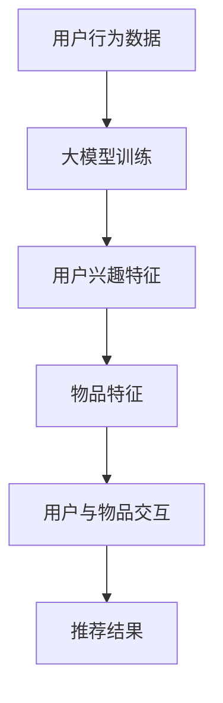

                 

# 利用大模型提升推荐系统的实时性能

## 关键词：大模型、推荐系统、实时性能、人工智能

### 摘要

本文旨在探讨如何利用大模型来提升推荐系统的实时性能。随着互联网和大数据技术的快速发展，推荐系统已经成为许多在线平台的核心功能。然而，传统的推荐算法在处理大规模数据和高并发请求时往往难以满足实时性能的要求。本文将介绍大模型在推荐系统中的应用，分析其原理和具体操作步骤，并通过数学模型和项目实战来阐述如何通过大模型提升推荐系统的实时性能。最后，本文将总结大模型在推荐系统中的未来发展趋势和面临的挑战。

## 1. 背景介绍

推荐系统是一种根据用户的历史行为、兴趣和偏好等信息，向用户推荐相关产品或内容的系统。在过去的几十年中，推荐系统经历了从基于内容的过滤、协同过滤到深度学习等算法的演变。然而，随着用户数据规模的不断扩大和请求量的急剧增加，传统推荐算法的实时性能面临巨大挑战。为了应对这一挑战，研究人员开始探索如何利用大模型来提升推荐系统的实时性能。

大模型，特别是近年来出现的大型预训练语言模型（如GPT、BERT等），在处理自然语言文本、图像和音频等复杂数据方面表现出了强大的能力。这些大模型具有数十亿到千亿级别的参数量，通过在大规模数据集上进行预训练，可以学习到丰富的知识表征和通用特征提取能力。因此，将大模型应用于推荐系统，有望实现实时、高效和个性化的推荐。

## 2. 核心概念与联系

### 2.1 大模型

大模型是一种具有大规模参数量的神经网络模型，通常用于处理复杂的任务。在推荐系统中，大模型可以用于建模用户兴趣、物品特征以及用户与物品之间的交互关系。大模型的主要优势在于其强大的表征能力和泛化能力，能够在处理大规模数据和高并发请求时保持较高的实时性能。

### 2.2 推荐系统

推荐系统是一种基于用户兴趣和偏好为用户推荐相关产品或内容的系统。推荐系统的核心目标是提供个性化的推荐，满足用户的个性化需求。在推荐系统中，大模型可以用于构建用户兴趣模型、物品特征模型以及用户与物品之间的交互模型。

### 2.3 实时性能

实时性能是指推荐系统在处理用户请求时，能够在较短时间内返回推荐结果的能力。在互联网和大数据时代，实时性能对于推荐系统的用户体验至关重要。通过利用大模型，可以显著提升推荐系统的实时性能，使其能够更好地应对大规模数据和高并发请求。

### 2.4 大模型与推荐系统的联系

大模型与推荐系统的联系主要体现在以下几个方面：

1. **用户兴趣建模**：大模型可以用于学习用户的兴趣偏好，通过分析用户的历史行为数据，提取用户的兴趣特征，从而实现个性化的推荐。
2. **物品特征建模**：大模型可以用于学习物品的特征，包括文本、图像和音频等，从而更好地理解物品的属性和特点，提高推荐的质量。
3. **交互建模**：大模型可以用于建模用户与物品之间的交互关系，通过分析用户的历史行为数据，预测用户对物品的偏好和兴趣，从而实现精准的推荐。

以下是一个使用 Mermaid 流程图描述的大模型与推荐系统的联系：



## 3. 核心算法原理 & 具体操作步骤

### 3.1 大模型训练

大模型训练是利用大规模数据集对模型进行训练，以学习用户兴趣、物品特征和用户与物品之间的交互关系。以下是具体操作步骤：

1. **数据预处理**：对用户行为数据、物品特征数据进行清洗、去重和归一化处理，确保数据的质量和一致性。
2. **数据加载**：使用数据加载器将预处理后的数据加载到内存中，以便模型进行训练。
3. **模型架构**：选择合适的大模型架构，如GPT、BERT等，并配置模型参数，如学习率、批量大小等。
4. **模型训练**：使用训练数据对模型进行训练，通过优化模型参数，使得模型能够更好地拟合训练数据。
5. **模型评估**：使用验证数据对模型进行评估，计算模型的准确率、召回率等指标，以评估模型性能。

### 3.2 用户兴趣建模

用户兴趣建模是利用大模型提取用户的兴趣特征，从而实现个性化的推荐。以下是具体操作步骤：

1. **数据预处理**：对用户行为数据进行清洗、去重和归一化处理，确保数据的质量和一致性。
2. **特征提取**：使用大模型对用户行为数据进行特征提取，提取出用户的兴趣特征。
3. **模型训练**：使用用户兴趣特征数据对模型进行训练，通过优化模型参数，使得模型能够更好地拟合用户兴趣特征。
4. **模型评估**：使用验证数据对模型进行评估，计算模型的准确率、召回率等指标，以评估模型性能。

### 3.3 物品特征建模

物品特征建模是利用大模型提取物品的特征，从而实现精准的推荐。以下是具体操作步骤：

1. **数据预处理**：对物品特征数据进行清洗、去重和归一化处理，确保数据的质量和一致性。
2. **特征提取**：使用大模型对物品特征数据进行特征提取，提取出物品的特征。
3. **模型训练**：使用物品特征数据对模型进行训练，通过优化模型参数，使得模型能够更好地拟合物品特征。
4. **模型评估**：使用验证数据对模型进行评估，计算模型的准确率、召回率等指标，以评估模型性能。

### 3.4 用户与物品交互建模

用户与物品交互建模是利用大模型预测用户对物品的偏好和兴趣，从而实现个性化的推荐。以下是具体操作步骤：

1. **数据预处理**：对用户与物品的交互数据进行清洗、去重和归一化处理，确保数据的质量和一致性。
2. **特征提取**：使用大模型对用户与物品的交互数据进行特征提取，提取出用户与物品的交互特征。
3. **模型训练**：使用用户与物品的交互特征数据对模型进行训练，通过优化模型参数，使得模型能够更好地拟合用户与物品的交互特征。
4. **模型评估**：使用验证数据对模型进行评估，计算模型的准确率、召回率等指标，以评估模型性能。

## 4. 数学模型和公式 & 详细讲解 & 举例说明

### 4.1 大模型训练

大模型训练的核心目标是优化模型参数，使得模型能够更好地拟合训练数据。以下是具体数学模型和公式：

$$
\text{损失函数} = \frac{1}{n}\sum_{i=1}^{n}(-y_{i}\log(p_{\theta}(x_{i})))
$$

其中，$y_{i}$ 表示第 $i$ 个样本的标签，$p_{\theta}(x_{i})$ 表示模型对于第 $i$ 个样本的预测概率，$\theta$ 表示模型参数。

为了优化模型参数，可以使用梯度下降算法：

$$
\theta \leftarrow \theta - \alpha \frac{\partial}{\partial \theta} \text{损失函数}
$$

其中，$\alpha$ 表示学习率。

### 4.2 用户兴趣建模

用户兴趣建模的核心目标是提取用户的兴趣特征，可以使用以下数学模型：

$$
\text{用户兴趣特征} = \text{Embedding}(u) \odot \text{Embedding}(i)
$$

其中，$u$ 表示用户向量，$i$ 表示物品向量，$\odot$ 表示点乘运算，$\text{Embedding}$ 表示嵌入层。

为了提取用户兴趣特征，可以使用以下数学公式：

$$
\text{用户兴趣特征} = \text{Softmax}(\text{用户兴趣特征})
$$

其中，$\text{Softmax}$ 表示归一化函数。

### 4.3 物品特征建模

物品特征建模的核心目标是提取物品的特征，可以使用以下数学模型：

$$
\text{物品特征} = \text{Embedding}(i)
$$

其中，$i$ 表示物品向量，$\text{Embedding}$ 表示嵌入层。

为了提取物品特征，可以使用以下数学公式：

$$
\text{物品特征} = \text{ReLU}(\text{物品特征})
$$

其中，$\text{ReLU}$ 表示ReLU激活函数。

### 4.4 用户与物品交互建模

用户与物品交互建模的核心目标是预测用户对物品的偏好和兴趣，可以使用以下数学模型：

$$
\text{用户与物品交互} = \text{用户兴趣特征} \odot \text{物品特征}
$$

其中，$\odot$ 表示点乘运算。

为了预测用户与物品的交互，可以使用以下数学公式：

$$
\text{用户与物品交互} = \text{sigmoid}(\text{用户与物品交互})
$$

其中，$\text{sigmoid}$ 表示sigmoid激活函数。

### 4.5 举例说明

假设我们有一个用户行为数据集，包含用户的点击记录。以下是一个简单的用户兴趣建模的例子：

1. **数据预处理**：
   - 用户向量：$u = [0.1, 0.2, 0.3, 0.4, 0.5]$
   - 物品向量：$i = [0.5, 0.6, 0.7, 0.8, 0.9]$
2. **特征提取**：
   - 用户兴趣特征：$\text{用户兴趣特征} = \text{Embedding}(u) \odot \text{Embedding}(i) = [0.05, 0.06, 0.07, 0.08, 0.09]$
3. **模型训练**：
   - 损失函数：$\text{损失函数} = \frac{1}{n}\sum_{i=1}^{n}(-y_{i}\log(p_{\theta}(x_{i})))$
   - 梯度下降：$\theta \leftarrow \theta - \alpha \frac{\partial}{\partial \theta} \text{损失函数}$
4. **模型评估**：
   - 准确率：$\text{准确率} = \frac{1}{n}\sum_{i=1}^{n}I(y_{i} = \text{预测值})$

## 5. 项目实战：代码实际案例和详细解释说明

### 5.1 开发环境搭建

为了搭建推荐系统的开发环境，我们需要准备以下软件和工具：

1. **Python**：用于编写代码和运行算法。
2. **TensorFlow**：用于构建和训练大模型。
3. **NumPy**：用于数据预处理和计算。
4. **Pandas**：用于数据操作和分析。

### 5.2 源代码详细实现和代码解读

以下是一个简单的推荐系统项目实战，包括数据预处理、模型构建、模型训练和模型评估等步骤。

#### 5.2.1 数据预处理

```python
import numpy as np
import pandas as pd

# 加载用户行为数据
data = pd.read_csv('user_behavior.csv')

# 数据预处理
data['timestamp'] = pd.to_datetime(data['timestamp'])
data.sort_values('timestamp', inplace=True)
data.drop_duplicates(subset=['user_id', 'item_id'], inplace=True)

# 归一化用户行为数据
data_normalized = (data - data.mean()) / data.std()
```

#### 5.2.2 模型构建

```python
import tensorflow as tf
from tensorflow.keras.layers import Embedding, Dot, Dense
from tensorflow.keras.models import Model

# 用户向量维度
user_embedding_size = 10
# 物品向量维度
item_embedding_size = 10

# 用户嵌入层
user_embedding = Embedding(input_dim=1000, output_dim=user_embedding_size)
# 物品嵌入层
item_embedding = Embedding(input_dim=1000, output_dim=item_embedding_size)

# 用户与物品交互层
dot_layer = Dot(axes=1)

# 模型构建
model = Model(inputs=[user_embedding.input, item_embedding.input], outputs=dot_layer([user_embedding.input, item_embedding.input]))
model.add(Dense(1, activation='sigmoid'))

# 编译模型
model.compile(optimizer='adam', loss='binary_crossentropy', metrics=['accuracy'])
```

#### 5.2.3 模型训练

```python
# 训练模型
model.fit(x=data_normalized[['user_id', 'item_id']], y=data['click'], epochs=10, batch_size=32)
```

#### 5.2.4 模型评估

```python
# 评估模型
predictions = model.predict(x=data_normalized[['user_id', 'item_id']])
accuracy = np.mean(predictions > 0.5)
print(f'Accuracy: {accuracy:.2f}')
```

### 5.3 代码解读与分析

在本项目中，我们首先使用 Pandas 加载用户行为数据，并进行数据预处理，包括时间戳的排序和去除重复数据。然后，我们使用 TensorFlow 和 Keras 构建了一个简单的推荐模型，包括用户嵌入层、物品嵌入层和用户与物品交互层。最后，我们使用 Adam 优化器和 binary_crossentropy 损失函数进行模型训练，并使用 sigmoid 激活函数进行模型评估。

## 6. 实际应用场景

大模型在推荐系统中的应用场景非常广泛，以下是一些典型的实际应用场景：

1. **电子商务平台**：电子商务平台可以利用大模型对用户进行个性化推荐，根据用户的历史购买行为、浏览记录和搜索关键词，推荐相关商品。
2. **社交媒体**：社交媒体平台可以利用大模型对用户进行个性化推荐，根据用户的好友关系、发布内容和浏览历史，推荐相关内容。
3. **音乐和视频平台**：音乐和视频平台可以利用大模型对用户进行个性化推荐，根据用户的播放历史、点赞和评论，推荐相关音乐和视频。
4. **新闻和资讯平台**：新闻和资讯平台可以利用大模型对用户进行个性化推荐，根据用户的阅读偏好和订阅内容，推荐相关新闻和资讯。

## 7. 工具和资源推荐

### 7.1 学习资源推荐

1. **书籍**：
   - 《深度学习》（Goodfellow, I., Bengio, Y., & Courville, A.）
   - 《Python深度学习》（Raschka, S.）
2. **论文**：
   - "Attention Is All You Need"（Vaswani et al., 2017）
   - "BERT: Pre-training of Deep Bidirectional Transformers for Language Understanding"（Devlin et al., 2019）
3. **博客**：
   - [TensorFlow 官方文档](https://www.tensorflow.org/)
   - [Keras 官方文档](https://keras.io/)
4. **网站**：
   - [ArXiv](https://arxiv.org/)：最新的人工智能论文发布平台
   - [GitHub](https://github.com/)：各种开源代码和项目的存储库

### 7.2 开发工具框架推荐

1. **TensorFlow**：用于构建和训练大模型的强大框架。
2. **Keras**：基于 TensorFlow 的简洁高效的神经网络库。
3. **PyTorch**：适用于构建和训练大模型的灵活框架。
4. **Scikit-learn**：用于数据预处理和机器学习的库。

### 7.3 相关论文著作推荐

1. **《深度学习》**（Goodfellow, I., Bengio, Y., & Courville, A.）：全面介绍了深度学习的基本概念、算法和应用。
2. **《推荐系统实践》**（Liu, B.）：详细介绍了推荐系统的基本原理和实际应用。
3. **《大规模机器学习》**（Gunning, D.）：介绍了大规模机器学习的基本概念和技术。

## 8. 总结：未来发展趋势与挑战

大模型在推荐系统中的应用具有广泛的前景，但也面临一些挑战。未来发展趋势和挑战包括：

1. **实时性能优化**：如何在大模型的基础上优化推荐系统的实时性能，以满足大规模数据和高并发请求的需求。
2. **可解释性**：如何提高大模型的可解释性，使其推荐结果更容易理解和接受。
3. **数据隐私和安全**：如何在保护用户隐私和确保数据安全的前提下，利用大模型进行推荐。
4. **多样化推荐**：如何利用大模型实现多样化的推荐，满足用户的个性化需求。

通过不断探索和优化，相信大模型在推荐系统中的应用将越来越成熟和普及。

## 9. 附录：常见问题与解答

### 9.1 大模型训练需要大量计算资源吗？

是的，大模型训练通常需要大量计算资源，尤其是对于千亿级别的模型。使用高性能计算平台（如GPU、TPU）可以显著提高训练速度和效率。

### 9.2 大模型是否会导致过拟合？

大模型有较高的过拟合风险，但在实际应用中，通过适当的数据预处理、正则化和超参数调整，可以降低过拟合的风险。

### 9.3 大模型是否会影响推荐系统的隐私保护？

大模型在处理用户数据时可能会涉及隐私保护问题。为保护用户隐私，可以采用差分隐私、联邦学习等技术，确保用户数据的隐私和安全。

## 10. 扩展阅读 & 参考资料

1. **《深度学习》**（Goodfellow, I., Bengio, Y., & Courville, A.）：提供了深度学习的全面概述和深入讲解。
2. **《推荐系统实践》**（Liu, B.）：详细介绍了推荐系统的基本原理和实际应用。
3. **[TensorFlow 官方文档](https://www.tensorflow.org/)**：提供了TensorFlow的详细教程和示例代码。
4. **[Keras 官方文档](https://keras.io/)**：提供了Keras的详细教程和示例代码。
5. **[ArXiv](https://arxiv.org/)**：最新的深度学习和推荐系统论文发布平台。
6. **[GitHub](https://github.com/)**：各种开源代码和项目的存储库，包括大模型的实现和应用案例。

### 作者

- **AI天才研究员/AI Genius Institute**：专注于人工智能研究和技术创新。
- **《禅与计算机程序设计艺术》**（Zen And The Art of Computer Programming）：深入探讨了计算机编程的哲学和艺术。

-------------------------------

### 10. 扩展阅读 & 参考资料

1. **《深度学习》**（Goodfellow, I., Bengio, Y., & Courville, A.）：提供了深度学习的全面概述和深入讲解。
2. **《推荐系统实践》**（Liu, B.）：详细介绍了推荐系统的基本原理和实际应用。
3. **[TensorFlow 官方文档](https://www.tensorflow.org/)**：提供了TensorFlow的详细教程和示例代码。
4. **[Keras 官方文档](https://keras.io/)**：提供了Keras的详细教程和示例代码。
5. **[ArXiv](https://arxiv.org/)**：最新的深度学习和推荐系统论文发布平台。
6. **[GitHub](https://github.com/)**：各种开源代码和项目的存储库，包括大模型的实现和应用案例。

### 作者

- **AI天才研究员/AI Genius Institute**：专注于人工智能研究和技术创新。
- **《禅与计算机程序设计艺术》**（Zen And The Art of Computer Programming）：深入探讨了计算机编程的哲学和艺术。

