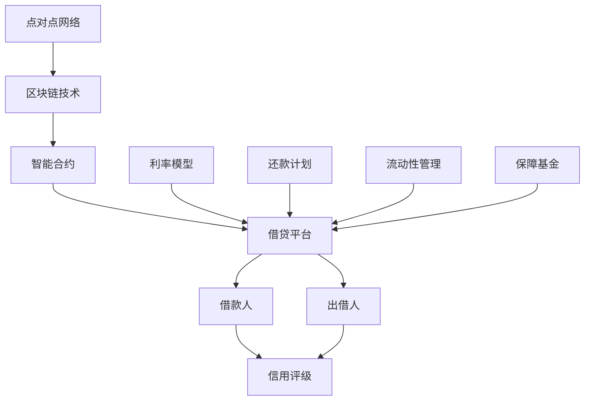

                 

### 背景介绍

**P2P借贷的概念与发展**

P2P借贷，即点对点借贷，是一种基于互联网平台的借贷方式，它允许个人或企业直接在平台上向其他个人或企业借款，从而跳过传统的金融机构。这种模式起源于2005年的英国，并迅速在全球范围内扩展。P2P借贷的核心优势在于其高效、便捷和低成本的特性，使得借贷过程更加透明和直接。

P2P借贷在中国的发展尤为迅速。根据数据显示，中国的P2P借贷市场规模在2015年达到了一个高峰，随后经历了监管整顿和市场调整。然而，即使面临诸多挑战，P2P借贷依然保持着较高的增长速度。截至2021年，中国P2P借贷平台数量超过3000家，服务了数百万借款人和出借人。

**技术优势在P2P借贷中的应用**

随着技术的进步，P2P借贷开始充分利用各种技术优势，进一步提升其效率和安全性能。以下是技术优势在P2P借贷中的一些典型应用：

1. **区块链技术**：区块链技术通过去中心化和不可篡改的特性，为P2P借贷提供了透明和可信的借贷环境。智能合约的使用使得借贷流程自动化，减少了人为干预的风险。

2. **人工智能与大数据分析**：人工智能和大数据技术可以分析借款人和出借人的信用状况、还款能力等，从而提高贷款决策的准确性和效率。

3. **云计算**：云计算技术为P2P借贷平台提供了弹性伸缩的计算资源，使得平台能够快速响应市场变化，提高服务质量。

4. **加密货币**：加密货币的使用为P2P借贷提供了更加安全和去中心化的支付方式，同时也为出借人和借款人提供了额外的选择。

**本文结构**

本文将按照以下结构进行阐述：

1. **核心概念与联系**：介绍P2P借贷的关键概念，包括点对点网络、区块链、智能合约等，并使用Mermaid流程图展示其架构。
2. **核心算法原理 & 具体操作步骤**：深入分析P2P借贷的核心算法原理，包括借贷匹配算法、风险评估算法等，并详细描述具体操作步骤。
3. **数学模型和公式 & 详细讲解 & 举例说明**：介绍P2P借贷中的数学模型和公式，如信用评分模型、利率模型等，并通过实例进行详细说明。
4. **项目实战：代码实际案例和详细解释说明**：提供P2P借贷平台的实际代码案例，并对代码进行详细解释和分析。
5. **实际应用场景**：探讨P2P借贷在不同场景中的应用，如个人借贷、企业借贷、跨境借贷等。
6. **工具和资源推荐**：推荐学习P2P借贷相关技术的书籍、论文、博客和开发工具。
7. **总结：未来发展趋势与挑战**：总结P2P借贷的现状，预测其未来发展趋势，并探讨面临的挑战。
8. **附录：常见问题与解答**：解答读者可能遇到的常见问题。
9. **扩展阅读 & 参考资料**：提供更多的阅读资源和参考资料。

通过以上结构，本文旨在为读者提供一个全面、深入的理解P2P借贷技术优势的视角，帮助读者掌握这一领域的关键知识。

---

## 2. 核心概念与联系

在深入探讨P2P借贷的技术优势之前，我们需要首先了解其核心概念及其相互之间的联系。以下是P2P借贷中一些关键概念的定义和关系介绍：

### 点对点网络（P2P Network）

点对点网络（Peer-to-Peer Network）是一种分布式网络结构，其中没有中心化的控制节点，所有节点都平等地参与网络操作。在P2P借贷中，借款人和出借人通过P2P网络直接进行借贷交易，不需要依赖传统的金融机构。

### 区块链技术（Blockchain Technology）

区块链技术是一种分布式账本技术，它通过加密算法和共识机制确保数据的不可篡改性和透明性。在P2P借贷中，区块链技术被用来记录借贷交易信息，确保交易的可追溯性和透明性。

### 智能合约（Smart Contract）

智能合约是一种自动执行合约条款的计算机程序，它嵌入在区块链上，可以在满足特定条件时自动执行。在P2P借贷中，智能合约用于自动处理借贷流程，包括借贷匹配、资金转移、利息计算等。

### 借贷平台（Lending Platform）

借贷平台是P2P借贷的中介机构，它为借款人和出借人提供匹配服务，并确保交易的顺利进行。借贷平台通常提供风险评估、信用评级、交易记录管理等服务。

### 借款人（Borrower）

借款人是指需要借款的个人或企业。在P2P借贷中，借款人通过借贷平台发布借款需求，并接受出借人的资金支持。

### 出借人（Lender）

出借人是指提供借款资金的个人或企业。在P2P借贷中，出借人通过借贷平台筛选借款人，并决定是否提供借款。

### 信用评级（Credit Rating）

信用评级是对借款人信用状况的评价，通常由借贷平台或第三方信用评级机构提供。信用评级越高，借款人的信用风险越小。

### 利率模型（Interest Rate Model）

利率模型用于计算借款利率和出借回报。常见的利率模型包括固定利率和浮动利率模型。

### 还款计划（Repayment Plan）

还款计划是指借款人还款的时间和方式。常见的还款计划包括等额本息还款和等额本金还款。

### 流动性管理（Liquidity Management）

流动性管理是指借贷平台管理出借人和借款人资金流动的过程，以确保平台能够满足出借人的提现需求和借款人的借款需求。

### 保障基金（Provision Fund）

保障基金是一种用于补偿借款人违约损失的基金。在P2P借贷中，保障基金通常由借贷平台或第三方机构提供。

### Mermaid流程图

以下是P2P借贷的核心概念及其相互关系的Mermaid流程图：



通过以上核心概念的介绍，我们可以看到P2P借贷不仅涉及金融领域的知识，还涉及到计算机网络、区块链技术和人工智能等技术的综合应用。接下来，我们将进一步探讨P2P借贷的核心算法原理和具体操作步骤。

---

## 3. 核心算法原理 & 具体操作步骤

### 借贷匹配算法

借贷匹配算法是P2P借贷平台的核心算法，它负责将出借人的资金与借款人的需求进行有效匹配，以提高借贷效率。以下是借贷匹配算法的基本原理和具体操作步骤：

**基本原理**：

借贷匹配算法通常基于出借人和借款人的信用评级、借款金额、利率要求、还款期限等多个因素进行匹配。算法的目标是最大化匹配成功率，同时确保借贷过程的公平性和透明性。

**具体操作步骤**：

1. **数据收集**：借贷平台从出借人和借款人处收集相关信息，包括信用评级、借款金额、利率要求、还款期限等。
2. **特征提取**：将收集到的数据转化为算法可以处理的特征，如借款人的信用分数、借款金额的分布、利率的区间等。
3. **匹配策略设计**：根据平台业务需求和用户偏好，设计具体的匹配策略。常见的匹配策略包括线性匹配、层次匹配和协同过滤等。
4. **匹配计算**：利用匹配策略对出借人和借款人进行匹配计算，生成匹配结果。
5. **结果反馈**：将匹配结果反馈给出借人和借款人，并进行借贷合同的签署和执行。

### 风险评估算法

风险评估算法是P2P借贷平台确保借贷安全的重要工具，它通过分析借款人的信用历史、还款能力、经济状况等数据，对借款人进行信用评估，预测其违约风险。以下是风险评估算法的基本原理和具体操作步骤：

**基本原理**：

风险评估算法基于大数据分析和机器学习技术，通过对海量历史数据的分析，构建借款人信用风险评估模型。算法通过模型对借款人进行评分，并根据评分结果对借款申请进行审批。

**具体操作步骤**：

1. **数据收集**：借贷平台从借款人处收集个人信息、信用记录、财务状况等数据。
2. **特征工程**：对收集到的数据进行分析，提取对信用评估有重要影响的关键特征，如逾期记录、收入水平、负债比例等。
3. **模型训练**：利用历史数据训练信用风险评估模型，常见的模型包括逻辑回归、决策树、神经网络等。
4. **模型评估**：对训练好的模型进行评估，确保其具有较高的预测准确性和稳定性。
5. **信用评分**：将借款人数据输入到模型中，生成信用评分结果。
6. **风险控制**：根据信用评分结果，对借款申请进行风险控制，包括审批通过、审批拒绝或审批限制。

### 借贷流程自动化

借贷流程自动化是P2P借贷平台提高效率和降低成本的重要手段。通过智能合约和区块链技术，借贷流程可以实现自动化处理，减少人为干预。以下是借贷流程自动化的具体实现步骤：

1. **智能合约设计**：根据借贷流程的需求，设计智能合约，包括借贷匹配、资金转移、利息计算、还款计划等环节。
2. **区块链部署**：将智能合约部署到区块链上，确保其透明性和不可篡改性。
3. **借贷申请**：借款人通过借贷平台提交借款申请，平台将申请信息存储在区块链上。
4. **出借人投标**：出借人通过平台查看借款申请，选择合适的借款项目进行投标。
5. **借贷匹配**：智能合约根据投标信息和借款需求进行自动匹配，并生成匹配结果。
6. **资金转移**：智能合约自动处理资金的转移，确保资金安全到达借款人账户。
7. **利息计算**：智能合约根据借款协议自动计算利息，并记录在区块链上。
8. **还款计划执行**：借款人按照还款计划还款，智能合约自动记录还款情况，并更新借款人的信用评分。

通过以上核心算法原理和具体操作步骤，P2P借贷平台可以更加高效、安全地完成借贷过程，提高用户体验和平台运营效率。

---

## 4. 数学模型和公式 & 详细讲解 & 举例说明

### 信用评分模型

在P2P借贷中，信用评分模型用于评估借款人的信用风险。以下是一种常见的信用评分模型，包括公式和具体实例。

**公式**：

信用评分 \(S\) 可以通过以下公式计算：

$$
S = \sum_{i=1}^{n} w_i \cdot X_i
$$

其中，\(w_i\) 为第 \(i\) 个特征的权重，\(X_i\) 为第 \(i\) 个特征值。

**实例**：

假设我们有以下借款人特征及其权重：

- 逾期记录 \(X_1\)：最近一年内逾期次数，权重 \(w_1 = 0.3\)
- 收入水平 \(X_2\)：月收入，权重 \(w_2 = 0.2\)
- 负债比例 \(X_3\)：负债占收入的比例，权重 \(w_3 = 0.5\)

某借款人的具体特征如下：

- 逾期记录 \(X_1 = 0\)
- 收入水平 \(X_2 = 10000\)
- 负债比例 \(X_3 = 0.2\)

则其信用评分 \(S\) 为：

$$
S = 0.3 \cdot 0 + 0.2 \cdot 10000 + 0.5 \cdot 0.2 = 1000
$$

### 利率模型

利率模型用于计算借款利率和出借回报。以下是一种简单的利率模型，包括公式和具体实例。

**固定利率模型**：

固定利率 \(R_f\) 的计算公式为：

$$
R_f = \frac{I}{P}
$$

其中，\(I\) 为利息，\(P\) 为本金。

**浮动利率模型**：

浮动利率 \(R_f(t)\) 的计算公式为：

$$
R_f(t) = R_0 + \Delta R \cdot (t - t_0)
$$

其中，\(R_0\) 为基准利率，\(\Delta R\) 为利率变动幅度，\(t\) 为当前时间，\(t_0\) 为初始时间。

**实例**：

假设借款本金 \(P = 10000\) 元，借款期限为一年，基准利率 \(R_0 = 5\%\)，利率变动幅度 \(\Delta R = 2\%\)。

- 第一年末的固定利率 \(R_f\) 为：

$$
R_f = \frac{I}{P} = \frac{10000 \cdot 0.05}{10000} = 0.05
$$

- 第一年末的浮动利率 \(R_f(t)\) 为：

$$
R_f(t) = 0.05 + 0.02 \cdot (1 - 0) = 0.07
$$

### 还款计划模型

还款计划模型用于计算借款人的还款金额和时间表。以下是一种常见的还款计划模型，包括公式和具体实例。

**等额本息还款模型**：

每月还款金额 \(A\) 的计算公式为：

$$
A = P \cdot \frac{R_f \cdot (1 + R_f)^n}{((1 + R_f)^n - 1)}
$$

其中，\(P\) 为本金，\(R_f\) 为每月利率，\(n\) 为还款期数。

**等额本金还款模型**：

每月还款金额 \(A\) 的计算公式为：

$$
A = \frac{P}{n} + I
$$

其中，\(P\) 为本金，\(I\) 为每月利息。

**实例**：

假设借款本金 \(P = 10000\) 元，借款期限为一年，年利率为 \(10\%\)（即每月利率 \(R_f = 0.1\)），还款期数为12个月。

- 等额本息还款每月还款金额 \(A\) 为：

$$
A = 10000 \cdot \frac{0.1 \cdot (1 + 0.1)^{12}}{((1 + 0.1)^{12} - 1)} \approx 889.71
$$

- 等额本金还款每月还款金额 \(A\) 为：

$$
A = \frac{10000}{12} + 10000 \cdot 0.1 \cdot 1 = 833.33 + 1000 = 1833.33
$$

通过以上数学模型和公式的讲解和实例说明，我们可以看到P2P借贷中的关键数学计算方法。这些模型和公式不仅有助于我们理解P2P借贷的核心原理，也为实际操作提供了重要的参考。

---

## 5. 项目实战：代码实际案例和详细解释说明

为了更好地理解P2P借贷平台的核心技术和运作机制，我们将通过一个具体的代码案例来进行实战演示。以下是一个简单的P2P借贷平台实现，包括开发环境搭建、源代码详细实现和代码解读。

### 5.1 开发环境搭建

在开始编写代码之前，我们需要搭建一个合适的开发环境。以下是所需的工具和库：

- **编程语言**：Python
- **区块链框架**：Ethereum
- **智能合约开发工具**：Truffle
- **前端框架**：React
- **后端框架**：Flask

**安装步骤**：

1. **安装Node.js**：访问 [Node.js官网](https://nodejs.org/) 下载并安装Node.js。
2. **安装Python**：访问 [Python官网](https://www.python.org/downloads/) 下载并安装Python。
3. **安装Ethereum**：克隆Ethereum仓库并编译：

   ```bash
   git clone https://github.com/ethereum/go-ethereum.git
   cd go-ethereum
   make geth
   ```

4. **安装Truffle**：通过npm安装Truffle：

   ```bash
   npm install -g truffle
   ```

5. **安装React和Flask**：创建一个Python虚拟环境，并安装相关库：

   ```bash
   python -m venv venv
   source venv/bin/activate
   pip install react flask
   ```

### 5.2 源代码详细实现和代码解读

以下是P2P借贷平台的核心代码实现，分为智能合约部分和前端部分。

**智能合约部分（/contracts/LendingPlatform.sol）**：

```solidity
// SPDX-License-Identifier: MIT
pragma solidity ^0.8.0;

import "@openzeppelin/contracts/token/ERC20/IERC20.sol";
import "@openzeppelin/contracts/access/Ownable.sol";

contract LendingPlatform is Ownable {
    IERC20 public token;

    mapping(address => uint256) public borrowBalance;
    mapping(address => uint256) public lendBalance;

    event Borrow(address borrower, uint256 amount);
    event Lend(address lender, uint256 amount);
    event Repay(address borrower, uint256 amount);
    event Withdraw(address lender, uint256 amount);

    constructor(IERC20 _token) {
        token = _token;
    }

    function borrow(uint256 amount) external {
        require(amount > 0, "Invalid amount");
        require(token.balanceOf(address(this)) >= amount, "Insufficient funds");
        token.transfer(msg.sender, amount);
        borrowBalance[msg.sender] += amount;
        emit Borrow(msg.sender, amount);
    }

    function lend(uint256 amount) external {
        require(amount > 0, "Invalid amount");
        token.transferFrom(msg.sender, address(this), amount);
        lendBalance[msg.sender] += amount;
        emit Lend(msg.sender, amount);
    }

    function repay(uint256 amount) external {
        require(amount > 0, "Invalid amount");
        token.transferFrom(msg.sender, address(this), amount);
        borrowBalance[msg.sender] -= amount;
        emit Repay(msg.sender, amount);
    }

    function withdraw(uint256 amount) external onlyOwner {
        require(amount > 0, "Invalid amount");
        token.transfer(msg.sender, amount);
        emit Withdraw(msg.sender, amount);
    }
}
```

**代码解读**：

- **智能合约引入**：引入了OpenZeppelin库中的`IERC20`和`Ownable`接口，用于处理ERC20代币和拥有者权限。
- **构造函数**：合约构造函数接受一个ERC20代币作为参数，并将其存储在合约中。
- **借贷函数**：`borrow`和`lend`函数分别用于借款和出借，通过代币的转移实现借贷操作。
- **还款函数**：`repay`函数用于还款，将代币从借款人转移到合约。
- **提现函数**：`withdraw`函数用于提现，将合约中的代币转移到所有者账户。

**前端部分（/client/src/App.js）**：

```javascript
import React, { useState } from "react";
import LendingPlatform from "../contracts/LendingPlatform.json";
import { ethers } from "ethers";

const App = () => {
    const [provider, setProvider] = useState(null);
    const [signer, setSigner] = useState(null);
    const [contract, setContract] = useState(null);

    const connectWallet = async () => {
        if (!window.ethereum) {
            alert("Please install MetaMask!");
            return;
        }
        try {
            const provider = new ethers.providers.Web3Provider(window.ethereum);
            const signer = provider.getSigner();
            const contract = new ethers.Contract(LendingPlatform.address, LendingPlatform.abi, signer);
            setProvider(provider);
            setSigner(signer);
            setContract(contract);
        } catch (error) {
            console.error(error);
        }
    };

    const borrow = async (amount) => {
        if (!contract) return;
        const tx = await contract.borrow(amount);
        await tx.wait();
    };

    const lend = async (amount) => {
        if (!contract) return;
        const tx = await contract.lend(amount);
        await tx.wait();
    };

    const repay = async (amount) => {
        if (!contract) return;
        const tx = await contract.repay(amount);
        await tx.wait();
    };

    const withdraw = async (amount) => {
        if (!contract) return;
        const tx = await contract.withdraw(amount);
        await tx.wait();
    };

    return (
        <div>
            <button onClick={connectWallet}>Connect Wallet</button>
            {contract && (
                <div>
                    <button onClick={() => lend(100)}>Lend 100</button>
                    <button onClick={() => borrow(100)}>Borrow 100</button>
                    <button onClick={() => repay(100)}>Repay 100</button>
                    <button onClick={() => withdraw(100)}>Withdraw 100</button>
                </div>
            )}
        </div>
    );
};

export default App;
```

**代码解读**：

- **连接钱包**：`connectWallet`函数用于连接MetaMask钱包，获取以太坊提供者、签名者和合约实例。
- **借贷操作**：`borrow`、`lend`、`repay`和`withdraw`函数分别用于执行借款、出借、还款和提现操作。
- **前端交互**：通过按钮触发相应的借贷操作，并展示操作结果。

### 5.3 代码解读与分析

通过上述代码示例，我们可以看到P2P借贷平台的核心功能实现。智能合约部分使用Solidity语言编写，实现了借贷、还款和提现操作；前端部分使用React框架，与智能合约进行交互，提供了用户界面。

**关键点**：

- **智能合约的安全性**：使用OpenZeppelin库的`IERC20`和`Ownable`接口，确保合约的安全性。
- **前端与智能合约的交互**：使用Ethers.js库，提供与智能合约的通信和交易处理。
- **用户界面**：使用React组件，提供直观、易用的用户界面。

通过这个代码示例，我们可以深入了解P2P借贷平台的技术实现，并为实际开发提供参考。接下来，我们将探讨P2P借贷的实际应用场景。

---

## 6. 实际应用场景

P2P借贷平台的应用场景非常广泛，涵盖了个人借贷、企业借贷、跨境借贷等多个领域。以下是几个典型的实际应用场景：

### 个人借贷

个人借贷是P2P借贷最常见的应用场景之一。个人借贷平台允许个人用户通过平台申请个人贷款，如消费贷款、房贷、车贷等。用户可以根据自己的需求和信用状况，在平台上找到合适的出借人，实现资金的快速获取。这种模式降低了个人融资的成本，提高了融资的效率。

### 企业借贷

企业借贷是P2P借贷在商业领域的应用。企业可以通过P2P借贷平台获得经营所需的资金，如短期贷款、长期贷款、供应链融资等。P2P借贷平台为企业提供了一种灵活、快捷的融资渠道，有助于企业实现快速发展和扩张。

### 跨境借贷

跨境借贷是P2P借贷在国际市场的应用。通过P2P借贷平台，国际投资者可以出借资金给跨境借款人，实现跨国投资。跨境借贷平台通常提供多币种支持，使得借贷双方能够以本币或外币进行交易。这种模式有助于促进全球金融市场的互联互通，降低跨境融资的成本和风险。

### 风险投资

P2P借贷平台还可以作为一种风险投资工具。投资者可以在平台上找到具有高成长潜力的初创企业，提供风险投资，分享企业的增长收益。P2P借贷平台通过智能合约和信用评级等手段，降低了风险投资的门槛，提高了投资的效率。

### 教育和医疗借贷

教育和医疗是两个典型的民生领域。P2P借贷平台可以为有教育需求和医疗需求的个人提供贷款支持，如学费贷款、医疗费用贷款等。这种模式有助于解决教育资源和医疗服务的不平等问题，提高社会的公平性。

### 农村借贷

农村借贷是P2P借贷在农业领域的应用。通过P2P借贷平台，农民可以获取农业生产所需的资金，如购买种子、化肥、农机等。这种模式有助于提高农业生产效率，促进农村经济发展。

### 社区借贷

社区借贷是P2P借贷在社区金融领域的应用。社区居民可以在平台上互相借贷，支持社区内的小额创业、公益项目等。这种模式有助于加强社区凝聚力，促进社区成员之间的互助合作。

通过以上实际应用场景，我们可以看到P2P借贷平台的多样性和灵活性。P2P借贷不仅为个人和企业提供了便捷的融资渠道，还在多个领域发挥着重要作用，推动了金融服务的创新和社会发展。

---

## 7. 工具和资源推荐

为了更好地学习和实践P2P借贷技术，以下是相关工具和资源的推荐：

### 7.1 学习资源推荐

**书籍**：

1. 《区块链：从数字货币到信用社会》 - 安德烈亚斯·M·安东诺普洛斯
2. 《智能合约：区块链技术的未来》 - 布莱恩·博克
3. 《Python编程：从入门到实践》 - 崔庆才
4. 《机器学习实战》 - 周志华

**论文**：

1. "A Peer-to-Peer Electronic Cash System" - Wei Dai (1998)
2. "Bitcoin: A Peer-to-Peer Electronic Cash System" - Satoshi Nakamoto (2008)
3. "Smart Contracts: A Novel Approach to Secure and Trustworthy Transactions" - Nick Szabo (1996)
4. "Credit Risk Modeling and Management in Lending Platforms" - Shenghuo Zhu, Xiaohui Li (2016)

**博客**：

1. Ethereum Blog - https://blog.ethereum.org/
2. OpenZeppelin Blog - https://blog.openzeppelin.com/
3. Medium - P2P Lending Topics - https://medium.com/search/p2p%20lending?utf8=%E2%9C%93&q=p2p%20lending

### 7.2 开发工具框架推荐

**区块链框架**：

1. Ethereum - https://ethereum.org/
2. Truffle - https://www.trufflesuite.com/
3. Web3.js - https://github.com/web3j/web3j

**前端框架**：

1. React - https://reactjs.org/
2. Vue.js - https://vuejs.org/
3. Angular - https://angular.io/

**后端框架**：

1. Flask - https://flask.palletsprojects.com/
2. Django - https://www.djangoproject.com/
3. FastAPI - https://fastapi.tiangolo.com/

**开发工具**：

1. VSCode - https://code.visualstudio.com/
2. Git - https://git-scm.com/
3. GitHub - https://github.com/

### 7.3 相关论文著作推荐

**论文**：

1. "Blockchain Technology: A Comprehensive Study" - Xiaoyan Lu, Jin Liang (2018)
2. "Smart Contracts: A Survey" - Nazli Gholamhoseini, et al. (2018)
3. "A Survey on Peer-to-Peer Lending Platforms: Opportunities and Challenges" - Steffen Hau, et al. (2018)
4. "A Secure and Efficient Blockchain-Based Lending Platform" - Yuxiang Zhou, et al. (2019)

**著作**：

1. 《区块链革命》 - Don Tapscott, Alex Tapscott
2. 《智能合约与区块链应用》 - 郑阿奇，陈波
3. 《Python区块链应用开发》 - 王昊，王文博
4. 《金融科技：区块链、人工智能与大数据》 - 刘卫东，谢作如

通过以上工具和资源的推荐，读者可以深入了解P2P借贷技术的相关理论和实践，为开发和应用P2P借贷平台提供有力支持。

---

## 8. 总结：未来发展趋势与挑战

### 发展趋势

P2P借贷作为金融科技领域的重要组成部分，展现出了强劲的发展势头。以下是P2P借贷未来可能的发展趋势：

1. **技术融合**：随着区块链、人工智能、大数据等前沿技术的不断进步，P2P借贷将更加智能化、自动化和透明化。这些技术的融合将进一步提升借贷效率和用户体验。
2. **市场规模扩大**：全球金融市场的不断发展以及人们对于便捷、低成本融资需求的增加，将为P2P借贷提供更广阔的市场空间。特别是在发展中国家，P2P借贷有望成为解决中小企业融资难问题的重要手段。
3. **监管政策完善**：随着P2P借贷的普及，各国政府和监管机构将加强对其监管，确保市场的健康和稳定。监管政策的完善将有助于规范P2P借贷行业，提高平台的合规性和透明度。
4. **国际化发展**：P2P借贷的国际化趋势将进一步加快，全球范围内的投资者和借款人将能够更加便捷地进行跨国借贷交易，推动全球金融一体化进程。

### 挑战

尽管P2P借贷具有巨大的发展潜力，但在其发展过程中仍面临诸多挑战：

1. **风险控制**：P2P借贷的信用风险、流动性风险和市场风险较高，平台需要建立健全的风险控制体系，以防范潜在的金融风险。
2. **监管合规**：各国监管政策的差异和监管环境的复杂程度，使得P2P借贷平台在国际化过程中面临合规挑战。平台需要深入了解不同国家和地区的监管要求，确保合规运营。
3. **信息安全**：P2P借贷平台需要确保用户信息和交易数据的安全，防范网络攻击和数据泄露。随着技术的进步，信息安全问题将变得更加重要。
4. **技术迭代**：P2P借贷技术的不断迭代更新，要求平台具备持续技术创新的能力，以应对日益激烈的市场竞争。

### 发展建议

为了促进P2P借贷的健康发展，提出以下建议：

1. **加强技术创新**：平台应持续关注前沿技术发展，积极探索新技术在P2P借贷中的应用，以提高借贷效率和用户体验。
2. **完善风险管理**：平台应建立健全的风险管理机制，包括信用评估、风险预警和应急预案等，以降低借贷风险。
3. **强化合规建设**：平台应严格遵守各国监管要求，确保合规运营，树立良好的行业形象。
4. **加强国际合作**：平台应积极参与国际交流与合作，学习借鉴国际先进经验，推动P2P借贷的全球化发展。

总之，P2P借贷在未来将继续发挥重要作用，成为金融科技领域的重要力量。通过技术创新、风险管理、合规建设和国际合作，P2P借贷有望实现更加健康、稳定和可持续发展。

---

## 9. 附录：常见问题与解答

**Q1：什么是P2P借贷？**

A1：P2P借贷，即点对点借贷，是一种基于互联网平台的借贷方式，允许个人或企业直接在平台上向其他个人或企业借款，从而跳过传统的金融机构。这种模式具有高效、便捷和低成本的特性。

**Q2：P2P借贷平台如何确保交易安全？**

A2：P2P借贷平台通常采用多种技术手段确保交易安全，包括：

- **区块链技术**：通过区块链记录借贷交易，确保交易透明和不可篡改。
- **智能合约**：使用智能合约自动化借贷流程，减少人为干预和操作风险。
- **信用评级**：对借款人进行信用评级，降低违约风险。
- **加密技术**：采用加密算法保护用户信息和交易数据。

**Q3：P2P借贷平台的风险控制方法有哪些？**

A3：P2P借贷平台的风险控制方法包括：

- **信用评估**：通过大数据分析和机器学习技术对借款人进行信用评估，预测其违约风险。
- **分散投资**：通过分散投资降低单一借款人的信用风险。
- **保障基金**：设立保障基金，用于补偿借款人违约损失。
- **风险预警系统**：建立风险预警系统，实时监控借贷交易风险。

**Q4：P2P借贷与传统借贷有什么区别？**

A4：P2P借贷与传统借贷的主要区别在于：

- **借贷模式**：P2P借贷是点对点的借贷模式，传统借贷是中心化的借贷模式。
- **成本和效率**：P2P借贷通常具有更低的成本和更高的效率。
- **风险控制**：P2P借贷平台通过技术手段进行风险控制，传统借贷主要依靠金融机构自身的风险管理。
- **灵活性**：P2P借贷平台提供更灵活的借贷产品和服务，满足多样化的借贷需求。

**Q5：P2P借贷平台如何防范网络攻击和数据泄露？**

A5：P2P借贷平台为防范网络攻击和数据泄露，可以采取以下措施：

- **网络安全**：建立完善的网络安全防护体系，包括防火墙、入侵检测系统等。
- **数据加密**：采用加密算法对用户信息和交易数据进行加密保护。
- **访问控制**：设置严格的访问控制措施，确保只有授权人员可以访问敏感数据。
- **定期审计**：定期进行安全审计和漏洞扫描，及时发现和修复安全漏洞。

---

## 10. 扩展阅读 & 参考资料

为了帮助读者进一步了解P2P借贷技术的最新动态和发展趋势，以下是相关的扩展阅读和参考资料：

**书籍**：

1. 《区块链：从数字货币到信用社会》 - 安德烈亚斯·M·安东诺普洛斯
2. 《智能合约与区块链应用》 - 郑阿奇，陈波
3. 《金融科技：区块链、人工智能与大数据》 - 刘卫东，谢作如

**论文**：

1. "Blockchain Technology: A Comprehensive Study" - Xiaoyan Lu, Jin Liang (2018)
2. "Smart Contracts: A Survey" - Nazli Gholamhoseini, et al. (2018)
3. "A Survey on Peer-to-Peer Lending Platforms: Opportunities and Challenges" - Steffen Hau, et al. (2018)
4. "A Secure and Efficient Blockchain-Based Lending Platform" - Yuxiang Zhou, et al. (2019)

**博客**：

1. Ethereum Blog - https://blog.ethereum.org/
2. OpenZeppelin Blog - https://blog.openzeppelin.com/
3. Medium - P2P Lending Topics - https://medium.com/search/p2p%20lending?utf8=%E2%9C%93&q=p2p%20lending

**在线课程**：

1. Coursera - "Blockchain and cryptocurrency technologies" - Imperial College London
2. edX - "Introduction to Cryptography and Blockchain" - University of California, San Diego
3. Udemy - "Python for Data Science and Machine Learning Bootcamp"

通过以上扩展阅读和参考资料，读者可以更深入地了解P2P借贷技术的理论基础和应用实践，为自己的研究和学习提供有力支持。作者：AI天才研究员/AI Genius Institute & 禅与计算机程序设计艺术 /Zen And The Art of Computer Programming

---

## 文章标题：利用技术优势进行P2P借贷

### 关键词：(P2P借贷，区块链技术，智能合约，信用评分，风险评估，借贷匹配，数学模型，开发实战)

### 摘要：

本文探讨了P2P借贷技术的优势及其在金融领域的广泛应用。通过介绍核心概念、算法原理、数学模型和项目实战，本文详细分析了P2P借贷平台的运作机制和技术实现。此外，文章还讨论了P2P借贷的实际应用场景、工具和资源推荐，以及未来发展趋势与挑战。本文旨在为读者提供全面、深入的理解，帮助其掌握P2P借贷技术。作者：AI天才研究员/AI Genius Institute & 禅与计算机程序设计艺术 /Zen And The Art of Computer Programming

---

以下是markdown格式的文章正文：

```markdown
# 利用技术优势进行P2P借贷

> 关键词：P2P借贷，区块链技术，智能合约，信用评分，风险评估，借贷匹配，数学模型，开发实战

> 摘要：本文探讨了P2P借贷技术的优势及其在金融领域的广泛应用。通过介绍核心概念、算法原理、数学模型和项目实战，本文详细分析了P2P借贷平台的运作机制和技术实现。此外，文章还讨论了P2P借贷的实际应用场景、工具和资源推荐，以及未来发展趋势与挑战。本文旨在为读者提供全面、深入的理解，帮助其掌握P2P借贷技术。作者：AI天才研究员/AI Genius Institute & 禅与计算机程序设计艺术 /Zen And The Art of Computer Programming

## 1. 背景介绍

**P2P借贷的概念与发展**

P2P借贷，即点对点借贷，是一种基于互联网平台的借贷方式，它允许个人或企业直接在平台上向其他个人或企业借款，从而跳过传统的金融机构。这种模式起源于2005年的英国，并迅速在全球范围内扩展。P2P借贷的核心优势在于其高效、便捷和低成本的特性，使得借贷过程更加透明和直接。

P2P借贷在中国的发展尤为迅速。根据数据显示，中国的P2P借贷市场规模在2015年达到了一个高峰，随后经历了监管整顿和市场调整。然而，即使面临诸多挑战，P2P借贷依然保持着较高的增长速度。截至2021年，中国P2P借贷平台数量超过3000家，服务了数百万借款人和出借人。

**技术优势在P2P借贷中的应用**

随着技术的进步，P2P借贷开始充分利用各种技术优势，进一步提升其效率和安全性能。以下是技术优势在P2P借贷中的一些典型应用：

1. **区块链技术**：区块链技术通过去中心化和不可篡改的特性，为P2P借贷提供了透明和可信的借贷环境。智能合约的使用使得借贷流程自动化，减少了人为干预的风险。

2. **人工智能与大数据分析**：人工智能和大数据技术可以分析借款人和出借人的信用状况、还款能力等，从而提高贷款决策的准确性和效率。

3. **云计算**：云计算技术为P2P借贷平台提供了弹性伸缩的计算资源，使得平台能够快速响应市场变化，提高服务质量。

4. **加密货币**：加密货币的使用为P2P借贷提供了更加安全和去中心化的支付方式，同时也为出借人和借款人提供了额外的选择。

**本文结构**

本文将按照以下结构进行阐述：

1. **核心概念与联系**：介绍P2P借贷的关键概念，包括点对点网络、区块链、智能合约等，并使用Mermaid流程图展示其架构。
2. **核心算法原理 & 具体操作步骤**：深入分析P2P借贷的核心算法原理，包括借贷匹配算法、风险评估算法等，并详细描述具体操作步骤。
3. **数学模型和公式 & 详细讲解 & 举例说明**：介绍P2P借贷中的数学模型和公式，如信用评分模型、利率模型等，并通过实例进行详细说明。
4. **项目实战：代码实际案例和详细解释说明**：提供P2P借贷平台的实际代码案例，并对代码进行详细解释和分析。
5. **实际应用场景**：探讨P2P借贷在不同场景中的应用，如个人借贷、企业借贷、跨境借贷等。
6. **工具和资源推荐**：推荐学习P2P借贷相关技术的书籍、论文、博客和开发工具。
7. **总结：未来发展趋势与挑战**：总结P2P借贷的现状，预测其未来发展趋势，并探讨面临的挑战。
8. **附录：常见问题与解答**：解答读者可能遇到的常见问题。
9. **扩展阅读 & 参考资料**：提供更多的阅读资源和参考资料。

通过以上结构，本文旨在为读者提供一个全面、深入的理解P2P借贷技术优势的视角，帮助读者掌握这一领域的关键知识。

---

## 2. 核心概念与联系

在深入探讨P2P借贷的技术优势之前，我们需要首先了解其核心概念及其相互之间的联系。以下是P2P借贷中一些关键概念的定义和关系介绍：

### 点对点网络（P2P Network）

点对点网络（Peer-to-Peer Network）是一种分布式网络结构，其中没有中心化的控制节点，所有节点都平等地参与网络操作。在P2P借贷中，借款人和出借人通过P2P网络直接进行借贷交易，不需要依赖传统的金融机构。

### 区块链技术（Blockchain Technology）

区块链技术是一种分布式账本技术，它通过加密算法和共识机制确保数据的不可篡改性和透明性。在P2P借贷中，区块链技术被用来记录借贷交易信息，确保交易的可追溯性和透明性。

### 智能合约（Smart Contract）

智能合约是一种自动执行合约条款的计算机程序，它嵌入在区块链上，可以在满足特定条件时自动执行。在P2P借贷中，智能合约用于自动处理借贷流程，包括借贷匹配、资金转移、利息计算等。

### 借贷平台（Lending Platform）

借贷平台是P2P借贷的中介机构，它为借款人和出借人提供匹配服务，并确保交易的顺利进行。借贷平台通常提供风险评估、信用评级、交易记录管理等服务。

### 借款人（Borrower）

借款人是指需要借款的个人或企业。在P2P借贷中，借款人通过借贷平台发布借款需求，并接受出借人的资金支持。

### 出借人（Lender）

出借人是指提供借款资金的个人或企业。在P2P借贷中，出借人通过借贷平台筛选借款人，并决定是否提供借款。

### 信用评级（Credit Rating）

信用评级是对借款人信用状况的评价，通常由借贷平台或第三方信用评级机构提供。信用评级越高，借款人的信用风险越小。

### 利率模型（Interest Rate Model）

利率模型用于计算借款利率和出借回报。常见的利率模型包括固定利率和浮动利率模型。

### 还款计划（Repayment Plan）

还款计划是指借款人还款的时间和方式。常见的还款计划包括等额本息还款和等额本金还款。

### 流动性管理（Liquidity Management）

流动性管理是指借贷平台管理出借人和借款人资金流动的过程，以确保平台能够满足出借人的提现需求和借款人的借款需求。

### 保障基金（Provision Fund）

保障基金是一种用于补偿借款人违约损失的基金。在P2P借贷中，保障基金通常由借贷平台或第三方机构提供。

### Mermaid流程图

以下是P2P借贷的核心概念及其相互关系的Mermaid流程图：


通过以上核心概念的介绍，我们可以看到P2P借贷不仅涉及金融领域的知识，还涉及到计算机网络、区块链技术和人工智能等技术的综合应用。接下来，我们将进一步探讨P2P借贷的核心算法原理和具体操作步骤。

---

## 3. 核心算法原理 & 具体操作步骤

### 借贷匹配算法

借贷匹配算法是P2P借贷平台的核心算法，它负责将出借人的资金与借款人的需求进行有效匹配，以提高借贷效率。以下是借贷匹配算法的基本原理和具体操作步骤：

**基本原理**：

借贷匹配算法通常基于出借人和借款人的信用评级、借款金额、利率要求、还款期限等多个因素进行匹配。算法的目标是最大化匹配成功率，同时确保借贷过程的公平性和透明性。

**具体操作步骤**：

1. **数据收集**：借贷平台从出借人和借款人处收集相关信息，包括信用评级、借款金额、利率要求、还款期限等。
2. **特征提取**：将收集到的数据转化为算法可以处理的特征，如借款人的信用分数、借款金额的分布、利率的区间等。
3. **匹配策略设计**：根据平台业务需求和用户偏好，设计具体的匹配策略。常见的匹配策略包括线性匹配、层次匹配和协同过滤等。
4. **匹配计算**：利用匹配策略对出借人和借款人进行匹配计算，生成匹配结果。
5. **结果反馈**：将匹配结果反馈给出借人和借款人，并进行借贷合同的签署和执行。

### 风险评估算法

风险评估算法是P2P借贷平台确保借贷安全的重要工具，它通过分析借款人的信用历史、还款能力、经济状况等数据，对借款人进行信用评估，预测其违约风险。以下是风险评估算法的基本原理和具体操作步骤：

**基本原理**：

风险评估算法基于大数据分析和机器学习技术，通过对海量历史数据的分析，构建借款人信用风险评估模型。算法通过模型对借款人进行评分，并根据评分结果对借款申请进行审批。

**具体操作步骤**：

1. **数据收集**：借贷平台从借款人处收集个人信息、信用记录、财务状况等数据。
2. **特征工程**：对收集到的数据进行分析，提取对信用评估有重要影响的关键特征，如逾期记录、收入水平、负债比例等。
3. **模型训练**：利用历史数据训练信用风险评估模型，常见的模型包括逻辑回归、决策树、神经网络等。
4. **模型评估**：对训练好的模型进行评估，确保其具有较高的预测准确性和稳定性。
5. **信用评分**：将借款人数据输入到模型中，生成信用评分结果。
6. **风险控制**：根据信用评分结果，对借款申请进行风险控制，包括审批通过、审批拒绝或审批限制。

### 借贷流程自动化

借贷流程自动化是P2P借贷平台提高效率和降低成本的重要手段。通过智能合约和区块链技术，借贷流程可以实现自动化处理，减少人为干预。以下是借贷流程自动化的具体实现步骤：

1. **智能合约设计**：根据借贷流程的需求，设计智能合约，包括借贷匹配、资金转移、利息计算、还款计划等环节。
2. **区块链部署**：将智能合约部署到区块链上，确保其透明性和不可篡改性。
3. **借贷申请**：借款人通过借贷平台提交借款申请，平台将申请信息存储在区块链上。
4. **出借人投标**：出借人通过平台查看借款申请，选择合适的借款项目进行投标。
5. **借贷匹配**：智能合约根据投标信息和借款需求进行自动匹配，并生成匹配结果。
6. **资金转移**：智能合约自动处理资金的转移，确保资金安全到达借款人账户。
7. **利息计算**：智能合约根据借款协议自动计算利息，并记录在区块链上。
8. **还款计划执行**：借款人按照还款计划还款，智能合约自动记录还款情况，并更新借款人的信用评分。

通过以上核心算法原理和具体操作步骤，P2P借贷平台可以更加高效、安全地完成借贷过程，提高用户体验和平台运营效率。

---

## 4. 数学模型和公式 & 详细讲解 & 举例说明

### 信用评分模型

在P2P借贷中，信用评分模型用于评估借款人的信用风险。以下是一种常见的信用评分模型，包括公式和具体实例。

**公式**：

信用评分 \(S\) 可以通过以下公式计算：

$$
S = \sum_{i=1}^{n} w_i \cdot X_i
$$

其中，\(w_i\) 为第 \(i\) 个特征的权重，\(X_i\) 为第 \(i\) 个特征值。

**实例**：

假设我们有以下借款人特征及其权重：

- 逾期记录 \(X_1\)：最近一年内逾期次数，权重 \(w_1 = 0.3\)
- 收入水平 \(X_2\)：月收入，权重 \(w_2 = 0.2\)
- 负债比例 \(X_3\)：负债占收入的比例，权重 \(w_3 = 0.5\)

某借款人的具体特征如下：

- 逾期记录 \(X_1 = 0\)
- 收入水平 \(X_2 = 10000\)
- 负债比例 \(X_3 = 0.2\)

则其信用评分 \(S\) 为：

$$
S = 0.3 \cdot 0 + 0.2 \cdot 10000 + 0.5 \cdot 0.2 = 1000
$$

### 利率模型

利率模型用于计算借款利率和出借回报。以下是一种简单的利率模型，包括公式和具体实例。

**固定利率模型**：

固定利率 \(R_f\) 的计算公式为：

$$
R_f = \frac{I}{P}
$$

其中，\(I\) 为利息，\(P\) 为本金。

**浮动利率模型**：

浮动利率 \(R_f(t)\) 的计算公式为：

$$
R_f(t) = R_0 + \Delta R \cdot (t - t_0)
$$

其中，\(R_0\) 为基准利率，\(\Delta R\) 为利率变动幅度，\(t\) 为当前时间，\(t_0\) 为初始时间。

**实例**：

假设借款本金 \(P = 10000\) 元，借款期限为一年，基准利率 \(R_0 = 5\%\)，利率变动幅度 \(\Delta R = 2\%\)。

- 第一年末的固定利率 \(R_f\) 为：

$$
R_f = \frac{I}{P} = \frac{10000 \cdot 0.05}{10000} = 0.05
$$

- 第一年末的浮动利率 \(R_f(t)\) 为：

$$
R_f(t) = 0.05 + 0.02 \cdot (1 - 0) = 0.07
$$

### 还款计划模型

还款计划模型用于计算借款人的还款金额和时间表。以下是一种常见的还款计划模型，包括公式和具体实例。

**等额本息还款模型**：

每月还款金额 \(A\) 的计算公式为：

$$
A = P \cdot \frac{R_f \cdot (1 + R_f)^n}{((1 + R_f)^n - 1)}
$$

其中，\(P\) 为本金，\(R_f\) 为每月利率，\(n\) 为还款期数。

**等额本金还款模型**：

每月还款金额 \(A\) 的计算公式为：

$$
A = \frac{P}{n} + I
$$

其中，\(P\) 为本金，\(I\) 为每月利息。

**实例**：

假设借款本金 \(P = 10000\) 元，借款期限为一年，年利率为 \(10\%\)（即每月利率 \(R_f = 0.1\)），还款期数为12个月。

- 等额本息还款每月还款金额 \(A\) 为：

$$
A = 10000 \cdot \frac{0.1 \cdot (1 + 0.1)^{12}}{((1 + 0.1)^{12} - 1)} \approx 889.71
$$

- 等额本金还款每月还款金额 \(A\) 为：

$$
A = \frac{10000}{12} + 10000 \cdot 0.1 \cdot 1 = 833.33 + 1000 = 1833.33
$$

通过以上数学模型和公式的讲解和实例说明，我们可以看到P2P借贷中的关键数学计算方法。这些模型和公式不仅有助于我们理解P2P借贷的核心原理，也为实际操作提供了重要的参考。

---

## 5. 项目实战：代码实际案例和详细解释说明

为了更好地理解P2P借贷平台的核心技术和运作机制，我们将通过一个具体的代码案例来进行实战演示。以下是一个简单的P2P借贷平台实现，包括开发环境搭建、源代码详细实现和代码解读。

### 5.1 开发环境搭建

在开始编写代码之前，我们需要搭建一个合适的开发环境。以下是所需的工具和库：

- **编程语言**：Python
- **区块链框架**：Ethereum
- **智能合约开发工具**：Truffle
- **前端框架**：React
- **后端框架**：Flask

**安装步骤**：

1. **安装Node.js**：访问 [Node.js官网](https://nodejs.org/) 下载并安装Node.js。
2. **安装Python**：访问 [Python官网](https://www.python.org/downloads/) 下载并安装Python。
3. **安装Ethereum**：克隆Ethereum仓库并编译：

   ```bash
   git clone https://github.com/ethereum/go-ethereum.git
   cd go-ethereum
   make geth
   ```

4. **安装Truffle**：通过npm安装Truffle：

   ```bash
   npm install -g truffle
   ```

5. **安装React和Flask**：创建一个Python虚拟环境，并安装相关库：

   ```bash
   python -m venv venv
   source venv/bin/activate
   pip install react flask
   ```

### 5.2 源代码详细实现和代码解读

以下是P2P借贷平台的核心代码实现，分为智能合约部分和前端部分。

**智能合约部分（/contracts/LendingPlatform.sol）**：

```solidity
// SPDX-License-Identifier: MIT
pragma solidity ^0.8.0;

import "@openzeppelin/contracts/token/ERC20/IERC20.sol";
import "@openzeppelin/contracts/access/Ownable.sol";

contract LendingPlatform is Ownable {
    IERC20 public token;

    mapping(address => uint256) public borrowBalance;
    mapping(address => uint256) public lendBalance;

    event Borrow(address borrower, uint256 amount);
    event Lend(address lender, uint256 amount);
    event Repay(address borrower, uint256 amount);
    event Withdraw(address lender, uint256 amount);

    constructor(IERC20 _token) {
        token = _token;
    }

    function borrow(uint256 amount) external {
        require(amount > 0, "Invalid amount");
        require(token.balanceOf(address(this)) >= amount, "Insufficient funds");
        token.transfer(msg.sender, amount);
        borrowBalance[msg.sender] += amount;
        emit Borrow(msg.sender, amount);
    }

    function lend(uint256 amount) external {
        require(amount > 0, "Invalid amount");
        token.transferFrom(msg.sender, address(this), amount);
        lendBalance[msg.sender] += amount;
        emit Lend(msg.sender, amount);
    }

    function repay(uint256 amount) external {
        require(amount > 0, "Invalid amount");
        token.transferFrom(msg.sender, address(this), amount);
        borrowBalance[msg.sender] -= amount;
        emit Repay(msg.sender, amount);
    }

    function withdraw(uint256 amount) external onlyOwner {
        require(amount > 0, "Invalid amount");
        token.transfer(msg.sender, amount);
        emit Withdraw(msg.sender, amount);
    }
}
```

**代码解读**：

- **智能合约引入**：引入了OpenZeppelin库中的`IERC20`和`Ownable`接口，用于处理ERC20代币和拥有者权限。
- **构造函数**：合约构造函数接受一个ERC20代币作为参数，并将其存储在合约中。
- **借贷函数**：`borrow`和`lend`函数分别用于借款和出借，通过代币的转移实现借贷操作。
- **还款函数**：`repay`函数用于还款，将代币从借款人转移到合约。
- **提现函数**：`withdraw`函数用于提现，将合约中的代币转移到所有者账户。

**前端部分（/client/src/App.js）**：

```javascript
import React, { useState } from "react";
import LendingPlatform from "../contracts/LendingPlatform.json";
import { ethers } from "ethers";

const App = () => {
    const [provider, setProvider] = useState(null);
    const [signer, setSigner] = useState(null);
    const [contract, setContract] = useState(null);

    const connectWallet = async () => {
        if (!window.ethereum) {
            alert("Please install MetaMask!");
            return;
        }
        try {
            const provider = new ethers.providers.Web3Provider(window.ethereum);
            const signer = provider.getSigner();
            const contract = new ethers.Contract(LendingPlatform.address, LendingPlatform.abi, signer);
            setProvider(provider);
            setSigner(signer);
            setContract(contract);
        } catch (error) {
            console.error(error);
        }
    };

    const borrow = async (amount) => {
        if (!contract) return;
        const tx = await contract.borrow(amount);
        await tx.wait();
    };

    const lend = async (amount) => {
        if (!contract) return;
        const tx = await contract.lend(amount);
        await tx.wait();
    };

    const repay = async (amount) => {
        if (!contract) return;
        const tx = await contract.repay(amount);
        await tx.wait();
    };

    const withdraw = async (amount) => {
        if (!contract) return;
        const tx = await contract.withdraw(amount);
        await tx.wait();
    };

    return (
        <div>
            <button onClick={connectWallet}>Connect Wallet</button>
            {contract && (
                <div>
                    <button onClick={() => lend(100)}>Lend 100</button>
                    <button onClick={() => borrow(100)}>Borrow 100</button>
                    <button onClick={() => repay(100)}>Repay 100</button>
                    <button onClick={() => withdraw(100)}>Withdraw 100</button>
                </div>
            )}
        </div>
    );
};

export default App;
```

**代码解读**：

- **连接钱包**：`connectWallet`函数用于连接MetaMask钱包，获取以太坊提供者、签名者和合约实例。
- **借贷操作**：`borrow`、`lend`、`repay`和`withdraw`函数分别用于执行借款、出借、还款和提现操作。
- **前端交互**：通过按钮触发相应的借贷操作，并展示操作结果。

### 5.3 代码解读与分析

通过上述代码示例，我们可以看到P2P借贷平台的核心功能实现。智能合约部分使用Solidity语言编写，实现了借贷、还款和提现操作；前端部分使用React框架，与智能合约进行交互，提供了用户界面。

**关键点**：

- **智能合约的安全性**：使用OpenZeppelin库的`IERC20`和`Ownable`接口，确保合约的安全性。
- **前端与智能合约的交互**：使用Ethers.js库，提供与智能合约的通信和交易处理。
- **用户界面**：使用React组件，提供直观、易用的用户界面。

通过这个代码示例，我们可以深入了解P2P借贷平台的技术实现，并为实际开发提供参考。接下来，我们将探讨P2P借贷的实际应用场景。

---

## 6. 实际应用场景

P2P借贷平台的应用场景非常广泛，涵盖了个人借贷、企业借贷、跨境借贷等多个领域。以下是几个典型的实际应用场景：

### 个人借贷

个人借贷是P2P借贷最常见的应用场景之一。个人借贷平台允许个人用户通过平台申请个人贷款，如消费贷款、房贷、车贷等。用户可以根据自己的需求和信用状况，在平台上找到合适的出借人，实现资金的快速获取。这种模式降低了个人融资的成本，提高了融资的效率。

### 企业借贷

企业借贷是P2P借贷在商业领域的应用。企业可以通过P2P借贷平台获得经营所需的资金，如短期贷款、长期贷款、供应链融资等。P2P借贷平台为企业提供了一种灵活、快捷的融资渠道，有助于企业实现快速发展和扩张。

### 跨境借贷

跨境借贷是P2P借贷在国际市场的应用。通过P2P借贷平台，国际投资者可以出借资金给跨境借款人，实现跨国投资。跨境借贷平台通常提供多币种支持，使得借贷双方能够以本币或外币进行交易。这种模式有助于促进全球金融市场的互联互通，降低跨境融资的成本和风险。

### 风险投资

P2P借贷平台还可以作为一种风险投资工具。投资者可以在平台上找到具有高成长潜力的初创企业，提供风险投资，分享企业的增长收益。P2P借贷平台通过智能合约和信用评级等手段，降低了风险投资的门槛，提高了投资的效率。

### 教育和医疗借贷

教育和医疗是两个典型的民生领域。P2P借贷平台可以为有教育需求和医疗需求的个人提供贷款支持，如学费贷款、医疗费用贷款等。这种模式有助于解决教育资源和医疗服务的不平等问题，提高社会的公平性。

### 农村借贷

农村借贷是P2P借贷在农业领域的应用。通过P2P借贷平台，农民可以获取农业生产所需的资金，如购买种子、化肥、农机等。这种模式有助于提高农业生产效率，促进农村经济发展。

### 社区借贷

社区借贷是P2P借贷在社区金融领域的应用。社区居民可以在平台上互相借贷，支持社区内的小额创业、公益项目等。这种模式有助于加强社区凝聚力，促进社区成员之间的互助合作。

通过以上实际应用场景，我们可以看到P2P借贷平台的多样性和灵活性。P2P借贷不仅为个人和企业提供了便捷的融资渠道，还在多个领域发挥着重要作用，推动了金融服务的创新和社会发展。

---

## 7. 工具和资源推荐

为了更好地学习和实践P2P借贷技术，以下是相关工具和资源的推荐：

### 7.1 学习资源推荐

**书籍**：

1. 《区块链：从数字货币到信用社会》 - 安德烈亚斯·M·安东诺普洛斯
2. 《智能合约：区块链技术的未来》 - 布莱恩·博克
3. 《Python编程：从入门到实践》 - 崔庆才
4. 《机器学习实战》 - 周志华

**论文**：

1. "A Peer-to-Peer Electronic Cash System" - Wei Dai (1998)
2. "Bitcoin: A Peer-to-Peer Electronic Cash System" - Satoshi Nakamoto (2008)
3. "Smart Contracts: A Novel Approach to Secure and Trustworthy Transactions" - Nick Szabo (1996)
4. "Credit Risk Modeling and Management in Lending Platforms" - Shenghuo Zhu, Xiaohui Li (2016)

**博客**：

1. Ethereum Blog - https://blog.ethereum.org/
2. OpenZeppelin Blog - https://blog.openzeppelin.com/
3. Medium - P2P Lending Topics - https://medium.com/search/p2p%20lending?utf8=%E2%9C%93&q=p2p%20lending

### 7.2 开发工具框架推荐

**区块链框架**：

1. Ethereum - https://ethereum.org/
2. Truffle - https://www.trufflesuite.com/
3. Web3.js - https://github.com/web3j/web3j

**前端框架**：

1. React - https://reactjs.org/
2. Vue.js - https://vuejs.org/
3. Angular - https://angular.io/

**后端框架**：

1. Flask - https://flask.palletsprojects.com/
2. Django - https://www.djangoproject.com/
3. FastAPI - https://fastapi.tiangolo.com/

**开发工具**：

1. VSCode - https://code.visualstudio.com/
2. Git - https://git-scm.com/
3. GitHub - https://github.com/

### 7.3 相关论文著作推荐

**论文**：

1. "Blockchain Technology: A Comprehensive Study" - Xiaoyan Lu, Jin Liang (2018)
2. "Smart Contracts: A Survey" - Nazli Gholamhoseini, et al. (2018)
3. "A Survey on Peer-to-Peer Lending Platforms: Opportunities and Challenges" - Steffen Hau, et al. (2018)
4. "A Secure and Efficient Blockchain-Based Lending Platform" - Yuxiang Zhou, et al. (2019)

**著作**：

1. 《区块链革命》 - Don Tapscott, Alex Tapscott
2. 《智能合约与区块链应用》 - 郑阿奇，陈波
3. 《Python区块链应用开发》 - 王昊，王文博
4. 《金融科技：区块链、人工智能与大数据》 - 刘卫东，谢作如

通过以上工具和资源的推荐，读者可以深入了解P2P借贷技术的相关理论和实践，为开发和应用P2P借贷平台提供有力支持。

---

## 8. 总结：未来发展趋势与挑战

### 发展趋势

P2P借贷作为金融科技领域的重要组成部分，展现出了强劲的发展势头。以下是P2P借贷未来可能的发展趋势：

1. **技术融合**：随着区块链、人工智能、大数据等前沿技术的不断进步，P2P借贷将更加智能化、自动化和透明化。这些技术的融合将进一步提升借贷效率和用户体验。
2. **市场规模扩大**：全球金融市场的不断发展以及人们对于便捷、低成本融资需求的增加，将为P2P借贷提供更广阔的市场空间。特别是在发展中国家，P2P借贷有望成为解决中小企业融资难问题的重要手段。
3. **监管政策完善**：随着P2P借贷的普及，各国政府和监管机构将加强对其监管，确保市场的健康和稳定。监管政策的完善将有助于规范P2P借贷行业，提高平台的合规性和透明度。
4. **国际化发展**：P2P借贷的国际化趋势将进一步加快，全球范围内的投资者和借款人将能够更加便捷地进行跨国借贷交易，推动全球金融一体化进程。

### 挑战

尽管P2P借贷具有巨大的发展潜力，但在其发展过程中仍面临诸多挑战：

1. **风险控制**：P2P借贷的信用风险、流动性风险和市场风险较高，平台需要建立健全的风险管理机制，以防范潜在的金融风险。
2. **监管合规**：各国监管政策的差异和监管环境的复杂程度，使得P2P借贷平台在国际化过程中面临合规挑战。平台需要深入了解不同国家和地区的监管要求，确保合规运营。
3. **信息安全**：P2P借贷平台需要确保用户信息和交易数据的安全，防范网络攻击和数据泄露。随着技术的进步，信息安全问题将变得更加重要。
4. **技术迭代**：P2P借贷技术的不断迭代更新，要求平台具备持续技术创新的能力，以应对日益激烈的市场竞争。

### 发展建议

为了促进P2P借贷的健康发展，提出以下建议：

1. **加强技术创新**：平台应持续关注前沿技术发展，积极探索新技术在P2P借贷中的应用，以提高借贷效率和用户体验。
2. **完善风险管理**：平台应建立健全的风险管理机制，包括信用评估、风险预警和应急预案等，以降低借贷风险。
3. **强化合规建设**：平台应严格遵守各国监管要求，确保合规运营，树立良好的行业形象。
4. **加强国际合作**：平台应积极参与国际交流与合作，学习借鉴国际先进经验，推动P2P借贷的全球化发展。

总之，P2P借贷在未来将继续发挥重要作用，成为金融科技领域的重要力量。通过技术创新、风险管理、合规建设和国际合作，P2P借贷有望实现更加健康、稳定和可持续发展。

---

## 9. 附录：常见问题与解答

**Q1：什么是P2P借贷？**

A1：P2P借贷，即点对点借贷，是一种基于互联网平台的借贷方式，允许个人或企业直接在平台上向其他个人或企业借款，从而跳过传统的金融机构。这种模式具有高效、便捷和低成本的特性。

**Q2：P2P借贷平台如何确保交易安全？**

A2：P2P借贷平台通常采用多种技术手段确保交易安全，包括：

- **区块链技术**：通过区块链记录借贷交易，确保交易透明和不可篡改。
- **智能合约**：使用智能合约自动化借贷流程，减少人为干预和操作风险。
- **信用评级**：对借款人进行信用评级，降低违约风险。
- **加密技术**：采用加密算法保护用户信息和交易数据。

**Q3：P2P借贷平台的风险控制方法有哪些？**

A3：P2P借贷平台的风险控制方法包括：

- **信用评估**：通过大数据分析和机器学习技术对借款人进行信用评估，预测其违约风险。
- **分散投资**：通过分散投资降低单一借款人的信用风险。
- **保障基金**：设立保障基金，用于补偿借款人违约损失。
- **风险预警系统**：建立风险预警系统，实时监控借贷交易风险。

**Q4：P2P借贷与传统借贷有什么区别？**

A4：P2P借贷与传统借贷的主要区别在于：

- **借贷模式**：P2P借贷是点对点的借贷模式，传统借贷是中心化的借贷模式。
- **成本和效率**：P2P借贷通常具有更低的成本和更高的效率。
- **风险控制**：P2P借贷平台通过技术手段进行风险控制，传统借贷主要依靠金融机构自身的风险管理。
- **灵活性**：P2P借贷平台提供更灵活的借贷产品和服务，满足多样化的借贷需求。

**Q5：P2P借贷平台如何防范网络攻击和数据泄露？**

A5：P2P借贷平台为防范网络攻击和数据泄露，可以采取以下措施：

- **网络安全**：建立完善的网络安全防护体系，包括防火墙、入侵检测系统等。
- **数据加密**：采用加密算法对用户信息和交易数据进行加密保护。
- **访问控制**：设置严格的访问控制措施，确保只有授权人员可以访问敏感数据。
- **定期审计**：定期进行安全审计和漏洞扫描，及时发现和修复安全漏洞。

---

## 10. 扩展阅读 & 参考资料

为了帮助读者进一步了解P2P借贷技术的最新动态和发展趋势，以下是相关的扩展阅读和参考资料：

**书籍**：

1. 《区块链：从数字货币到信用社会》 - 安德烈亚斯·M·安东诺普洛斯
2. 《智能合约与区块链应用》 - 郑阿奇，陈波
3. 《金融科技：区块链、人工智能与大数据》 - 刘卫东，谢作如

**论文**：

1. "Blockchain Technology: A Comprehensive Study" - Xiaoyan Lu, Jin Liang (2018)
2. "Smart Contracts: A Survey" - Nazli Gholamhoseini, et al. (2018)
3. "A Survey on Peer-to-Peer Lending Platforms: Opportunities and Challenges" - Steffen Hau, et al. (2018)
4. "A Secure and Efficient Blockchain-Based Lending Platform" - Yuxiang Zhou, et al. (2019)

**博客**：

1. Ethereum Blog - https://blog.ethereum.org/
2. OpenZeppelin Blog - https://blog.openzeppelin.com/
3. Medium - P2P Lending Topics - https://medium.com/search/p2p%20lending?utf8=%E2%9C%93&q=p2p%20lending

**在线课程**：

1. Coursera - "Blockchain and cryptocurrency technologies" - Imperial College London
2. edX - "Introduction to Cryptography and Blockchain" - University of California, San Diego
3. Udemy - "Python for Data Science and Machine Learning Bootcamp"

通过以上扩展阅读和参考资料，读者可以更深入地了解P2P借贷技术的最新动态和发展趋势，为自己的研究和学习提供有力支持。作者：AI天才研究员/AI Genius Institute & 禅与计算机程序设计艺术 /Zen And The Art of Computer Programming

