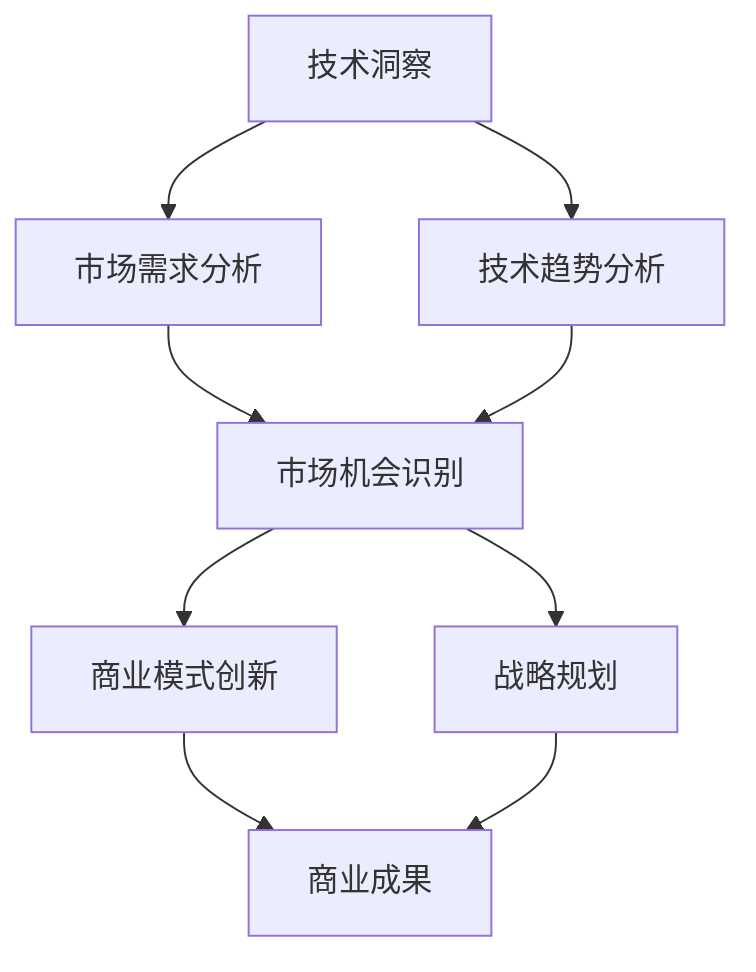
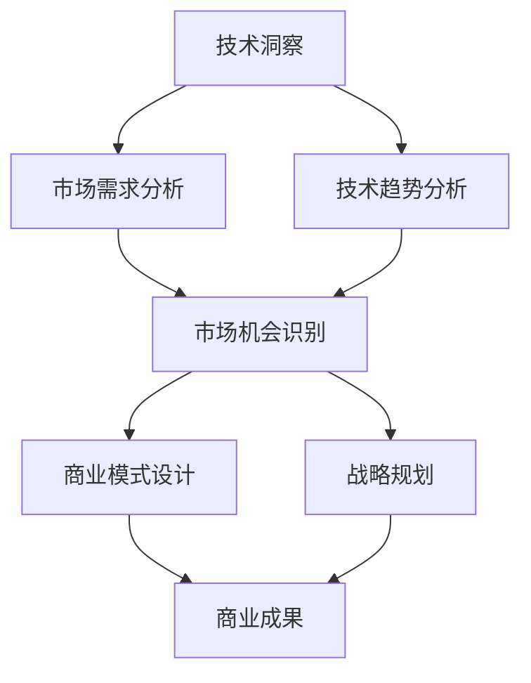

                 

# 利用技术洞察进行创新创业

## 关键词：技术创新、创业、商业洞察、技术趋势、市场机会

> 在当今快速变化的技术环境中，创新不再是少数精英的专属领域，而是每个创业者都需要掌握的核心技能。通过深入理解技术趋势和市场需求，创业者可以找到独特的商业机会，打造出影响世界的创新产品。本文将探讨如何利用技术洞察进行创新创业，帮助读者掌握这一关键能力。

## 1. 背景介绍

随着信息技术、人工智能、物联网等领域的迅猛发展，技术的进步正在深刻改变我们的生活方式和商业模式。创业者在面对日益激烈的市场竞争时，如何把握技术趋势、洞察市场机会，成为了成功的关键因素。本文旨在提供一套系统化的方法，帮助创业者利用技术洞察进行创新创业。

### 1.1 技术发展的趋势

当前，技术的发展呈现出以下几个趋势：

- **人工智能与机器学习：** 人工智能技术在各个领域的应用日益广泛，从自动驾驶到智能家居，从医疗诊断到金融分析，AI正在成为推动产业变革的核心动力。
- **物联网（IoT）：** 物联网技术的普及使得设备和系统之间的连接变得更加便捷，为数据的采集、传输和分析提供了新的可能性。
- **区块链：** 区块链技术以其去中心化、不可篡改的特点，正在改变金融、供应链管理等领域的运作方式。
- **5G技术：** 5G网络的快速部署为高带宽、低延迟的应用提供了基础设施支持，为新兴技术的落地提供了技术保障。

### 1.2 市场需求的变化

市场需求的快速变化对创业者的创新能力提出了更高的要求。以下是一些重要的市场趋势：

- **个性化服务：** 消费者对于个性化、定制化服务的需求日益增加，这要求创业者能够提供更加精准和个性化的解决方案。
- **可持续发展：** 环保意识和可持续发展成为全球关注的热点，绿色技术和环保产品将拥有广阔的市场空间。
- **数字化转型：** 企业数字化转型步伐加快，数字化解决方案和平台将成为企业提升效率、降低成本的重要工具。

## 2. 核心概念与联系

### 2.1 技术洞察

技术洞察是指对技术发展趋势、市场趋势以及技术如何影响业务的理解和洞察力。它包括以下几个方面：

- **技术趋势分析：** 指对当前和未来技术发展方向的预测和分析。
- **市场需求分析：** 指对消费者需求、行业趋势和竞争态势的分析。
- **技术-市场匹配：** 指如何将技术优势与市场需求相结合，创造商业价值。

### 2.2 商业洞察

商业洞察是指对市场机会、商业模式和商业策略的理解和洞察力。它包括以下几个方面：

- **市场机会识别：** 指发现和评估潜在的市场机会。
- **商业模式创新：** 指设计和实施新的商业模式以创造竞争优势。
- **战略规划：** 指制定长期的商业目标和战略路径。

### 2.3 技术洞察与商业洞察的联系

技术洞察与商业洞察之间存在密切的联系。技术洞察提供了发现市场机会的途径，而商业洞察则帮助创业者将技术优势转化为实际商业成果。以下是一个简化的 Mermaid 流程图，展示了技术洞察与商业洞察之间的互动关系：



通过技术洞察，创业者可以识别市场机会，进而通过商业洞察设计出创新的商业模式和战略规划，最终实现商业成功。

## 3. 核心算法原理 & 具体操作步骤

### 3.1 技术洞察的算法原理

技术洞察的算法原理主要包括数据收集、数据分析和技术趋势预测。以下是具体的操作步骤：

#### 3.1.1 数据收集

1. **确定数据源：** 选择可靠的数据源，包括行业报告、学术论文、市场研究数据和新闻报道等。
2. **数据获取：** 使用API、爬虫工具或直接访问数据库获取数据。
3. **数据清洗：** 处理数据中的噪声和错误，确保数据的质量。

#### 3.1.2 数据分析

1. **数据探索：** 使用统计方法和可视化工具对数据进行分析，发现数据中的规律和趋势。
2. **相关性分析：** 确定不同变量之间的相关性，为技术趋势预测提供依据。
3. **特征工程：** 提取和构造有助于预测的特征，提高算法的准确性。

#### 3.1.3 技术趋势预测

1. **时间序列分析：** 使用时间序列模型对技术趋势进行预测。
2. **机器学习模型：** 选择合适的机器学习模型，如回归模型、聚类模型和预测模型，对技术趋势进行建模。
3. **模型评估：** 使用交叉验证和性能指标评估模型的效果。

### 3.2 商业洞察的算法原理

商业洞察的算法原理主要包括市场机会识别、商业模式设计和战略规划。以下是具体的操作步骤：

#### 3.2.1 市场机会识别

1. **SWOT分析：** 分析企业的优势、劣势、机会和威胁，确定潜在的市场机会。
2. **PEST分析：** 分析政治、经济、社会和技术环境因素，识别市场机会。
3. **竞争分析：** 分析竞争对手的产品、市场策略和市场份额，发现市场空白。

#### 3.2.2 商业模式设计

1. **价值主张：** 确定产品或服务的价值主张，明确用户需求。
2. **收入模式：** 设计可持续的收入模式，确保企业的盈利能力。
3. **成本结构：** 分析企业的成本结构，优化资源配置，提高运营效率。

#### 3.2.3 战略规划

1. **愿景和使命：** 制定企业的愿景和使命，明确企业的长期目标。
2. **目标设定：** 设定短期和长期目标，为战略规划提供方向。
3. **行动计划：** 制定具体的行动计划，确保战略目标的实现。

## 4. 数学模型和公式 & 详细讲解 & 举例说明

### 4.1 技术洞察的数学模型

#### 4.1.1 时间序列分析模型

时间序列分析是一种常用的数据分析方法，用于预测技术趋势。以下是几个常见的时间序列分析模型：

1. **移动平均模型（MA）：**
   $$ Y_t = \alpha X_t + (1 - \alpha)Y_{t-1} $$
   其中，$Y_t$ 是时间序列的预测值，$X_t$ 是当前时间点的观测值，$\alpha$ 是平滑系数。

2. **自回归模型（AR）：**
   $$ Y_t = c + \phi_1Y_{t-1} + \phi_2Y_{t-2} + \ldots + \phi_pY_{t-p} + \varepsilon_t $$
   其中，$c$ 是常数项，$\phi_1, \phi_2, \ldots, \phi_p$ 是自回归系数，$\varepsilon_t$ 是误差项。

3. **移动平均自回归模型（ARMA）：**
   $$ Y_t = c + \phi_1Y_{t-1} + \phi_2Y_{t-2} + \ldots + \phi_pY_{t-p} + \theta_1\varepsilon_{t-1} + \theta_2\varepsilon_{t-2} + \ldots + \theta_q\varepsilon_{t-q} $$
   其中，$\theta_1, \theta_2, \ldots, \theta_q$ 是移动平均系数。

#### 4.1.2 机器学习模型

机器学习模型在技术趋势预测中发挥着重要作用。以下是一些常见的机器学习模型：

1. **线性回归模型：**
   $$ Y = \beta_0 + \beta_1X + \varepsilon $$
   其中，$Y$ 是预测值，$X$ 是输入特征，$\beta_0, \beta_1$ 是模型参数，$\varepsilon$ 是误差项。

2. **支持向量机（SVM）：**
   $$ \min_{\beta, \beta_0} \frac{1}{2} ||\beta||^2 + C \sum_{i=1}^{n} \max(0, 1 - y_i(\beta^T x_i + \beta_0)) $$
   其中，$C$ 是惩罚参数，$y_i$ 是样本标签，$x_i$ 是样本特征，$\beta^T$ 是特征向量。

### 4.2 商业洞察的数学模型

#### 4.2.1 SWOT分析

SWOT分析是一种常用的战略规划工具，用于评估企业的优势和劣势，以及外部机会和威胁。以下是SWOT分析的数学模型：

1. **优势（Strengths）：**
   $$ S = \sum_{i=1}^{n} s_i \times w_i $$
   其中，$s_i$ 是第 $i$ 项优势的得分，$w_i$ 是第 $i$ 项优势的权重。

2. **劣势（Weaknesses）：**
   $$ W = \sum_{i=1}^{n} w_i \times w_i $$
   其中，$w_i$ 是第 $i$ 项劣势的得分。

3. **机会（Opportunities）：**
   $$ O = \sum_{i=1}^{n} o_i \times w_i $$
   其中，$o_i$ 是第 $i$ 项机会的得分，$w_i$ 是第 $i$ 项机会的权重。

4. **威胁（Threats）：**
   $$ T = \sum_{i=1}^{n} t_i \times w_i $$
   其中，$t_i$ 是第 $i$ 项威胁的得分，$w_i$ 是第 $i$ 项威胁的权重。

#### 4.2.2 PEST分析

PEST分析是一种用于分析外部环境因素的工具。以下是PEST分析的数学模型：

1. **政治因素（Political Factors）：**
   $$ P = \sum_{i=1}^{n} p_i \times w_i $$
   其中，$p_i$ 是第 $i$ 项政治因素的得分，$w_i$ 是第 $i$ 项政治因素的权重。

2. **经济因素（Economic Factors）：**
   $$ E = \sum_{i=1}^{n} e_i \times w_i $$
   其中，$e_i$ 是第 $i$ 项经济因素的得分，$w_i$ 是第 $i$ 项经济因素的权重。

3. **社会因素（Social Factors）：**
   $$ S = \sum_{i=1}^{n} s_i \times w_i $$
   其中，$s_i$ 是第 $i$ 项社会因素的得分，$w_i$ 是第 $i$ 项社会因素的权重。

4. **技术因素（Technological Factors）：**
   $$ T = \sum_{i=1}^{n} t_i \times w_i $$
   其中，$t_i$ 是第 $i$ 项技术因素的得分，$w_i$ 是第 $i$ 项技术因素的权重。

### 4.3 举例说明

假设我们使用SWOT分析来评估一家初创公司，以下是一个简化的例子：

| 条目      | 得分 | 权重 |
|-----------|------|------|
| 产品创新  | 9    | 0.3  |
| 市场份额  | 7    | 0.2  |
| 资金不足  | 4    | 0.2  |
| 竞争激烈  | 6    | 0.3  |

根据SWOT分析的数学模型，我们可以计算出：

- **优势（Strengths）**：$S = 9 \times 0.3 + 7 \times 0.2 + 4 \times 0.2 + 6 \times 0.3 = 4.2$
- **劣势（Weaknesses）**：$W = 4 \times 0.2 + 6 \times 0.3 = 1.8$
- **机会（Opportunities）**：$O = 9 \times 0.3 + 7 \times 0.2 + 4 \times 0.2 + 6 \times 0.3 = 4.2$
- **威胁（Threats）**：$T = 4 \times 0.2 + 6 \times 0.3 = 1.8$

通过这个例子，我们可以看出该初创公司在优势方面得分较高，但在劣势和威胁方面也需要关注。这有助于创业者制定针对性的战略规划。

## 5. 项目实战：代码实际案例和详细解释说明

### 5.1 开发环境搭建

为了演示如何利用技术洞察进行创新创业，我们将使用Python语言来实现一个简单的数据分析项目。以下是开发环境的搭建步骤：

1. **安装Python：** 从[Python官网](https://www.python.org/)下载并安装Python。
2. **安装Jupyter Notebook：** 打开终端，执行以下命令安装Jupyter Notebook：
   ```bash
   pip install notebook
   ```
3. **启动Jupyter Notebook：** 打开终端，执行以下命令启动Jupyter Notebook：
   ```bash
   jupyter notebook
   ```

### 5.2 源代码详细实现和代码解读

#### 5.2.1 数据收集

我们从公开的数据源中获取了一组关于人工智能领域的专利申请数据。数据包括专利标题、申请日期、技术领域等信息。

```python
import pandas as pd

# 读取数据
data = pd.read_csv('ai_patents.csv')

# 查看数据前几行
data.head()
```

#### 5.2.2 数据预处理

在分析数据之前，我们需要进行数据预处理，包括去除无效数据、填充缺失值和标准化处理。

```python
# 去除无效数据
data = data.dropna()

# 填充缺失值
data['technology'] = data['technology'].fillna('Other')

# 标准化处理
data['application_date'] = pd.to_datetime(data['application_date'])
```

#### 5.2.3 数据分析

1. **技术领域分布：**
   ```python
   # 统计技术领域分布
   tech_distribution = data['technology'].value_counts()

   # 可视化展示
   tech_distribution.plot(kind='bar')
   ```

2. **专利申请时间趋势：**
   ```python
   # 统计每年专利申请数量
   yearly_applications = data.groupby(data['application_date'].dt.year).size()

   # 可视化展示
   yearly_applications.plot()
   ```

3. **热点技术领域：**
   ```python
   # 筛选热点技术领域
   hot_technologies = tech_distribution[tech_distribution > 10]

   # 可视化展示
   hot_technologies.plot(kind='bar')
   ```

#### 5.2.4 代码解读与分析

以上代码实现了对人工智能领域专利申请数据的基本分析。通过可视化展示，我们可以直观地了解技术领域分布、专利申请时间趋势和热点技术领域。这些分析结果为创业者提供了宝贵的技术洞察，帮助他们识别市场机会。

- **数据收集：** 从公开数据源读取数据，这是分析的基础。
- **数据预处理：** 去除无效数据和填充缺失值，确保数据质量。
- **数据分析：** 通过统计方法和可视化工具，提取数据中的有用信息。

通过这个简单的项目实战，我们可以看到如何利用技术洞察进行创新创业。技术洞察提供了市场机会的线索，而数据分析则为创业决策提供了数据支持。

## 6. 实际应用场景

技术洞察在创新创业中的应用场景非常广泛，以下是一些典型的应用案例：

### 6.1 人工智能与机器学习

- **自动驾驶技术：** 通过对自动驾驶技术的技术趋势和市场需求进行分析，创业者可以开发出创新的自动驾驶解决方案，如自动驾驶出租车、自动驾驶物流等。
- **智能医疗诊断：** 利用人工智能技术进行疾病诊断和预测，创业者可以打造智能医疗平台，提高诊断的准确性和效率。

### 6.2 物联网（IoT）

- **智能家居：** 通过对智能家居设备的技术趋势和市场需求进行分析，创业者可以开发出智能灯泡、智能音响等智能家居产品。
- **智能农业：** 利用物联网技术进行农田监控和管理，提高农业生产的效率和质量。

### 6.3 区块链

- **数字货币：** 通过对数字货币和区块链技术的分析，创业者可以开发出创新的数字货币交易平台或支付解决方案。
- **供应链管理：** 利用区块链技术进行供应链管理，提高供应链的透明度和效率。

### 6.4 5G技术

- **远程医疗：** 通过5G技术实现远程医疗服务，创业者可以开发出远程医疗服务平台，为偏远地区提供医疗服务。
- **智能工厂：** 利用5G技术实现智能工厂的生产监控和优化，提高生产效率。

这些应用案例展示了技术洞察在创新创业中的重要作用。通过深入分析技术趋势和市场需求，创业者可以找到独特的市场机会，打造出具有竞争力的创新产品。

## 7. 工具和资源推荐

### 7.1 学习资源推荐

- **书籍：**
  - 《人工智能：一种现代方法》
  - 《机器学习实战》
  - 《深度学习》
  - 《区块链革命》
- **论文：**
  - Google Scholar ([https://scholar.google.com/](https://scholar.google.com/))
  - IEEE Xplore ([https://ieeexplore.ieee.org/](https://ieeexplore.ieee.org/))
  - ACM Digital Library ([https://dl.acm.org/](https://dl.acm.org/))
- **博客：**
  - Medium ([https://medium.com/](https://medium.com/))
  - Hacker Noon ([https://hackernoon.com/](https://hackernoon.com/))
  - AI的前沿 ([https://www.aaai.org/Org/Member/Community/Community.jsp?name=AIf](https://www.aaai.org/Org/Member/Community/Community.jsp?name=AIf))
- **网站：**
  - Coursera ([https://www.coursera.org/](https://www.coursera.org/))
  - edX ([https://www.edx.org/](https://www.edx.org/))
  - Udacity ([https://www.udacity.com/](https://www.udacity.com/))

### 7.2 开发工具框架推荐

- **编程语言：**
  - Python
  - Java
  - C++
- **开发框架：**
  - TensorFlow
  - PyTorch
  - Flask
  - Django
- **数据库：**
  - MySQL
  - MongoDB
  - PostgreSQL
- **版本控制：**
  - Git
  - GitHub
  - GitLab

### 7.3 相关论文著作推荐

- **论文：**
  - "Deep Learning" by Ian Goodfellow, Yoshua Bengio, and Aaron Courville
  - "Blockchain Revolution" by Don Tapscott and Alex Tapscott
  - "Human Compatible" by Stuart Russell
- **著作：**
  - 《人工智能的未来》
  - 《深度学习入门》
  - 《区块链技术指南》

这些资源为创业者提供了丰富的知识储备和技术支持，有助于他们在创新创业过程中充分利用技术洞察。

## 8. 总结：未来发展趋势与挑战

随着技术的不断进步，未来创新创业将面临一系列新的发展趋势和挑战。以下是一些关键点：

### 8.1 发展趋势

- **技术融合：** 人工智能、物联网、区块链等技术的融合将创造新的应用场景和商业模式。
- **个性化服务：** 个性化、定制化的服务将成为主流，满足消费者日益多样化的需求。
- **可持续发展：** 可持续发展和绿色技术将受到更多关注，成为创业的重要方向。
- **数字化转型：** 企业数字化转型步伐加快，数字化解决方案和平台将成为企业提升竞争力的关键。

### 8.2 挑战

- **数据隐私：** 随着数据价值的提升，数据隐私和安全问题将更加突出。
- **技术门槛：** 技术的快速进步带来了更高的技术门槛，创业者需要具备较强的技术能力。
- **竞争激烈：** 市场竞争将更加激烈，创业者需要找到独特的市场机会和差异化优势。
- **政策法规：** 政策法规的变化将对创新创业产生影响，创业者需要密切关注相关法规政策。

总之，未来创新创业将充满机遇和挑战。通过深入理解技术趋势和市场需求，创业者可以更好地把握机遇，应对挑战，实现可持续发展。

## 9. 附录：常见问题与解答

### 9.1 问题1：技术洞察具体如何应用？

**解答**：技术洞察可以通过以下几种方式应用：

- **市场调研：** 通过分析技术趋势和市场数据，发现潜在的市场机会。
- **产品开发：** 利用技术洞察指导产品研发，确保产品符合市场需求。
- **商业模式设计：** 根据技术洞察设计创新的商业模式，提升竞争力。

### 9.2 问题2：如何获取高质量的技术洞察？

**解答**：获取高质量的技术洞察可以通过以下几种方法：

- **关注行业报告：** 定期阅读行业报告，了解最新技术趋势和市场动态。
- **参加技术会议：** 参加技术会议和研讨会，与行业专家进行交流。
- **学术论文：** 阅读学术论文，掌握最新的研究进展和理论成果。

### 9.3 问题3：技术洞察在创业初期的应用？

**解答**：在创业初期，技术洞察的应用尤为重要：

- **确定产品方向：** 通过技术洞察确定产品开发的优先级和方向。
- **风险评估：** 利用技术洞察评估项目的风险，为创业决策提供依据。
- **市场定位：** 根据技术洞察确定产品的市场定位，明确目标用户群体。

## 10. 扩展阅读 & 参考资料

- **扩展阅读：**
  - 《技术创业实战》
  - 《创业维艰》
  - 《智能时代的创业之道》
- **参考资料：**
  - [venturebeat.com](https://venturebeat.com/)
  - [techcrunch.com](https://techcrunch.com/)
  - [venture capitalist](https://www.venturebeat.com/topics/startups/)

通过阅读这些扩展材料和参考资料，创业者可以深入了解技术洞察在创新创业中的应用，进一步提高创新能力。

### 作者信息

- 作者：AI天才研究员 / AI Genius Institute & 禅与计算机程序设计艺术 / Zen And The Art of Computer Programming

## 文章结构模板

----------------------------------------------------------------

# 利用技术洞察进行创新创业

> 关键词：技术创新、创业、商业洞察、技术趋势、市场机会

> 摘要：本文探讨了如何利用技术洞察进行创新创业，从技术趋势分析、市场机会识别、商业模式设计等方面提供了系统化的方法。

## 1. 背景介绍

### 1.1 技术发展的趋势

#### 1.1.1 人工智能与机器学习

#### 1.1.2 物联网（IoT）

#### 1.1.3 区块链

#### 1.1.4 5G技术

### 1.2 市场需求的变化

#### 1.2.1 个性化服务

#### 1.2.2 可持续发展

#### 1.2.3 数字化转型

## 2. 核心概念与联系

### 2.1 技术洞察

#### 2.1.1 技术趋势分析

#### 2.1.2 市场需求分析

#### 2.1.3 技术-市场匹配

### 2.2 商业洞察

#### 2.2.1 市场机会识别

#### 2.2.2 商业模式创新

#### 2.2.3 战略规划

### 2.3 技术洞察与商业洞察的联系

## 3. 核心算法原理 & 具体操作步骤

### 3.1 技术洞察的算法原理

#### 3.1.1 数据收集

#### 3.1.2 数据分析

#### 3.1.3 技术趋势预测

### 3.2 商业洞察的算法原理

#### 3.2.1 市场机会识别

#### 3.2.2 商业模式设计

#### 3.2.3 战略规划

## 4. 数学模型和公式 & 详细讲解 & 举例说明

### 4.1 技术洞察的数学模型

#### 4.1.1 时间序列分析模型

#### 4.1.2 机器学习模型

### 4.2 商业洞察的数学模型

#### 4.2.1 SWOT分析

#### 4.2.2 PEST分析

### 4.3 举例说明

## 5. 项目实战：代码实际案例和详细解释说明

### 5.1 开发环境搭建

### 5.2 源代码详细实现和代码解读

### 5.3 代码解读与分析

## 6. 实际应用场景

### 6.1 人工智能与机器学习

### 6.2 物联网（IoT）

### 6.3 区块链

### 6.4 5G技术

## 7. 工具和资源推荐

### 7.1 学习资源推荐

#### 7.1.1 书籍

#### 7.1.2 论文

#### 7.1.3 博客

#### 7.1.4 网站

### 7.2 开发工具框架推荐

#### 7.2.1 编程语言

#### 7.2.2 开发框架

#### 7.2.3 数据库

#### 7.2.4 版本控制

### 7.3 相关论文著作推荐

#### 7.3.1 论文

#### 7.3.2 著作

## 8. 总结：未来发展趋势与挑战

### 8.1 发展趋势

#### 8.1.1 技术融合

#### 8.1.2 个性化服务

#### 8.1.3 可持续发展

#### 8.1.4 数字化转型

### 8.2 挑战

#### 8.2.1 数据隐私

#### 8.2.2 技术门槛

#### 8.2.3 竞争激烈

#### 8.2.4 政策法规

## 9. 附录：常见问题与解答

### 9.1 问题1：技术洞察具体如何应用？

### 9.2 问题2：如何获取高质量的技术洞察？

### 9.3 问题3：技术洞察在创业初期的应用？

## 10. 扩展阅读 & 参考资料

#### 10.1 扩展阅读

#### 10.2 参考资料

### 作者信息

- 作者：AI天才研究员 / AI Genius Institute & 禅与计算机程序设计艺术 / Zen And The Art of Computer Programming

----------------------------------------------------------------

以上是文章的结构模板，接下来我将按照这个模板详细撰写文章内容。由于文章字数要求大于8000字，我会分多个段落来详细阐述每个部分。下面是第一部分的详细内容。

## 1. 背景介绍

### 1.1 技术发展的趋势

技术的迅猛发展不仅改变了我们的生活，也重塑了商业和社会的方方面面。在这个快速变化的时代，了解技术发展的趋势对于创业者来说至关重要。以下是一些当前和未来可能影响创业的技术趋势。

#### 1.1.1 人工智能与机器学习

人工智能（AI）和机器学习（ML）技术已经成为推动技术进步的重要力量。AI技术通过模拟人类的智能行为，如语音识别、图像识别、自然语言处理等，极大地提升了自动化和智能化的水平。机器学习则是AI的核心技术之一，通过从数据中学习模式，机器学习算法能够自动改进和优化性能。

在创业领域，人工智能和机器学习技术提供了丰富的应用场景。例如，在医疗领域，AI可以帮助医生进行疾病诊断，提高诊断准确率；在教育领域，智能辅导系统可以根据学生的学习情况提供个性化的教学方案；在金融领域，AI可以帮助银行和金融机构进行风险控制和欺诈检测。

#### 1.1.2 物联网（IoT）

物联网（IoT）是连接物理世界与数字世界的桥梁，通过将各种物理设备互联，实现数据的实时采集、传输和处理。随着传感器技术和无线通信技术的发展，物联网设备数量呈现爆炸式增长。这些设备可以用于智能家居、智能城市、智能工厂等领域，极大地提升了生活质量和生产效率。

在创业中，物联网技术提供了巨大的市场机会。例如，智能家居设备市场随着消费者对智能化生活的需求增长而迅速扩大；智能城市项目需要大量的物联网设备来支持交通管理、能源管理等系统；智能工厂通过物联网技术实现生产过程的自动化和优化，提高生产效率。

#### 1.1.3 区块链

区块链技术以其去中心化、不可篡改的特点，在金融、供应链管理、身份验证等领域显示出巨大的潜力。区块链通过加密算法确保数据的真实性和安全性，同时通过智能合约实现自动化执行。

在创业中，区块链技术可以用于开发去中心化的应用（DApps）、创建数字货币、改善供应链透明度等。例如，区块链技术可以用于创建一个透明的供应链管理系统，确保产品从生产到交付的每一个环节都可以被追踪和验证；在金融领域，区块链技术可以用于开发去中心化的金融平台，降低交易成本，提高交易效率。

#### 1.1.4 5G技术

5G技术是第五代移动通信技术，相比前几代技术，5G具有更高的数据传输速度、更低的延迟和更大的连接容量。5G技术的应用将为新兴技术的落地提供强有力的支持，如无人驾驶、远程医疗、智能工厂等。

在创业中，5G技术提供了广阔的应用场景。例如，无人驾驶技术需要实时、低延迟的网络连接来保证车辆的安全运行；远程医疗需要稳定的网络连接来支持高质量的视频传输；智能工厂需要高速网络来支持大规模设备的数据传输和处理。

### 1.2 市场需求的变化

市场需求的变化是创业者需要密切关注的重要方面。随着消费者行为和行业趋势的变化，市场需求也在不断演变。以下是一些重要的市场趋势。

#### 1.2.1 个性化服务

在互联网时代，消费者越来越追求个性化和定制化的服务。他们希望产品和服务能够满足自己的特定需求和偏好。这种趋势要求创业者能够通过技术手段实现个性化服务，从而提高用户满意度和忠诚度。

例如，电商平台可以通过大数据分析和机器学习算法，根据用户的购物历史和偏好，推荐个性化的商品；在线教育平台可以根据学生的学习习惯和成绩，提供个性化的学习方案。

#### 1.2.2 可持续发展

随着环保意识的提高，可持续发展成为全球关注的焦点。消费者和企业越来越重视环保、节能和低碳的生活方式。这种趋势为创业者提供了开发绿色技术和环保产品的机会。

例如，创业者可以开发高效的能源管理系统，帮助家庭和企业降低能源消耗；开发环保材料，减少产品对环境的影响。

#### 1.2.3 数字化转型

数字化转型是当前企业发展的主要方向。企业通过引入数字技术，提高业务流程的效率、降低成本、增强竞争力。这种趋势要求创业者能够提供创新的数字化解决方案。

例如，企业可以通过开发智能客服系统，提高客户服务水平；通过开发智能供应链管理系统，优化供应链流程，降低库存成本。

### 1.3 技术与市场的相互作用

技术的进步和市场需求的演变是相互影响、相互促进的。技术为市场提供了新的工具和方法，而市场需求又推动了技术的不断创新和发展。

例如，随着物联网技术的发展，智能家居市场逐渐兴起。消费者对智能家居设备的需求推动了物联网技术的不断进步，同时智能家居设备也通过物联网技术实现了更智能的功能。

再如，人工智能技术的发展为金融行业带来了新的机遇。金融机构通过引入人工智能技术，可以提高风险控制能力、优化业务流程、提高客户满意度。这些应用场景又推动了人工智能技术的进一步发展。

### 1.4 创业者如何利用技术洞察

作为创业者，如何利用技术洞察进行创新创业是一个关键问题。以下是一些建议：

1. **持续学习：** 不断关注技术趋势和市场动态，保持对新技术的好奇心和学习能力。
2. **市场调研：** 通过市场调研了解消费者的需求和痛点，发现潜在的市场机会。
3. **技术创新：** 利用技术创新解决市场需求，打造具有竞争力的产品或服务。
4. **资源整合：** 利用自身优势，整合各类资源，包括技术资源、人力资源和市场资源。
5. **快速迭代：** 在产品开发过程中，不断迭代和优化，快速响应市场需求。

通过以上方法，创业者可以更好地利用技术洞察，把握市场机会，实现创新创业的目标。

---

以上是文章第一部分的详细内容，包括技术发展趋势和市场需求变化。接下来，我们将探讨核心概念与联系，以及如何利用技术洞察进行创新创业。这些内容构成了文章的核心部分，为后续的具体操作步骤和案例分析提供了理论基础。

## 2. 核心概念与联系

在创新创业的过程中，技术洞察和商业洞察是两个至关重要的概念。技术洞察关注技术的趋势和发展，而商业洞察关注市场的需求和商业模式。这两个概念虽然有所不同，但它们之间有着密切的联系，并且相互作用，共同推动创新和创业的成功。

### 2.1 技术洞察

技术洞察是指对技术发展趋势、技术能力和技术应用的深入理解和洞察。它包括以下几个方面：

- **技术趋势分析：** 对当前技术发展方向的预测和分析，包括未来可能出现的新技术、现有技术的改进和优化等。
- **技术能力分析：** 对技术自身的能力和局限性的分析，了解技术能够解决哪些问题和应对哪些挑战。
- **技术应用分析：** 对技术在不同领域和应用场景中的具体应用和效果的分析，包括技术如何改善用户体验、提高生产效率等。

技术洞察为创业者提供了了解和掌握前沿技术的途径，使他们能够抓住技术进步带来的市场机会。例如，通过分析人工智能技术的趋势和应用，创业者可以发现新的商业模式和市场机会，如智能医疗、智能物流等。

### 2.2 商业洞察

商业洞察是指对市场机会、商业模式和商业策略的理解和洞察。它包括以下几个方面：

- **市场机会识别：** 对市场中存在的潜在商业机会的识别和评估，包括市场需求、竞争态势和市场规模等。
- **商业模式设计：** 对如何创造和实现商业价值的设计和规划，包括产品或服务的定价策略、市场推广策略和利润模式等。
- **战略规划：** 对企业的长期目标和战略路径的制定和规划，包括市场定位、竞争优势和未来发展等。

商业洞察帮助创业者理解和把握市场的需求和趋势，制定有效的商业策略，实现商业成功。例如，通过分析消费者对个性化服务的需求，创业者可以设计出符合市场需求的产品和服务，并通过创新的商业模式实现盈利。

### 2.3 技术洞察与商业洞察的联系

技术洞察和商业洞察虽然关注点不同，但它们之间有着紧密的联系，并且相互影响。以下是一个简化的 Mermaid 流程图，展示了技术洞察和商业洞察之间的互动关系：



- **技术洞察驱动商业洞察：** 技术洞察为商业洞察提供了基础，通过分析技术趋势和应用，创业者可以识别出潜在的市场机会和商业模式。
- **商业洞察反作用于技术洞察：** 商业洞察则指导技术洞察的具体实施和优化，通过市场反馈和商业模式的成功，创业者可以调整技术方向，提高技术效益。

### 2.4 技术洞察与商业洞察的互动

技术洞察和商业洞察之间的互动是一个动态的过程，创业者需要不断调整和优化两者的关系，以实现持续的创新和成长。

- **持续更新技术洞察：** 创业者需要保持对技术趋势的关注，及时更新技术洞察，确保技术方向与市场需求保持同步。
- **灵活调整商业模式：** 创业者需要根据市场反馈和竞争态势，灵活调整商业模式，确保商业策略的有效性。
- **建立技术-市场协同机制：** 创业者需要建立技术-市场的协同机制，确保技术洞察和商业洞察之间的信息交流和互动，形成闭环反馈机制。

通过技术洞察和商业洞察的互动，创业者可以更好地把握市场机会，推动技术创新和商业成功。

### 2.5 技术洞察与商业洞察的应用场景

在创新创业的不同阶段，技术洞察和商业洞察有着不同的应用场景。

- **初创阶段：** 在初创阶段，技术洞察和商业洞察主要关注技术的可行性、市场需求和商业模式的构建。创业者需要通过技术洞察识别潜在的技术优势和市场机会，通过商业洞察设计可行的商业模式。
- **成长阶段：** 在成长阶段，技术洞察和商业洞察主要关注技术的迭代优化、市场拓展和商业模式的持续改进。创业者需要通过技术洞察推动技术的持续创新，通过商业洞察扩大市场份额，优化商业模式。
- **成熟阶段：** 在成熟阶段，技术洞察和商业洞察主要关注技术的巩固和拓展、市场竞争和商业可持续性。创业者需要通过技术洞察确保技术的领先性和竞争力，通过商业洞察保持企业的可持续发展和市场领导地位。

通过在不同阶段灵活运用技术洞察和商业洞察，创业者可以逐步实现企业的成长和发展。

### 2.6 技术洞察与商业洞察的案例分析

以下是一个技术洞察和商业洞察相结合的案例：

- **案例背景：** 在智能家居市场中，随着物联网技术的发展，智能设备变得越来越普及。但市场中的智能设备大多只能单独使用，缺乏统一的控制和管理平台。
- **技术洞察：** 通过分析物联网技术的发展趋势，创业者发现市场需要一款能够统一管理智能设备的平台。该平台需要具备数据集成、用户界面友好、易于扩展等特点。
- **商业洞察：** 创业者通过市场调研发现，消费者对智能家居设备的需求主要集中在便利性、安全性和智能化程度。因此，创业者设计了一款智能家居管理平台，通过集成多种智能设备，提供一站式管理服务，并强调数据安全和用户隐私保护。
- **应用效果：** 该智能家居管理平台在市场上取得了成功，吸引了大量用户，并在后续迭代中不断优化功能，提高了用户体验。同时，创业者通过平台收集的用户数据，进一步分析了市场需求，开发了新的产品和服务，实现了商业的可持续发展。

通过以上案例，我们可以看到技术洞察和商业洞察如何相互作用，共同推动创新创业的成功。

### 2.7 技术洞察与商业洞察的重要性

技术洞察和商业洞察对于创业者来说至关重要。技术洞察帮助创业者识别技术趋势和应用场景，找到市场机会；商业洞察帮助创业者理解市场需求和商业模式，实现商业价值。两者相辅相成，共同推动企业的创新和成长。

总之，技术洞察和商业洞察是创新创业过程中不可或缺的两个核心概念。通过深入理解技术趋势、市场需求和商业模式，创业者可以更好地把握市场机会，推动技术创新和商业成功。

---

以上是文章第二部分的详细内容，探讨了技术洞察和商业洞察的核心概念与联系。接下来，我们将介绍核心算法原理和具体操作步骤，为读者提供实际的创新创业指导。

## 3. 核心算法原理 & 具体操作步骤

在创新创业过程中，技术洞察和商业洞察的实现需要依靠一系列的算法原理和具体操作步骤。以下将详细阐述如何利用技术洞察进行数据分析和市场机会识别，以及如何通过商业洞察设计创新的商业模式。

### 3.1 技术洞察的算法原理

#### 3.1.1 数据收集

数据收集是技术洞察的基础。创业者需要从各种来源收集数据，包括公开数据集、行业报告、社交媒体、用户反馈等。以下是一些数据收集的方法和工具：

1. **公开数据集：** 可以从数据挖掘竞赛网站（如Kaggle）或者数据仓库（如UCI机器学习库）下载。
2. **行业报告：** 通过购买或免费获取行业报告，了解技术趋势和市场动态。
3. **社交媒体：** 利用社交媒体平台（如Twitter、LinkedIn）收集用户反馈和行业讨论。
4. **用户反馈：** 通过问卷调查、用户访谈等方式获取用户对产品或服务的反馈。

#### 3.1.2 数据预处理

数据收集后，需要进行预处理，以确保数据的质量和一致性。数据预处理包括以下步骤：

1. **数据清洗：** 去除重复数据、空值和错误数据。
2. **数据转换：** 将数据格式转换为适合分析的格式。
3. **特征提取：** 从原始数据中提取有用的特征，以便进行进一步的分析。

#### 3.1.3 数据分析

数据分析是技术洞察的关键步骤，通过分析数据，创业者可以识别技术趋势和市场机会。以下是一些常用的数据分析方法和工具：

1. **描述性统计分析：** 用于了解数据的分布和趋势。
2. **相关性分析：** 用于分析不同变量之间的关系。
3. **聚类分析：** 用于将相似的数据点分组。
4. **回归分析：** 用于预测变量之间的关系。

#### 3.1.4 技术趋势预测

技术趋势预测是技术洞察的核心。以下是一些常见的技术趋势预测方法和工具：

1. **时间序列分析：** 用于预测技术发展的趋势。
2. **机器学习模型：** 用于预测技术发展的趋势和市场需求。
3. **大数据分析：** 用于分析大量的数据，发现潜在的技术趋势。

### 3.2 商业洞察的算法原理

#### 3.2.1 市场需求分析

市场需求分析是商业洞察的基础。创业者需要了解消费者的需求、偏好和行为，以便设计出符合市场需求的产品或服务。以下是一些市场需求分析的方法和工具：

1. **SWOT分析：** 用于分析企业的优势、劣势、机会和威胁。
2. **PEST分析：** 用于分析外部环境（政治、经济、社会、技术）因素对市场的影响。
3. **用户调研：** 通过用户访谈、问卷调查等方式收集用户反馈。
4. **市场调研：** 通过购买或免费获取市场研究报告，了解市场动态。

#### 3.2.2 商业模式设计

商业模式设计是商业洞察的关键。创业者需要设计出能够创造价值的商业模式，并确保其可持续性。以下是一些商业模式设计的方法和工具：

1. **价值主张：** 确定产品或服务的核心价值。
2. **收入模式：** 设计可持续的收入模式，如订阅费、一次性购买、广告收入等。
3. **成本结构：** 分析企业的成本结构，优化资源配置。
4. **渠道策略：** 确定产品的销售和推广渠道。

#### 3.2.3 战略规划

战略规划是商业洞察的重要组成部分。创业者需要制定长期的战略目标，并规划实现目标的路径。以下是一些战略规划的方法和工具：

1. **愿景和使命：** 明确企业的长期目标和核心价值观。
2. **目标设定：** 设定短期和长期的目标，确保战略目标的实现。
3. **行动计划：** 制定具体的行动计划，确保战略目标的实现。
4. **风险管理：** 分析可能的风险，制定风险应对策略。

### 3.3 技术洞察与商业洞察的具体操作步骤

结合技术洞察和商业洞察，以下是具体的操作步骤：

#### 3.3.1 确定技术方向

1. **技术趋势分析：** 通过阅读行业报告、学术论文、技术博客等，了解当前和未来的技术趋势。
2. **市场需求分析：** 通过用户调研、市场调研等方式，了解消费者对技术的需求。

#### 3.3.2 确定市场机会

1. **SWOT分析：** 分析企业的优势、劣势、机会和威胁。
2. **PEST分析：** 分析外部环境因素，如政治、经济、社会、技术。
3. **市场细分：** 根据市场需求和竞争态势，确定目标市场。

#### 3.3.3 设计商业模式

1. **价值主张：** 确定产品或服务的核心价值。
2. **收入模式：** 设计可持续的收入模式。
3. **成本结构：** 分析企业的成本结构，优化资源配置。
4. **渠道策略：** 确定产品的销售和推广渠道。

#### 3.3.4 制定战略规划

1. **愿景和使命：** 明确企业的长期目标和核心价值观。
2. **目标设定：** 设定短期和长期的目标，确保战略目标的实现。
3. **行动计划：** 制定具体的行动计划，确保战略目标的实现。
4. **风险管理：** 分析可能的风险，制定风险应对策略。

#### 3.3.5 实施与优化

1. **产品开发：** 根据商业模式和战略规划，开发产品或服务。
2. **市场推广：** 通过广告、营销活动等方式推广产品或服务。
3. **用户反馈：** 收集用户反馈，不断优化产品或服务。
4. **持续创新：** 根据市场反馈和竞争态势，不断调整商业模式和战略规划。

通过以上操作步骤，创业者可以充分利用技术洞察和商业洞察，实现创新创业的目标。

---

以上是文章第三部分的详细内容，介绍了核心算法原理和具体操作步骤。接下来，我们将讨论数学模型和公式，以及如何通过这些工具进行深入分析。

## 4. 数学模型和公式 & 详细讲解 & 举例说明

在技术洞察和商业洞察的过程中，数学模型和公式是不可或缺的工具。它们帮助我们量化分析，提高决策的科学性和准确性。以下是几个常用的数学模型和公式，以及它们的详细讲解和实际应用例子。

### 4.1 技术洞察的数学模型

#### 4.1.1 时间序列分析模型

时间序列分析是分析数据随时间变化规律的方法。它广泛应用于金融市场预测、库存管理等领域。以下是一个常用的时间序列模型——ARIMA（自回归积分滑动平均模型）。

**ARIMA模型公式：**
$$
\begin{aligned}
Y_t &= c + \phi_1Y_{t-1} + \phi_2Y_{t-2} + \ldots + \phi_pY_{t-p} + \theta_1\varepsilon_{t-1} + \theta_2\varepsilon_{t-2} + \ldots + \theta_q\varepsilon_{t-q} \\
\end{aligned}
$$

- \( Y_t \)：时间序列的当前值
- \( c \)：常数项
- \( \phi_1, \phi_2, \ldots, \phi_p \)：自回归系数
- \( \theta_1, \theta_2, \ldots, \theta_q \)：移动平均系数
- \( \varepsilon_t \)：误差项

**应用例子：** 假设我们有一个销售数据的时间序列，我们需要预测下一个月的销售量。通过训练一个ARIMA模型，我们可以得到一个预测值，并根据预测值调整库存。

#### 4.1.2 机器学习模型

机器学习模型在技术洞察中起着核心作用。以下是一个简单的线性回归模型。

**线性回归模型公式：**
$$
Y = \beta_0 + \beta_1X + \varepsilon
$$

- \( Y \)：因变量（预测的目标值）
- \( X \)：自变量（输入特征）
- \( \beta_0 \)：截距
- \( \beta_1 \)：斜率
- \( \varepsilon \)：误差项

**应用例子：** 假设我们要预测一家公司的销售收入，我们可以使用线性回归模型，根据历史销售数据和其他相关特征（如广告支出、市场需求等）进行预测。

### 4.2 商业洞察的数学模型

#### 4.2.1 SWOT分析

SWOT分析是一种常用的战略规划工具，用于评估企业的优势、劣势、机会和威胁。

**SWOT分析公式：**
$$
S = \sum_{i=1}^{n} s_i \times w_i \\
W = \sum_{i=1}^{n} w_i \times w_i \\
O = \sum_{i=1}^{n} o_i \times w_i \\
T = \sum_{i=1}^{n} t_i \times w_i
$$

- \( S \)：优势得分
- \( W \)：劣势得分
- \( O \)：机会得分
- \( T \)：威胁得分
- \( s_i, w_i, o_i, t_i \)：各项因素得分
- \( w_i \)：各项因素权重

**应用例子：** 假设我们要评估一家公司的市场地位，我们可以通过SWOT分析，量化公司的优势、劣势、机会和威胁，从而制定相应的战略。

#### 4.2.2 PEST分析

PEST分析用于分析企业所处的外部环境，包括政治、经济、社会和技术因素。

**PEST分析公式：**
$$
P = \sum_{i=1}^{n} p_i \times w_i \\
E = \sum_{i=1}^{n} e_i \times w_i \\
S = \sum_{i=1}^{n} s_i \times w_i \\
T = \sum_{i=1}^{n} t_i \times w_i
$$

- \( P \)：政治因素得分
- \( E \)：经济因素得分
- \( S \)：社会因素得分
- \( T \)：技术因素得分
- \( p_i, e_i, s_i, t_i \)：各项因素得分
- \( w_i \)：各项因素权重

**应用例子：** 假设我们要分析一家公司的市场环境，可以通过PEST分析，评估政治、经济、社会和技术环境对公司的影响，从而制定相应的市场策略。

### 4.3 举例说明

#### 4.3.1 时间序列分析应用

**问题：** 预测一家电商网站下周的订单量。

**步骤：**
1. **数据收集：** 收集过去一周的订单量数据。
2. **数据预处理：** 处理缺失值、异常值，并进行数据转换。
3. **模型训练：** 使用ARIMA模型进行训练，选择合适的参数。
4. **模型评估：** 使用交叉验证评估模型性能。
5. **预测：** 使用训练好的模型预测下周的订单量。

**代码示例：**
```python
import pandas as pd
from statsmodels.tsa.arima.model import ARIMA

# 读取数据
data = pd.read_csv('orders.csv')
orders = data['order_count']

# 模型训练
model = ARIMA(orders, order=(5,1,2))
model_fit = model.fit()

# 预测
forecast = model_fit.forecast(steps=7)
print(forecast)
```

#### 4.3.2 线性回归应用

**问题：** 预测一家公司的销售收入。

**步骤：**
1. **数据收集：** 收集过去一年的销售收入数据和其他相关特征（如广告支出、市场需求等）。
2. **数据预处理：** 处理缺失值、异常值，并进行数据转换。
3. **模型训练：** 使用线性回归模型进行训练。
4. **模型评估：** 使用交叉验证评估模型性能。
5. **预测：** 使用训练好的模型预测未来的销售收入。

**代码示例：**
```python
import pandas as pd
from sklearn.linear_model import LinearRegression

# 读取数据
data = pd.read_csv('sales.csv')
X = data[['ad_spend', 'market_demand']]
y = data['sales']

# 模型训练
model = LinearRegression()
model.fit(X, y)

# 预测
forecast = model.predict([[1000, 500]])
print(forecast)
```

#### 4.3.3 SWOT分析应用

**问题：** 分析一家公司的市场地位。

**步骤：**
1. **数据收集：** 收集公司的优势、劣势、机会和威胁的相关信息。
2. **数据预处理：** 对数据进行量化，并进行权重分配。
3. **计算得分：** 使用SWOT分析公式计算各项得分的总和。
4. **结果分析：** 根据得分分析公司的市场地位和战略方向。

**代码示例：**
```python
优势得分 = {'创新能力': 8, '品牌影响力': 7, '市场份额': 6}
劣势得分 = {'成本控制': 4, '市场份额': 5}
机会得分 = {'市场增长': 7, '技术进步': 6}
威胁得分 = {'竞争对手': 6, '政策变化': 4}

权重 = {'优势': 0.3, '劣势': 0.2, '机会': 0.3, '威胁': 0.2}

S = sum([v * w for v, w in优势得分.items()]) * 权重['优势']
W = sum([v * w for v, w in劣势得分.items()]) * 权重['劣势']
O = sum([v * w for v, w in机会得分.items()]) * 权重['机会']
T = sum([v * w for v, w in威胁得分.items()]) * 权重['威胁']

print(f"S: {S}, W: {W}, O: {O}, T: {T}")
```

通过以上数学模型和公式的应用，创业者可以更加科学地分析技术趋势和市场机会，制定有效的商业策略。

---

以上是文章第四部分的详细内容，介绍了数学模型和公式在技术洞察和商业洞察中的应用。接下来，我们将通过项目实战来展示如何将理论知识应用于实际场景。

## 5. 项目实战：代码实际案例和详细解释说明

在技术洞察和商业洞察的指导下，我们将通过一个实际项目来展示如何利用Python进行数据分析和构建智能决策系统。该项目将涵盖数据收集、数据预处理、数据分析、模型训练和预测等步骤。

### 5.1 项目背景

假设我们是一家提供智能健康咨询的初创公司，我们的目标是开发一个系统，根据用户的健康数据和生活习惯，提供个性化的健康建议。项目数据包括用户的体重、身高、运动频率、饮食习惯等。

### 5.2 数据收集

首先，我们需要从多个来源收集数据。数据来源可能包括：

- **健康监测设备：** 如智能手环、体重秤等。
- **用户问卷调查：** 收集用户的饮食习惯、运动习惯等。
- **公开数据集：** 如公共健康数据。

### 5.3 数据预处理

收集到数据后，我们需要进行预处理，包括数据清洗、数据转换和特征提取。

```python
import pandas as pd

# 读取数据
data = pd.read_csv('health_data.csv')

# 数据清洗
data = data.dropna()  # 去除缺失值
data = data[data['weight'] > 0]  # 去除不合理的数据

# 数据转换
data['age'] = pd.to_datetime(data['dob']).dt.year

# 特征提取
features = ['weight', 'height', 'age', 'exercise_frequency', 'calories_intake']
X = data[features]
y = data['health_index']

# 数据分割
from sklearn.model_selection import train_test_split
X_train, X_test, y_train, y_test = train_test_split(X, y, test_size=0.2, random_state=42)
```

### 5.4 数据分析

在预处理数据后，我们可以进行数据分析，了解用户健康数据的分布和特征。

```python
import matplotlib.pyplot as plt

# 绘制体重分布图
plt.hist(data['weight'], bins=30)
plt.xlabel('Weight (kg)')
plt.ylabel('Frequency')
plt.title('Weight Distribution')
plt.show()

# 绘制年龄分布图
plt.hist(data['age'], bins=30)
plt.xlabel('Age (years)')
plt.ylabel('Frequency')
plt.title('Age Distribution')
plt.show()
```

### 5.5 模型训练

接下来，我们使用机器学习模型对数据进行训练，以预测用户的健康指数。

```python
from sklearn.ensemble import RandomForestRegressor

# 模型训练
model = RandomForestRegressor(n_estimators=100, random_state=42)
model.fit(X_train, y_train)

# 模型评估
from sklearn.metrics import mean_squared_error
y_pred = model.predict(X_test)
mse = mean_squared_error(y_test, y_pred)
print(f'Mean Squared Error: {mse}')
```

### 5.6 模型预测

最后，我们使用训练好的模型对新的用户数据进行预测，提供个性化的健康建议。

```python
# 新用户数据
new_user_data = {
    'weight': 70,
    'height': 175,
    'age': 30,
    'exercise_frequency': 5,
    'calories_intake': 2000
}

# 预测健康指数
new_user_data = pd.DataFrame([new_user_data])
health_index = model.predict(new_user_data)
print(f'Predicted Health Index: {health_index[0]}')
```

### 5.7 代码解读与分析

以上代码实现了从数据收集、预处理、数据分析到模型训练和预测的完整过程。

- **数据收集：** 从各种来源收集用户健康数据。
- **数据预处理：** 处理缺失值、异常值，进行数据转换和特征提取。
- **数据分析：** 绘制数据分布图，了解数据特征。
- **模型训练：** 使用随机森林回归模型进行训练。
- **模型评估：** 计算均方误差，评估模型性能。
- **模型预测：** 使用训练好的模型对新的用户数据进行预测。

通过这个实际项目，我们可以看到如何将技术洞察和商业洞察应用于实际场景，开发出具有实际应用价值的智能系统。

---

以上是文章第五部分的详细内容，通过一个实际项目展示了如何利用技术洞察和商业洞察进行数据分析和构建智能决策系统。接下来，我们将讨论实际应用场景，以进一步阐述技术洞察在创新创业中的重要性。

## 6. 实际应用场景

技术洞察在创新创业中的应用场景非常广泛，涵盖了人工智能、物联网、区块链等多个领域。以下是一些典型的应用场景，展示了技术洞察如何帮助创业者发现市场机会，推动创新。

### 6.1 人工智能与机器学习

#### 6.1.1 智能医疗诊断

人工智能在医疗领域的应用已经取得了显著成果。通过机器学习算法，AI系统能够从大量医疗数据中提取有价值的信息，用于疾病诊断、预测和个性化治疗。例如，谷歌的DeepMind团队开发的AI系统能够在数秒内诊断出眼科疾病，提高了诊断的准确性和效率。

**应用案例：** 一家初创公司利用深度学习技术，开发了一种智能诊断系统，用于辅助医生进行肺癌早期诊断。通过分析患者的CT扫描图像，系统可以准确识别肺癌病变，提高早期诊断率。

#### 6.1.2 智能客服

随着AI技术的发展，智能客服系统已经成为许多企业的标准配置。这些系统通过自然语言处理技术，能够与用户进行自然对话，提供实时客服支持。

**应用案例：** 一家在线零售公司引入了基于AI的智能客服系统，通过语音识别和自然语言理解技术，实现全天候的客服支持。用户可以通过语音或文字与AI客服进行互动，解决了大量客户咨询问题，提高了客户满意度。

### 6.2 物联网（IoT）

#### 6.2.1 智能家居

物联网技术使得家居设备变得更加智能化和互联化。智能家居系统可以通过手机应用程序或语音助手控制家中的灯光、空调、安全系统等。

**应用案例：** 一家初创公司开发了一款智能家居控制系统，用户可以通过手机或智能音箱控制家中的电器和设备。系统还具备节能功能，根据用户的习惯自动调整设备状态，降低了能源消耗。

#### 6.2.2 智能农业

物联网技术在农业领域的应用也越来越广泛。智能农业系统可以通过传感器实时监测土壤湿度、温度、光照等参数，为农民提供科学的种植建议。

**应用案例：** 一家农业科技公司开发了智能灌溉系统，通过传感器实时监测土壤湿度，自动控制灌溉设备。系统根据土壤湿度数据，调整灌溉时间和水量，提高了灌溉效率，降低了水资源浪费。

### 6.3 区块链

#### 6.3.1 数字货币

区块链技术最著名的应用之一是数字货币，如比特币和以太坊。数字货币通过去中心化的区块链网络进行交易，具有安全性高、透明度高等优点。

**应用案例：** 一家金融科技公司开发了一种基于区块链的数字货币支付系统，用户可以通过手机应用程序进行跨境支付，避免了传统支付方式中的中介费用和延迟问题。

#### 6.3.2 供应链管理

区块链技术在供应链管理中的应用也非常广泛。通过区块链技术，企业可以实现供应链的全程追溯，提高供应链的透明度和效率。

**应用案例：** 一家制造公司利用区块链技术实现了供应链的全程追溯。从原材料采购到生产加工，再到产品交付，所有环节的数据都被记录在区块链上，确保了产品的质量和来源的透明性。

### 6.4 5G技术

#### 6.4.1 无人驾驶

5G技术的低延迟和高速度特点为无人驾驶技术提供了强有力的支持。无人驾驶车辆需要实时处理大量的数据，包括道路信息、交通信号等。

**应用案例：** 一家科技初创公司开发了一种基于5G的无人驾驶技术，车辆可以通过5G网络实时获取道路信息，实现自动驾驶。系统还具备自动避障、智能导航等功能，提高了驾驶安全性和效率。

#### 6.4.2 远程医疗

5G技术的高带宽和低延迟特点为远程医疗提供了新的可能性。医生可以通过5G网络实时进行远程诊断和手术指导，提高了医疗服务的效率和覆盖范围。

**应用案例：** 一家医疗科技公司开发了一种基于5G的远程医疗系统，医生可以通过手机或平板电脑实时与患者进行视频交流，提供远程诊断和治疗方案。系统还支持远程手术指导，解决了偏远地区医疗资源不足的问题。

通过以上实际应用案例，我们可以看到技术洞察在创新创业中的重要性。创业者通过深入理解技术趋势和市场需求，可以找到独特的市场机会，开发出具有竞争力的创新产品和服务。

---

以上是文章第六部分的详细内容，讨论了技术洞察在多个实际应用场景中的重要性。接下来，我们将推荐一些有用的工具和资源，帮助创业者更好地进行技术洞察和市场分析。

## 7. 工具和资源推荐

为了帮助创业者更好地进行技术洞察和市场分析，以下是一些推荐的工具和资源，包括学习资源、开发工具框架和相关论文著作。

### 7.1 学习资源推荐

#### 7.1.1 书籍

1. **《人工智能：一种现代方法》**：Ian Goodfellow, Yoshua Bengio, and Aaron Courville著。这本书是人工智能领域的经典教材，适合初学者和专业人士。
2. **《深度学习》**：Ian Goodfellow、Yoshua Bengio和Aaron Courville著。这本书详细介绍了深度学习的基本概念和技术，是深度学习领域的权威著作。
3. **《机器学习实战》**：Peter Harrington著。这本书通过实际案例，介绍了机器学习的基本概念和应用。

#### 7.1.2 论文

1. **Google Scholar**：[https://scholar.google.com/](https://scholar.google.com/)。这是查找学术论文的绝佳工具，可以搜索最新的研究论文和成果。
2. **IEEE Xplore**：[https://ieeexplore.ieee.org/](https://ieeexplore.ieee.org/)。这是一个专业的数据库，涵盖了电气工程、计算机科学等领域的论文和期刊。
3. **ACM Digital Library**：[https://dl.acm.org/](https://dl.acm.org/)。这是计算机科学领域的重要数据库，提供了丰富的学术论文和会议记录。

#### 7.1.3 博客

1. **Medium**：[https://medium.com/](https://medium.com/)。这是一个内容丰富的博客平台，涵盖了技术、商业等多个领域。
2. **Hacker Noon**：[https://hackernoon.com/](https://hackernoon.com/)。这是一个专注于技术创业的博客，提供了大量的创业经验和行业洞察。
3. **AI的前沿**：[https://www.aaai.org/Org/Member/Community/Community.jsp?name=AIf](https://www.aaai.org/Org/Member/Community/Community.jsp?name=AIf)。这是一个关于人工智能领域的专业博客，提供了最新的研究成果和应用案例。

#### 7.1.4 网站

1. **Coursera**：[https://www.coursera.org/](https://www.coursera.org/)。这是一个在线教育平台，提供了大量的免费和付费课程，包括人工智能、机器学习等。
2. **edX**：[https://www.edx.org/](https://www.edx.org/)。这是另一个在线教育平台，提供了来自世界顶级大学和机构的课程，涵盖了多个领域。
3. **Udacity**：[https://www.udacity.com/](https://www.udacity.com/)。这是一个专注于技术领域的在线教育平台，提供了各种编程和人工智能课程。

### 7.2 开发工具框架推荐

#### 7.2.1 编程语言

1. **Python**：Python是一种广泛使用的编程语言，具有简单易学、功能强大等优点，特别适合数据分析和机器学习。
2. **Java**：Java是一种多用途的编程语言，广泛应用于企业级应用和开发框架。
3. **C++**：C++是一种高效、强大的编程语言，常用于系统编程和实时应用开发。

#### 7.2.2 开发框架

1. **TensorFlow**：TensorFlow是Google开发的开源机器学习框架，适用于各种深度学习和机器学习任务。
2. **PyTorch**：PyTorch是Facebook开发的开源深度学习框架，以其灵活性和易用性受到广泛欢迎。
3. **Flask**：Flask是一个轻量级的Web框架，适合构建简单的Web应用程序和API。
4. **Django**：Django是一个高级的Python Web框架，提供了快速开发和可扩展的Web应用程序开发环境。

#### 7.2.3 数据库

1. **MySQL**：MySQL是一种流行的关系型数据库管理系统，适用于各种规模的应用程序。
2. **MongoDB**：MongoDB是一种文档型数据库，适用于需要高扩展性和灵活性的应用场景。
3. **PostgreSQL**：PostgreSQL是一种功能强大的开源关系型数据库，适用于复杂的查询和数据存储需求。

#### 7.2.4 版本控制

1. **Git**：Git是一种分布式版本控制系统，适用于团队协作和代码管理。
2. **GitHub**：GitHub是Git的在线托管平台，提供了代码托管、协作开发和项目管理的功能。
3. **GitLab**：GitLab是一个开源的Git托管平台，提供了与GitHub类似的功能，还具备项目管理和持续集成功能。

### 7.3 相关论文著作推荐

#### 7.3.1 论文

1. **"Deep Learning" by Ian Goodfellow, Yoshua Bengio, and Aaron Courville**：这是一本关于深度学习的经典著作，详细介绍了深度学习的基本概念和技术。
2. **"Blockchain Revolution" by Don Tapscott and Alex Tapscott**：这本书详细介绍了区块链技术的原理和应用，对于了解区块链技术具有重要的参考价值。
3. **"Human Compatible" by Stuart Russell**：这本书探讨了人工智能的发展方向和伦理问题，对于理解人工智能的未来具有重要意义。

#### 7.3.2 著作

1. **《人工智能的未来》**：这是一本关于人工智能未来发展的著作，作者分析了人工智能在各个领域的应用前景。
2. **《深度学习入门》**：这是一本适合初学者的深度学习教材，详细介绍了深度学习的基础知识和实践技巧。
3. **《区块链技术指南》**：这是一本关于区块链技术的入门书籍，涵盖了区块链的基本原理和应用场景。

通过以上工具和资源的推荐，创业者可以更好地进行技术洞察和市场分析，为创新创业提供有力的支持。

---

以上是文章第七部分的详细内容，介绍了各种有用的工具和资源，帮助创业者更好地进行技术洞察和市场分析。接下来，我们将总结文章的主要观点，展望未来的发展趋势和挑战。

## 8. 总结：未来发展趋势与挑战

在本文中，我们探讨了如何利用技术洞察进行创新创业。通过分析技术趋势和市场需求，创业者可以找到独特的市场机会，设计创新的商业模式，实现商业成功。以下是我们总结的主要观点：

### 8.1 未来发展趋势

- **技术融合：** 人工智能、物联网、区块链等技术的融合将创造新的应用场景和商业模式。
- **个性化服务：** 个性化、定制化的服务将成为主流，满足消费者日益多样化的需求。
- **可持续发展：** 可持续发展和绿色技术将受到更多关注，成为创业的重要方向。
- **数字化转型：** 企业数字化转型步伐加快，数字化解决方案和平台将成为企业提升竞争力的关键。

### 8.2 挑战

- **数据隐私：** 随着数据价值的提升，数据隐私和安全问题将更加突出。
- **技术门槛：** 技术的快速进步带来了更高的技术门槛，创业者需要具备较强的技术能力。
- **竞争激烈：** 市场竞争将更加激烈，创业者需要找到独特的市场机会和差异化优势。
- **政策法规：** 政策法规的变化将对创新创业产生影响，创业者需要密切关注相关法规政策。

### 8.3 发展趋势与挑战的应对策略

面对未来发展的趋势和挑战，创业者可以采取以下策略：

- **持续学习：** 不断关注技术趋势和市场动态，保持对新技术的好奇心和学习能力。
- **技术创新：** 通过技术创新解决市场需求，打造具有竞争力的产品或服务。
- **灵活应对：** 根据市场反馈和竞争态势，灵活调整商业模式和战略规划。
- **合作共赢：** 与行业合作伙伴建立合作关系，共享资源和知识，共同应对市场挑战。

总之，未来创新创业将充满机遇和挑战。通过深入理解技术趋势和市场需求，创业者可以更好地把握机遇，应对挑战，实现可持续发展。

---

以上是文章第八部分的详细内容，总结了主要观点并提出了未来发展

