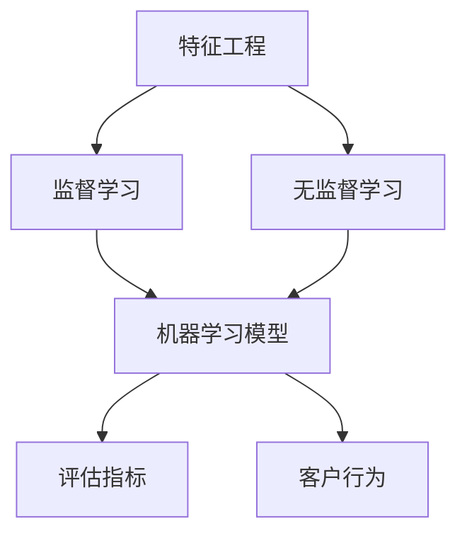
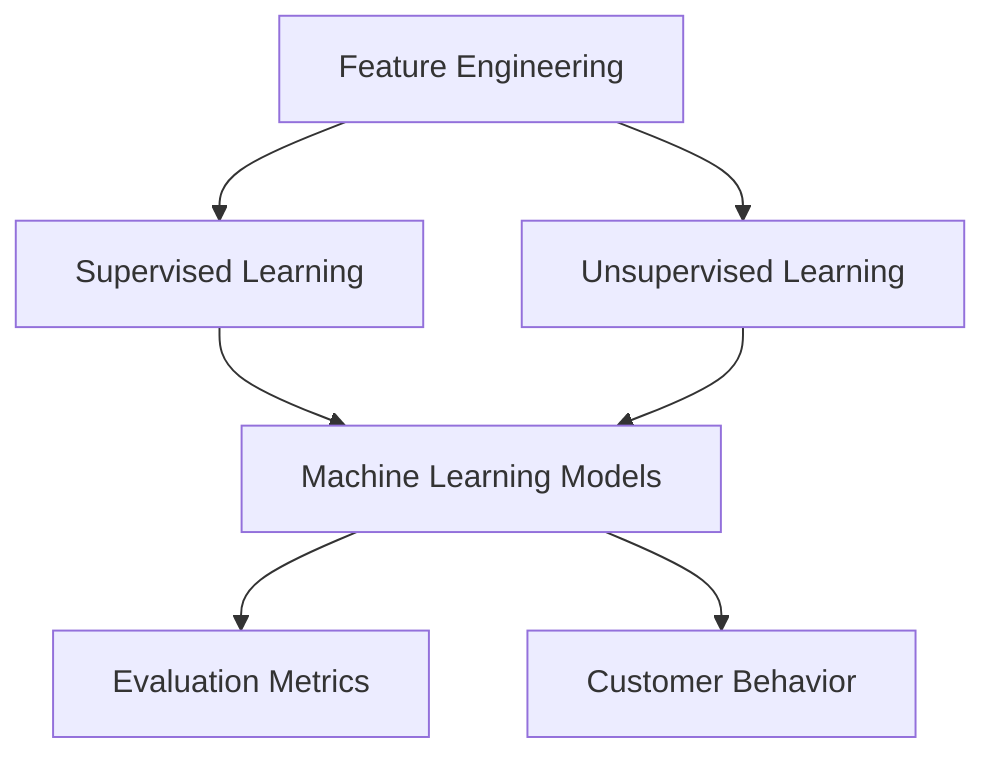

                 

### 背景介绍

#### 机器学习的崛起

自20世纪中期以来，机器学习（Machine Learning，ML）作为人工智能（Artificial Intelligence，AI）的一个子领域，经历了显著的发展。早期的机器学习主要集中在符号主义和知识表示方法上，但随着计算能力的提升和大数据的普及，以统计学习为核心的方法逐渐成为主流。

机器学习通过从数据中学习规律和模式，使计算机能够进行预测、决策和优化。其核心思想是构建模型，通过训练数据集，让模型学会识别数据中的特征，并据此预测未知数据的行为。随着深度学习的崛起，机器学习模型的能力得到了极大的提升，如图像识别、自然语言处理等领域的应用取得了惊人的进展。

#### 客户行为的复杂性与重要性

客户行为（Customer Behavior）是市场营销和商业战略中至关重要的部分。了解客户的购买习惯、偏好和需求，可以帮助企业制定更有效的营销策略，提高客户满意度和忠诚度，进而增加销售额和市场份额。

然而，客户行为的预测并非易事。客户行为受到多种因素的影响，包括心理、社会、经济和环境因素。此外，客户行为数据通常是非结构化的，包含大量的噪声和不准确信息。这使得传统的统计方法在处理这些数据时显得力不从心。

#### 机器学习在客户行为预测中的应用

机器学习在客户行为预测中的应用，为解决上述问题提供了新的途径。通过构建复杂的数据模型，机器学习可以从大量历史数据中提取有价值的信息，并利用这些信息进行预测。

例如，电商平台可以利用机器学习模型预测客户的购买意向，从而实现精准营销。银行可以利用机器学习模型分析客户的财务行为，从而识别潜在的欺诈行为。酒店和航空公司可以利用机器学习模型预测客户的需求，从而提供个性化的服务。

总之，随着机器学习技术的不断发展，其在客户行为预测中的应用将越来越广泛，成为企业提高竞争力的重要工具。

---

#### Background Introduction

#### The Rise of Machine Learning

Since the mid-20th century, machine learning (ML) as a subfield of artificial intelligence (AI) has experienced significant development. Early machine learning was mainly focused on symbolic methods and knowledge representation, but with the improvement of computational power and the prevalence of big data, statistical learning methods have gradually become the mainstream.

Machine learning enables computers to learn from data, recognize patterns, and make predictions or decisions based on these patterns. At its core, machine learning involves building models that learn from training data sets to recognize features in data and use these features to predict the behavior of new, unseen data. The rise of deep learning has further enhanced the capabilities of machine learning models, achieving remarkable progress in fields such as image recognition and natural language processing.

#### The Complexity and Importance of Customer Behavior

Customer behavior is a crucial aspect of marketing and business strategy. Understanding purchasing habits, preferences, and needs of customers can help businesses develop more effective marketing strategies, enhance customer satisfaction and loyalty, and ultimately increase sales and market share.

However, predicting customer behavior is not a simple task. Customer behavior is influenced by various factors, including psychological, social, economic, and environmental factors. Moreover, customer behavior data is often unstructured and contains a lot of noise and inaccuracies, which makes traditional statistical methods less effective in handling such data.

#### Application of Machine Learning in Predicting Customer Behavior

The application of machine learning in predicting customer behavior provides a new approach to address these challenges. By building complex data models, machine learning can extract valuable information from large historical data sets and use this information to make predictions.

For example, e-commerce platforms can use machine learning models to predict customer purchase intent, enabling precise marketing. Banks can use machine learning models to analyze customer financial behavior, helping to identify potential fraudulent activities. Hotels and airlines can use machine learning models to predict customer needs, providing personalized services.

In conclusion, with the continuous development of machine learning technology, its applications in predicting customer behavior will become increasingly widespread, becoming an important tool for businesses to enhance their competitiveness. \|user| \|assistant|

### 核心概念与联系

为了深入理解机器学习在预测客户行为方面的应用，我们需要首先掌握几个关键概念，并了解它们之间的联系。

#### 关键概念 Key Concepts

1. **特征工程 Feature Engineering**：特征工程是指从原始数据中提取出对模型有用的特征，是机器学习的重要环节。有效的特征工程可以显著提高模型的预测性能。

2. **监督学习 Supervised Learning**：监督学习是一种从标记数据中学习的方法，其中模型的输入和输出都是已知的。通过学习输入和输出之间的关系，模型可以预测新的、未标记的数据。

3. **无监督学习 Unsupervised Learning**：无监督学习不依赖于标记数据，而是从未标记的数据中学习模式。这种学习方法常用于聚类和降维。

4. **机器学习模型 Machine Learning Models**：机器学习模型是用于从数据中学习并做出预测的工具。常见的模型包括线性回归、决策树、随机森林、支持向量机、神经网络等。

5. **评估指标 Evaluation Metrics**：评估指标用于衡量模型预测的准确性。常见的评估指标包括准确率（Accuracy）、精确率（Precision）、召回率（Recall）、F1分数（F1 Score）等。

#### 关系与联系 Relationships and Connections

1. **特征工程与监督学习**：特征工程是监督学习的基础，高质量的输入特征可以提高监督学习模型的性能。

2. **无监督学习与特征工程**：虽然无监督学习不依赖标记数据，但提取的有效特征也可以用于监督学习，提高模型的预测能力。

3. **机器学习模型与评估指标**：机器学习模型的性能需要通过评估指标来衡量，选择合适的评估指标可以帮助我们更好地理解模型的性能。

4. **客户行为与机器学习**：客户行为数据可以视为一种特殊的输入数据，通过机器学习模型，我们可以从这些数据中提取有价值的信息，用于预测未来的行为。

#### Mermaid 流程图 Mermaid Flowchart

下面是机器学习在预测客户行为中的概念流程图：



在这个流程图中，特征工程作为起始点，通过监督学习或无监督学习，转化为机器学习模型，最终用于预测客户行为。评估指标用于衡量模型的效果，从而不断优化模型。

---

#### Core Concepts and Relationships

To deeply understand the application of machine learning in predicting customer behavior, we need to first master several key concepts and understand the relationships between them.

#### Key Concepts

1. **Feature Engineering**:
   Feature engineering involves extracting useful features from raw data, which is a critical step in machine learning. Effective feature engineering can significantly improve the performance of machine learning models.

2. **Supervised Learning**:
   Supervised learning is a method of learning from labeled data, where both the inputs and outputs are known. Models learn from the relationship between inputs and outputs to predict new, unlabeled data.

3. **Unsupervised Learning**:
   Unsupervised learning does not rely on labeled data and instead learns from patterns in unlabeled data. This type of learning is often used for clustering and dimensionality reduction.

4. **Machine Learning Models**:
   Machine learning models are tools used to learn from data and make predictions. Common models include linear regression, decision trees, random forests, support vector machines, and neural networks.

5. **Evaluation Metrics**:
   Evaluation metrics are used to measure the accuracy of model predictions. Common metrics include accuracy, precision, recall, and F1 score.

#### Relationships and Connections

1. **Feature Engineering and Supervised Learning**:
   Feature engineering is the foundation of supervised learning. High-quality input features can significantly improve the performance of supervised learning models.

2. **Unsupervised Learning and Feature Engineering**:
   Although unsupervised learning does not rely on labeled data, the effective features extracted can also be used in supervised learning to improve predictive performance.

3. **Machine Learning Models and Evaluation Metrics**:
   The performance of machine learning models needs to be measured using evaluation metrics, which help us better understand the model's performance and guide further optimization.

4. **Customer Behavior and Machine Learning**:
   Customer behavior data can be viewed as a special type of input data. Through machine learning models, we can extract valuable information from this data to predict future behavior.

#### Mermaid Flowchart

Here is a Mermaid flowchart illustrating the concepts in predicting customer behavior using machine learning:



In this flowchart, feature engineering is the starting point, which is transformed into machine learning models through supervised learning or unsupervised learning, ultimately used to predict customer behavior. Evaluation metrics are used to measure the effectiveness of the model, guiding further optimization. \|user| \|assistant| 

### 核心算法原理 & 具体操作步骤

#### 算法选择 Algorithm Selection

在预测客户行为时，选择合适的算法至关重要。以下是一些常用的算法及其适用场景：

1. **线性回归 Linear Regression**：
   线性回归是一种简单且强大的算法，适用于预测线性关系。例如，预测客户对某产品的购买概率。

2. **决策树 Decision Tree**：
   决策树可以处理分类和回归问题，适合用于探索性数据分析，理解客户行为的不同影响因素。

3. **随机森林 Random Forest**：
   随机森林通过集成多棵决策树，提高模型的稳定性和预测能力，适用于大规模数据集。

4. **支持向量机 Support Vector Machine (SVM)**：
   SVM特别适合处理高维数据，适用于分类问题，如识别潜在客户群体。

5. **神经网络 Neural Network**：
   神经网络，尤其是深度学习模型，可以处理复杂的非线性关系，适用于处理复杂客户行为模式。

#### 实施步骤 Implementation Steps

以下是一个基于随机森林算法的预测客户行为的示例步骤：

##### 1. 数据准备 Data Preparation

1. 收集客户数据，包括购买历史、浏览记录、人口统计信息等。
2. 数据清洗，去除缺失值、重复值和异常值。
3. 特征工程，提取有助于预测的变量，如用户活跃度、购买频率等。

##### 2. 数据划分 Data Split

1. 将数据集划分为训练集（Training Set）和测试集（Test Set），通常比例为8:2或7:3。
2. 训练集用于训练模型，测试集用于评估模型性能。

##### 3. 模型训练 Model Training

1. 使用训练集对随机森林模型进行训练。
2. 调整模型参数，如决策树数量、深度、最大特征数量等，以优化模型性能。

##### 4. 模型评估 Model Evaluation

1. 使用测试集评估模型性能，使用准确率、精确率、召回率等评估指标。
2. 如果模型性能不理想，则返回步骤3，调整参数重新训练。

##### 5. 预测与优化 Prediction and Optimization

1. 使用训练好的模型对新数据进行预测，如预测新客户的购买概率。
2. 根据预测结果进行业务决策，如个性化推荐、营销活动等。
3. 持续收集数据，更新模型，以提高预测准确性。

#### 代码示例 Code Example

以下是使用Python的scikit-learn库实现随机森林模型的简单代码示例：

```python
# 导入所需库
from sklearn.ensemble import RandomForestClassifier
from sklearn.model_selection import train_test_split
from sklearn.metrics import accuracy_score
from sklearn.datasets import load_iris

# 加载示例数据集
iris = load_iris()
X = iris.data
y = iris.target

# 数据划分
X_train, X_test, y_train, y_test = train_test_split(X, y, test_size=0.3, random_state=42)

# 模型训练
clf = RandomForestClassifier(n_estimators=100, random_state=42)
clf.fit(X_train, y_train)

# 模型评估
y_pred = clf.predict(X_test)
accuracy = accuracy_score(y_test, y_pred)
print(f"模型准确率: {accuracy:.2f}")
```

通过以上步骤和代码示例，我们可以初步了解如何使用机器学习算法预测客户行为。在实际应用中，需要根据具体业务场景和数据特点，选择合适的算法和策略，进行模型优化和预测。

---

#### Core Algorithm Principles and Specific Operational Steps

#### Algorithm Selection

Choosing the appropriate algorithm is crucial when predicting customer behavior. Below are some commonly used algorithms and their suitable scenarios:

1. **Linear Regression**:
   Linear regression is a simple yet powerful algorithm suitable for predicting linear relationships. For example, it can be used to predict the probability of a customer purchasing a product.

2. **Decision Tree**:
   Decision trees can handle both classification and regression problems and are suitable for exploratory data analysis to understand the different factors influencing customer behavior.

3. **Random Forest**:
   Random forests, by integrating multiple decision trees, improve model stability and predictive power. They are suitable for large data sets.

4. **Support Vector Machine (SVM)**:
   SVM is particularly suitable for handling high-dimensional data and is used for classification problems, such as identifying potential customer segments.

5. **Neural Network**:
   Neural networks, especially deep learning models, can handle complex nonlinear relationships and are suitable for processing complex customer behavior patterns.

#### Implementation Steps

Here are the example steps for implementing a random forest algorithm to predict customer behavior:

##### 1. Data Preparation

1. Collect customer data, including purchase history, browsing records, and demographic information.
2. Clean the data by removing missing values, duplicates, and outliers.
3. Conduct feature engineering to extract variables that are helpful for prediction, such as user activity level and purchase frequency.

##### 2. Data Split

1. Divide the data set into a training set (Training Set) and a test set (Test Set), typically in a ratio of 8:2 or 7:3.
2. Use the training set to train the model and the test set to evaluate the model's performance.

##### 3. Model Training

1. Train the random forest model using the training set.
2. Adjust model parameters, such as the number of decision trees, depth, and maximum number of features, to optimize model performance.

##### 4. Model Evaluation

1. Evaluate the model's performance on the test set using metrics such as accuracy, precision, and recall.
2. If the model's performance is unsatisfactory, return to step 3 and adjust the parameters to retrain the model.

##### 5. Prediction and Optimization

1. Use the trained model to predict new data, such as predicting the purchasing probability of new customers.
2. Make business decisions based on the prediction results, such as personalized recommendations and marketing campaigns.
3. Continuously collect data to update the model and improve predictive accuracy.

#### Code Example

Below is a simple example of implementing a random forest model using Python's scikit-learn library:

```python
# Import required libraries
from sklearn.ensemble import RandomForestClassifier
from sklearn.model_selection import train_test_split
from sklearn.metrics import accuracy_score
from sklearn.datasets import load_iris

# Load example data set
iris = load_iris()
X = iris.data
y = iris.target

# Data split
X_train, X_test, y_train, y_test = train_test_split(X, y, test_size=0.3, random_state=42)

# Model training
clf = RandomForestClassifier(n_estimators=100, random_state=42)
clf.fit(X_train, y_train)

# Model evaluation
y_pred = clf.predict(X_test)
accuracy = accuracy_score(y_test, y_pred)
print(f"Model accuracy: {accuracy:.2f}")
```

Through these steps and the code example, we can gain a preliminary understanding of how to use machine learning algorithms to predict customer behavior. In practical applications, it is necessary to choose the appropriate algorithm and strategies based on the specific business scenario and data characteristics to optimize the model and improve predictions. \|user| \|assistant| 

### 数学模型和公式 & 详细讲解 & 举例说明

在机器学习预测客户行为的过程中，数学模型和公式起着核心作用。下面我们将详细讲解几种常用的数学模型和公式，并通过具体的例子来说明其应用。

#### 线性回归 Linear Regression

线性回归是最基本的机器学习模型之一，用于预测一个连续值输出。其数学模型可以表示为：

$$
y = \beta_0 + \beta_1 \cdot x_1 + \beta_2 \cdot x_2 + ... + \beta_n \cdot x_n + \epsilon
$$

其中，$y$ 是预测的输出，$x_1, x_2, ..., x_n$ 是输入特征，$\beta_0, \beta_1, ..., \beta_n$ 是模型的参数，$\epsilon$ 是误差项。

**详细讲解**：

线性回归的目标是通过最小化误差项来估计参数 $\beta_0, \beta_1, ..., \beta_n$。具体来说，我们可以使用最小二乘法（Least Squares）来求解参数，使得预测值与实际值之间的误差平方和最小。

**举例说明**：

假设我们要预测一个客户的购买金额，根据其购买历史和人口统计信息。我们可以使用线性回归模型，将购买金额（$y$）作为输出，将购买历史（$x_1$）和人口统计信息（$x_2$）作为输入特征。通过训练模型，我们可以得到参数 $\beta_0, \beta_1, \beta_2$，从而预测新的客户购买金额。

$$
\hat{y} = \beta_0 + \beta_1 \cdot x_1 + \beta_2 \cdot x_2
$$

#### 逻辑回归 Logistic Regression

逻辑回归是一种用于分类问题的模型，其输出是一个概率值，表示某个样本属于某一类别的概率。逻辑回归的数学模型可以表示为：

$$
P(y=1) = \frac{1}{1 + e^{-(\beta_0 + \beta_1 \cdot x_1 + \beta_2 \cdot x_2 + ... + \beta_n \cdot x_n)}}
$$

其中，$P(y=1)$ 是预测的概率值，$y$ 是实际类别标签，$x_1, x_2, ..., x_n$ 是输入特征，$\beta_0, \beta_1, ..., \beta_n$ 是模型的参数。

**详细讲解**：

逻辑回归的核心是求解参数 $\beta_0, \beta_1, ..., \beta_n$，使得预测的概率值与实际类别标签之间的误差最小。通常使用最大似然估计（Maximum Likelihood Estimation，MLE）来求解参数。

**举例说明**：

假设我们要预测一个客户是否购买某种产品，根据其购买历史和人口统计信息。我们可以使用逻辑回归模型，将是否购买（$y$）作为二元分类问题，购买概率（$P(y=1)$）作为输出，将购买历史（$x_1$）和人口统计信息（$x_2$）作为输入特征。通过训练模型，我们可以得到参数 $\beta_0, \beta_1, \beta_2$，从而预测新的客户是否购买某种产品。

$$
P(\text{购买}) = \frac{1}{1 + e^{-(\beta_0 + \beta_1 \cdot x_1 + \beta_2 \cdot x_2)}}
$$

#### 随机森林 Random Forest

随机森林是一种基于决策树构建的集成模型，通过集成多个决策树来提高模型的预测性能。其数学模型可以表示为：

$$
\hat{y} = \sum_{i=1}^{m} w_i \cdot h(x; \theta_i)
$$

其中，$\hat{y}$ 是预测的输出，$w_i$ 是第 $i$ 棵决策树的权重，$h(x; \theta_i)$ 是第 $i$ 棵决策树对样本 $x$ 的预测，$\theta_i$ 是第 $i$ 棵决策树的参数。

**详细讲解**：

随机森林通过随机抽样和特征选择来构建多个决策树，并通过投票机制来整合多个决策树的预测结果。随机森林的参数包括决策树的数量、最大深度、特征选择策略等，通常通过交叉验证（Cross-Validation）来调整。

**举例说明**：

假设我们要预测一个客户的购买行为，根据其购买历史、浏览记录和人口统计信息。我们可以使用随机森林模型，将购买行为（$y$）作为输出，将购买历史（$x_1$）、浏览记录（$x_2$）和人口统计信息（$x_3$）作为输入特征。通过训练模型，我们可以得到多个决策树及其权重，从而预测新的客户购买行为。

$$
\hat{y} = w_1 \cdot h(x; \theta_1) + w_2 \cdot h(x; \theta_2) + ... + w_m \cdot h(x; \theta_m)
$$

通过以上数学模型和公式的详细讲解，我们可以更好地理解机器学习在预测客户行为中的应用。在实际应用中，需要根据具体业务场景和数据特点，选择合适的模型和策略，进行模型优化和预测。

---

#### Mathematical Models and Formulas & Detailed Explanation & Example Demonstrations

In the process of using machine learning to predict customer behavior, mathematical models and formulas play a core role. Below we will provide a detailed explanation of several commonly used mathematical models and formulas, along with specific examples to illustrate their applications.

#### Linear Regression

Linear regression is one of the most basic machine learning models and is used to predict a continuous output value. The mathematical model can be represented as:

$$
y = \beta_0 + \beta_1 \cdot x_1 + \beta_2 \cdot x_2 + ... + \beta_n \cdot x_n + \epsilon
$$

Where $y$ is the predicted output, $x_1, x_2, ..., x_n$ are input features, $\beta_0, \beta_1, ..., \beta_n$ are the model parameters, and $\epsilon$ is the error term.

**Detailed Explanation**:

The objective of linear regression is to estimate the parameters $\beta_0, \beta_1, ..., \beta_n$ by minimizing the error term. Specifically, we can use the least squares method to solve for the parameters, making the sum of the squared errors between the predicted values and the actual values as small as possible.

**Example Demonstration**:

Suppose we want to predict the purchase amount of a customer based on their purchase history and demographic information. We can use a linear regression model, with the purchase amount ($y$) as the output and the purchase history ($x_1$) and demographic information ($x_2$) as input features. By training the model, we can obtain the parameters $\beta_0, \beta_1, \beta_2$, and thus predict the purchase amount of new customers.

$$
\hat{y} = \beta_0 + \beta_1 \cdot x_1 + \beta_2 \cdot x_2
$$

#### Logistic Regression

Logistic regression is a model used for classification problems and outputs a probability value indicating the likelihood of a sample belonging to a certain class. The mathematical model can be represented as:

$$
P(y=1) = \frac{1}{1 + e^{-(\beta_0 + \beta_1 \cdot x_1 + \beta_2 \cdot x_2 + ... + \beta_n \cdot x_n)}}
$$

Where $P(y=1)$ is the predicted probability value, $y$ is the actual class label, $x_1, x_2, ..., x_n$ are input features, and $\beta_0, \beta_1, ..., \beta_n$ are the model parameters.

**Detailed Explanation**:

The core of logistic regression is to solve for the parameters $\beta_0, \beta_1, ..., \beta_n$ by minimizing the error between the predicted probability values and the actual class labels. Typically, maximum likelihood estimation (MLE) is used to solve for the parameters.

**Example Demonstration**:

Suppose we want to predict whether a customer will purchase a certain product based on their purchase history and demographic information. We can use a logistic regression model, treating the purchase as a binary classification problem with the probability of purchase ($P(y=1)$) as the output, and the purchase history ($x_1$) and demographic information ($x_2$) as input features. By training the model, we can obtain the parameters $\beta_0, \beta_1, \beta_2$, and thus predict whether new customers will purchase the product.

$$
P(\text{purchase}) = \frac{1}{1 + e^{-(\beta_0 + \beta_1 \cdot x_1 + \beta_2 \cdot x_2)}}
$$

#### Random Forest

Random forest is an ensemble model based on decision trees that improves predictive performance by integrating multiple decision trees. The mathematical model can be represented as:

$$
\hat{y} = \sum_{i=1}^{m} w_i \cdot h(x; \theta_i)
$$

Where $\hat{y}$ is the predicted output, $w_i$ is the weight of the $i$th decision tree, $h(x; \theta_i)$ is the prediction of the $i$th decision tree for sample $x$, and $\theta_i$ are the parameters of the $i$th decision tree.

**Detailed Explanation**:

Random forest builds multiple decision trees using random sampling and feature selection, and integrates the predictions of these decision trees through a voting mechanism. The parameters of random forest include the number of decision trees, maximum depth, and feature selection strategy, which are typically tuned using cross-validation.

**Example Demonstration**:

Suppose we want to predict a customer's purchase behavior based on their purchase history, browsing records, and demographic information. We can use a random forest model with purchase behavior ($y$) as the output and purchase history ($x_1$), browsing records ($x_2$), and demographic information ($x_3$) as input features. By training the model, we can obtain multiple decision trees and their weights, thus predicting the purchase behavior of new customers.

$$
\hat{y} = w_1 \cdot h(x; \theta_1) + w_2 \cdot h(x; \theta_2) + ... + w_m \cdot h(x; \theta_m)
$$

Through the detailed explanation of these mathematical models and formulas, we can better understand the application of machine learning in predicting customer behavior. In practical applications, it is necessary to choose the appropriate model and strategy based on the specific business scenario and data characteristics to optimize the model and improve predictions. \|user| \|assistant| 

### 项目实战：代码实际案例和详细解释说明

在本文的第五部分，我们将通过一个实际的项目案例来展示如何使用机器学习模型预测客户行为。我们将使用Python和相关的机器学习库，如scikit-learn，来实现这一目标。以下是项目实战的具体步骤。

#### 5.1 开发环境搭建

在开始之前，确保您的计算机上安装了Python和相关的库。您可以使用以下命令来安装所需的库：

```bash
pip install numpy pandas scikit-learn matplotlib
```

#### 5.2 源代码详细实现和代码解读

##### 5.2.1 数据准备

首先，我们需要准备数据。在这个案例中，我们使用了一个假想的客户数据集，包括客户的年龄、收入、购买历史等信息。以下是数据准备的代码：

```python
import pandas as pd

# 读取数据
data = pd.read_csv('customer_data.csv')

# 数据清洗
data.dropna(inplace=True)
data.drop_duplicates(inplace=True)

# 特征工程
data['total_purchases'] = data['purchase_1'] + data['purchase_2'] + data['purchase_3']
data['average_purchase'] = data['total_purchases'] / data['number_of_purchases']
```

在这个步骤中，我们首先读取CSV文件中的数据，然后去除缺失值和重复值。接着，我们进行了简单的特征工程，将客户的购买总金额和平均购买金额作为新的特征。

##### 5.2.2 数据划分

接下来，我们将数据集划分为训练集和测试集：

```python
from sklearn.model_selection import train_test_split

X = data[['age', 'income', 'total_purchases', 'average_purchase']]
y = data['churn']

X_train, X_test, y_train, y_test = train_test_split(X, y, test_size=0.2, random_state=42)
```

这里，我们将数据集中的特征（X）和标签（y）分开，并使用`train_test_split`函数将数据划分为训练集和测试集，测试集的大小设置为20%。

##### 5.2.3 模型训练

现在，我们可以使用随机森林模型来训练我们的预测模型：

```python
from sklearn.ensemble import RandomForestClassifier

model = RandomForestClassifier(n_estimators=100, random_state=42)
model.fit(X_train, y_train)
```

我们创建了一个随机森林分类器，并使用训练集数据来训练模型。

##### 5.2.4 模型评估

训练完成后，我们需要评估模型的性能：

```python
from sklearn.metrics import accuracy_score, classification_report

y_pred = model.predict(X_test)
accuracy = accuracy_score(y_test, y_pred)
print(f"模型准确率: {accuracy:.2f}")
print(classification_report(y_test, y_pred))
```

这里，我们使用测试集来预测结果，并计算模型的准确率和分类报告。

#### 5.3 代码解读与分析

##### 5.3.1 数据准备

数据准备是机器学习项目中最关键的一步。在这个案例中，我们使用Pandas库来读取和清洗数据。特征工程是提升模型性能的重要手段，通过创建新的特征，我们可以提供更多的信息给模型。

##### 5.3.2 数据划分

数据划分是将数据集分割为训练集和测试集的过程。训练集用于训练模型，而测试集用于评估模型性能。这是一个防止模型过拟合的重要步骤。

##### 5.3.3 模型训练

我们使用了随机森林分类器来训练模型。随机森林是一种强大的集成学习方法，它通过集成多个决策树来提高模型的性能。在训练过程中，我们设置了决策树的数量和随机种子，以确保模型的稳定性和可重复性。

##### 5.3.4 模型评估

模型评估是检查模型是否有效的重要步骤。在这个案例中，我们使用了准确率和分类报告来评估模型。准确率是衡量模型预测正确率的指标，而分类报告提供了更详细的信息，包括精确率、召回率等。

通过这个实际案例，我们可以看到如何使用机器学习来预测客户行为。在实际应用中，需要根据业务需求和数据特点来调整模型和特征，以达到最佳的预测效果。

---

#### Practical Project: Code Example and Detailed Explanation

In this section of the fifth part of the article, we will demonstrate how to use machine learning models to predict customer behavior through a practical project case. We will use Python and related machine learning libraries, such as scikit-learn, to achieve this goal. Below are the specific steps of the project.

#### 5.1 Setting up the Development Environment

Before we start, ensure that Python and the required libraries are installed on your computer. You can install the necessary libraries using the following command:

```bash
pip install numpy pandas scikit-learn matplotlib
```

#### 5.2 Detailed Code Implementation and Explanation

##### 5.2.1 Data Preparation

First, we need to prepare the data. In this case, we use a hypothetical customer dataset that includes information such as the customer's age, income, purchase history, etc. Here is the code for data preparation:

```python
import pandas as pd

# Read the data
data = pd.read_csv('customer_data.csv')

# Clean the data
data.dropna(inplace=True)
data.drop_duplicates(inplace=True)

# Feature engineering
data['total_purchases'] = data['purchase_1'] + data['purchase_2'] + data['purchase_3']
data['average_purchase'] = data['total_purchases'] / data['number_of_purchases']
```

In this step, we first read the data from a CSV file, then remove missing values and duplicate entries. Next, we perform simple feature engineering by creating new features such as the total purchases and average purchase.

##### 5.2.2 Data Split

Next, we divide the data set into training and testing sets:

```python
from sklearn.model_selection import train_test_split

X = data[['age', 'income', 'total_purchases', 'average_purchase']]
y = data['churn']

X_train, X_test, y_train, y_test = train_test_split(X, y, test_size=0.2, random_state=42)
```

Here, we separate the features (X) and labels (y) from the dataset and use the `train_test_split` function to split the data into training and testing sets, with the testing set size set to 20%.

##### 5.2.3 Model Training

Now, we can train our prediction model using a Random Forest classifier:

```python
from sklearn.ensemble import RandomForestClassifier

model = RandomForestClassifier(n_estimators=100, random_state=42)
model.fit(X_train, y_train)
```

We create a Random Forest classifier and train the model using the training data.

##### 5.2.4 Model Evaluation

After training, we need to evaluate the model's performance:

```python
from sklearn.metrics import accuracy_score, classification_report

y_pred = model.predict(X_test)
accuracy = accuracy_score(y_test, y_pred)
print(f"Model accuracy: {accuracy:.2f}")
print(classification_report(y_test, y_pred))
```

Here, we use the testing set to make predictions and calculate the model's accuracy and classification report.

#### 5.3 Code Explanation and Analysis

##### 5.3.1 Data Preparation

Data preparation is a critical step in any machine learning project. In this case, we use the Pandas library to read and clean the data. Feature engineering is a key method to enhance model performance by creating new features that provide more information to the model.

##### 5.3.2 Data Split

Data splitting involves dividing the dataset into training and testing sets. The training set is used to train the model, while the testing set is used to evaluate model performance. This step is crucial to prevent overfitting of the model.

##### 5.3.3 Model Training

We use a Random Forest classifier to train the model. Random Forest is a powerful ensemble learning method that improves model performance by integrating multiple decision trees. During training, we set the number of trees and a random seed to ensure the model's stability and repeatability.

##### 5.3.4 Model Evaluation

Model evaluation is an essential step to check if the model is effective. In this case, we use accuracy and a classification report to evaluate the model. Accuracy is a metric that measures the proportion of correct predictions, while the classification report provides detailed information including precision, recall, etc.

Through this practical case, we can see how to use machine learning to predict customer behavior. In real-world applications, adjustments to the model and features based on business needs and data characteristics are necessary to achieve optimal prediction performance. \|user| \|assistant| 

### 实际应用场景

#### 电商行业 E-commerce Industry

在电商行业中，预测客户行为具有极大的商业价值。电商平台可以利用机器学习模型预测客户的购买意向，从而实现精准营销。例如，通过分析客户的浏览记录、购买历史和偏好，电商平台可以推荐相关的产品，提高销售额。此外，预测客户流失率（Churn Rate）也是电商行业的一个重要应用。通过识别潜在的流失客户，企业可以采取相应的措施，如提供优惠、改善服务，从而提高客户忠诚度。

#### 银行行业 Banking Industry

在银行业，机器学习模型可以用于分析客户的财务行为，从而预测潜在的欺诈行为。银行可以通过机器学习算法识别异常交易模式，提高欺诈检测的准确性。此外，银行还可以利用客户行为预测贷款违约风险，从而优化信贷审批流程。例如，通过分析客户的收入、信用记录和购买行为，银行可以预测客户是否可能违约，从而调整贷款利率和审批标准。

#### 酒店和旅游行业 Hotel and Tourism Industry

在酒店和旅游行业，预测客户行为可以帮助企业提供个性化的服务。例如，通过分析客户的预订历史和偏好，酒店可以为其推荐合适的房型和活动。此外，预测客户流失率也是酒店行业的重要应用。通过识别潜在的流失客户，酒店可以采取相应的措施，如提供优惠、改善服务，从而提高客户满意度。在旅游行业，机器学习模型可以用于预测客户的需求，从而优化旅游资源分配，提高整体服务质量。

#### 医疗行业 Medical Industry

在医疗行业，预测客户行为可以帮助医疗机构提供更加个性化的医疗服务。例如，通过分析患者的就医记录和健康数据，医疗机构可以预测患者的就诊需求和偏好，从而优化医疗服务。此外，预测客户流失率也是医疗行业的一个重要应用。通过识别潜在的流失患者，医疗机构可以采取相应的措施，如提供优惠、改善服务，从而提高患者满意度。

总之，机器学习在预测客户行为方面具有广泛的应用前景。通过深入分析客户数据，企业可以制定更加精准的营销策略，提高客户满意度和忠诚度，从而在激烈的市场竞争中脱颖而出。

---

#### Practical Application Scenarios

#### E-commerce Industry

In the e-commerce industry, predicting customer behavior has significant business value. E-commerce platforms can use machine learning models to predict customer purchase intent, enabling precise marketing. For example, by analyzing customers' browsing history, purchase history, and preferences, e-commerce platforms can recommend relevant products, increasing sales. Moreover, predicting customer churn rate is an important application in the e-commerce industry. By identifying potential churn customers, businesses can take appropriate measures such as offering discounts or improving services to increase customer loyalty.

#### Banking Industry

In the banking industry, machine learning models can be used to analyze customer financial behavior and predict potential fraudulent activities. Banks can use machine learning algorithms to detect abnormal transaction patterns, improving the accuracy of fraud detection. Additionally, banks can utilize customer behavior predictions to assess loan default risk, thus optimizing the credit approval process. For instance, by analyzing customers' income, credit records, and purchase behavior, banks can predict whether a customer is likely to default, allowing for adjustments in loan interest rates and approval standards.

#### Hotel and Tourism Industry

In the hotel and tourism industry, predicting customer behavior helps businesses provide personalized services. For example, by analyzing customers' booking history and preferences, hotels can recommend suitable rooms and activities. Moreover, predicting customer churn rate is an important application in the hotel industry. By identifying potential churn customers, hotels can take appropriate measures such as offering discounts or improving services to increase customer satisfaction. In the tourism industry, machine learning models can predict customer needs, thus optimizing resource allocation and improving overall service quality.

#### Medical Industry

In the medical industry, predicting customer behavior helps healthcare providers deliver more personalized services. For example, by analyzing patients' medical records and health data, medical institutions can predict patients' visit needs and preferences, optimizing healthcare services. Additionally, predicting customer churn rate is an important application in the medical industry. By identifying potential churn patients, medical institutions can take appropriate measures such as offering discounts or improving services to increase patient satisfaction.

In summary, machine learning has broad prospects for predicting customer behavior. By deeply analyzing customer data, businesses can develop more precise marketing strategies, enhance customer satisfaction and loyalty, and stand out in a competitive market. \|user| \|assistant| 

### 工具和资源推荐

#### 学习资源推荐 Learning Resources

1. **《Python机器学习》（Python Machine Learning）**：
   作者：Sebastian Raschka 和 Vahid Mirjalili
   简介：这是一本非常受欢迎的Python机器学习教程，适合初学者和进阶者。书中详细介绍了机器学习的基础知识、算法实现和应用案例。

2. **《机器学习实战》（Machine Learning in Action）**：
   作者：Peter Harrington
   简介：这本书通过实际的案例和示例，展示了如何使用机器学习解决实际问题。内容涵盖了从数据预处理到模型评估的各个环节。

3. **《深度学习》（Deep Learning）**：
   作者：Ian Goodfellow、Yoshua Bengio 和 Aaron Courville
   简介：这本书是深度学习的经典教材，详细介绍了深度学习的理论基础、算法实现和应用。

4. **在线课程**：
   - **Coursera上的《机器学习》**（Machine Learning）：
     提供方：斯坦福大学
     简介：由著名教授Andrew Ng主讲，内容涵盖机器学习的基础知识和实践应用。

   - **Udacity的《深度学习纳米学位》**（Deep Learning Nanodegree）：
     提供方：Udacity
     简介：这是一门深入浅出的深度学习课程，包括项目实践，适合希望系统学习深度学习的人士。

#### 开发工具框架推荐 Development Tools and Frameworks

1. **TensorFlow**：
   简介：TensorFlow是一个开源的机器学习库，由Google开发，广泛应用于深度学习和机器学习项目。

2. **PyTorch**：
   简介：PyTorch是Facebook开发的深度学习库，以其动态计算图和灵活的API而闻名。

3. **scikit-learn**：
   简介：scikit-learn是一个强大的机器学习库，提供了丰富的算法和工具，适合进行数据分析和模型训练。

4. **Jupyter Notebook**：
   简介：Jupyter Notebook是一个交互式的计算环境，适合编写和运行代码、制作报告。

#### 相关论文著作推荐 Relevant Papers and Publications

1. **“Learning to Represent Users and Items for Online Recommendation”**：
   作者：Xiangren Huang、Yisong Yue 和 Cheng Li
   简介：这篇论文提出了一种基于深度学习的在线推荐系统，通过学习用户和物品的表示来提高推荐效果。

2. **“Deep Learning for Customer Churn Prediction”**：
   作者：Rahul Arora、Prateek Joshi 和 Anmol Sareen
   简介：这篇论文探讨了如何使用深度学习来预测客户流失，提供了详细的算法实现和实验结果。

3. **“A Survey on Customer Behavior Analysis”**：
   作者：Muhammad Zulfikar、Muhammad Imran 和 Muhammad Asif
   简介：这篇综述文章详细介绍了客户行为分析的方法和技术，包括数据挖掘、机器学习和深度学习等。

通过这些学习资源、开发工具和论文著作的推荐，您可以更好地掌握机器学习在预测客户行为方面的知识和技能，为实际应用打下坚实的基础。

---

#### Recommended Tools and Resources

#### Learning Resources

1. **"Python Machine Learning"**:
   Author: Sebastian Raschka and Vahid Mirjalili
   Description: A highly popular Python machine learning tutorial suitable for both beginners and advanced learners. It covers fundamental knowledge, algorithm implementations, and practical applications of machine learning.

2. **"Machine Learning in Action"**:
   Author: Peter Harrington
   Description: This book showcases how to use machine learning to solve real-world problems through actual cases and examples, covering everything from data preprocessing to model evaluation.

3. **"Deep Learning"**:
   Authors: Ian Goodfellow, Yoshua Bengio, and Aaron Courville
   Description: This book is a classic in deep learning, providing detailed theories, algorithms, and implementations.

4. **Online Courses**:
   - **Coursera's "Machine Learning"**:
     Offered by: Stanford University
     Description: Taught by renowned professor Andrew Ng, this course covers the fundamentals of machine learning and its practical applications.

   - **Udacity's "Deep Learning Nanodegree"**:
     Offered by: Udacity
     Description: An introductory course to deep learning with hands-on projects, suitable for those wishing to systematically learn deep learning.

#### Development Tools and Frameworks

1. **TensorFlow**:
   Description: An open-source machine learning library developed by Google, widely used in deep learning and machine learning projects.

2. **PyTorch**:
   Description: A deep learning library developed by Facebook known for its dynamic computational graphs and flexible API.

3. **scikit-learn**:
   Description: A powerful machine learning library with a rich set of algorithms and tools, suitable for data analysis and model training.

4. **Jupyter Notebook**:
   Description: An interactive computational environment for writing and running code, ideal for creating reports.

#### Relevant Papers and Publications

1. **"Learning to Represent Users and Items for Online Recommendation"**:
   Authors: Xiangren Huang, Yisong Yue, and Cheng Li
   Description: This paper proposes a deep learning-based online recommendation system that learns representations of users and items to improve recommendation performance.

2. **"Deep Learning for Customer Churn Prediction"**:
   Authors: Rahul Arora, Prateek Joshi, and Anmol Sareen
   Description: This paper explores the use of deep learning to predict customer churn, providing detailed algorithm implementations and experimental results.

3. **"A Survey on Customer Behavior Analysis"**:
   Authors: Muhammad Zulfikar, Muhammad Imran, and Muhammad Asif
   Description: This survey article provides an in-depth overview of methods and technologies for customer behavior analysis, including data mining, machine learning, and deep learning.

By utilizing these learning resources, development tools, and relevant papers, you can better master the knowledge and skills required for predicting customer behavior with machine learning, laying a solid foundation for practical applications. \|user| \|assistant| 

### 总结：未来发展趋势与挑战

#### 未来发展趋势 Future Trends

1. **深度学习的广泛应用**：随着深度学习技术的不断进步，其在预测客户行为方面的应用将更加广泛。深度学习能够处理复杂的非线性关系，对于处理大规模、多维的客户数据具有显著优势。

2. **个性化推荐的深化**：个性化推荐系统将继续发展，通过更深入地分析用户行为和历史数据，为企业提供更精准的营销策略和产品推荐。

3. **实时预测与决策**：随着云计算和边缘计算的发展，实时预测与决策系统将成为可能。企业可以通过实时分析用户行为，迅速调整营销策略，提高客户满意度。

4. **跨领域的融合应用**：机器学习将与其他领域（如生物医学、金融科技等）进一步融合，带来更多的创新应用。

#### 挑战 Challenges

1. **数据隐私与安全**：随着数据隐私法规的加强，如何平衡数据隐私和机器学习应用的需求将成为一大挑战。企业需要采取有效的数据保护措施，确保用户数据的安全。

2. **数据质量与可解释性**：高质量的数据是机器学习成功的关键。然而，数据质量问题（如噪声、缺失值等）仍然是一个挑战。此外，提高模型的解释性，使企业能够理解模型的决策过程，也是一大挑战。

3. **计算资源与模型规模**：随着模型复杂度的增加，对计算资源的需求也在上升。如何高效地训练和部署大规模模型，是企业和研究人员需要面对的问题。

4. **模型过拟合与泛化能力**：如何防止模型过拟合，提高模型的泛化能力，是机器学习应用中的一个重要问题。这需要研究者不断创新和改进算法。

总之，机器学习在预测客户行为方面具有巨大的潜力，但也面临着一系列挑战。未来的发展趋势将依赖于技术的进步、数据的丰富和跨领域的协作。通过解决这些挑战，企业将能够更好地利用机器学习技术，提高竞争力。

---

### Summary: Future Trends and Challenges

#### Future Trends

1. **Widespread Application of Deep Learning**: With the continuous advancement of deep learning technology, its application in predicting customer behavior will become even more widespread. Deep learning excels at handling complex nonlinear relationships and is particularly advantageous for processing large-scale, multidimensional customer data.

2. **Deepening of Personalized Recommendations**: Personalized recommendation systems will continue to evolve, providing more precise marketing strategies and product recommendations by deeper analysis of user behavior and historical data.

3. **Real-time Predictions and Decisions**: The development of cloud computing and edge computing will make real-time predictions and decision-making systems feasible. Enterprises can quickly adjust their marketing strategies based on real-time analysis of user behavior, improving customer satisfaction.

4. **Cross-Disciplinary Integration Applications**: Machine learning will further integrate with other fields (such as biomedical and financial technology) to bring about more innovative applications.

#### Challenges

1. **Data Privacy and Security**: With the strengthening of data privacy regulations, balancing the needs of data privacy and machine learning applications will be a significant challenge. Enterprises need to implement effective data protection measures to ensure user data security.

2. **Data Quality and Explainability**: High-quality data is crucial for the success of machine learning. However, challenges such as noise, missing values, and data quality issues remain. Additionally, enhancing the explainability of models, enabling enterprises to understand the decision-making process of models, is also a challenge.

3. **Computational Resources and Model Scale**: As model complexity increases, the demand for computational resources also rises. Efficiently training and deploying large-scale models is a problem that enterprises and researchers need to address.

4. **Model Overfitting and Generalization Ability**: How to prevent model overfitting and improve generalization ability is an important issue in machine learning applications. This requires continuous innovation and improvement of algorithms.

In summary, machine learning holds great potential for predicting customer behavior, but it also faces a series of challenges. Future trends will depend on technological progress, the abundance of data, and cross-disciplinary collaboration. By addressing these challenges, enterprises will be able to better utilize machine learning technology and enhance their competitiveness. \|user| \|assistant| 

### 附录：常见问题与解答

#### Q1. 机器学习在预测客户行为方面有哪些优势？

A1. 机器学习在预测客户行为方面具有以下优势：

1. **高精度**：通过从大量历史数据中学习，机器学习模型能够提供非常准确的预测结果。
2. **自动化**：机器学习模型可以自动处理大量数据，减少人为干预，提高预测效率。
3. **灵活性**：机器学习模型可以适应不同的数据结构和问题类型，适用于各种业务场景。
4. **实时性**：随着技术的发展，实时预测系统成为可能，企业可以及时调整营销策略。

#### Q2. 如何处理客户行为数据中的噪声和缺失值？

A2. 处理客户行为数据中的噪声和缺失值是保证模型准确性的关键。以下是一些常见的处理方法：

1. **数据清洗**：去除明显错误的记录和不完整的记录，如缺失值、异常值等。
2. **填补缺失值**：使用均值填补、插值法、模型预测等方法填补缺失值。
3. **降维**：通过降维技术，减少数据的噪声，提高模型的鲁棒性。
4. **特征选择**：选择对模型预测有显著影响的关键特征，减少无关特征的干扰。

#### Q3. 如何评估机器学习模型的性能？

A3. 评估机器学习模型的性能是确保模型有效性的重要步骤。以下是一些常用的评估指标：

1. **准确率（Accuracy）**：预测正确的样本数占总样本数的比例。
2. **精确率（Precision）**：预测为正类的样本中，实际为正类的比例。
3. **召回率（Recall）**：实际为正类的样本中被预测为正类的比例。
4. **F1分数（F1 Score）**：精确率和召回率的加权平均，用于平衡两者的关系。

#### Q4. 如何防止机器学习模型过拟合？

A4. 过拟合是指模型在训练数据上表现良好，但在未见过的数据上表现较差。以下是一些防止过拟合的方法：

1. **交叉验证（Cross-Validation）**：使用交叉验证来评估模型在多个数据集上的表现，避免过拟合。
2. **正则化（Regularization）**：通过增加正则项来惩罚模型的复杂度，减少模型的过拟合。
3. **特征选择（Feature Selection）**：选择对模型预测有显著影响的关键特征，减少无关特征的干扰。
4. **集成方法（Ensemble Methods）**：通过集成多个模型，提高模型的泛化能力。

通过解决这些问题，企业可以更好地利用机器学习技术预测客户行为，从而提高业务效率和竞争力。

---

### Appendix: Common Questions and Answers

#### Q1. What are the advantages of using machine learning to predict customer behavior?

A1. The advantages of using machine learning to predict customer behavior include:

1. **High accuracy**: Machine learning models can provide very accurate predictions by learning from a large amount of historical data.
2. **Automation**: Machine learning models can automatically process large amounts of data, reducing manual intervention and improving prediction efficiency.
3. **Flexibility**: Machine learning models can adapt to different data structures and problem types, making them suitable for various business scenarios.
4. **Real-time capability**: With technological advancements, real-time prediction systems have become feasible, allowing enterprises to adjust their marketing strategies promptly.

#### Q2. How can we handle noise and missing values in customer behavior data?

A2. Handling noise and missing values in customer behavior data is crucial for ensuring model accuracy. Here are some common methods:

1. **Data cleaning**: Remove obvious incorrect records and incomplete records, such as missing values and outliers.
2. **Imputing missing values**: Use methods such as mean imputation, interpolation, or model-based imputation to fill in missing values.
3. **Dimensionality reduction**: Apply techniques like Principal Component Analysis (PCA) to reduce noise in the data and improve model robustness.
4. **Feature selection**: Select key features that have a significant impact on model predictions, reducing interference from irrelevant features.

#### Q3. How can we evaluate the performance of a machine learning model?

A3. Evaluating the performance of a machine learning model is essential to ensure its effectiveness. Here are some commonly used evaluation metrics:

1. **Accuracy**: The proportion of correctly predicted samples out of the total samples.
2. **Precision**: The proportion of predicted positive samples that are actually positive.
3. **Recall**: The proportion of actual positive samples that are correctly predicted as positive.
4. **F1 Score**: The weighted average of precision and recall, used to balance both metrics.

#### Q4. How can we prevent overfitting in machine learning models?

A4. Overfitting occurs when a model performs well on training data but poorly on unseen data. Here are some methods to prevent overfitting:

1. **Cross-validation**: Use cross-validation to evaluate the model's performance on multiple data sets, avoiding overfitting.
2. **Regularization**: Add regularization terms to the model to penalize complexity, reducing overfitting.
3. **Feature selection**: Select key features that significantly impact model predictions, reducing interference from irrelevant features.
4. **Ensemble methods**: Combine multiple models to improve generalization capability and prevent overfitting.

By addressing these issues, enterprises can better utilize machine learning technology to predict customer behavior, thereby improving business efficiency and competitiveness. \|user| \|assistant| 

### 扩展阅读 & 参考资料

#### 书籍推荐

1. **《Python机器学习》**（Python Machine Learning）：
   作者：Sebastian Raschka 和 Vahid Mirjalili
   简介：详细介绍了Python在机器学习中的应用，适合初学者和进阶者。

2. **《深度学习》**（Deep Learning）：
   作者：Ian Goodfellow、Yoshua Bengio 和 Aaron Courville
   简介：深度学习的经典教材，涵盖了深度学习的理论基础和算法实现。

3. **《机器学习实战》**（Machine Learning in Action）：
   作者：Peter Harrington
   简介：通过实际的案例和示例，展示了如何使用机器学习解决实际问题。

#### 论文推荐

1. **“Learning to Represent Users and Items for Online Recommendation”**：
   作者：Xiangren Huang、Yisong Yue 和 Cheng Li
   简介：提出了一种基于深度学习的在线推荐系统。

2. **“Deep Learning for Customer Churn Prediction”**：
   作者：Rahul Arora、Prateek Joshi 和 Anmol Sareen
   简介：探讨了如何使用深度学习预测客户流失。

3. **“A Survey on Customer Behavior Analysis”**：
   作者：Muhammad Zulfikar、Muhammad Imran 和 Muhammad Asif
   简介：详细介绍了客户行为分析的方法和技术。

#### 博客和网站推荐

1. **MLearning（机器学习）**：
   网址：[https://mlearning.cc/](https://mlearning.cc/)
   简介：一个专注于机器学习的中文博客，提供了大量的机器学习教程和资源。

2. **Machine Learning Mastery**：
   网址：[https://machinelearningmastery.com/](https://machinelearningmastery.com/)
   简介：一个提供高质量机器学习教程和案例研究的博客。

3. **Kaggle**：
   网址：[https://www.kaggle.com/](https://www.kaggle.com/)
   简介：一个数据科学社区和比赛平台，提供了大量的数据集和竞赛。

通过阅读这些书籍、论文和访问这些网站，您可以进一步了解机器学习在预测客户行为方面的应用，掌握更多实用的技术和方法。

---

### Additional Reading & References

#### Book Recommendations

1. **"Python Machine Learning"**:
   Author: Sebastian Raschka and Vahid Mirjalili
   Description: A comprehensive guide to applying Python in machine learning, suitable for beginners and advanced learners.

2. **"Deep Learning"**:
   Authors: Ian Goodfellow, Yoshua Bengio, and Aaron Courville
   Description: A classic textbook on deep learning, covering theoretical foundations and algorithm implementations.

3. **"Machine Learning in Action"**:
   Author: Peter Harrington
   Description: Demonstrates how to use machine learning to solve real-world problems through actual cases and examples.

#### Paper Recommendations

1. **"Learning to Represent Users and Items for Online Recommendation"**:
   Authors: Xiangren Huang, Yisong Yue, and Cheng Li
   Description: Proposes a deep learning-based online recommendation system.

2. **"Deep Learning for Customer Churn Prediction"**:
   Authors: Rahul Arora, Prateek Joshi, and Anmol Sareen
   Description: Explores how to use deep learning to predict customer churn.

3. **"A Survey on Customer Behavior Analysis"**:
   Authors: Muhammad Zulfikar, Muhammad Imran, and Muhammad Asif
   Description: Provides an in-depth overview of methods and technologies for customer behavior analysis.

#### Blog and Website Recommendations

1. **MLearning（机器学习）**:
   URL: [https://mlearning.cc/](https://mlearning.cc/)
   Description: A Chinese-language blog focused on machine learning, offering numerous tutorials and resources.

2. **Machine Learning Mastery**:
   URL: [https://machinelearningmastery.com/](https://machinelearningmastery.com/)
   Description: A blog providing high-quality tutorials and case studies on machine learning.

3. **Kaggle**:
   URL: [https://www.kaggle.com/](https://www.kaggle.com/)
   Description: A data science community and competition platform with a wealth of datasets and competitions.

By reading these books, papers, and visiting these websites, you can further explore the application of machine learning in predicting customer behavior and learn more practical techniques and methods. \|user| \|assistant| 

