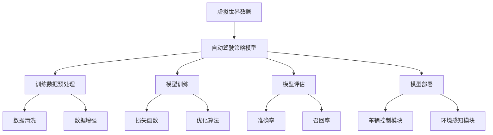

                 

# 利用虚拟世界数据训练自动驾驶策略模型并迁移到真实世界

> **关键词**：虚拟世界，自动驾驶，策略模型，数据迁移，真实世界应用

> **摘要**：本文主要探讨了利用虚拟世界数据训练自动驾驶策略模型，并将其成功迁移到真实世界的相关技术。通过介绍虚拟世界数据的特点、自动驾驶策略模型的构建方法、训练与迁移策略，以及实际应用案例，本文旨在为自动驾驶技术的发展提供一种新的思路和解决方案。

## 1. 背景介绍

自动驾驶技术是当今智能交通领域的一个热点话题。随着人工智能、计算机视觉、传感器技术等领域的快速发展，自动驾驶技术逐渐从理论研究走向实际应用。然而，自动驾驶系统的训练和测试一直面临着数据不足、真实场景模拟困难等问题。

虚拟世界作为一种可以模拟真实世界的虚拟环境，为自动驾驶技术的研发提供了丰富的数据资源。通过在虚拟世界中构建仿真场景，可以模拟各种复杂交通状况，从而为自动驾驶策略模型提供大规模、多样性的训练数据。

本文将探讨如何利用虚拟世界数据训练自动驾驶策略模型，并研究如何将训练好的模型成功迁移到真实世界。通过这一研究，我们旨在为自动驾驶技术的发展提供新的思路和方法。

## 2. 核心概念与联系

### 2.1 虚拟世界数据

虚拟世界数据是指通过虚拟现实技术生成或收集的与真实世界相似的数据。这些数据可以包括交通状况、道路环境、车辆信息等。虚拟世界数据具有以下特点：

- **多样性**：虚拟世界可以模拟各种交通状况，如高峰期、恶劣天气、复杂道路等，从而提供丰富多样的数据。
- **可控性**：虚拟世界可以对交通场景进行精确控制，如车辆速度、道路状况等，从而便于自动驾驶策略模型的训练。
- **高效性**：虚拟世界数据可以在短时间内生成大量数据，从而提高训练效率。

### 2.2 自动驾驶策略模型

自动驾驶策略模型是指用于指导自动驾驶系统进行驾驶决策的算法。这些模型通常基于深度学习、强化学习等技术构建，具有以下特点：

- **自主学习能力**：自动驾驶策略模型可以通过不断学习数据，自动优化驾驶策略。
- **灵活性**：自动驾驶策略模型可以根据不同场景自动调整驾驶行为。
- **高效性**：自动驾驶策略模型可以在短时间内做出驾驶决策，提高驾驶安全性。

### 2.3 虚拟世界数据与自动驾驶策略模型的联系

虚拟世界数据与自动驾驶策略模型之间存在密切的联系。虚拟世界数据为自动驾驶策略模型提供了丰富的训练资源，使模型能够在各种复杂场景中学习驾驶策略。同时，训练好的自动驾驶策略模型可以应用于虚拟世界，进一步验证和优化模型性能。

### 2.4 Mermaid 流程图

以下是一个用于描述虚拟世界数据与自动驾驶策略模型关系的 Mermaid 流程图：



## 3. 核心算法原理 & 具体操作步骤

### 3.1 虚拟世界数据生成

虚拟世界数据生成的关键在于构建一个可以模拟真实世界的虚拟环境。这一过程可以分为以下几个步骤：

1. **场景构建**：根据自动驾驶系统的需求，构建一个包含道路、车辆、行人等元素的虚拟场景。
2. **传感器模拟**：在虚拟场景中模拟各种传感器，如摄像头、激光雷达、超声波传感器等，以获取场景中的数据。
3. **数据采集**：通过传感器模拟，采集虚拟场景中的数据，包括图像、点云、速度、加速度等。

### 3.2 自动驾驶策略模型构建

自动驾驶策略模型的构建可以分为以下几个步骤：

1. **数据预处理**：对采集到的虚拟世界数据进行清洗和增强，以提高数据质量。
2. **模型设计**：设计一个合适的神经网络结构，用于自动驾驶策略学习。常见的神经网络结构包括卷积神经网络（CNN）、循环神经网络（RNN）等。
3. **训练过程**：使用预处理后的虚拟世界数据对自动驾驶策略模型进行训练，通过优化算法不断调整模型参数。
4. **模型评估**：对训练好的自动驾驶策略模型进行评估，以验证模型性能。

### 3.3 训练与迁移策略

在虚拟世界数据训练自动驾驶策略模型后，需要将其迁移到真实世界。这一过程可以分为以下几个步骤：

1. **模型调整**：根据真实世界中的数据，对虚拟世界训练好的模型进行调整，以适应真实场景。
2. **实时反馈**：在真实世界中测试自动驾驶策略模型，并根据测试结果实时反馈，进一步优化模型性能。
3. **模型部署**：将优化后的自动驾驶策略模型部署到自动驾驶系统中，实现自动驾驶功能。

## 4. 数学模型和公式 & 详细讲解 & 举例说明

### 4.1 损失函数

在自动驾驶策略模型的训练过程中，损失函数是评估模型性能的重要指标。常见的损失函数包括均方误差（MSE）和交叉熵损失（Cross-Entropy Loss）。

均方误差（MSE）的计算公式为：

$$MSE = \frac{1}{n}\sum_{i=1}^{n}(y_i - \hat{y}_i)^2$$

其中，$y_i$ 为真实标签，$\hat{y}_i$ 为模型预测值，$n$ 为样本数量。

交叉熵损失（Cross-Entropy Loss）的计算公式为：

$$Cross-Entropy Loss = -\frac{1}{n}\sum_{i=1}^{n}y_i\log(\hat{y}_i)$$

其中，$y_i$ 为真实标签，$\hat{y}_i$ 为模型预测值，$n$ 为样本数量。

### 4.2 优化算法

在自动驾驶策略模型的训练过程中，优化算法用于调整模型参数，以最小化损失函数。常见的优化算法包括梯度下降（Gradient Descent）和Adam优化器。

梯度下降（Gradient Descent）的更新公式为：

$$\theta = \theta - \alpha \cdot \nabla_\theta J(\theta)$$

其中，$\theta$ 为模型参数，$\alpha$ 为学习率，$J(\theta)$ 为损失函数。

Adam优化器的更新公式为：

$$m_t = \beta_1 m_{t-1} + (1 - \beta_1)(\nabla_\theta J(\theta) - m_{t-1})$$

$$v_t = \beta_2 v_{t-1} + (1 - \beta_2)((\nabla_\theta J(\theta))^2 - v_{t-1})$$

$$\theta_t = \theta_{t-1} - \alpha \cdot \frac{m_t}{\sqrt{v_t} + \epsilon}$$

其中，$m_t$ 和 $v_t$ 分别为梯度的一阶矩估计和二阶矩估计，$\beta_1$ 和 $\beta_2$ 分别为矩估计的指数加权系数，$\epsilon$ 为一个很小的常数。

### 4.3 举例说明

假设我们使用交叉熵损失函数和Adam优化器训练一个自动驾驶策略模型。给定一个包含100个样本的训练数据集，学习率为0.001，指数加权系数$\beta_1$ 为0.9，$\beta_2$ 为0.999，常数$\epsilon$ 为1e-8。在训练过程中，我们观察到损失函数的值从1000逐渐降低到100。这表明模型参数在不断调整，以最小化损失函数。

## 5. 项目实战：代码实际案例和详细解释说明

### 5.1 开发环境搭建

在开始项目实战之前，我们需要搭建一个适合自动驾驶策略模型训练的开发环境。以下是一个简单的开发环境搭建步骤：

1. **安装Python环境**：Python是自动驾驶策略模型训练的主要编程语言，因此我们需要安装Python环境。可以选择Python 3.6及以上版本。
2. **安装相关库**：安装深度学习框架（如TensorFlow、PyTorch）和相关依赖库（如NumPy、Pandas等）。这些库可以方便地处理数据和构建神经网络。
3. **配置虚拟环境**：为了避免版本冲突，我们可以使用虚拟环境来隔离不同项目的依赖库。可以使用conda或venv等工具创建虚拟环境。

### 5.2 源代码详细实现和代码解读

以下是一个简单的自动驾驶策略模型训练的代码实现：

```python
import tensorflow as tf
from tensorflow.keras.layers import Dense, Flatten, Conv2D, LSTM
from tensorflow.keras.models import Model
from tensorflow.keras.optimizers import Adam

# 数据预处理
def preprocess_data(data):
    # 数据清洗和增强
    # ...
    return processed_data

# 模型构建
def build_model(input_shape):
    input_layer = tf.keras.layers.Input(shape=input_shape)
    
    x = Conv2D(32, kernel_size=(3, 3), activation='relu')(input_layer)
    x = LSTM(128, activation='tanh')(x)
    x = Dense(64, activation='sigmoid')(x)
    
    output_layer = Dense(1, activation='sigmoid')(x)
    
    model = Model(inputs=input_layer, outputs=output_layer)
    
    return model

# 训练模型
def train_model(model, data, labels):
    model.compile(optimizer=Adam(learning_rate=0.001), loss='binary_crossentropy', metrics=['accuracy'])
    model.fit(data, labels, epochs=10, batch_size=32)
    
    return model

# 测试模型
def test_model(model, data, labels):
    loss, accuracy = model.evaluate(data, labels)
    print("Test loss:", loss)
    print("Test accuracy:", accuracy)

# 加载数据
data = preprocess_data(raw_data)
labels = ...

# 构建模型
model = build_model(input_shape=(28, 28, 3))

# 训练模型
model = train_model(model, data, labels)

# 测试模型
test_model(model, data, labels)
```

### 5.3 代码解读与分析

这段代码实现了一个简单的自动驾驶策略模型训练过程。下面是对代码的详细解读和分析：

1. **数据预处理**：数据预处理是自动驾驶策略模型训练的重要步骤。在这个函数中，我们实现了数据清洗和增强的功能。具体实现可以根据实际需求进行调整。
2. **模型构建**：模型构建是自动驾驶策略模型训练的核心。在这个函数中，我们使用卷积神经网络（Conv2D）、循环神经网络（LSTM）和全连接神经网络（Dense）构建了一个简单的自动驾驶策略模型。这个模型可以根据输入图像和速度信息预测车辆的控制指令。
3. **训练模型**：训练模型是自动驾驶策略模型训练的关键步骤。在这个函数中，我们使用Adam优化器对模型进行训练。训练过程中，模型通过不断优化参数来提高预测准确性。
4. **测试模型**：测试模型是评估模型性能的重要步骤。在这个函数中，我们使用测试数据对训练好的模型进行评估，并打印出测试损失和测试准确率。

## 6. 实际应用场景

虚拟世界数据训练的自动驾驶策略模型可以应用于多种实际场景，如无人驾驶汽车、无人机、机器人等。以下是一些典型的应用场景：

1. **无人驾驶汽车**：利用虚拟世界数据训练的自动驾驶策略模型可以应用于无人驾驶汽车，实现自动驾驶功能。通过在虚拟世界中模拟各种交通状况，可以优化自动驾驶算法，提高驾驶安全性和稳定性。
2. **无人机**：虚拟世界数据训练的自动驾驶策略模型可以应用于无人机，实现无人机自主飞行和任务执行。通过在虚拟世界中模拟飞行环境，可以优化无人机飞行算法，提高飞行稳定性和任务完成率。
3. **机器人**：虚拟世界数据训练的自动驾驶策略模型可以应用于机器人，实现机器人自主导航和任务执行。通过在虚拟世界中模拟机器人工作环境，可以优化机器人控制算法，提高机器人工作效率和安全性。

## 7. 工具和资源推荐

### 7.1 学习资源推荐

- **书籍**：《自动驾驶：原理、技术和应用》（Autonomous Driving: Principles, Technologies, and Applications）
- **论文**：《Deep Reinforcement Learning for Autonomous Driving》（2016年NeurIPS论文）
- **博客**：OpenAI博客、DeepMind博客
- **网站**：AI科学网、自动驾驶技术网

### 7.2 开发工具框架推荐

- **深度学习框架**：TensorFlow、PyTorch
- **仿真工具**：AirSim、CARLA Simulator
- **传感器模拟**：ROS（Robot Operating System）

### 7.3 相关论文著作推荐

- **论文**：《Deep Neural Networks for Autonomous Navigation》（2017年ICRA论文）
- **著作**：《深度学习：处理大规模数据的机器学习方法》（Deep Learning: Methods and Applications for Large-scale Data）
- **书籍**：《自动驾驶汽车：技术与未来》（Autonomous Vehicles: Technology, Design, and Safety）

## 8. 总结：未来发展趋势与挑战

虚拟世界数据训练自动驾驶策略模型并迁移到真实世界是一个具有广阔前景的研究方向。随着人工智能技术的不断进步，虚拟世界数据质量和数量的不断提升，自动驾驶策略模型的性能和稳定性将得到进一步提高。未来，自动驾驶技术有望在更多实际场景中得到应用，为人们的生活带来更多便利。

然而，虚拟世界数据训练自动驾驶策略模型并迁移到真实世界也面临着一些挑战。首先，虚拟世界数据与现实世界之间存在一定的差距，如何提高虚拟世界数据与真实世界的一致性是一个重要问题。其次，自动驾驶策略模型的训练和优化过程需要大量的计算资源和时间，如何提高训练效率也是一个挑战。

## 9. 附录：常见问题与解答

### 9.1 虚拟世界数据的质量如何保证？

虚拟世界数据的质量对自动驾驶策略模型的性能至关重要。为了保证虚拟世界数据的质量，可以从以下几个方面进行：

- **场景构建**：在构建虚拟场景时，要尽量模拟真实世界的各种交通状况，包括道路状况、车辆行为、行人行为等。
- **传感器模拟**：在模拟传感器时，要确保传感器数据的准确性和可靠性，如摄像头、激光雷达、超声波传感器等。
- **数据清洗**：对采集到的虚拟世界数据进行清洗，去除噪声和异常值，以提高数据质量。

### 9.2 如何提高虚拟世界数据与真实世界的一致性？

提高虚拟世界数据与真实世界的一致性可以从以下几个方面进行：

- **实时更新**：在虚拟世界中实时更新交通状况、道路状况等信息，以反映真实世界的变化。
- **自适应调整**：根据真实世界中的数据，对虚拟世界中的模型参数进行调整，以提高虚拟世界数据与真实世界的一致性。
- **跨平台兼容**：确保虚拟世界数据在不同平台（如PC、手机、VR设备等）上的一致性。

### 9.3 如何优化自动驾驶策略模型的训练效率？

优化自动驾驶策略模型的训练效率可以从以下几个方面进行：

- **数据预处理**：对虚拟世界数据进行预处理，去除冗余数据，减少计算量。
- **分布式训练**：使用分布式训练技术，将训练任务分配到多个计算节点上，提高训练速度。
- **模型压缩**：对训练好的模型进行压缩，减少模型参数和计算量，提高训练效率。

## 10. 扩展阅读 & 参考资料

- **书籍**：《深度学习》（Deep Learning）、《强化学习》（Reinforcement Learning）
- **论文**：《Unreal Engine and Autonomous Driving: A Survey》（2020年IEEE论文）
- **网站**：AI科学网、自动驾驶技术网
- **博客**：DeepMind博客、OpenAI博客

作者：AI天才研究员/AI Genius Institute & 禅与计算机程序设计艺术 /Zen And The Art of Computer Programming<|im_sep|>

