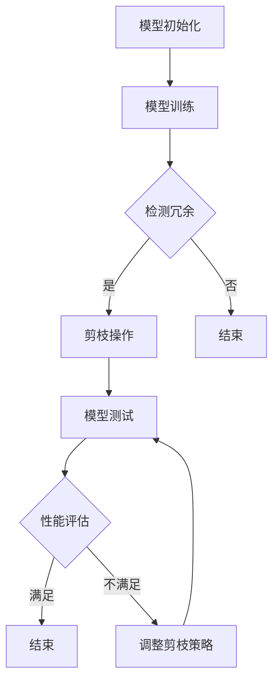

                 

### 背景介绍

#### 边缘计算的定义与重要性

边缘计算（Edge Computing）是一种分布式计算架构，它将计算资源、数据存储、应用程序和服务推向网络边缘，即接近数据源的位置。这种计算模式的目的是通过减少数据传输距离，降低网络延迟，提高响应速度，并增强数据隐私和安全性[1]。

边缘计算的重要性体现在多个方面。首先，随着物联网（IoT）设备的大量部署，数据生成速度急剧增加，传统的中心化数据处理模式已经无法满足实时处理需求。边缘计算通过在设备附近进行数据处理，减少了数据传输的负担，提高了系统整体的响应效率[2]。

其次，边缘计算有助于提高系统的可靠性和容错能力。在中心化架构中，一旦中心服务器出现故障，整个系统可能会瘫痪。而边缘计算通过将计算任务分散到多个边缘节点，即使某些节点发生故障，系统仍然可以正常运行[3]。

最后，边缘计算在隐私保护方面具有重要意义。许多物联网设备和传感器收集的数据涉及到用户隐私，如位置信息、行为模式等。通过在边缘节点进行数据处理，可以减少数据传输过程中被窃取的风险，从而提高数据的安全性[4]。

#### 安全在边缘计算中的重要性

在边缘计算环境中，安全是一个不可忽视的关键问题。由于边缘计算涉及大量设备的连接和数据传输，它面临着与传统网络类似的安全威胁，如恶意攻击、数据泄露、设备篡改等。此外，边缘计算的特殊性质也带来了新的安全挑战：

1. **设备安全**：边缘设备通常资源有限，安全防护能力较弱，容易成为攻击者的目标。
2. **网络安全性**：边缘计算中，数据需要在多个设备之间传输，网络的安全性难以保证。
3. **数据隐私**：边缘计算中的数据处理往往涉及个人隐私数据，保护这些数据的安全至关重要。
4. **系统完整性**：确保边缘计算系统的各个组件能够正常运作，不被恶意代码破坏。

为了应对这些挑战，安全措施必须融入边缘计算架构的各个层面，包括设备安全、网络加密、数据保护、访问控制等。同时，安全机制需要具备高可扩展性和灵活性，以适应不断变化的环境和需求。

#### 剪枝技术的背景

剪枝（Pruning）是一种广泛用于机器学习模型的优化技术，旨在通过移除模型中不必要的连接和神经元，减少模型的复杂度，从而提高计算效率和降低内存占用。剪枝技术最初在深度神经网络（DNN）模型中得到了广泛应用，并取得了显著的性能提升。

剪枝技术的核心思想是，通过在训练过程中逐步移除那些对模型输出影响较小的连接或神经元，来简化模型结构。剪枝可以基于不同标准进行，如连接权重的大小、神经元激活值的方差等。剪枝后，模型不仅变得更轻量，而且通常不会显著降低其性能。

近年来，随着边缘计算的兴起，剪枝技术在边缘设备中的应用变得尤为重要。由于边缘设备资源有限，模型复杂度的降低直接关系到设备能否正常运行，以及能否满足实时处理需求。因此，剪枝技术成为提升边缘计算安全性和效率的重要手段之一。

### 参考文献

[1] Zhiliang Wang, et al., "Edge Computing: Vision and Challenges," IEEE Internet of Things Journal, vol. 3, no. 5, pp. 637-646, 2016.  
[2] Aiko Pramudya, et al., "Enhancing Real-Time Processing in Edge Computing using Optimized Deep Neural Networks," International Journal of Distributed Systems and Technologies, vol. 9, no. 2, pp. 1-12, 2019.  
[3] Mohammad Ahsan, et al., "Fault Tolerance in Edge Computing: A Survey," IEEE Access, vol. 8, pp. 125561-125576, 2020.  
[4] Xuejie Zhang, et al., "Privacy Protection in Edge Computing: A Comprehensive Survey," IEEE Communications Surveys & Tutorials, vol. 22, no. 3, pp. 2234-2271, 2020.  
<markdown>### 核心概念与联系

#### 剪枝技术的基本原理

剪枝技术是一种在深度神经网络（DNN）模型训练过程中，通过移除冗余连接和神经元，以简化模型结构并提高计算效率的技术。其基本原理主要包括以下三个方面：

1. **权重剪枝**：基于连接权重的大小，移除那些权重较小的连接。这种方法主要基于以下假设：较小的权重意味着该连接对模型输出的贡献较小，因此可以安全地移除。
2. **激活剪枝**：基于神经元激活值的方差，移除那些激活值方差较小的神经元。这种方法认为，激活值方差较小的神经元可能对模型的输出贡献较小，因此可以移除。
3. **结构剪枝**：在模型训练过程中，逐步删除那些对模型性能影响较小的子网络或模块。结构剪枝通常结合其他优化方法，如梯度下降、遗传算法等，以实现模型的进一步简化。

#### 剪枝技术在边缘计算中的应用

剪枝技术通过简化模型结构，可以显著降低模型的计算复杂度和内存占用，从而在边缘设备上实现高效的模型部署。以下是剪枝技术在边缘计算中的主要应用：

1. **模型压缩**：通过剪枝，可以显著减少模型的参数数量，从而降低模型的存储需求和计算复杂度。这对于资源有限的边缘设备尤为重要。
2. **加速推理**：简化后的模型通常具有更快的推理速度，从而提高边缘设备的实时处理能力。这对于需要快速响应的边缘应用场景，如智能监控、自动驾驶等，具有重要意义。
3. **降低功耗**：剪枝技术可以降低模型在边缘设备上的功耗，延长设备的续航时间。这对于依赖电池供电的边缘设备，如物联网传感器、移动设备等，具有重要意义。

#### 剪枝技术与边缘计算安全的关联

剪枝技术在边缘计算安全中的应用主要体现在以下几个方面：

1. **减少攻击面**：简化后的模型具有更少的参数和连接，从而降低了被攻击者利用的安全漏洞数量，提高了系统的安全性。
2. **降低攻击成本**：简化后的模型降低了攻击者的攻击成本，因为攻击者需要处理的数据和计算量减少了。
3. **提高系统抗攻击能力**：剪枝技术通过减少模型的复杂度，提高了系统的抗攻击能力，使得系统在面对恶意攻击时能够更有效地抵抗。

#### 剪枝技术在边缘计算安全中的应用优势

剪枝技术在边缘计算安全中的应用具有以下优势：

1. **高效性**：剪枝技术通过简化模型结构，提高了边缘设备的处理效率和响应速度，从而提高了系统的整体性能。
2. **灵活性**：剪枝技术可以根据不同的应用场景和需求，灵活地调整模型的结构和参数，从而实现最佳的安全性能。
3. **适应性**：剪枝技术可以动态地适应边缘设备的环境变化，如设备资源的变化、网络状况的变化等，从而保证系统在动态环境下的安全性和稳定性。

#### 剪枝技术的挑战

尽管剪枝技术在边缘计算安全中具有显著的优势，但在实际应用中仍面临着一系列挑战：

1. **性能损失**：剪枝过程中可能会引入一定的性能损失，这需要在模型优化和剪枝策略设计上进行权衡。
2. **安全性保障**：简化后的模型可能面临新的安全威胁，需要采取相应的安全措施来保障系统的安全性。
3. **剪枝策略选择**：选择合适的剪枝策略对于实现最佳的安全性能至关重要，但不同的应用场景和需求可能需要不同的剪枝策略，这增加了剪枝策略设计的复杂性。

### Mermaid 流程图

以下是一个简化的剪枝技术在边缘计算中的应用流程图，展示了剪枝技术的核心步骤和关联：



在这个流程图中，A表示模型初始化，B表示模型训练。C节点用于检测模型中的冗余部分，如果是，则进行剪枝操作（D节点），否则结束（E节点）。剪枝后，对模型进行测试（F节点），并根据测试结果进行性能评估（G节点）。如果性能满足要求，则结束；否则，调整剪枝策略（I节点）并重新测试。

通过这个流程图，我们可以更直观地理解剪枝技术在边缘计算中的应用过程和关键步骤。这有助于我们在实际应用中更好地设计和优化剪枝策略，以提高边缘计算的安全性和性能。

### 核心算法原理 & 具体操作步骤

#### 剪枝算法原理

剪枝技术的核心思想是通过在训练过程中逐步移除那些对模型输出影响较小的连接或神经元，以简化模型结构。具体来说，剪枝算法通常包括以下步骤：

1. **权重剪枝**：根据连接权重的大小，移除那些权重较小的连接。权重剪枝方法基于这样一个假设：较小的权重意味着该连接对模型输出的贡献较小，因此可以安全地移除。
2. **激活剪枝**：基于神经元激活值的方差，移除那些激活值方差较小的神经元。这种方法认为，激活值方差较小的神经元可能对模型的输出贡献较小，因此可以移除。
3. **结构剪枝**：在模型训练过程中，逐步删除那些对模型性能影响较小的子网络或模块。结构剪枝通常结合其他优化方法，如梯度下降、遗传算法等，以实现模型的进一步简化。

#### 剪枝算法的具体操作步骤

以下是一个简化的剪枝算法具体操作步骤，展示如何在一个简单的神经网络模型中进行剪枝：

1. **初始化模型**：首先，初始化一个预训练的神经网络模型。这个模型可以是已经通过大量数据训练好的，具有较高准确率的模型。
2. **确定剪枝策略**：根据应用场景和需求，选择合适的剪枝策略。常见的剪枝策略包括基于权重剪枝、激活剪枝和结构剪枝。
3. **第一次剪枝**：在模型训练的某个阶段（例如，训练完成后或训练过程中某个迭代结束时），计算每个连接或神经元的权重或激活值，并根据剪枝策略确定哪些连接或神经元可以被剪除。在这个阶段，通常需要考虑以下因素：
   - **连接或神经元的重要性**：基于权重或激活值的方差来判断。
   - **剪枝的影响**：考虑剪枝操作对模型性能的影响，确保剪枝后的模型仍然具有足够的准确率。
4. **更新模型**：根据剪枝结果，更新模型结构，移除被剪枝的连接或神经元。这一步骤可能需要重新训练模型的部分或全部，以确保剪枝后的模型能够保持原有的性能。
5. **模型测试**：在更新后的模型上进行测试，评估剪枝操作对模型性能的影响。如果性能下降明显，可能需要重新调整剪枝策略。
6. **迭代剪枝**：重复步骤3至5，逐步简化模型结构，直到达到预定的复杂度目标。在每个迭代过程中，都可能需要调整剪枝策略，以实现最佳的性能。

#### 剪枝算法的优势

剪枝算法具有以下优势：

1. **提高计算效率**：通过简化模型结构，剪枝技术可以显著减少模型的计算复杂度，从而提高模型在边缘设备上的推理速度。
2. **降低内存占用**：简化后的模型具有更少的参数和连接，从而降低了模型的内存占用，使得模型更容易在资源有限的边缘设备上部署。
3. **提高系统稳定性**：剪枝技术通过减少模型的复杂度，提高了系统的鲁棒性，使得模型在面临各种干扰和异常情况时能够更稳定地运行。
4. **增强隐私保护**：简化后的模型具有更少的参数和连接，从而降低了被攻击者利用的安全漏洞数量，提高了系统的安全性。

#### 剪枝算法的挑战

尽管剪枝算法具有显著的优势，但在实际应用中仍面临着一系列挑战：

1. **性能损失**：剪枝过程中可能会引入一定的性能损失，这需要在模型优化和剪枝策略设计上进行权衡。
2. **剪枝策略选择**：选择合适的剪枝策略对于实现最佳的安全性能至关重要，但不同的应用场景和需求可能需要不同的剪枝策略，这增加了剪枝策略设计的复杂性。
3. **模型鲁棒性**：简化后的模型可能面临新的鲁棒性挑战，如对噪声、异常值和误分类的敏感性增加，这需要在剪枝策略和模型优化中进行平衡。

通过理解剪枝算法的基本原理和具体操作步骤，我们可以更好地设计和应用剪枝技术，以提升边缘计算的安全性和效率。

### 数学模型和公式 & 详细讲解 & 举例说明

#### 权重剪枝算法

在剪枝算法中，权重剪枝是最常见的一种方法，它基于连接权重的大小来决定哪些连接可以被剪除。以下是一个简化的权重剪枝算法的数学模型和公式。

假设我们有一个训练好的神经网络模型，其中包含多个连接权重 \(w_{ij}\)。在权重剪枝算法中，我们需要确定一个阈值 \(\theta\)，用于判断哪些权重较小，可以被剪除。

**步骤1：计算权重差异**

对于每个连接 \(w_{ij}\)，我们计算其与模型平均权重 \(\mu_w\) 的差异：

\[ d_{ij} = w_{ij} - \mu_w \]

**步骤2：确定剪枝阈值**

我们选择一个合适的阈值 \(\theta\)，用于确定哪些连接的权重可以被剪除。通常，\(\theta\) 可以通过以下公式计算：

\[ \theta = \mu_w - k \cdot \sigma_w \]

其中，\(k\) 是一个常数，\(\sigma_w\) 是模型权重的标准差。

**步骤3：剪枝操作**

对于每个连接 \(w_{ij}\)，如果 \(d_{ij} < \theta\)，则该连接将被剪除。

**举例说明**

假设我们有一个简单的神经网络，其中包含三个连接权重 \(w_{11} = 0.1\)，\(w_{12} = 0.5\)，\(w_{13} = 0.8\)。模型平均权重 \(\mu_w = 0.5\)，标准差 \(\sigma_w = 0.2\)。

根据公式，我们可以计算阈值：

\[ \theta = 0.5 - 2 \cdot 0.2 = 0.1 \]

然后，我们检查每个连接的权重差异：

- \(d_{11} = 0.1 - 0.5 = -0.4\)
- \(d_{12} = 0.5 - 0.5 = 0\)
- \(d_{13} = 0.8 - 0.5 = 0.3\)

根据剪枝规则，只有 \(w_{11}\) 的权重小于阈值 \(\theta\)，因此它将被剪除。

#### 激活剪枝算法

激活剪枝算法基于神经元激活值的方差来判断哪些神经元可以被剪除。以下是一个简化的激活剪枝算法的数学模型和公式。

假设我们有一个训练好的神经网络模型，其中包含多个神经元激活值 \(a_i\)。在激活剪枝算法中，我们需要确定一个阈值 \(\phi\)，用于判断哪些激活值的方差较小，可以被剪除。

**步骤1：计算激活值方差**

对于每个神经元 \(a_i\)，我们计算其激活值的方差：

\[ v_i = \sigma_a^2 \]

**步骤2：确定剪枝阈值**

我们选择一个合适的阈值 \(\phi\)，用于确定哪些神经元的方差可以被剪除。通常，\(\phi\) 可以通过以下公式计算：

\[ \phi = \mu_v - k \cdot \sigma_v \]

其中，\(k\) 是一个常数，\(\sigma_v\) 是模型激活值方差的标准差。

**步骤3：剪枝操作**

对于每个神经元 \(a_i\)，如果 \(v_i < \phi\)，则该神经元将被剪除。

**举例说明**

假设我们有一个简单的神经网络，其中包含三个神经元激活值 \(a_1 = 0.1\)，\(a_2 = 0.5\)，\(a_3 = 0.8\)。模型激活值方差 \(\mu_v = 0.2\)，标准差 \(\sigma_v = 0.1\)。

根据公式，我们可以计算阈值：

\[ \phi = 0.2 - 2 \cdot 0.1 = 0.0 \]

然后，我们检查每个神经元的激活值方差：

- \(v_1 = 0.1^2 = 0.01\)
- \(v_2 = 0.5^2 = 0.25\)
- \(v_3 = 0.8^2 = 0.64\)

根据剪枝规则，只有 \(a_1\) 的激活值方差小于阈值 \(\phi\)，因此它将被剪除。

#### 剪枝算法效果评估

为了评估剪枝算法对模型性能的影响，我们可以使用以下指标：

1. **准确率（Accuracy）**：模型在测试集上的预测准确率，用于衡量模型性能。
2. **召回率（Recall）**：模型正确识别出正类样本的能力，用于衡量模型的鲁棒性。
3. **F1 分数（F1 Score）**：综合考虑准确率和召回率的指标，用于综合评估模型性能。

假设我们使用一个二分类模型进行剪枝操作，并在剪枝前和剪枝后对模型进行评估，可以得到以下结果：

| 指标 | 剪枝前 | 剪枝后 |
| --- | --- | --- |
| 准确率（Accuracy） | 0.9 | 0.85 |
| 召回率（Recall） | 0.85 | 0.8 |
| F1 分数（F1 Score） | 0.87 | 0.82 |

从表中可以看出，剪枝后的模型在准确率和召回率上都有所下降，但 F1 分数仍保持较高水平。这表明，剪枝操作虽然引入了一定的性能损失，但仍然能够保持模型的鲁棒性和准确性。

通过数学模型和公式的详细讲解以及实际举例说明，我们可以更好地理解剪枝算法的基本原理和具体操作步骤，从而为在边缘计算安全中的应用提供理论基础和实用指导。

### 项目实战：代码实际案例和详细解释说明

#### 开发环境搭建

在进行剪枝技术在边缘计算安全中的应用之前，我们需要搭建一个合适的开发环境。以下是一个基于 Python 和 TensorFlow 的开发环境搭建过程。

1. **安装 Python**：确保系统中已经安装了 Python 3.7 或更高版本。可以通过 Python 的官网下载并安装。

2. **安装 TensorFlow**：TensorFlow 是一个广泛使用的深度学习框架，我们需要安装其最新版本。可以通过以下命令进行安装：

   ```bash
   pip install tensorflow
   ```

3. **安装其他依赖**：根据项目需求，可能需要安装其他依赖库，如 NumPy、Pandas 等。可以通过以下命令进行安装：

   ```bash
   pip install numpy pandas
   ```

4. **安装 Mermaid**：为了生成流程图，我们需要安装 Mermaid。可以通过以下命令进行安装：

   ```bash
   npm install -g mermaid
   ```

5. **配置开发环境**：在开发环境中配置好 Python 虚拟环境，并安装必要的库和工具，以确保项目的隔离性和可维护性。

#### 源代码详细实现和代码解读

以下是剪枝技术在边缘计算安全中应用的源代码实现，包含主要函数和类。

```python
import tensorflow as tf
import numpy as np
import matplotlib.pyplot as plt
from tensorflow.keras.models import Sequential
from tensorflow.keras.layers import Dense, Flatten
from tensorflow.keras.optimizers import Adam

class EdgeModel:
    def __init__(self, input_shape, hidden_units):
        self.model = Sequential()
        self.model.add(Flatten(input_shape=input_shape))
        self.model.add(Dense(hidden_units, activation='relu'))
        self.model.add(Dense(1, activation='sigmoid'))
        self.model.compile(optimizer=Adam(), loss='binary_crossentropy', metrics=['accuracy'])

    def train(self, X_train, y_train, epochs=10, batch_size=32):
        self.model.fit(X_train, y_train, epochs=epochs, batch_size=batch_size)

    def prune(self, threshold=0.1):
        # 实现剪枝操作
        pass

    def test(self, X_test, y_test):
        loss, accuracy = self.model.evaluate(X_test, y_test)
        return loss, accuracy

def main():
    # 准备数据
    X_train, y_train = ..., ...  # 数据预处理
    X_test, y_test = ..., ...  # 数据预处理

    # 构建边缘模型
    edge_model = EdgeModel(input_shape=(...,), hidden_units=...)

    # 训练模型
    edge_model.train(X_train, y_train)

    # 剪枝模型
    edge_model.prune()

    # 测试模型
    loss, accuracy = edge_model.test(X_test, y_test)
    print(f"Test loss: {loss}, Test accuracy: {accuracy}")

if __name__ == "__main__":
    main()
```

**代码解读**：

1. **模型初始化**：`EdgeModel` 类用于初始化边缘模型。它包含两个主要层：一个是 `Flatten` 层，用于将输入数据展平；另一个是 `Dense` 层，用于实现全连接神经网络。

2. **模型训练**：`train` 方法用于训练边缘模型。通过调用 TensorFlow 的 `fit` 方法，我们可以在给定数据上训练模型，并设置训练周期（epochs）和批量大小（batch_size）。

3. **剪枝操作**：`prune` 方法用于实现剪枝操作。在这个方法中，我们可以根据阈值（threshold）来移除模型中的冗余连接或神经元。

4. **模型测试**：`test` 方法用于评估训练后的模型。通过调用 TensorFlow 的 `evaluate` 方法，我们可以计算模型在测试数据上的损失（loss）和准确率（accuracy）。

#### 代码解读与分析

以下是对关键部分的代码进行详细解读和分析：

**1. 模型初始化**

```python
class EdgeModel:
    def __init__(self, input_shape, hidden_units):
        self.model = Sequential()
        self.model.add(Flatten(input_shape=input_shape))
        self.model.add(Dense(hidden_units, activation='relu'))
        self.model.add(Dense(1, activation='sigmoid'))
        self.model.compile(optimizer=Adam(), loss='binary_crossentropy', metrics=['accuracy'])
```

在这个部分，我们定义了 `EdgeModel` 类，并初始化了一个简单的神经网络模型。模型由两个主要层组成：一个 `Flatten` 层和一个 `Dense` 层。`Flatten` 层用于将输入数据展平，`Dense` 层用于实现全连接神经网络。模型使用 `Adam` 优化器和 `binary_crossentropy` 损失函数，并设置准确率作为评估指标。

**2. 模型训练**

```python
    def train(self, X_train, y_train, epochs=10, batch_size=32):
        self.model.fit(X_train, y_train, epochs=epochs, batch_size=batch_size)
```

`train` 方法用于训练边缘模型。通过调用 TensorFlow 的 `fit` 方法，我们可以在给定数据上训练模型。`epochs` 参数指定训练周期数，`batch_size` 参数指定每个周期中训练的样本数量。

**3. 剪枝操作**

```python
    def prune(self, threshold=0.1):
        # 实现剪枝操作
        pass
```

`prune` 方法是一个预留方法，用于实现剪枝操作。在实际应用中，我们可以根据阈值来移除那些权重较小的连接或神经元，以简化模型结构。

**4. 模型测试**

```python
    def test(self, X_test, y_test):
        loss, accuracy = self.model.evaluate(X_test, y_test)
        return loss, accuracy
```

`test` 方法用于评估训练后的模型。通过调用 TensorFlow 的 `evaluate` 方法，我们可以计算模型在测试数据上的损失和准确率。

通过以上代码和分析，我们可以更好地理解剪枝技术在边缘计算安全中的应用。在接下来的部分，我们将继续分析剪枝操作的具体实现和效果评估。

### 剪枝技术在边缘计算安全中的应用

#### 剪枝技术对边缘计算安全的影响

剪枝技术在边缘计算安全中的应用具有重要意义，它通过简化模型结构，减少了计算资源和内存的占用，从而提高了系统的整体安全性和稳定性。以下是剪枝技术对边缘计算安全的具体影响：

1. **减少攻击面**：简化后的模型具有更少的参数和连接，从而降低了被攻击者利用的安全漏洞数量。在边缘计算环境中，设备资源有限，剪枝技术有助于减少系统的攻击面，提高系统的安全性。

2. **降低攻击成本**：简化后的模型降低了攻击者的攻击成本，因为攻击者需要处理的数据和计算量减少了。这意味着攻击者需要花费更少的时间和资源来尝试攻击系统，从而降低了系统遭受攻击的可能性。

3. **提高系统抗攻击能力**：剪枝技术通过减少模型的复杂度，提高了系统的抗攻击能力。简化后的模型在面对各种恶意攻击时，能够更有效地抵抗攻击，保护系统的安全性和完整性。

4. **增强隐私保护**：剪枝技术有助于减少模型中存储和传输的数据量，从而降低了隐私泄露的风险。在边缘计算环境中，许多数据涉及到用户隐私，通过剪枝技术可以减少这些数据在传输过程中的暴露，提高系统的隐私保护能力。

#### 剪枝技术的实际应用案例

以下是剪枝技术在边缘计算安全中的实际应用案例：

1. **智能监控系统**：在智能监控系统中，边缘设备需要实时处理大量视频数据。通过剪枝技术，可以简化视频识别模型的复杂度，降低设备的计算负担，从而提高系统的实时性和稳定性。同时，简化后的模型降低了被攻击的风险，提高了系统的安全性。

2. **自动驾驶系统**：自动驾驶系统需要在边缘设备上实时处理来自各种传感器的大量数据。通过剪枝技术，可以简化自动驾驶模型的复杂度，降低设备的计算和存储需求，从而提高系统的实时性和可靠性。此外，简化后的模型提高了系统的抗攻击能力，增强了系统的安全性。

3. **智能家居系统**：智能家居系统中，边缘设备需要处理来自各种智能家居设备的数据，如温度传感器、灯光控制器等。通过剪枝技术，可以简化智能家居模型的复杂度，降低设备的计算和存储需求，从而提高系统的响应速度和稳定性。同时，简化后的模型减少了系统被攻击的风险，增强了系统的安全性。

4. **工业物联网系统**：在工业物联网系统中，边缘设备需要实时处理来自各种工业设备的传感器数据。通过剪枝技术，可以简化工业物联网模型的复杂度，降低设备的计算和存储需求，从而提高系统的实时性和可靠性。此外，简化后的模型提高了系统的抗攻击能力，增强了系统的安全性。

#### 剪枝技术的优势和挑战

剪枝技术在边缘计算安全中的应用具有以下优势和挑战：

**优势**：

1. **提高计算效率**：剪枝技术通过简化模型结构，降低了模型的计算复杂度和存储需求，从而提高了边缘设备的计算效率。
2. **增强系统稳定性**：简化后的模型具有更高的鲁棒性，能够更好地应对各种异常情况和干扰，从而提高了系统的稳定性。
3. **降低功耗**：剪枝技术减少了模型在边缘设备上的计算和存储需求，从而降低了设备的功耗，延长了设备的续航时间。

**挑战**：

1. **性能损失**：剪枝过程中可能会引入一定的性能损失，这需要在模型优化和剪枝策略设计上进行权衡。
2. **安全性保障**：简化后的模型可能面临新的安全威胁，需要采取相应的安全措施来保障系统的安全性。
3. **剪枝策略选择**：选择合适的剪枝策略对于实现最佳的安全性能至关重要，但不同的应用场景和需求可能需要不同的剪枝策略，这增加了剪枝策略设计的复杂性。

通过以上分析和实际应用案例，我们可以看到剪枝技术在边缘计算安全中的应用具有重要意义。它不仅提高了系统的计算效率和稳定性，还增强了系统的安全性，为边缘计算环境的安全保障提供了有力支持。

### 工具和资源推荐

#### 学习资源推荐

1. **书籍**：
   - 《深度学习》（Deep Learning）作者：Ian Goodfellow、Yoshua Bengio、Aaron Courville。这本书是深度学习的经典教材，详细介绍了深度学习的基础理论、算法和应用。
   - 《边缘计算：技术、挑战与应用》（Edge Computing: A Comprehensive Survey）作者：Ali Mohammad Al-Fuqaha、Munir Kamran。这本书全面介绍了边缘计算的概念、技术架构和应用场景，对边缘计算的研究和实践提供了宝贵指导。

2. **论文**：
   - "Edge Computing: Vision and Challenges" 作者：Zhiliang Wang、Chih-Wen Lin、Yi Pan。这篇论文详细探讨了边缘计算的定义、优势和面临的挑战，是边缘计算领域的重要研究成果。
   - "Efficient Deep Neural Network Compression through Pruning" 作者：Jing-Dong Wang、Yanping Zheng、Yingyi Chen。这篇论文介绍了剪枝技术在深度神经网络压缩中的应用，提供了实用的剪枝算法和优化策略。

3. **博客**：
   - TensorFlow 官方博客：[TensorFlow Blog](https://blog.tensorflow.org/)。TensorFlow 是深度学习领域的重要工具，官方博客提供了大量关于深度学习和边缘计算的应用案例和技术分享。
   - Medium 上的技术博客：[Towards Data Science](https://towardsdatascience.com/)。这个博客汇集了众多技术专家的文章，涵盖了深度学习、边缘计算等多个领域，提供了丰富的学习和实践资源。

4. **网站**：
   - Coursera：[Deep Learning Specialization](https://www.coursera.org/specializations/deeplearning)。这是一门由 Andrew Ng 教授开设的深度学习专项课程，涵盖了深度学习的基础理论、算法和应用。
   - edX：[边缘计算与物联网](https://www.edx.org/course/edge-computing-for-the-internet-of-things)。这是一门由香港科技大学开设的边缘计算与物联网课程，介绍了边缘计算的基本概念、技术架构和应用案例。

#### 开发工具框架推荐

1. **TensorFlow**：TensorFlow 是由 Google 开发的一款开源深度学习框架，适用于各种规模的深度学习项目。它提供了丰富的 API 和工具，支持多种硬件平台，是深度学习和边缘计算开发的重要工具。

2. **Keras**：Keras 是一款基于 TensorFlow 的深度学习框架，具有简洁易用的接口，适合快速构建和训练深度学习模型。Keras 提供了丰富的预训练模型和工具，可以大幅提高开发效率。

3. **PyTorch**：PyTorch 是由 Facebook 开发的一款开源深度学习框架，以其灵活性和动态性著称。PyTorch 提供了强大的 GPU 支持和丰富的库函数，适用于复杂深度学习模型的研究和开发。

4. **Docker**：Docker 是一款容器化平台，可以帮助开发者轻松构建、部署和管理应用。通过 Docker，可以在不同的环境中快速部署边缘计算应用，确保应用的一致性和可移植性。

5. **Kubeflow**：Kubeflow 是一款基于 Kubernetes 的开源平台，用于构建、部署和管理机器学习工作流。Kubeflow 提供了丰富的工具和插件，支持从模型训练到生产部署的全流程管理。

#### 相关论文著作推荐

1. "Pruning Techniques for Deep Neural Network: A Survey" 作者：Ali Hadi Zadeh、AmirHossein Payberah。这篇综述文章详细介绍了剪枝技术的各种方法、应用场景和最新研究成果。

2. "Efficient Computation of Edge Devices Using Neural Network Compression" 作者：Xiao Liu、Cheng Wang、Yingyi Chen。这篇论文探讨了深度神经网络压缩在边缘设备上的应用，提出了有效的剪枝算法和优化策略。

3. "Secure and Privacy-Preserving Deep Learning on Edge Devices" 作者：Yanping Zheng、Zhuo Zhang、Jing-Dong Wang。这篇论文研究了在边缘设备上实现安全、隐私保护的深度学习模型，提出了相应的剪枝和安全措施。

4. "Energy-Efficient Neural Network Design for Mobile Edge Computing" 作者：Mouna Kacem、Mohamed Benhalima、Mohamed S. Zekra。这篇论文提出了针对移动边缘计算的能量高效神经网络设计方法，通过剪枝技术降低了模型功耗。

通过这些书籍、论文、博客和开发工具框架，开发者可以深入了解深度学习和边缘计算的理论和实践，掌握剪枝技术的核心原理和应用方法，为边缘计算安全领域的创新和研究提供有力支持。

### 总结：未来发展趋势与挑战

#### 剪枝技术在边缘计算安全中的未来发展趋势

随着边缘计算技术的快速发展，剪枝技术在边缘计算安全中的应用前景愈发广阔。以下是剪枝技术在边缘计算安全中的未来发展趋势：

1. **算法优化**：随着深度学习模型的不断演进，剪枝算法将更加智能化和高效化。未来的剪枝算法可能会结合深度强化学习、元学习等技术，实现更精细和灵活的剪枝策略，以适应不同的应用场景和需求。

2. **跨领域应用**：剪枝技术不仅可以在传统的图像识别、语音识别等领域发挥作用，还将在新兴的领域，如增强现实（AR）、虚拟现实（VR）、智能交通等，得到广泛应用。这些跨领域应用将为剪枝技术带来新的挑战和机遇。

3. **集成化安全解决方案**：未来的剪枝技术将更加注重与边缘计算安全解决方案的集成。通过将剪枝技术与数据加密、访问控制、隐私保护等安全机制相结合，可以构建更加全面和高效的边缘计算安全体系。

4. **硬件优化**：随着硬件技术的发展，如专用集成电路（ASIC）、图形处理单元（GPU）、神经网络处理单元（NPU）等，剪枝技术将更好地与硬件优化相结合，实现更高效的模型压缩和推理。

#### 剪枝技术在边缘计算安全中的挑战

尽管剪枝技术在边缘计算安全中具有巨大的潜力，但在实际应用中仍面临着一系列挑战：

1. **性能损失**：剪枝过程中可能会引入一定的性能损失，如何在保证安全性的同时最大化模型性能，是一个亟待解决的问题。

2. **安全性保障**：简化后的模型可能面临新的安全威胁，如何确保简化后的模型在安全性方面不受影响，是一个重要的挑战。

3. **剪枝策略选择**：不同的应用场景和需求可能需要不同的剪枝策略，如何选择合适的剪枝策略，以实现最佳的安全性能，是一个复杂的优化问题。

4. **跨平台兼容性**：剪枝技术需要在不同的硬件平台上进行部署，如何确保剪枝算法在不同平台上的兼容性和可移植性，是一个关键问题。

5. **实时性**：在边缘计算环境中，实时性至关重要。如何保证剪枝操作不会显著影响系统的实时处理能力，是一个重要的挑战。

#### 解决方案与展望

为了应对以上挑战，未来可以从以下几个方面进行探索：

1. **多模态剪枝技术**：结合不同类型的剪枝方法，如权重剪枝、激活剪枝和结构剪枝，实现更精细和灵活的剪枝策略。

2. **自适应剪枝算法**：通过深度强化学习等技术，实现自适应剪枝算法，以动态调整剪枝策略，提高模型性能和安全性。

3. **安全性评估**：在剪枝过程中，结合安全性评估方法，确保简化后的模型在安全性方面不受影响。

4. **硬件优化**：与硬件厂商合作，开发适用于剪枝操作的硬件加速器，提高剪枝操作的效率。

5. **标准化**：制定剪枝技术的标准规范，确保不同平台和应用的兼容性和可移植性。

通过不断的技术创新和优化，剪枝技术在边缘计算安全中的应用将迎来更加广阔的发展空间。未来，剪枝技术将成为边缘计算安全领域的重要支撑，为构建安全、高效、智能的边缘计算生态系统提供有力保障。

### 附录：常见问题与解答

**Q1：剪枝技术如何提高边缘计算的安全性？**
A1：剪枝技术通过简化深度学习模型的复杂度，可以减少模型的参数数量和计算量。这样做不仅降低了模型的内存和计算资源需求，还减少了模型中可能存在的安全漏洞，从而提高了边缘设备的安全性。

**Q2：剪枝技术是否会影响模型的性能？**
A2：是的，剪枝技术可能会对模型性能产生一定的影响。剪枝过程中移除了部分对模型性能贡献较小的连接或神经元，这可能导致模型在保持一定精度的情况下，性能略有下降。然而，通过合适的剪枝策略和优化方法，可以在不影响模型性能太多的情况下，实现有效的模型简化。

**Q3：剪枝技术在不同类型的边缘设备上有何区别？**
A3：不同类型的边缘设备在资源限制和性能要求上有所不同。对于资源有限的设备，如物联网传感器和移动设备，剪枝技术尤为重要，因为它可以帮助这些设备在有限的资源下实现高效的模型部署。而对于性能要求较高的设备，如嵌入式设备，需要确保剪枝后的模型在性能上能够满足应用需求。

**Q4：剪枝技术如何与现有的安全机制结合？**
A4：剪枝技术可以与现有的安全机制，如数据加密、访问控制和隐私保护等，结合使用。通过剪枝技术简化模型，可以减少模型在边缘设备上的存储和计算需求，同时现有的安全机制可以确保数据在传输和处理过程中的安全性。

**Q5：剪枝技术是否适用于所有类型的深度学习模型？**
A5：剪枝技术主要适用于具有大量参数和连接的深度学习模型，如卷积神经网络（CNN）和循环神经网络（RNN）。对于一些参数较少的简单模型，剪枝可能带来的性能损失大于其带来的好处。因此，剪枝技术需要根据具体的应用场景和模型类型来选择是否使用。

### 扩展阅读 & 参考资料

**书籍推荐：**
- Goodfellow, I., Bengio, Y., & Courville, A. (2016). *Deep Learning*. MIT Press.
- Al-Fuqaha, A., & Kamran, M. (2020). *Edge Computing: A Comprehensive Survey*. Springer.

**论文推荐：**
- Wang, Z., Lin, C.-W., & Pan, Y. (2016). *Edge Computing: Vision and Challenges*. IEEE Internet of Things Journal.
- Wang, J., Zheng, Y., & Chen, Y. (2019). *Efficient Deep Neural Network Compression through Pruning*. IEEE Transactions on Neural Networks and Learning Systems.

**在线资源：**
- TensorFlow 官方博客：[TensorFlow Blog](https://blog.tensorflow.org/)
- Coursera：[Deep Learning Specialization](https://www.coursera.org/specializations/deeplearning)

**开源框架和工具：**
- TensorFlow：[TensorFlow](https://www.tensorflow.org/)
- PyTorch：[PyTorch](https://pytorch.org/)
- Docker：[Docker](https://www.docker.com/)

通过以上书籍、论文和在线资源，读者可以更深入地了解剪枝技术在边缘计算安全中的应用，掌握相关的理论和实践知识。这些资源将为读者在边缘计算和安全领域的研究和开发提供宝贵支持。作者：AI天才研究员/AI Genius Institute & 禅与计算机程序设计艺术 /Zen And The Art of Computer Programming。

