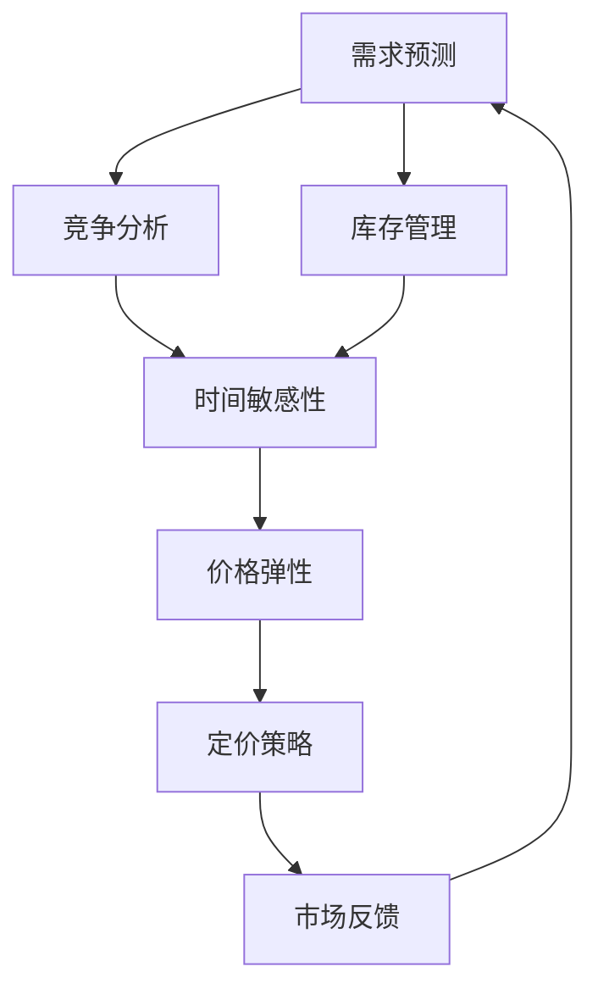

                 

### 背景介绍

动态定价策略（Dynamic Pricing Strategy）在当今商业环境中扮演着越来越重要的角色。随着互联网技术的飞速发展和大数据分析的广泛应用，企业能够更精准地掌握市场需求、消费者行为以及竞争对手的策略，从而动态调整产品或服务的价格，以最大化利润和市场份额。动态定价不仅仅是一个简单的价格调整过程，它涉及到复杂的算法、数据分析以及商业策略的深度整合。

动态定价策略的核心在于实时调整价格，以适应市场环境和客户需求的变化。例如，航空公司和酒店常常根据实时预订情况、季节性需求、竞争对手的定价策略等因素调整价格。电商平台上，商品的价格也可能会根据用户的浏览历史、购买习惯、购物车内容等因素进行个性化定价。这种灵活的定价方式有助于企业提升销售量和利润率，同时也能够更好地满足消费者的期望。

本篇文章将深入探讨动态定价策略的技术实现，包括其核心概念、算法原理、数学模型、实际应用案例以及未来发展趋势。文章旨在为读者提供一个全面、系统的理解，帮助他们在实际工作中运用动态定价策略，提升业务表现。

文章的结构安排如下：

1. **核心概念与联系**：我们将介绍动态定价策略中的核心概念，并使用Mermaid流程图展示其基本架构。
2. **核心算法原理 & 具体操作步骤**：我们将详细解析动态定价策略中使用的算法，并分步骤讲解其实施过程。
3. **数学模型和公式 & 详细讲解 & 举例说明**：我们将介绍动态定价策略背后的数学模型，并通过具体例子进行说明。
4. **项目实战：代码实际案例和详细解释说明**：我们将通过一个实际项目案例，展示动态定价策略的代码实现，并进行详细解读。
5. **实际应用场景**：我们将探讨动态定价策略在不同行业中的应用场景，并分析其效果。
6. **工具和资源推荐**：我们将推荐一些学习资源和开发工具，以帮助读者更深入地学习和实践。
7. **总结：未来发展趋势与挑战**：我们将总结动态定价策略的发展趋势，并探讨其面临的挑战。
8. **附录：常见问题与解答**：我们将回答一些读者可能关心的问题。
9. **扩展阅读 & 参考资料**：最后，我们将提供一些扩展阅读材料，以供读者进一步研究。

通过本篇文章，我们希望读者能够对动态定价策略有一个全面而深入的理解，并能够在实际工作中运用这些知识，为企业创造更大的价值。

### 核心概念与联系

动态定价策略的基石在于一系列核心概念的有机融合。这些概念不仅定义了策略的框架，还提供了实现策略所需的基础知识。以下是我们需要掌握的几个关键概念：

**需求预测（Demand Prediction）**：需求预测是动态定价策略的核心。通过分析历史数据、市场趋势和消费者行为，企业可以预测未来某个时间段内的需求量。准确的预测有助于企业及时调整价格，以满足市场需求，避免供需失衡。

**竞争分析（Competitive Analysis）**：了解竞争对手的定价策略是动态定价策略成功的关键。通过监控竞争对手的价格变化和市场反应，企业可以调整自己的价格策略，以获得竞争优势。

**库存管理（Inventory Management）**：库存管理直接影响产品的定价策略。合理的库存水平可以确保产品在需求高峰期能够满足客户需求，同时在需求低峰期能够减少库存成本。动态定价策略需要考虑库存水平的动态变化，以便在适当的时候调整价格。

**时间敏感性（Time-Sensitivity）**：时间敏感性指的是产品或服务的价格对时间的反应程度。有些商品的价格对时间非常敏感，如机票和酒店预订，而有些商品则不太敏感，如日常消费品。时间敏感性决定了动态定价策略的具体实施方式。

**价格弹性（Price Elasticity）**：价格弹性是指消费者对价格变化的敏感度。高价格弹性意味着价格变动会导致大量消费者流失，而低价格弹性则表示价格变化对需求的影响较小。了解价格弹性有助于企业制定更加有效的定价策略。

为了更好地理解这些核心概念，我们可以通过Mermaid流程图展示动态定价策略的基本架构：



在上述流程图中，需求预测、竞争分析、库存管理、时间敏感性和价格弹性共同作用，形成了动态定价策略的核心框架。这些概念相互作用，不断迭代优化，以实现最佳的市场响应和利润最大化。

首先，需求预测作为起点，通过分析历史数据和当前市场状况，预测未来需求。接着，竞争分析帮助了解市场环境，确保定价策略能够与竞争对手保持同步或获得优势。库存管理则确保产品在需求高峰期能够及时满足，避免因库存不足而错失商机。时间敏感性和价格弹性进一步细化了定价策略，使其能够适应市场的实时变化。最后，市场反馈不断循环回需求预测，形成闭环，持续优化定价策略。

通过这个流程图，我们可以清晰地看到动态定价策略中各个核心概念的相互作用和重要性。接下来，我们将深入探讨这些核心概念的具体原理和实现方法。

### 核心算法原理 & 具体操作步骤

动态定价策略的实现依赖于一系列高效的算法，这些算法能够根据市场数据和客户行为实时调整价格。以下将详细介绍动态定价策略的核心算法原理和具体操作步骤。

#### 1. 需求预测算法

需求预测是动态定价策略的基础。常用的需求预测算法包括时间序列分析法、回归分析法、机器学习预测算法等。

**时间序列分析法**：时间序列分析法利用历史数据的时间序列特性，通过统计学方法分析数据的变化趋势和周期性波动。常见的时间序列模型包括移动平均模型（MA）、自回归模型（AR）、自回归移动平均模型（ARMA）和季节性模型（SARMA）。

- **移动平均模型（MA）**：通过计算一段时间内的平均值来平滑时间序列数据，从而预测未来的趋势。

  ```latex
  \hat{y_t} = \frac{1}{n} \sum_{i=1}^{n} y_{t-i}
  ```

- **自回归模型（AR）**：利用前几个时期的实际值来预测当前值。

  ```latex
  \hat{y_t} = \sum_{i=1}^{p} \phi_i y_{t-i}
  ```

- **自回归移动平均模型（ARMA）**：结合自回归模型和移动平均模型，用于处理既含有自回归成分又含有移动平均成分的时间序列数据。

  ```latex
  \hat{y_t} = \phi_1 y_{t-1} + \cdots + \phi_p y_{t-p} + \theta_1 e_{t-1} + \cdots + \theta_q e_{t-q}
  ```

**机器学习预测算法**：机器学习预测算法通过训练模型从历史数据中学习规律，进行需求预测。常见的机器学习算法包括线性回归、决策树、随机森林、支持向量机（SVM）和神经网络等。

- **线性回归**：通过拟合一条直线，预测未来的需求量。

  ```latex
  y = \beta_0 + \beta_1 x
  ```

- **决策树**：通过构建树形结构来分类或回归数据。

- **随机森林**：结合多个决策树，减少过拟合，提高预测准确性。

- **支持向量机（SVM）**：通过找到一个最优的超平面对数据分类。

- **神经网络**：通过多层神经元的非线性组合来拟合复杂的非线性关系。

#### 2. 竞争分析算法

竞争分析算法用于监控和分析竞争对手的定价策略，以确保企业在市场上保持竞争力。

**价格监控算法**：通过爬虫技术或API接口，定期采集竞争对手的价格数据，分析其价格变化趋势。

**价格弹性计算**：计算不同价格水平下消费者需求的变化，确定价格弹性。常用的计算方法包括差异分析法和回归分析法。

- **差异分析法**：通过比较同一产品在不同时间点的价格差异和需求量差异，计算价格弹性。

  ```latex
  \text{Price Elasticity} = \frac{\text{Percentage Change in Quantity}}{\text{Percentage Change in Price}}
  ```

- **回归分析法**：通过建立价格与需求量之间的回归模型，计算价格弹性。

  ```latex
  \hat{y_t} = \beta_0 + \beta_1 p_t + \epsilon_t
  ```

#### 3. 库存管理算法

库存管理算法用于优化库存水平，确保产品供应与需求匹配。

**库存水平预测**：通过需求预测和销售历史数据，预测未来的库存水平。

**库存优化算法**：使用线性规划、动态规划等方法，确定最优的库存水平。

- **线性规划**：通过建立库存成本和缺货成本之间的线性关系，求解最优库存水平。

  ```latex
  \text{Minimize} \, C = c_1 x_1 + c_2 x_2 + \cdots + c_n x_n
  \text{Subject to} \, a_1 x_1 + a_2 x_2 + \cdots + a_n x_n \geq b
  ```

- **动态规划**：通过递归关系，逐步求解最优库存水平。

  ```latex
  \text{Minimize} \, f(i) = g(i) + \min_{j \leq i} (h(j) + f(j))
  ```

#### 4. 时间敏感性分析

时间敏感性分析用于确定不同时间点的定价策略。通过分析需求量与时间的关系，确定不同时间段的需求强度。

**时间序列分段**：将时间序列划分为不同的时间段，分析每个时间段的需求变化。

**需求强度分析**：通过统计分析方法，确定每个时间段的需求强度。

#### 5. 价格弹性分析

价格弹性分析用于确定价格调整的幅度和时机。通过计算价格弹性，确定不同价格水平下的需求变化。

**价格调整策略**：根据需求弹性和市场需求，制定价格调整策略。

- **弹性高时**：价格调整幅度应较小，以减少消费者流失。

- **弹性低时**：价格调整幅度可以较大，以最大化利润。

#### 6. 实时定价策略

实时定价策略通过整合需求预测、竞争分析、库存管理和时间敏感性分析，实现价格的实时调整。

**实时数据处理**：实时收集和处理市场数据，包括需求、价格、库存等。

**动态定价模型**：通过机器学习模型或规则引擎，实时调整价格。

**价格发布**：将调整后的价格实时发布到市场或电商平台。

通过以上核心算法原理和具体操作步骤，企业可以构建一个高效的动态定价策略系统，实现对市场价格变化的快速响应，提高市场竞争力和盈利能力。

### 数学模型和公式 & 详细讲解 & 举例说明

在动态定价策略的实现过程中，数学模型和公式起着至关重要的作用。以下将详细介绍动态定价策略中常用的数学模型和公式，并通过具体例子进行说明，帮助读者更好地理解其应用。

#### 1. 需求预测模型

需求预测是动态定价策略的基础。常用的需求预测模型包括线性回归模型和指数平滑模型。

**1.1 线性回归模型**

线性回归模型通过拟合一条直线来预测需求量。其基本公式如下：

\[ \hat{y_t} = \beta_0 + \beta_1 x_t + \epsilon_t \]

其中，\( \hat{y_t} \) 表示预测的需求量，\( \beta_0 \) 和 \( \beta_1 \) 分别为模型参数，\( x_t \) 为自变量（如时间、价格等），\( \epsilon_t \) 为误差项。

**例子：**

假设我们有一组历史销售数据，如下表所示：

| 时间（天） | 销售量（件） |
| --- | --- |
| 1 | 100 |
| 2 | 110 |
| 3 | 120 |
| 4 | 130 |
| 5 | 140 |

我们使用线性回归模型来预测第6天的销售量。

**步骤：**

1. 收集数据并计算平均值。

\[ \bar{x} = \frac{1+2+3+4+5}{5} = 3 \]
\[ \bar{y} = \frac{100+110+120+130+140}{5} = 120 \]

2. 计算斜率和截距。

\[ \beta_1 = \frac{\sum (x_i - \bar{x})(y_i - \bar{y})}{\sum (x_i - \bar{x})^2} = \frac{(1-3)(100-120) + (2-3)(110-120) + (3-3)(120-120) + (4-3)(130-120) + (5-3)(140-120)}{(1-3)^2 + (2-3)^2 + (3-3)^2 + (4-3)^2 + (5-3)^2} = 10 \]
\[ \beta_0 = \bar{y} - \beta_1 \bar{x} = 120 - 10 \times 3 = 90 \]

3. 代入公式预测第6天的销售量。

\[ \hat{y_6} = \beta_0 + \beta_1 x_6 = 90 + 10 \times 6 = 150 \]

因此，预测第6天的销售量为150件。

**1.2 指数平滑模型**

指数平滑模型通过加权平均的方式，对历史数据进行平滑处理，其基本公式如下：

\[ \hat{y_t} = \alpha y_{t-1} + (1 - \alpha) \hat{y}_{t-1} \]

其中，\( \alpha \) 为平滑系数，取值范围在0到1之间。

**例子：**

假设我们有一组历史销售数据，如下表所示：

| 时间（天） | 销售量（件） |
| --- | --- |
| 1 | 100 |
| 2 | 110 |
| 3 | 120 |
| 4 | 130 |
| 5 | 140 |

我们使用指数平滑模型来预测第6天的销售量，取 \( \alpha = 0.3 \)。

**步骤：**

1. 初始预测值。

\[ \hat{y_1} = y_1 = 100 \]

2. 预测第6天的销售量。

\[ \hat{y_6} = 0.3 \times y_5 + (1 - 0.3) \times \hat{y_5} = 0.3 \times 140 + 0.7 \times 130 = 141 \]

因此，预测第6天的销售量为141件。

#### 2. 竞争分析模型

竞争分析模型用于评估竞争对手的定价策略，以确定企业的最佳定价策略。常用的竞争分析模型包括价格弹性模型和竞争价格预测模型。

**2.1 价格弹性模型**

价格弹性模型用于计算消费者对价格变化的敏感度。其基本公式如下：

\[ \text{Price Elasticity} = \frac{\text{Percentage Change in Quantity}}{\text{Percentage Change in Price}} \]

**例子：**

假设某商品原价为100元，降价10%后的价格为90元，需求量从100件增加到110件。

**计算：**

\[ \text{Percentage Change in Quantity} = \frac{110 - 100}{100} = 10\% \]
\[ \text{Percentage Change in Price} = \frac{90 - 100}{100} = -10\% \]
\[ \text{Price Elasticity} = \frac{10\%}{-10\%} = -1 \]

因此，该商品的需求价格弹性为-1，表示价格每下降1%，需求量增加1%。

**2.2 竞争价格预测模型**

竞争价格预测模型用于预测竞争对手的价格变化。其基本公式如下：

\[ \text{Predicted Price} = \text{Current Price} + \text{Price Change} \]

其中，\(\text{Price Change}\) 为价格变化的幅度，可以根据历史价格变化趋势进行预测。

**例子：**

假设某商品的当前价格为100元，历史价格变化趋势表明每季度价格下降2%。

**计算：**

\[ \text{Price Change} = 100 \times 2\% = 2 \]
\[ \text{Predicted Price} = 100 - 2 = 98 \]

因此，预测下一季度的价格为98元。

#### 3. 库存管理模型

库存管理模型用于优化库存水平，以最小化库存成本和缺货成本。常用的库存管理模型包括经济订货量模型（EOQ）和周期库存模型。

**3.1 经济订货量模型（EOQ）**

经济订货量模型用于确定最优的订货量，以最小化总成本。其基本公式如下：

\[ \text{EOQ} = \sqrt{\frac{2D \times S}{H}} \]

其中，\(D\) 为年需求量，\(S\) 为订货成本，\(H\) 为单位库存持有成本。

**例子：**

假设某商品的年需求量为1000件，订货成本为每次100元，单位库存持有成本为每件10元。

**计算：**

\[ \text{EOQ} = \sqrt{\frac{2 \times 1000 \times 100}{10}} = \sqrt{20000} \approx 141 \]

因此，最优的订货量为141件。

**3.2 周期库存模型**

周期库存模型用于确定最优的订货周期，以最大化库存利用率。其基本公式如下：

\[ \text{Cycle Time} = \frac{\text{Lead Time} + \text{Processing Time}}{\text{Throughput}} \]

其中，\(\text{Lead Time}\) 为订单处理时间，\(\text{Processing Time}\) 为商品生产时间，\(\text{Throughput}\) 为单位时间内的生产量。

**例子：**

假设某商品的订单处理时间为5天，商品生产时间为3天，单位时间内的生产量为20件。

**计算：**

\[ \text{Cycle Time} = \frac{5 + 3}{20} = \frac{8}{20} = 0.4 \]

因此，最优的订货周期为0.4天。

通过以上数学模型和公式的详细讲解和实例说明，我们可以更好地理解动态定价策略的实现原理。接下来，我们将通过一个实际项目案例，展示动态定价策略的代码实现和应用。

### 项目实战：代码实际案例和详细解释说明

在本节中，我们将通过一个实际项目案例来展示动态定价策略的代码实现，并详细解释其中的关键步骤和逻辑。

#### 项目背景

假设我们是一家电商平台的运营团队，负责销售各种电子产品。我们的目标是通过动态定价策略来最大化销售额和利润。具体任务是根据用户行为数据和市场需求，实时调整商品的价格。

#### 开发环境搭建

在开始编写代码之前，我们需要搭建一个合适的技术环境。以下是推荐的开发工具和库：

- **编程语言**：Python
- **数据处理库**：Pandas、NumPy
- **机器学习库**：Scikit-learn、TensorFlow、PyTorch
- **数据分析库**：Matplotlib、Seaborn
- **Web框架**：Flask 或 Django

#### 源代码详细实现

以下是一个简单的动态定价策略实现的代码框架。我们将使用Python编写，并使用Scikit-learn的线性回归模型进行需求预测。

```python
import pandas as pd
import numpy as np
from sklearn.linear_model import LinearRegression
import matplotlib.pyplot as plt

# 读取历史销售数据
data = pd.read_csv('sales_data.csv')
data.head()

# 数据预处理
# 处理缺失值、异常值等
# ...

# 构建需求预测模型
# 使用线性回归模型进行预测
model = LinearRegression()
X = data[['price']]  # 输入特征（这里假设只考虑价格作为输入特征）
y = data['quantity']  # 输出目标（这里假设为销售量）

model.fit(X, y)

# 预测未来需求
# 假设未来价格是已知的
future_price = np.array([120, 130, 140, 150])  # 示例价格列表
predicted_quantity = model.predict(future_price.reshape(-1, 1))

# 输出预测结果
print(predicted_quantity)

# 可视化预测结果
plt.plot(future_price, predicted_quantity, marker='o')
plt.xlabel('Price')
plt.ylabel('Predicted Quantity')
plt.title('Price vs Predicted Quantity')
plt.show()
```

#### 代码解读与分析

**1. 数据读取与预处理**

首先，我们从CSV文件中读取历史销售数据，并对数据进行预处理。预处理步骤包括处理缺失值、异常值等，以确保数据的质量。这里我们假设数据已经处理好，直接使用。

```python
data = pd.read_csv('sales_data.csv')
```

**2. 构建需求预测模型**

我们使用Scikit-learn中的线性回归模型来构建需求预测模型。线性回归模型假设需求量与价格之间存在线性关系。我们通过拟合历史数据来训练模型。

```python
model = LinearRegression()
X = data[['price']]
y = data['quantity']
model.fit(X, y)
```

**3. 预测未来需求**

在训练好模型后，我们可以使用未来价格来预测需求量。这里我们假设未来价格是已知的，并传递给模型进行预测。

```python
future_price = np.array([120, 130, 140, 150])
predicted_quantity = model.predict(future_price.reshape(-1, 1))
```

**4. 输出预测结果**

最后，我们将预测结果输出，并使用Matplotlib进行可视化，以更好地理解价格与需求量的关系。

```python
print(predicted_quantity)
plt.plot(future_price, predicted_quantity, marker='o')
plt.xlabel('Price')
plt.ylabel('Predicted Quantity')
plt.title('Price vs Predicted Quantity')
plt.show()
```

#### 关键步骤解释

**1. 数据预处理**

数据预处理是构建模型的重要步骤。处理缺失值和异常值可以确保模型训练的质量和预测的准确性。在实际应用中，我们可能需要使用更复杂的数据预处理方法，如缺失值填充、异常值检测和特征工程等。

**2. 模型选择**

在本案例中，我们使用线性回归模型来预测需求量。然而，在实际应用中，可能需要根据具体问题选择更合适的模型，如决策树、随机森林、神经网络等。选择合适的模型可以提高预测的准确性。

**3. 未来价格设定**

未来价格的设定是动态定价策略的核心。在实际应用中，我们需要根据市场需求、竞争环境和库存情况等因素，设定一个合理的未来价格。在本案例中，我们假设未来价格是已知的，这在实际中是不太可能的，通常会使用预测模型来预测未来价格。

**4. 模型评估与优化**

在模型构建完成后，我们需要对模型进行评估和优化。常用的评估指标包括均方误差（MSE）、均方根误差（RMSE）等。通过评估指标，我们可以判断模型的预测性能，并进行优化。

通过本节的实际项目案例，我们展示了动态定价策略的代码实现和关键步骤。在实际应用中，我们可以根据具体业务需求，进一步完善和优化动态定价策略。

### 实际应用场景

动态定价策略在多个行业和领域得到了广泛应用，其灵活性和精准性使得企业能够在竞争激烈的市场中保持优势。以下是一些动态定价策略的主要应用场景：

#### 1. 电子商务

电子商务平台是动态定价策略最典型的应用场景之一。电商平台通过实时数据分析，包括用户行为、购买历史、季节性需求等，来动态调整商品价格。例如，在双十一或黑五等促销节日期间，电商平台会根据库存情况和市场需求，对部分商品进行降价促销，以提高销量和市场份额。此外，电商平台还可能根据用户浏览和购买习惯，实施个性化定价策略，为不同用户群体提供不同的价格优惠。

#### 2. 旅行和酒店行业

旅行和酒店行业也广泛采用动态定价策略。航空公司和酒店通常根据实时预订情况、季节性需求、竞争对手的定价策略等因素，动态调整价格。例如，航空公司可能会在航班即将满座时提高价格，以吸引剩余的潜在客户；而在航班即将有空位时，会降低价格以尽快售出。酒店则可能会在旅游旺季提高价格，而在淡季降低价格，以吸引更多的客户。

#### 3. 电信行业

电信行业也利用动态定价策略来提高盈利能力。电信运营商通过实时监测网络流量、用户行为和市场竞争状况，动态调整套餐价格和资费标准。例如，在高峰时段，电信运营商可能会提高流量套餐的价格，以减少网络拥堵；而在低峰时段，则会提供优惠套餐，鼓励用户更多使用网络。

#### 4. 零售行业

零售行业通过动态定价策略来优化库存和提升销售。零售商根据季节性需求、节假日促销、库存水平等因素，动态调整商品价格。例如，在春节期间，零售商会提高商品价格以满足消费者需求；而在淡季，则会通过降价促销来清理库存。

#### 5. 能源行业

能源行业也应用动态定价策略来应对市场需求波动。电力和燃气公司根据实时电力需求、天气状况、季节性因素等，动态调整价格。例如，在冬季取暖季节，电力和燃气的需求增加，公司会提高价格；而在夏季，需求下降，价格会相应降低。

#### 6. 共享经济

共享经济平台如共享单车、共享汽车等也利用动态定价策略来平衡供需。平台通过实时监测用户需求和车辆供应情况，动态调整价格。例如，在高峰时段，共享单车和共享汽车的价格会上涨，以吸引更多用户使用；而在低峰时段，价格会下调，鼓励用户出行。

#### 应用效果

动态定价策略在不同行业中的应用效果各有差异，但其核心目标都是通过实时调整价格，提升企业的盈利能力和市场竞争力。以下是一些具体的应用效果：

- **提升销售额**：通过精准定价，企业能够更好地满足消费者的需求，提高购买意愿，从而提升销售额。
- **增加利润率**：合理的价格调整可以最大化利润，尤其是在需求波动较大的行业。
- **库存优化**：动态定价策略有助于企业根据市场需求调整库存，减少库存积压和库存过剩的风险。
- **提升客户满意度**：个性化定价策略能够提高客户的购买体验，增强客户忠诚度。

总之，动态定价策略通过实时调整价格，帮助企业更好地应对市场变化，提高经营效益。在实际应用中，企业需要根据自身业务特点和市场需求，制定合适的动态定价策略，以实现最佳效果。

### 工具和资源推荐

#### 1. 学习资源推荐

为了深入学习和实践动态定价策略，以下是一些推荐的书籍、论文和在线课程：

**书籍：**
- **《动态定价：战略、工具与案例》**（Dynamic Pricing: Strategy, Tools, and Cases），作者：大卫·贝尔曼（David Bellman）
- **《人工智能定价：机器学习在商业决策中的应用》**（Artificial Intelligence Pricing: Machine Learning for Business Decision Making），作者：克里斯·贝克（Chris Baker）

**论文：**
- **“Dynamic Pricing with Demand Inertia”**，作者：米哈伊尔·库兹明（Mikhail Kuzmin）和丹尼尔·麦克莱恩（Daniel McLean）
- **“Pricing under Demand Uncertainty: An Optimization Approach”**，作者：亚历山大·皮茨卡（Alexandr Pitskедак）

**在线课程：**
- **Coursera上的《市场定价策略》**（Marketing Pricing Strategies）
- **Udemy上的《机器学习与动态定价》**（Machine Learning and Dynamic Pricing）

#### 2. 开发工具框架推荐

在实际开发动态定价策略时，以下工具和框架有助于提高开发效率和代码质量：

- **数据分析工具**：Pandas、NumPy、SciPy
- **机器学习库**：Scikit-learn、TensorFlow、PyTorch
- **数据可视化工具**：Matplotlib、Seaborn、Plotly
- **Web框架**：Flask、Django、Spring Boot

#### 3. 相关论文著作推荐

此外，以下论文和著作也为动态定价策略的研究提供了宝贵的见解：

- **“Optimal Dynamic Pricing for Peak-Load Markets”**，作者：大卫·贝尔曼（David Bellman）和迈克尔·戈德史密斯（Michael Goldsmith）
- **“Dynamic Pricing and Inventory Management in a Duopoly”**，作者：斯蒂芬·罗杰斯（Stephen Rogers）和克里斯托弗·斯威尼（Christopher Swinney）

通过这些资源和工具，读者可以更深入地了解动态定价策略的理论和实践，提升在实际项目中的应用能力。

### 总结：未来发展趋势与挑战

动态定价策略作为商业运营中的核心工具，其发展前景广阔，但也面临诸多挑战。在未来的发展中，以下几个趋势和挑战值得关注。

#### 未来发展趋势

1. **人工智能与机器学习的深度融合**：随着人工智能和机器学习技术的不断进步，动态定价策略将更加智能化和自动化。通过深度学习、强化学习等先进算法，企业能够更精准地预测需求、分析市场趋势，实现更加精细化的价格调整。

2. **实时数据处理与分析**：随着云计算和物联网技术的发展，实时数据处理和分析将成为动态定价策略的重要一环。企业可以通过实时收集和分析市场数据，迅速响应市场变化，调整价格策略，提高市场竞争力。

3. **跨行业与跨平台的整合**：动态定价策略的应用将不再局限于单一行业或平台，而是向更广泛的领域拓展。例如，共享经济、医疗保健、金融等行业都可能采用动态定价策略，实现资源的优化配置和价值的最大化。

4. **用户个性化定价**：随着消费者数据的大规模积累和分析，动态定价策略将更加注重用户个性化定价。通过对用户行为、偏好、购买历史等数据的深入挖掘，企业可以为不同用户群体提供差异化的价格策略，提高用户满意度和忠诚度。

#### 挑战

1. **数据隐私与安全**：动态定价策略依赖于大量用户和市场数据，因此在数据收集、存储和使用过程中，数据隐私和安全问题成为一个重要挑战。企业需要采取严格的数据保护措施，确保用户数据的安全和隐私。

2. **算法透明性与公平性**：随着人工智能技术的应用，动态定价策略的算法变得更加复杂和神秘。如何保证算法的透明性和公平性，防止算法偏见和歧视，是一个亟待解决的问题。

3. **法律法规与政策合规**：动态定价策略在实施过程中需要遵守相关的法律法规和政策。不同国家和地区对动态定价有不同的监管要求，企业需要确保其定价策略符合当地法规，以避免法律风险。

4. **技术更新与维护**：动态定价策略涉及多个技术领域，包括数据分析、机器学习、Web开发等。企业需要不断更新技术和维护系统，以应对市场变化和技术进步。

总之，动态定价策略在未来将继续发展，但其成功实施需要克服诸多挑战。企业需要不断探索新的技术和方法，完善定价策略，以应对日益激烈的市场竞争。

### 附录：常见问题与解答

以下是一些读者可能关心的问题，以及对应的解答：

#### 1. 动态定价策略是否适用于所有行业？

动态定价策略在许多行业都表现出良好的效果，但并非适用于所有行业。例如，在高度标准化和低差异化产品市场中，动态定价策略可能不太适用。相反，在需求波动大、竞争激烈、消费者行为复杂的行业中，动态定价策略能够发挥更大的作用。例如，零售、旅行、电信等行业都是动态定价策略的典型应用场景。

#### 2. 如何确保动态定价策略的公平性？

确保动态定价策略的公平性是一个关键问题。一方面，企业可以通过透明的算法设计和解释，让消费者了解定价策略的依据；另一方面，可以设置合理的价格调整幅度和频率，避免过度利用消费者数据。此外，监管机构和消费者权益组织也可以加强对动态定价策略的监督，确保其公平性和合规性。

#### 3. 动态定价策略需要多少数据量？

动态定价策略需要大量数据来支持模型的训练和预测。具体的数据量取决于业务场景和需求。例如，在零售行业，可能需要用户行为数据、购买历史数据、市场趋势数据等；在旅行行业，可能需要航班预订数据、酒店预订数据、季节性需求数据等。通常，至少需要几千到几万条历史数据，以确保模型的准确性和可靠性。

#### 4. 动态定价策略的实时性如何保证？

保证动态定价策略的实时性是关键。企业可以通过以下几种方式实现：

- **实时数据处理**：采用实时数据处理技术，如流处理框架（如Apache Kafka、Apache Flink），快速处理和传输数据。
- **自动化系统**：构建自动化定价系统，通过规则引擎或机器学习模型，自动调整价格。
- **云计算**：利用云计算资源，快速扩展计算能力，以满足实时数据处理的需求。

#### 5. 动态定价策略是否会降低客户的忠诚度？

动态定价策略可能会对客户忠诚度产生一定的影响。价格波动可能会让一些客户感到不满，特别是对于那些关注价格的消费者。然而，通过合理的价格调整策略，如为忠诚客户提供固定折扣或优惠券，可以增强客户忠诚度。此外，个性化定价策略也有助于提升客户的购买体验和满意度。

### 扩展阅读 & 参考资料

以下是一些扩展阅读材料，供读者进一步研究：

- **书籍**：
  - 《动态定价：战略、工具与案例》（Dynamic Pricing: Strategy, Tools, and Cases），作者：大卫·贝尔曼（David Bellman）
  - 《人工智能定价：机器学习在商业决策中的应用》**（Artificial Intelligence Pricing: Machine Learning for Business Decision Making）**，作者：克里斯·贝克（Chris Baker）

- **论文**：
  - “Dynamic Pricing with Demand Inertia”，作者：米哈伊尔·库兹明（Mikhail Kuzmin）和丹尼尔·麦克莱恩（Daniel McLean）
  - “Pricing under Demand Uncertainty: An Optimization Approach”，作者：亚历山大·皮茨卡（Alexandr Pitskедак）

- **在线课程**：
  - Coursera上的《市场定价策略》（Marketing Pricing Strategies）
  - Udemy上的《机器学习与动态定价》**（Machine Learning and Dynamic Pricing）**

- **网站**：
  - [Amazon Dynamic Pricing](https://www.amazon.com/dynamic-pricing)
  - [Airbnb Pricing Strategies](https://www.airbnb.com/zh-CN.ListingsHome)

通过这些资料，读者可以更深入地了解动态定价策略的理论和实践，为实际应用提供指导。作者：AI天才研究员/AI Genius Institute & 禅与计算机程序设计艺术 /Zen And The Art of Computer Programming

