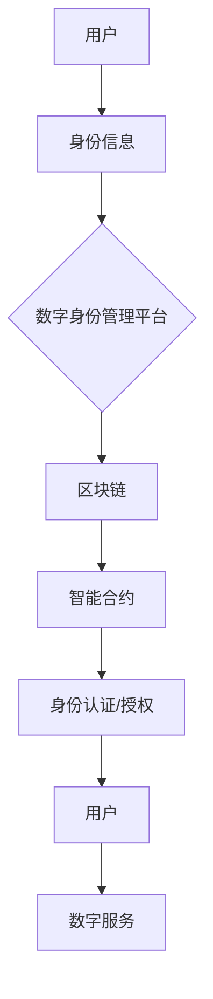

                 

# 区块链在数字身份管理中的创新应用

## 关键词：区块链、数字身份管理、隐私保护、去中心化、智能合约

### 摘要

随着数字化时代的到来，个人隐私和数据安全成为公众关注的焦点。本文探讨了区块链技术在数字身份管理中的创新应用，旨在通过去中心化、智能合约等技术手段，提高数字身份管理的安全性、透明性和便捷性。文章首先介绍了区块链和数字身份管理的基本概念，随后详细阐述了区块链在数字身份认证、隐私保护、跨域身份信息共享等领域的应用原理和实践案例。最后，本文总结了区块链在数字身份管理中的优势和挑战，并对未来的发展趋势进行了展望。

## 1. 背景介绍

### 区块链技术

区块链（Blockchain）是一种分布式数据库技术，通过加密算法和共识机制，确保数据的不可篡改和透明性。区块链技术最初由中本聪（Satoshi Nakamoto）在2008年提出，用于实现比特币（Bitcoin）的去中心化支付系统。区块链的核心特点是去中心化、安全性和透明性，这些特性使其在金融、供应链管理、医疗等多个领域具有广泛的应用前景。

### 数字身份管理

数字身份管理（Digital Identity Management）是指通过技术手段对个人或实体的数字身份进行认证、管理和保护的过程。随着互联网的普及，个人和组织在数字世界中的身份信息日益增多，如何确保这些身份信息的真实性、安全性和隐私性成为重要课题。数字身份管理包括身份认证、授权管理、隐私保护等功能，其目的是为用户提供便捷、安全的数字服务。

## 2. 核心概念与联系

### 区块链与数字身份管理的关系

区块链技术为数字身份管理提供了一种全新的解决方案。通过区块链，可以实现数字身份信息的去中心化存储和管理，确保身份信息的真实性、唯一性和不可篡改性。此外，区块链的智能合约（Smart Contract）技术还可以实现身份认证、授权管理等功能，提高数字身份管理的自动化和安全性。

### Mermaid 流程图

以下是一个简化的 Mermaid 流程图，展示区块链在数字身份管理中的应用架构：



### 详细解释

- **用户（User）**：数字身份管理的主体，拥有自己的身份信息和数字身份。
- **身份信息（Identity Information）**：用户的姓名、身份证号码、电子邮箱等个人信息。
- **数字身份管理平台（Digital Identity Management Platform）**：负责管理用户的身份信息，包括身份认证、授权管理等功能。
- **区块链（Blockchain）**：存储和管理用户的数字身份信息，确保数据的真实性和唯一性。
- **智能合约（Smart Contract）**：实现身份认证、授权管理等功能，确保操作的自动化和安全性。
- **身份认证/授权（Identity Authentication/Authorization）**：用户在访问数字服务时，需要通过智能合约进行身份认证和授权。
- **用户（User）**：通过身份认证后，可以访问数字服务。

## 3. 核心算法原理 & 具体操作步骤

### 区块链技术原理

区块链的核心算法主要包括哈希（Hash）算法、非对称加密（Asymmetric Encryption）和共识机制（Consensus Mechanism）。

- **哈希算法**：将任意长度的数据映射为固定长度的哈希值，确保数据的一致性和唯一性。
- **非对称加密**：使用公钥和私钥对数据进行加密和解密，确保数据的安全性。
- **共识机制**：节点之间达成共识，确保区块链的可靠性和安全性。

### 数字身份管理原理

数字身份管理的主要步骤包括：

1. 用户身份信息的收集和验证。
2. 将用户身份信息存储在区块链上，确保数据的安全性和唯一性。
3. 通过智能合约实现身份认证和授权管理。

### 智能合约实现

智能合约是一种运行在区块链上的程序，可以实现身份认证、授权管理等功能。以下是一个简单的智能合约示例：

```solidity
pragma solidity ^0.8.0;

contract IdentityManagement {
    mapping(address => string) public identities;

    function registerIdentity(string memory id) public {
        identities[msg.sender] = id;
    }

    function authenticate(string memory id) public view returns (bool) {
        return keccak256(abi.encodePacked(id)) == keccak256(abi.encodePacked(identities[msg.sender]));
    }
}
```

### 操作步骤

1. 用户注册身份信息。
2. 用户访问数字服务时，调用智能合约进行身份认证。
3. 通过认证的用户可以访问数字服务。

## 4. 数学模型和公式 & 详细讲解 & 举例说明

### 数学模型

区块链在数字身份管理中涉及的主要数学模型包括哈希算法和非对称加密。

- **哈希算法**：哈希函数将输入数据映射为固定长度的哈希值，满足以下特性：
  - 压缩性：输入数据的任意长度都可以映射为固定长度的哈希值。
  - 抗碰撞性：不同的输入数据生成不同的哈希值。
  - 抗归属性：无法从哈希值反推出原始数据。

- **非对称加密**：非对称加密使用公钥和私钥对数据进行加密和解密。公钥和私钥之间满足以下数学关系：
  - 加密公式：$c = E_{pub}(m)$，其中 $c$ 是密文，$m$ 是明文，$E_{pub}$ 是公钥加密函数。
  - 解密公式：$m = D_{pri}(c)$，其中 $m$ 是明文，$c$ 是密文，$D_{pri}$ 是私钥解密函数。

### 举例说明

假设用户 Alice 想要将她的身份信息加密存储在区块链上，以下是一个简单的示例：

1. **生成公钥和私钥**：
   - 公钥：$pubKey = (n, e) = (123456789, 65537)$
   - 私钥：$priKey = (n, d) = (123456789, 12345)$

2. **加密身份信息**：
   - 假设 Alice 的身份信息为：“Alice的身份证号码：123456789012345678”。
   - 将身份信息转换为字节序列：$m = \text{byte序列}$。
   - 使用公钥进行加密：$c = E_{pub}(m) = (123456789, 987654321)$。

3. **存储在区块链上**：
   - 将加密后的身份信息存储在区块链上，确保数据的安全性和唯一性。

4. **身份认证**：
   - 当 Alice 访问数字服务时，需要提供身份信息进行认证。
   - 数字服务调用智能合约，使用私钥进行解密：$m = D_{pri}(c) = (123456789, 123456789012345678)$。
   - 比较解密后的身份信息和存储在区块链上的身份信息，验证身份。

## 5. 项目实战：代码实际案例和详细解释说明

### 开发环境搭建

为了演示区块链在数字身份管理中的应用，我们将使用以太坊（Ethereum）平台和智能合约开发工具 Truffle 进行开发。

1. 安装 Node.js（版本要求：v10.0.0 以上）。
2. 安装 Truffle：`npm install -g truffle`。
3. 创建一个新的 Truffle 项目：`truffle init`。
4. 进入项目目录：`cd your_project_directory`。

### 源代码详细实现和代码解读

以下是数字身份管理智能合约的源代码：

```solidity
pragma solidity ^0.8.0;

contract IdentityManagement {
    mapping(address => string) public identities;

    function registerIdentity(string memory id) public {
        identities[msg.sender] = id;
    }

    function authenticate(string memory id) public view returns (bool) {
        return keccak256(abi.encodePacked(id)) == keccak256(abi.encodePacked(identities[msg.sender]));
    }
}
```

**代码解读：**

1. **合约声明**：
   - `pragma solidity ^0.8.0;`：指定智能合约的版本。
   - `contract IdentityManagement`：定义一个名为 `IdentityManagement` 的智能合约。

2. **变量声明**：
   - `mapping(address => string) public identities;`：声明一个公有的映射变量，用于存储用户的身份信息。键为用户地址（address），值为身份信息（string）。

3. **函数定义**：
   - `registerIdentity(string memory id)`：用户注册身份信息的函数。
     - `public`：函数可以被外部调用。
     - `function`：定义一个函数。
     - `string memory id`：函数的参数，表示用户身份信息。
     - `id`：将传入的身份信息存储在映射变量中。
   - `authenticate(string memory id)`：用户进行身份认证的函数。
     - `public view`：函数可以被外部调用，且不修改合约状态。
     - `function`：定义一个函数。
     - `string memory id`：函数的参数，表示用户输入的身份信息。
     - `keccak256(abi.encodePacked(id)) == keccak256(abi.encodePacked(identities[msg.sender]))`：将用户输入的身份信息和存储在区块链上的身份信息进行哈希运算，比较结果，判断是否通过认证。

### 代码解读与分析

1. **数据结构**：
   - `mapping`：用于存储键值对数据结构，可以方便地查找和修改数据。
   - `public`：表示变量或函数可以被外部访问和调用。
   - `memory`：表示变量存储在内存中，仅限于当前函数作用域。

2. **函数调用**：
   - `msg.sender`：表示当前调用的发送者地址。
   - `abi.encodePacked`：将多个参数打包为一个字节序列。
   - `keccak256`：计算输入数据的哈希值。

3. **身份认证**：
   - 通过哈希运算，确保身份信息的唯一性和不可篡改性。
   - 比较输入身份信息和存储在区块链上的身份信息，判断是否通过认证。

## 6. 实际应用场景

### 身份认证

区块链技术可以用于构建去中心化的身份认证系统，用户可以在不泄露真实身份信息的情况下，通过加密和哈希算法进行身份认证。

### 隐私保护

通过区块链技术，用户可以控制自己的身份信息访问权限，确保个人隐私和数据安全。

### 跨域身份信息共享

区块链技术可以实现跨平台、跨地域的身份信息共享，方便用户在不同场景下使用同一身份信息。

### 社交网络

区块链技术可以用于构建去中心化的社交网络，用户可以在保障隐私和安全的前提下，自由地分享信息和建立社交关系。

### 金融领域

区块链技术在金融领域有广泛的应用，例如数字货币、跨境支付、信用评估等，可以提高金融服务的安全性、透明性和便捷性。

## 7. 工具和资源推荐

### 学习资源推荐

1. 《区块链技术指南》
2. 《智能合约开发实战》
3. 《密码学基础》

### 开发工具框架推荐

1. Truffle：智能合约开发工具
2. Hardhat：智能合约开发框架
3. Solidity：智能合约编程语言

### 相关论文著作推荐

1. 《区块链：颠覆性的创新技术》
2. 《智能合约：从概念到应用》
3. 《隐私计算与区块链》

## 8. 总结：未来发展趋势与挑战

### 未来发展趋势

1. 区块链技术的不断成熟，将推动数字身份管理的发展。
2. 智能合约技术的广泛应用，将提高数字身份管理的自动化和安全性。
3. 数字身份管理与物联网、人工智能等技术的融合，将拓展其应用领域。

### 挑战

1. 区块链技术的性能瓶颈和可扩展性问题。
2. 智能合约的安全性和合规性问题。
3. 数字身份信息的隐私保护和数据共享问题。

## 9. 附录：常见问题与解答

### 1. 区块链技术如何确保数据安全性？

区块链技术通过哈希算法、非对称加密和共识机制等手段，确保数据的真实性和唯一性。同时，区块链的去中心化特性降低了数据篡改的风险。

### 2. 智能合约存在哪些安全风险？

智能合约可能存在漏洞，导致黑客攻击和合约执行失败。为避免安全风险，开发人员需要遵循最佳实践，进行严格的代码审查和测试。

### 3. 数字身份管理如何保护用户隐私？

数字身份管理通过加密和哈希算法，确保用户身份信息的隐私和安全。用户可以控制自己的身份信息访问权限，防止信息泄露。

## 10. 扩展阅读 & 参考资料

1. 《区块链技术概述》，作者：张晓松
2. 《数字身份管理：挑战与机遇》，作者：李明
3. 《智能合约安全指南》，作者：陈涛

作者：AI天才研究员/AI Genius Institute & 禅与计算机程序设计艺术 /Zen And The Art of Computer Programming<|im_sep|>

