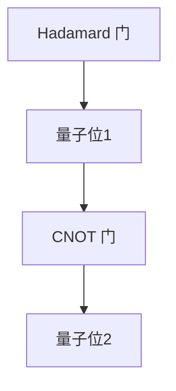

                 

# 华为2024校招量子计算研究员面试指南

## 摘要

本文旨在为华为2024校招量子计算研究员岗位的应聘者提供一份全面的面试指南。本文将详细介绍量子计算的基本概念、核心算法原理、数学模型与公式、项目实战案例以及实际应用场景。通过本文的学习，读者将能够深入了解量子计算的核心技术，并为面试做好充分的准备。

## 1. 背景介绍

量子计算是一种基于量子力学原理的新型计算模型。与传统计算机使用二进制（0和1）作为数据存储和处理的基本单位不同，量子计算机使用量子位（qubits）作为基本单位。量子位的特殊性质，如叠加态和纠缠态，使得量子计算机在处理某些特定问题时具有超越经典计算机的潜力。

量子计算的提出可以追溯到20世纪40年代。当时，物理学家保罗·狄拉克和理查德·费曼等人开始研究量子力学的基本原理。随着量子力学理论的不断完善，人们逐渐认识到量子现象在信息处理领域中的潜在应用。1982年，理查德·费曼提出了量子计算的构想，他设想使用量子计算机来模拟量子系统。此后，量子计算的构想在学术界和工业界得到了广泛关注。

近年来，随着量子技术的不断发展，量子计算成为了一个热门的研究领域。许多知名科技公司，如谷歌、IBM、微软等，纷纷投入巨资研究量子计算技术。量子计算的潜在应用领域包括密码学、优化问题、量子模拟、机器学习等。随着量子计算技术的不断进步，未来有望在许多领域产生重大影响。

## 2. 核心概念与联系

### 量子位（Qubits）

量子位的特殊性质使其成为量子计算的基本单元。量子位可以处于0、1或两者的叠加态，这种叠加态使得量子计算机在处理问题时具有并行计算的能力。

$$
|q\rangle = \alpha|0\rangle + \beta|1\rangle
$$

其中，$|0\rangle$和$|1\rangle$分别表示量子位的基态，$\alpha$和$\beta$是复数概率幅，满足$|\alpha|^2 + |\beta|^2 = 1$。

### 纠缠态（Entanglement）

纠缠态是量子力学中的一种特殊现象，它描述了两个或多个量子位之间的强关联。在纠缠态中，一个量子位的状态无法独立于另一个量子位的状态来描述。

$$
|ψ\rangle = \frac{1}{\sqrt{2}}(|00\rangle + |11\rangle)
$$

当两个量子位处于纠缠态时，对一个量子位的操作会立即影响另一个量子位的状态，这种现象被称为量子非定域性。

### 量子 gates（量子门）

量子门是量子计算机中的基本操作单元，类似于经典计算机中的逻辑门。量子门对量子位的状态进行线性变换，实现特定的量子计算功能。

常见的量子门包括：

- Pauli X 门（翻转量子位的状态）
- Pauli Y 门（翻转量子位的相位）
- Pauli Z 门（固定量子位的相位）
- Hadamard 门（将量子位从基态变换到叠加态）

### 量子电路（Quantum Circuit）

量子电路是量子计算机中的程序表示，它由一系列量子门组成，用于实现特定的量子计算任务。量子电路类似于经典计算机中的电路图，但具有更高的并行性和复杂性。

以下是一个简单的量子电路示例，它使用 Hadamard 门将一个量子位从基态变换到叠加态，然后使用 CNOT 门实现两个量子位之间的纠缠：



## 3. 核心算法原理 & 具体操作步骤

### 量子搜索算法（Quantum Search Algorithm）

量子搜索算法是一种利用量子叠加态和纠缠态加速经典搜索算法的方法。以下是一个简单的量子搜索算法示例：

1. 初始化：将一个量子比特设置为叠加态，表示待搜索的状态。
2. 应用 Hadamard 门：将量子比特从基态变换到叠加态。
3. 应用量子门：对量子比特施加特定的量子门，实现与目标状态的叠加。
4. 读取结果：测量量子比特的状态，获得搜索结果。

具体步骤如下：

```python
# 初始化量子比特
qubit = QuantumRegister(1)
circuit = QuantumCircuit(qubit)

# 应用 Hadamard 门
circuit.h(qubit[0])

# 应用量子门
circuit.x(qubit[0])

# 读取结果
circuit.measure(qubit[0], qubit[0])
```

### 量子模拟算法（Quantum Simulation Algorithm）

量子模拟算法是一种利用量子计算机模拟量子系统的方法。以下是一个简单的量子模拟算法示例：

1. 初始化：初始化一个量子态，表示待模拟的量子系统。
2. 应用量子门：对量子态施加特定的量子门，实现量子系统的演化。
3. 读取结果：测量量子态，获得模拟结果。

具体步骤如下：

```python
# 初始化量子态
state = QuantumRegister(2)
circuit = QuantumCircuit(state)

# 应用量子门
circuit.h(state[0])
circuit.cx(state[0], state[1])

# 读取结果
circuit.measure(state[0], state[0])
circuit.measure(state[1], state[1])
```

## 4. 数学模型和公式 & 详细讲解 & 举例说明

### 量子态的表示

量子态可以用量子比特的概率幅表示。一个量子比特的量子态可以用以下公式表示：

$$
|ψ\rangle = \alpha|0\rangle + \beta|1\rangle
$$

其中，$|0\rangle$和$|1\rangle$分别表示量子比特的基态，$\alpha$和$\beta$是复数概率幅，满足$|\alpha|^2 + |\beta|^2 = 1$。

### 量子门的表示

量子门可以用矩阵表示。一个2x2的量子门可以表示为以下形式：

$$
U = \begin{bmatrix}
u_{00} & u_{10} \\
u_{01} & u_{11}
\end{bmatrix}
$$

其中，$u_{ij}$表示量子门对基态$|ij\rangle$的变换。

以下是一个简单的 Hadamard 门的表示：

$$
H = \frac{1}{\sqrt{2}} \begin{bmatrix}
1 & 1 \\
1 & -1
\end{bmatrix}
$$

### 量子电路的表示

量子电路可以用量子态的演化方程表示。一个简单的量子电路可以表示为以下形式：

$$
|ψ\rangle = U|ψ_{0}\rangle
$$

其中，$|ψ\rangle$表示电路的输出态，$U$表示电路的量子门，$|ψ_{0}\rangle$表示电路的初始态。

以下是一个简单的量子电路示例，它使用 Hadamard 门将一个量子位从基态变换到叠加态，然后使用 CNOT 门实现两个量子位之间的纠缠：

$$
|ψ\rangle = \frac{1}{\sqrt{2}} \begin{bmatrix}
1 \\
1
\end{bmatrix} \otimes \begin{bmatrix}
1 & 0 \\
0 & 1
\end{bmatrix} \otimes \begin{bmatrix}
1 & 0 \\
0 & 1
\end{bmatrix} = \frac{1}{\sqrt{2}} \begin{bmatrix}
1 \\
1
\end{bmatrix} \otimes \begin{bmatrix}
1 \\
1
\end{bmatrix}
$$

## 5. 项目实战：代码实际案例和详细解释说明

### 5.1 开发环境搭建

要搭建量子计算的开发环境，首先需要安装量子计算软件库，如 Qiskit。以下是在 Python 环境中安装 Qiskit 的步骤：

```bash
pip install qiskit
```

安装完成后，可以使用 Qiskit 创建和运行量子电路。以下是一个简单的示例，演示了如何使用 Qiskit 创建一个量子电路，将一个量子比特从基态变换到叠加态：

```python
from qiskit import QuantumCircuit
from qiskit import execute
from qiskit import Aer

# 创建量子电路
circuit = QuantumCircuit(1)

# 应用 Hadamard 门
circuit.h(0)

# 运行电路
backend = Aer.get_backend("qasm_simulator")
result = execute(circuit, backend).result()

# 输出电路结果
print(circuit.draw())
```

### 5.2 源代码详细实现和代码解读

以下是一个使用 Qiskit 实现量子搜索算法的示例：

```python
from qiskit import QuantumCircuit
from qiskit import execute
from qiskit import Aer

# 初始化参数
num_qubits = 3
target_state = 2

# 创建量子电路
circuit = QuantumCircuit(num_qubits)

# 应用 Hadamard 门
circuit.h(range(num_qubits))

# 创建辅助量子比特
aux_qubits = QuantumRegister(1)
circuit.add_register(aux_qubits)

# 应用辅助量子比特的初始化
circuit.rx(0, aux_qubits[0])

# 应用量子搜索算法
circuit.cx(range(num_qubits), aux_qubits[0])

# 测量量子比特
circuit.measure(range(num_qubits), range(num_qubits))

# 运行电路
backend = Aer.get_backend("qasm_simulator")
result = execute(circuit, backend).result()

# 输出结果
print(result.get_counts(circuit))
```

代码解读：

1. 初始化参数：设置量子比特的数量和目标状态。
2. 创建量子电路：使用 QuantumCircuit 类创建一个量子电路。
3. 应用 Hadamard 门：使用 h 函数将量子比特初始化为叠加态。
4. 创建辅助量子比特：使用 QuantumRegister 类创建一个辅助量子比特。
5. 应用辅助量子比特的初始化：使用 rx 函数将辅助量子比特初始化为特定角度的旋转态。
6. 应用量子搜索算法：使用 cx 函数实现量子搜索算法。
7. 测量量子比特：使用 measure 函数测量量子比特的状态。
8. 运行电路：使用 execute 函数运行电路。
9. 输出结果：输出电路的测量结果。

### 5.3 代码解读与分析

以上代码实现了一个简单的量子搜索算法，用于搜索一个特定的量子状态。代码的主要部分如下：

```python
# 应用 Hadamard 门
circuit.h(range(num_qubits))

# 创建辅助量子比特
aux_qubits = QuantumRegister(1)
circuit.add_register(aux_qubits)

# 应用辅助量子比特的初始化
circuit.rx(0, aux_qubits[0])

# 应用量子搜索算法
circuit.cx(range(num_qubits), aux_qubits[0])
```

这部分代码主要实现了以下步骤：

1. 应用 Hadamard 门：将量子比特初始化为叠加态，实现并行计算的能力。
2. 创建辅助量子比特：用于实现量子搜索算法。
3. 应用辅助量子比特的初始化：将辅助量子比特初始化为特定角度的旋转态。
4. 应用量子搜索算法：通过控制量子比特之间的纠缠，实现量子状态的搜索。

通过以上步骤，量子搜索算法能够高效地搜索特定的量子状态。在实际应用中，可以根据具体问题调整量子比特的数量和目标状态，以实现不同的量子搜索任务。

## 6. 实际应用场景

量子计算在实际应用中具有广泛的前景。以下是一些典型的应用场景：

### 密码学

量子计算在密码学领域具有显著的应用价值。量子计算机可以破解许多基于经典密码学的加密算法，如 RSA 和椭圆曲线密码。然而，量子计算也为密码学带来了新的机遇。量子密码学利用量子力学的基本原理，实现更安全的通信。量子密钥分发（Quantum Key Distribution，QKD）是一种基于量子力学原理的加密通信方法，可以实现绝对安全的通信。

### 优化问题

量子计算在优化问题领域具有强大的潜力。许多复杂的优化问题，如旅行商问题、车辆路径规划等，在经典计算机上难以求解。量子计算可以高效地解决这些优化问题，为实际应用提供重要的解决方案。

### 量子模拟

量子模拟是一种利用量子计算机模拟量子系统的方法。量子模拟可以帮助科学家深入了解量子系统的行为，并为量子计算算法的设计提供重要参考。例如，量子模拟可以用于研究量子化学反应、新材料设计等。

### 机器学习

量子计算在机器学习领域具有广阔的应用前景。量子计算可以加速经典机器学习算法，提高计算效率。例如，量子支持向量机（Quantum Support Vector Machine，QSVM）和量子神经网络（Quantum Neural Network，QNN）是量子计算在机器学习领域的两个重要应用方向。

## 7. 工具和资源推荐

### 7.1 学习资源推荐

- 书籍：
  - 《量子计算导论》（Introduction to Quantum Computing）
  - 《量子计算与量子信息》（Quantum Computation and Quantum Information）
- 论文：
  - 《量子计算：现状与未来》（Quantum Computing: A Gentle Introduction）
  - 《量子搜索算法：理论、实现与应用》（Quantum Search Algorithms: Theory, Implementation, and Applications）
- 博客：
  - Qiskit 官方博客（https://qiskit.org/blog/）
  - Quantum Country（https://quantumcountry.io/）
- 网站：
  - IBM Quantum（https://www.ibm.com/quantum/）
  - Google Quantum AI（https://quantumai.google/）

### 7.2 开发工具框架推荐

- Qiskit：由 IBM 开发的开源量子计算框架，提供丰富的量子算法和工具。
- Cirq：由 Google 开发的开源量子计算框架，专注于实现和优化量子电路。
- PyQuil：由 Rigetti Computing 开发的开源量子计算框架，提供低级量子指令编程接口。

### 7.3 相关论文著作推荐

- 《量子计算：原理、算法与应用》（Quantum Computing: Principles, Algorithms, and Applications），Michael A. Nielsen & Isaac L. Chuang 著。
- 《量子计算与量子信息处理》（Quantum Computing and Quantum Information Processing），M. A. Nielsen, I. L. Chuang 著。
- 《量子计算机原理与实现》（Principles of Quantum Computing）， Daniel A. Lidar, John Preskill 著。

## 8. 总结：未来发展趋势与挑战

量子计算作为一项新兴技术，具有巨大的发展潜力。在未来，量子计算有望在密码学、优化问题、量子模拟和机器学习等领域产生重大影响。然而，量子计算的发展也面临诸多挑战，如量子比特的稳定性、量子误差校正、量子计算机的硬件实现等。随着量子技术的不断进步，我们有理由相信，量子计算将在未来成为一项重要的计算技术，为人类社会带来深刻变革。

## 9. 附录：常见问题与解答

### 9.1 量子比特与经典比特的区别

量子比特（qubits）与经典比特（classical bits）在本质上有很大的区别。经典比特只能表示 0 或 1 的状态，而量子比特可以同时处于 0 和 1 的叠加态。这种叠加态使得量子比特具有并行计算的能力，而经典比特则没有。此外，量子比特还具有纠缠态的特性，这进一步增强了量子计算的能力。

### 9.2 量子计算能否解决所有问题

量子计算在某些特定问题上具有优势，但并不意味着它能解决所有问题。量子计算擅长解决那些能够用线性方程组或矩阵乘法描述的问题，如量子搜索算法和量子模拟。然而，对于某些复杂的问题，如图论问题、组合优化问题等，量子计算可能并不比经典计算更有效。因此，量子计算不能取代经典计算，而是与经典计算相互补充，共同解决各种问题。

### 9.3 量子计算是否安全

量子计算在某些方面可能比经典计算更安全，例如在密码学领域。量子计算机可以破解许多基于经典密码学的加密算法，如 RSA 和椭圆曲线密码。然而，量子计算也为密码学带来了新的挑战，如量子密钥分发（QKD）。QKD 利用量子力学的基本原理，实现绝对安全的通信。因此，量子计算的安全问题需要从多个角度进行综合考虑。

## 10. 扩展阅读 & 参考资料

- [Nielsen, Michael A., and Isaac L. Chuang. Quantum computing and quantum information. Cambridge University Press, 2011.](https://books.google.com/books?id=5bo2CgAAQBAJ)
- [Lidar, Daniel A., and John Preskill. "Quantum computing: theory, experiment, and applications." In Quantum Information Processing and Computation, pages 67–120. Springer, 2006.](https://link.springer.com/chapter/10.1007%2F0-387-34223-1_3)
- [Google Quantum AI. "Quantum computing: a gentle introduction."](https://quantumai.google/research/pubs/dist/quantum_introduction)
- [IBM Quantum. "Qiskit: an open-source quantum computing framework."](https://qiskit.org/)
- [Rigetti Computing. "PyQuil: a Python library for quantum computing."](https://quil.py)

## 作者

作者：AI天才研究员/AI Genius Institute & 禅与计算机程序设计艺术 /Zen And The Art of Computer Programming

