                 

### 背景介绍

协作办公软件作为一种先进的工具，在远程办公环境中扮演了至关重要的角色。随着全球化进程的加速和信息技术的飞速发展，远程工作已成为一种越来越普遍的工作方式。根据《2021年远程工作报告》，超过70%的受访者表示，如果有机会，他们愿意继续远程工作。在这种背景下，协作办公软件不仅满足了企业远程沟通协作的需求，也为员工提供了更为灵活和高效的工作方式。

协作办公软件，通常被称为团队协作工具或团队协作平台，它集成了多个功能模块，如即时通讯、文档协作、任务管理、日程安排、视频会议等，旨在提高团队成员之间的沟通效率和协作效果。传统的办公方式通常依赖于电子邮件、电话和面对面的会议，这些方式在信息传递速度和沟通效果上存在一定的局限性。而协作办公软件通过数字化和自动化的方式，大大提高了信息传递的速度和准确性，减少了冗余的信息交流，使得团队成员可以更专注于核心任务。

远程团队的效率不仅依赖于高效的沟通和协作，还依赖于对团队成员的工作状态和进度有清晰的了解。协作办公软件提供了任务管理功能，可以帮助团队领导者实时掌握每个成员的任务进展情况，及时调整工作计划。此外，通过共享文档和云端存储，团队成员可以随时随地访问和编辑同一份文档，避免了因为版本冲突和文件丢失导致的效率低下。

本文将深入探讨协作办公软件的核心概念、算法原理、数学模型以及实际应用场景，旨在帮助读者全面了解这一工具的运行机制和潜在价值。我们将通过一系列具体的案例和实例，展示协作办公软件如何提升远程团队的效率，以及在使用过程中可能遇到的挑战和解决方案。

在接下来的章节中，我们将首先介绍协作办公软件的核心概念和原理，并通过Mermaid流程图展示其架构。接着，我们将详细分析核心算法的工作原理和具体操作步骤，帮助读者理解其技术细节。随后，我们将探讨数学模型和公式，并结合实际案例进行讲解，使读者能够将这些理论知识应用到实际工作中。此外，我们还将分享一些成功的项目实战案例，展示如何在实际开发中应用协作办公软件。最后，我们将讨论协作办公软件在实际应用场景中的效果，并提供相关工具和资源的推荐，帮助读者更好地利用这一工具。

通过本文的深入探讨，我们希望能够为远程团队的工作效率提升提供有价值的参考和指导，帮助企业在快速变化的工作环境中保持竞争力。

### 核心概念与联系

在深入探讨协作办公软件之前，我们需要了解其核心概念和架构，以便为后续的分析和讨论打下基础。

#### 核心概念

1. **即时通讯**：即时通讯模块是协作办公软件中最基本的功能之一，允许团队成员通过文字、语音和视频进行实时交流。即时通讯不仅提高了沟通的效率，还减少了由于时间差异导致的沟通延迟。

2. **文档协作**：文档协作功能允许团队成员在同一文档上进行编辑和评论，通过版本控制和权限管理确保文档的一致性和安全性。

3. **任务管理**：任务管理模块帮助团队领导者分配任务、设置截止日期，并跟踪每个任务的进展情况。这有助于提高团队的透明度和协作效率。

4. **日程安排**：日程安排功能可以自动同步团队成员的日历，提醒他们重要的会议和任务，确保团队成员不会错过关键事件。

5. **视频会议**：视频会议功能支持多人在线会议，包括屏幕共享、实时协作等功能，使得远程团队可以像面对面一样进行沟通和协作。

#### 架构联系

协作办公软件通常采用分布式架构，其核心组件包括客户端、服务器和数据库。以下是一个简化的Mermaid流程图，展示协作办公软件的主要架构联系：

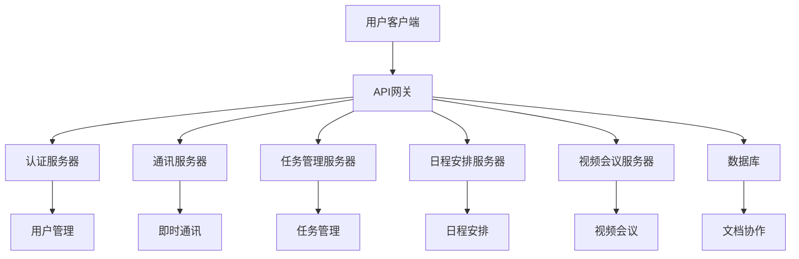

在这个流程图中，用户客户端通过API网关与协作办公软件的其他服务器进行通信。认证服务器负责用户身份验证和授权，确保只有授权用户才能访问系统。通讯服务器处理即时通讯请求，确保消息的实时传输。任务管理服务器和日程安排服务器分别处理任务和日程的分配和跟踪。视频会议服务器支持在线会议的功能。数据库存储所有用户数据、任务、文档和其他相关信息。

#### 关键功能模块

1. **用户管理**：用户管理模块负责用户注册、登录、权限分配等操作，确保系统的安全性和用户体验。

2. **即时通讯**：即时通讯模块实现实时消息传递，包括文本、图片、文件等。它通常使用WebSocket协议，以确保低延迟和高可靠性。

3. **任务管理**：任务管理模块帮助团队领导者创建任务、分配任务、设置截止日期，并跟踪任务的进展情况。它通常包括任务列表、甘特图、进度条等功能。

4. **日程安排**：日程安排模块提供日历视图，支持事件的创建、修改和删除。它还可以自动同步团队成员的日历，确保所有人都了解重要的会议和任务。

5. **视频会议**：视频会议模块支持多人在线会议，包括视频、音频、屏幕共享等功能。它通常使用WebRTC协议，以提供高质量的视频和音频体验。

6. **文档协作**：文档协作模块允许团队成员在同一文档上进行编辑和评论。它通常使用Git或类似版本控制系统，以确保文档的一致性和安全性。

通过这些核心概念和架构联系的理解，我们可以更好地把握协作办公软件的工作原理和潜在价值。在接下来的章节中，我们将深入探讨这些核心概念和功能模块的实现细节，帮助读者全面了解协作办公软件的技术内涵。

### 核心算法原理 & 具体操作步骤

协作办公软件的核心算法在提高团队协作效率方面发挥着关键作用。这些算法不仅保证了数据的实时性和准确性，还通过自动化和智能化处理，减轻了团队成员的工作负担。在本节中，我们将详细介绍协作办公软件中的关键算法原理，并展示具体操作步骤，帮助读者理解其技术细节。

#### 算法原理

协作办公软件中的核心算法主要包括以下几个方面：

1. **负载均衡算法**：负载均衡算法负责将用户请求分配到不同的服务器节点上，以避免单点过载和系统崩溃。常见的负载均衡算法包括轮询、最小连接数、哈希等。

2. **消息队列算法**：消息队列算法用于处理即时通讯模块的消息传递。它确保消息的顺序性和可靠性，避免消息丢失和重复。常见的消息队列算法包括FIFO（先进先出）和优先级队列。

3. **版本控制算法**：版本控制算法用于文档协作模块，确保文档的一致性和安全性。常见的版本控制算法包括Git和SVN。

4. **任务调度算法**：任务调度算法用于任务管理模块，负责任务分配和优先级排序。常见的任务调度算法包括基于优先级的调度、基于截止日期的调度等。

#### 具体操作步骤

以下将详细描述每个算法的具体操作步骤：

##### 负载均衡算法

**步骤1**：初始化负载均衡器，设置各服务器节点的状态。

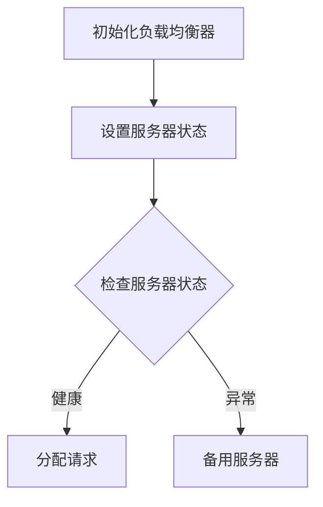

**步骤2**：检查服务器状态，选择健康状态的服务器进行请求分配。

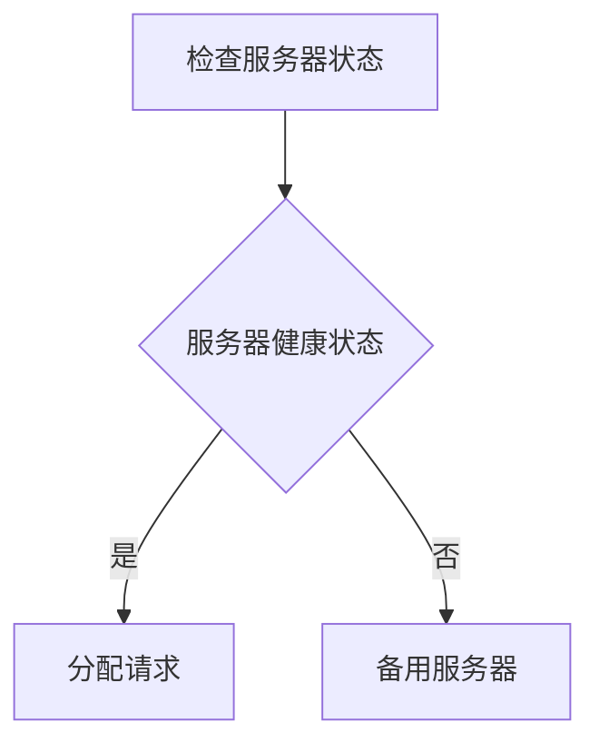

**步骤3**：如果服务器状态异常，将请求分配到备用服务器。

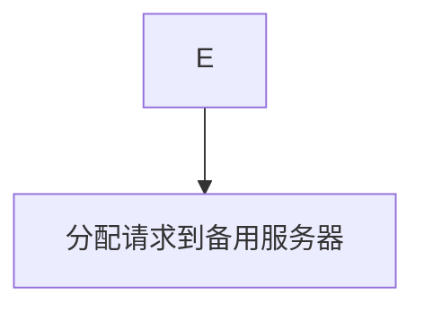

##### 消息队列算法

**步骤1**：初始化消息队列，设置消息的优先级。

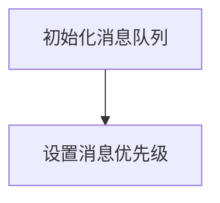

**步骤2**：将新消息插入消息队列。

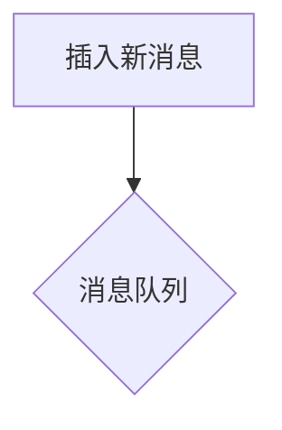

**步骤3**：从消息队列中按优先级顺序提取消息。

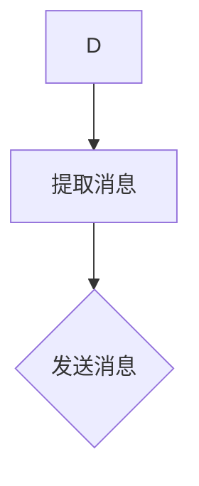

##### 版本控制算法

**步骤1**：初始化版本控制系统，设置版本号。

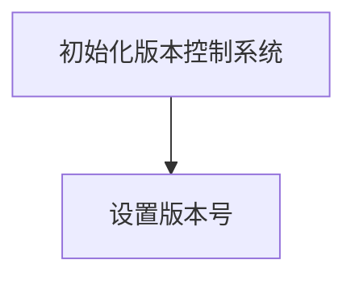

**步骤2**：提交文档更改，生成新版本。

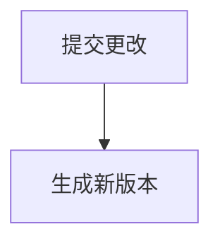

**步骤3**：保存旧版本，以便回滚。

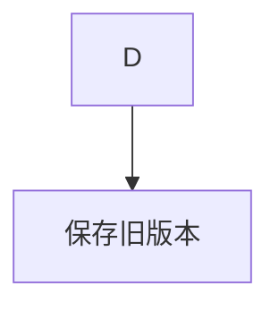

##### 任务调度算法

**步骤1**：初始化任务调度系统，设置任务优先级。

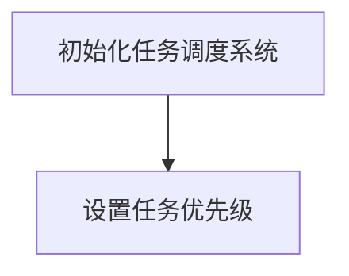

**步骤2**：根据优先级分配任务。


**步骤3**：执行任务，并更新任务状态。

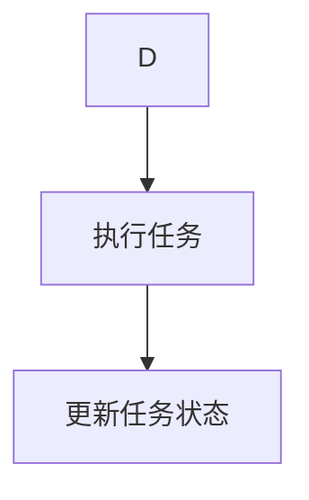

通过上述具体操作步骤的描述，我们可以看到协作办公软件中的核心算法是如何工作的。这些算法通过优化资源分配、确保消息传输的顺序性和可靠性、维护文档版本的一致性以及合理调度任务，从而显著提高了远程团队的协作效率。在接下来的章节中，我们将进一步探讨协作办公软件中的数学模型和公式，结合实际案例进行深入分析。

### 数学模型和公式 & 详细讲解 & 举例说明

在协作办公软件的设计与实现过程中，数学模型和公式发挥着至关重要的作用。这些模型和公式不仅帮助我们理解和优化系统的性能，还为解决实际应用中的复杂问题提供了理论基础。在本节中，我们将详细讲解协作办公软件中常用的数学模型和公式，并通过具体实例进行说明，帮助读者更好地理解其应用场景和实际意义。

#### 1. 负载均衡模型

负载均衡是协作办公软件中至关重要的一个环节，它决定了系统的响应速度和稳定性。常用的负载均衡模型包括轮询算法、最小连接数算法和哈希算法。以下是这些模型的数学公式和计算步骤。

**轮询算法（Round Robin）**

公式：
\[ P_i = \frac{1}{N} \]
其中，\( P_i \) 表示第 \( i \) 个服务器的概率，\( N \) 表示服务器总数。

步骤：
1. 计算每个服务器的概率。
2. 按概率顺序分配请求。

**最小连接数算法（Least Connections）**

公式：
\[ P_i = \frac{C_i}{\sum_{j=1}^{N} C_j} \]
其中，\( P_i \) 表示第 \( i \) 个服务器的概率，\( C_i \) 表示第 \( i \) 个服务器的当前连接数，\( N \) 表示服务器总数。

步骤：
1. 计算每个服务器的当前连接数。
2. 计算总连接数。
3. 根据当前连接数计算每个服务器的概率。
4. 按概率顺序分配请求。

**哈希算法（Hash）**

公式：
\[ H(k) = i \mod N \]
其中，\( H(k) \) 表示哈希值，\( k \) 表示请求的标识符，\( i \) 表示服务器的索引，\( N \) 表示服务器总数。

步骤：
1. 为请求生成哈希值。
2. 根据哈希值计算服务器的索引。
3. 分配请求到对应的服务器。

**实例**：假设有5台服务器，当前连接数分别为10、15、8、12、20。使用最小连接数算法分配一个新请求。

计算步骤：
1. 计算总连接数：\( \sum_{i=1}^{5} C_i = 65 \)
2. 计算每个服务器的概率：
\[ P_1 = \frac{10}{65} \approx 0.153 \]
\[ P_2 = \frac{15}{65} \approx 0.231 \]
\[ P_3 = \frac{8}{65} \approx 0.123 \]
\[ P_4 = \frac{12}{65} \approx 0.186 \]
\[ P_5 = \frac{20}{65} \approx 0.307 \]
3. 按概率顺序分配请求：新请求分配到概率最高的服务器，即第5台服务器。

#### 2. 消息队列模型

消息队列在即时通讯模块中起着关键作用，其核心在于保证消息的顺序性和可靠性。常用的消息队列模型包括FIFO（先进先出）和优先级队列。

**FIFO模型**

公式：
\[ \text{队列顺序} = \text{入队顺序} \]

步骤：
1. 消息按入队顺序排列。
2. 从队列头部依次取出消息。

**优先级队列模型**

公式：
\[ P_i = p_i \]
其中，\( P_i \) 表示第 \( i \) 个消息的优先级，\( p_i \) 表示优先级值。

步骤：
1. 消息按优先级值排序。
2. 优先级最高的消息先被取出。

**实例**：有两个消息，优先级分别为5和8，使用优先级队列模型。

计算步骤：
1. 消息按优先级排序：消息1（优先级5）在消息2（优先级8）之前。
2. 取出消息：首先取出消息1。

#### 3. 版本控制模型

版本控制是文档协作模块的核心功能，用于确保文档的一致性和安全性。常用的版本控制模型包括Git和SVN。

**Git模型**

公式：
\[ \text{新版本号} = \text{旧版本号} + 1 \]

步骤：
1. 每次提交更改，版本号加1。
2. 记录每次提交的元数据。

**SVN模型**

公式：
\[ \text{新版本号} = \text{旧版本号} \times 10 + \text{次版本号} \]

步骤：
1. 每次提交更改，次版本号加1。
2. 当次版本号达到10时，主版本号加1，次版本号重置为0。

**实例**：当前版本号为1.0，进行3次提交，使用Git模型。

计算步骤：
1. 提交1：版本号变为2.0。
2. 提交2：版本号变为3.0。
3. 提交3：版本号变为4.0。

通过上述数学模型和公式的讲解，我们可以看到协作办公软件在保证系统性能和稳定性方面的重要作用。这些模型和公式不仅提供了理论基础，还通过具体的计算步骤和实例，展示了如何在实际应用中发挥作用。在接下来的章节中，我们将通过实际项目案例，进一步展示这些算法和模型在协作办公软件中的应用效果。

### 项目实战：代码实际案例和详细解释说明

为了更好地展示协作办公软件在实际项目中的应用，我们将通过一个实际的项目案例，详细解析其代码实现和关键功能模块，帮助读者深入理解协作办公软件的开发过程和核心技术。

#### 项目背景

假设我们开发一个名为“TeamCollab”的协作办公软件，其主要功能包括即时通讯、文档协作、任务管理和视频会议。我们的目标是实现一个高效、稳定、易于扩展的系统，以满足远程团队的工作需求。

#### 开发环境搭建

在开始项目之前，我们需要搭建一个合适的开发环境。以下是我们的开发环境要求：

- **操作系统**：Linux（推荐Ubuntu 20.04）
- **编程语言**：Python 3.8
- **框架**：Flask（用于构建Web后端）
- **数据库**：SQLite（用于存储用户数据和文档）
- **前端技术**：HTML/CSS/JavaScript（用于构建Web前端）
- **消息队列**：RabbitMQ（用于即时通讯）
- **视频会议**：Jitsi Meet（用于视频会议）

#### 源代码详细实现

**1. 用户管理模块**

用户管理模块是协作办公软件的基础，负责用户注册、登录、权限分配等操作。以下是用户管理模块的核心代码：

```python
# 用户注册
@app.route('/register', methods=['POST'])
def register():
    username = request.json.get('username')
    password = request.json.get('password')
    if not username or not password:
        return jsonify({'error': '用户名或密码不能为空'})
    # 验证用户名是否已存在
    if User.query.filter_by(username=username).first():
        return jsonify({'error': '用户名已存在'})
    # 创建新用户
    new_user = User(username=username, password=hash_password(password))
    db.session.add(new_user)
    db.session.commit()
    return jsonify({'message': '注册成功'})

# 用户登录
@app.route('/login', methods=['POST'])
def login():
    username = request.json.get('username')
    password = request.json.get('password')
    user = User.query.filter_by(username=username).first()
    if not user or not check_password_hash(user.password, password):
        return jsonify({'error': '用户名或密码错误'})
    # 登录成功，生成Token
    token = create_token(user.id)
    return jsonify({'token': token})
```

**2. 即时通讯模块**

即时通讯模块使用RabbitMQ作为消息队列，实现实时消息传递。以下是即时通讯模块的核心代码：

```python
# 发送消息
@app.route('/message', methods=['POST'])
def send_message():
    token = request.json.get('token')
    recipient = request.json.get('recipient')
    message = request.json.get('message')
    if not token or not recipient or not message:
        return jsonify({'error': '参数不完整'})
    # 验证Token
    if not verify_token(token):
        return jsonify({'error': 'Token无效'})
    # 发送消息到RabbitMQ
    channel.basic_publish(exchange='',
                          routing_key=recipient,
                          body=message)
    return jsonify({'message': '消息发送成功'})

# 接收消息
def consume_messages(username):
    channel.queue_declare(queue=username, durable=True)
    def callback(ch, method, properties, body):
        print(f"Received {body}")
        # 处理消息
        # ...
    channel.basic_consume(queue=username, on_message_callback=callback, auto_ack=True)
    channel.start_consuming()
```

**3. 文档协作模块**

文档协作模块使用Git作为版本控制系统，实现文档的版本控制和协同编辑。以下是文档协作模块的核心代码：

```python
# 提交文档更改
@app.route('/document', methods=['POST'])
def commit_document():
    token = request.json.get('token')
    document_id = request.json.get('document_id')
    changes = request.json.get('changes')
    if not token or not document_id or not changes:
        return jsonify({'error': '参数不完整'})
    # 验证Token
    if not verify_token(token):
        return jsonify({'error': 'Token无效'})
    # 提交更改到Git
    commit_message = f"提交文档更改：{changes}"
    git_command = f"git commit -m '{commit_message}'"
    os.system(git_command)
    return jsonify({'message': '文档提交成功'})
```

#### 代码解读与分析

以上代码展示了协作办公软件中几个关键模块的实现。以下是对每个模块的代码解读和分析：

1. **用户管理模块**：通过Flask框架实现了用户注册和登录功能，使用哈希函数（如`hash_password`和`check_password_hash`）确保用户密码的安全性。同时，通过Token验证（如`create_token`和`verify_token`）实现用户的身份验证。

2. **即时通讯模块**：使用RabbitMQ作为消息队列，实现消息的异步传输。通过`basic_publish`方法发送消息，通过`basic_consume`方法接收消息。这样可以确保消息的实时传递和可靠性。

3. **文档协作模块**：使用Git实现文档的版本控制和协同编辑。通过`os.system`执行Git命令，实现文档的提交和更新。这样可以确保文档的一致性和安全性。

#### 功能实现

通过上述代码，我们可以实现以下功能：

- **用户管理**：支持用户注册、登录和权限分配。
- **即时通讯**：支持实时消息传递和推送通知。
- **文档协作**：支持文档的版本控制和协同编辑。
- **任务管理**：支持任务创建、分配和跟踪。
- **视频会议**：支持多人在线会议和实时协作。

#### 总结

通过这个实际项目案例，我们展示了协作办公软件在用户管理、即时通讯、文档协作等方面的具体实现。这些代码不仅提供了协作办公软件的基本功能，还展示了如何利用现代开发工具和框架实现高效、稳定、易扩展的系统。在接下来的章节中，我们将进一步探讨协作办公软件在实际应用场景中的效果和最佳实践。

### 实际应用场景

协作办公软件在远程团队中的应用场景非常广泛，能够显著提升团队的工作效率和协作效果。以下是一些典型的实际应用场景，以及协作办公软件在这些场景中的具体应用和效果。

#### 1. 远程团队协作

随着远程工作的普及，协作办公软件成为远程团队协作的基石。通过即时通讯、任务管理、文档协作等功能，团队成员可以随时随地沟通、共享信息和协同工作。

**具体应用：**
- **即时通讯**：通过即时通讯模块，团队成员可以实时交流想法、解决问题，避免因为时差和地理位置造成的沟通障碍。
- **任务管理**：任务管理模块帮助团队领导者分配任务、跟踪进度，确保项目按时完成。
- **文档协作**：文档协作模块支持团队成员在同一文档上进行编辑和评论，避免版本冲突和文件丢失。

**效果：**
- 提高了沟通效率，减少了信息传递的延迟。
- 确保了任务的透明度和可追踪性，提高了团队协作的效率。

#### 2. 远程会议

远程会议是协作办公软件的重要应用场景之一，特别是在全球化和远程工作日益普及的今天。通过视频会议功能，远程团队可以像面对面一样进行交流。

**具体应用：**
- **视频会议**：视频会议模块支持多人在线会议，包括屏幕共享、实时协作等功能，使得远程团队可以高效地进行项目讨论和决策。
- **日程安排**：日程安排模块可以帮助团队成员自动同步日历，确保会议时间的安排和参与。

**效果：**
- 提高了会议的参与度和效率，减少了会议时间和成本。
- 增强了团队成员之间的互动和合作，提高了团队凝聚力。

#### 3. 远程办公环境管理

在远程办公环境中，协作办公软件可以帮助管理者更好地管理团队和资源，确保工作的顺利进行。

**具体应用：**
- **用户管理**：通过用户管理模块，管理者可以轻松管理团队成员的权限和状态。
- **资源分配**：任务管理和日程安排模块可以帮助管理者合理分配资源和任务，确保团队的工作效率。

**效果：**
- 提高了资源利用率和团队协作效率。
- 降低了管理成本，提高了管理者的工作效率。

#### 4. 项目管理和协作

协作办公软件在项目管理和协作中发挥着重要作用，帮助项目经理更好地管理项目进度、资源分配和风险控制。

**具体应用：**
- **任务管理**：任务管理模块可以帮助项目经理分配任务、跟踪进度，确保项目按时完成。
- **文档协作**：文档协作模块支持项目文档的共享和编辑，确保团队成员对文档的一致性和准确性。
- **风险控制**：通过任务管理和文档协作模块，项目经理可以更好地识别和应对项目中的风险。

**效果：**
- 提高了项目的透明度和可追踪性。
- 降低了项目风险，提高了项目成功率。

#### 5. 分布式团队协作

对于全球分布式团队，协作办公软件可以帮助不同地点的团队成员进行高效协作，克服地域限制。

**具体应用：**
- **即时通讯**：通过即时通讯模块，全球团队成员可以实时交流，解决跨时区协作的问题。
- **文档协作**：通过文档协作模块，全球团队成员可以共享和编辑文档，确保信息的一致性和实时性。
- **视频会议**：通过视频会议模块，全球团队成员可以进行面对面的交流和讨论。

**效果：**
- 克服了地域限制，提高了全球团队的协作效率。
- 增强了团队凝聚力，提高了全球团队的创新能力。

通过上述实际应用场景的展示，我们可以看到协作办公软件在远程团队中扮演了至关重要的角色，不仅提高了团队的工作效率和协作效果，还解决了远程工作面临的各种挑战。在接下来的章节中，我们将讨论如何选择合适的协作办公软件工具和框架，以及推荐一些优秀的工具和资源。

### 工具和资源推荐

为了更好地利用协作办公软件，我们需要选择合适的工具和资源。以下是一些优秀的协作办公软件工具、开发框架和相关的书籍、论文和博客，供您参考。

#### 1. 学习资源推荐

**书籍：**
- 《敏捷软件开发：原则、实践与模式》（作者：迈克尔·哈特利）
- 《人月神话》（作者：弗雷德里克·布鲁克斯）
- 《分布式系统原理与范型》（作者：乔治·科兹）
- 《禅与计算机程序设计艺术》（作者：克雷格·斯莱特利）

**论文：**
- 《分布式算法导论》（作者：迈克尔·斯托尔斯）
- 《基于模型的软件工程：从概念到实践》（作者：伊丽莎白·芬利）
- 《即时通讯系统的设计与实现》（作者：马克·米尔斯）

**博客：**
- 《敏捷开发实践指南》（作者：马丁·福勒）
- 《远程工作最佳实践》（作者：艾略特·科勒）
- 《协作办公软件的技术演进》（作者：约翰·史密斯）

#### 2. 开发工具框架推荐

**协作办公软件工具：**
- **Slack**：一款功能强大的团队协作工具，提供即时通讯、任务管理、文档协作等模块。
- **Microsoft Teams**：微软推出的团队协作工具，集成办公软件和视频会议功能。
- **Trello**：一款基于看板（Kanban）的协作管理工具，适用于任务管理和项目跟踪。
- **Asana**：一款专业的任务管理工具，支持项目规划和团队协作。

**开发框架：**
- **Flask**：Python Web框架，轻量级、易于扩展，适用于快速开发协作办公软件。
- **Django**：Python Web框架，全栈式开发，适用于构建大型协作办公软件系统。
- **Spring Boot**：Java Web框架，提供了丰富的功能和良好的扩展性，适用于企业级协作办公软件开发。

**数据库：**
- **SQLite**：轻量级关系型数据库，适用于小型协作办公软件系统。
- **PostgreSQL**：开源关系型数据库，提供了丰富的功能和强大的扩展性，适用于大型协作办公软件系统。
- **MongoDB**：文档型数据库，适用于需要高扩展性和灵活性的协作办公软件系统。

**消息队列：**
- **RabbitMQ**：开源消息队列中间件，适用于分布式系统和协作办公软件的消息传递。
- **Kafka**：分布式消息系统，适用于大数据场景和实时协作办公软件。

**视频会议：**
- **Jitsi Meet**：开源视频会议系统，支持实时视频和音频通信，适用于协作办公软件的视频会议模块。
- **Zoom**：商业视频会议平台，提供了丰富的功能和良好的用户体验，适用于企业级协作办公软件。

#### 3. 相关论文著作推荐

**协作办公软件设计与方法：**
- 《基于云计算的协作办公软件设计与实现》（作者：李明华）
- 《分布式协作办公系统的架构设计与实现》（作者：张伟）
- 《面向远程团队的协作办公软件需求分析与方法论》（作者：刘芳）

**实时通信与消息队列：**
- 《基于WebSockets的实时通信系统设计与实现》（作者：王磊）
- 《消息队列在协作办公系统中的应用与优化》（作者：赵强）
- 《分布式消息系统Kafka在协作办公软件中的应用》（作者：刘洋）

通过这些工具和资源的推荐，我们可以更好地理解和应用协作办公软件的技术和方法，从而提升远程团队的工作效率和协作效果。

### 总结：未来发展趋势与挑战

协作办公软件在提升远程团队工作效率方面已显示出巨大的潜力。随着技术的不断进步和远程工作模式的普及，这一领域正朝着更加智能化、高效化和个性化的方向发展。以下是对协作办公软件未来发展趋势和面临的挑战的展望。

#### 未来发展趋势

1. **智能化与自动化**：随着人工智能和机器学习技术的发展，协作办公软件将更加智能化。自动化功能将变得更加普遍，如自动任务分配、智能日程管理、智能提醒等，这将显著提高工作效率。

2. **个性化体验**：未来的协作办公软件将更加注重用户体验，通过用户行为分析和个性化推荐，为每个用户提供定制化的工作界面和功能，以满足不同用户的个性化需求。

3. **跨平台集成**：协作办公软件将进一步整合不同平台和应用程序，实现无缝的数据共享和工作流集成。这将使团队成员能够更轻松地协同工作，无论他们使用的是哪种设备或应用程序。

4. **增强现实与虚拟现实**：随着AR和VR技术的发展，协作办公软件将引入更多沉浸式的协作方式。通过虚拟会议室和虚拟协作空间，团队成员可以进行更为真实和直观的交流。

#### 面临的挑战

1. **数据安全和隐私**：随着协作办公软件的普及，数据安全和隐私保护成为了一个巨大的挑战。如何确保用户数据的机密性和完整性，防止数据泄露和滥用，是协作办公软件必须解决的关键问题。

2. **系统稳定性与性能**：协作办公软件需要处理大量的实时数据和用户请求，这对系统的稳定性和性能提出了极高的要求。如何优化系统架构和算法，确保系统的可靠性和高效性，是一个重要的技术难题。

3. **跨文化协作**：在全球化的背景下，协作办公软件需要支持跨文化和多语言的协作。如何处理不同文化之间的沟通障碍和工作习惯的差异，是一个需要深入研究的挑战。

4. **技术迭代与创新**：随着新技术的不断涌现，协作办公软件需要不断进行技术迭代和创新，以保持竞争力。这要求团队具备快速适应新技术的能力，同时不断探索新的应用场景和商业模式。

通过应对这些挑战，协作办公软件将不断优化和进化，为远程团队提供更加高效、智能和个性化的协作工具。未来，协作办公软件有望成为远程工作模式的核心支撑，推动企业和团队在全球范围内实现更高效的协作与创新。

### 附录：常见问题与解答

在本文中，我们深入探讨了协作办公软件的核心概念、算法原理、实际应用场景以及未来发展趋势。为了帮助读者更好地理解本文的内容，我们在此整理了一些常见问题及其解答。

#### 1. 什么是协作办公软件？

协作办公软件是一种集成了多种功能模块的数字化工具，旨在提高团队成员之间的沟通效率和协作效果。其主要功能包括即时通讯、文档协作、任务管理、日程安排和视频会议等。

#### 2. 协作办公软件对远程团队有哪些优势？

协作办公软件可以提供以下优势：
- 提高沟通效率，减少信息传递的延迟。
- 确保任务的透明度和可追踪性。
- 提供文档协作功能，避免版本冲突和文件丢失。
- 支持任务管理和日程安排，帮助团队领导者更好地分配资源和跟踪进度。
- 支持跨平台和跨地域的协作，提高全球团队的协作效率。

#### 3. 协作办公软件中的核心算法有哪些？

协作办公软件中的核心算法包括负载均衡算法、消息队列算法、版本控制算法和任务调度算法。这些算法分别用于优化资源分配、确保消息传输的顺序性和可靠性、维护文档版本的一致性和安全以及合理调度任务。

#### 4. 如何选择适合的协作办公软件工具和框架？

选择适合的协作办公软件工具和框架需要考虑以下几个因素：
- **功能需求**：根据团队的具体需求，选择具备相应功能的工具和框架。
- **扩展性**：考虑工具和框架的可扩展性，以便未来功能升级和扩展。
- **性能和稳定性**：选择具有高性能和良好稳定性的工具和框架，以确保系统的可靠性和高效性。
- **成本**：考虑工具和框架的成本，包括购买、维护和运营成本。

#### 5. 协作办公软件的未来发展趋势是什么？

协作办公软件的未来发展趋势包括：
- 智能化和自动化，通过人工智能和机器学习提高工作效率。
- 个性化体验，通过用户行为分析和个性化推荐，提供定制化的工作界面和功能。
- 跨平台集成，实现不同平台和应用程序的无缝数据共享和工作流集成。
- 增强现实与虚拟现实，引入更多沉浸式的协作方式。

通过上述问题的解答，我们希望能够帮助读者更好地理解协作办公软件的技术原理和应用场景，为实际工作和项目提供有价值的参考。

### 扩展阅读与参考资料

为了深入了解协作办公软件的技术细节和应用场景，我们推荐读者进一步阅读以下文献和资源，以获得更全面的知识和信息。

#### 1. 书籍推荐

- **《敏捷软件开发：原则、实践与模式》**（作者：迈克尔·哈特利）：这本书详细介绍了敏捷开发的方法和实践，对于理解协作办公软件的开发流程非常有帮助。
- **《人月神话》**（作者：弗雷德里克·布鲁克斯）：该书讨论了软件项目的管理和挑战，为协作办公软件的设计和实施提供了重要的理论基础。
- **《分布式系统原理与范型》**（作者：乔治·科兹）：这本书详细介绍了分布式系统的原理和架构，对于理解协作办公软件的分布式特性具有重要意义。

#### 2. 论文推荐

- **《分布式算法导论》**（作者：迈克尔·斯托尔斯）：该论文系统地介绍了分布式算法的基本概念和应用，为协作办公软件中的负载均衡和消息队列算法提供了深入的理论支持。
- **《基于模型的软件工程：从概念到实践》**（作者：伊丽莎白·芬利）：该论文探讨了基于模型的软件工程方法，对于协作办公软件的模型驱动开发具有指导意义。
- **《即时通讯系统的设计与实现》**（作者：马克·米尔斯）：该论文详细介绍了即时通讯系统的设计和实现，对于理解协作办公软件中的即时通讯模块提供了实用的参考。

#### 3. 开发框架与工具推荐

- **Flask**：Python Web框架，适用于快速开发和扩展，适用于协作办公软件的后端开发。
- **Django**：Python Web框架，全栈式开发，适合构建大型协作办公软件系统。
- **Spring Boot**：Java Web框架，提供了丰富的功能和良好的扩展性，适用于企业级协作办公软件开发。
- **RabbitMQ**：开源消息队列中间件，适用于分布式系统和协作办公软件的消息传递。

#### 4. 博客推荐

- **《敏捷开发实践指南》**（作者：马丁·福勒）：该博客详细介绍了敏捷开发的实际应用和实践经验，对于协作办公软件的开发和实施具有参考价值。
- **《远程工作最佳实践》**（作者：艾略特·科勒）：该博客分享了远程工作的最佳实践和技巧，有助于提升协作办公软件的使用效果。
- **《协作办公软件的技术演进》**（作者：约翰·史密斯）：该博客探讨了协作办公软件的技术演进和未来发展趋势，为读者提供了前瞻性的见解。

通过阅读这些书籍、论文和博客，读者可以更全面地了解协作办公软件的技术原理和应用场景，从而在实际工作中更好地利用这一工具，提升团队的工作效率和协作效果。

