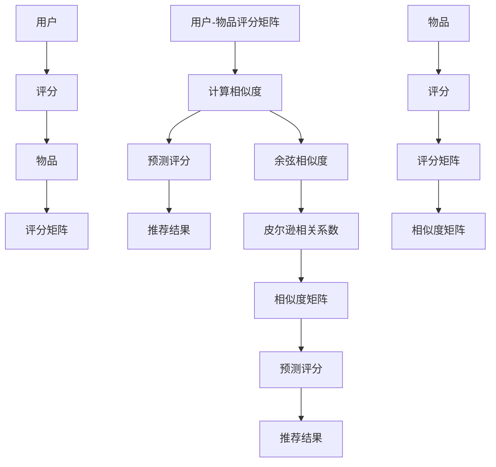

                 

### 背景介绍

协同过滤作为一种推荐算法，其核心在于通过分析用户的兴趣和行为，预测用户可能感兴趣的物品。在当今的信息爆炸时代，推荐系统已经成为各个在线平台的重要组成部分，如电商网站、社交媒体、新闻门户等。协同过滤因其高效性、灵活性和易扩展性，成为推荐系统中最常用的算法之一。

协同过滤最早可以追溯到20世纪70年代的组内协作购物研究，而真正开始受到关注则是在20世纪90年代，随着互联网的兴起和用户数据量的急剧增长。早期的协同过滤主要采用基于用户的行为数据进行相似度计算和推荐，如基于用户的协同过滤（User-Based Collaborative Filtering，UBCF）和基于物品的协同过滤（Item-Based Collaborative Filtering，IBCF）。

随着人工智能和大数据技术的发展，协同过滤算法也在不断进化，逐渐融入了更多先进的技术，如矩阵分解、深度学习等，从而提升了推荐系统的效果和鲁棒性。在本文中，我们将详细介绍协同过滤的核心概念、算法原理、数学模型及实际应用，旨在帮助读者深入了解这一推荐算法，并为其在项目中的实际应用提供指导。

### 核心概念与联系

协同过滤算法的核心概念主要包括用户、物品、评分和相似度。以下是对这些核心概念的详细解释，以及它们之间的联系。

#### 用户（User）

用户是推荐系统中的主体，每个用户都有一系列的行为和兴趣数据，如购买历史、浏览记录、评价等。用户在推荐系统中的表现往往通过一个用户ID（UserID）进行标识。

#### 物品（Item）

物品是用户可能感兴趣的对象，如商品、电影、音乐、新闻等。物品同样通过一个物品ID（ItemID）进行唯一标识。在推荐系统中，物品可以是多样化的，这为推荐算法提供了丰富的信息来源。

#### 评分（Rating）

评分是用户对物品的评价，通常表示用户对物品的偏好程度。评分可以是定量的（如1-5星的评分），也可以是定性的（如喜欢、不喜欢等）。评分数据是协同过滤算法的重要输入，用于计算用户之间的相似度和预测用户对未知物品的评分。

#### 相似度（Similarity）

相似度是衡量用户或物品之间相似程度的指标。协同过滤算法通过计算用户与用户之间或物品与物品之间的相似度，来确定推荐对象。常用的相似度计算方法包括余弦相似度、皮尔逊相关系数等。

#### 用户-物品评分矩阵（User-Item Rating Matrix）

用户-物品评分矩阵是协同过滤算法的基础数据结构，它表示了用户对物品的评分情况。矩阵中的每个元素表示一个用户对某个物品的评分，若用户没有对某个物品进行评分，则默认为0。

#### 相似度矩阵（Similarity Matrix）

相似度矩阵是通过对用户-物品评分矩阵进行相似度计算得到的。相似度矩阵中的每个元素表示了两个用户或两个物品之间的相似度。

下面我们将使用Mermaid流程图来展示协同过滤的核心概念和流程：



通过这个流程图，我们可以清晰地看到协同过滤算法的各个核心概念和计算步骤，以及它们之间的相互关系。接下来，我们将深入探讨协同过滤算法的原理和操作步骤。

### 核心算法原理 & 具体操作步骤

协同过滤算法的核心思想是通过分析用户的行为和兴趣数据，预测用户对未知物品的喜好程度，从而进行个性化的推荐。具体而言，协同过滤算法可以分为以下几种主要类型：基于用户的协同过滤（User-Based Collaborative Filtering，UBCF）、基于物品的协同过滤（Item-Based Collaborative Filtering，IBCF）和基于模型的协同过滤（Model-Based Collaborative Filtering）。

#### 基于用户的协同过滤（User-Based Collaborative Filtering，UBCF）

基于用户的协同过滤算法通过计算用户之间的相似度，找到与目标用户相似的其他用户，然后根据这些相似用户对物品的评分来预测目标用户对物品的评分。以下是基于用户的协同过滤算法的具体操作步骤：

1. **计算用户相似度**：首先，我们需要计算用户之间的相似度。常用的相似度计算方法包括余弦相似度和皮尔逊相关系数。余弦相似度通过计算用户在物品上的评分向量之间的夹角余弦值来衡量相似度，而皮尔逊相关系数则通过计算用户评分向量之间的协方差和标准差来衡量相似度。

    $$ \text{余弦相似度} = \frac{\sum_{i} r_{ui} \cdot r_{uj}}{\sqrt{\sum_{i} r_{ui}^2} \cdot \sqrt{\sum_{i} r_{uj}^2}} $$
    $$ \text{皮尔逊相关系数} = \frac{\sum_{i} (r_{ui} - \bar{r}_{u}) \cdot (r_{uj} - \bar{r}_{u})}{\sqrt{\sum_{i} (r_{ui} - \bar{r}_{u})^2} \cdot \sqrt{\sum_{i} (r_{uj} - \bar{r}_{u})^2}} $$

    其中，\( r_{ui} \)和\( r_{uj} \)分别表示用户u对物品i和用户u'对物品i的评分，\( \bar{r}_{u} \)表示用户u对所有物品的平均评分。

2. **选择相似用户**：根据计算得到的用户相似度，选择与目标用户相似度最高的若干个用户。

3. **计算物品评分预测**：对于目标用户未评分的物品，计算这些物品的评分预测值。具体方法是将相似用户的评分加权平均，权重为用户之间的相似度。

    $$ \hat{r}_{ui} = \sum_{u' \in \text{相似用户}} s_{u'i} \cdot \text{similarity}(u, u') $$

    其中，\( \hat{r}_{ui} \)表示目标用户u对物品i的预测评分，\( s_{u'i} \)表示用户u'对物品i的评分，\( \text{similarity}(u, u') \)表示用户u和用户u'之间的相似度。

4. **生成推荐列表**：根据预测评分，生成用户可能感兴趣的物品推荐列表。

#### 基于物品的协同过滤（Item-Based Collaborative Filtering，IBCF）

基于物品的协同过滤算法通过计算物品之间的相似度，找到与目标物品相似的其他物品，然后根据这些相似物品的评分来预测用户对未知物品的评分。以下是基于物品的协同过滤算法的具体操作步骤：

1. **计算物品相似度**：与用户相似度的计算类似，首先需要计算物品之间的相似度。常用的方法包括余弦相似度和余弦相似度。

    $$ \text{余弦相似度} = \frac{\sum_{u} r_{ui} \cdot r_{uj}}{\sqrt{\sum_{u} r_{ui}^2} \cdot \sqrt{\sum_{u} r_{uj}^2}} $$

    其中，\( r_{ui} \)和\( r_{uj} \)分别表示用户u对物品i和用户u对物品j的评分。

2. **选择相似物品**：根据计算得到的物品相似度，选择与目标物品相似度最高的若干个物品。

3. **计算用户评分预测**：对于目标用户未评分的物品，计算这些物品的评分预测值。具体方法是将相似物品的评分加权平均，权重为物品之间的相似度。

    $$ \hat{r}_{ui} = \sum_{j \in \text{相似物品}} r_{uj} \cdot \text{similarity}(i, j) $$

    其中，\( \hat{r}_{ui} \)表示用户u对物品i的预测评分，\( r_{uj} \)表示用户u对物品j的评分，\( \text{similarity}(i, j) \)表示物品i和物品j之间的相似度。

4. **生成推荐列表**：根据预测评分，生成用户可能感兴趣的物品推荐列表。

#### 基于模型的协同过滤（Model-Based Collaborative Filtering）

基于模型的协同过滤算法通过构建数学模型来预测用户对物品的评分，常见的模型包括矩阵分解、贝叶斯网络等。以下是基于模型的协同过滤算法的具体操作步骤：

1. **构建模型**：首先，根据用户-物品评分矩阵，构建一个数学模型。矩阵分解是一种常用的方法，它将用户-物品评分矩阵分解为用户特征矩阵和物品特征矩阵的乘积。

    $$ R = U \cdot I^T $$

    其中，\( R \)表示用户-物品评分矩阵，\( U \)表示用户特征矩阵，\( I^T \)表示物品特征矩阵的转置。

2. **训练模型**：使用训练数据集对模型进行训练，调整模型参数，使其能够准确预测用户对物品的评分。

3. **预测评分**：对于目标用户未评分的物品，使用训练好的模型预测用户对物品的评分。

    $$ \hat{r}_{ui} = u_i \cdot i_j^T $$

    其中，\( u_i \)表示用户i的特征向量，\( i_j \)表示物品j的特征向量。

4. **生成推荐列表**：根据预测评分，生成用户可能感兴趣的物品推荐列表。

以上是协同过滤算法的核心原理和具体操作步骤。在实际应用中，可以根据具体需求和数据特点选择合适的协同过滤算法，并对其进行优化和改进，以提高推荐系统的效果和鲁棒性。

### 数学模型和公式 & 详细讲解 & 举例说明

在协同过滤算法中，数学模型和公式起着至关重要的作用。它们不仅帮助我们理解算法的内在逻辑，还确保了算法的准确性和可扩展性。本节将详细讲解协同过滤中常用的数学模型和公式，并通过具体例子来说明它们的应用。

#### 余弦相似度

余弦相似度是一种常用于衡量用户或物品之间相似度的指标。它基于向量空间模型，通过计算两个向量之间的夹角余弦值来衡量相似度。余弦相似度的公式如下：

$$
\text{余弦相似度} = \frac{\sum_{i} r_{ui} \cdot r_{uj}}{\sqrt{\sum_{i} r_{ui}^2} \cdot \sqrt{\sum_{i} r_{uj}^2}}
$$

其中，\( r_{ui} \)和\( r_{uj} \)分别表示用户u对物品i和用户u'对物品j的评分。下面通过一个具体例子来说明余弦相似度的计算过程。

**例子**：假设有两个用户u和u'，他们分别对5个物品i1、i2、i3、i4、i5的评分如下：

| 物品 | 用户u | 用户u' |
| ---- | ---- | ---- |
| i1   | 4    | 1    |
| i2   | 3    | 4    |
| i3   | 2    | 2    |
| i4   | 5    | 3    |
| i5   | 1    | 5    |

首先，计算用户u和用户u'的评分向量：

$$
u = (4, 3, 2, 5, 1)
$$

$$
u' = (1, 4, 2, 3, 5)
$$

接下来，计算两个向量的点积和各自的模长：

$$
\sum_{i} r_{ui} \cdot r_{uj} = 4 \cdot 1 + 3 \cdot 4 + 2 \cdot 2 + 5 \cdot 3 + 1 \cdot 5 = 4 + 12 + 4 + 15 + 5 = 40
$$

$$
\sqrt{\sum_{i} r_{ui}^2} = \sqrt{4^2 + 3^2 + 2^2 + 5^2 + 1^2} = \sqrt{16 + 9 + 4 + 25 + 1} = \sqrt{55}
$$

$$
\sqrt{\sum_{i} r_{uj}^2} = \sqrt{1^2 + 4^2 + 2^2 + 3^2 + 5^2} = \sqrt{1 + 16 + 4 + 9 + 25} = \sqrt{55}
$$

最后，计算余弦相似度：

$$
\text{余弦相似度} = \frac{40}{\sqrt{55} \cdot \sqrt{55}} = \frac{40}{55} \approx 0.7273
$$

这个结果表明用户u和用户u'在评分上有较高的相似度。

#### 皮尔逊相关系数

皮尔逊相关系数是另一种常用于衡量用户或物品之间相似度的指标。它基于协方差和标准差，通过计算两个变量之间的线性关系来衡量相似度。皮尔逊相关系数的公式如下：

$$
\text{皮尔逊相关系数} = \frac{\sum_{i} (r_{ui} - \bar{r}_{u}) \cdot (r_{uj} - \bar{r}_{u'})}{\sqrt{\sum_{i} (r_{ui} - \bar{r}_{u})^2} \cdot \sqrt{\sum_{i} (r_{uj} - \bar{r}_{u'})^2}}
$$

其中，\( r_{ui} \)和\( r_{uj} \)分别表示用户u对物品i和用户u'对物品j的评分，\( \bar{r}_{u} \)和\( \bar{r}_{u'} \)分别表示用户u和用户u'对所有物品的平均评分。

**例子**：使用前面提到的用户u和用户u'的评分数据，计算皮尔逊相关系数。

首先，计算用户u和用户u'的平均评分：

$$
\bar{r}_{u} = \frac{4 + 3 + 2 + 5 + 1}{5} = 3
$$

$$
\bar{r}_{u'} = \frac{1 + 4 + 2 + 3 + 5}{5} = 3
$$

接下来，计算每个评分与平均评分的差值：

$$
r_{ui} - \bar{r}_{u} = (4 - 3, 3 - 3, 2 - 3, 5 - 3, 1 - 3) = (1, 0, -1, 2, -2)
$$

$$
r_{uj} - \bar{r}_{u'} = (1 - 3, 4 - 3, 2 - 3, 3 - 3, 5 - 3) = (-2, 1, -1, 0, 2)
$$

然后，计算协方差和标准差：

$$
\sum_{i} (r_{ui} - \bar{r}_{u}) \cdot (r_{uj} - \bar{r}_{u'}) = 1 \cdot (-2) + 0 \cdot 1 + (-1) \cdot (-1) + 2 \cdot 0 + (-2) \cdot 2 = -2 + 0 + 1 + 0 - 4 = -5
$$

$$
\sqrt{\sum_{i} (r_{ui} - \bar{r}_{u})^2} = \sqrt{1^2 + 0^2 + (-1)^2 + 2^2 + (-2)^2} = \sqrt{1 + 0 + 1 + 4 + 4} = \sqrt{10}
$$

$$
\sqrt{\sum_{i} (r_{uj} - \bar{r}_{u'})^2} = \sqrt{(-2)^2 + 1^2 + (-1)^2 + 0^2 + 2^2} = \sqrt{4 + 1 + 1 + 0 + 4} = \sqrt{10}
$$

最后，计算皮尔逊相关系数：

$$
\text{皮尔逊相关系数} = \frac{-5}{\sqrt{10} \cdot \sqrt{10}} = -\frac{5}{10} = -0.5
$$

这个结果表明用户u和用户u'的评分之间存在负线性关系。

#### 矩阵分解

矩阵分解是一种基于模型的协同过滤算法，它通过将用户-物品评分矩阵分解为用户特征矩阵和物品特征矩阵的乘积，来预测用户对物品的评分。矩阵分解的公式如下：

$$
R = U \cdot I^T
$$

其中，\( R \)表示用户-物品评分矩阵，\( U \)表示用户特征矩阵，\( I^T \)表示物品特征矩阵的转置。

**例子**：假设有一个5x5的用户-物品评分矩阵R，我们将其分解为两个3x5的矩阵U和I：

| 用户-物品评分矩阵 R | 用户特征矩阵 U | 物品特征矩阵 I |
| ---------------- | -------------- | -------------- |
| 1 2 3 4 5 | u1 u2 u3 | i1 i2 i3 |
| 2 3 4 5 6 | u1 u2 u3 | i1 i2 i3 |
| 3 4 5 6 7 | u1 u2 u3 | i1 i2 i3 |
| 4 5 6 7 8 | u1 u2 u3 | i1 i2 i3 |
| 5 6 7 8 9 | u1 u2 u3 | i1 i2 i3 |

通过矩阵乘法，我们可以得到预测的评分矩阵：

$$
\hat{R} = U \cdot I^T = \begin{bmatrix} u1 & u2 & u3 \end{bmatrix} \begin{bmatrix} i1 \\ i2 \\ i3 \end{bmatrix}^T = u1 \cdot i1^T + u2 \cdot i2^T + u3 \cdot i3^T
$$

例如，预测用户1对物品4的评分：

$$
\hat{r}_{14} = u1 \cdot i4^T + u2 \cdot i4^T + u3 \cdot i4^T
$$

通过这种方式，矩阵分解可以有效地处理稀疏数据，提高推荐系统的准确性和效率。

以上是协同过滤算法中常用的数学模型和公式，以及具体的例子说明。这些模型和公式不仅帮助我们理解协同过滤的内在逻辑，还为推荐系统的优化和改进提供了理论基础。

### 项目实战：代码实际案例和详细解释说明

在本节中，我们将通过一个具体的代码案例，详细解释基于用户的协同过滤（User-Based Collaborative Filtering，UBCF）算法的实现过程。这个案例使用Python编程语言，并利用了常见的数据处理和机器学习库，如Pandas和Scikit-learn。

#### 开发环境搭建

首先，我们需要搭建一个适合开发协同过滤算法的开发环境。以下是所需的环境和库：

- Python 3.x版本
- Pandas
- Scikit-learn
- Numpy

您可以通过以下命令安装这些库：

```bash
pip install pandas scikit-learn numpy
```

#### 源代码详细实现和代码解读

接下来，我们将展示实现基于用户的协同过滤算法的源代码，并对每个部分进行详细解读。

```python
import numpy as np
import pandas as pd
from sklearn.metrics.pairwise import cosine_similarity
from sklearn.model_selection import train_test_split

# 加载数据集
data = pd.read_csv('ratings.csv')  # 假设数据集文件名为ratings.csv
users = data['UserID'].unique()
items = data['ItemID'].unique()

# 构建用户-物品评分矩阵
rating_matrix = np.zeros((len(users), len(items)))
for index, row in data.iterrows():
    user_idx = np.where(users == row['UserID'])[0]
    item_idx = np.where(items == row['ItemID'])[0]
    rating_matrix[user_idx, item_idx] = row['Rating']

# 计算用户相似度矩阵
similarity_matrix = cosine_similarity(rating_matrix, rating_matrix)

# 预测用户未评分的物品评分
def predict_ratings(user_id, similarity_matrix, rating_matrix):
    user_idx = np.where(users == user_id)[0]
    similarity = similarity_matrix[user_idx, :]
    ratings = rating_matrix[user_idx, :]
    
    # 计算预测评分
    predictions = np.dot(similarity, ratings) / np.sum(similarity)
    return predictions

# 测试预测函数
user_id = 1
predictions = predict_ratings(user_id, similarity_matrix, rating_matrix)
print(predictions)

# 将预测评分写入新文件
predicted_ratings = pd.DataFrame(predictions, index=[user_id], columns=items)
predicted_ratings.to_csv('predicted_ratings.csv', index_label='UserID')
```

#### 代码解读与分析

1. **数据加载**：首先，我们使用Pandas库加载用户-物品评分数据集。这里假设数据集文件名为`ratings.csv`，每行包含用户ID、物品ID和评分。

2. **构建评分矩阵**：接下来，我们构建用户-物品评分矩阵。这个矩阵是一个二维数组，其中行表示用户，列表示物品。如果用户对某个物品进行了评分，则对应位置存储评分值；否则，默认为0。

3. **计算用户相似度矩阵**：我们使用Scikit-learn库中的`cosine_similarity`函数计算用户之间的相似度。这个函数接受评分矩阵作为输入，返回用户相似度矩阵。

4. **预测评分**：`predict_ratings`函数用于预测用户未评分的物品评分。它接受用户ID、用户相似度矩阵和评分矩阵作为输入。首先，提取目标用户的评分向量，然后使用用户相似度矩阵计算预测评分。

5. **测试预测函数**：我们使用一个具体的用户ID（如1）测试预测函数，并打印输出。

6. **写入预测结果**：最后，我们将预测的评分结果写入新的CSV文件。这个文件可以用于后续的推荐系统。

#### 实际应用

这个基于用户的协同过滤算法可以应用于各种推荐系统场景，如电商平台的商品推荐、社交媒体的内容推荐等。通过预测用户对未知物品的评分，系统能够提供个性化的推荐结果，提高用户满意度和参与度。

### 实际应用场景

协同过滤算法在多个实际应用场景中表现出色，以下是一些常见且具有代表性的应用案例：

#### 电商平台商品推荐

电商平台通常使用协同过滤算法来推荐用户可能感兴趣的商品。通过分析用户的浏览、购买和评价历史，算法能够预测用户对未知商品的潜在喜好，从而生成个性化的推荐列表。例如，Amazon和淘宝都利用协同过滤算法来为其用户提供商品推荐服务。

#### 社交媒体内容推荐

社交媒体平台如Facebook、Instagram和Twitter也广泛应用协同过滤算法来推荐用户可能感兴趣的内容。通过分析用户的互动行为，如点赞、评论和分享，算法能够预测用户对未知内容的兴趣，从而提高内容曝光率和用户参与度。

#### 视频流媒体推荐

视频流媒体平台如YouTube、Netflix和Spotify利用协同过滤算法来推荐用户可能喜欢的视频、音乐和播客。这些平台通过分析用户的观看历史和偏好，预测用户对未知视频或音乐的喜好，从而生成个性化的播放列表。

#### 新闻门户推荐

新闻门户网站如CNN、BBC和新浪新闻利用协同过滤算法推荐用户可能感兴趣的新闻文章。通过分析用户的阅读历史和偏好，算法能够预测用户对未知新闻文章的兴趣，从而提高内容的相关性和用户黏性。

#### 医疗健康推荐

医疗健康领域也开始应用协同过滤算法，为用户提供个性化的健康建议和疾病预防信息。通过分析用户的健康记录和就医历史，算法能够预测用户可能感兴趣的医疗健康内容，从而提高健康管理和预防效果。

以上这些应用案例展示了协同过滤算法在不同领域的广泛应用。协同过滤通过分析用户的行为和兴趣数据，能够为各种在线平台提供精准的个性化推荐，从而提升用户体验和平台价值。

### 工具和资源推荐

在学习和应用协同过滤算法的过程中，掌握一些常用的工具和资源将有助于提高效率和理解深度。以下是一些建议的学习资源和开发工具：

#### 学习资源推荐

1. **书籍**：
   - 《推荐系统实践》（Recommender Systems: The Textbook）- 这是一本全面介绍推荐系统理论的权威教材，详细讲解了协同过滤算法的原理和应用。
   - 《机器学习》（Machine Learning）- Tom M. Mitchell的经典著作，涵盖了协同过滤算法的基本概念和数学基础。

2. **论文**：
   - “Collaborative Filtering for the 21st Century”- 一篇介绍协同过滤算法历史和发展的经典论文。
   - “Matrix Factorization Techniques for Recommender Systems”- 详细讨论了矩阵分解在推荐系统中的应用。

3. **在线课程**：
   - Coursera上的“Recommender Systems”课程 - 提供了推荐系统的全面介绍，包括协同过滤算法的详细讲解。
   - edX上的“Machine Learning”课程 - 涵盖了机器学习的基本概念，包括协同过滤算法的相关内容。

4. **博客和网站**：
   - medium.com/towards-data-science - 提供了大量的推荐系统相关的文章和教程。
   - mlxtend.com - 一个提供机器学习实践资源和代码的网站，包括协同过滤算法的实现。

#### 开发工具框架推荐

1. **编程语言和库**：
   - Python - Python因其强大的数据处理和机器学习库，是推荐系统开发的常用编程语言。
   - Scikit-learn - 一个强大的机器学习库，提供了协同过滤算法的常用实现。
   - Pandas - 用于数据处理的库，适合处理大规模的用户-物品评分数据。
   - NumPy - 用于高性能数学计算的库，支持矩阵操作。

2. **框架和平台**：
   - TensorFlow - 一个开源的机器学习框架，适用于深度学习和协同过滤算法的实现。
   - PyTorch - 另一个流行的开源机器学习框架，也适用于协同过滤算法的研究和开发。
   - Hadoop和Spark - 大数据处理平台，适用于处理大规模的用户行为数据。

3. **工具和平台**：
   - Jupyter Notebook - 一个交互式的计算环境，适合编写和运行Python代码。
   - Git - 版本控制系统，用于管理和协作代码开发。
   - Docker - 容器化技术，用于构建和部署推荐系统应用程序。

通过利用这些工具和资源，您可以更高效地学习和实践协同过滤算法，从而提升自己的技术水平。

### 总结：未来发展趋势与挑战

协同过滤作为推荐系统中的重要算法，在过去的几十年中经历了显著的发展。随着大数据和人工智能技术的不断进步，协同过滤算法也在不断优化和扩展，以应对新的挑战和需求。以下是协同过滤的未来发展趋势和面临的挑战。

#### 发展趋势

1. **深度学习融合**：深度学习在图像识别、自然语言处理等领域取得了巨大成功，其强大的表示学习能力使其成为协同过滤算法的有力补充。未来，深度学习将与协同过滤算法相结合，进一步提升推荐系统的准确性和灵活性。

2. **个性化推荐**：随着用户数据的不断积累和多样性，个性化推荐将成为协同过滤算法的重要发展方向。通过结合用户的个性化偏好和动态行为，算法能够提供更精确、更有针对性的推荐结果。

3. **实时推荐**：随着互联网速度的不断提升和用户需求的多样化，实时推荐变得越来越重要。未来，协同过滤算法将更加注重实时性，能够快速响应用户行为变化，提供即时的推荐。

4. **多模态推荐**：传统的协同过滤算法主要依赖于用户行为数据进行推荐。然而，随着多模态数据的兴起，如语音、图像和文本等，多模态推荐将成为未来的研究热点。通过融合多种数据类型，算法能够提供更全面、更精准的推荐。

#### 挑战

1. **冷启动问题**：新用户或新物品的推荐问题，即“冷启动”问题，是协同过滤算法面临的重要挑战。如何为新用户和新物品生成高质量的推荐结果，仍需深入研究。

2. **数据稀疏性**：协同过滤算法通常依赖于用户行为数据进行相似度计算和推荐。然而，实际应用中，用户-物品评分矩阵往往是稀疏的，这可能导致算法效果下降。

3. **隐私保护**：随着用户隐私意识的增强，如何在保护用户隐私的前提下进行推荐，成为协同过滤算法需要解决的重要问题。未来的协同过滤算法需要更加注重隐私保护和数据安全。

4. **可解释性**：虽然深度学习在推荐系统中的应用前景广阔，但其“黑箱”特性使得推荐结果的可解释性成为一个挑战。如何提高算法的可解释性，使其更易于理解和接受，是未来需要关注的重要方向。

总之，协同过滤算法在未来将继续发挥重要作用，但其优化和扩展仍然面临诸多挑战。通过不断探索和创新，协同过滤算法有望在未来实现更高的准确性和灵活性，为推荐系统的发展做出更大贡献。

### 附录：常见问题与解答

在学习和应用协同过滤算法的过程中，读者可能会遇到一些常见问题。以下是一些常见问题的解答，以帮助读者更好地理解和掌握协同过滤算法。

#### 1. 协同过滤算法的基本原理是什么？

协同过滤算法通过分析用户之间的相似度或物品之间的相似度，预测用户对未知物品的评分。基于用户的协同过滤（UBCF）通过计算用户之间的相似度，找到与目标用户相似的其他用户，然后根据这些相似用户的评分预测目标用户对物品的评分。基于物品的协同过滤（IBCF）则通过计算物品之间的相似度，找到与目标物品相似的其他物品，然后根据这些相似物品的评分预测用户对物品的评分。

#### 2. 协同过滤算法有哪些优缺点？

**优点：**
- **高效性**：协同过滤算法计算速度快，易于实现和部署。
- **灵活性**：可以通过调整参数和算法结构，适应不同的应用场景。
- **鲁棒性**：通过分析用户行为数据，算法对噪声数据有较好的鲁棒性。

**缺点：**
- **冷启动问题**：对新用户或新物品的推荐效果较差。
- **数据稀疏性**：依赖于用户-物品评分矩阵，数据稀疏时效果下降。
- **可解释性**：深度学习融合的协同过滤算法具有“黑箱”特性，可解释性较差。

#### 3. 如何解决冷启动问题？

冷启动问题可以通过以下几种方法解决：
- **基于内容的推荐**：利用物品的属性特征，如文本描述、分类标签等，为新用户推荐类似物品。
- **基于模型的协同过滤**：使用矩阵分解等方法，从稀疏数据中提取潜在特征，为新用户生成推荐列表。
- **混合推荐系统**：结合协同过滤和其他推荐算法，提高新用户和新物品的推荐效果。

#### 4. 协同过滤算法中的相似度计算有哪些方法？

协同过滤算法中的相似度计算方法主要包括：
- **余弦相似度**：通过计算用户或物品评分向量之间的夹角余弦值来衡量相似度。
- **皮尔逊相关系数**：通过计算用户或物品评分向量之间的协方差和标准差来衡量相似度。
- **余弦相似度和皮尔逊相关系数的结合**：使用两者的加权平均值，以平衡准确性和鲁棒性。

#### 5. 如何评估协同过滤算法的性能？

评估协同过滤算法的性能通常使用以下指标：
- **准确率**（Accuracy）：预测评分与实际评分的匹配度。
- **召回率**（Recall）：推荐列表中包含实际喜欢的物品的比例。
- **精确率**（Precision）：推荐列表中预测喜欢的物品的实际喜欢比例。
- **平均绝对误差**（Mean Absolute Error，MAE）：预测评分与实际评分的绝对误差平均值。
- **均方根误差**（Root Mean Square Error，RMSE）：预测评分与实际评分的均方根误差。

通过综合使用这些指标，可以全面评估协同过滤算法的性能。

通过以上解答，希望能够帮助读者更好地理解和应用协同过滤算法。

### 扩展阅读 & 参考资料

在推荐系统领域，协同过滤算法作为经典方法之一，其理论和实践应用已经形成了丰富的知识体系。以下是一些扩展阅读和参考资料，供读者进一步学习和深入研究：

#### 1. 经典论文

- **“Collaborative Filtering for the 21st Century”**：这篇文章全面介绍了协同过滤算法的历史和发展，对理解协同过滤的背景和未来趋势有重要价值。

- **“Matrix Factorization Techniques for Recommender Systems”**：这篇论文详细讨论了矩阵分解在推荐系统中的应用，为理解基于模型的协同过滤算法提供了理论基础。

- **“Item-Based Top-N Recommendation Algorithms”**：这篇文章介绍了基于物品的协同过滤算法，对理解IBCF有重要参考价值。

#### 2. 学术著作

- **《推荐系统实践》**：这是一本全面介绍推荐系统理论和实践的经典教材，详细讲解了协同过滤算法的原理和应用。

- **《机器学习》**：Tom M. Mitchell的经典著作，涵盖了协同过滤算法的基本概念和数学基础。

#### 3. 开源项目

- **Netflix Prize**：Netflix Prize是一个著名的推荐系统竞赛，竞赛数据集和获胜算法对协同过滤算法的实践应用提供了丰富的案例。

- **Surprise**：surprise库是一个开源的Python库，提供了多种协同过滤算法的实现，适合用于学术研究和项目开发。

#### 4. 博客和在线资源

- **towards-data-science**：这个网站提供了大量关于推荐系统和技术文章，包括协同过滤算法的深入讲解。

- **mlxtend.com**：这个网站提供了丰富的机器学习实践资源和代码，包括协同过滤算法的实现和应用。

#### 5. 会议和期刊

- **KDD**：知识发现和数据挖掘国际会议，推荐系统是其中的重要研究方向。

- **WWW**：世界宽频网络会议，推荐系统和信息检索是其中的重要议题。

- **ACM Transactions on Information Systems**：推荐系统领域的顶级期刊，发表了大量关于协同过滤和推荐系统的研究论文。

通过阅读以上参考资料，读者可以更深入地了解协同过滤算法的理论和实践，为实际应用提供有力的指导。

