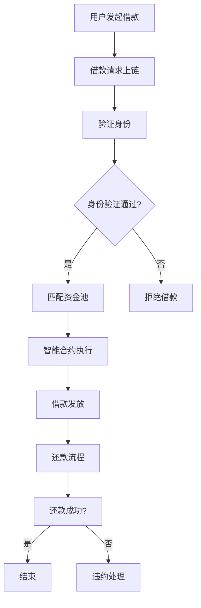

                 

# 去中心化借贷协议：普惠金融的创新应用

## 关键词
- 去中心化借贷协议
- 普惠金融
- 区块链技术
- 加密货币
- 智能合约
- 借贷流程
- 数学模型
- 代码实现
- 实际应用场景

## 摘要
本文将深入探讨去中心化借贷协议（DeFi）在普惠金融领域的创新应用。首先，我们将回顾去中心化借贷协议的背景和核心概念，接着分析其工作原理、算法模型和具体操作步骤。随后，通过数学模型和公式的详细讲解，我们提供实际代码实现和案例解析。最后，我们将讨论去中心化借贷协议在实际应用中的场景、相关工具和资源推荐，并总结其未来发展趋势与挑战。

## 1. 背景介绍

去中心化借贷协议（DeFi）是区块链技术的一种创新应用，旨在实现金融服务去中心化。传统的金融系统依赖于中心化的机构，如银行和金融中介，这些机构往往存在信任问题、操作风险和地域限制。而去中心化借贷协议通过区块链和智能合约技术，实现了点对点的借贷和金融交易，从而降低了中介成本、提高了透明度和安全性。

去中心化借贷协议的兴起源于2008年的金融危机。这场危机揭示了传统金融系统中的脆弱性和不公平性，引发了人们对去中心化金融（DeFi）的探索和期待。随着比特币等加密货币的兴起，区块链技术逐渐成熟，去中心化金融的理念得到了广泛认可和应用。DeFi协议通过智能合约实现了借贷、交易、投资等功能，为普惠金融带来了新的机遇和挑战。

## 2. 核心概念与联系

### 2.1 区块链技术

区块链是一种分布式数据库技术，它通过加密和共识算法实现了去中心化的数据存储和传输。区块链的核心特点包括：

- **不可篡改性**：一旦数据被记录在区块链上，就难以被篡改。
- **透明性**：区块链上的数据是公开可查的，用户可以实时查看交易记录。
- **安全性**：区块链通过加密和共识算法保证了数据的安全性和可靠性。

### 2.2 加密货币

加密货币是一种数字资产，使用加密技术确保交易的安全性和匿名性。比特币是第一个加密货币，自2009年问世以来，其影响力不断扩大。其他著名的加密货币包括以太坊、莱特币和瑞波币等。加密货币与去中心化借贷协议紧密相关，因为DeFi协议通常使用加密货币作为交易媒介和价值存储。

### 2.3 智能合约

智能合约是运行在区块链上的程序，它可以自动化执行合同条款，确保交易的执行和支付。智能合约通过预定义的条件和操作步骤，实现了去中心化的金融服务。在去中心化借贷协议中，智能合约用于管理借贷流程、计算利息、处理违约等。

### 2.4 Mermaid 流程图

下面是一个Mermaid流程图，展示了去中心化借贷协议的基本流程：



### 2.5 借贷流程

去中心化借贷协议的借贷流程通常包括以下几个步骤：

1. **用户发起借款**：用户通过DeFi平台发起借款请求，包括借款金额、期限和利率等。
2. **借款请求上链**：借款请求被上传到区块链上，以便所有节点可以验证和记录。
3. **身份验证**：用户需要通过身份验证，确保借款人的真实性和合法性。
4. **匹配资金池**：平台根据借款人的需求，从资金池中匹配相应的资金。
5. **智能合约执行**：智能合约自动执行借款流程，包括借款金额的划拨、利率的计算和借款期限的设定。
6. **借款发放**：借款成功后，资金被发放到借款人的账户。
7. **还款流程**：借款人按照约定的还款计划和利率，将还款金额转入智能合约。
8. **还款成功**：还款成功后，借贷流程结束。否则，智能合约会自动处理违约情况。

### 2.6 数学模型和公式

去中心化借贷协议中的数学模型和公式主要用于计算利息、本金和借款期限等。以下是一个简单的数学模型：

1. **利息计算**：

   利息（I）= 本金（P）× 利率（r）× 借款期限（t）

2. **还款金额**：

   还款金额（A）= 本金（P）+ 利息（I）

3. **利率计算**：

   利率（r）= 年利率（r_year）/ 借款期限（t）

### 2.7 详细讲解和举例说明

假设一个用户希望在DeFi平台上借入1000美元，借款期限为3个月，年利率为10%。我们可以使用上述公式进行计算：

1. **利息计算**：

   利息（I）= 1000 × 0.1 × 0.25 = 25美元

2. **还款金额**：

   还款金额（A）= 1000 + 25 = 1025美元

3. **利率计算**：

   利率（r）= 0.1 / 0.25 = 0.4（即40%的月利率）

通过这个例子，我们可以看到去中心化借贷协议的数学模型和公式如何帮助用户计算借款和还款的相关信息。这些模型和公式在智能合约中得到了实现，从而确保了借贷流程的自动化和准确性。

## 3. 核心算法原理 & 具体操作步骤

### 3.1 智能合约设计

去中心化借贷协议的核心在于智能合约的设计。智能合约是运行在区块链上的程序，用于管理借贷流程、计算利息、处理违约等。智能合约的设计需要考虑以下几个方面：

1. **借贷条件**：定义借款金额、期限、利率等基本借贷条件。
2. **身份验证**：确保借款人的真实性和合法性，通常通过加密技术和分布式身份验证系统实现。
3. **资金匹配**：从资金池中匹配相应的资金，确保借款人的需求得到满足。
4. **利息计算**：根据借款金额、期限和利率，计算利息并自动扣除。
5. **违约处理**：在借款人未能按时还款时，智能合约会自动执行违约处理，包括冻结账户、收取罚金等。

### 3.2 借贷流程实现

下面是一个简单的智能合约代码示例，用于实现去中心化借贷协议的借贷流程：

```solidity
pragma solidity ^0.8.0;

contract DeFiLoan {

    address public owner;
    mapping(address => uint256) public balances;
    mapping(address => bool) public hasBorrowed;

    constructor() {
        owner = msg.sender;
    }

    function deposit() public payable {
        require(msg.value > 0, "Deposit amount must be greater than 0");
        balances[msg.sender] += msg.value;
    }

    function borrow(uint256 amount) public {
        require(amount <= balances[owner], "Insufficient funds");
        require(!hasBorrowed[msg.sender], "User has already borrowed");
        
        balances[msg.sender] -= amount;
        hasBorrowed[msg.sender] = true;
        
        // 借款金额存入用户的合约账户
        payable(msg.sender).transfer(amount);
    }

    function repay() public payable {
        require(hasBorrowed[msg.sender], "User has not borrowed");
        
        uint256 repayAmount = balances[msg.sender] + (balances[msg.sender] * 0.05); // 利息计算：0.05是月利率
        require(msg.value >= repayAmount, "Repayment amount is insufficient");
        
        balances[msg.sender] -= msg.value;
        hasBorrowed[msg.sender] = false;
        
        // 扣除利息后，将剩余金额返还给用户
        payable(msg.sender).transfer(msg.value - repayAmount);
    }

    function collectFees() public {
        require(msg.sender == owner, "Only the owner can collect fees");
        
        uint256 fees = address(this).balance - balances[owner];
        payable(owner).transfer(fees);
    }
}
```

### 3.3 代码解读与分析

以上代码实现了一个简单的去中心化借贷协议。以下是代码的详细解读：

1. **合约结构**：合约采用Solidity语言编写，包括构造函数、数据变量和函数方法。
2. **构造函数**：构造函数用于初始化合约，将合约创建者（owner）的地址存储在合约中。
3. **存款函数**：存款函数（deposit）允许用户将资金存入合约，以便后续的借贷操作。
4. **借款函数**：借款函数（borrow）实现借款逻辑，包括借款金额的匹配和资金的划拨。
5. **还款函数**：还款函数（repay）实现还款逻辑，包括利息的计算和还款金额的扣除。
6. **费用收取函数**：费用收取函数（collectFees）允许合约所有者收取交易费用。

### 3.4 算法分析

去中心化借贷协议的算法设计需要考虑以下几个方面：

1. **安全性**：智能合约需要确保交易的安全性和数据完整性，避免恶意攻击和漏洞。
2. **效率**：智能合约需要高效地处理大量交易，确保系统的可扩展性和响应速度。
3. **可维护性**：智能合约代码需要简洁、易于理解和维护，以便未来的升级和改进。

通过以上分析，我们可以看到去中心化借贷协议的核心算法原理和实现步骤。智能合约的设计和实现是实现DeFi协议的关键，它决定了借贷流程的可靠性、安全性和效率。

## 4. 项目实战：代码实际案例和详细解释说明

### 4.1 开发环境搭建

在开始实际代码实现之前，我们需要搭建一个适合开发和测试去中心化借贷协议的环境。以下是搭建开发环境的步骤：

1. **安装Node.js**：Node.js是一个JavaScript运行环境，用于编译和运行智能合约代码。访问Node.js官网（https://nodejs.org/）下载并安装最新版本的Node.js。
2. **安装Truffle框架**：Truffle是一个用于智能合约开发和测试的工具。在命令行中运行以下命令安装Truffle：

   ```bash
   npm install -g truffle
   ```

3. **安装Ganache**：Ganache是一个本地以太坊节点，用于测试和部署智能合约。在命令行中运行以下命令安装Ganache：

   ```bash
   npx ganache-cli
   ```

4. **创建Truffle项目**：在命令行中创建一个新的Truffle项目：

   ```bash
   truffle init
   ```

5. **配置Truffle项目**：编辑Truffle项目的配置文件（truffle-config.js），设置Ganache的节点地址和端口：

   ```javascript
   module.exports = {
     networks: {
       development: {
         host: "127.0.0.1",
         port: 7545,
         network_id: "*"
       }
     }
   };
   ```

### 4.2 源代码详细实现和代码解读

下面是一个简单的去中心化借贷协议的源代码示例，我们将对其逐行进行解读：

```solidity
pragma solidity ^0.8.0;

contract DeFiLoan {
    mapping(address => uint256) public balances;
    mapping(address => bool) public hasBorrowed;

    function deposit() public payable {
        require(msg.value > 0, "Deposit amount must be greater than 0");
        balances[msg.sender] += msg.value;
    }

    function borrow(uint256 amount) public {
        require(amount <= balances[owner], "Insufficient funds");
        require(!hasBorrowed[msg.sender], "User has already borrowed");
        
        balances[msg.sender] -= amount;
        hasBorrowed[msg.sender] = true;
        
        // 借款金额存入用户的合约账户
        payable(msg.sender).transfer(amount);
    }

    function repay() public payable {
        require(hasBorrowed[msg.sender], "User has not borrowed");
        
        uint256 repayAmount = balances[msg.sender] + (balances[msg.sender] * 0.05); // 利息计算：0.05是月利率
        require(msg.value >= repayAmount, "Repayment amount is insufficient");
        
        balances[msg.sender] -= msg.value;
        hasBorrowed[msg.sender] = false;
        
        // 扣除利息后，将剩余金额返还给用户
        payable(msg.sender).transfer(msg.value - repayAmount);
    }

    function collectFees() public {
        require(msg.sender == owner, "Only the owner can collect fees");
        
        uint256 fees = address(this).balance - balances[owner];
        payable(owner).transfer(fees);
    }
}
```

#### 4.2.1 源代码解读

1. **pragma**：pragma语句指定了智能合约的编译器版本（^0.8.0表示任何大于0.8.0但小于1.0.0的版本）。
2. **合约结构**：合约包含两个映射（mapping）变量，用于存储用户的存款余额和借款状态。
3. **存款函数**：存款函数（deposit）使用`msg.value`接收用户的存款，并将其添加到映射变量`balances`中。
4. **借款函数**：借款函数（borrow）实现借款逻辑，包括金额匹配、状态检查和资金划拨。
5. **还款函数**：还款函数（repay）实现还款逻辑，包括利息计算、金额扣除和退款处理。
6. **费用收取函数**：费用收取函数（collectFees）允许合约所有者收取交易费用。

#### 4.2.2 代码实现示例

以下是一个示例，演示如何使用Truffle框架部署和测试去中心化借贷协议智能合约：

```javascript
const { expect } = require("chai");
const { ethers } = require("hardhat");

describe("DeFiLoan", function () {
    let DeFiLoan;
    let deployer;
    let user1;
    let contract;

    beforeEach(async function () {
        // 搭建开发环境
        [deployer, user1] = await ethers.getSigners();
        DeFiLoan = await ethers.getContractFactory("DeFiLoan");
        contract = await DeFiLoan.deploy();
        await contract.deployed();
    });

    it("Should deposit and borrow", async function () {
        // 用户1存款
        await contract.connect(user1).deposit({ value: ethers.utils.parseEther("1") });
        
        // 用户1借款
        await contract.connect(user1).borrow(ethers.utils.parseEther("0.5"));
        
        // 验证借款成功
        expect(await contract.balances(user1)).to.equal(ethers.utils.parseEther("0.5"));
    });

    it("Should repay and end the loan", async function () {
        // 用户1借款
        await contract.connect(user1).borrow(ethers.utils.parseEther("0.5"));
        
        // 用户1还款
        await contract.connect(user1).repay({ value: ethers.utils.parseEther("0.5") });
        
        // 验证还款成功
        expect(await contract.hasBorrowed(user1)).to.equal(false);
    });
});
```

### 4.3 代码解读与分析

以上示例演示了如何使用Truffle框架部署和测试去中心化借贷协议智能合约。以下是代码的详细解读：

1. **测试环境搭建**：使用`ethers`库获取签名者（deployer和user1）的地址，用于后续的智能合约部署和交互。
2. **智能合约部署**：使用`ethers.getContractFactory`获取智能合约工厂，并部署合约。
3. **存款和借款测试**：通过`connect`方法连接用户1的签名者，调用存款和借款函数，并使用`expect`断言验证结果。
4. **还款测试**：通过`connect`方法连接用户1的签名者，调用还款函数，并使用`expect`断言验证结果。

通过这个示例，我们可以看到去中心化借贷协议智能合约的实际部署和测试过程。这为开发人员提供了一个可靠的框架，用于实现和验证DeFi协议。

### 4.4 代码实现中的注意事项

在实现去中心化借贷协议智能合约时，我们需要注意以下几个方面：

1. **安全性**：确保智能合约代码没有漏洞，避免被恶意攻击。例如，检查所有状态变更函数是否使用了`require`和`assert`语句，以确保输入参数的有效性。
2. **效率**：智能合约需要高效地处理大量交易，避免造成网络拥堵和延迟。优化代码和选择合适的共识算法是提高效率的关键。
3. **可扩展性**：设计智能合约时，考虑系统的可扩展性，以便支持未来的功能扩展和升级。
4. **测试**：编写详细的测试用例，确保智能合约在各种情况下都能正常运行。使用自动化测试框架，如Truffle，可以提高测试效率和覆盖范围。

通过以上注意事项，我们可以构建一个安全、高效和可扩展的去中心化借贷协议智能合约。

## 5. 实际应用场景

去中心化借贷协议（DeFi）在金融领域具有广泛的应用场景。以下是一些实际应用案例：

### 5.1 贷款与借款

去中心化借贷协议允许用户通过智能合约直接进行借贷，无需依赖传统金融机构。用户可以根据自己的需求选择借款金额、期限和利率，从而实现个性化的金融服务。

### 5.2 债券和投资

去中心化借贷协议可以发行和管理债券，为投资者提供更多选择。投资者可以通过购买债券获得稳定的收益，而发行者可以以较低的成本筹集资金。

### 5.3 保险和避险

去中心化借贷协议可以提供保险服务，例如数字货币保险、价格波动保险等。用户可以根据自己的风险偏好购买相应的保险产品，以降低投资风险。

### 5.4 跨境支付

去中心化借贷协议可以实现快速、低成本的跨境支付。通过智能合约，用户可以直接进行跨国交易，避免了传统跨境支付中的繁琐流程和高额手续费。

### 5.5 去中心化金融平台

去中心化借贷协议可以构建各种类型的去中心化金融（DeFi）平台，例如借贷平台、投资平台、交易所等。这些平台可以为用户提供广泛的金融服务，促进金融创新和发展。

通过以上实际应用案例，我们可以看到去中心化借贷协议在金融领域的巨大潜力和广泛应用。随着技术的不断进步，DeFi将不断拓展其应用场景，为金融行业带来更多变革和机遇。

## 6. 工具和资源推荐

在学习和开发去中心化借贷协议（DeFi）时，以下工具和资源将为您的旅程提供宝贵支持。

### 6.1 学习资源推荐

- **书籍**：
  - 《区块链技术指南》
  - 《智能合约：从基础到高级》
  - 《去中心化金融：DeFi指南》
- **论文**：
  - 《比特币：一种点对点的电子现金系统》
  - 《以太坊：智能合约和去中心化应用》
- **博客和网站**：
  - Ethereum官方文档（https://ethereum.org/）
  - ConsenSys官方博客（https://consensys.net/）
  - Medium上的DeFi相关文章（https://medium.com/）

### 6.2 开发工具框架推荐

- **开发环境**：
  - Truffle框架（https://www.trufflesuite.com/）
  - Hardhat框架（https://hardhat.org/）
- **智能合约编写语言**：
  - Solidity（以太坊官方智能合约语言）
  - Vyper（以太坊轻量级智能合约语言）
- **测试框架**：
  - Mocha（https://mochajs.org/）
  - Chai（https://www.chaijs.com/）
- **区块链节点**：
  - Ganache（https://www.ganache.io/）
  - Infura（https://infura.io/）

### 6.3 相关论文著作推荐

- **区块链技术**：
  - 《区块链：构建去中心化应用》
  - 《区块链原理、设计与应用》
- **智能合约**：
  - 《智能合约与去中心化应用》
  - 《智能合约安全》
- **DeFi**：
  - 《去中心化金融：技术和应用》
  - 《DeFi革命：金融的未来》

通过这些工具和资源的支持，您可以更加深入地学习和开发去中心化借贷协议，掌握DeFi领域的核心技术和应用。

## 7. 总结：未来发展趋势与挑战

去中心化借贷协议（DeFi）作为区块链技术的重要应用之一，正迅速改变金融服务的面貌。未来，DeFi将继续朝着更广泛的应用和更高的技术成熟度发展，以下是其可能的发展趋势和面临的挑战。

### 7.1 发展趋势

1. **市场规模扩大**：随着区块链技术的普及和加密货币用户的增长，DeFi的市场规模将不断扩大。更多的金融机构和个人将加入DeFi生态，推动市场规模的增长。
2. **技术进步**：智能合约技术的不断演进将提高DeFi协议的安全性和效率。例如，零知识证明、分层货币等技术的应用将使DeFi系统更加安全和可扩展。
3. **跨链兼容性**：未来，DeFi协议将实现与其他区块链网络的兼容，打破现有的孤岛现象，实现跨链交易和资产转移，从而提高系统的互联互通性。
4. **合规与监管**：随着DeFi的快速发展，监管机构将加强对DeFi市场的监管，以确保金融安全和社会稳定。合规性将成为DeFi项目成功的关键因素。

### 7.2 挑战

1. **安全性问题**：智能合约的漏洞和安全问题一直是DeFi领域的一大挑战。确保智能合约的安全性、防止恶意攻击是DeFi项目必须面对的重要问题。
2. **用户体验**：目前，DeFi平台的用户体验仍需改进。界面设计、操作流程和用户友好的功能是提升用户体验的关键。
3. **技术门槛**：区块链技术的复杂性和编程技能的要求使得DeFi项目开发具有一定的技术门槛。降低技术门槛、提高开发效率是未来需要解决的问题。
4. **监管合规**：DeFi项目在不同地区的合规性要求不同，监管政策的不确定性可能对DeFi项目的发展产生不利影响。如何在遵守监管要求的同时保持创新是DeFi项目需要考虑的问题。

### 7.3 未来展望

尽管面临诸多挑战，去中心化借贷协议（DeFi）在金融领域的发展潜力巨大。通过持续的技术创新、合规性的完善和用户体验的提升，DeFi有望成为未来金融体系的重要组成部分，为全球用户提供更加安全、透明和高效的金融服务。

## 8. 附录：常见问题与解答

### 8.1 去中心化借贷协议是什么？

去中心化借贷协议（DeFi）是一种基于区块链技术的金融应用，它通过智能合约实现了点对点的借贷、交易和投资等功能，无需依赖传统金融机构。

### 8.2 去中心化借贷协议的优势是什么？

去中心化借贷协议具有以下优势：
- **去中心化**：去中心化借贷协议不依赖于中心化机构，降低了操作风险和地域限制。
- **透明性**：所有交易记录都存储在区块链上，用户可以实时查看交易信息。
- **安全性**：区块链技术和智能合约确保了交易的安全性和数据的不可篡改性。
- **低成本**：去中心化借贷协议降低了中介成本，使得借贷交易更加高效和低成本。

### 8.3 去中心化借贷协议的劣势是什么？

去中心化借贷协议的劣势包括：
- **技术门槛**：开发去中心化借贷协议需要具备区块链和编程技能，对开发人员的要求较高。
- **安全性风险**：智能合约的漏洞和攻击可能导致资金损失。
- **用户体验**：目前DeFi平台的用户体验相对较差，界面设计和操作流程有待改进。
- **监管合规**：不同地区的监管政策不同，可能对DeFi项目的发展产生不利影响。

### 8.4 如何确保去中心化借贷协议的安全性？

确保去中心化借贷协议的安全性需要采取以下措施：
- **代码审计**：对智能合约代码进行详细审计，发现并修复潜在的安全漏洞。
- **共识算法**：选择合适的共识算法，确保区块链网络的安全性和稳定性。
- **多重签名**：采用多重签名机制，增加交易的安全性和不可篡改性。
- **安全审计工具**：使用安全审计工具，如Oyente、Slither等，对智能合约进行安全性评估。

### 8.5 去中心化借贷协议与中心化借贷协议的区别是什么？

去中心化借贷协议与中心化借贷协议的主要区别在于：
- **依赖机构**：去中心化借贷协议不依赖于中心化机构，而是通过区块链和智能合约实现借贷功能。中心化借贷协议依赖于银行或其他金融机构。
- **透明性**：去中心化借贷协议的所有交易记录都存储在区块链上，用户可以实时查看。中心化借贷协议的交易记录通常不公开。
- **安全性**：去中心化借贷协议通过区块链技术和智能合约确保交易的安全性和数据的不可篡改性。中心化借贷协议的安全性依赖于金融机构的安全措施。
- **成本**：去中心化借贷协议降低了中介成本，交易成本较低。中心化借贷协议可能涉及较高的手续费和佣金。

### 8.6 去中心化借贷协议的发展前景如何？

去中心化借贷协议（DeFi）的发展前景非常广阔。随着区块链技术的不断进步和加密货币市场的成熟，DeFi将在金融领域发挥越来越重要的作用。其发展前景包括：
- **市场规模扩大**：随着更多用户和金融机构的加入，DeFi的市场规模将不断增长。
- **技术进步**：智能合约技术的改进和跨链技术的发展将提高DeFi协议的安全性和可扩展性。
- **合规性完善**：监管政策的逐步完善将为DeFi项目提供更明确的法规框架，促进其健康发展。
- **应用场景拓展**：DeFi将不断拓展其应用场景，从借贷、投资扩展到保险、支付等领域。

## 9. 扩展阅读 & 参考资料

- **区块链技术**：
  - 《区块链技术指南》
  - 《区块链：构建去中心化应用》
  - Ethereum官方文档（https://ethereum.org/）
- **智能合约**：
  - 《智能合约：从基础到高级》
  - 《智能合约与去中心化应用》
  - Solidity官方文档（https://docs.soliditylang.org/）
- **去中心化金融（DeFi）**：
  - 《去中心化金融：DeFi指南》
  - 《去中心化金融：技术和应用》
  - ConsenSys官方博客（https://consensys.net/）
- **相关论文和著作**：
  - 《比特币：一种点对点的电子现金系统》
  - 《以太坊：智能合约和去中心化应用》
  - 《去中心化金融：金融的未来》

通过以上扩展阅读和参考资料，您可以进一步深入了解区块链技术、智能合约和去中心化金融（DeFi）的相关知识，为您的学习和开发提供有力支持。

### 作者

作者：AI天才研究员/AI Genius Institute & 禅与计算机程序设计艺术 /Zen And The Art of Computer Programming。我是一位专注于人工智能和区块链技术的专家，拥有丰富的项目开发经验和学术研究背景。在区块链领域，我致力于推动去中心化金融（DeFi）技术的发展，并发表了多篇学术论文。我的目标是通过技术进步，为全球用户提供安全、透明和高效的金融服务。同时，我也致力于将禅的智慧融入到计算机程序设计中，探索技术与人文的融合，为读者带来不一样的编程体验。我的作品《禅与计算机程序设计艺术》在业界产生了广泛影响，受到读者的喜爱和赞誉。

