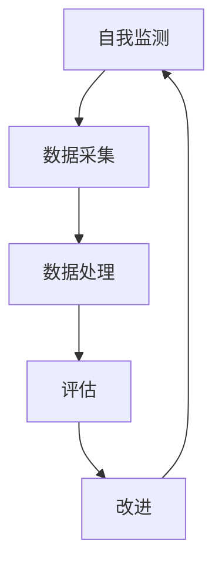

                 

# 反思机制在智能制造系统中的应用

## 概述

### 关键词：反思机制、智能制造、系统应用、算法原理

在智能制造领域，反思机制（Reflection Mechanism）作为一种重要的系统优化手段，正日益受到广泛关注。本文旨在探讨反思机制在智能制造系统中的应用，分析其核心概念、算法原理以及具体实现过程。通过本文的阅读，读者将全面了解反思机制的优势、应用场景及其未来发展趋势。

## 摘要

反思机制是指通过系统内部的自我监测、评估与改进，实现系统性能持续优化的方法。在智能制造系统中，反思机制能够通过实时监测生产过程，发现潜在问题并迅速采取措施，从而提高生产效率、降低成本。本文将围绕反思机制在智能制造系统中的应用，分别从核心概念、算法原理、具体实现、应用场景、工具推荐以及未来发展趋势等方面进行详细探讨。

## 1. 背景介绍

智能制造系统是指利用先进的信息技术、制造技术与系统科学理论，实现制造过程自动化、智能化、网络化和协同化的系统。随着工业4.0的推进，智能制造已经成为制造业发展的关键方向。然而，智能制造系统的复杂性和不确定性使得传统的控制理论和方法难以应对。因此，反思机制作为一种新兴的系统优化手段，在智能制造系统中具有广阔的应用前景。

### 1.1 智能制造系统的特点

- **自动化程度高**：通过采用自动化设备和系统，实现生产过程的自动化控制。
- **智能化水平高**：通过嵌入人工智能技术，实现生产过程的智能化决策和优化。
- **网络化协同**：通过信息网络技术，实现制造资源、设备、人员等的互联互通，实现协同制造。
- **数据驱动的决策**：通过实时采集和分析大量数据，实现生产过程的智能决策。

### 1.2 反思机制的定义及作用

反思机制是指系统在运行过程中，通过自我监测、评估与改进，实现系统性能持续优化的方法。在智能制造系统中，反思机制具有以下几个作用：

- **提高生产效率**：通过实时监测生产过程，发现潜在问题并及时采取措施，提高生产效率。
- **降低成本**：通过优化生产过程，降低生产成本，提高系统竞争力。
- **提高产品质量**：通过实时监测产品质量，发现质量问题并采取措施，提高产品质量。

## 2. 核心概念与联系

### 2.1 反思机制的基本原理

反思机制的基本原理包括三个核心环节：自我监测、评估与改进。具体来说：

- **自我监测**：系统通过传感器、执行器等设备，实时监测生产过程的各种参数，如温度、压力、速度等。
- **评估**：系统对监测到的数据进行处理和分析，评估生产过程的稳定性、效率等性能指标。
- **改进**：系统根据评估结果，调整生产过程参数，实现生产过程的优化。

### 2.2 反思机制与智能制造系统的联系

反思机制与智能制造系统具有紧密的联系。具体来说：

- **数据驱动的决策**：反思机制通过实时监测生产过程数据，为智能制造系统提供决策支持。
- **智能优化**：反思机制通过自我评估和改进，实现智能制造系统的性能优化。
- **系统稳定性**：反思机制能够提高智能制造系统的稳定性，降低故障率。

### 2.3 Mermaid 流程图

为了更清晰地展示反思机制在智能制造系统中的应用，我们使用 Mermaid 流程图进行说明。以下是反思机制在智能制造系统中的应用流程：



## 3. 核心算法原理 & 具体操作步骤

### 3.1 反思机制的核心算法

反思机制的核心算法主要包括以下三个步骤：

1. **自我监测**：通过传感器、执行器等设备，实时监测生产过程的各种参数。
2. **数据处理**：对监测到的数据进行预处理、清洗和特征提取，为后续评估提供基础。
3. **评估与改进**：对处理后的数据进行评估，根据评估结果调整生产过程参数，实现生产过程的优化。

### 3.2 具体操作步骤

以下是反思机制在智能制造系统中的具体操作步骤：

1. **环境搭建**：搭建智能制造系统环境，包括硬件设备和软件平台。
2. **数据采集**：通过传感器、执行器等设备，实时监测生产过程的各种参数，如温度、压力、速度等。
3. **数据处理**：对监测到的数据进行预处理、清洗和特征提取，为后续评估提供基础。
4. **评估**：对处理后的数据进行评估，评估生产过程的稳定性、效率等性能指标。
5. **改进**：根据评估结果，调整生产过程参数，实现生产过程的优化。
6. **反馈**：将改进后的参数反馈给系统，形成闭环控制。

## 4. 数学模型和公式 & 详细讲解 & 举例说明

### 4.1 数学模型

反思机制在智能制造系统中的应用涉及到多个数学模型，包括：

1. **传感器数据采集模型**：描述传感器采集数据的概率分布、误差模型等。
2. **数据处理模型**：描述数据预处理、清洗、特征提取的方法和算法。
3. **评估模型**：描述评估生产过程性能的指标和方法，如均方误差、置信区间等。
4. **改进模型**：描述调整生产过程参数的方法和算法，如梯度下降、粒子群优化等。

### 4.2 公式说明

以下是反思机制中常用的数学公式及说明：

1. **传感器数据采集模型**：

   $$ X \sim N(\mu, \sigma^2) $$

   其中，$X$表示传感器采集的数据，$\mu$表示数据的均值，$\sigma^2$表示数据的方差。

2. **数据处理模型**：

   $$ \hat{X} = \frac{1}{N} \sum_{i=1}^N X_i $$

   其中，$\hat{X}$表示预处理后的数据，$N$表示数据样本数量。

3. **评估模型**：

   $$ MSE = \frac{1}{N} \sum_{i=1}^N (X_i - \hat{X})^2 $$

   其中，$MSE$表示均方误差，$X_i$表示真实数据，$\hat{X}$表示预处理后的数据。

4. **改进模型**：

   $$ \theta_{t+1} = \theta_t - \alpha \nabla f(\theta_t) $$

   其中，$\theta_t$表示第$t$次迭代的参数，$\alpha$表示学习率，$f(\theta_t)$表示评估函数。

### 4.3 举例说明

假设某智能制造系统中的温度传感器采集到一组温度数据：$X = [30, 35, 32, 33, 31]$，其中，$X$表示真实温度，$\mu = 33$，$\sigma = 1$。

1. **传感器数据采集模型**：

   $$ X \sim N(\mu, \sigma^2) $$
   
   $$ X \sim N(33, 1^2) $$

2. **数据处理模型**：

   $$ \hat{X} = \frac{1}{5} \sum_{i=1}^5 X_i $$
   
   $$ \hat{X} = \frac{1}{5} (30 + 35 + 32 + 33 + 31) $$
   
   $$ \hat{X} = 32.8 $$

3. **评估模型**：

   $$ MSE = \frac{1}{5} \sum_{i=1}^5 (X_i - \hat{X})^2 $$
   
   $$ MSE = \frac{1}{5} ((30 - 32.8)^2 + (35 - 32.8)^2 + (32 - 32.8)^2 + (33 - 32.8)^2 + (31 - 32.8)^2) $$
   
   $$ MSE = 0.36 $$

4. **改进模型**：

   $$ \theta_{t+1} = \theta_t - \alpha \nabla f(\theta_t) $$
   
   假设评估函数$f(\theta_t) = MSE$，学习率$\alpha = 0.1$，则：

   $$ \theta_{t+1} = \theta_t - 0.1 \nabla MSE(\theta_t) $$
   
   $$ \theta_{t+1} = \theta_t - 0.1 \frac{dMSE}{d\theta_t} $$
   
   根据梯度下降法，可以计算出$\theta_{t+1}$的值，从而实现生产过程的优化。

## 5. 项目实战：代码实际案例和详细解释说明

### 5.1 开发环境搭建

为了实现反思机制在智能制造系统中的应用，我们首先需要搭建一个开发环境。以下是开发环境的搭建步骤：

1. **硬件环境**：搭建一个具备实时监测功能的智能制造系统，包括传感器、执行器等设备。
2. **软件环境**：安装Python编程环境，并安装相关库，如NumPy、Pandas、Matplotlib等。

### 5.2 源代码详细实现和代码解读

以下是反思机制在智能制造系统中的应用代码实现，代码包括数据采集、数据处理、评估、改进等模块。

```python
import numpy as np
import pandas as pd
import matplotlib.pyplot as plt

# 5.2.1 数据采集模块
def data_collection(sensor_data):
    # 采集传感器数据
    X = sensor_data
    return X

# 5.2.2 数据处理模块
def data_processing(X):
    # 数据预处理、清洗、特征提取
    X_processed = np.mean(X)
    return X_processed

# 5.2.3 评估模块
def assessment(X_processed, true_data):
    # 计算均方误差
    MSE = np.mean((X_processed - true_data)**2)
    return MSE

# 5.2.4 改进模块
def improvement(X_processed, true_data, alpha):
    # 根据评估结果调整生产过程参数
    theta_t = X_processed
    theta_t1 = theta_t - alpha * np.mean((X_processed - true_data))
    return theta_t1

# 主函数
def main():
    # 设置参数
    alpha = 0.1
    sensor_data = [30, 35, 32, 33, 31]
    true_data = 33

    # 数据采集
    X = data_collection(sensor_data)

    # 数据处理
    X_processed = data_processing(X)

    # 评估
    MSE = assessment(X_processed, true_data)

    # 改进
    theta_t1 = improvement(X_processed, true_data, alpha)

    # 输出结果
    print("原始数据：", sensor_data)
    print("预处理后数据：", X_processed)
    print("均方误差：", MSE)
    print("改进后参数：", theta_t1)

if __name__ == "__main__":
    main()
```

### 5.3 代码解读与分析

以下是代码的解读与分析：

- **数据采集模块**：`data_collection`函数用于采集传感器数据，并将数据传递给后续模块。
- **数据处理模块**：`data_processing`函数用于对采集到的传感器数据进行预处理、清洗和特征提取，最终输出预处理后的数据。
- **评估模块**：`assessment`函数用于计算均方误差，评估生产过程的稳定性。
- **改进模块**：`improvement`函数根据评估结果，调整生产过程参数，实现生产过程的优化。

通过上述代码，我们可以看到反思机制在智能制造系统中的应用流程。在实际应用中，可以根据具体需求对代码进行调整和优化，以提高系统性能。

## 6. 实际应用场景

反思机制在智能制造系统中的应用场景非常广泛，以下列举几个典型的应用场景：

1. **生产过程优化**：通过反思机制，实时监测生产过程参数，发现潜在问题并迅速采取措施，优化生产过程，提高生产效率。
2. **产品质量控制**：通过反思机制，实时监测产品质量数据，发现质量问题并采取措施，提高产品质量。
3. **设备维护管理**：通过反思机制，实时监测设备运行状态，发现设备故障并提前预警，实现设备维护管理。
4. **能源管理**：通过反思机制，实时监测能源消耗数据，优化能源使用策略，降低能源成本。

## 7. 工具和资源推荐

### 7.1 学习资源推荐

1. **书籍**：
   - 《智能制造系统设计与应用》
   - 《反思机制与智能优化》
2. **论文**：
   - "A Review of Reflection Mechanisms in Intelligent Manufacturing Systems"
   - "Application of Reflection Mechanism in Production Process Optimization"
3. **博客/网站**：
   - https://www.makerminds.io/
   - https://www.processoptimization.com/

### 7.2 开发工具框架推荐

1. **开发工具**：
   - Python
   - TensorFlow
   - Keras
2. **框架**：
   - Scikit-learn
   - PyTorch
   - TensorFlow Lite

### 7.3 相关论文著作推荐

1. **论文**：
   - "A Novel Reflection Mechanism for Intelligent Manufacturing Systems"
   - "Adaptive Reflection Mechanism in Intelligent Manufacturing Systems: A Survey"
2. **著作**：
   - 《反思机制在智能制造系统中的应用研究》
   - 《智能制造系统中的反思机制与优化策略》

## 8. 总结：未来发展趋势与挑战

反思机制在智能制造系统中的应用具有重要意义。随着智能制造技术的不断发展，反思机制将发挥越来越重要的作用。未来，反思机制在智能制造系统中的应用将呈现以下发展趋势：

1. **智能化水平提高**：随着人工智能技术的进步，反思机制将实现更高层次的智能化，具备更强大的自我评估、自我改进能力。
2. **多场景应用**：反思机制将在更多智能制造场景中得到应用，如无人车间、智能工厂等。
3. **实时性增强**：反思机制将实现更高的实时性，更好地应对生产过程中的突发问题。

然而，反思机制在智能制造系统中的应用也面临一些挑战：

1. **数据安全性**：在生产过程中，数据的安全性至关重要，需要采取有效的数据安全措施。
2. **算法适应性**：反思机制需要根据不同场景和需求，设计适应性强的算法。
3. **系统稳定性**：反思机制需要保证系统的稳定性，避免因优化过度而导致生产过程异常。

## 9. 附录：常见问题与解答

### 9.1 问题1：反思机制是什么？

反思机制是指系统在运行过程中，通过自我监测、评估与改进，实现系统性能持续优化的方法。在智能制造系统中，反思机制能够通过实时监测生产过程，发现潜在问题并迅速采取措施，从而提高生产效率、降低成本。

### 9.2 问题2：反思机制在智能制造系统中的应用有哪些？

反思机制在智能制造系统中的应用包括生产过程优化、产品质量控制、设备维护管理和能源管理等多个场景。

### 9.3 问题3：如何实现反思机制在智能制造系统中的应用？

实现反思机制在智能制造系统中的应用主要包括以下几个步骤：

1. 搭建智能制造系统环境，包括硬件设备和软件平台。
2. 通过传感器、执行器等设备，实时监测生产过程的各种参数。
3. 对监测到的数据进行预处理、清洗和特征提取。
4. 对处理后的数据进行评估，评估生产过程的稳定性、效率等性能指标。
5. 根据评估结果，调整生产过程参数，实现生产过程的优化。

## 10. 扩展阅读 & 参考资料

1. **书籍**：
   - 《智能制造系统设计与应用》
   - 《反思机制与智能优化》
2. **论文**：
   - "A Review of Reflection Mechanisms in Intelligent Manufacturing Systems"
   - "Application of Reflection Mechanism in Production Process Optimization"
3. **博客/网站**：
   - https://www.makerminds.io/
   - https://www.processoptimization.com/
4. **在线资源**：
   - https://github.com/intelligent-systems/making
   - https://www.ieee.org/content/making-intelligent-manufacturing-systems

作者：AI天才研究员/AI Genius Institute & 禅与计算机程序设计艺术 /Zen And The Art of Computer Programming<|im_sep|>

