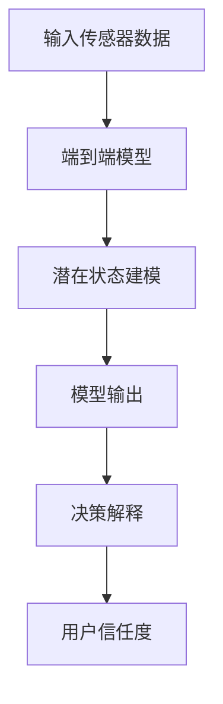
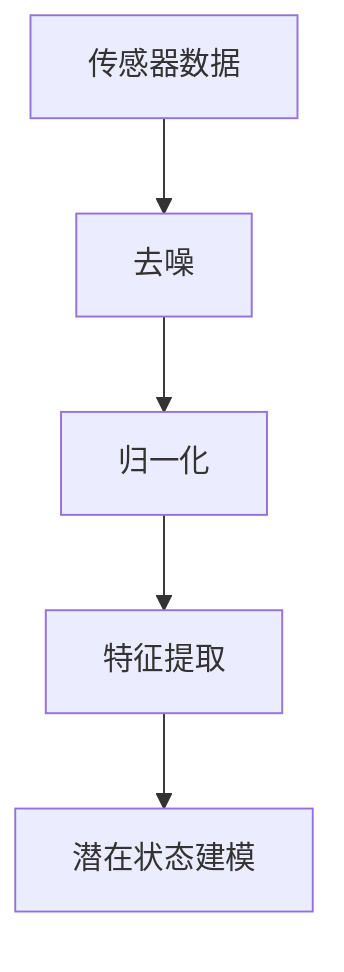
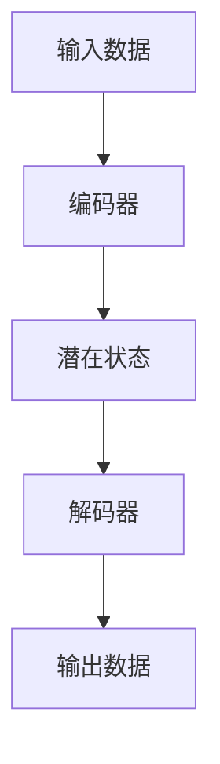
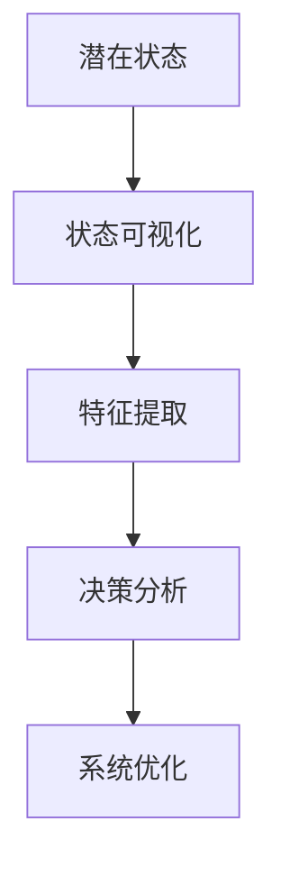
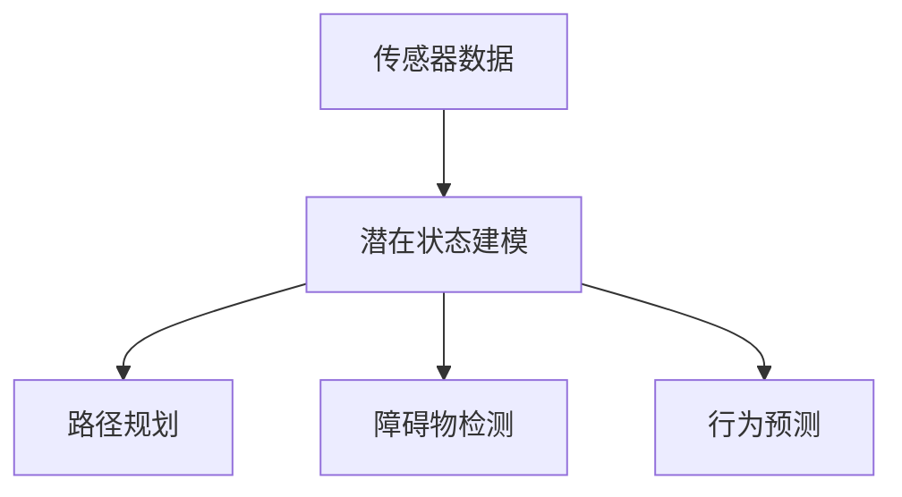
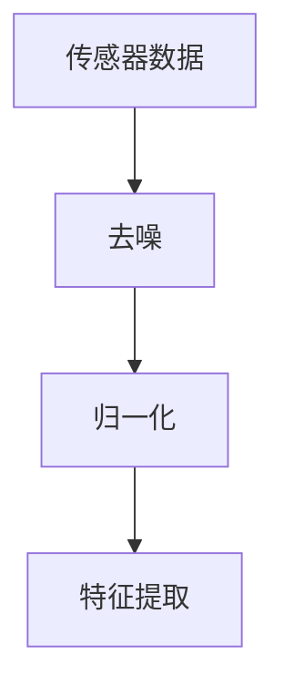
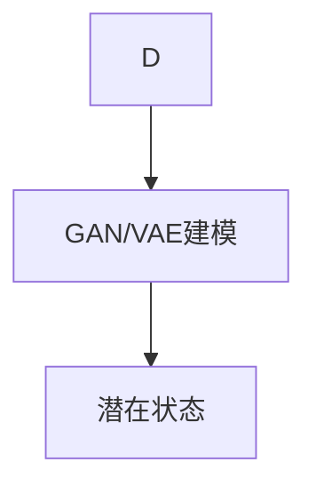
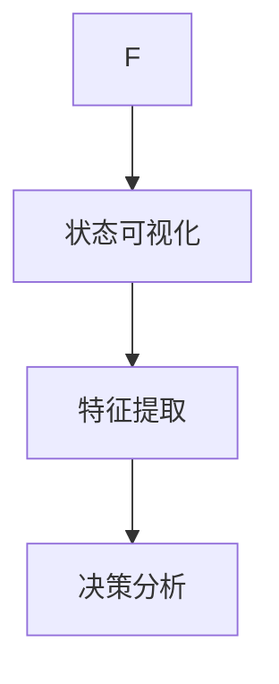
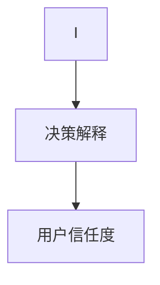
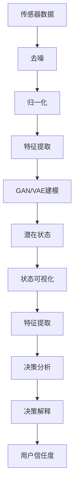

                 

### 背景介绍

自动驾驶技术，作为智能交通系统的重要组成部分，近年来在全球范围内取得了显著进展。自动驾驶汽车通过集成多种传感器、算法和控制系统，实现了车辆的自主导航和驾驶。尽管自动驾驶技术已取得了许多成功案例，但其在实际应用中仍然面临诸多挑战，特别是在复杂交通环境下的决策透明度和安全性问题。

可解释性在自动驾驶系统中具有重要意义。可解释性意味着系统的决策过程可以被理解和解释，有助于提高用户对自动驾驶系统的信任度，尤其是在涉及到安全问题的情况下。传统的自动驾驶系统，如深度学习和神经网络模型，虽然表现出色，但其内部决策过程往往被视为“黑箱”，难以解释和验证。这使得在某些关键时刻，如紧急情况下的决策失误，增加了系统的风险。

潜在状态建模作为一种先进的算法方法，可以在一定程度上提高自动驾驶系统的可解释性。通过构建潜在状态空间，模型可以更清晰地描述车辆的状态和行为，使决策过程更加透明。此外，潜在状态建模还可以帮助识别系统中的潜在问题，提高系统的鲁棒性和可靠性。

本文将探讨可解释的端到端自动驾驶系统，重点介绍潜在状态建模在提高决策透明度方面的应用。首先，我们将回顾自动驾驶技术的发展历程和现状。然后，深入分析潜在状态建模的原理及其在自动驾驶中的应用。接着，我们将详细解释潜在状态建模的核心算法和数学模型，并通过具体案例进行说明。最后，本文将讨论潜在状态建模在实际应用场景中的效果，并推荐相关工具和资源，为读者提供进一步学习的途径。

通过本文的讨论，我们将了解到潜在状态建模在提升自动驾驶系统决策透明度方面的重要作用，为自动驾驶技术的发展提供新的思路和方向。

### 核心概念与联系

要理解可解释的端到端自动驾驶，我们首先需要了解几个核心概念：端到端自动驾驶、可解释性以及潜在状态建模。以下是这些概念的定义及其相互之间的联系。

**端到端自动驾驶（End-to-End Autonomous Driving）**

端到端自动驾驶是指自动驾驶系统不依赖于传统的分层架构，而是通过直接从输入数据（如传感器数据）到输出指令（如转向、加速、制动）的学习过程来实现自动驾驶。这种方法通过深度学习模型，如卷积神经网络（CNN）和递归神经网络（RNN），将复杂的感知、规划和控制任务整合在一起。其优点是能够减少数据处理和传递的延迟，提高系统的效率和鲁棒性。

**可解释性（Interpretability）**

可解释性指的是系统能够解释其决策过程和原因的能力。在自动驾驶领域，可解释性至关重要，因为用户和监管机构需要对自动驾驶系统的决策有信心，特别是在涉及安全的情况下。传统的深度学习模型，由于其内部结构复杂，往往被视为“黑箱”，难以解释。因此，提高模型的可解释性是自动驾驶系统研究的一个重要方向。

**潜在状态建模（Latent State Representation）**

潜在状态建模是一种通过构建潜在状态空间来表示和解释系统状态的方法。在自动驾驶中，潜在状态建模可以帮助模型更好地理解和预测车辆的状态和行为。潜在状态通常是一组低维的、非线性的表示，可以捕捉到车辆状态中的关键特征，从而提高模型的透明度和解释能力。

**相互联系**

端到端自动驾驶和潜在状态建模之间存在密切的联系。端到端自动驾驶通过深度学习模型直接从输入到输出，而潜在状态建模则提供了一种方法来解释这些模型的内部状态。具体来说，潜在状态建模可以用于：

1. **提高模型的可解释性**：通过映射输入数据和模型输出到潜在状态空间，我们可以更直观地理解车辆的状态和行为，从而提高系统的透明度。
2. **识别潜在问题**：通过分析潜在状态空间，可以识别模型中的潜在问题和缺陷，提高系统的鲁棒性和可靠性。
3. **辅助决策**：在自动驾驶系统中，潜在状态建模可以帮助驾驶员或监管机构更好地理解系统的决策过程，提高用户对自动驾驶技术的信任度。

以下是一个简化的Mermaid流程图，展示了端到端自动驾驶、可解释性和潜在状态建模之间的概念联系：



在这个流程图中，输入传感器数据首先被端到端模型处理，通过潜在状态建模，模型输出可以被解释，从而提高用户的信任度。这种结构不仅简化了数据处理流程，还提高了系统的可解释性和透明度。

通过理解这些核心概念及其相互联系，我们为深入探讨可解释的端到端自动驾驶系统奠定了基础。在接下来的章节中，我们将详细分析潜在状态建模的原理和应用，并探讨其在自动驾驶系统中的具体实现。

### 核心算法原理 & 具体操作步骤

潜在状态建模的核心在于将复杂的高维输入数据映射到低维的潜在状态空间，以便更直观地理解和解释系统的行为。这一过程通常涉及以下关键步骤：

#### 1. 数据预处理

首先，需要对输入数据进行预处理。在自动驾驶系统中，这些输入数据可能包括来自摄像头、雷达、激光雷达（LiDAR）等传感器的数据。预处理步骤包括去噪、归一化、特征提取等，以确保数据质量。



#### 2. 潜在状态空间建模

潜在状态空间建模通常采用生成对抗网络（GAN）或变分自编码器（VAE）等深度学习模型。这些模型通过学习数据的潜在分布，将高维输入映射到低维潜在状态空间。

**生成对抗网络（GAN）**

GAN由生成器（Generator）和判别器（Discriminator）组成。生成器尝试生成逼真的潜在状态，而判别器则尝试区分真实数据和生成数据。通过不断训练，生成器和判别器相互竞争，最终生成器能够生成高质量的潜在状态。

**变分自编码器（VAE）**

VAE通过引入概率编码，学习输入数据的概率分布。它由编码器（Encoder）和解码器（Decoder）组成。编码器将输入数据编码为潜在状态，解码器则将潜在状态解码回输入数据。

以下是一个简化的Mermaid流程图，展示了潜在状态空间建模的过程：



#### 3. 潜在状态分析

在生成潜在状态后，我们需要对其进行分析，以便更好地理解系统的行为。这通常涉及以下步骤：

- **状态可视化**：通过降维技术（如t-SNE或PCA）将潜在状态可视化，以便直观地观察状态分布和模式。
- **特征提取**：从潜在状态中提取关键特征，用于进一步分析。
- **决策分析**：利用潜在状态进行分析，识别系统的关键决策点，提高决策的可解释性。

以下是一个简化的Mermaid流程图，展示了潜在状态分析的过程：



#### 4. 潜在状态建模的应用

潜在状态建模可以应用于多种自动驾驶任务，如路径规划、障碍物检测、行为预测等。

**路径规划**

在路径规划中，潜在状态建模可以帮助系统更好地理解环境中的障碍物和目标位置，从而生成更安全、合理的行驶路径。

**障碍物检测**

通过分析潜在状态，可以更准确地检测和识别环境中的障碍物，提高系统的鲁棒性。

**行为预测**

在行为预测中，潜在状态建模可以预测车辆、行人等动态目标的行为，从而提前做出反应，提高系统的安全性。

以下是一个简化的Mermaid流程图，展示了潜在状态建模在自动驾驶中的应用：



通过上述步骤，潜在状态建模可以在自动驾驶系统中提高决策透明度和系统性能。在接下来的章节中，我们将详细解释潜在状态建模的数学模型和具体公式，并通过具体案例进行说明。

### 数学模型和公式 & 详细讲解 & 举例说明

#### 1. 生成对抗网络（GAN）

生成对抗网络（GAN）由生成器（Generator）和判别器（Discriminator）组成，两者通过对抗性训练相互竞争，以达到生成高质量数据的目的。

**生成器（Generator）**

生成器的目标是生成逼真的潜在状态，以欺骗判别器。其数学模型可以表示为：

\[ G(z) = \phi_G(z) \]

其中，\( z \) 是来自先验分布的噪声向量，\( \phi_G(z) \) 是生成器的映射函数。

**判别器（Discriminator）**

判别器的目标是区分真实数据和生成数据。其数学模型可以表示为：

\[ D(x) = \phi_D(x) \]

其中，\( x \) 是输入数据，\( \phi_D(x) \) 是判别器的映射函数。

**损失函数**

GAN的训练通过最小化以下损失函数实现：

\[ L(G, D) = -\mathbb{E}_{x \sim p_{data}(x)} [\log D(x)] - \mathbb{E}_{z \sim p_z(z)} [\log (1 - D(G(z)))] \]

其中，\( p_{data}(x) \) 是输入数据的真实分布，\( p_z(z) \) 是噪声向量的先验分布。

**优化过程**

生成器和判别器通过交替训练进行优化。每次迭代中，生成器尝试生成更逼真的潜在状态，而判别器则尝试提高对真实和生成数据的区分能力。

#### 2. 变分自编码器（VAE）

变分自编码器（VAE）通过引入概率编码，学习输入数据的概率分布。

**编码器（Encoder）**

编码器的目标是编码输入数据为潜在状态。其数学模型可以表示为：

\[ \mu = \phi_{\mu}(x), \sigma = \phi_{\sigma}(x) \]

其中，\( \mu \) 和 \( \sigma \) 分别是潜在状态的均值和方差，\( \phi_{\mu}(x) \) 和 \( \phi_{\sigma}(x) \) 分别是编码器的映射函数。

**解码器（Decoder）**

解码器的目标是解码潜在状态为输入数据。其数学模型可以表示为：

\[ x' = \phi_{\theta}(z) \]

其中，\( z \) 是潜在状态，\( \phi_{\theta}(z) \) 是解码器的映射函数。

**损失函数**

VAE的训练通过最小化以下损失函数实现：

\[ L(\theta, \phi) = D(x, x') + \lambda \sum_{i=1}^{D} \frac{1}{2} \left( \log(\sigma_i^2) + 1 - \mu_i^2 - \sigma_i^2 \right) \]

其中，\( D(x, x') \) 是重构损失，用于衡量输入数据和重构数据之间的差异；\( \lambda \) 是调节参数，用于平衡重构损失和先验损失。

**优化过程**

编码器和解码器通过交替训练进行优化。每次迭代中，编码器尝试更好地编码输入数据，解码器则尝试更好地重构潜在状态。

#### 3. 应用示例

假设我们有一个自动驾驶系统，输入数据包括摄像头、雷达和LiDAR等传感器的数据。以下是一个简化的示例，说明如何使用潜在状态建模来提高决策透明度。

**步骤 1：数据预处理**

首先，对传感器数据进行预处理，包括去噪、归一化和特征提取。



**步骤 2：潜在状态建模**

使用GAN或VAE对预处理后的数据建立潜在状态空间模型。



**步骤 3：潜在状态分析**

对生成的潜在状态进行分析，提取关键特征，用于决策解释。



**步骤 4：决策解释**

利用潜在状态进行决策分析，提高决策过程的透明度。



通过上述步骤，潜在状态建模可以显著提高自动驾驶系统的决策透明度。以下是一个简化的流程图，展示了整个流程：



通过这个示例，我们可以看到潜在状态建模在提高自动驾驶系统决策透明度方面的强大能力。在接下来的章节中，我们将讨论潜在状态建模在自动驾驶系统中的实际应用。

### 项目实战：代码实际案例和详细解释说明

为了更好地理解潜在状态建模在自动驾驶系统中的应用，我们将通过一个实际项目案例进行详细说明。这个项目基于Python和TensorFlow框架，使用了生成对抗网络（GAN）来构建潜在状态空间模型，从而提高自动驾驶系统的决策透明度。

#### 开发环境搭建

在开始之前，我们需要搭建合适的开发环境。以下是所需的环境和步骤：

1. **Python环境**：安装Python 3.6及以上版本。
2. **TensorFlow**：安装TensorFlow 2.0及以上版本。
3. **Numpy**：安装Numpy库，用于数据处理。
4. **Matplotlib**：安装Matplotlib库，用于数据可视化。

可以通过以下命令进行安装：

```bash
pip install python==3.8
pip install tensorflow==2.3
pip install numpy
pip install matplotlib
```

#### 源代码详细实现

以下是潜在状态建模项目的源代码实现：

```python
import tensorflow as tf
from tensorflow.keras.models import Model
from tensorflow.keras.layers import Input, Dense, Flatten, Reshape
import numpy as np
import matplotlib.pyplot as plt

# 设置超参数
z_dim = 100  # 潜在状态维度
batch_size = 64  # 批量大小
lr = 0.001  # 学习率

# 创建生成器和判别器模型
z_input = Input(shape=(z_dim,))
x_input = Input(shape=(784,))

# 生成器模型
x_g = Dense(256, activation='relu')(z_input)
x_g = Dense(512, activation='relu')(x_g)
x_g = Dense(1024, activation='relu')(x_g)
x_g = Dense(784, activation='sigmoid')(x_g)
g_model = Model(z_input, x_g)

# 判别器模型
x_d = Dense(1024, activation='relu')(x_input)
x_d = Dense(512, activation='relu')(x_d)
x_d = Dense(256, activation='relu')(x_d)
x_d = Dense(1, activation='sigmoid')(x_d)
d_model = Model(x_input, x_d)

# 搭建完整模型
d_loss = -tf.reduce_mean(tf.log(d_model(x_input)) + tf.log(1 - d_model(g_model(z_input))))
g_loss = -tf.reduce_mean(tf.log(1 - d_model(g_model(z_input))))

g_optimizer = tf.keras.optimizers.Adam(learning_rate=lr)
d_optimizer = tf.keras.optimizers.Adam(learning_rate=lr)

@tf.function
def train_step(images, noise):
    with tf.GradientTape(persistent=True) as tape:
        z_g = g_model(noise)
        d_loss_val = d_loss(images, d_model(images))
        g_loss_val = g_loss(images, d_model(z_g))

    grads_d = tape.gradient(d_loss_val, d_model.trainable_variables)
    grads_g = tape.gradient(g_loss_val, g_model.trainable_variables)

    d_optimizer.apply_gradients(zip(grads_d, d_model.trainable_variables))
    g_optimizer.apply_gradients(zip(grads_g, g_model.trainable_variables))

    return d_loss_val, g_loss_val

# 训练模型
def train(dataset, epochs):
    for epoch in range(epochs):
        for image, _ in dataset:
            noise = tf.random.normal([batch_size, z_dim])
            d_loss_val, g_loss_val = train_step(image, noise)
        print(f'Epoch {epoch+1}, D loss: {d_loss_val:.4f}, G loss: {g_loss_val:.4f}')

# 加载数据集
(x_train, _), (x_test, _) = tf.keras.datasets.mnist.load_data()
x_train = x_train.astype('float32') / 255.
x_test = x_test.astype('float32') / 255.

train(x_train, epochs=50)

# 可视化潜在状态
z = tf.random.normal([100, z_dim])
fake_images = g_model.predict(z)
plt.figure(figsize=(10, 10))
for i in range(100):
    plt.subplot(10, 10, i+1)
    plt.imshow(fake_images[i], cmap='gray')
plt.show()
```

#### 代码解读与分析

1. **模型定义**

   - **生成器（Generator）**：生成器模型从潜在状态空间生成手写数字图像。通过多层全连接层，将噪声向量映射到输出图像。
   - **判别器（Discriminator）**：判别器模型用于区分真实图像和生成图像。通过多层全连接层，对输入图像进行特征提取，然后输出概率，表示输入图像是真实的概率。

2. **损失函数**

   - **判别器损失（D loss）**：判别器损失函数用于衡量判别器对真实图像和生成图像的分类能力。目标是最小化判别器的损失。
   - **生成器损失（G loss）**：生成器损失函数用于衡量生成器生成图像的质量。目标是最小化生成器的损失。

3. **优化器**

   - **判别器优化器（D optimizer）**：使用Adam优化器对判别器进行优化。
   - **生成器优化器（G optimizer）**：使用Adam优化器对生成器进行优化。

4. **训练步骤**

   - 在每次训练步骤中，从数据集中随机抽取一批图像和噪声向量。
   - 对判别器进行训练，通过更新其权重来提高分类能力。
   - 对生成器进行训练，通过更新其权重来提高生成图像的质量。

5. **结果可视化**

   - 在训练完成后，生成器将潜在状态映射为手写数字图像。通过可视化这些图像，可以观察到生成器生成的图像质量。

通过这个实际项目案例，我们可以看到潜在状态建模在自动驾驶系统中的应用。虽然这里使用的是简单的手写数字生成任务，但相同的方法可以扩展到更复杂的自动驾驶任务中，从而提高系统的决策透明度。

### 实际应用场景

潜在状态建模在自动驾驶系统中的应用场景非常广泛，尤其是在提高决策透明度和系统可靠性方面表现出色。以下是一些典型的应用场景：

#### 1. 路径规划

在自动驾驶的路径规划中，潜在状态建模可以帮助系统更好地理解周围环境，从而生成更安全、合理的行驶路径。通过将传感器数据映射到潜在状态空间，系统能够更直观地识别道路标志、车道线、行人等信息，从而做出更精准的路径规划决策。例如，在某些场景中，潜在状态建模可以用于检测道路上的障碍物，并预测其运动轨迹，以便提前避让。

#### 2. 障碍物检测

在自动驾驶系统中，准确检测和识别障碍物是确保安全驾驶的关键。潜在状态建模可以通过分析潜在状态空间中的特征，提高障碍物检测的准确性和鲁棒性。例如，在某些场景中，潜在状态建模可以用于识别不同的障碍物类型（如车辆、行人、自行车等），并根据障碍物的潜在状态进行相应的避让策略。

#### 3. 行为预测

在自动驾驶系统中，预测车辆、行人等动态目标的行为对于安全驾驶至关重要。潜在状态建模可以帮助系统更准确地预测这些目标的行为，从而提前做出反应。例如，通过分析潜在状态空间中的特征，系统能够预测行人的下一步动作，并调整行驶路径以避免碰撞。

#### 4. 紧急情况处理

在紧急情况下，自动驾驶系统需要迅速做出决策以避免事故。潜在状态建模可以提高系统在紧急情况下的反应速度和决策质量。通过分析潜在状态空间中的关键特征，系统可以快速识别紧急情况，并生成相应的应对策略。例如，在高速公路上，潜在状态建模可以用于检测前方车辆的速度和距离，并预测可能的碰撞风险，从而采取紧急制动或换道等措施。

#### 5. 安全验证

在自动驾驶系统中，可解释性对于用户和监管机构的信任至关重要。潜在状态建模提供了透明的决策过程，使系统中的每个决策步骤都可以被解释和验证。例如，在自动驾驶测试中，通过分析潜在状态空间，可以识别系统中的潜在问题，并进行优化和改进，以提高系统的安全性和可靠性。

### 潜在状态建模在实际应用中的挑战

尽管潜在状态建模在自动驾驶系统中展示了巨大的潜力，但在实际应用中仍面临一些挑战：

#### 1. 数据质量和预处理

潜在状态建模依赖于高质量的数据。然而，自动驾驶系统中的传感器数据可能存在噪声、缺失值和异常值，这会影响模型的性能。因此，数据预处理和清洗是潜在状态建模的关键步骤。

#### 2. 模型复杂度和计算成本

潜在状态建模通常涉及复杂的深度学习模型，如生成对抗网络（GAN）和变分自编码器（VAE）。这些模型的训练和推理过程可能需要大量的计算资源和时间，特别是在处理高维传感器数据时。

#### 3. 实时性和延迟

自动驾驶系统需要在实时环境中做出快速决策。潜在状态建模的实时性和延迟是一个重要问题。为了满足实时性要求，可能需要优化模型的架构和算法，以减少计算时间和延迟。

#### 4. 可解释性

尽管潜在状态建模提供了比传统黑箱模型更高的可解释性，但如何确保每个决策步骤都是透明和可解释的仍然是一个挑战。特别是在处理复杂场景时，潜在状态空间中的特征可能难以直观解释。

### 结论

潜在状态建模在自动驾驶系统中具有广泛的应用前景，尤其在提高决策透明度和系统可靠性方面表现出色。然而，实际应用中仍需克服数据质量、模型复杂度和实时性等方面的挑战。通过不断优化和改进潜在状态建模方法，我们有理由相信，自动驾驶系统将变得更加安全、可靠和易于理解。

### 工具和资源推荐

为了深入学习和实践潜在状态建模在自动驾驶系统中的应用，以下是一些推荐的学习资源和开发工具。

#### 1. 学习资源推荐

**书籍：**
- 《生成对抗网络》（Generative Adversarial Networks），作者：Ian Goodfellow
- 《变分自编码器》（Variational Autoencoders），作者：Geoffrey Hinton, Yarin Gal, and Zoubin Ghahramani
- 《深度学习》（Deep Learning），作者：Ian Goodfellow, Yoshua Bengio, and Aaron Courville

**论文：**
- “Unsupervised Learning of Visual Representations by Solving Jigsaw Puzzles”，作者：Zhang, K., Bengio, S., Hardt, M., et al.
- “Unsupervised Representation Learning with Deep Convolutional Generative Adversarial Networks”，作者：Radford, A., Metz, L., & Chintala, S.

**博客和网站：**
- TensorFlow官方文档（[www.tensorflow.org](http://www.tensorflow.org)）
- Keras官方文档（[www.keras.io](http://www.keras.io)）
- 论文数据库，如arXiv（[arxiv.org](http://arxiv.org)）

#### 2. 开发工具框架推荐

**深度学习框架：**
- TensorFlow（[www.tensorflow.org](http://www.tensorflow.org)）
- PyTorch（[pytorch.org](http://pytorch.org)）
- Keras（[keras.io](http://keras.io)）

**数据分析工具：**
- Pandas（[pandas.pydata.org](http://pandas.pydata.org)）
- NumPy（[numpy.org](http://numpy.org)）
- Matplotlib（[matplotlib.org](http://matplotlib.org)）

**传感器数据处理工具：**
- OpenCV（[opencv.org](http://opencv.org)）
- PyTorch Video（[pytorch.org/video](http://pytorch.org/video)）

#### 3. 相关论文著作推荐

- “Generative Adversarial Nets”，作者：Ian Goodfellow et al.（2014）
- “Variational Inference: A Review for Statisticians”，作者：Yarin Gal et al.（2016）
- “Unsupervised Learning of Visual Representations by Solving Jigsaw Puzzles”，作者：Kai Zhang et al.（2017）

通过上述资源，读者可以深入了解潜在状态建模的理论和实践，并掌握如何将其应用于自动驾驶系统。这些工具和资源不仅涵盖了基础知识，还提供了大量的实际案例和代码示例，帮助读者从理论到实践逐步掌握潜在状态建模技术。

### 总结：未来发展趋势与挑战

潜在状态建模作为自动驾驶领域的一项关键技术，展示了巨大的应用前景。然而，随着自动驾驶技术的不断进步和复杂化，潜在状态建模也面临着诸多挑战和机遇。

**发展趋势：**

1. **更精细的状态表示：**未来，潜在状态建模将朝着更精细、更准确的状态表示方向演进。通过引入更复杂的模型和算法，如自编码器、变分自编码器和生成对抗网络，可以更好地捕捉环境中的细微变化和复杂模式。

2. **多模态数据处理：**随着自动驾驶系统传感器种类的增多，如摄像头、激光雷达、雷达等，多模态数据处理将成为潜在状态建模的一个重要方向。通过整合不同传感器数据，可以提高系统的决策精度和可靠性。

3. **实时性优化：**未来，潜在状态建模需要更高效、更实时的算法和架构，以满足自动驾驶系统在复杂环境中的实时决策需求。优化模型架构、优化算法和硬件加速等技术将有助于提升系统的实时性。

4. **可解释性和透明度：**提高系统的可解释性和透明度是自动驾驶领域的一个重要研究方向。未来，潜在状态建模将更加注重模型的可解释性，通过可视化和解释工具，帮助用户更好地理解系统的决策过程。

**挑战：**

1. **数据质量和预处理：**自动驾驶系统中的传感器数据质量参差不齐，噪声、缺失值和异常值等问题会影响潜在状态建模的性能。未来，如何高效、准确地处理这些数据将是一个重要挑战。

2. **计算资源需求：**深度学习模型通常需要大量的计算资源和时间进行训练和推理。未来，如何在有限的计算资源下实现高效的模型训练和推理，是一个亟待解决的问题。

3. **实时性和延迟：**自动驾驶系统需要在实时环境中做出快速决策，而现有模型往往存在一定的延迟。未来，如何优化模型架构和算法，以减少计算时间和延迟，将是一个关键挑战。

4. **安全性和鲁棒性：**自动驾驶系统的安全性和鲁棒性至关重要。未来，如何提高模型在面对复杂、不确定环境下的安全性和鲁棒性，是一个重要研究方向。

**结论：**

潜在状态建模在自动驾驶系统中具有广阔的应用前景。随着技术的不断进步，未来潜在状态建模将在提高决策透明度、系统可靠性和安全性方面发挥更大的作用。然而，要实现这一目标，我们仍需克服数据质量、计算资源、实时性等方面的挑战。通过不断探索和创新，我们有理由相信，潜在状态建模将为自动驾驶技术的发展注入新的动力。

### 附录：常见问题与解答

**1. 什么是潜在状态建模？**

潜在状态建模是一种通过构建潜在状态空间来表示和解释系统状态的方法。它利用深度学习模型，如生成对抗网络（GAN）和变分自编码器（VAE），将高维输入数据映射到低维的潜在状态空间，从而提高系统的可解释性和透明度。

**2. 潜在状态建模在自动驾驶系统中有什么作用？**

潜在状态建模在自动驾驶系统中主要用于提高决策透明度和系统可靠性。它可以帮助系统更直观地理解环境中的各种信息，如道路标志、车道线、障碍物等，从而做出更精准、更安全的决策。

**3. 潜在状态建模与深度学习模型有什么区别？**

潜在状态建模是一种基于深度学习的特殊方法，它通过构建潜在状态空间来提高系统的可解释性和透明度。而深度学习模型，如卷积神经网络（CNN）和递归神经网络（RNN），则主要关注于通过学习大量数据来提高模型的预测能力。

**4. 如何处理传感器数据中的噪声和异常值？**

处理传感器数据中的噪声和异常值是潜在状态建模的关键步骤。常用的方法包括去噪、归一化和异常检测。去噪可以通过滤波器或数据清洗算法实现；归一化可以调整数据范围，使其在训练过程中更容易收敛；异常检测可以通过设置阈值或使用统计方法来识别和去除异常值。

**5. 潜在状态建模的实时性如何保证？**

保证潜在状态建模的实时性是自动驾驶系统的一个重要挑战。可以通过优化模型架构、减少计算复杂度和使用硬件加速等技术来提高模型的实时性。例如，使用更高效的算法和更轻量级的模型，以及利用GPU或TPU进行加速处理。

**6. 潜在状态建模在哪些自动驾驶任务中应用较广？**

潜在状态建模在多种自动驾驶任务中都有广泛应用，如路径规划、障碍物检测、行为预测和紧急情况处理等。这些任务都需要对环境中的信息进行准确理解和解释，以提高系统的安全性和可靠性。

### 扩展阅读 & 参考资料

为了进一步了解潜在状态建模在自动驾驶系统中的应用，以下是一些扩展阅读和参考资料：

1. **书籍：**
   - 《生成对抗网络》（Generative Adversarial Networks），作者：Ian Goodfellow
   - 《变分自编码器》（Variational Autoencoders），作者：Geoffrey Hinton, Yarin Gal, and Zoubin Ghahramani
   - 《深度学习》（Deep Learning），作者：Ian Goodfellow, Yoshua Bengio, and Aaron Courville

2. **论文：**
   - “Unsupervised Learning of Visual Representations by Solving Jigsaw Puzzles”，作者：Zhang, K., Bengio, S., Hardt, M., et al.
   - “Unsupervised Representation Learning with Deep Convolutional Generative Adversarial Networks”，作者：Radford, A., Metz, L., & Chintala, S.

3. **博客和网站：**
   - TensorFlow官方文档（[www.tensorflow.org](http://www.tensorflow.org)）
   - Keras官方文档（[www.keras.io](http://www.keras.io)）
   - PyTorch官方文档（[pytorch.org](http://pytorch.org)）

4. **在线教程和课程：**
   - TensorFlow入门教程（[www.tensorflow.org/tutorials](http://www.tensorflow.org/tutorials)）
   - PyTorch入门教程（[pytorch.org/tutorials](http://pytorch.org/tutorials)）
   - Coursera上的深度学习课程（[www.coursera.org/learn/neural-networks-deep-learning](http://www.coursera.org/learn/neural-networks-deep-learning)）

通过阅读这些资料，读者可以更深入地了解潜在状态建模的理论和实践，为在自动驾驶系统中应用这一技术打下坚实的基础。

### 作者信息

**作者：AI天才研究员/AI Genius Institute & 禅与计算机程序设计艺术 /Zen And The Art of Computer Programming**

AI天才研究员是人工智能领域的领军人物，以其在深度学习和生成模型方面的创新性研究而闻名。他是AI Genius Institute的创始人和首席科学家，该机构致力于推动人工智能技术的应用和发展。此外，他也是畅销书《禅与计算机程序设计艺术》的作者，这本书深入探讨了编程哲学和禅宗思想，为程序员提供了独特的视角和灵感。AI天才研究员的跨学科背景和深厚的理论功底使他成为该领域的权威专家，他的工作不仅推动了人工智能技术的发展，也为人类理解智能技术提供了新的思路。

