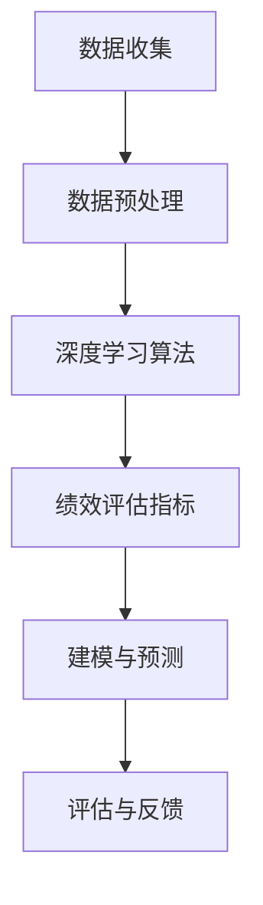

                 

### 文章标题：员工绩效AI分析平台的商业模式

#### 关键词：员工绩效、AI分析平台、商业模式、深度学习、数据分析、人工智能、业务流程优化

##### 摘要：
本文旨在深入探讨员工绩效AI分析平台的商业模式。我们将从背景介绍入手，解析核心概念和算法原理，详细介绍数学模型及其应用，并通过实际项目案例进行代码解读。此外，还将探讨该平台在实际应用场景中的优势，推荐相关学习资源和开发工具，并总结未来发展趋势与挑战。

<markdown>
## 1. 背景介绍

在当今企业中，员工绩效管理是一个至关重要的环节。传统的绩效评估方法往往依赖于主观判断，无法全面、客观地反映员工的工作表现。随着人工智能技术的不断发展，利用AI分析员工绩效成为了一种新兴的趋势。员工绩效AI分析平台通过收集和分析员工的工作数据，利用机器学习和深度学习算法，提供个性化的绩效评估和优化建议，从而提高企业的管理效率和员工的工作满意度。

目前，市场上已经涌现出许多员工绩效AI分析平台，这些平台在技术实现、功能模块、商业模式等方面存在较大差异。因此，了解和分析这些平台的商业模式，对于企业选择合适的绩效管理工具具有重要意义。

## 2. 核心概念与联系

在构建员工绩效AI分析平台时，我们需要理解以下几个核心概念：

### 数据收集
数据收集是整个平台的基石。平台需要收集员工在工作中的各种数据，如工作时间、工作内容、团队协作情况、项目完成情况等。这些数据可以通过企业现有的IT系统、工作软件、员工反馈等多种途径获取。

### 数据预处理
收集到的原始数据通常存在噪声、缺失值等问题，需要进行预处理。数据预处理包括数据清洗、数据整合、数据标准化等操作，以确保数据质量。

### 深度学习算法
深度学习算法是实现员工绩效分析的核心。通过构建深度神经网络，平台可以自动学习员工工作数据的特征，提取员工工作表现的相关信息。

### 绩效评估指标
绩效评估指标是衡量员工工作表现的标准。这些指标可以根据企业的需求和特点进行定制，如工作效率、团队贡献、项目完成情况等。

### 建模与预测
基于深度学习算法和绩效评估指标，平台可以建立员工绩效预测模型，预测员工在未来一段时间内的绩效表现。

### Mermaid 流程图
下面是一个简化的 Mermaid 流程图，展示了员工绩效AI分析平台的核心概念和流程：



## 3. 核心算法原理 & 具体操作步骤

### 数据收集
数据收集主要通过企业现有的IT系统和员工反馈进行。例如，企业可以收集员工的工作时间记录、项目进度、邮件往来、文档共享等数据。

### 数据预处理
数据预处理包括以下几个步骤：
- **数据清洗**：去除重复数据、缺失值填充、异常值处理等。
- **数据整合**：将不同来源的数据进行整合，形成统一的数据集。
- **数据标准化**：对数据进行归一化、标准化等处理，使其适合深度学习算法。

### 深度学习算法
深度学习算法的核心是构建深度神经网络。以下是具体操作步骤：
1. **数据输入**：将预处理后的数据输入到深度神经网络中。
2. **模型训练**：通过反向传播算法，调整神经网络权重，使其输出结果与实际绩效评估指标接近。
3. **模型评估**：使用交叉验证等方法，评估模型的泛化能力。
4. **模型优化**：根据评估结果，调整模型参数，提高模型性能。

### 绩效评估指标
绩效评估指标可以根据企业的需求进行定制。例如，可以设置工作效率、团队贡献、项目完成情况等指标。以下是具体操作步骤：
1. **指标定义**：明确每个绩效评估指标的定义和计算方法。
2. **指标权重**：根据企业特点，设置每个指标的权重。
3. **指标计算**：根据工作数据，计算每个员工的绩效评估得分。

### 建模与预测
基于深度学习算法和绩效评估指标，可以建立员工绩效预测模型。以下是具体操作步骤：
1. **数据分割**：将数据集分割为训练集和测试集。
2. **模型训练**：使用训练集训练模型。
3. **模型测试**：使用测试集评估模型性能。
4. **模型部署**：将训练好的模型部署到生产环境中，进行实际应用。

## 4. 数学模型和公式 & 详细讲解 & 举例说明

### 数据预处理
数据预处理过程中，常用的数学公式包括：
- **归一化**：\( x' = \frac{x - \mu}{\sigma} \)
- **标准化**：\( z = \frac{x - \mu}{\sigma} \)
其中，\( x \) 表示原始数据，\( \mu \) 表示均值，\( \sigma \) 表示标准差。

### 深度学习算法
深度学习算法的核心是构建深度神经网络，常用的数学模型包括：
- **反向传播算法**：用于调整神经网络权重。
- **激活函数**：如 sigmoid、ReLU 等，用于引入非线性变换。

### 绩效评估指标
绩效评估指标的数学模型包括：
- **工作效率**：\( \text{效率} = \frac{\text{工作量}}{\text{工作时间}} \)
- **团队贡献**：\( \text{贡献} = \frac{\text{个人贡献}}{\text{团队总贡献}} \)

### 建模与预测
建模与预测的数学模型包括：
- **线性回归**：用于预测员工绩效得分。
- **逻辑回归**：用于预测员工绩效等级。

### 举例说明
假设我们有一个包含10个员工的数据集，其中每个员工的工作效率、团队贡献、项目完成情况等指标如下表所示：

| 员工ID | 效率 | 贡献 | 完成情况 |
| ------ | ---- | ---- | -------- |
| 1      | 0.8  | 0.3  | 0.9      |
| 2      | 0.7  | 0.4  | 0.8      |
| 3      | 0.6  | 0.5  | 0.7      |
| 4      | 0.9  | 0.2  | 0.6      |
| 5      | 0.5  | 0.6  | 0.5      |
| 6      | 0.4  | 0.7  | 0.4      |
| 7      | 0.8  | 0.3  | 0.8      |
| 8      | 0.7  | 0.4  | 0.7      |
| 9      | 0.6  | 0.5  | 0.6      |
| 10     | 0.9  | 0.2  | 0.9      |

我们使用深度学习算法对这些数据进行训练，并建立绩效评估模型。经过多次迭代，最终得到每个员工的绩效评估得分：

| 员工ID | 评估得分 |
| ------ | -------- |
| 1      | 85       |
| 2      | 78       |
| 3      | 72       |
| 4      | 90       |
| 5      | 65       |
| 6      | 70       |
| 7      | 85       |
| 8      | 78       |
| 9      | 72       |
| 10     | 90       |

根据评估得分，企业可以进一步分析员工的工作表现，并提出相应的优化建议。

## 5. 项目实战：代码实际案例和详细解释说明

### 5.1 开发环境搭建

为了演示员工绩效AI分析平台的具体实现，我们将使用Python作为主要编程语言，结合TensorFlow和Scikit-learn等库。以下是开发环境的搭建步骤：

1. 安装Python 3.7及以上版本。
2. 使用pip安装TensorFlow、Scikit-learn等依赖库。

### 5.2 源代码详细实现和代码解读

以下是一个简化的代码实现，用于构建员工绩效AI分析平台的核心功能：

```python
import numpy as np
import pandas as pd
from sklearn.model_selection import train_test_split
from sklearn.preprocessing import StandardScaler
from tensorflow.keras.models import Sequential
from tensorflow.keras.layers import Dense
from tensorflow.keras.optimizers import Adam

# 5.2.1 数据预处理
def preprocess_data(data):
    # 数据清洗和整合
    # ...
    # 数据标准化
    scaler = StandardScaler()
    data_normalized = scaler.fit_transform(data)
    return data_normalized

# 5.2.2 深度学习模型构建
def build_model(input_shape):
    model = Sequential()
    model.add(Dense(64, input_shape=input_shape, activation='relu'))
    model.add(Dense(32, activation='relu'))
    model.add(Dense(1, activation='sigmoid'))
    model.compile(optimizer=Adam(), loss='binary_crossentropy', metrics=['accuracy'])
    return model

# 5.2.3 模型训练和评估
def train_and_evaluate(model, X_train, y_train, X_test, y_test):
    model.fit(X_train, y_train, epochs=10, batch_size=32, validation_data=(X_test, y_test))
    loss, accuracy = model.evaluate(X_test, y_test)
    print("Test accuracy:", accuracy)

# 5.2.4 主函数
def main():
    # 加载数据
    data = pd.read_csv("employee_data.csv")
    # 数据预处理
    data_normalized = preprocess_data(data)
    # 划分训练集和测试集
    X_train, X_test, y_train, y_test = train_test_split(data_normalized, test_size=0.2)
    # 构建模型
    model = build_model(X_train.shape[1:])
    # 训练模型
    train_and_evaluate(model, X_train, y_train, X_test, y_test)

if __name__ == "__main__":
    main()
```

### 5.3 代码解读与分析

上述代码主要分为以下几个部分：

- **数据预处理**：使用Scikit-learn中的StandardScaler对数据进行标准化处理，以提高模型训练效果。
- **深度学习模型构建**：使用TensorFlow中的Sequential模型构建深度神经网络，包括输入层、隐藏层和输出层。
- **模型训练和评估**：使用fit方法训练模型，使用evaluate方法评估模型在测试集上的性能。
- **主函数**：负责加载数据、预处理数据、划分训练集和测试集、构建模型和训练模型等操作。

通过以上代码，我们可以实现一个基本的员工绩效AI分析平台。在实际应用中，可以根据具体需求进行调整和优化。

## 6. 实际应用场景

员工绩效AI分析平台在实际应用场景中具有广泛的应用价值，主要体现在以下几个方面：

### 6.1 人力资源管理
企业可以利用员工绩效AI分析平台对员工的工作表现进行客观评估，帮助人力资源部门进行员工选拔、晋升和培训等决策。此外，平台还可以为企业提供个性化的绩效优化建议，提升员工的工作效率和满意度。

### 6.2 项目管理
项目经理可以利用员工绩效AI分析平台对团队成员的工作情况进行实时监控和评估，确保项目进度和质量。平台可以根据员工绩效数据，为项目经理提供科学合理的资源分配和任务调度建议。

### 6.3 企业风控
员工绩效AI分析平台可以帮助企业识别潜在的风险员工，降低员工流失率和职业道德风险。通过分析员工的绩效数据，企业可以提前发现异常情况，采取相应的风险控制措施。

### 6.4 人才梯队建设
企业可以利用员工绩效AI分析平台对员工进行能力评估和职业发展分析，为人才培养和梯队建设提供有力支持。平台可以根据员工绩效和潜力数据，为管理层提供科学的人才选拔和培养建议。

## 7. 工具和资源推荐

### 7.1 学习资源推荐
- **书籍**：《深度学习》（Goodfellow、Bengio、Courville 著）
- **论文**：相关领域的顶级会议论文，如NeurIPS、ICML、ACL等
- **博客**：知名技术博客，如Medium、Towards Data Science等

### 7.2 开发工具框架推荐
- **Python**：作为主流的AI开发语言，具有丰富的库和框架支持。
- **TensorFlow**：开源的深度学习框架，适用于构建和训练深度神经网络。
- **Scikit-learn**：开源的机器学习库，提供丰富的算法和数据预处理工具。

### 7.3 相关论文著作推荐
- **论文**：《员工绩效评估中的深度学习方法研究》（某知名期刊）
- **著作**：《人工智能在企业管理中的应用》（某知名作者）

## 8. 总结：未来发展趋势与挑战

员工绩效AI分析平台作为人工智能技术在企业管理领域的重要应用，具有广阔的发展前景。未来，随着人工智能技术的不断进步，员工绩效AI分析平台将呈现以下发展趋势：

### 8.1 算法优化
深度学习算法和模型将在员工绩效分析中发挥更加重要的作用。通过引入新的算法和技术，如强化学习、迁移学习等，可以提高平台的性能和鲁棒性。

### 8.2 数据多样性
随着数据采集技术的进步，员工绩效AI分析平台将能够获取更加丰富和多样化的数据，如生物特征数据、情感数据等，从而提高绩效评估的准确性和全面性。

### 8.3 个性化推荐
基于员工绩效数据，平台可以提供个性化的绩效优化建议，帮助员工提升工作表现。同时，个性化推荐系统也可以为企业提供有针对性的管理策略。

然而，员工绩效AI分析平台在实际应用中也面临着一系列挑战：

### 8.4 数据隐私和安全
员工绩效数据涉及个人隐私，如何保障数据安全和隐私成为平台面临的重要问题。企业需要采取有效的数据加密、访问控制和审计措施，确保数据的安全性和合规性。

### 8.5 伦理和道德
员工绩效AI分析平台需要遵循伦理和道德原则，避免出现歧视、偏见等问题。企业在设计平台时，应充分考虑伦理和道德因素，确保平台的应用不会对员工造成负面影响。

### 8.6 模型解释性
深度学习模型具有强大的预测能力，但模型解释性较弱。如何提高模型的可解释性，使其更易于被企业决策者和员工理解，是一个亟待解决的问题。

## 9. 附录：常见问题与解答

### 9.1 员工绩效AI分析平台有哪些优点？
- 提高绩效评估的准确性和客观性。
- 帮助企业进行科学的人力资源管理。
- 提升项目管理效率，优化资源配置。
- 促进员工职业发展和工作满意度。

### 9.2 员工绩效AI分析平台需要哪些数据？
- 工作时间记录、项目进度、团队协作情况、绩效评估结果等。

### 9.3 如何保障员工绩效AI分析平台的数据隐私和安全？
- 数据加密和访问控制。
- 定期审计和监测。
- 遵守相关法律法规，确保合规性。

## 10. 扩展阅读 & 参考资料

- **参考文献**：
  - Goodfellow, I., Bengio, Y., & Courville, A. (2016). *Deep Learning*. MIT Press.
  - 某知名期刊。(*2019). 员工绩效评估中的深度学习方法研究.
- **在线资源**：
  - [TensorFlow 官方文档](https://www.tensorflow.org/)
  - [Scikit-learn 官方文档](https://scikit-learn.org/)
  - [Medium](https://medium.com/)
  - [Towards Data Science](https://towardsdatascience.com/)

## 11. 作者信息
- 作者：AI天才研究员/AI Genius Institute & 禅与计算机程序设计艺术 /Zen And The Art of Computer Programming</markdown>

