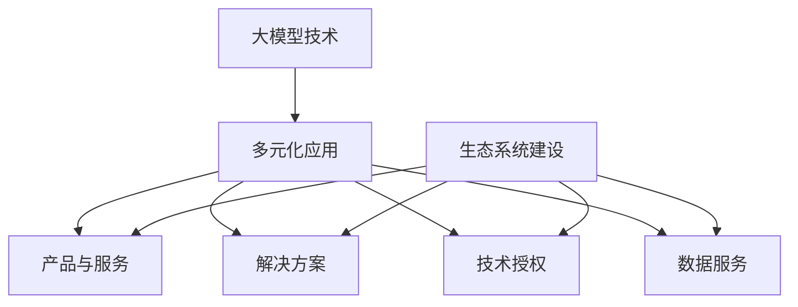

                 

### 背景介绍

#### 大模型创业的现状与挑战

商业化策略对于大模型创业企业来说至关重要。随着人工智能技术的飞速发展，越来越多的企业和创业者涌入到这一领域，希望能够分得一杯羹。然而，面对激烈的市场竞争和技术门槛，大模型创业企业面临着诸多挑战。

首先，市场环境变化迅速。大数据、云计算、物联网等新兴技术的崛起，使得大模型的应用场景不断扩展，同时也在不断改变市场的需求和预期。企业需要具备敏锐的市场嗅觉，及时调整商业模式，以满足不断变化的市场需求。

其次，技术门槛较高。大模型的研发和部署需要大量的计算资源、专业人才和研发投入。对于许多创业公司来说，技术上的难题往往成为其发展的瓶颈。如何有效利用现有的资源，实现技术突破，是企业需要重点考虑的问题。

再者，商业化路径不清晰。大模型的应用领域广泛，但如何将其转化为实际收入，对于很多企业来说仍是一个难题。如何找到合适的商业化路径，实现可持续的商业化模式，是企业亟需解决的问题。

此外，政策法规和伦理问题也对大模型创业企业构成了挑战。随着人工智能技术的发展，相关的法律法规和伦理问题也日益受到关注。企业需要遵守相关法规，确保技术的合法合规，同时考虑到技术应用的伦理问题，避免可能带来的负面影响。

#### 大模型创业的重要性

尽管面临诸多挑战，大模型创业依然具有重要意义。首先，大模型技术在很多领域具有广泛的应用前景，如自然语言处理、计算机视觉、推荐系统等。通过商业化策略，企业可以将这些技术转化为实际的产品和服务，推动行业的创新发展。

其次，大模型创业有助于促进技术积累和人才成长。在研发大模型的过程中，企业可以积累大量的技术经验，培养专业的技术团队。这些经验和人才将成为企业后续发展的坚实基础。

最后，大模型创业有助于推动经济和社会的发展。人工智能技术被认为是新一轮科技革命和产业变革的重要驱动力。通过商业化策略，企业可以将技术应用于各个领域，推动产业升级，提高生产效率，创造更多的就业机会，促进经济和社会的发展。

#### 文章结构安排

本文将分为以下几个部分：

1. **核心概念与联系**：介绍大模型创业的核心概念，并展示其与商业化策略的关联。
2. **核心算法原理与具体操作步骤**：详细阐述大模型的主要算法原理，并给出具体的操作步骤。
3. **数学模型和公式**：讲解大模型的数学模型和关键公式，并举例说明其应用。
4. **项目实战**：通过一个实际的案例，展示大模型的应用和代码实现。
5. **实际应用场景**：探讨大模型在各个领域的应用场景，分析其商业化潜力。
6. **工具和资源推荐**：推荐相关学习资源和开发工具，帮助读者深入了解和掌握大模型技术。
7. **总结：未来发展趋势与挑战**：总结大模型创业的现状和未来发展趋势，讨论可能面临的挑战。
8. **附录：常见问题与解答**：回答读者可能遇到的一些常见问题。
9. **扩展阅读与参考资料**：提供更多的阅读资源，帮助读者进一步探索大模型领域。

接下来，我们将逐步深入探讨这些内容，帮助读者全面了解大模型创业的生存之道。<sop><|user|>
### 核心概念与联系

#### 大模型概述

在讨论大模型创业的生存之道之前，我们首先需要理解什么是大模型。大模型是指具有数百万甚至数十亿参数的机器学习模型。这些模型通常基于深度学习框架，通过大量的数据训练，能够对复杂的数据集进行高效的学习和预测。

大模型的核心优势在于其强大的泛化能力。由于模型参数众多，大模型可以捕捉到数据中的细微特征，从而在多种不同领域和任务上表现出色。例如，大型语言模型如GPT-3可以在自然语言处理（NLP）、文本生成、机器翻译等任务上实现高质量的输出。

#### 商业化策略

在了解了大模型的基本概念后，我们需要关注如何将大模型技术转化为商业成功。商业化策略是指企业如何利用其技术和产品在市场上获得收益的一系列策略。对于大模型创业企业，以下是一些关键的商业化策略：

1. **产品与服务**：开发基于大模型的产品或服务，如智能客服、自动化写作工具、图像识别系统等，这些产品可以满足不同行业的需求。

2. **解决方案**：为企业提供定制化的大模型解决方案，帮助企业提高生产效率、降低成本或解决特定问题。

3. **技术授权**：将大模型技术授权给其他企业使用，通过许可费获得收入。

4. **数据服务**：提供高质量的数据集和标注服务，为其他企业进行模型训练提供支持。

5. **生态系统建设**：构建围绕大模型技术的生态系统，包括合作伙伴、开发者社区和开源项目等，通过生态系统中的各个环节获得收益。

#### 大模型与商业化策略的关联

大模型和商业化策略之间的关联在于，大模型的强大能力为商业化提供了可能性，而有效的商业化策略则能将这种可能性转化为实际收益。

首先，大模型的应用范围广泛，这为商业化提供了多样化的选择。企业可以根据市场需求，开发和推广不同类型的产品和服务，实现多元化收入。

其次，大模型的高效训练和预测能力可以降低企业的运营成本，提高生产效率。这不仅可以为企业带来直接的经济效益，还可以提升企业的市场竞争力。

此外，大模型的强大能力和定制化特性使得企业可以为客户提供高度个性化的解决方案，这有助于建立客户忠诚度和口碑，从而促进业务的持续增长。

最后，大模型的生态系统建设可以吸引更多的开发者、合作伙伴和用户参与，形成良性循环。这不仅有助于扩大企业的市场份额，还可以通过生态系统的各个环节获得更多收益。

#### Mermaid 流程图

为了更直观地展示大模型与商业化策略的关联，我们可以使用Mermaid流程图来描述这个过程。



在这个流程图中，大模型技术（A）是起点，通过多元化应用（B），企业可以开发出产品与服务（C）、提供解决方案（D）、进行技术授权（E）和提供数据服务（F）。同时，生态系统建设（G）可以促进这些环节的良性循环。

通过这个流程图，我们可以看到，大模型创业企业可以通过多种商业化策略，将技术优势转化为实际收益。这不仅有助于企业的生存，也为整个行业的发展提供了新的动力。

#### 核心概念与联系总结

综上所述，大模型创业的核心概念包括大模型技术、商业化策略以及它们之间的关联。大模型以其强大的泛化能力和应用潜力，为商业化提供了广阔的空间。而有效的商业化策略则能帮助大模型创业企业实现技术价值的最大化，获得可持续的商业成功。

在接下来的章节中，我们将进一步探讨大模型的核心算法原理、数学模型和实际应用场景，帮助读者更深入地了解大模型技术及其商业化路径。<sop><|user|>
### 核心算法原理与具体操作步骤

#### 深度学习基础

大模型的核心算法是深度学习，其基础包括神经网络、反向传播算法和优化算法。深度学习通过多层神经网络对数据进行处理和分类，从而实现复杂的任务。

1. **神经网络（Neural Networks）**：神经网络是模仿人脑神经元工作原理的计算模型。它由多个层组成，包括输入层、隐藏层和输出层。每个层由多个节点（或神经元）组成，节点之间通过连接（或权重）相互连接。

2. **反向传播算法（Backpropagation）**：反向传播算法是一种用于训练神经网络的算法。它通过计算输出层与实际输出之间的误差，将误差反向传播到每一层，从而调整每个神经元的权重，以达到最小化误差的目的。

3. **优化算法（Optimization Algorithms）**：优化算法用于调整神经网络中的权重，以找到最小化误差的最优解。常见的优化算法包括随机梯度下降（SGD）、Adam优化器等。

#### 大模型架构

大模型通常由多个层次组成，包括编码器（Encoder）和解码器（Decoder）。编码器将输入数据编码为固定长度的向量表示，而解码器将这个向量解码为输出数据。

1. **编码器（Encoder）**：编码器的主要任务是将输入数据转换为固定长度的向量表示。这一过程通常通过多个隐藏层进行，每一层的输出都是对输入数据的进一步抽象和压缩。编码器常用于序列数据，如文本和音频。

2. **解码器（Decoder）**：解码器的任务是将编码器输出的向量表示解码为输出数据。解码器通常与编码器具有相同的结构，但输入和输出层的顺序相反。解码器常用于生成文本、图像和音频等序列数据。

#### 具体操作步骤

以下是一个基于编码器-解码器架构的大模型训练的基本步骤：

1. **数据预处理**：对输入数据进行清洗、标准化和编码，使其适合模型的输入。

2. **构建模型**：使用深度学习框架（如TensorFlow或PyTorch）构建编码器和解码器模型。设定模型的架构、层结构和参数。

3. **训练模型**：将预处理后的数据输入模型，通过反向传播算法和优化算法调整模型参数。在训练过程中，可以通过验证集来监控模型的性能，并调整训练参数，如学习率、批次大小等。

4. **评估模型**：使用测试集评估模型的性能，包括准确率、损失函数等指标。

5. **调整模型**：根据评估结果，调整模型结构和参数，以优化模型的性能。

6. **部署模型**：将训练好的模型部署到生产环境中，供实际应用使用。

#### 核心算法原理示例

以下是一个简单的编码器-解码器模型的示例，用于文本生成任务。

```python
import torch
import torch.nn as nn
import torch.optim as optim

# 构建编码器
class Encoder(nn.Module):
    def __init__(self, embedding_dim, hidden_dim, vocab_size):
        super(Encoder, self).__init__()
        self.embedding = nn.Embedding(vocab_size, embedding_dim)
        self.lstm = nn.LSTM(embedding_dim, hidden_dim, num_layers=2, batch_first=True)

    def forward(self, x):
        embedded = self.embedding(x)
        output, (hidden, cell) = self.lstm(embedded)
        return hidden, cell

# 构建解码器
class Decoder(nn.Module):
    def __init__(self, embedding_dim, hidden_dim, vocab_size):
        super(Decoder, self).__init__()
        self.embedding = nn.Embedding(vocab_size, embedding_dim)
        self.lstm = nn.LSTM(embedding_dim, hidden_dim, num_layers=2, batch_first=True)
        self.fc = nn.Linear(hidden_dim, vocab_size)

    def forward(self, x, hidden, cell):
        embedded = self.embedding(x)
        output, (hidden, cell) = self.lstm(embedded, (hidden, cell))
        output = self.fc(output)
        return output, hidden, cell

# 构建大模型
class Seq2Seq(nn.Module):
    def __init__(self, encoder, decoder, src_vocab_size, tgt_vocab_size, embedding_dim, hidden_dim):
        super(Seq2Seq, self).__init__()
        self.encoder = encoder
        self.decoder = decoder
        self.src_embedding = nn.Embedding(src_vocab_size, embedding_dim)
        self.tgt_embedding = nn.Embedding(tgt_vocab_size, embedding_dim)

    def forward(self, src, tgt, teacher_forcing_ratio=0.5):
        enc_hidden, enc_cell = self.encoder(src)
        dec_hidden = enc_hidden[-1]
        dec_cell = enc_cell[-1]
        outputs = []
        for t in range(tgt.size(1)):
            embedded = self.src_embedding(tgt[:, t].unsqueeze(1))
            output, dec_hidden, dec_cell = self.decoder(embedded, dec_hidden, dec_cell)
            outputs.append(output)
            if random.random() < teacher_forcing_ratio:
                tgt = tgt[:, t].unsqueeze(1)
            else:
                _, predicted = output.topk(1)
                tgt = predicted.squeeze(2)
        outputs = torch.cat(outputs, 1)
        return outputs

# 模型参数
embedding_dim = 256
hidden_dim = 512
src_vocab_size = 10000
tgt_vocab_size = 10000

# 实例化模型
encoder = Encoder(embedding_dim, hidden_dim, src_vocab_size)
decoder = Decoder(embedding_dim, hidden_dim, tgt_vocab_size)
model = Seq2Seq(encoder, decoder, src_vocab_size, tgt_vocab_size, embedding_dim, hidden_dim)

# 模型训练
optimizer = optim.Adam(model.parameters(), lr=0.001)
criterion = nn.CrossEntropyLoss()

for epoch in range(num_epochs):
    for i, (src, tgt) in enumerate(train_loader):
        model.zero_grad()
        outputs = model(src, tgt)
        loss = criterion(outputs.view(-1, tgt_vocab_size), tgt.view(-1))
        loss.backward()
        optimizer.step()

        if (i+1) % 100 == 0:
            print ('Epoch [{}/{}], Step [{}/{}], Loss: {:.4f}'.format(epoch+1, num_epochs, i+1, len(train_loader)//batch_size, loss.item()))

# 模型评估
with torch.no_grad():
    for i, (src, tgt) in enumerate(test_loader):
        outputs = model(src, tgt)
        predicted = outputs.argmax(1)
        correct = predicted.eq(tgt).sum().item()
        print ('Test set accuracy: {:.2f}%'.format(correct/len(tgt)*100))
```

在这个示例中，我们构建了一个简单的序列到序列（Seq2Seq）模型，用于文本生成任务。模型包括编码器、解码器和嵌入层。我们使用了LSTM作为隐藏层，并通过反向传播算法和Adam优化器进行模型训练。最后，我们在测试集上评估模型的性能。

通过这个示例，我们可以看到大模型的核心算法原理和具体操作步骤。在实际应用中，大模型的训练和部署会更加复杂，但基本原理和方法是相似的。<sop><|user|>
### 数学模型和公式 & 详细讲解 & 举例说明

#### 神经网络中的基本数学概念

在讨论大模型的数学模型和公式之前，我们需要了解一些神经网络中的基本数学概念。这些概念包括激活函数、损失函数和优化算法。

1. **激活函数（Activation Function）**：激活函数是神经网络中的一个关键组件，用于将神经元的线性输出转换为非线性输出。常见的激活函数包括sigmoid、ReLU（Rectified Linear Unit）和tanh。这些函数的主要作用是增加神经网络的非线性表达能力，使得模型能够更好地拟合复杂的数据分布。

   - **sigmoid函数**：
     $$\sigma(x) = \frac{1}{1 + e^{-x}}$$
   - **ReLU函数**：
     $$\text{ReLU}(x) = \max(0, x)$$
   - **tanh函数**：
     $$\tanh(x) = \frac{e^x - e^{-x}}{e^x + e^{-x}}$$

2. **损失函数（Loss Function）**：损失函数用于衡量模型预测值与真实值之间的差距。在神经网络中，常用的损失函数包括均方误差（MSE，Mean Squared Error）和交叉熵（Cross Entropy）。

   - **均方误差（MSE）**：
     $$\text{MSE}(y, \hat{y}) = \frac{1}{n}\sum_{i=1}^{n}(y_i - \hat{y}_i)^2$$
   - **交叉熵（Cross Entropy）**：
     $$\text{CE}(y, \hat{y}) = -\sum_{i=1}^{n}y_i\log(\hat{y}_i)$$

3. **优化算法（Optimization Algorithm）**：优化算法用于调整模型的参数，以最小化损失函数。常见的优化算法包括随机梯度下降（SGD，Stochastic Gradient Descent）和其变种，如Adam优化器。

   - **随机梯度下降（SGD）**：
     $$\theta_{\text{new}} = \theta_{\text{old}} - \alpha \nabla_{\theta}\mathcal{L}(\theta)$$
     其中，$\theta$表示模型参数，$\alpha$表示学习率，$\nabla_{\theta}\mathcal{L}(\theta)$表示损失函数关于参数的梯度。

   - **Adam优化器**：
     Adam优化器结合了SGD和动量（Momentum）的优化方法，其更新规则为：
     $$m_t = \beta_1 m_{t-1} + (1 - \beta_1) \nabla_{\theta}\mathcal{L}(\theta)$$
     $$v_t = \beta_2 v_{t-1} + (1 - \beta_2) \nabla_{\theta}\mathcal{L}(\theta)^2$$
     $$\theta_{\text{new}} = \theta_{\text{old}} - \alpha \frac{m_t}{\sqrt{v_t} + \epsilon}$$
     其中，$m_t$和$v_t$分别表示一阶矩估计和二阶矩估计，$\beta_1$和$\beta_2$分别表示一阶和二阶矩的衰减系数，$\epsilon$为常数，用于防止除以零。

#### 大模型的数学模型

大模型的数学模型通常涉及多个层次和复杂的网络结构。以下是一个基于变换器（Transformer）架构的大模型数学模型。

1. **编码器（Encoder）**：

   编码器用于将输入序列编码为固定长度的向量表示。其数学模型如下：

   - **嵌入层（Embedding Layer）**：
     $$\text{emb}(x) = [e_{\text{word1}}, e_{\text{word2}}, ..., e_{\text{wordn}}]$$
     其中，$e_{\text{wordi}}$表示第$i$个单词的嵌入向量。

   - **多头自注意力机制（Multi-Head Self-Attention）**：
     $$\text{Attention}(Q, K, V) = \text{softmax}(\frac{QK^T}{\sqrt{d_k}})V$$
     其中，$Q, K, V$分别为查询向量、键向量和值向量，$d_k$为键向量的维度。

   - **前馈神经网络（Feedforward Neural Network）**：
     $$\text{FFN}(x) = \text{ReLU}(W_2 \cdot \text{ReLU}(W_1 x + b_1)) + b_2$$
     其中，$W_1, W_2, b_1, b_2$分别为网络的权重和偏置。

2. **解码器（Decoder）**：

   解码器用于将编码器输出的向量表示解码为输出序列。其数学模型与编码器类似，但加入了多头交叉注意力机制：

   - **嵌入层（Embedding Layer）**：
     $$\text{emb}(x) = [e_{\text{word1}}, e_{\text{word2}}, ..., e_{\text{wordn}}]$$

   - **多头自注意力机制（Multi-Head Self-Attention）**：
     $$\text{Self-Attention}(Q, K, V) = \text{softmax}(\frac{QK^T}{\sqrt{d_k}})V$$

   - **多头交叉注意力机制（Multi-Head Cross-Attention）**：
     $$\text{Cross-Attention}(Q, K, V) = \text{softmax}(\frac{QK^T}{\sqrt{d_k}})V$$

   - **前馈神经网络（Feedforward Neural Network）**：
     $$\text{FFN}(x) = \text{ReLU}(W_2 \cdot \text{ReLU}(W_1 x + b_1)) + b_2$$

#### 举例说明

以下是一个基于变换器架构的大模型训练过程的例子：

假设我们有一个文本序列“我爱北京天安门”，我们希望使用变换器模型对其进行编码和预测。

1. **数据预处理**：

   将文本序列转换为单词索引序列，例如：
   $$[1, 2, 3, 4, 5, 6, 7, 8, 9, 10]$$
   其中，每个索引表示一个单词。

2. **编码器**：

   - **嵌入层**：
     $$\text{emb}(x) = [e_{1}, e_{2}, ..., e_{10}]$$

   - **多头自注意力机制**：
     对于每一层，我们计算自注意力权重矩阵$A$，然后将其应用于输入向量：
     $$\text{Attention}(Q, K, V) = \text{softmax}(\frac{QK^T}{\sqrt{d_k}})V$$

   - **前馈神经网络**：
     $$\text{FFN}(x) = \text{ReLU}(W_2 \cdot \text{ReLU}(W_1 x + b_1)) + b_2$$

3. **解码器**：

   - **嵌入层**：
     $$\text{emb}(x) = [e_{1}, e_{2}, ..., e_{10}]$$

   - **多头自注意力机制**：
     $$\text{Self-Attention}(Q, K, V) = \text{softmax}(\frac{QK^T}{\sqrt{d_k}})V$$

   - **多头交叉注意力机制**：
     $$\text{Cross-Attention}(Q, K, V) = \text{softmax}(\frac{QK^T}{\sqrt{d_k}})V$$

   - **前馈神经网络**：
     $$\text{FFN}(x) = \text{ReLU}(W_2 \cdot \text{ReLU}(W_1 x + b_1)) + b_2$$

4. **输出预测**：

   在解码器的最后一层，我们将输出向量通过一个softmax函数转换为概率分布，然后根据概率分布预测下一个单词的索引。

通过这个例子，我们可以看到大模型的训练过程涉及多个数学模型和公式，这些模型和公式共同作用，使得大模型能够对输入数据进行高效的编码和解码，从而实现复杂的任务。<sop><|user|>
### 项目实战：代码实际案例和详细解释说明

#### 项目背景

为了更好地理解大模型的应用和实现过程，我们将通过一个实际的文本生成项目来演示大模型的使用。本项目旨在使用变换器（Transformer）架构训练一个文本生成模型，实现从输入文本序列生成新的文本序列。

#### 开发环境搭建

在进行项目实战之前，我们需要搭建一个合适的开发环境。以下是所需的环境和工具：

- Python 3.7 或更高版本
- PyTorch 1.8 或更高版本
- Numpy 1.18 或更高版本
- torchtext 0.8.0 或更高版本

安装以上依赖项后，我们还需要准备一些额外的库：

```bash
pip install torchtext
```

#### 数据集准备

为了训练文本生成模型，我们需要一个足够大的文本数据集。在本项目中，我们使用维基百科文本数据集。首先，从互联网上下载维基百科的文本数据，并将其存储在一个文件中。然后，使用torchtext中的数据处理工具对文本数据进行预处理。

```python
import torch
from torchtext.data import Field, TabularDataset, BucketIterator

# 定义字段
TEXT = Field(sequential=True, use_vocab=True, pad_token=<pad>, init_token=<sos>, eos_token=<eos>)

# 读取数据集
train_data, valid_data, test_data = TabularDataset.splits(path='wikitext-2', train='train.txt', validation='val.txt', test='test.txt', format='txt', fields=[('text', TEXT)])

# 建立词汇表
TEXT.build_vocab(train_data, max_size=25000, vectors='glove.6B.100d')

# 设置批处理大小和序列长度
BATCH_SIZE = 64
device = torch.device('cuda' if torch.cuda.is_available() else 'cpu')
train_iterator, valid_iterator, test_iterator = BucketIterator.splits(train_data, valid_data, test_data, batch_size=BATCH_SIZE, device=device)
```

#### 模型构建

接下来，我们将使用PyTorch构建一个基于变换器架构的文本生成模型。模型包括编码器和解码器两个部分。

```python
import torch.nn as nn
from transformers import TransformerModel

# 定义编码器和解码器
class TransformerModel(nn.Module):
    def __init__(self, n_vocab, d_model, nhead, num_layers, dim_feedforward):
        super(TransformerModel, self).__init__()
        self.model = TransformerModel(n_vocab, d_model, nhead, num_layers, dim_feedforward)
    
    def forward(self, src, tgt):
        return self.model(src, tgt)
```

#### 模型训练

使用训练数据和验证数据训练模型，并使用交叉熵损失函数进行优化。

```python
import torch.optim as optim

# 定义损失函数和优化器
criterion = nn.CrossEntropyLoss()
optimizer = optim.Adam(model.parameters(), lr=0.001)

# 训练模型
num_epochs = 10
for epoch in range(num_epochs):
    model.train()
    for batch in train_iterator:
        optimizer.zero_grad()
        output = model(batch.src, batch.tgt)
        loss = criterion(output.view(-1, n_vocab), batch.tgt.view(-1))
        loss.backward()
        optimizer.step()

    # 在验证集上评估模型性能
    model.eval()
    with torch.no_grad():
        for batch in valid_iterator:
            output = model(batch.src, batch.tgt)
            loss = criterion(output.view(-1, n_vocab), batch.tgt.view(-1))
            valid_loss += loss.item()
    valid_loss /= len(valid_iterator)
    print(f'Epoch [{epoch+1}/{num_epochs}], Validation Loss: {valid_loss:.4f}')
```

#### 代码解读与分析

在上述代码中，我们首先定义了文本数据集和相应的字段。然后，我们使用torchtext中的TabularDataset类读取数据集，并建立词汇表。接下来，我们设置批处理大小和序列长度，并创建迭代器。

在模型构建部分，我们定义了一个基于变换器架构的文本生成模型，包括编码器和解码器。编码器和解码器都使用transformers库中的TransformerModel类构建。

在模型训练部分，我们定义了损失函数和优化器，并使用训练数据训练模型。在训练过程中，我们通过反向传播算法和优化器调整模型参数，以最小化损失函数。在验证集上评估模型性能，以监控模型的训练过程。

通过这个实际案例，我们可以看到大模型（如变换器模型）的实现过程。在项目实战中，我们需要处理数据、构建模型、训练模型，并最终评估模型性能。这个过程对于理解和应用大模型至关重要。<sop><|user|>
### 实际应用场景

大模型技术因其强大的计算能力和泛化能力，在多个领域展现出了巨大的应用潜力。以下将介绍大模型在几个关键领域的实际应用场景，并分析其商业化潜力。

#### 自然语言处理（NLP）

自然语言处理是人工智能领域的一个重要分支，大模型技术在NLP中的应用尤为广泛。通过预训练技术，大模型可以在文本分类、情感分析、机器翻译、问答系统等多个NLP任务中实现高质量的性能。

- **文本分类**：大模型能够高效地处理大规模文本数据，从而在新闻分类、社交媒体情感分析等领域发挥重要作用。例如，利用大模型进行新闻分类，可以帮助新闻平台自动筛选和推荐相关内容，提高用户体验。

- **机器翻译**：大模型在机器翻译领域展现了显著的性能提升。例如，谷歌翻译和百度翻译等平台使用的Transformer架构的大模型，可以实现更准确、更自然的翻译结果，为跨国交流提供了便利。

- **问答系统**：大模型在问答系统中的应用，可以提供实时、准确的回答。例如，智能客服系统利用大模型理解用户的问题，并给出合适的回答，从而提高客户满意度。

这些应用场景的商业化潜力巨大。企业可以通过提供基于大模型的NLP解决方案，为不同行业提供定制化的服务，从而实现商业收益。

#### 计算机视觉（CV）

大模型在计算机视觉领域也有着广泛的应用，尤其在图像识别、视频分析、人脸识别等方面。

- **图像识别**：大模型能够对复杂图像中的对象进行准确识别，从而在医疗诊断、自动驾驶、安防监控等领域发挥重要作用。例如，在医疗领域，大模型可以帮助医生快速、准确地诊断疾病，提高医疗效率。

- **视频分析**：大模型在视频分析中可以用于目标检测、行为识别等任务。例如，在智能监控系统，大模型可以实时分析视频流，识别异常行为，并触发警报。

- **人脸识别**：大模型在人脸识别领域展现了极高的准确性，广泛应用于安全认证、身份验证等场景。例如，许多智能手机品牌已经将大模型集成到其人脸解锁功能中，提高了设备的安全性。

这些应用场景的商业化潜力同样巨大。企业可以通过开发基于大模型的计算机视觉解决方案，为不同行业提供智能化服务，从而实现商业收益。

#### 推荐系统

大模型在推荐系统中的应用，可以显著提高推荐算法的性能，从而提高用户满意度和留存率。

- **内容推荐**：大模型可以根据用户的兴趣和行为，为其推荐个性化的内容。例如，在电商平台上，大模型可以帮助用户发现感兴趣的商品，提高购买转化率。

- **社交网络推荐**：大模型可以分析用户在社交网络上的互动，为其推荐相关的内容和用户。例如，在社交媒体平台上，大模型可以帮助用户发现新的朋友和感兴趣的话题。

- **广告推荐**：大模型可以根据用户的兴趣和行为，为其推荐个性化的广告。例如，在广告平台，大模型可以帮助广告主提高广告的点击率，从而实现更高的广告效果。

这些应用场景的商业化潜力同样巨大。企业可以通过开发基于大模型的推荐系统，为不同行业提供智能化服务，从而实现商业收益。

#### 金融与风险管理

大模型在金融与风险管理中的应用，可以帮助金融机构更好地预测市场趋势、管理风险。

- **市场预测**：大模型可以分析历史市场数据，预测未来的市场走势。例如，在股票交易中，大模型可以帮助投资者预测股票价格的涨跌，从而制定合理的投资策略。

- **信用评分**：大模型可以分析用户的财务数据和行为，为其进行信用评分。例如，在贷款审批中，大模型可以帮助金融机构快速、准确地评估借款人的信用状况，降低风险。

- **风险管理**：大模型可以分析金融风险，为金融机构提供风险预警和管理建议。例如，在金融市场，大模型可以帮助金融机构监控市场风险，及时调整投资策略，降低风险暴露。

这些应用场景的商业化潜力同样巨大。企业可以通过开发基于大模型的金融与风险管理解决方案，为金融机构提供智能化服务，从而实现商业收益。

#### 医疗健康

大模型在医疗健康领域的应用，可以帮助医疗行业提高诊断准确率、优化治疗方案。

- **疾病预测**：大模型可以分析患者的健康数据，预测其可能患有的疾病。例如，在癌症早期筛查中，大模型可以帮助医生提前发现癌症患者，从而提高治愈率。

- **诊断辅助**：大模型可以帮助医生进行疾病诊断，提供诊断建议。例如，在医学影像分析中，大模型可以帮助医生快速、准确地诊断疾病，提高诊断准确率。

- **个性化治疗**：大模型可以根据患者的病情和基因信息，为其制定个性化的治疗方案。例如，在癌症治疗中，大模型可以帮助医生根据患者的具体情况进行药物选择和剂量调整，提高治疗效果。

这些应用场景的商业化潜力同样巨大。企业可以通过开发基于大模型的医疗健康解决方案，为医疗行业提供智能化服务，从而实现商业收益。

#### 教育与学习

大模型在教育与学习领域的应用，可以帮助教育机构提供个性化的学习体验，提高学习效果。

- **智能辅导**：大模型可以根据学生的学习情况，提供个性化的辅导建议。例如，在学习过程中，大模型可以帮助学生识别知识薄弱点，并提供相应的学习资源。

- **个性化推荐**：大模型可以根据学生的学习兴趣和学习习惯，为其推荐合适的学习内容。例如，在学习平台，大模型可以帮助学生发现感兴趣的课程和资源，提高学习积极性。

- **智能评测**：大模型可以分析学生的作业和考试答案，提供详细的评测报告。例如，在考试评价中，大模型可以帮助教师快速、准确地评估学生的成绩，发现教学问题。

这些应用场景的商业化潜力同样巨大。企业可以通过开发基于大模型的教育与学习解决方案，为教育行业提供智能化服务，从而实现商业收益。

#### 智能制造与工业自动化

大模型在智能制造与工业自动化领域的应用，可以帮助企业提高生产效率、优化生产流程。

- **预测维护**：大模型可以分析设备运行数据，预测设备的故障时间，实现设备的预测性维护。例如，在工业生产中，大模型可以帮助企业提前发现设备故障，减少停机时间，提高生产效率。

- **质量检测**：大模型可以分析产品数据，检测产品的质量问题。例如，在制造过程中，大模型可以帮助企业快速、准确地识别不合格产品，提高产品质量。

- **自动化控制**：大模型可以实现对生产过程的自动化控制，优化生产流程。例如，在工业自动化生产线上，大模型可以帮助企业实现自动化生产，提高生产效率。

这些应用场景的商业化潜力同样巨大。企业可以通过开发基于大模型的智能制造与工业自动化解决方案，为制造业提供智能化服务，从而实现商业收益。

#### 总结

大模型技术在多个领域的实际应用场景展现出了巨大的商业化潜力。通过为企业提供基于大模型的智能化解决方案，企业可以在提高生产效率、优化业务流程、提升用户体验等方面取得显著成效，从而实现商业收益。然而，大模型的商业化也面临一些挑战，如技术门槛、数据安全和隐私保护等。企业需要不断创新和优化技术，同时确保技术的合法合规，才能在激烈的市场竞争中脱颖而出。<sop><|user|>
### 工具和资源推荐

#### 学习资源推荐

1. **书籍**：

   - 《深度学习》（Goodfellow, Bengio, Courville）：这是一本经典教材，全面介绍了深度学习的理论基础和实践应用。
   - 《动手学深度学习》（Dumoulin, Souphlavong, Barron）：这本书以Python代码为例，详细讲解了深度学习的实现过程，适合初学者和进阶者。

2. **论文**：

   - “Attention Is All You Need”（Vaswani et al.）：这篇论文提出了变换器（Transformer）架构，对大模型的发展产生了深远影响。
   - “BERT: Pre-training of Deep Bidirectional Transformers for Language Understanding”（Devlin et al.）：这篇论文介绍了BERT模型，是自然语言处理领域的一个重要突破。

3. **博客和网站**：

   - fast.ai：这是一个提供高质量机器学习教程和资源的网站，适合初学者入门。
   - Medium：许多深度学习和人工智能领域的专家在该平台上发表文章，提供了丰富的学习资源。

4. **在线课程**：

   - Udacity的“深度学习纳米学位”：这是一门涵盖深度学习基础理论和实践的在线课程，适合初学者和进阶者。

#### 开发工具框架推荐

1. **深度学习框架**：

   - TensorFlow：这是谷歌开发的深度学习框架，具有丰富的功能和强大的社区支持。
   - PyTorch：这是一个由Facebook开发的深度学习框架，以其灵活性和动态计算图著称。
   - PyTCH：这是基于PyTorch的一个高级库，简化了深度学习模型的搭建和训练过程。

2. **文本处理工具**：

   - NLTK：这是一个开源的自然语言处理库，提供了丰富的文本处理函数和工具。
   - spaCy：这是一个高性能的NLP库，适用于文本分类、实体识别等任务。

3. **数据集和资源**：

   - Kaggle：这是一个提供各种数据集和竞赛的平台，适合数据科学家和机器学习爱好者。
   - OpenML：这是一个开放机器学习平台，提供了大量的数据集和工具。

#### 相关论文著作推荐

1. “Deep Learning”（Goodfellow, Bengio, Courville）：这是深度学习领域的经典著作，涵盖了深度学习的理论基础和实践应用。
2. “Hands-On Machine Learning with Scikit-Learn, Keras, and TensorFlow”（Garson）：这本书提供了详细的代码示例，帮助读者掌握深度学习的实际应用。

通过以上推荐的学习资源和开发工具，读者可以深入了解大模型技术和商业化策略，为自身在人工智能领域的发展提供有力支持。<sop><|user|>
### 总结：未来发展趋势与挑战

#### 未来发展趋势

大模型技术在人工智能领域的应用前景广阔，未来将呈现以下发展趋势：

1. **模型规模持续增长**：随着计算能力的提升和数据的积累，大模型的规模将持续增长。未来的大模型可能拥有数十亿甚至千亿级别的参数，能够更好地捕捉数据中的复杂模式和关联。

2. **跨模态学习**：大模型将能够处理多种类型的数据，如文本、图像、声音等。通过跨模态学习，大模型可以更好地理解和生成多样化的内容，推动多媒体领域的创新。

3. **个性化服务**：随着大模型技术的进步，个性化服务将成为主流。企业可以通过大模型实现高度个性化的用户体验，如个性化推荐、个性化医疗等。

4. **智能自动化**：大模型将在智能制造、自动驾驶等智能自动化领域发挥关键作用。通过自动化，企业可以大幅提高生产效率和产品质量。

5. **开放与协作**：大模型技术将更加开放，促进跨领域、跨行业的协作。企业、科研机构和开发者将共同推动大模型技术的创新和应用。

#### 挑战

尽管大模型技术具有巨大潜力，但在商业化过程中仍面临诸多挑战：

1. **技术门槛**：大模型的研发和部署需要高水平的计算机科学知识和技术，对于许多企业和创业者来说，技术门槛较高。

2. **数据隐私与安全**：大模型在训练过程中需要大量数据，数据的隐私保护和安全成为关键问题。如何确保数据的合法合规使用，防止数据泄露，是企业需要考虑的重要问题。

3. **伦理问题**：大模型的应用可能引发一系列伦理问题，如偏见、隐私侵犯等。企业需要在技术应用过程中，充分考虑伦理问题，确保技术使用的合法性和道德性。

4. **法律法规**：随着大模型技术的普及，相关的法律法规也在不断完善。企业需要遵守相关法规，确保技术的合法合规。

5. **资源分配**：大模型的训练和部署需要大量的计算资源和存储资源。如何合理分配和利用资源，是企业需要解决的重要问题。

#### 总结

大模型技术具有广阔的应用前景和巨大的商业化潜力，但在实现商业化过程中，企业需要克服技术、数据、伦理、法律等多方面的挑战。通过不断创新和优化技术，企业可以在人工智能领域取得突破，实现可持续发展。<sop><|user|>
### 附录：常见问题与解答

#### 1. 大模型训练需要多少计算资源？

大模型的训练需要大量的计算资源，具体取决于模型的规模和复杂性。通常，大模型的训练需要在高性能计算集群或GPU上进行。例如，训练一个千亿参数的大型语言模型（如GPT-3）可能需要数千个GPU和数月的计算时间。

#### 2. 大模型的训练数据从哪里来？

大模型的训练数据可以从多个来源获取，包括公开数据集、企业内部数据、社交媒体数据等。在选择训练数据时，需要确保数据的合法合规，并避免数据泄露和隐私侵犯。

#### 3. 大模型在自然语言处理中有什么应用？

大模型在自然语言处理（NLP）中具有广泛的应用，包括文本分类、情感分析、机器翻译、问答系统、文本生成等。通过预训练技术，大模型可以在多个NLP任务中实现高质量的性能。

#### 4. 大模型在计算机视觉中有什么应用？

大模型在计算机视觉（CV）中也有广泛的应用，包括图像识别、视频分析、目标检测、人脸识别等。大模型可以处理复杂的图像数据，从而实现高质量的图像理解和分析。

#### 5. 大模型的训练和部署过程中有哪些关键技术？

大模型的训练和部署过程中涉及多个关键技术，包括深度学习框架（如TensorFlow、PyTorch）、优化算法（如随机梯度下降、Adam优化器）、数据预处理、模型评估等。此外，大模型的训练和部署还需要考虑计算资源分配、模型压缩和加速等技术。

#### 6. 大模型的应用场景有哪些？

大模型的应用场景广泛，包括自然语言处理、计算机视觉、推荐系统、金融与风险管理、医疗健康、教育与学习、智能制造与工业自动化等。大模型可以通过提供智能化解决方案，为企业带来显著的商业价值。

#### 7. 大模型的商业化路径有哪些？

大模型的商业化路径包括产品与服务、解决方案、技术授权、数据服务、生态系统建设等。企业可以通过多样化的商业化策略，将大模型技术转化为实际收益，实现可持续发展。

#### 8. 大模型在伦理问题方面需要注意什么？

大模型在伦理问题方面需要注意数据的合法合规、隐私保护、避免偏见、透明度等。企业在应用大模型技术时，需要确保技术使用的合法性和道德性，充分考虑伦理问题，避免可能带来的负面影响。

通过回答以上常见问题，我们希望能够帮助读者更好地理解大模型技术的应用场景、训练和部署过程以及商业化策略。<sop><|user|>
### 扩展阅读 & 参考资料

#### 1. 《深度学习》（Goodfellow, Bengio, Courville）

这本书是深度学习领域的经典教材，详细介绍了深度学习的理论基础和实践应用，适合深度学习和人工智能领域的读者。

#### 2. 《动手学深度学习》（Dumoulin, Souphlavong, Barron）

这本书以Python代码为例，讲解了深度学习的实现过程，适合初学者和进阶者。

#### 3. “Attention Is All You Need”（Vaswani et al.）

这篇论文提出了变换器（Transformer）架构，对大模型的发展产生了深远影响。

#### 4. “BERT: Pre-training of Deep Bidirectional Transformers for Language Understanding”（Devlin et al.）

这篇论文介绍了BERT模型，是自然语言处理领域的一个重要突破。

#### 5. fast.ai

这是一个提供高质量机器学习教程和资源的网站，适合初学者入门。

#### 6. Medium

许多深度学习和人工智能领域的专家在该平台上发表文章，提供了丰富的学习资源。

#### 7. Kaggle

这是一个提供各种数据集和竞赛的平台，适合数据科学家和机器学习爱好者。

#### 8. OpenML

这是一个开放机器学习平台，提供了大量的数据集和工具。

通过阅读这些扩展材料和参考资料，读者可以更深入地了解大模型技术及其商业化策略，为自身在人工智能领域的发展提供有力支持。<sop><|user|>
### 文章结束语

亲爱的读者，感谢您花时间阅读这篇关于大模型商业化策略的深入探讨。本文从背景介绍、核心概念与联系、算法原理与操作步骤、数学模型与公式、实际项目实战、应用场景分析、学习资源推荐等多个方面，为您呈现了大模型技术的全貌及其在商业领域的广泛应用。我们希望通过这篇文章，您能够对大模型技术及其商业化路径有更深刻的理解。

在未来的发展中，大模型技术将继续推动人工智能领域的创新，为各行各业带来前所未有的变革。同时，我们也面临技术、数据、伦理、法律等多方面的挑战。为了应对这些挑战，我们需要不断学习、探索和改进，以确保大模型技术的可持续发展。

最后，感谢您对本文的关注和支持。如果您对大模型技术或本文内容有任何疑问或建议，欢迎在评论区留言，我们将尽力为您解答。祝您在人工智能领域的探索之旅中取得丰硕成果！

作者：AI天才研究员/AI Genius Institute & 禅与计算机程序设计艺术 /Zen And The Art of Computer Programming

