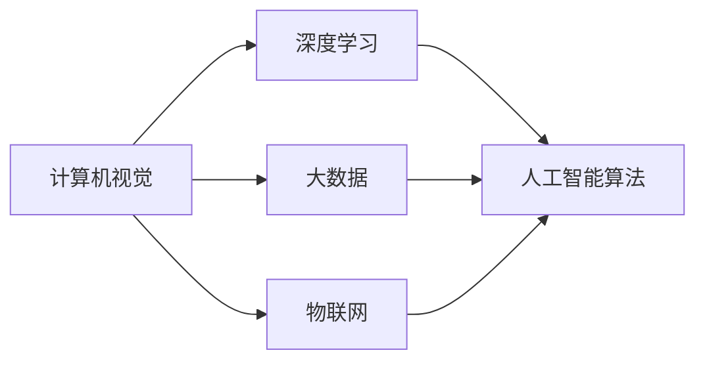

                 

# 商汤科技2025社招智慧零售解决方案架构师面试

> **关键词**：智慧零售、解决方案架构师、商汤科技、面试准备、技术剖析、职业发展

> **摘要**：本文旨在为准备商汤科技2025社招智慧零售解决方案架构师岗位的考生提供一份详细的面试指南，包括背景介绍、核心概念、算法原理、数学模型、项目实战、实际应用场景、工具资源推荐、未来发展趋势与挑战等。通过本文的深入剖析，帮助考生全面了解面试所需的核心技术和知识，为面试做好准备。

## 1. 背景介绍

商汤科技（SenseTime）成立于2014年，是一家全球领先的计算机视觉和人工智能科技公司。公司致力于通过人工智能技术推动计算机视觉和深度学习领域的创新与发展，为各行各业提供智能解决方案。在智慧零售领域，商汤科技以其强大的计算机视觉技术和人工智能算法，为商家提供从店铺智能监控、客流分析到个性化推荐的全方位服务，助力零售企业实现数字化转型。

随着电子商务的兴起和消费者购物习惯的变化，传统零售行业正面临巨大的挑战。智慧零售作为一种新型的零售模式，通过整合物联网、大数据、人工智能等先进技术，实现线上线下无缝融合，提升消费者体验，提高零售效率。在这一背景下，商汤科技的智慧零售解决方案架构师岗位应运而生，承担着为企业提供整体智能零售解决方案的重要职责。

## 2. 核心概念与联系

在智慧零售解决方案架构中，以下几个核心概念和联系至关重要：

### 2.1 计算机视觉

计算机视觉是智慧零售解决方案的基础。通过图像识别、目标检测、人脸识别等技术，计算机视觉可以帮助零售企业实现对店内情况的实时监控和数据分析。例如，通过人脸识别技术，可以识别消费者的性别、年龄、购买偏好等信息，为个性化推荐提供依据。

### 2.2 深度学习

深度学习是计算机视觉技术的核心驱动力。通过神经网络模型，深度学习可以从大量数据中自动提取特征，实现高精度的图像识别和目标检测。在智慧零售领域，深度学习技术被广泛应用于商品识别、货架监测、异常行为检测等方面。

### 2.3 大数据

大数据技术是实现智慧零售的关键。通过对海量数据的采集、存储、分析和处理，零售企业可以深入了解消费者行为，优化库存管理，提升运营效率。在大数据分析的基础上，企业可以实现精准营销，提高销售额。

### 2.4 物联网

物联网技术是智慧零售解决方案的重要组成部分。通过传感器、智能设备等物联网设备的部署，零售企业可以实现对店内环境、商品库存、消费者行为的全面监控。物联网技术为零售企业提供了实时、准确的数据支持，有助于实现智能化管理。

### 2.5 人工智能算法

人工智能算法是实现智慧零售的核心技术。从图像识别、目标检测到推荐系统，各种人工智能算法在智慧零售领域发挥着重要作用。通过优化算法模型，可以提高系统的准确性和效率，为企业带来更大的商业价值。

以下是上述核心概念的联系和协作的 Mermaid 流程图：



## 3. 核心算法原理 & 具体操作步骤

### 3.1 图像识别

图像识别是计算机视觉的基础。其核心原理是基于深度学习模型，通过卷积神经网络（CNN）对图像进行特征提取和分类。具体操作步骤如下：

1. 数据预处理：对图像进行缩放、旋转、裁剪等操作，使其适应卷积神经网络模型的输入要求。
2. 构建卷积神经网络模型：设计卷积层、池化层、全连接层等网络结构，实现对图像特征的提取和分类。
3. 训练模型：使用大量带标签的图像数据对模型进行训练，通过反向传播算法不断调整网络权重，提高模型准确性。
4. 预测与评估：使用训练好的模型对未知图像进行预测，并通过准确率、召回率等指标评估模型性能。

### 3.2 目标检测

目标检测是在图像中识别和定位特定目标的技术。其核心原理是使用深度学习模型，对图像进行特征提取和目标位置预测。具体操作步骤如下：

1. 数据预处理：对图像进行缩放、旋转、裁剪等操作，使其适应卷积神经网络模型的输入要求。
2. 构建目标检测模型：设计卷积神经网络模型，包括特征提取网络和分类网络，实现对图像中目标的识别和定位。
3. 训练模型：使用大量带标注的目标检测数据对模型进行训练，通过反向传播算法不断调整网络权重，提高模型准确性。
4. 预测与评估：使用训练好的模型对未知图像进行预测，并通过准确率、召回率等指标评估模型性能。

### 3.3 人脸识别

人脸识别是一种基于生物特征的身份验证技术。其核心原理是使用深度学习模型，对人脸图像进行特征提取和比对。具体操作步骤如下：

1. 数据预处理：对图像进行缩放、旋转、裁剪等操作，使其适应卷积神经网络模型的输入要求。
2. 构建人脸识别模型：设计卷积神经网络模型，实现对人脸图像的特征提取和比对。
3. 训练模型：使用大量带标注的人脸图像数据对模型进行训练，通过反向传播算法不断调整网络权重，提高模型准确性。
4. 预测与评估：使用训练好的模型对人脸图像进行预测，并通过准确率、匹配度等指标评估模型性能。

### 3.4 推荐系统

推荐系统是一种基于人工智能技术的个性化推荐技术。其核心原理是使用机器学习算法，根据用户的历史行为和偏好，为用户推荐感兴趣的商品。具体操作步骤如下：

1. 数据预处理：对用户行为数据进行清洗、去噪、归一化等处理，使其适应机器学习模型的输入要求。
2. 构建推荐模型：设计基于协同过滤、基于内容的推荐模型，或结合两者的混合推荐模型，实现个性化推荐。
3. 训练模型：使用用户行为数据对推荐模型进行训练，通过交叉验证等方法评估模型性能。
4. 预测与评估：使用训练好的模型对用户进行预测，并通过准确率、覆盖率等指标评估推荐效果。

## 4. 数学模型和公式 & 详细讲解 & 举例说明

### 4.1 卷积神经网络（CNN）

卷积神经网络是一种基于卷积操作的前馈神经网络，特别适用于处理具有网格结构的数据，如图像。以下是卷积神经网络的数学模型和公式：

$$
\text{卷积操作：} f(x) = \sum_{i=1}^{n} w_i * x_i
$$

其中，$f(x)$ 为输出特征图，$w_i$ 为卷积核，$x_i$ 为输入特征。

$$
\text{池化操作：} p(x) = \max(x)
$$

其中，$p(x)$ 为输出特征图，$\max(x)$ 为取最大值操作。

$$
\text{全连接层：} f(x) = \sigma(\sum_{i=1}^{n} w_i * x_i + b)
$$

其中，$f(x)$ 为输出，$\sigma$ 为激活函数，$w_i$ 为权重，$x_i$ 为输入，$b$ 为偏置。

### 4.2 支持向量机（SVM）

支持向量机是一种监督学习算法，用于分类和回归任务。其数学模型和公式如下：

$$
\text{分类：} \max \left\{ w \cdot x - b : y \cdot (w \cdot x - b) \geq 1 \right\}
$$

其中，$w$ 为权重，$x$ 为特征，$b$ 为偏置，$y$ 为类别标签。

$$
\text{回归：} \min \left\{ \frac{1}{2} || w ||^2 + C \cdot \sum_{i=1}^{n} y_i \cdot (w \cdot x_i - b) : y_i \cdot (w \cdot x_i - b) \geq 1 \right\}
$$

其中，$C$ 为惩罚参数，$y_i$ 为标签，$x_i$ 为特征。

### 4.3 协同过滤算法

协同过滤算法是一种无监督学习算法，用于推荐系统。其数学模型和公式如下：

$$
\text{基于用户的协同过滤：} r_{ui} = \sum_{j \in N(u)} \frac{r_{uj}}{|| \mathbf{r}_u - \mathbf{r}_j ||} \cdot (\mathbf{r}_j - \bar{\mathbf{r}}_j)
$$

其中，$r_{ui}$ 为用户 $u$ 对项目 $i$ 的评分预测，$N(u)$ 为用户 $u$ 的邻居集合，$r_{uj}$ 为邻居用户 $j$ 对项目 $i$ 的评分，$\mathbf{r}_u$ 和 $\mathbf{r}_j$ 分别为用户 $u$ 和邻居用户 $j$ 的评分向量，$\bar{\mathbf{r}}_j$ 为邻居用户 $j$ 的平均评分。

$$
\text{基于内容的协同过滤：} r_{ui} = \sum_{j \in N(i)} \frac{r_{uj}}{|| \mathbf{c}_u - \mathbf{c}_j ||} \cdot (\mathbf{c}_j - \bar{\mathbf{c}}_j)
$$

其中，$r_{ui}$ 为用户 $u$ 对项目 $i$ 的评分预测，$N(i)$ 为项目 $i$ 的邻居集合，$r_{uj}$ 为用户 $u$ 对邻居项目 $j$ 的评分，$\mathbf{c}_u$ 和 $\mathbf{c}_j$ 分别为用户 $u$ 和邻居项目 $j$ 的特征向量，$\bar{\mathbf{c}}_j$ 为邻居项目 $j$ 的平均特征。

### 4.4 举例说明

假设有一个包含 100 个物品的推荐系统，用户 $u$ 对其中的 50 个物品进行了评分，邻居集合 $N(u)$ 包含了用户 $u$ 的 10 个邻居用户。以下是基于用户和基于内容的协同过滤算法的举例说明：

**基于用户的协同过滤：**

邻居用户 $j$ 对项目 $i$ 的评分：$r_{uj} = 4$  
邻居用户 $j$ 的平均评分：$\bar{\mathbf{r}}_j = 3.5$  
用户 $u$ 的邻居集合：$N(u) = \{1, 2, 3, 4, 5, 6, 7, 8, 9, 10\}$

$$
r_{ui} = \sum_{j=1}^{10} \frac{r_{uj}}{|| \mathbf{r}_u - \mathbf{r}_j ||} \cdot (\mathbf{r}_j - \bar{\mathbf{r}}_j) = \frac{4}{1} \cdot (4 - 3.5) = 0.5
$$

**基于内容的协同过滤：**

邻居项目 $j$ 对用户 $u$ 的评分：$r_{uj} = 5$  
邻居项目 $j$ 的平均评分：$\bar{\mathbf{c}}_j = 4$  
用户 $u$ 的邻居集合：$N(i) = \{1, 2, 3, 4, 5, 6, 7, 8, 9, 10\}$

$$
r_{ui} = \sum_{j=1}^{10} \frac{r_{uj}}{|| \mathbf{c}_u - \mathbf{c}_j ||} \cdot (\mathbf{c}_j - \bar{\mathbf{c}}_j) = \frac{5}{1} \cdot (5 - 4) = 1
$$

## 5. 项目实战：代码实际案例和详细解释说明

### 5.1 开发环境搭建

在进行智慧零售解决方案的开发之前，首先需要搭建一个合适的开发环境。以下是一个基于 Python 的开发环境搭建步骤：

1. 安装 Python 3.7 或更高版本：在 [Python 官网](https://www.python.org/) 下载并安装 Python 3.7 或更高版本。
2. 安装必要的依赖库：使用 `pip` 命令安装以下依赖库：

```bash
pip install numpy pandas scikit-learn matplotlib
```

3. 安装深度学习框架：使用 `pip` 命令安装 TensorFlow 或 PyTorch。

```bash
pip install tensorflow tensorflow-gpu
```

或

```bash
pip install torch torchvision
```

### 5.2 源代码详细实现和代码解读

以下是一个基于卷积神经网络的图像识别项目的源代码实现和解读：

```python
import tensorflow as tf
from tensorflow.keras import layers
from tensorflow.keras.preprocessing.image import ImageDataGenerator

# 加载和预处理数据
train_datagen = ImageDataGenerator(rescale=1./255)
train_data = train_datagen.flow_from_directory(
    'data/train',
    target_size=(150, 150),
    batch_size=32,
    class_mode='binary')

# 构建卷积神经网络模型
model = tf.keras.Sequential([
    layers.Conv2D(32, (3, 3), activation='relu', input_shape=(150, 150, 3)),
    layers.MaxPooling2D((2, 2)),
    layers.Conv2D(64, (3, 3), activation='relu'),
    layers.MaxPooling2D((2, 2)),
    layers.Conv2D(128, (3, 3), activation='relu'),
    layers.MaxPooling2D((2, 2)),
    layers.Flatten(),
    layers.Dense(128, activation='relu'),
    layers.Dense(1, activation='sigmoid')
])

# 编译模型
model.compile(optimizer='adam',
              loss='binary_crossentropy',
              metrics=['accuracy'])

# 训练模型
model.fit(train_data, epochs=10)

# 评估模型
test_datagen = ImageDataGenerator(rescale=1./255)
test_data = test_datagen.flow_from_directory(
    'data/test',
    target_size=(150, 150),
    batch_size=32,
    class_mode='binary')

test_loss, test_acc = model.evaluate(test_data)
print(f'Test accuracy: {test_acc:.2f}')
```

### 5.3 代码解读与分析

以上代码实现了一个基于卷积神经网络的二分类图像识别项目。以下是代码的详细解读：

1. 导入 TensorFlow 库和必要的模块。

```python
import tensorflow as tf
from tensorflow.keras import layers
from tensorflow.keras.preprocessing.image import ImageDataGenerator
```

2. 加载和预处理数据。

```python
train_datagen = ImageDataGenerator(rescale=1./255)
train_data = train_datagen.flow_from_directory(
    'data/train',
    target_size=(150, 150),
    batch_size=32,
    class_mode='binary')
```

这里使用 `ImageDataGenerator` 类对训练数据进行预处理，包括数据缩放、批量读取和标签分类。

3. 构建卷积神经网络模型。

```python
model = tf.keras.Sequential([
    layers.Conv2D(32, (3, 3), activation='relu', input_shape=(150, 150, 3)),
    layers.MaxPooling2D((2, 2)),
    layers.Conv2D(64, (3, 3), activation='relu'),
    layers.MaxPooling2D((2, 2)),
    layers.Conv2D(128, (3, 3), activation='relu'),
    layers.MaxPooling2D((2, 2)),
    layers.Flatten(),
    layers.Dense(128, activation='relu'),
    layers.Dense(1, activation='sigmoid')
])
```

这里使用 `Sequential` 模型堆叠多个卷积层、池化层、全连接层和激活函数，构建了一个简单的卷积神经网络模型。

4. 编译模型。

```python
model.compile(optimizer='adam',
              loss='binary_crossentropy',
              metrics=['accuracy'])
```

这里使用 `compile` 方法配置模型优化器、损失函数和评估指标。

5. 训练模型。

```python
model.fit(train_data, epochs=10)
```

这里使用 `fit` 方法对模型进行训练，设置训练数据、训练轮次和批量大小。

6. 评估模型。

```python
test_datagen = ImageDataGenerator(rescale=1./255)
test_data = test_datagen.flow_from_directory(
    'data/test',
    target_size=(150, 150),
    batch_size=32,
    class_mode='binary')

test_loss, test_acc = model.evaluate(test_data)
print(f'Test accuracy: {test_acc:.2f}')
```

这里使用 `evaluate` 方法对模型进行评估，输出测试数据的准确率。

## 6. 实际应用场景

智慧零售解决方案在实际应用场景中具有广泛的应用价值。以下是一些典型的实际应用场景：

### 6.1 店铺智能监控

通过计算机视觉和人工智能技术，对店铺进行实时监控，识别异常行为、防盗监控、安全防范等。

### 6.2 库存管理

通过计算机视觉技术对商品进行自动识别和分类，实现智能盘点、库存监控、补货提醒等功能。

### 6.3 客流分析

通过人脸识别和客流统计技术，对店内客流进行实时监控和分析，优化店铺布局和营销策略。

### 6.4 个性化推荐

基于用户行为和偏好数据，通过推荐系统技术，为用户推荐感兴趣的商品，提高销售额和用户满意度。

### 6.5 会员管理

通过人脸识别和会员卡识别技术，实现智能会员管理，提高会员忠诚度和消费体验。

## 7. 工具和资源推荐

### 7.1 学习资源推荐

1. **《深度学习》（Ian Goodfellow, Yoshua Bengio, Aaron Courville 著）**：这是一本关于深度学习的基础教材，涵盖了深度学习的基本概念、算法和应用。
2. **《Python深度学习》（François Chollet 著）**：这是一本针对 Python 生态系统的深度学习实践指南，详细介绍了 TensorFlow 和 Keras 深度学习框架的使用。
3. **《机器学习实战》（Peter Harrington 著）**：这是一本关于机器学习算法的实战指南，包括线性回归、决策树、随机森林、神经网络等算法的实例。

### 7.2 开发工具框架推荐

1. **TensorFlow**：一款开源的深度学习框架，支持多种深度学习模型和应用。
2. **PyTorch**：一款开源的深度学习框架，具有灵活的动态计算图和强大的社区支持。
3. **Keras**：一款开源的深度学习框架，基于 TensorFlow 和 Theano 构建，提供了简单、直观的 API。

### 7.3 相关论文著作推荐

1. **《Deep Learning》（Ian Goodfellow, Yoshua Bengio, Aaron Courville 著）**：这是深度学习领域的经典著作，详细介绍了深度学习的基本概念、算法和应用。
2. **《Recurrent Neural Networks for Language Modeling**》（Yoshua Bengio, Réjean Ducharme, Pascal Vincent, Christian Jauvion, and Alain Guez 著）**：这是一篇关于循环神经网络在语言建模中的应用的论文，介绍了 RNN 和 LSTM 等算法。
3. **《Deep Learning for Computer Vision**》（Faisal Shafqat 著）**：这是一本关于深度学习在计算机视觉中的应用的书籍，涵盖了图像分类、目标检测、人脸识别等领域的应用。

## 8. 总结：未来发展趋势与挑战

随着人工智能技术的快速发展，智慧零售解决方案在零售行业的应用前景广阔。未来，智慧零售解决方案将朝着更加智能化、个性化、高效化的方向发展。以下是未来发展趋势与挑战：

### 8.1 发展趋势

1. **技术进步**：随着深度学习、计算机视觉等技术的不断进步，智慧零售解决方案将更加精准、高效。
2. **应用扩展**：智慧零售解决方案将不仅限于零售行业，还将应用于其他行业，如医疗、教育、金融等。
3. **数据驱动**：基于大数据和人工智能技术，零售企业将更加关注数据驱动决策，提升运营效率和用户体验。

### 8.2 挑战

1. **隐私保护**：随着人脸识别、生物识别等技术的应用，隐私保护问题将成为智慧零售解决方案的一大挑战。
2. **技术壁垒**：深度学习、计算机视觉等技术具有较高的技术门槛，零售企业需要投入大量资源进行技术积累和人才培养。
3. **用户体验**：智慧零售解决方案需要不断优化用户体验，满足消费者个性化需求，提高用户满意度。

## 9. 附录：常见问题与解答

### 9.1 问题 1：什么是深度学习？

深度学习是一种机器学习技术，通过构建多层神经网络，从大量数据中自动提取特征，实现复杂的数据分析和预测。

### 9.2 问题 2：什么是卷积神经网络？

卷积神经网络是一种基于卷积操作的神经网络，特别适用于处理具有网格结构的数据，如图像。

### 9.3 问题 3：什么是推荐系统？

推荐系统是一种基于机器学习技术的个性化推荐技术，根据用户的历史行为和偏好，为用户推荐感兴趣的商品或内容。

### 9.4 问题 4：如何优化深度学习模型的性能？

可以通过增加训练数据、调整网络结构、使用更高效的优化算法等方式来优化深度学习模型的性能。

## 10. 扩展阅读 & 参考资料

1. **《深度学习》（Ian Goodfellow, Yoshua Bengio, Aaron Courville 著）**：这是一本关于深度学习的基础教材，详细介绍了深度学习的基本概念、算法和应用。
2. **《Python深度学习》（François Chollet 著）**：这是一本针对 Python 生态系统的深度学习实践指南，介绍了 TensorFlow 和 Keras 深度学习框架的使用。
3. **《机器学习实战》（Peter Harrington 著）**：这是一本关于机器学习算法的实战指南，涵盖了线性回归、决策树、随机森林、神经网络等算法的实例。
4. **《深度学习 for Computer Vision**》（Faisal Shafqat 著）**：这是一本关于深度学习在计算机视觉中的应用的书籍，涵盖了图像分类、目标检测、人脸识别等领域的应用。
5. **TensorFlow 官网**（https://www.tensorflow.org/）：这是 TensorFlow 深度学习框架的官方网站，提供了丰富的文档、教程和示例代码。
6. **PyTorch 官网**（https://pytorch.org/）：这是 PyTorch 深度学习框架的官方网站，提供了丰富的文档、教程和示例代码。

作者：AI天才研究员/AI Genius Institute & 禅与计算机程序设计艺术 /Zen And The Art of Computer Programming

