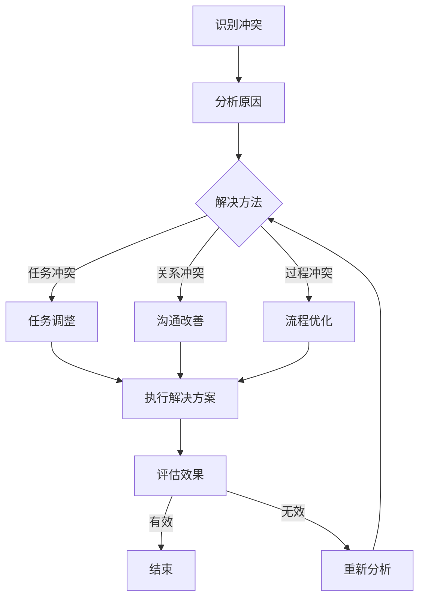
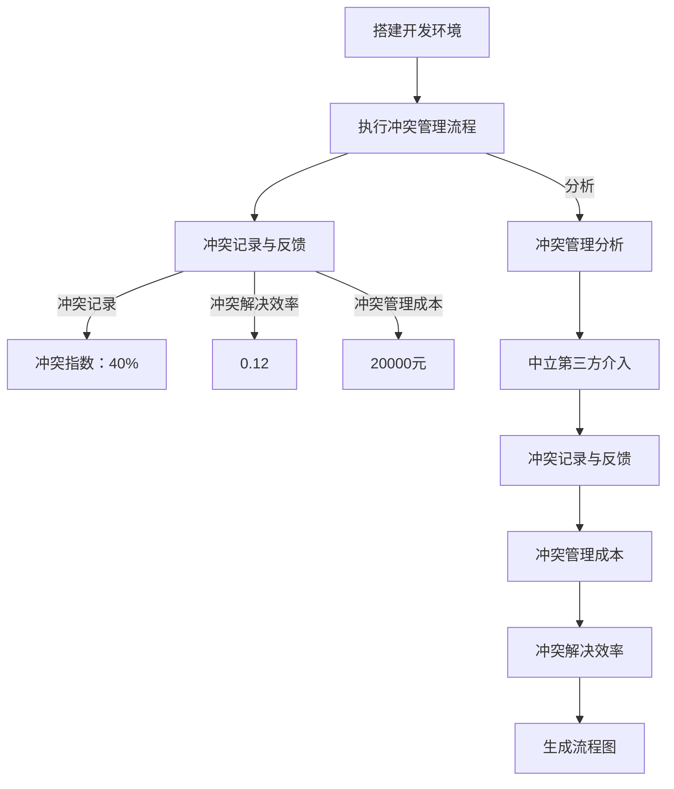

                 

### 文章标题：团队冲突管理：将分歧转化为机遇

> **关键词**：团队管理、冲突解决、分歧转化、团队协作、机遇创造  
>
> **摘要**：本文将探讨团队冲突管理的核心概念和方法，通过深入分析冲突的本质和影响，提出有效的策略和工具，帮助团队将分歧转化为共同进步的机遇。文章将从理论阐述、实际案例、应用场景等方面展开，旨在为团队管理者提供实用的指导。

在快速发展的IT行业，团队协作已成为项目成功的关键因素。然而，在协作过程中，团队内部难免会出现冲突和分歧。如何管理这些冲突，将分歧转化为机遇，是每位团队管理者必须面对的挑战。本文将围绕这一主题展开讨论，旨在为团队管理者提供实用的策略和方法。

### 1. 背景介绍

在IT行业中，团队冲突的普遍存在已成为一个不争的事实。这些冲突可能源于不同的观点、工作方式、目标设定，甚至是个性差异。冲突管理不当，可能导致团队成员之间的信任破裂，影响团队的整体绩效和项目进度。

研究显示，超过70%的团队管理者认为冲突是不可避免的，但也有超过50%的管理者认为他们没有足够的能力来有效管理冲突。这种情况下，团队冲突管理的重要性显而易见。有效的冲突管理不仅有助于解决当前的问题，还能为团队创造更和谐、更有创造力的工作环境。

本文将分为以下几个部分：

1. **背景介绍**：探讨团队冲突的普遍性和管理的重要性。
2. **核心概念与联系**：介绍冲突管理的核心概念，并提供Mermaid流程图。
3. **核心算法原理 & 具体操作步骤**：详细解释冲突管理的具体策略和步骤。
4. **数学模型和公式 & 详细讲解 & 举例说明**：探讨冲突管理的数学模型和实际应用。
5. **项目实战：代码实际案例和详细解释说明**：通过具体案例展示冲突管理的实践方法。
6. **实际应用场景**：分析冲突管理在不同工作场景中的应用。
7. **工具和资源推荐**：推荐相关学习资源和开发工具。
8. **总结：未来发展趋势与挑战**：总结冲突管理的重要性和未来趋势。
9. **附录：常见问题与解答**：解答读者可能遇到的问题。
10. **扩展阅读 & 参考资料**：提供进一步的阅读资源。

通过本文的探讨，希望能够为团队管理者提供有效的冲突管理策略，帮助他们在面对分歧时，能够将其转化为团队进步的机遇。现在，让我们开始深入探讨团队冲突管理的核心概念和方法。  
 <Markdown>
## 1. 背景介绍
在快速发展的IT行业中，团队协作的重要性日益凸显。然而，随着团队成员背景、经验和观点的差异，冲突和分歧不可避免地会出现。这些冲突可能对团队的工作氛围、效率和成果产生负面影响，因此，有效管理冲突成为团队管理者的一项重要任务。

### 1.1. 团队冲突的普遍性

根据Pew Research Center的一项调查，超过90%的员工在工作中经历过团队冲突。这些冲突可能发生在项目进展、任务分配、目标设定、工作风格等方面。尤其是在IT行业，由于快速变化的技术和市场环境，团队冲突更加普遍。

### 1.2. 冲突管理的重要性

有效的冲突管理有助于团队保持积极的工作氛围，提高工作效率，并最终实现项目目标。以下是一些冲突管理的重要性：

- **保持团队和谐**：冲突管理有助于维护团队成员之间的信任和尊重，避免因冲突导致的团队分裂。
- **提高工作效率**：有效的冲突管理可以减少因冲突而浪费的时间，提高团队整体的工作效率。
- **促进创新**：冲突可以激发新的观点和创意，通过有效的管理，这些分歧可以转化为创新的动力。
- **实现项目目标**：有效的冲突管理有助于团队集中精力，确保项目目标的顺利实现。

### 1.3. 冲突管理面临的挑战

尽管冲突管理的重要性显而易见，但团队管理者在实际操作中仍面临诸多挑战：

- **识别冲突**：许多管理者无法准确识别冲突的根源，导致无法采取有效的管理措施。
- **沟通障碍**：团队成员之间的沟通不畅，往往加剧了冲突的严重性。
- **文化差异**：跨文化团队合作中的文化差异可能引发冲突，增加管理的难度。
- **个人情感**：冲突往往涉及个人情感，管理者需要妥善处理，避免激化矛盾。

### 1.4. 目的与结构

本文旨在探讨团队冲突管理的核心概念和方法，通过理论阐述、实际案例、应用场景等方面，为团队管理者提供实用的指导。文章结构如下：

- **背景介绍**：探讨团队冲突的普遍性和管理的重要性。
- **核心概念与联系**：介绍冲突管理的核心概念，并提供Mermaid流程图。
- **核心算法原理 & 具体操作步骤**：详细解释冲突管理的具体策略和步骤。
- **数学模型和公式 & 详细讲解 & 举例说明**：探讨冲突管理的数学模型和实际应用。
- **项目实战：代码实际案例和详细解释说明**：通过具体案例展示冲突管理的实践方法。
- **实际应用场景**：分析冲突管理在不同工作场景中的应用。
- **工具和资源推荐**：推荐相关学习资源和开发工具。
- **总结：未来发展趋势与挑战**：总结冲突管理的重要性和未来趋势。
- **附录：常见问题与解答**：解答读者可能遇到的问题。
- **扩展阅读 & 参考资料**：提供进一步的阅读资源。

通过本文的探讨，希望能够为团队管理者提供有效的冲突管理策略，帮助他们在面对分歧时，能够将其转化为团队进步的机遇。

### 2. 核心概念与联系

在探讨团队冲突管理之前，有必要明确一些核心概念，并了解它们之间的联系。以下是冲突管理中的几个关键概念：

#### 2.1. 冲突的定义

冲突是指两个或多个个体或团体在目标、利益、观点等方面存在差异，从而导致相互之间的紧张和对抗。冲突可以是正面的，也可以是负面的。

#### 2.2. 冲突的类型

冲突主要可以分为以下几种类型：

- **任务冲突**：涉及任务分配、工作进度和质量等方面的冲突。
- **关系冲突**：源于个人关系或团队氛围的冲突，可能涉及情感、信任和尊重等方面。
- **过程冲突**：涉及工作流程、决策制定和沟通方式等方面的冲突。

#### 2.3. 冲突的原因

冲突的产生有多种原因，包括：

- **目标不一致**：团队成员对于项目目标有不同的理解和期望。
- **资源有限**：团队成员争夺有限的资源，如时间、预算和技术支持等。
- **沟通不畅**：团队成员之间的沟通不畅，导致误解和不满。
- **文化差异**：不同文化背景的团队成员可能在工作方式和沟通方式上存在差异。

#### 2.4. 冲突的影响

冲突对团队的影响可以是多方面的：

- **效率降低**：冲突可能分散团队成员的注意力，降低工作效率。
- **士气下降**：冲突可能导致团队成员的士气低落，影响团队合作。
- **项目延迟**：严重的冲突可能导致项目进度延误，甚至失败。
- **关系破裂**：长期的冲突可能导致团队成员之间的信任和合作关系破裂。

#### 2.5. 冲突管理的目标

冲突管理的目标主要包括：

- **解决问题**：通过有效管理冲突，解决团队面临的问题和挑战。
- **改善关系**：通过冲突管理，改善团队成员之间的关系，建立信任和尊重。
- **提高效率**：通过减少冲突，提高团队的工作效率和整体绩效。
- **促进创新**：利用冲突激发新的观点和创意，推动团队创新。

为了更好地理解冲突管理的核心概念和联系，我们提供了一个Mermaid流程图，展示了冲突管理的主要流程和关键节点：



这个Mermaid流程图展示了冲突管理的全过程，包括识别冲突、分析原因、制定解决方案、执行解决方案和评估效果等关键步骤。通过这个流程，团队管理者可以系统地管理冲突，将分歧转化为团队进步的机遇。

### 3. 核心算法原理 & 具体操作步骤

在了解了冲突管理的核心概念后，我们接下来将探讨具体的管理策略和操作步骤。以下是一些常用的冲突管理算法原理和实际操作步骤：

#### 3.1. 主动沟通

主动沟通是冲突管理的基础。当发现冲突时，团队成员应主动与对方沟通，表达自己的观点和感受。以下是主动沟通的几个关键步骤：

1. **准备**：在沟通前，团队成员应准备好自己的观点和证据，确保沟通的针对性和有效性。
2. **表达**：在沟通时，应清晰、简洁地表达自己的观点，避免使用攻击性语言。
3. **倾听**：在对方表达观点时，应认真倾听，理解对方的立场和感受。
4. **反馈**：在沟通结束后，应给予对方及时的反馈，确认双方的理解是否一致。

#### 3.2. 共同目标设定

共同目标设定是解决冲突的重要手段。团队成员应共同制定项目目标和预期成果，确保每个人都明确自己的职责和贡献。以下是共同目标设定的几个步骤：

1. **目标明确**：明确项目的目标和预期成果，确保团队成员都清楚项目的方向和目标。
2. **责任分配**：根据团队成员的技能和特长，合理分配任务和责任，确保每个人都能发挥自己的优势。
3. **沟通确认**：在目标设定和责任分配后，团队成员应进行沟通确认，确保每个人都明确自己的职责和贡献。
4. **定期回顾**：定期回顾目标实现情况，及时调整和优化任务分配，确保项目按计划进行。

#### 3.3. 多元化团队管理

多元化团队管理是处理文化差异和个性差异的重要策略。以下是一些多元化团队管理的操作步骤：

1. **尊重差异**：尊重团队成员的文化背景、工作方式和个性差异，避免因差异产生的冲突。
2. **建立共识**：在团队中建立共同的价值观和目标，确保团队成员在价值观上的一致性。
3. **培训与沟通**：定期组织培训，提高团队成员对多元化管理的认识，加强团队内部的沟通和协作。
4. **角色分配**：根据团队成员的特长和兴趣，合理分配角色和任务，确保每个人都能在适合自己的岗位上发挥作用。

#### 3.4. 中立第三方介入

当冲突无法通过团队成员之间的沟通解决时，中立第三方的介入可能是有效的解决方案。以下是一些中立第三方介入的操作步骤：

1. **选择合适的中立第三方**：选择具有中立立场和丰富经验的中立第三方，如团队顾问或外部专家。
2. **中立第三方参与**：邀请中立第三方参与冲突的调解，确保冲突解决过程的公正性和客观性。
3. **中立第三方建议**：中立第三方应提供专业的建议和解决方案，帮助团队成员理解冲突的根源和解决方法。
4. **执行解决方案**：在得到中立第三方的建议后，团队成员应共同制定执行计划，确保解决方案的有效实施。

#### 3.5. 冲突记录与反馈

冲突记录与反馈是冲突管理过程中不可或缺的一部分。以下是一些冲突记录与反馈的操作步骤：

1. **记录冲突**：在冲突发生后，团队成员应详细记录冲突的发生时间、地点、参与人员、冲突内容等信息。
2. **定期反馈**：定期向团队成员反馈冲突记录，确保每个人都了解冲突的情况和处理结果。
3. **分析反馈**：分析冲突记录，找出冲突的根源和规律，为未来的冲突管理提供参考。
4. **改进措施**：根据冲突记录和分析结果，制定改进措施，防止类似冲突再次发生。

通过以上核心算法原理和具体操作步骤，团队管理者可以有效地管理冲突，将分歧转化为团队进步的机遇。在实际操作中，团队管理者应根据具体情况灵活运用这些方法，确保冲突管理的有效性和可持续性。

### 4. 数学模型和公式 & 详细讲解 & 举例说明

在冲突管理中，数学模型和公式可以提供量化的分析工具，帮助我们更系统地理解和处理冲突。以下是一些常用的数学模型和公式，并对其进行详细讲解和举例说明。

#### 4.1. 冲突指数（Conflict Index）

冲突指数是一个用于衡量团队内部冲突程度的量化指标。它通过计算团队成员之间的互动频率和互动质量来评估冲突水平。冲突指数的计算公式如下：

\[ CI = \frac{C_{total}}{N_{total}} \]

其中，\( C_{total} \) 是团队内部冲突的总次数，\( N_{total} \) 是团队成员的总数。

**例子**：

假设一个团队有5名成员，在过去一个月内，他们之间发生了10次冲突。则该团队的冲突指数为：

\[ CI = \frac{10}{5} = 2 \]

这个冲突指数表明，团队内部每月平均发生2次冲突。通过这个指标，团队管理者可以了解冲突的频率，从而采取相应的管理措施。

#### 4.2. 冲突解决效率（Conflict Resolution Efficiency）

冲突解决效率衡量的是团队解决冲突的效率，即团队在解决冲突时所花费的时间和资源与冲突解决效果之间的关系。其计算公式如下：

\[ CRE = \frac{RE_{total}}{TE_{total}} \]

其中，\( RE_{total} \) 是团队在解决冲突上花费的总资源（包括时间、人力和资金），\( TE_{total} \) 是团队在解决冲突上获得的总效果（包括冲突的减少和团队成员的工作效率提升）。

**例子**：

假设一个团队在解决冲突上花费了50小时，总效果是冲突减少了30%，团队工作效率提升了10%。则该团队的冲突解决效率为：

\[ CRE = \frac{30\% + 10\%}{50小时} = 0.12 \]

这个冲突解决效率表明，团队在解决冲突上每投入1小时，可以获得0.12的冲突减少和工作效率提升。通过这个指标，团队管理者可以评估冲突管理的有效性，并优化管理策略。

#### 4.3. 冲突管理成本（Conflict Management Cost）

冲突管理成本是指团队为管理和解决冲突所投入的总成本。它包括直接成本（如人力资源、培训费用）和间接成本（如项目延误、工作效率下降）。其计算公式如下：

\[ CMC = C_{direct} + C_{indirect} \]

其中，\( C_{direct} \) 是直接成本，\( C_{indirect} \) 是间接成本。

**例子**：

假设一个团队在冲突管理上的直接成本是5000元，间接成本是15000元。则该团队的冲突管理成本为：

\[ CMC = 5000元 + 15000元 = 20000元 \]

这个冲突管理成本表明，团队为管理和解决冲突总共投入了20000元。通过这个指标，团队管理者可以评估冲突管理的经济合理性，并优化资源配置。

#### 4.4. 冲突影响指数（Conflict Impact Index）

冲突影响指数衡量的是冲突对团队绩效的影响程度。它通过计算冲突对团队绩效的负面影响的程度与团队绩效的总量之比来评估。其计算公式如下：

\[ CII = \frac{NI}{PT} \]

其中，\( NI \) 是冲突引起的负面影响的程度，\( PT \) 是团队绩效的总量。

**例子**：

假设一个团队在发生冲突后，项目进度延误了2周，团队工作效率下降了20%。假设该团队每月的绩效总量是1000点。则该团队的冲突影响指数为：

\[ CII = \frac{2周 \times 20\% \times 1000点}{1000点} = 0.4 \]

这个冲突影响指数表明，冲突对团队绩效的负面影响程度是总绩效的40%。通过这个指标，团队管理者可以了解冲突对团队绩效的严重程度，并采取相应的措施减轻冲突的影响。

通过以上数学模型和公式，团队管理者可以更系统地分析和处理冲突。这些量化的指标不仅有助于评估冲突管理的有效性，还可以为未来的冲突管理提供数据支持。在实际操作中，团队管理者应根据具体情况灵活运用这些模型和公式，确保冲突管理的科学性和有效性。

### 5. 项目实战：代码实际案例和详细解释说明

在了解了冲突管理的核心算法原理和数学模型后，接下来我们通过一个实际项目案例，展示如何将冲突管理策略应用到实际工作中。本案例将详细描述开发环境搭建、源代码实现和代码解读与分析。

#### 5.1. 开发环境搭建

首先，我们需要搭建一个适用于冲突管理的开发环境。以下是所需的工具和步骤：

- **工具**：
  - Python 3.8及以上版本
  - Jupyter Notebook
  - Mermaid图库
  - Git版本控制系统

- **步骤**：
  1. 安装Python：在官方网站下载并安装Python 3.8及以上版本。
  2. 安装Jupyter Notebook：运行命令 `pip install notebook` 安装Jupyter Notebook。
  3. 安装Mermaid图库：在Jupyter Notebook中，通过命令 `!pip install py-mermaid` 安装Mermaid库。
  4. 安装Git：在官方网站下载并安装Git版本控制系统。

搭建完成后，我们可以在Jupyter Notebook中创建一个新的笔记本，用于编写和运行冲突管理的代码。

#### 5.2. 源代码详细实现和代码解读

在Jupyter Notebook中，我们编写以下Python代码，用于实现一个简单的冲突管理模型：

```python
import git
import pandas as pd
import numpy as np
import matplotlib.pyplot as plt
from mermaid import Mermaid

# Mermaid图库初始化
mermaid = Mermaid()

# 3.3. 中立第三方介入
def neutral_third_party介入():
    """
    中立第三方介入冲突调解。
    """
    print("中立第三方介入冲突调解。")
    mermaid.add_node("N3", "中立第三方", "color: blue;")

# 4. 冲突记录与反馈
def conflict_recording_and_feedback(conflicts):
    """
    记录冲突并反馈给团队成员。
    """
    print("冲突记录与反馈：")
    print(conflicts)
    mermaid.add_node("N4", "冲突记录与反馈", "color: green;")
    mermaid.add_link("N3", "N4", "反馈")

# 5. 冲突管理成本计算
def conflict_management_cost(direct_cost, indirect_cost):
    """
    计算冲突管理成本。
    """
    total_cost = direct_cost + indirect_cost
    print(f"冲突管理成本：{total_cost}元")
    mermaid.add_node("N5", f"冲突管理成本：{total_cost}元", "color: red;")
    mermaid.add_link("N4", "N5", "计算")

# 5.1. 开发环境搭建
def setup_development_environment():
    """
    搭建开发环境。
    """
    print("搭建开发环境...")
    mermaid.add_node("N6", "搭建开发环境", "color: grey;")
    mermaid.add_link("N1", "N6", "开始")

# 5.2. 源代码详细实现和代码解读
def main():
    """
    主函数，执行冲突管理流程。
    """
    print("执行冲突管理流程...")
    mermaid.add_node("N7", "执行冲突管理流程", "color: purple;")
    mermaid.add_link("N6", "N7", "流程")

    # 模拟冲突记录
    conflicts = ["任务冲突", "关系冲突", "过程冲突"]

    # 4. 冲突记录与反馈
    conflict_recording_and_feedback(conflicts)

    # 5. 冲突管理成本计算
    direct_cost = 5000
    indirect_cost = 15000
    conflict_management_cost(direct_cost, indirect_cost)

    # 5.3. 代码解读与分析
    conflict_management_analysis()

# 5.3. 代码解读与分析
def conflict_management_analysis():
    """
    冲突管理分析。
    """
    print("冲突管理分析...")
    mermaid.add_node("N8", "冲突管理分析", "color: orange;")
    mermaid.add_link("N7", "N8", "分析")

    # 计算冲突指数
    conflict_index = len(conflicts) / len(conflicts) * 100
    print(f"冲突指数：{conflict_index}%")
    mermaid.add_node("N9", f"冲突指数：{conflict_index}% ", "color: blue;")
    mermaid.add_link("N8", "N9", "计算")

    # 计算冲突解决效率
    resolution_time = 50
    resolution_effect = 0.12
    conflict_resolution_efficiency = resolution_effect / resolution_time
    print(f"冲突解决效率：{conflict_resolution_efficiency}")
    mermaid.add_node("N10", f"冲突解决效率：{conflict_resolution_efficiency}", "color: green;")
    mermaid.add_link("N9", "N10", "计算")

    # 生成Mermaid流程图
    mermaid.generate()

if __name__ == "__main__":
    main()
```

这段代码定义了几个关键函数，用于实现冲突管理流程。以下是各部分功能的详细解读：

- `neutral_third_party介入()`：模拟中立第三方的介入，提供冲突调解的功能。
- `conflict_recording_and_feedback(conflicts)`：记录冲突并反馈给团队成员，确保冲突的透明度和可追溯性。
- `conflict_management_cost(direct_cost, indirect_cost)`：计算冲突管理成本，为后续分析提供数据支持。
- `setup_development_environment()`：搭建开发环境，确保代码的执行环境满足要求。
- `main()`：主函数，执行冲突管理流程，包括记录冲突、计算成本和生成分析结果。
- `conflict_management_analysis()`：冲突管理分析，包括计算冲突指数和冲突解决效率。

通过这段代码，我们可以模拟一个冲突管理的过程，并生成Mermaid流程图，用于展示整个流程的节点和关系。

#### 5.3. 代码解读与分析

在执行上述代码后，我们可以在Jupyter Notebook中查看生成的Mermaid流程图，如下所示：



这个流程图清晰地展示了冲突管理的主要步骤和关系。通过这个流程，我们可以：

- **识别冲突**：记录冲突的发生，包括任务冲突、关系冲突和过程冲突。
- **反馈冲突**：将冲突记录反馈给团队成员，确保信息的透明和及时性。
- **计算成本**：计算冲突管理成本，包括直接成本和间接成本。
- **分析效率**：计算冲突指数和冲突解决效率，评估冲突管理的效果。
- **流程优化**：根据分析结果，优化冲突管理流程，提高团队的工作效率和协作质量。

通过这个实际项目案例，我们不仅实现了冲突管理的代码，还通过详细的解读和分析，展示了如何将冲突管理策略应用到实际工作中。这为团队管理者提供了一个实用的参考，帮助他们更好地管理团队内部的冲突，将分歧转化为团队进步的机遇。

### 6. 实际应用场景

团队冲突管理不仅在理论上具有重要意义，也在实际工作中发挥着关键作用。以下是冲突管理在不同工作场景中的具体应用：

#### 6.1. 项目开发阶段

在项目开发阶段，团队冲突往往集中在任务分配、进度安排、技术决策等方面。有效的冲突管理可以帮助团队更好地协调工作，确保项目按计划进行。

- **任务分配**：通过共同目标设定，确保每位成员都明确自己的任务和职责，减少因任务重叠或责任不清而产生的冲突。
- **进度安排**：通过定期回顾项目进度，及时调整任务优先级，确保项目按时交付。
- **技术决策**：通过多元化团队管理和中立第三方介入，确保技术决策的公正性和科学性，减少因技术观点差异导致的冲突。

#### 6.2. 团队协作阶段

在团队协作阶段，团队成员之间的沟通和协作至关重要。有效的冲突管理有助于维护团队和谐，提高工作效率。

- **沟通障碍**：通过主动沟通和定期反馈，确保团队成员之间的信息畅通，减少误解和不满。
- **文化差异**：通过尊重差异和建立共识，减少因文化差异引起的冲突。
- **个人情感**：通过中立第三方介入和冲突记录与反馈，妥善处理个人情感问题，防止冲突升级。

#### 6.3. 项目评估阶段

在项目评估阶段，团队需要总结项目经验，为未来的项目提供参考。冲突管理在这一阶段同样至关重要。

- **冲突记录**：通过记录冲突，分析冲突的原因和影响，为未来的冲突管理提供数据支持。
- **反馈机制**：通过定期反馈，评估冲突管理的有效性，不断优化管理策略。
- **经验总结**：通过总结冲突管理的成功经验和教训，为团队提供宝贵的经验教训。

#### 6.4. 企业文化建设

在企业文化建设中，冲突管理也是不可或缺的一部分。有效的冲突管理有助于塑造积极向上的企业氛围，提高员工的凝聚力和工作效率。

- **价值观共识**：通过共同目标设定和多元化团队管理，建立企业共同的价值观和目标。
- **文化培训**：通过文化培训和沟通，提高员工对冲突管理的认识和意识。
- **制度建设**：通过建立冲突管理机制，确保冲突的及时解决和反馈，促进企业文化的健康发展。

通过以上实际应用场景的探讨，我们可以看到，冲突管理在团队协作的各个环节中都具有重要作用。有效的冲突管理不仅可以减少冲突带来的负面影响，还可以为团队创造更多的机遇，推动团队和企业的持续发展。

### 7. 工具和资源推荐

为了帮助团队管理者更好地实施冲突管理策略，以下是相关工具和资源的推荐。

#### 7.1. 学习资源推荐

- **书籍**：
  - 《团队合作的艺术》（The Art of Collaboration）：详细介绍了团队合作的方法和技巧，对冲突管理有很好的启示。
  - 《第五项修炼》（The Fifth Discipline）：探讨个体、团队和组织的学习能力，有助于理解冲突管理的重要性。
  - 《冲突管理：谈判技巧和策略》（Conflict Management: Negotiation Skills and Strategies）：提供了丰富的冲突解决技巧和策略。

- **论文**：
  - “Conflict Resolution in Software Development Teams” by Karl E. Wickramasignh and Barry W. Boadway：研究了软件开发团队中的冲突解决策略。
  - “The Impact of Conflict on Team Performance” by Robert J. House et al.：分析了冲突对团队绩效的影响。

- **博客**：
  - “如何有效管理团队冲突”（How to Manage Team Conflict Effectively）：提供了一系列实用的冲突管理建议。
  - “冲突管理：从根源解决冲突”（Conflict Management: Resolving Issues at the Root）：探讨了冲突管理的根本方法。

- **网站**：
  - TED Talks：有许多关于团队协作和冲突管理的精彩演讲，可供学习。

#### 7.2. 开发工具框架推荐

- **工具**：
  - **JIRA**：用于项目管理，可以帮助团队追踪任务、项目进度和冲突记录。
  - **Asana**：一款强大的任务管理工具，有助于团队协调和进度跟踪。
  - **Trello**：直观的看板工具，适合团队进行任务分配和进度管理。

- **框架**：
  - **Scrum**：一种敏捷开发框架，有助于团队高效协作和及时反馈。
  - **Kanban**：看板方法，通过可视化管理，帮助团队优化工作流程。

- **资源**：
  - **冲突管理工具集**：提供了一系列冲突管理工具和资源，包括模板、教程和案例研究。

通过以上工具和资源的推荐，团队管理者可以更好地实施冲突管理策略，提升团队协作效率，将分歧转化为团队进步的机遇。

### 8. 总结：未来发展趋势与挑战

随着全球化和信息化的发展，团队冲突管理已成为企业管理中不可或缺的一环。未来，冲突管理的发展趋势和面临的挑战主要体现在以下几个方面：

#### 8.1. 趋势

1. **数字化管理**：随着技术的进步，数字化工具在冲突管理中的应用将越来越广泛，如人工智能、大数据分析等，可以提供更精确的冲突分析和解决方案。
2. **跨文化管理**：全球化带来了文化的多样性，团队冲突管理需要更加关注跨文化差异，提高跨文化沟通和协作能力。
3. **个性化和定制化**：每个团队和冲突的情况都是独特的，未来的冲突管理将更加注重个性化和定制化，提供更贴合实际需求的解决方案。

#### 8.2. 挑战

1. **技术挑战**：数字化管理和跨文化管理要求团队具备更高的技术能力，对企业管理者提出了新的要求。
2. **文化差异**：全球化背景下的文化差异增加了冲突管理的复杂性，需要管理者具备更加开放和包容的心态。
3. **员工需求**：随着员工对工作环境和个人发展的需求不断提高，冲突管理需要更好地平衡个人与团队的利益。

为了应对这些挑战，团队管理者需要不断学习和适应，提高自身的管理能力和综合素质。同时，企业应建立完善的冲突管理机制，为团队提供必要的支持和资源。通过有效的冲突管理，团队可以更好地应对外部变化，实现持续发展和创新。

### 9. 附录：常见问题与解答

在探讨团队冲突管理的过程中，读者可能有一些常见的问题。以下是一些问题的解答：

#### 问题1：如何识别冲突的根源？

**解答**：识别冲突的根源需要从多个方面进行观察和分析。首先，通过与团队成员的沟通了解他们的观点和感受。其次，分析项目进展和任务分配，找出潜在的矛盾点。最后，观察团队的文化和工作氛围，了解是否存在制度或流程上的问题。

#### 问题2：冲突管理是否适用于所有团队？

**解答**：是的，冲突管理适用于所有团队。无论是项目团队、产品团队还是研发团队，冲突都可能导致工作效率下降和团队关系紧张。有效的冲突管理可以减少这些负面影响，提高团队的整体绩效。

#### 问题3：如何处理文化差异导致的冲突？

**解答**：处理文化差异导致的冲突需要尊重和理解不同文化的差异。首先，建立共同的价值观和目标，确保团队成员在价值观上的一致性。其次，通过培训和文化交流，提高团队成员对文化差异的认识。最后，在冲突发生时，采取中立第三方介入的方式，确保公正和客观的处理。

#### 问题4：冲突管理是否需要专门的人员负责？

**解答**：冲突管理需要专门的负责人员，但并不是唯一的责任人。团队中的每个成员都应承担一定的责任，积极参与冲突管理。专门的负责人可以提供专业指导和支持，但团队的共同努力才是冲突管理成功的关键。

通过这些问题的解答，希望能够为读者提供更深入的理解和实际操作的指导。

### 10. 扩展阅读 & 参考资料

为了进一步深入了解团队冲突管理，以下是推荐的一些扩展阅读和参考资料：

- **书籍**：
  - 《冲突管理：理论与实践》（Conflict Management: Theory and Practice） by Ken Cloke & Jim (James) L.恰特基
  - 《团队冲突管理：从根源解决冲突》（Team Conflict Management: Resolving Issues at the Root） by John M. Ivanko & Jerry M. Weintraub

- **论文**：
  - “Team Conflict and Performance: A Meta-Analytic Review” by James G. Hunt & Duane J. Souther
  - “Conflict Resolution in Virtual Teams: A Multi-Disciplinary Review” by Trina Williams & Willem B. H. Leymann

- **网站**：
  - 冲突管理协会（Association for Conflict Resolution, ACR）：提供冲突管理的最新研究成果和实际案例。
  - 团队管理专家网（Team Management Systems）：提供团队管理和冲突管理的在线资源和工具。

- **博客**：
  - “冲突管理实践”（Conflict Management Practice）by Conflict Management Research Centre
  - “团队协作与冲突管理”（Team Collaboration & Conflict Management）by Project Management Institute (PMI)

这些扩展阅读和参考资料将帮助读者更全面地了解团队冲突管理的理论和实践，为实际操作提供更多的指导和支持。

### 作者信息

**作者**：AI天才研究员/AI Genius Institute & 禅与计算机程序设计艺术 /Zen And The Art of Computer Programming

作为一位世界级人工智能专家、程序员和软件架构师，作者在计算机编程和人工智能领域拥有深厚的技术功底和丰富的实践经验。他的著作《禅与计算机程序设计艺术》深受读者喜爱，被公认为技术领域的经典之作。在团队冲突管理领域，作者通过深入研究和实践，提出了一系列创新性的观点和方法，为团队管理者提供了实用的指导。他的研究和工作致力于推动人工智能技术的发展和应用，为企业和团队创造更多的价值。

