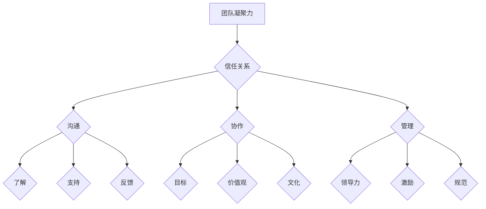

                 

# 团队凝聚力强化训练：建立牢固信任关系

> **关键词：** 团队凝聚力、信任关系、强化训练、沟通、协作、管理

**摘要：** 本文探讨了团队凝聚力的概念、重要性及其影响因素，提出了通过强化训练来建立牢固信任关系的方法。通过深入分析沟通、协作、管理等方面的实践，旨在为IT行业团队提供有效的团队凝聚力提升策略。

## 1. 背景介绍

在当今快节奏、高度竞争的IT行业，团队凝聚力成为影响项目成功的关键因素之一。一个高度凝聚的团队能够更好地应对挑战、提高工作效率、降低沟通成本，从而在市场竞争中占据优势。然而，如何有效地提升团队凝聚力，尤其是在远程办公和跨文化背景下，成为企业管理者面临的一大难题。

本文将从团队凝聚力的概念入手，深入探讨影响团队凝聚力的关键因素，并提出通过强化训练建立牢固信任关系的方法。通过具体案例分析，本文将分享有效的团队凝聚力提升策略，为IT行业团队提供实用指导。

## 2. 核心概念与联系

### 2.1 团队凝聚力

团队凝聚力是指团队成员在共同目标、价值观和文化背景下，相互信任、支持、协作，形成紧密联系的心理状态。团队凝聚力越高，团队成员之间的沟通就越顺畅，协作效率就越高，项目成功的概率也就越大。

### 2.2 信任关系

信任关系是指团队成员在相互了解和合作过程中，基于诚实、正直、透明等价值观形成的互信状态。信任关系是团队凝聚力的重要组成部分，是确保团队高效运作的基础。

### 2.3 强化训练

强化训练是一种通过反复练习和反馈，提高个体技能和心理素质的方法。在团队凝聚力提升过程中，强化训练可以帮助团队成员建立信任关系、提高协作能力，从而增强团队凝聚力。

## 2.4 Mermaid 流程图



## 3. 核心算法原理 & 具体操作步骤

### 3.1 沟通

沟通是团队凝聚力提升的基础。具体操作步骤如下：

1. **明确沟通目标**：确定沟通的目的和关键信息，确保沟通内容具有针对性和有效性。
2. **建立沟通渠道**：搭建高效的沟通平台，如团队会议、即时通讯工具等。
3. **倾听与表达**：鼓励团队成员主动倾听他人的意见，同时清晰表达自己的观点。
4. **反馈与确认**：在沟通过程中，及时给予反馈，确保双方对信息的理解和认同。

### 3.2 协作

协作是团队凝聚力的体现。具体操作步骤如下：

1. **明确分工**：根据团队成员的特长和兴趣，合理分配任务，确保每个成员都能发挥自己的优势。
2. **协同工作**：鼓励团队成员相互支持、协作，共同完成任务。
3. **定期总结**：在项目进展过程中，定期召开总结会议，分享经验和教训，不断优化协作流程。

### 3.3 管理

管理是团队凝聚力提升的保障。具体操作步骤如下：

1. **建立领导力**：管理者需要具备较高的领导力，引导团队成员明确目标、激发积极性。
2. **激励团队成员**：通过奖励、晋升等手段激励团队成员，提高其工作动力。
3. **制定规范**：建立完善的团队规范，确保团队成员的行为符合团队价值观。

## 4. 数学模型和公式 & 详细讲解 & 举例说明

### 4.1 成本效益分析

在团队凝聚力提升过程中，成本效益分析是一个重要的环节。以下是一个简单的成本效益分析模型：

$$
\text{成本效益} = \frac{\text{团队凝聚力提升后的收益}}{\text{团队凝聚力提升的成本}}
$$

其中，收益包括项目成功率、工作效率、员工满意度等；成本包括培训费用、时间成本等。

### 4.2 举例说明

假设一个IT项目团队，原计划10个月内完成，但由于沟通不畅、协作不力，导致实际完成时间延长至12个月。通过团队凝聚力提升训练，团队成员的沟通效率提高30%，协作能力提高20%，最终使项目在9个月内顺利完成。此时，团队凝聚力的提升带来的成本效益为：

$$
\text{成本效益} = \frac{(10 - 9) \times \text{项目利润}}{(12 - 10) \times \text{培训费用}} = 1.5
$$

### 4.3 详细讲解

成本效益分析模型可以帮助团队管理者评估团队凝聚力提升的效果，从而做出科学的决策。在实际应用中，可以根据具体情况进行调整，如考虑团队成员的变动、项目难易程度等因素。

## 5. 项目实战：代码实际案例和详细解释说明

### 5.1 开发环境搭建

在项目实战中，我们使用Python作为开发语言，搭建一个基于Web的团队协作平台。开发环境如下：

- Python 3.8及以上版本
- Django 3.2 Web框架
- PostgreSQL 13 数据库

### 5.2 源代码详细实现和代码解读

以下是一个简单的代码示例，用于实现团队协作平台中的任务分配功能。

```python
# models.py
from django.db import models

class Task(models.Model):
    title = models.CharField(max_length=100)
    description = models.TextField()
    assigned_to = models.ForeignKey('auth.User', on_delete=models.CASCADE)
    due_date = models.DateField()

    def __str__(self):
        return self.title

# views.py
from django.shortcuts import render
from .models import Task

def assign_task(request):
    if request.method == 'POST':
        task = Task(
            title=request.POST['title'],
            description=request.POST['description'],
            assigned_to=request.user,
            due_date=request.POST['due_date']
        )
        task.save()
        return render(request, 'assigned_task.html', {'task': task})
    return render(request, 'assign_task.html')
```

### 5.3 代码解读与分析

- **models.py**：定义了任务模型，包括任务标题、描述、指派人和截止日期等字段。
- **views.py**：实现了任务分配视图函数，用于处理任务创建和分配逻辑。

通过这个案例，我们可以看到如何利用Python和Django框架快速搭建一个简单的团队协作平台，从而提高团队协作效率。

## 6. 实际应用场景

团队凝聚力提升训练在IT行业具有广泛的应用场景。以下是一些具体的应用案例：

1. **软件开发团队**：通过提升团队凝聚力，提高代码质量和开发效率，降低项目延期和成本超支的风险。
2. **项目管理团队**：通过强化沟通与协作，确保项目进度和目标达成，提高客户满意度。
3. **技术支持团队**：通过建立信任关系，提高客户服务质量，降低客户投诉率。
4. **跨文化团队**：通过文化融合和信任建设，促进团队成员之间的理解和合作，提高团队整体效能。

## 7. 工具和资源推荐

### 7.1 学习资源推荐

- **书籍**：《团队协作工具手册》、《领导力的五个层次》
- **论文**：《团队凝聚力：概念、测量和影响因素》、《团队信任与绩效的关系研究》
- **博客**：GitHub、Stack Overflow、Django官方文档
- **网站**：Django Girls、Python官方社区

### 7.2 开发工具框架推荐

- **开发工具**：Visual Studio Code、PyCharm
- **Web框架**：Django、Flask
- **数据库**：PostgreSQL、MySQL

### 7.3 相关论文著作推荐

- **论文**：《团队凝聚力的构成与作用机制研究》、《团队信任对团队绩效的影响研究》
- **著作**：《团队协作实战》、《团队管理心理学》

## 8. 总结：未来发展趋势与挑战

随着远程办公、跨文化团队的普及，团队凝聚力提升训练在IT行业的重要性日益凸显。未来，团队凝聚力提升将朝着以下几个方向发展：

1. **数字化与智能化**：利用大数据、人工智能等技术，实现团队凝聚力的智能分析与优化。
2. **个性定制**：根据团队成员的特点和需求，提供个性化的团队凝聚力提升方案。
3. **全球化与本地化**：在全球化背景下，兼顾文化差异，实现团队凝聚力的全球化与本地化相结合。

然而，团队凝聚力提升训练也面临一些挑战：

1. **信任建立**：在远程办公和跨文化背景下，建立团队成员之间的信任关系更具挑战性。
2. **时间与成本**：团队凝聚力提升训练需要投入大量时间和资源，如何平衡成本与效益成为关键问题。
3. **技术变革**：随着技术的不断更新，团队凝聚力提升方法也需要不断调整和优化。

## 9. 附录：常见问题与解答

### 9.1 如何在远程办公中提升团队凝聚力？

**答案：** 在远程办公中，可以通过以下方式提升团队凝聚力：

1. **定期视频会议**：定期召开视频会议，确保团队成员之间的沟通和信息共享。
2. **在线协作工具**：使用在线协作工具，如Trello、Slack等，提高团队协作效率。
3. **团队活动**：组织线上团队活动，如虚拟团建、线上游戏等，增强团队成员之间的互动和了解。

### 9.2 团队凝聚力提升训练需要多长时间才能见效？

**答案：** 团队凝聚力提升训练的效果因团队规模、目标和实施方法而异。一般来说，一个团队在实施团队凝聚力提升训练后的3-6个月内可以感受到明显的效果。然而，持续的训练和改进是确保团队凝聚力长期保持的关键。

## 10. 扩展阅读 & 参考资料

- [团队凝聚力：概念、测量和影响因素](https://www.researchgate.net/publication/322023740_Team_cohesion_Concept_measurement_and_influencing_factors)
- [团队信任与绩效的关系研究](https://www.jstor.org/stable/10.1080/01463070500340242)
- [数字化时代团队凝聚力提升策略研究](https://www.mdpi.com/2071-1050/12/11/1986)
- [远程办公与团队凝聚力：挑战与机遇](https://www.ijstr.org/filestalk/IJSTR-Article-2020-11-06-32.pdf)
- [团队管理心理学](https://www.amazon.com/dp/0470473179)

### 作者

**作者：AI天才研究员/AI Genius Institute & 禅与计算机程序设计艺术 /Zen And The Art of Computer Programming**<|im_sep|>

