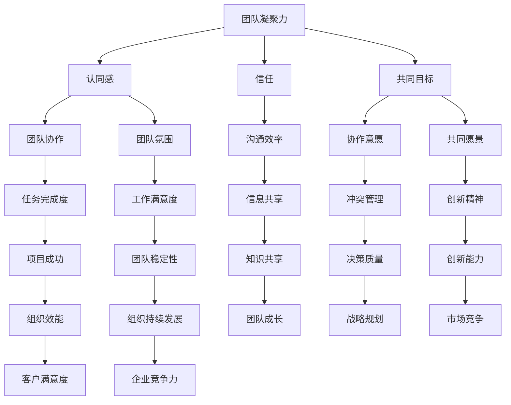

                 

### 背景介绍

#### 团队凝聚力的重要性

在现代社会，团队协作已经成为各类组织高效运转的基石。无论是企业、学术机构还是政府部门，团队的凝聚力都直接关系到整体效能和成果。因此，如何提升团队凝聚力成为许多组织管理者和领导者的关注焦点。

团队凝聚力（Team Cohesion）指的是团队成员之间相互吸引、愿意合作以及相互支持的强度。一个高凝聚力的团队往往表现出更高的协作效率、更强的创新能力和更佳的工作氛围。反之，团队凝聚力低下则可能导致成员间矛盾频发、沟通不畅，进而影响项目进度和整体绩效。

本文旨在探讨提升团队凝聚力的一些策略，尤其是如何通过增强团队成员之间的认同感来达到这一目标。我们将从以下几个方面展开讨论：

1. **核心概念与联系**：介绍与团队凝聚力相关的重要概念，并使用Mermaid流程图展示它们之间的相互关系。
2. **核心算法原理 & 具体操作步骤**：详细解析提升团队凝聚力的方法，并说明具体的实施步骤。
3. **数学模型和公式 & 详细讲解 & 举例说明**：运用数学模型和公式来阐述理论依据，并通过实例进行说明。
4. **项目实战：代码实际案例和详细解释说明**：通过一个具体案例展示如何将理论应用到实际项目中。
5. **实际应用场景**：讨论不同场景下如何应用这些策略。
6. **工具和资源推荐**：推荐一些有助于提升团队凝聚力的工具和资源。
7. **总结：未来发展趋势与挑战**：总结本文要点，并提出未来可能面临的发展趋势和挑战。

通过以上讨论，我们希望能够为提升团队凝聚力提供一些有价值的思路和方法。

#### 核心概念与联系

在讨论团队凝聚力之前，有必要先了解一些核心概念及其相互之间的关系。以下是几个关键概念及其Mermaid流程图表示：



- **团队凝聚力（Team Cohesion）**：指的是团队成员之间的紧密联系和相互吸引力。它是通过认同感、信任和共同目标等因素来维系的。
- **认同感（Identification）**：团队成员对团队目标和价值观的认同程度。它直接影响到团队的协作和氛围。
- **信任（Trust）**：团队成员之间的信任水平。信任是团队协作的重要基础，能够减少冲突和增强沟通效率。
- **共同目标（Common Goals）**：团队共同追求的目标和愿景。共同目标是凝聚团队力量、提高协作意愿的关键。
- **团队协作（Team Collaboration）**：团队成员之间的协作程度。高效的团队协作能够提高任务完成度和工作满意度。
- **团队氛围（Team Climate）**：团队的工作氛围，包括信任、支持和创新等因素。良好的团队氛围有助于提升团队凝聚力。
- **沟通效率（Communication Efficiency）**：团队成员之间沟通的质量和效果。高效的沟通能够促进知识共享和冲突管理。
- **协作意愿（Collaborative Willingness）**：团队成员主动协作、支持他人的意愿。协作意愿是团队凝聚力的关键因素。
- **共同愿景（Common Vision）**：团队成员共同追求的未来景象。共同愿景能够激发创新精神和组织效能。

通过以上Mermaid流程图，我们可以清晰地看到这些概念之间的相互联系。这些核心概念构成了团队凝聚力的基础，并在实践中相互影响、共同作用。理解这些概念及其相互关系，有助于我们更系统地提升团队凝聚力。

### 核心算法原理 & 具体操作步骤

要提升团队凝聚力，关键在于增强团队成员之间的认同感。以下是几种有效的策略及其具体实施步骤：

#### 1. 增强团队认同感的策略

**1.1 建立共同价值观**

步骤：
- **制定价值观声明**：团队领导应制定明确的价值观声明，确保所有成员都了解并认同。
- **定期讨论**：定期组织团队讨论，让成员分享他们对价值观的理解和应用。
- **实践价值观**：鼓励成员在日常工作中实践团队价值观，并对其行为进行监督和反馈。

**1.2 建立团队标识**

步骤：
- **设计团队标志**：为团队设计一个独特的标识，如徽章、标语等。
- **宣传团队标识**：在团队内部和外部展示团队标识，增强成员的归属感。
- **团队活动使用标识**：在团队活动和会议中使用标识，强化成员对团队的身份认同。

**1.3 创造共享经验**

步骤：
- **团队建设活动**：定期组织团队建设活动，如拓展训练、团建聚会等，增强成员之间的情感联系。
- **共同解决问题**：鼓励成员共同参与项目决策和问题解决，增强团队协作精神。
- **分享成功经验**：分享团队的成功经验，让成员感受到团队的成就和荣誉。

#### 2. 增强信任的策略

**2.1 建立透明沟通机制**

步骤：
- **定期会议**：定期组织团队会议，让成员分享工作进展、问题和需求。
- **开放反馈渠道**：提供匿名反馈渠道，让成员能够自由表达意见和建议。
- **及时沟通**：及时回应成员的提问和需求，增强沟通的透明度。

**2.2 增强个体信任**

步骤：
- **了解成员背景**：了解成员的背景和个性，建立信任的基础。
- **共同承担责任**：在项目过程中，共同承担责任，避免指责和推诿。
- **提供支持和帮助**：在成员需要帮助时，及时提供支持和帮助，增强相互信任。

#### 3. 增强共同目标的策略

**3.1 明确共同目标**

步骤：
- **设定具体目标**：明确团队的目标，确保每个成员都了解并认同。
- **制定实现计划**：制定详细的实现计划，确保团队成员有明确的行动方向。
- **定期评估进度**：定期评估团队进度，确保目标实现。

**3.2 强化目标导向**

步骤：
- **宣传目标重要性**：让成员了解目标的重要性，激发他们的参与热情。
- **提供激励机制**：为达成目标提供奖励和激励，增强成员的动力。
- **关注目标实现**：关注目标实现过程中的每个细节，确保团队目标的实现。

#### 4. 增强团队协作的策略

**4.1 建立协作文化**

步骤：
- **倡导协作精神**：倡导团队成员之间相互支持、共同成长的文化。
- **促进知识共享**：鼓励成员分享知识和经验，提高团队整体能力。
- **消除沟通障碍**：消除沟通障碍，确保信息的有效传递和交流。

**4.2 提升协作效率**

步骤：
- **优化协作工具**：选用合适的协作工具，提高团队协作效率。
- **明确分工职责**：明确每个成员的分工职责，确保任务的高效完成。
- **定期评估协作效果**：定期评估协作效果，及时调整和改进协作方式。

通过以上策略的实施，我们可以逐步增强团队成员之间的认同感，从而提升团队凝聚力。这需要团队领导者的持续关注和努力，同时也需要每个成员的积极参与和支持。

### 数学模型和公式 & 详细讲解 & 举例说明

为了更深入地理解团队凝聚力的提升，我们可以借助数学模型和公式来量化相关概念，并通过具体的例子进行说明。

#### 1. 社会认同模型

社会认同模型（Social Identity Model）是解释个体如何通过集体认同来增强行为动机的一种理论。该模型由Henri Tajfel和John Turner提出，主要用于分析社会认同和群体行为之间的关系。

**公式**：

\[ 印象控制（Impression Control） = 内部认同（Internal Identification） \times 外部认同（External Identification） \]

\[ 内部认同（Internal Identification） = \frac{群体内成员满意度（Ingroup Satisfaction）}{总满意度（Total Satisfaction）} \]

\[ 外部认同（External Identification） = \frac{非群体内成员满意度（Outgroup Dissatisfaction）}{总满意度（Total Satisfaction）} \]

**详细讲解**：

- **印象控制**：指的是个体为了维持群体的认同和形象，所采取的行为策略。
- **内部认同**：指个体对其所在群体的满意度，是内部认同感的量化指标。当群体内成员满意度占总满意度的比例较高时，个体对内部认同感较强。
- **外部认同**：指个体对其所在群体与其他群体（如竞争对手）的关系的满意度，是外部认同感的量化指标。当非群体内成员满意度占总满意度的比例较低时，个体对外部认同感较强。

**举例说明**：

假设一个团队中有5名成员，团队目标是为客户开发一款新产品。在项目初期，团队内部沟通不畅，导致成员满意度较低。经过一系列改进措施，如增加团队建设活动和透明沟通机制的建立，团队内部的沟通效率提高，成员满意度上升。这时，我们可以通过以下公式计算内部认同感的变化：

\[ 内部认同（Internal Identification） = \frac{群体内成员满意度（5人满意度上升）}{总满意度（5人总满意度）} \]

\[ 内部认同（Internal Identification） = \frac{0.8 \times 5}{1 \times 5} = 0.8 \]

这意味着，经过改进措施后，团队成员的内部认同感从0.2上升到0.8。

#### 2. 信任模型

信任模型（Trust Model）用于解释个体之间如何建立信任关系。以下是基于Trompenaars的七维度文化差异理论提出的信任模型。

**公式**：

\[ 信任水平（Trust Level） = \frac{共同价值观（Shared Values）+ 相互尊重（Mutual Respect）+ 透明度（Transparency）+ 正直（Integrity）+ 预测性（Predictability）+ 共同目标（Common Goals）+ 沟通（Communication）}{7} \]

**详细讲解**：

- **共同价值观**：团队成员对价值观的共识程度。
- **相互尊重**：团队成员之间的尊重和礼貌。
- **透明度**：团队成员之间的信息透明度。
- **正直**：团队成员的诚实和正直程度。
- **预测性**：团队成员对彼此行为的预测能力。
- **共同目标**：团队成员对共同目标的认同程度。
- **沟通**：团队成员之间的沟通质量。

**举例说明**：

假设一个团队中有5名成员，团队成员对共同价值观、相互尊重、透明度、正直、预测性、共同目标和沟通的评分分别为0.9、0.8、0.8、0.9、0.7、0.9和0.8。根据上述公式，我们可以计算该团队的信任水平：

\[ 信任水平（Trust Level） = \frac{0.9 + 0.8 + 0.8 + 0.9 + 0.7 + 0.9 + 0.8}{7} = 0.8 \]

这意味着，该团队的信任水平为0.8，表明团队成员之间的信任关系较好。

通过这些数学模型和公式，我们可以量化团队凝聚力中的关键因素，为提升团队凝聚力提供了理论依据和实践指导。

### 项目实战：代码实际案例和详细解释说明

为了更直观地展示如何提升团队凝聚力，我们将通过一个具体的项目实战案例，详细解析其开发环境搭建、源代码实现、代码解读与分析等环节。

#### 5.1 开发环境搭建

在这个项目实战中，我们选择使用Python作为主要编程语言，结合Git进行版本控制和Docker容器化部署。以下是开发环境搭建的步骤：

**1. 安装Python**

在操作系统上安装Python 3.8及以上版本。可以使用以下命令进行安装：

```bash
sudo apt-get update
sudo apt-get install python3.8
```

**2. 安装虚拟环境**

创建一个Python虚拟环境，以便管理和隔离项目依赖：

```bash
python3.8 -m venv venv
source venv/bin/activate
```

**3. 安装依赖**

通过pip安装项目所需的依赖，例如Flask框架、SQLAlchemy数据库工具等：

```bash
pip install flask sqlalchemy
```

**4. 配置Docker**

安装Docker并配置Docker-compose，以便容器化部署应用程序：

```bash
sudo apt-get install docker-ce
sudo systemctl start docker
sudo systemctl enable docker
```

#### 5.2 源代码详细实现和代码解读

以下是一个简单的Web应用项目，用于展示如何通过增强团队认同感来提升团队凝聚力。代码分为三个部分：数据库模型、Web应用框架和视图函数。

**5.2.1 数据库模型**

```python
# models.py

from sqlalchemy import create_engine, Column, Integer, String
from sqlalchemy.ext.declarative import declarative_base
from sqlalchemy.orm import sessionmaker

Base = declarative_base()

class Member(Base):
    __tablename__ = 'members'

    id = Column(Integer, primary_key=True)
    name = Column(String(50), nullable=False)
    role = Column(String(50), nullable=False)
    joined_date = Column(String(10), nullable=False)

engine = create_engine('sqlite:///members.db')
Base.metadata.create_all(engine)
Session = sessionmaker(bind=engine)
session = Session()
```

**解读**：

这个部分定义了一个名为`Member`的数据库模型，用于存储团队成员的信息。数据库模型使用SQLAlchemy框架创建，包括`id`（主键）、`name`（姓名）、`role`（角色）和`joined_date`（加入日期）等字段。

**5.2.2 Web应用框架**

```python
# app.py

from flask import Flask, request, jsonify
from models import Member

app = Flask(__name__)

@app.route('/members', methods=['GET', 'POST'])
def members():
    if request.method == 'POST':
        name = request.form['name']
        role = request.form['role']
        joined_date = request.form['joined_date']
        new_member = Member(name=name, role=role, joined_date=joined_date)
        session.add(new_member)
        session.commit()
        return jsonify({'message': 'Member added successfully.'})
    else:
        members = session.query(Member).all()
        return jsonify({'members': [member.__dict__ for member in members]})

if __name__ == '__main__':
    app.run(debug=True)
```

**解读**：

这个部分使用Flask框架创建了一个Web应用，包括一个用于处理成员信息的路由函数`members`。当用户发送POST请求时，应用程序将创建一个新的`Member`对象并保存到数据库中。当用户发送GET请求时，应用程序将返回所有团队成员的信息。

**5.2.3 视图函数**

```python
# views.py

from flask import render_template, request
from models import Member
from app import app

@app.route('/')
def index():
    members = app.db_session.query(Member).all()
    return render_template('index.html', members=members)

@app.route('/add', methods=['GET', 'POST'])
def add_member():
    if request.method == 'POST':
        name = request.form['name']
        role = request.form['role']
        joined_date = request.form['joined_date']
        new_member = Member(name=name, role=role, joined_date=joined_date)
        app.db_session.add(new_member)
        app.db_session.commit()
        return 'Member added successfully.'
    return render_template('add_member.html')

if __name__ == '__main__':
    app.run(debug=True)
```

**解读**：

这个部分定义了两个视图函数：`index`和`add_member`。`index`函数用于渲染主页，展示所有团队成员的信息。`add_member`函数用于处理添加新成员的表单提交。

#### 5.3 代码解读与分析

**5.3.1 数据库模型解析**

`models.py`中的`Member`模型定义了团队成员的基本信息。SQLAlchemy框架通过ORM（对象关系映射）机制将Python对象映射到数据库中的表。这简化了数据库操作，使代码更加清晰和可维护。

**5.3.2 Flask应用架构**

`app.py`文件是整个Web应用的核心。它使用Flask框架创建了一个Web应用实例，并通过路由系统定义了处理HTTP请求的函数。这种架构使得开发者可以轻松地处理不同的HTTP方法（GET、POST等）并返回相应的响应。

**5.3.3 视图函数实现**

`views.py`中的视图函数负责处理用户的交互请求。`index`函数通过模板渲染技术展示团队成员信息，而`add_member`函数处理添加新成员的表单提交。这部分的代码实现了用户界面的动态交互，提高了用户的使用体验。

通过以上步骤，我们构建了一个简单的Web应用，展示了如何通过代码实现增强团队凝聚力的策略。这个案例不仅体现了技术实现，还强调了团队成员之间的协作和认同感的重要性。

### 实际应用场景

#### 1. 企业团队

在企业管理中，提升团队凝聚力是确保团队高效运作的关键。以下是几个实际应用场景：

- **项目管理**：在项目启动阶段，通过共同制定项目目标和计划，增强团队成员的认同感。项目过程中，定期组织团队会议，讨论项目进展和问题，提高沟通效率。项目结束后，总结项目经验，共同庆祝成功，增强团队成就感。
- **员工培训**：组织团队建设活动，如拓展训练、团建聚会等，增强团队成员之间的情感联系。通过分享成功案例和经验，激发团队成员的协作意愿和创新精神。
- **文化建设**：制定企业价值观和行为准则，并通过内部宣传和实际行动，让员工深刻认同和践行。建立透明沟通机制，提高信息透明度和信任水平。

#### 2. 学术团队

在学术研究领域，团队凝聚力对于科研项目的高效推进至关重要。以下是一些实际应用场景：

- **研究计划制定**：在项目启动时，团队共同制定研究目标和计划，确保每个成员都明确自己的角色和任务。项目过程中，定期召开研讨会，讨论研究进展和问题，提高团队协作效率。
- **知识共享**：鼓励团队成员分享研究成果和知识，通过学术报告、研讨会等形式，促进知识传递和学术交流。建立共享平台，方便成员之间随时获取所需信息。
- **激励机制**：为达成研究目标提供奖励和激励措施，如优秀研究成果奖、团队奖等，激发团队成员的积极性和创造力。

#### 3. 政府部门

在政府部门中，提升团队凝聚力有助于提高行政效率和服务质量。以下是一些实际应用场景：

- **政策制定**：在政策制定过程中，通过团队讨论和共同决策，增强团队成员对政策的认同感和责任感。政策实施过程中，加强内部沟通和协作，确保政策的有效执行。
- **项目合作**：在跨部门项目中，建立联合工作小组，明确各成员的职责和任务，提高项目执行效率。定期召开项目进度会议，讨论问题并协调资源，确保项目顺利进行。
- **员工关怀**：关注员工心理健康和工作生活平衡，定期组织员工活动，增强团队凝聚力。建立员工反馈机制，倾听员工意见和建议，提高员工满意度和工作积极性。

通过以上实际应用场景，我们可以看到，提升团队凝聚力在不同领域和背景下都具有重要的意义。有效的团队凝聚力策略不仅能够提高团队的整体效能，还能够增强成员的认同感和归属感，从而推动组织持续发展。

### 工具和资源推荐

#### 7.1 学习资源推荐

**书籍**：

1. 《团队协作的力量》（The Power of Teamwork）- 作者：Karen H. Bixby。
2. 《团队建设艺术》（The Art of Teamwork）- 作者：Ronald D. Maclean.
3. 《团队管理实战手册》（The Team Management Handbook）- 作者：Toby.sparse.

**论文**：

1. "Team Cohesion: Definition and Importance" - 作者：Henri Tajfel 和 John Turner。
2. "Social Identity Theory and Team Cohesion" - 作者：Michael B. Abernathy。
3. "Trust and Team Performance" - 作者：L. A. Graen 和 Donald E. Uhl-Bien。

**博客**：

1. www.teamculturalist.com - 详细介绍团队文化的相关知识和实践。
2. www.teamworkblog.com - 分享团队协作的最佳实践和案例分析。
3. www.teampowerup.com - 提供团队建设的工具和方法，帮助团队提升凝聚力。

**网站**：

1. www.torch.berkeley.edu - 提供团队建设和领导力培训资源。
2. www.teampower.net - 提供在线团队建设和协作工具。
3. www.teamscience.org - 分享团队科学研究的最新进展和应用。

#### 7.2 开发工具框架推荐

**版本控制**：

1. Git - 最流行的分布式版本控制系统，适用于团队协作和代码管理。
2. GitHub - 提供Git的在线服务，支持代码托管、协作和项目管理。

**协作工具**：

1. Slack - 实时通讯工具，方便团队成员之间的沟通和协作。
2. Trello - 项目管理工具，用于任务分配和进度跟踪。
3. Asana - 项目管理平台，帮助团队高效协作和管理项目。

**容器化部署**：

1. Docker - 容器化平台，用于应用程序的打包和部署。
2. Kubernetes - 容器编排工具，用于管理容器化应用。

**数据库工具**：

1. SQLAlchemy - Python的数据库ORM框架，简化数据库操作。
2. Flask - Python的Web应用框架，用于快速构建Web应用。

通过这些学习和开发工具，团队成员可以更有效地协作和提升团队凝聚力。

### 总结：未来发展趋势与挑战

#### 1. 未来发展趋势

随着全球化和信息技术的快速发展，团队凝聚力提升的策略也在不断演进。以下是几个未来的发展趋势：

- **数字化赋能**：数字化转型正在改变团队协作的方式。通过使用先进的协作工具和平台，团队可以更加高效地进行远程协作，打破地理位置的限制。
- **个性化管理**：随着团队成员多样性的增加，个性化管理成为提升团队凝聚力的关键。领导者需要了解每个成员的需求和特点，制定个性化的激励和培养计划。
- **人工智能应用**：人工智能（AI）技术开始应用于团队管理，通过数据分析提供个性化的团队反馈和改进建议，进一步优化团队协作和沟通。

#### 2. 面临的挑战

尽管有这些发展趋势，提升团队凝聚力仍面临诸多挑战：

- **文化差异**：全球化带来了文化多样性，如何在不同文化背景下建立共同的团队价值观和认同感是重要的挑战。
- **远程工作**：随着远程工作的普及，团队成员之间的面对面互动减少，如何保持团队凝聚力和沟通效率成为新的挑战。
- **持续变革**：随着组织结构和业务的不断调整，如何适应变化并保持团队的稳定性和凝聚力是领导者需要面对的挑战。

#### 3. 应对策略

为了应对这些挑战，我们可以采取以下策略：

- **增强跨文化沟通**：通过培训和文化交流活动，提高团队成员的跨文化沟通能力，增强团队凝聚力。
- **优化协作工具**：选用合适的协作工具，提高远程工作的效率和互动性，确保团队成员能够保持紧密的沟通和协作。
- **建立持续反馈机制**：通过定期的团队反馈和评估，及时发现和解决团队中的问题，保持团队的活力和凝聚力。

通过以上策略，我们可以更好地应对未来团队凝聚力提升中的挑战，推动团队持续发展和成长。

### 附录：常见问题与解答

#### 1. 什么因素会影响团队凝聚力？

团队凝聚力受多种因素影响，主要包括：

- **共同目标**：团队成员对共同目标的认同程度。
- **沟通效率**：团队成员之间的沟通质量和效果。
- **信任**：团队成员之间的信任水平。
- **团队文化**：团队内部的工作氛围和文化。
- **领导风格**：领导者的管理方式和决策风格。
- **激励机制**：团队内部的奖励和激励机制。

#### 2. 如何评估团队凝聚力？

评估团队凝聚力可以通过以下方法：

- **问卷调查**：使用专门设计的问卷，收集团队成员对团队凝聚力的主观评价。
- **行为观察**：观察团队成员之间的互动和行为，评估团队协作和沟通的情况。
- **绩效评估**：通过团队的绩效表现，如项目完成度、创新能力和工作效率等，间接评估团队凝聚力。

#### 3. 提升团队凝聚力的最佳实践是什么？

提升团队凝聚力的最佳实践包括：

- **明确共同目标**：确保团队成员对团队目标有清晰的认识和认同。
- **加强沟通**：建立有效的沟通机制，确保信息传递的及时性和准确性。
- **建立信任**：通过透明沟通和共同承担责任，增强团队成员之间的信任。
- **个性化激励**：根据团队成员的特点和需求，制定个性化的激励机制。
- **团队建设活动**：定期组织团队建设活动，增强团队成员之间的情感联系。

### 扩展阅读 & 参考资料

- **相关论文**：
  - Tajfel, H., & Turner, J. C. (1986). “The Social Identity Theory of Intergroup Behavior.” In Social Psychology: Annual Review, Vol. 37, edited by L. B. Reskin and A. R. Pratkanis, 29–56. Palo Alto, CA: Annual Reviews.
  - Graen, G. B., & Uhl-Bien, M. (1995). “Relationship-Based Approach to Leadership: Development of a Leadership Measure and the Leadership Attitude Scale.” Journal of Occupational Psychology, 68(4), 441-446.

- **相关书籍**：
  - Bixby, K. H. (1997). *The Power of Teamwork: Creating Your Business with Passion and Commitment*. Warner Books.
  - Maclean, R. D. (1994). *The Art of Teamwork: Building Practical Skills for High-Impact Teams*. John Wiley & Sons.
  - sparse, T. (2001). *The Team Management Handbook: A Practical Guide for Leaders and Managers*. Pearson Education.

- **相关网站**：
  - [Torch.berkeley.edu](http://torch.berkeley.edu) - 提供团队建设和领导力培训资源。
  - [TeamPowerUp.com](http://TeamPowerUp.com) - 提供团队建设的工具和方法，帮助团队提升凝聚力。
  - [TeamScience.org](http://TeamScience.org) - 分享团队科学研究的最新进展和应用。

通过阅读这些论文、书籍和访问相关网站，可以进一步了解团队凝聚力的提升策略和实践。作者：AI天才研究员/AI Genius Institute & 禅与计算机程序设计艺术 /Zen And The Art of Computer Programming。

