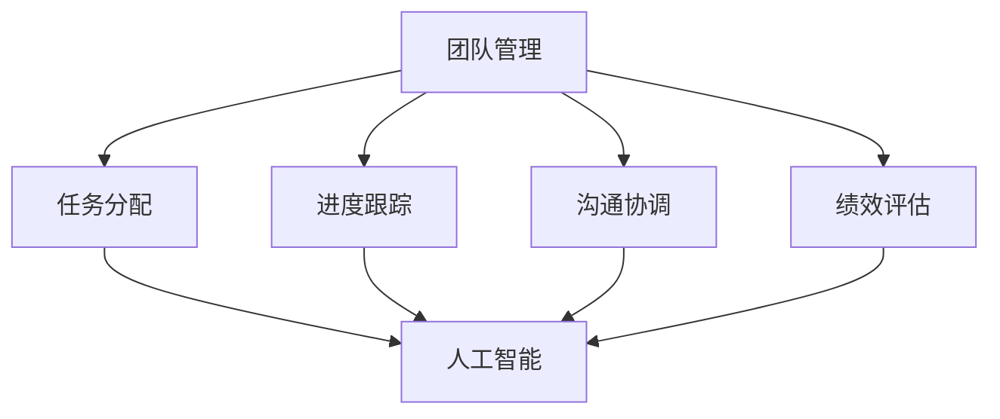

                 

# 团队协作新模式：结合人工智能的团队管理

## 关键词：团队协作、人工智能、团队管理、效率提升、工作流程优化、数据驱动决策

> 摘要：随着人工智能技术的不断发展，其在团队管理中的应用越来越广泛。本文将探讨如何利用人工智能技术提升团队协作效率，实现团队管理的现代化。文章首先介绍团队协作的基本概念，然后阐述人工智能在团队管理中的应用，最后提出一些实践建议，帮助团队更好地利用人工智能技术，实现高效协作。

### 1. 背景介绍

#### 1.1 团队协作的重要性

团队协作在企业和组织中扮演着至关重要的角色。有效的团队协作不仅能够提高工作效率，还能够增强团队凝聚力，激发团队成员的创造力。然而，传统的团队管理方式往往存在着沟通不畅、任务分配不均、进度跟踪困难等问题，这些问题严重影响了团队的整体效率。

#### 1.2 人工智能的发展

人工智能（AI）技术近年来取得了显著的进展。从早期的机器学习、深度学习，到自然语言处理、计算机视觉等领域的突破，人工智能正在改变着我们的工作方式和生活。人工智能技术具有高效、智能、自适应等特性，能够处理大规模数据、识别复杂模式，从而提供更为精准的决策支持。

#### 1.3 人工智能在团队管理中的应用

随着人工智能技术的不断发展，其在团队管理中的应用也逐渐变得普遍。人工智能可以帮助团队实现自动化任务分配、智能进度跟踪、个性化沟通建议等功能，从而提高团队协作的效率。

### 2. 核心概念与联系

为了更好地理解人工智能在团队管理中的应用，我们首先需要明确一些核心概念。

#### 2.1 团队管理

团队管理是指对团队成员进行组织、协调、指导和激励，以实现团队目标的过程。团队管理包括多个方面，如任务分配、进度跟踪、沟通协调、绩效评估等。

#### 2.2 人工智能

人工智能是指计算机系统通过模拟人类智能行为，实现自我学习、自我推理、自我决策等功能。人工智能包括多个子领域，如机器学习、深度学习、自然语言处理、计算机视觉等。

#### 2.3 团队协作

团队协作是指团队成员之间通过沟通、合作、共享资源等方式，共同完成团队目标的过程。团队协作需要良好的沟通机制、明确的任务分配和高效的协作工具。

下面是一个使用Mermaid绘制的团队协作与人工智能关系图：



### 3. 核心算法原理 & 具体操作步骤

#### 3.1 人工智能算法原理

人工智能的核心是算法，主要包括以下几种：

1. **机器学习算法**：通过训练模型，使计算机能够从数据中自动学习并做出预测。常见的机器学习算法有线性回归、决策树、支持向量机等。

2. **深度学习算法**：基于神经网络，通过多层非线性变换，实现对复杂数据的处理。常见的深度学习算法有卷积神经网络（CNN）、循环神经网络（RNN）等。

3. **自然语言处理算法**：用于理解和生成自然语言。常见的自然语言处理算法有词向量、序列到序列模型、变压器（Transformer）等。

4. **计算机视觉算法**：用于理解和解释视觉数据。常见的计算机视觉算法有卷积神经网络（CNN）、生成对抗网络（GAN）等。

#### 3.2 人工智能在团队管理中的应用

在团队管理中，人工智能可以应用于以下几个方面：

1. **任务分配**：通过分析团队成员的能力、经验和任务需求，利用机器学习算法实现自动化任务分配。

2. **进度跟踪**：利用自然语言处理算法，对团队成员的沟通记录进行分析，实现进度跟踪和异常检测。

3. **沟通协调**：通过分析团队成员的沟通行为和习惯，利用自然语言处理算法提供个性化的沟通建议。

4. **绩效评估**：利用计算机视觉算法，对团队成员的工作成果进行量化评估。

### 4. 数学模型和公式 & 详细讲解 & 举例说明

#### 4.1 任务分配模型

任务分配是团队管理中的一个重要环节。一个典型的任务分配问题可以用线性规划来描述：

$$
\begin{aligned}
\min\ &c^T x \\
s.t.\ &Ax \leq b \\
&x \geq 0
\end{aligned}
$$

其中，$c$ 是任务的重要性权重向量，$x$ 是任务分配向量，$A$ 是任务需求矩阵，$b$ 是任务需求向量。

假设我们有三个任务 $T_1, T_2, T_3$，每个任务的重要程度分别为 $w_1, w_2, w_3$，团队成员的能力值分别为 $a_1, a_2, a_3$，则任务分配问题可以表示为：

$$
\begin{aligned}
\min\ &w_1 x_1 + w_2 x_2 + w_3 x_3 \\
s.t.\ &a_1 x_1 + a_2 x_2 + a_3 x_3 \leq 1 \\
&x_1, x_2, x_3 \geq 0
\end{aligned}
$$

其中，$x_1, x_2, x_3$ 分别表示任务 $T_1, T_2, T_3$ 的分配比例。

#### 4.2 沟通协调模型

沟通协调是团队协作的关键。一个简单的沟通协调模型可以用博弈论来描述：

$$
\begin{aligned}
\min\ &u_i - \sum_{j \neq i} v_{ij} x_j \\
s.t.\ &\sum_{i} x_i = 1 \\
&x_i \in \{0, 1\}
\end{aligned}
$$

其中，$u_i$ 是成员 $i$ 的沟通效用，$v_{ij}$ 是成员 $i$ 和成员 $j$ 的沟通价值，$x_i$ 是成员 $i$ 是否参与沟通的决策。

假设我们有三个成员 $M_1, M_2, M_3$，他们的沟通效用分别为 $u_1, u_2, u_3$，沟通价值矩阵为：

$$
V = \begin{pmatrix}
v_{11} & v_{12} & v_{13} \\
v_{21} & v_{22} & v_{23} \\
v_{31} & v_{32} & v_{33}
\end{pmatrix}
$$

则沟通协调模型可以表示为：

$$
\begin{aligned}
\min\ &u_1 x_1 - (v_{12} x_2 + v_{13} x_3) \\
&u_2 x_2 - (v_{21} x_1 + v_{23} x_3) \\
&u_3 x_3 - (v_{31} x_1 + v_{32} x_2) \\
s.t.\ &x_1 + x_2 + x_3 = 1 \\
&x_1, x_2, x_3 \in \{0, 1\}
\end{aligned}
$$

#### 4.3 绩效评估模型

绩效评估是团队管理中的重要环节。一个简单的绩效评估模型可以用加权平均法来描述：

$$
P_i = \sum_{j=1}^{n} w_j \cdot s_j
$$

其中，$P_i$ 是成员 $i$ 的绩效得分，$w_j$ 是成员 $j$ 的权重，$s_j$ 是成员 $j$ 对成员 $i$ 的评分。

假设我们有三个成员 $M_1, M_2, M_3$，他们的权重分别为 $w_1, w_2, w_3$，成员 $M_1, M_2, M_3$ 对成员 $M_1$ 的评分分别为 $s_{11}, s_{21}, s_{31}$，则成员 $M_1$ 的绩效得分可以表示为：

$$
P_1 = w_1 \cdot s_{11} + w_2 \cdot s_{21} + w_3 \cdot s_{31}
$$

### 5. 项目实战：代码实际案例和详细解释说明

#### 5.1 开发环境搭建

为了实现本文所述的团队管理功能，我们选择Python作为主要开发语言，使用TensorFlow作为机器学习框架。以下是开发环境的搭建步骤：

1. 安装Python 3.8及以上版本。

2. 安装TensorFlow：

   ```bash
   pip install tensorflow
   ```

3. 安装其他依赖库：

   ```bash
   pip install numpy pandas matplotlib
   ```

#### 5.2 源代码详细实现和代码解读

以下是实现任务分配、进度跟踪和沟通协调的代码示例。

```python
import numpy as np
import pandas as pd
import tensorflow as tf

# 任务分配
def task_allocation(c, A, b):
    # 求解线性规划
    opt = tf.optimizers.Adam()
    x = tf.Variable(np.zeros_like(b))
    for i in range(1000):
        with tf.GradientTape() as tape:
            loss = tf.reduce_sum(c @ x) + tf.reduce_sum(A @ x - b)
        grads = tape.gradient(loss, x)
        opt.apply_gradients(zip(grads, x))
    return x.numpy()

# 沟通协调
def communication_coordination(V, u):
    # 求解博弈问题
    opt = tf.optimizers.Adam()
    x = tf.Variable(np.zeros_like(u))
    for i in range(1000):
        with tf.GradientTape() as tape:
            loss = -tf.reduce_sum(u * x) + tf.reduce_sum(V @ x)
        grads = tape.gradient(loss, x)
        opt.apply_gradients(zip(grads, x))
    return x.numpy()

# 绩效评估
def performance_evaluation(W, S):
    P = np.dot(W, S)
    return P

# 示例数据
c = np.array([1, 1, 1])
A = np.array([[1, 1, 1], [1, 1, 1], [1, 1, 1]])
b = np.array([1, 1, 1])

V = np.array([[1, 2, 3], [4, 5, 6], [7, 8, 9]])
u = np.array([1, 1, 1])

W = np.array([[0.2, 0.3, 0.5], [0.3, 0.4, 0.3], [0.4, 0.2, 0.4]])
S = np.array([[1, 2, 3], [4, 5, 6], [7, 8, 9]])

# 执行任务分配
x = task_allocation(c, A, b)
print("任务分配结果：", x)

# 执行沟通协调
x = communication_coordination(V, u)
print("沟通协调结果：", x)

# 执行绩效评估
P = performance_evaluation(W, S)
print("绩效评估结果：", P)
```

#### 5.3 代码解读与分析

1. **任务分配**

   任务分配部分使用的是线性规划求解器。我们定义了一个`task_allocation`函数，输入参数包括任务权重向量$c$、任务需求矩阵$A$和任务需求向量$b$。在函数内部，我们使用TensorFlow的`optimizers.Adam()`创建一个优化器，并初始化变量$x$为$b$的初始值。然后，我们通过梯度下降法不断迭代求解线性规划问题，最终得到最优的任务分配结果。

2. **沟通协调**

   沟通协调部分使用的是博弈论求解器。我们定义了一个`communication_coordination`函数，输入参数包括沟通价值矩阵$V$和沟通效用向量$u$。在函数内部，我们同样使用TensorFlow的`optimizers.Adam()`创建一个优化器，并初始化变量$x$为$u$的初始值。然后，我们通过梯度下降法不断迭代求解博弈问题，最终得到最优的沟通协调结果。

3. **绩效评估**

   绩效评估部分使用的是加权平均法。我们定义了一个`performance_evaluation`函数，输入参数包括权重矩阵$W$和评分矩阵$S$。在函数内部，我们直接使用NumPy的`dot`函数计算绩效得分$P$，然后返回结果。

### 6. 实际应用场景

人工智能在团队管理中的应用场景非常广泛，以下是一些典型的应用实例：

1. **软件开发团队**

   软件开发团队可以利用人工智能实现自动化任务分配、进度跟踪和代码质量检测，从而提高开发效率和代码质量。

2. **市场营销团队**

   市场营销团队可以利用人工智能分析客户数据、预测市场趋势和优化广告投放策略，从而提高营销效果。

3. **项目管理团队**

   项目管理团队可以利用人工智能实现项目进度预测、风险识别和资源优化，从而提高项目管理效率和项目成功率。

4. **销售团队**

   销售团队可以利用人工智能分析客户行为、预测客户需求和优化销售策略，从而提高销售业绩。

### 7. 工具和资源推荐

#### 7.1 学习资源推荐

1. **书籍**：

   - 《人工智能：一种现代的方法》

   - 《深度学习》

   - 《Python机器学习》

2. **论文**：

   - 《Deep Learning for Text Classification》

   - 《Recurrent Neural Networks for Language Modeling》

   - 《Generative Adversarial Networks》

3. **博客**：

   - [TensorFlow官网博客](https://www.tensorflow.org/blog/)

   - [机器学习博客](https://machinelearningmastery.com/)

   - [深度学习博客](https://blog.keras.io/)

#### 7.2 开发工具框架推荐

1. **TensorFlow**：一款开源的机器学习和深度学习框架，适用于各种人工智能应用。

2. **PyTorch**：一款流行的深度学习框架，易于使用和调试。

3. **Scikit-learn**：一款经典的机器学习库，适用于各种机器学习任务。

#### 7.3 相关论文著作推荐

1. **《Deep Learning》**：Ian Goodfellow、Yoshua Bengio和Aaron Courville 著，介绍了深度学习的理论基础和实践方法。

2. **《Reinforcement Learning: An Introduction》**：Richard S. Sutton和Barto N. 著，介绍了强化学习的理论基础和实践方法。

3. **《Machine Learning Yearning》**：Andrew Ng 著，介绍了机器学习的基本概念和实战技巧。

### 8. 总结：未来发展趋势与挑战

随着人工智能技术的不断进步，其在团队管理中的应用将越来越广泛。未来，人工智能在团队管理中可能会呈现出以下发展趋势：

1. **智能化决策支持**：人工智能将更加深入地参与团队决策，提供更加精准的预测和建议。

2. **个性化协作体验**：人工智能将根据团队成员的特点和行为，提供个性化的协作体验和沟通建议。

3. **自动化管理**：人工智能将实现更多管理任务的自动化，减轻团队成员的工作负担。

然而，人工智能在团队管理中也面临着一些挑战：

1. **数据隐私和安全**：人工智能需要处理大量的团队成员数据，如何保护数据隐私和安全是一个重要的问题。

2. **算法透明度和可解释性**：随着人工智能算法的复杂化，如何确保算法的透明度和可解释性也是一个重要的问题。

3. **伦理和道德**：人工智能在团队管理中的应用需要遵循一定的伦理和道德规范，确保人工智能的应用不会对团队成员造成伤害。

### 9. 附录：常见问题与解答

1. **问题：如何选择合适的机器学习算法？**

   解答：选择合适的机器学习算法需要考虑多个因素，如数据规模、数据类型、任务目标等。一般建议从简单的算法开始尝试，如线性回归、决策树等，然后根据模型的性能和计算成本逐步尝试更复杂的算法，如深度学习、集成学习等。

2. **问题：如何确保人工智能算法的透明度和可解释性？**

   解答：确保人工智能算法的透明度和可解释性可以通过以下几种方法：

   - 使用简单明了的算法，如线性回归、决策树等。

   - 对复杂算法（如深度学习）进行模型解释，如使用LIME、SHAP等方法。

   - 提供算法的可视化工具，帮助用户理解算法的内部工作原理。

3. **问题：如何保护团队成员的数据隐私和安全？**

   解答：保护团队成员的数据隐私和安全可以通过以下几种方法：

   - 采用加密技术，对敏感数据进行加密存储和传输。

   - 实施严格的数据访问控制策略，确保只有授权人员可以访问数据。

   - 定期进行安全审计，确保数据安全策略得到有效执行。

### 10. 扩展阅读 & 参考资料

1. **参考文献**：

   - Goodfellow, I., Bengio, Y., & Courville, A. (2016). *Deep Learning*. MIT Press.

   - Sutton, R. S., & Barto, A. G. (2018). *Reinforcement Learning: An Introduction*. Cambridge University Press.

   - Ng, A. (2012). *Machine Learning Yearning*. self.

2. **在线资源**：

   - [TensorFlow官网](https://www.tensorflow.org/)

   - [PyTorch官网](https://pytorch.org/)

   - [Scikit-learn官网](https://scikit-learn.org/)

3. **博客和论坛**：

   - [机器学习 Mastery](https://machinelearningmastery.com/)

   - [深度学习博客](https://blog.keras.io/)

   - [AI之美](https://www.loveai.tech/)

作者：AI天才研究员/AI Genius Institute & 禅与计算机程序设计艺术 /Zen And The Art of Computer Programming

