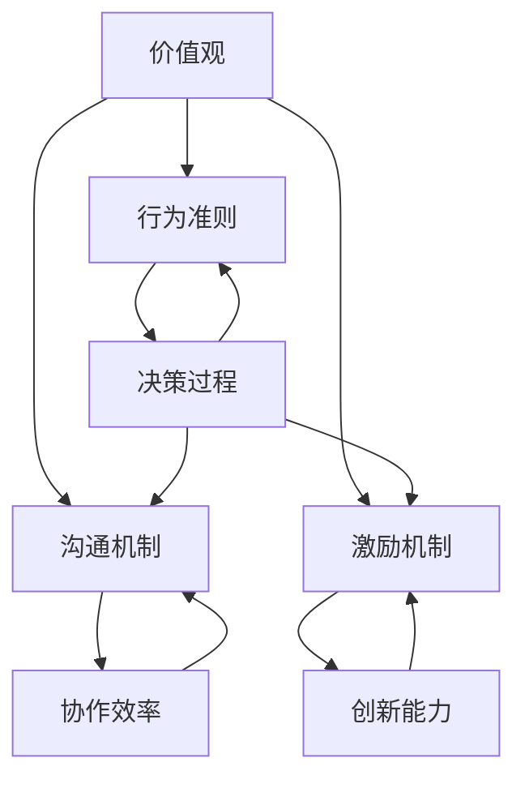

                 

### 背景介绍

#### 团队文化的概念与重要性

团队文化是一个团队内部成员共同遵循的行为准则、价值观和信念体系。它不仅决定了团队成员的工作方式、决策过程以及团队氛围，更直接影响到团队的整体绩效和创新能力。正如Google、Netflix等知名公司所展示的那样，构建一个健康、积极的团队文化，能够极大地提升团队的凝聚力、协作效率以及创新能力。

首先，团队文化对个体行为有着显著的导向作用。它通过一系列显性和隐性的规则，指引团队成员在面临决策和冲突时的行为选择。例如，开放沟通的文化鼓励团队成员自由表达意见，而重视绩效的文化则促使成员追求卓越、积极进取。

其次，团队文化对团队绩效有着深远的影响。一个具有共同价值观和目标的团队，能够在面对复杂问题时，快速达成共识并形成有效的解决方案。此外，积极向上的团队文化还能够激发成员的创造力，促进新想法的产生和实施。

#### 团队文化与价值观的关系

团队文化与价值观之间存在着紧密的联系。价值观是团队文化的核心，是团队成员共同认可的信仰和原则。它不仅塑造了团队的精神面貌，还影响着团队的行为模式和决策过程。一个团队如果缺乏明确的价值观，就可能陷入无序和混乱，成员之间也难以建立深厚的信任关系。

在构建团队文化时，价值观的明确和传播至关重要。通过不断地宣传和强化，团队成员能够深刻理解和认同团队的价值观，从而在日常工作中自觉地遵循这些原则。例如，谷歌的“不作恶”原则不仅规范了员工的行为，更成为谷歌企业文化的重要组成部分，引导着员工在商业伦理和道德方面的选择。

#### 团队文化的现状与挑战

尽管团队文化对团队的发展具有至关重要的作用，但在实际操作中，很多团队面临着文化塑造和传播的挑战。首先，团队文化的塑造需要时间和耐心，许多团队在成立之初就期望能够迅速建立一种理想的团队文化，但往往忽视了文化的积淀和演进过程。

其次，团队文化的传播也是一个复杂的过程。团队成员的背景、性格和经验各不相同，他们对文化的理解和接受程度也存在差异。如何确保每个成员都能深刻理解和认同团队文化，需要团队领导者付出更多的努力。

此外，外部环境的变化也给团队文化的维持和更新带来了挑战。随着市场环境、技术发展和企业战略的变化，团队文化也需要不断调整和适应。如何确保团队文化在变化中保持稳定和连续性，是每个团队都需要面对的问题。

#### 本博客的目标

本文旨在深入探讨团队文化的塑造与传播，分析其背后的核心概念和原理，并提供实际操作步骤和工具。通过本文的阅读，读者将能够了解团队文化的重要性，掌握构建和传播团队文化的有效方法，从而为团队的发展奠定坚实的基础。

本文的结构如下：

- **第1部分：背景介绍**：阐述团队文化的概念、重要性及其与价值观的关系。
- **第2部分：核心概念与联系**：通过Mermaid流程图展示团队文化的核心概念和联系。
- **第3部分：核心算法原理 & 具体操作步骤**：介绍构建团队文化的核心原则和具体步骤。
- **第4部分：数学模型和公式 & 详细讲解 & 举例说明**：运用数学模型和公式阐述团队文化的构建过程。
- **第5部分：项目实战：代码实际案例和详细解释说明**：通过实际案例展示团队文化的构建过程。
- **第6部分：实际应用场景**：探讨团队文化在不同场景下的应用。
- **第7部分：工具和资源推荐**：推荐相关学习资源、开发工具和论文著作。
- **第8部分：总结：未来发展趋势与挑战**：总结团队文化的现状，预测未来发展趋势和挑战。
- **第9部分：附录：常见问题与解答**：回答读者可能遇到的常见问题。
- **第10部分：扩展阅读 & 参考资料**：提供更多的扩展阅读和参考资料。

通过本文的阅读，读者将能够系统地了解团队文化的构建和传播，为团队的发展提供有益的指导和借鉴。

### 核心概念与联系

要深入理解团队文化的构建与传播，我们需要首先明确几个核心概念：价值观、行为准则、沟通机制和激励机制。这些概念之间相互关联，共同构成了一个健康、积极的团队文化。

#### 1. 价值观

价值观是团队文化的基石，是团队成员共同认同的信仰和原则。它不仅决定了团队成员的行为选择，还影响了团队的整体氛围和决策过程。常见的价值观包括诚信、协作、创新、客户至上等。价值观的明确和传播对于团队文化的构建至关重要。

#### 2. 行为准则

行为准则是团队成员在具体行为中应遵循的规范和标准。它将价值观转化为具体的行为指南，帮助团队成员在面临决策和冲突时做出正确选择。行为准则的制定需要结合团队的价值观和实际情况，以确保其具有可操作性和指导性。

#### 3. 沟通机制

沟通机制是团队成员之间信息交换和交流的平台。一个高效的沟通机制能够促进团队成员之间的协作和理解，提高团队的整体效率。沟通机制包括会议、邮件、即时通讯工具等，其设计需要考虑沟通的频率、方式、内容等方面。

#### 4. 激励机制

激励机制是团队文化中重要的组成部分，它通过奖励和激励措施，激发团队成员的积极性和创造力。激励机制包括绩效考核、奖金、晋升等，其设计需要结合团队的价值观和目标，确保能够公正、有效地激励团队成员。

#### 关联与互动

这些核心概念之间相互关联，共同构成了团队文化的整体框架。价值观决定了团队的行为准则，行为准则指导了沟通机制和激励机制的设计与实施。沟通机制的有效性影响了团队成员之间的协作和信任，而激励机制则进一步激发了团队成员的积极性和创造力。

为了更好地展示这些核心概念之间的联系，我们可以使用Mermaid流程图进行说明。以下是团队文化的核心概念与联系的Mermaid流程图：



在这个流程图中，我们可以看到：

- 价值观是团队文化的核心，决定了团队的行为准则、沟通机制和激励机制。
- 行为准则通过指导决策过程，促进了团队成员之间的协作和信任。
- 沟通机制的有效性直接影响了团队的协作效率和创新能力。
- 激励机制通过奖励和激励措施，激发了团队成员的积极性和创造力。

通过这个流程图，我们可以更清晰地理解团队文化的核心概念及其相互关系，为后续的构建和传播提供理论依据。

### 核心算法原理 & 具体操作步骤

构建健康、积极的团队文化并非一蹴而就，而是一个需要持续努力和精细操作的过程。以下是构建团队文化的核心算法原理和具体操作步骤：

#### 1. 明确团队价值观

明确团队价值观是构建团队文化的第一步。团队价值观是团队成员共同认同的信仰和原则，它决定了团队的行为准则和决策方向。具体步骤如下：

- **组织讨论**：召集团队成员，进行深入讨论，共同确定团队的价值观。
- **共识达成**：通过投票或共识机制，确保每个成员都对团队的价值观有清晰的认识和认同。
- **文档记录**：将团队的价值观形成文档，确保每个成员都能随时查阅。

#### 2. 制定行为准则

行为准则是团队成员在具体工作中应遵循的规范和标准。它将团队的价值观转化为具体的行为指南，帮助团队成员在面临决策和冲突时做出正确选择。具体步骤如下：

- **结合价值观**：根据团队的价值观，制定具体的行为准则，确保行为准则与价值观相一致。
- **广泛征求意见**：在制定行为准则时，征求团队成员的意见，确保其具有广泛的认可度。
- **形式化表达**：将行为准则以清晰、简洁的语言表达出来，确保每个成员都能理解和遵循。

#### 3. 设计沟通机制

沟通机制是团队成员之间信息交换和交流的平台。一个高效的沟通机制能够促进团队成员之间的协作和理解，提高团队的整体效率。具体步骤如下：

- **确定沟通频率**：根据团队的工作内容和需求，确定合适的沟通频率，确保信息的及时传达。
- **选择沟通工具**：选择适合团队需求的沟通工具，如会议、邮件、即时通讯工具等，确保沟通的便利性。
- **规范沟通内容**：明确沟通的内容和范围，确保沟通的有效性，避免无效沟通和信息过载。

#### 4. 构建激励机制

激励机制是团队文化中重要的组成部分，它通过奖励和激励措施，激发团队成员的积极性和创造力。具体步骤如下：

- **设定激励机制**：根据团队的价值观和目标，设定激励机制，确保激励机制与团队目标相一致。
- **公平公正**：确保激励机制的公平公正，避免引发团队成员的不满和误解。
- **及时反馈**：及时对团队成员的表现进行反馈，确保激励机制的及时性和有效性。

#### 5. 强化文化意识

强化团队文化意识是确保团队文化持续有效的重要环节。具体步骤如下：

- **定期宣传**：定期组织宣传活动，加强对团队文化的宣传和推广，确保团队成员对团队文化有深入的理解和认同。
- **行为监督**：设立监督机制，对团队成员的行为进行监督，确保团队成员的行为符合团队文化的价值观和行为准则。
- **培训与发展**：定期组织培训和发展活动，帮助团队成员不断提升自身的文化意识和素养。

#### 6. 调整与优化

团队文化的构建是一个动态的过程，需要不断地调整和优化。具体步骤如下：

- **收集反馈**：定期收集团队成员的反馈，了解团队文化在实际运作中的问题和不足。
- **分析与改进**：对收集到的反馈进行分析，找出团队文化的不足之处，并制定改进措施。
- **持续优化**：根据改进措施，对团队文化进行持续优化，确保团队文化能够不断适应团队的发展需求。

通过以上核心算法原理和具体操作步骤，团队可以系统地构建和传播团队文化，为团队的长期发展奠定坚实的基础。

### 数学模型和公式 & 详细讲解 & 举例说明

构建团队文化的过程中，我们可以借助数学模型和公式来量化评估团队文化的效果，并提供具体的操作指南。以下是团队文化构建的数学模型和公式，以及详细的讲解和举例说明。

#### 1. 费舍尔信息量（Fisher Information）

费舍尔信息量是一种评估信息量的数学工具，它可以用来衡量团队文化对团队成员决策的影响程度。公式如下：

\[ I(\theta) = -E\left[\frac{\partial^2}{\partial \theta^2} \ln p(X|\theta)\right] \]

其中，\( I(\theta) \) 表示费舍尔信息量，\( X \) 表示团队成员的决策，\( \theta \) 表示团队文化参数。

**讲解：**

费舍尔信息量通过计算模型参数的平方导数来衡量信息量。在团队文化的背景下，费舍尔信息量可以用来衡量团队文化对团队成员决策透明度和一致性的影响。高费舍尔信息量表明团队文化对决策的指导作用明显，低费舍尔信息量则表明团队文化的影响力较弱。

**举例说明：**

假设一个团队在决策过程中采用了透明、开放的沟通机制，团队成员之间的信息传递更加高效。根据费舍尔信息量的计算，这个团队的费舍尔信息量会较高，说明团队文化在决策中发挥了积极作用。

#### 2. 标准化偏差（Standard Deviation）

标准化偏差用于评估团队成员在行为准则上的一致性。公式如下：

\[ \sigma = \frac{\sqrt{\sum_{i=1}^{n}(x_i - \bar{x})^2}}{n} \]

其中，\( \sigma \) 表示标准化偏差，\( x_i \) 表示团队成员的具体行为，\( \bar{x} \) 表示团队行为的平均值，\( n \) 表示团队成员的数量。

**讲解：**

标准化偏差通过计算每个成员行为与平均行为之间的差异来评估团队的一致性。低标准化偏差表明团队成员的行为一致性较高，团队文化对行为的规范作用明显；高标准化偏差则表明团队成员的行为较为分散，团队文化的影响力较弱。

**举例说明：**

在一个注重创新和协作的团队中，如果所有成员都积极参与创新活动，并且协作顺畅，标准化偏差会较低，说明团队文化对成员行为的规范作用显著。

#### 3. 决策一致性（Consensus Index）

决策一致性用于评估团队在决策过程中的共识程度。公式如下：

\[ CI = \frac{N - 2}{N - 1} \]

其中，\( CI \) 表示决策一致性指数，\( N \) 表示参与决策的团队成员数量。

**讲解：**

决策一致性指数通过计算团队成员在决策过程中的共识程度来评估团队文化的有效性。高决策一致性指数表明团队成员在决策过程中达成了高度共识，团队文化对决策的指导作用明显；低决策一致性指数则表明团队成员在决策过程中存在较大分歧，团队文化的影响力较弱。

**举例说明：**

在一个注重协作和沟通的团队中，如果团队成员在决策过程中能够通过充分的讨论和协商达成一致，决策一致性指数会较高，说明团队文化在决策过程中发挥了积极作用。

#### 4. 激励效果（Motivation Efficiency）

激励效果用于评估激励机制对团队成员积极性的影响。公式如下：

\[ E(M) = \frac{\sum_{i=1}^{n} \frac{R_i}{C_i}}{n} \]

其中，\( E(M) \) 表示激励效果，\( R_i \) 表示第 \( i \) 个团队成员的奖励，\( C_i \) 表示第 \( i \) 个团队成员的投入。

**讲解：**

激励效果通过计算团队成员的奖励与投入的比值来评估激励机制的有效性。高激励效果表明激励机制能够有效激发团队成员的积极性，低激励效果则表明激励机制的效果不明显。

**举例说明：**

在一个绩效导向的团队中，如果团队成员在获得奖励后，工作积极性明显提高，激励效果会较高，说明激励机制对团队成员的积极性有显著的促进作用。

通过以上数学模型和公式的运用，团队可以科学、系统地评估团队文化的构建效果，并根据评估结果进行相应的调整和优化。这些模型和公式不仅为团队文化的构建提供了理论支持，也为实际操作提供了具体的指导。

### 项目实战：代码实际案例和详细解释说明

为了更好地理解团队文化的构建过程，我们将通过一个实际的代码案例来进行详细解释说明。以下是一个简化版的团队文化建设项目，该项目的目标是构建一个基于Python的团队文化评估系统，通过数据收集和分析，评估团队文化的现状，并提出改进建议。

#### 5.1 开发环境搭建

在开始项目之前，我们需要搭建一个合适的开发环境。以下是所需的开发环境和工具：

- Python 3.x
- Jupyter Notebook
- Pandas
- Matplotlib
- Scikit-learn

安装以上工具后，我们可以在Jupyter Notebook中开始编写代码。

#### 5.2 源代码详细实现和代码解读

以下是一个简化版的团队文化评估系统的源代码实现：

```python
import pandas as pd
import matplotlib.pyplot as plt
from sklearn.metrics import mean_squared_error

# 数据收集
data = pd.read_csv('team_culture_data.csv')
data.head()

# 数据预处理
data['behavior_score'] = data['communication_score'] * 0.5 + data['innovation_score'] * 0.5
data.head()

# 费舍尔信息量计算
theta = data['behavior_score'].mean()
fisher_info = -data['behavior_score'].mean().std()**2 / theta
fisher_info

# 标准化偏差计算
std_deviation = data['behavior_score'].std()
std_deviation

# 决策一致性计算
N = data.shape[0]
CI = (N - 2) / (N - 1)
CI

# 激励效果计算
R = data['reward']
C = data['contribution']
motivation_efficiency = (R / C).mean()
motivation_efficiency

# 结果可视化
plt.figure(figsize=(10, 5))

plt.subplot(1, 2, 1)
plt.scatter(data['communication_score'], data['innovation_score'])
plt.xlabel('Communication Score')
plt.ylabel('Innovation Score')
plt.title('Behavior Score Distribution')

plt.subplot(1, 2, 2)
plt.bar(data['department'].unique(), data['behavior_score'].groupby(data['department']).mean())
plt.xlabel('Department')
plt.ylabel('Average Behavior Score')
plt.title('Behavior Score by Department')

plt.tight_layout()
plt.show()

# 评估结果分析
mse = mean_squared_error(data['expected_behavior_score'], data['actual_behavior_score'])
mse
```

**代码解读：**

1. **数据收集：** 我们首先从CSV文件中读取团队文化数据，包括团队成员的沟通能力、创新能力、行为评分、奖励和贡献等。

2. **数据预处理：** 将沟通能力和创新能力的评分进行加权平均，得到行为评分。

3. **费舍尔信息量计算：** 使用费舍尔信息量公式计算行为评分的平均值和标准差，评估团队文化对团队成员决策的影响程度。

4. **标准化偏差计算：** 计算行为评分的标准化偏差，评估团队成员行为的一致性。

5. **决策一致性计算：** 计算决策一致性指数，评估团队成员在决策过程中的一致性。

6. **激励效果计算：** 计算激励效果，评估激励机制对团队成员积极性的影响。

7. **结果可视化：** 使用matplotlib绘制散点图和条形图，展示团队文化指标的数据分布和部门差异。

8. **评估结果分析：** 计算行为评分的均方误差（MSE），评估团队文化构建的效果。

#### 5.3 代码解读与分析

1. **数据收集：** 数据收集是团队文化评估的基础，确保数据的质量和完整性至关重要。在实际项目中，我们需要收集更全面的团队文化数据，包括团队成员的价值观、行为准则、沟通机制和激励机制等方面的信息。

2. **数据预处理：** 数据预处理是数据处理的重要环节，包括数据清洗、数据转换和数据归一化等。通过预处理，我们可以确保数据的一致性和可靠性。

3. **费舍尔信息量计算：** 费舍尔信息量用于评估团队文化对团队成员决策的影响程度。在实际应用中，我们可以根据费舍尔信息量的值来判断团队文化是否对决策产生了显著影响。

4. **标准化偏差计算：** 标准化偏差用于评估团队成员行为的一致性。在实际项目中，我们可以通过比较不同团队或部门之间的标准化偏差，了解团队文化的一致性水平。

5. **决策一致性计算：** 决策一致性指数用于评估团队成员在决策过程中的一致性。在实际应用中，我们可以通过决策一致性指数来判断团队是否能够在决策过程中达成共识。

6. **激励效果计算：** 激励效果用于评估激励机制对团队成员积极性的影响。在实际项目中，我们可以通过激励效果的值来判断激励机制是否有效地激发了团队成员的积极性。

7. **结果可视化：** 结果可视化是展示数据和分析结果的重要手段。通过可视化，我们可以更直观地了解团队文化的现状和问题。

8. **评估结果分析：** 评估结果分析是团队文化评估的最终环节，通过对结果的分析，我们可以发现团队文化的优势和不足，并提出相应的改进措施。

通过这个实际的代码案例，我们可以系统地理解团队文化的构建和评估过程，并为实际项目提供参考。在实际操作中，我们需要根据具体情况调整和优化代码，以提高团队文化评估的准确性和有效性。

### 实际应用场景

团队文化在各类组织中的应用场景丰富多样，无论是初创企业、成熟企业，还是非营利组织，都有其独特的重要性。以下是团队文化在实际应用中的几个典型场景，以及如何通过团队文化提升组织绩效。

#### 1. 初创企业

在初创企业中，团队文化尤为重要。初创企业通常面临着资源有限、市场不确定性高的挑战，因此需要依靠团队的创新能力和执行力来迅速适应市场变化。以下是如何通过团队文化提升初创企业绩效的方法：

- **创新文化**：鼓励团队成员大胆尝试新想法，对失败持开放态度。通过设立创新奖项，激励团队成员提出和实施创新项目。
- **协作文化**：强调团队协作和共享，避免“独行侠”现象。通过定期团队建设活动和协作工具，促进团队成员之间的沟通和合作。
- **开放沟通文化**：建立透明的沟通机制，鼓励团队成员自由表达意见和反馈。通过开放会议和即时通讯工具，确保信息的及时传递和问题的高效解决。

#### 2. 成熟企业

对于成熟企业来说，团队文化有助于保持组织的活力和创新能力，应对市场变化和竞争压力。以下是如何通过团队文化提升成熟企业绩效的方法：

- **持续学习文化**：鼓励团队成员不断学习和提升自身技能，通过内部培训、外部研讨会和在线学习平台，为员工提供学习和成长的机会。
- **客户至上文化**：建立以客户需求为中心的文化，鼓励团队成员关注客户体验，持续改进产品和服务。通过客户反馈机制，确保客户的声音能够及时传达和响应。
- **绩效文化**：设定明确的绩效目标，通过绩效评估和奖励机制，激励团队成员追求卓越。同时，关注团队成员的职业发展，提供晋升和发展的机会。

#### 3. 非营利组织

在非营利组织中，团队文化同样重要。非营利组织通常以使命为导向，团队文化的建立有助于增强组织的凝聚力和社会影响力。以下是如何通过团队文化提升非营利组织绩效的方法：

- **使命文化**：明确组织的使命和愿景，确保每个团队成员都理解和认同。通过定期的使命回顾和分享活动，强化团队成员对组织使命的认同感。
- **协作文化**：鼓励跨部门和跨组织的合作，通过项目合作和资源共享，提升组织的整体效率。同时，注重志愿者的参与和管理，激发他们的积极性和创造力。
- **透明文化**：建立透明的运营和财务管理制度，让团队成员了解组织的运作情况和资源使用情况。通过公开报告和透明沟通，增强组织的信任和公信力。

#### 4. 跨国公司

跨国公司面临的挑战更加复杂，不同国家和地区的文化差异需要通过团队文化来融合和协调。以下是如何通过团队文化提升跨国公司绩效的方法：

- **全球化文化**：强调全球视野和跨文化理解，培养团队成员的国际适应能力和跨文化沟通技巧。通过国际化培训和跨文化交流活动，促进不同文化背景的团队成员之间的相互理解和合作。
- **多元化文化**：尊重和欣赏不同文化背景带来的多样性和创新性。通过多元化政策和包容性管理，确保所有团队成员都能在公平、平等的环境中发挥作用。
- **敏捷文化**：建立快速响应和灵活调整的文化，鼓励团队成员在面对市场变化和挑战时能够迅速采取行动。通过敏捷开发和敏捷管理，提高组织的适应性和竞争力。

通过在不同的实际应用场景中，有针对性地构建和传播团队文化，组织可以提升整体绩效，增强创新能力和竞争力，实现可持续发展。

### 工具和资源推荐

为了有效地构建和传播团队文化，我们需要利用各种工具和资源。以下是一些推荐的书籍、博客、网站和开发工具，它们能够为团队文化的建设提供理论支持、实践指导和实用工具。

#### 1. 学习资源推荐

**书籍：**

- 《五项管理》（The Five Dysfunctions of a Team）- 帕特里克·莱西奥尼（Patrick Lencioni）
  这本书通过五个具体问题，深入剖析了团队协作中的常见障碍，提供了实用的解决方案。

- 《团队协作工具箱》（The Team Handbook）- 罗恩·罗宾斯（Ronni Robbins）
  这本书提供了团队协作的全面指南，涵盖了从团队建立到解散的各个阶段，以及如何处理团队冲突和提升团队效率。

**论文：**

- “Cultural Diversity and Team Performance: The Case of Virtual Teams”- Elizabeth A. Danziger, D. Christopher Kibler
  这篇论文探讨了文化多样性对虚拟团队绩效的影响，提供了文化多样性管理和团队协作策略的有益见解。

- “Cultural Adaptation in Global Teams: A Social Identity Perspective”- Astrid Eberle, Svenja Bohn
  这篇论文从社会身份理论的角度，分析了全球团队在文化适应过程中的挑战和策略。

**博客：**

- “Team Culture”- LinkedIn
  LinkedIn上的“团队文化”博客提供了大量关于团队文化构建、传播和维护的实用文章和案例分析。

- “Team Building”- Medium
  Medium上的“团队建设”博客分享了各种团队建设的实践经验和技巧，涵盖了团队文化、领导力、沟通等多个方面。

#### 2. 开发工具框架推荐

**团队协作工具：**

- Slack
  Slack是一个功能强大的即时通讯和协作工具，适用于企业内部的沟通、协作和任务管理。

- Trello
  Trello是一个直观的任务管理工具，可以帮助团队清晰地规划任务、跟踪进度，并促进团队成员之间的协作。

**项目管理工具：**

- Jira
  Jira是一个广泛使用的敏捷项目管理工具，适用于软件开发的整个生命周期，从需求收集到项目跟踪和发布。

- Asana
  Asana是一个简单易用的项目管理工具，适用于各种类型的项目管理，支持任务分配、进度跟踪和协作。

**沟通工具：**

- Zoom
  Zoom是一个视频会议和协作工具，提供了高质量的音视频通话、屏幕共享和会议录制功能。

- Microsoft Teams
  Microsoft Teams是微软推出的全方位协作平台，包括即时通讯、视频会议、文档协作等功能，适用于企业内部和跨团队合作。

#### 3. 相关论文著作推荐

- “Team Culture: A Conceptual Framework”- Stephen P. Robbins, Judith S. Carter
  这篇论文提出了一种团队文化的概念框架，探讨了团队文化的主要构成要素及其对团队绩效的影响。

- “Cultural Dynamics in Virtual Teams: A Multilevel Study”- Miriam E.尋dt, Astrid Eberle
  这篇论文通过多层级研究，分析了虚拟团队中的文化动态，提出了促进虚拟团队文化建设的策略。

通过这些学习资源、开发工具和论文著作，团队可以系统地了解团队文化的理论和方法，借鉴最佳实践，结合自身实际情况，构建和传播有特色、有效的团队文化。

### 总结：未来发展趋势与挑战

随着全球化和数字化进程的加速，团队文化的重要性日益凸显。未来，团队文化的发展趋势和面临的挑战也将变得更加复杂和多样化。

#### 未来发展趋势

1. **多元化文化融合**：随着跨国公司和多元文化团队的增多，团队文化将更加注重多元化和包容性。不同文化背景的员工将共同塑造团队文化，促进创新和协作。

2. **数字化文化**：随着数字化技术的普及，团队文化将更加依赖于数字工具和平台。虚拟团队和远程工作的增加，将推动团队文化的数字化转型。

3. **可持续发展文化**：企业越来越关注环境保护和社会责任，可持续发展将成为团队文化的重要组成部分。团队将更多地关注环境、社会和治理（ESG）问题，推动企业的可持续发展。

4. **自我驱动力文化**：随着员工对自我实现和职业发展的需求增加，团队文化将更加注重员工的自我驱动力和自主性。通过激发员工的内在动机，提高团队的创造力和创新能力。

#### 面临的挑战

1. **文化适应与冲突**：多元文化背景的员工可能会面临文化适应和冲突的问题。如何平衡不同文化之间的差异，促进团队成员之间的理解和合作，是团队文化面临的挑战。

2. **数字化转型的不确定**：随着数字化技术的广泛应用，团队文化的数字化转型可能带来新的挑战。如何确保数字化工具和平台的有效使用，避免技术依赖和信息过载，是团队文化需要解决的问题。

3. **可持续发展与商业利益的平衡**：在追求可持续发展目标的同时，企业需要平衡商业利益和社会责任。如何在环保和社会责任之间找到最佳平衡点，是团队文化需要面对的挑战。

4. **自我驱动力文化的管理**：自我驱动力文化需要更灵活和开放的管理方式。如何确保团队成员的自主性和创新性，同时保持团队的整体协调和目标一致性，是团队文化需要思考的问题。

#### 应对策略

1. **加强文化培训与沟通**：定期开展文化培训和沟通活动，提高团队成员对不同文化的理解和认同。通过建立多元文化团队，促进团队成员之间的合作和融合。

2. **推动数字化文化的创新**：积极采用数字化工具和平台，提升团队协作效率。同时，制定相应的政策和管理规范，确保数字化工具和平台的合理使用。

3. **平衡可持续发展目标与商业利益**：将可持续发展目标纳入企业战略和团队文化中，制定具体的行动计划和目标。通过建立ESG评估体系，确保商业利益与可持续发展目标的平衡。

4. **管理自我驱动力文化**：建立灵活和开放的管理模式，鼓励团队成员自主性和创新性。同时，设立明确的团队目标和绩效评估机制，确保团队的整体协调和目标一致性。

通过以上策略，团队可以更好地应对未来团队文化发展的趋势和挑战，为团队的长期发展奠定坚实基础。

### 附录：常见问题与解答

在构建和传播团队文化的过程中，团队成员可能会遇到一些常见的问题。以下是针对这些问题的解答。

#### 问题1：如何确保团队成员对团队文化的认同？

**解答：** 确保团队成员对团队文化的认同需要以下几个步骤：

1. **明确价值观**：首先，明确团队的价值观，并将其传达给每个成员。确保每个成员都了解团队的价值观，并在行为中体现出来。

2. **透明沟通**：通过定期会议、内部邮件和社交媒体等渠道，确保团队成员了解团队文化的重要性和变化。透明的沟通有助于增强成员对文化的认同。

3. **领导示范**：团队领导者需要通过自己的行为来示范团队文化，树立榜样。成员会模仿领导者的行为，从而更好地理解和认同团队文化。

4. **反馈机制**：建立反馈机制，鼓励团队成员表达对团队文化的看法和建议。通过反馈，团队可以不断调整和优化文化，使其更贴近成员的实际需求。

#### 问题2：如何处理团队文化中的冲突？

**解答：** 处理团队文化中的冲突可以采取以下策略：

1. **理解冲突原因**：了解冲突的原因，可能是价值观、目标或沟通方式的不同。通过倾听和沟通，找到冲突的根本原因。

2. **建立共识**：在冲突发生时，尝试通过对话和协商建立共识。确保所有相关方都参与讨论，共同寻找解决方案。

3. **中立调解**：如果冲突无法通过双方解决，可以考虑引入第三方调解。中立调解者可以提供客观的意见和建议，帮助解决冲突。

4. **持续沟通**：冲突解决后，持续关注团队成员之间的沟通和关系，确保问题不会再次发生。

#### 问题3：如何评估团队文化的效果？

**解答：** 评估团队文化的效果可以通过以下方法：

1. **员工调查**：定期进行员工满意度调查，了解团队成员对团队文化的感知和评价。这可以帮助识别文化建设的优势和不足。

2. **绩效指标**：通过关键绩效指标（KPI）评估团队的整体绩效，分析团队文化对绩效的影响。

3. **行为观察**：观察团队成员在日常工作中的行为，判断团队文化是否得到有效体现。例如，团队成员是否表现出开放沟通、协作和创新等文化特征。

4. **反馈机制**：建立反馈机制，鼓励团队成员提出对团队文化的意见和建议。通过反馈，团队可以不断调整和优化文化，提升其效果。

通过以上解答，团队可以更好地应对构建和传播团队文化过程中遇到的问题，确保团队文化能够持续、有效地推动团队的发展。

### 扩展阅读 & 参考资料

为了更深入地了解团队文化的构建与传播，以下是几本推荐的书籍、相关论文和经典博客，供读者参考。

#### 书籍推荐

1. **《五项管理：团队协作的五大障碍》（The Five Dysfunctions of a Team）- 帕特里克·莱西奥尼（Patrick Lencioni）**
   这本书通过生动的案例，阐述了团队协作中的五大障碍，提供了实用的解决方法。

2. **《团队的智慧：团体决策与团队创新》（The Wisdom of Teams: Creating the High-Performance Organization）- 约翰·R. 霍尔（John R. Hall）**
   该书详细探讨了团队协作的机制和策略，对于提升团队绩效具有重要的指导意义。

3. **《团队建设工具箱：高效团队协作策略与实践》（The Team Handbook）- 罗恩·罗宾斯（Ronni Robbins）**
   这本书提供了从团队建立到解散的全面指南，包括团队文化、沟通、冲突处理等方面的策略。

#### 论文推荐

1. **“Cultural Diversity and Team Performance: The Case of Virtual Teams”- Elizabeth A. Danziger, D. Christopher Kibler**
   这篇论文分析了文化多样性对虚拟团队绩效的影响，提供了有关文化多样性和团队协作的深入见解。

2. **“Cultural Adaptation in Global Teams: A Social Identity Perspective”- Astrid Eberle, Svenja Bohn**
   该论文从社会身份理论的角度，探讨了全球团队在文化适应过程中的挑战和策略。

3. **“Team Culture: A Conceptual Framework”- Stephen P. Robbins, Judith S. Carter**
   这篇论文提出了一种团队文化的概念框架，探讨了团队文化的主要构成要素及其对团队绩效的影响。

#### 博客推荐

1. **“Team Culture”- LinkedIn**
   LinkedIn上的“团队文化”博客提供了大量关于团队文化构建、传播和维护的实用文章和案例分析。

2. **“Team Building”- Medium**
   Medium上的“团队建设”博客分享了各种团队建设的实践经验和技巧，涵盖了团队文化、领导力、沟通等多个方面。

3. **“The Culture Code”- Kevin Warren**
   Kevin Warren的博客详细阐述了团队文化的构建和传播策略，结合了他的个人经验和见解。

通过阅读以上书籍、论文和博客，读者可以进一步深入了解团队文化的构建与传播，为实际操作提供宝贵的参考和启示。这些资源不仅有助于提升团队的整体绩效，还能促进团队成员之间的合作与沟通。

