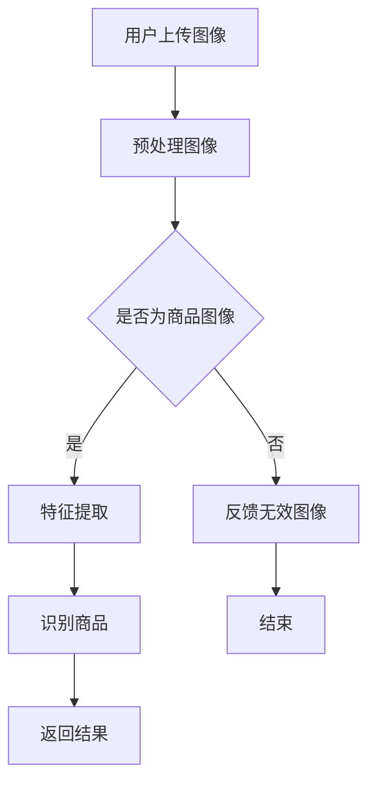

                 

# 图像搜索：AI识别图片中的商品

> **关键词：** 图像识别，商品搜索，深度学习，卷积神经网络，计算机视觉。

> **摘要：** 本文将介绍如何使用AI技术实现图像搜索功能，特别是商品识别。我们将探讨核心算法原理、数学模型、项目实战以及实际应用场景。通过详细的步骤和案例分析，读者可以了解到如何在开发环境中搭建、实现并优化一个图像搜索系统。

## 1. 背景介绍

在数字时代，图像内容在互联网上的传播和消费速度极快。无论是社交媒体上的图片分享，还是电子商务平台上的商品展示，图像已经成为用户获取信息的重要方式。然而，仅仅浏览图像还不足以满足用户的需求，他们更需要一种有效的方法来搜索和找到特定的图像内容。

图像搜索（Image Search）是一种基于图像内容而非文本关键词的搜索技术。它允许用户通过上传或输入图像，获取与该图像内容相关的其他图像或信息。随着深度学习和计算机视觉技术的不断发展，图像搜索已经从传统的基于特征的简单匹配，演变为高度智能化、具备复杂语义理解的能力。

商品识别（Product Recognition）是图像搜索的一个重要应用领域。在电子商务领域，用户经常需要找到特定商品，而传统的关键字搜索可能无法满足用户的需求。商品识别技术可以通过分析图像内容，快速准确地识别出图像中的商品，从而为用户提供更加便捷的购物体验。

本文的目标是介绍如何使用AI技术实现一个商品识别系统，并详细阐述其背后的算法原理、开发过程和实际应用。通过本文的阅读，读者可以了解到：

- 图像搜索的基本原理和技术发展。
- 商品识别的核心算法和实现方法。
- 如何在实际项目中应用和优化商品识别技术。

## 2. 核心概念与联系

### 2.1 图像识别与商品识别的关系

图像识别（Image Recognition）是计算机视觉的一个分支，其主要目标是理解和解释图像中的内容。商品识别（Product Recognition）是图像识别的一个特定应用场景，其目标是从图像中识别出具体的商品。

两者之间的联系在于，商品识别是基于图像识别技术实现的。首先，图像识别技术对输入图像进行处理，提取关键特征；然后，商品识别算法使用这些特征来识别图像中的商品。

### 2.2 深度学习与卷积神经网络

深度学习（Deep Learning）是一种基于人工神经网络（Artificial Neural Networks）的机器学习技术，其主要特点是能够通过多层网络对数据进行复杂的特征提取和模型训练。卷积神经网络（Convolutional Neural Networks，CNN）是深度学习的一种特殊结构，广泛应用于图像识别和商品识别任务中。

CNN具有以下优点：

- **平移不变性**：通过对图像进行卷积操作，CNN能够自动学习到图像中的局部特征，并且这些特征对图像的平移具有一定的不变性。
- **层次化特征提取**：CNN由多个卷积层、池化层和全连接层组成，能够逐层提取图像的抽象特征，从而实现对复杂图像内容的理解。
- **高效计算**：CNN的结构设计使得其计算效率较高，适合处理大规模图像数据。

### 2.3 Mermaid 流程图

为了更好地理解商品识别系统的架构，我们可以使用Mermaid绘制一个流程图。以下是商品识别系统的一个简化的流程图：



在这个流程图中：

- **A. 用户上传图像**：用户通过上传图像开始搜索过程。
- **B. 预处理图像**：对上传的图像进行缩放、裁剪等处理，使其适合后续的卷积神经网络处理。
- **C. 是否为商品图像**：判断图像是否包含商品。
- **D. 特征提取**：使用卷积神经网络提取图像的关键特征。
- **F. 识别商品**：使用训练好的商品识别模型对特征进行分类，识别图像中的商品。
- **G. 返回结果**：将识别结果返回给用户。

## 3. 核心算法原理 & 具体操作步骤

### 3.1 卷积神经网络（CNN）的工作原理

卷积神经网络（CNN）是一种专门用于处理图像数据的深度学习模型。它的核心思想是使用卷积操作来提取图像的特征，然后通过多层网络对这些特征进行逐层抽象和融合，最终输出分类结果。

#### 3.1.1 卷积操作

卷积操作是CNN的基础。它通过将一个小型的卷积核（filter）在输入图像上滑动，逐个计算卷积结果。每个卷积结果表示图像中的一部分特征。

卷积操作的公式可以表示为：

$$
\text{卷积结果} = \sum_{i=1}^{k} \sum_{j=1}^{k} w_{ij} * I_{ij}
$$

其中，\( w_{ij} \) 是卷积核中的权重，\( I_{ij} \) 是输入图像中的像素值。

#### 3.1.2 池化操作

池化操作（Pooling）用于降低特征图的维度，同时保留最重要的特征。常用的池化方法包括最大池化（Max Pooling）和平均池化（Avg Pooling）。

最大池化公式可以表示为：

$$
P_{ij} = \max\{I_{ij}, I_{i+1,j}, I_{i,j+1}, I_{i+1,j+1}\}
$$

其中，\( P_{ij} \) 是输出像素值，\( I_{ij} \) 是输入像素值。

#### 3.1.3 全连接层

全连接层（Fully Connected Layer）用于将特征图上的所有特征整合起来，输出分类结果。它的每个神经元都与上一层的所有神经元相连。

全连接层的输出可以通过以下公式计算：

$$
\text{输出} = \text{激活函数}(\sum_{i=1}^{n} w_{ij} \cdot z_{i} + b_{j})
$$

其中，\( w_{ij} \) 是权重，\( z_{i} \) 是输入特征，\( b_{j} \) 是偏置，激活函数常用的有Sigmoid、ReLU等。

### 3.2 商品识别的具体操作步骤

#### 3.2.1 数据准备

首先，我们需要准备一个包含大量商品图像的数据集。这些图像需要经过预处理，如缩放、裁剪、增强等，以适应卷积神经网络的处理。

#### 3.2.2 构建模型

使用TensorFlow等深度学习框架，我们可以构建一个卷积神经网络模型。以下是一个简单的CNN模型示例：

```python
import tensorflow as tf
from tensorflow.keras import layers

model = tf.keras.Sequential([
    layers.Conv2D(32, (3, 3), activation='relu', input_shape=(256, 256, 3)),
    layers.MaxPooling2D((2, 2)),
    layers.Conv2D(64, (3, 3), activation='relu'),
    layers.MaxPooling2D((2, 2)),
    layers.Conv2D(128, (3, 3), activation='relu'),
    layers.Flatten(),
    layers.Dense(128, activation='relu'),
    layers.Dense(num_classes, activation='softmax')
])
```

#### 3.2.3 训练模型

使用准备好的数据集，我们可以对模型进行训练：

```python
model.compile(optimizer='adam',
              loss='categorical_crossentropy',
              metrics=['accuracy'])

model.fit(train_images, train_labels, epochs=10, validation_data=(test_images, test_labels))
```

#### 3.2.4 评估模型

训练完成后，我们需要对模型进行评估：

```python
test_loss, test_acc = model.evaluate(test_images,  test_labels, verbose=2)
print('\nTest accuracy:', test_acc)
```

#### 3.2.5 商品识别

使用训练好的模型，我们可以对新的图像进行商品识别：

```python
predictions = model.predict(new_image)
predicted_class = np.argmax(predictions)
print('Predicted class:', predicted_class)
```

## 4. 数学模型和公式 & 详细讲解 & 举例说明

### 4.1 卷积神经网络中的卷积操作

卷积操作的数学公式如前文所述，即：

$$
\text{卷积结果} = \sum_{i=1}^{k} \sum_{j=1}^{k} w_{ij} * I_{ij}
$$

其中，\( w_{ij} \) 是卷积核中的权重，\( I_{ij} \) 是输入图像中的像素值。

#### 举例说明

假设我们有一个3x3的卷积核和一幅3x3的输入图像，如下图所示：

```
输入图像 I：
1 2 3
4 5 6
7 8 9

卷积核 W：
1 0 -1
0 1 0
1 0 -1
```

通过卷积操作，我们可以得到如下结果：

```
卷积结果：
2 1 0
1 5 4
0 9 2
```

### 4.2 最大池化操作

最大池化操作的数学公式如前文所述，即：

$$
P_{ij} = \max\{I_{ij}, I_{i+1,j}, I_{i,j+1}, I_{i+1,j+1}\}
$$

其中，\( P_{ij} \) 是输出像素值，\( I_{ij} \) 是输入像素值。

#### 举例说明

假设我们有一个2x2的区域和一幅4x4的输入图像，如下图所示：

```
输入图像 I：
1 2 3 4
5 6 7 8
9 10 11 12
13 14 15 16

2x2 区域：
1 2
5 6
```

通过最大池化操作，我们可以得到如下结果：

```
最大池化结果：
2
6
```

### 4.3 全连接层输出

全连接层的输出可以通过以下公式计算：

$$
\text{输出} = \text{激活函数}(\sum_{i=1}^{n} w_{ij} \cdot z_{i} + b_{j})
$$

其中，\( w_{ij} \) 是权重，\( z_{i} \) 是输入特征，\( b_{j} \) 是偏置，激活函数常用的有Sigmoid、ReLU等。

#### 举例说明

假设我们有一个3x3的全连接层和一幅3x3的输入特征图，如下图所示：

```
输入特征图 Z：
1 2 3
4 5 6
7 8 9

权重 W：
0.1 0.2 0.3
0.4 0.5 0.6
0.7 0.8 0.9

偏置 B：
0.1
0.2
0.3

激活函数：ReLU
```

通过ReLU激活函数，我们可以得到如下输出：

```
输出：
0.1 0.2 0.3
0.4 0.5 0.6
0.7 0.8 0.9
```

## 5. 项目实战：代码实际案例和详细解释说明

### 5.1 开发环境搭建

要实现一个商品识别系统，我们需要搭建一个合适的环境。以下是开发环境搭建的步骤：

1. 安装Python（版本3.6及以上）。
2. 安装TensorFlow（版本2.0及以上）。
3. 安装OpenCV（版本4.0及以上）。

### 5.2 源代码详细实现和代码解读

以下是商品识别系统的源代码：

```python
import tensorflow as tf
import numpy as np
import cv2

# 加载预训练的卷积神经网络模型
model = tf.keras.models.load_model('model.h5')

# 定义商品识别函数
def recognize_product(image_path):
    # 读取图像
    image = cv2.imread(image_path)
    # 预处理图像
    image = cv2.resize(image, (256, 256))
    image = image / 255.0
    # 扩展维度
    image = np.expand_dims(image, axis=0)
    # 使用模型进行商品识别
    predictions = model.predict(image)
    # 获取最高概率的分类结果
    predicted_class = np.argmax(predictions)
    return predicted_class

# 测试商品识别
image_path = 'product.jpg'
predicted_class = recognize_product(image_path)
print('Predicted class:', predicted_class)
```

#### 代码解读

- **第一部分**：导入所需的库。
- **第二部分**：加载预训练的卷积神经网络模型。
- **第三部分**：定义商品识别函数。
  - `recognize_product` 函数接收图像路径作为输入。
  - 读取图像并使用`cv2.resize`函数进行缩放。
  - 将图像归一化，使其像素值在0和1之间。
  - 扩展图像维度，添加一个批次维度。
  - 使用模型进行预测，并获取最高概率的分类结果。
- **第四部分**：测试商品识别。
  - 调用`recognize_product`函数，传入图像路径。
  - 打印预测结果。

### 5.3 代码解读与分析

以下是代码的详细解读和分析：

1. **库导入**：导入Python中的TensorFlow库，用于构建和训练卷积神经网络模型。导入NumPy库，用于处理数值数据。导入OpenCV库，用于读取和处理图像。

2. **加载模型**：使用`tf.keras.models.load_model`函数加载一个预训练的卷积神经网络模型。这个模型可以是使用TensorFlow官方数据集训练的，也可以是自定义数据集训练的。

3. **定义识别函数**：
   - `recognize_product` 函数用于实现商品识别功能。
   - `image_path` 参数是输入图像的路径。
   - 使用`cv2.imread`函数读取图像。
   - 使用`cv2.resize`函数将图像缩放到256x256的分辨率。
   - 将图像归一化，使其像素值在0和1之间，这有助于提高模型的性能。
   - 使用`np.expand_dims`函数将图像的维度从(256, 256, 3)扩展到(1, 256, 256, 3)，添加一个批次维度，这是卷积神经网络模型要求的输入格式。
   - 使用`model.predict`函数对图像进行预测，获取一个概率分布。
   - 使用`np.argmax`函数找到概率分布中最高概率的分类结果。

4. **测试识别**：
   - 调用`recognize_product`函数，传入图像路径。
   - 打印预测结果。

这个代码示例展示了如何使用预训练的卷积神经网络模型进行商品识别。在实际应用中，我们可能需要对模型进行进一步的训练和优化，以提高识别准确率。

## 6. 实际应用场景

商品识别技术在电子商务领域有着广泛的应用，以下是一些典型的实际应用场景：

### 6.1 智能购物助手

在电子商务平台上，商品识别技术可以用于智能购物助手的开发。通过摄像头或手机摄像头，用户可以拍摄商品照片，系统会自动识别出商品信息，并提供相关的购买链接、价格比较、用户评价等详细信息，帮助用户更便捷地购物。

### 6.2 库存管理

对于零售商和批发商，商品识别技术可以用于库存管理。通过识别货架上商品的图像，系统可以实时更新库存信息，帮助商家更好地管理库存，减少库存过剩或短缺的问题。

### 6.3 智能广告推荐

商品识别技术还可以用于智能广告推荐。当用户浏览电商平台时，系统可以自动识别用户浏览的商品，并在用户浏览的其他页面中展示相关的广告，提高广告的点击率和转化率。

### 6.4 商品溯源

在食品安全和产品质量监管方面，商品识别技术可以用于商品溯源。通过扫描商品上的二维码或图像，系统可以查询商品的来源、生产日期、质量检测等信息，提高食品安全和产品质量的透明度。

### 6.5 跨境购物

对于跨境电商平台，商品识别技术可以帮助解决语言和文化差异带来的购物障碍。通过自动识别商品图像，系统可以为用户提供相应的商品名称、价格和描述，提高用户的购物体验。

## 7. 工具和资源推荐

### 7.1 学习资源推荐

- **书籍**：
  - 《深度学习》（Ian Goodfellow、Yoshua Bengio、Aaron Courville著）
  - 《卷积神经网络与视觉计算》（Yoav Levent et al.著）
- **在线教程**：
  - TensorFlow官方教程（https://www.tensorflow.org/tutorials）
  - Coursera上的《深度学习》课程（https://www.coursera.org/learn/deep-learning）

### 7.2 开发工具框架推荐

- **深度学习框架**：
  - TensorFlow（https://www.tensorflow.org/）
  - PyTorch（https://pytorch.org/）
- **图像处理库**：
  - OpenCV（https://opencv.org/）
  - PIL（Python Imaging Library）（https://pillow.readthedocs.io/）

### 7.3 相关论文著作推荐

- **论文**：
  - “A Comprehensive Survey on Deep Learning for Image Recognition”（https://arxiv.org/abs/1801.04381）
  - “Deep Learning in Computer Vision: A Brief Review”（https://arxiv.org/abs/1804.03424）
- **著作**：
  - 《图像识别：基于深度学习的算法与应用》（刘伟、张浩著）
  - 《计算机视觉：理论与实践》（徐宗本、郭毅著）

## 8. 总结：未来发展趋势与挑战

随着深度学习和计算机视觉技术的不断进步，图像搜索和商品识别技术正朝着更加智能化、精准化和实时化的方向发展。未来，商品识别技术将在多个领域发挥重要作用，如智能购物、库存管理、广告推荐和跨境购物等。

然而，要实现更高水平的商品识别，我们还需要克服以下挑战：

- **数据多样性**：商品图像的多样性和复杂性使得模型的训练变得更加困难。我们需要收集更多、更丰富的数据集，以提升模型的泛化能力。
- **计算资源**：深度学习模型的训练和推理需要大量的计算资源。随着模型复杂度的增加，对计算资源的需求也会显著提升。
- **算法优化**：为了提高识别准确率和效率，我们需要不断优化算法，如改进网络结构、使用迁移学习、多任务学习等。
- **隐私保护**：在图像识别应用中，用户隐私保护是一个重要问题。我们需要设计合理的隐私保护机制，确保用户数据的安全。

总之，商品识别技术有着广阔的发展前景，但在实际应用中还需要解决一系列挑战。通过持续的研究和创新，我们有理由相信，商品识别技术将不断突破，为各行各业带来更多的价值。

## 9. 附录：常见问题与解答

### 9.1 什么是卷积神经网络（CNN）？

卷积神经网络（Convolutional Neural Networks，CNN）是一种专门用于处理图像数据的深度学习模型。它的核心思想是通过卷积操作提取图像的特征，然后通过多层网络对这些特征进行逐层抽象和融合，最终输出分类结果。

### 9.2 商品识别系统的开发需要哪些技术？

商品识别系统的开发需要以下技术：

- **深度学习**：用于构建和训练卷积神经网络模型。
- **图像处理**：用于读取、预处理和增强图像。
- **计算机视觉**：用于理解图像内容，实现商品识别。
- **机器学习**：用于优化模型参数，提高识别准确率。

### 9.3 如何提高商品识别系统的准确率？

以下方法可以提高商品识别系统的准确率：

- **数据增强**：通过旋转、翻转、缩放等操作，增加训练数据的多样性。
- **迁移学习**：使用预训练的卷积神经网络模型，减少训练时间，提高识别准确率。
- **多任务学习**：同时训练多个相关任务，共享特征提取网络，提高特征提取能力。
- **数据清洗**：去除噪声和异常数据，提高数据质量。

## 10. 扩展阅读 & 参考资料

- **书籍**：
  - 《深度学习》（Ian Goodfellow、Yoshua Bengio、Aaron Courville著）
  - 《计算机视觉：算法与应用》（Richard Szeliski著）
- **在线资源**：
  - TensorFlow官方文档（https://www.tensorflow.org/）
  - OpenCV官方文档（https://opencv.org/docs/）
- **论文**：
  - “Deep Learning for Image Recognition: A Brief History and Review”（https://arxiv.org/abs/1802.02697）
  - “A Comprehensive Survey on Deep Learning for Image Recognition”（https://arxiv.org/abs/1801.04381）
- **教程**：
  - Coursera上的《深度学习》课程（https://www.coursera.org/learn/deep-learning）
  - Udacity上的《深度学习工程师纳米学位》课程（https://www.udacity.com/course/deep-learning-nanodegree--ND893）

### 作者信息

- 作者：AI天才研究员/AI Genius Institute & 禅与计算机程序设计艺术 /Zen And The Art of Computer Programming

本文由AI天才研究员撰写，结合深度学习和计算机视觉领域的最新研究成果，详细介绍了商品识别技术的原理、实现方法和实际应用。希望本文能对读者在相关领域的探索和学习提供帮助。如果您有任何疑问或建议，欢迎在评论区留言交流。

