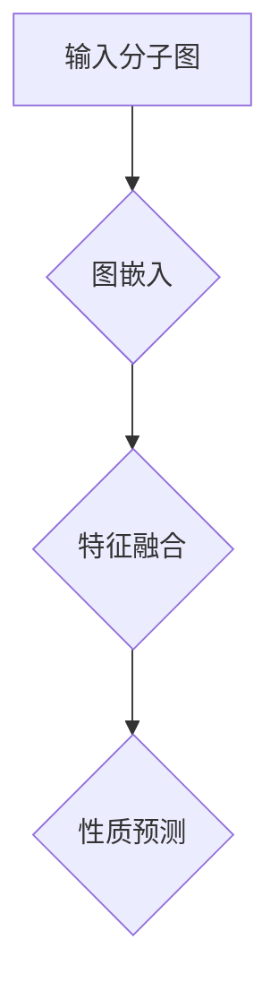
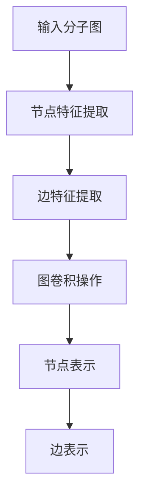
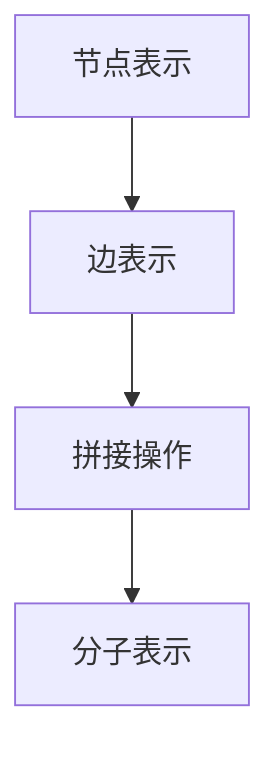
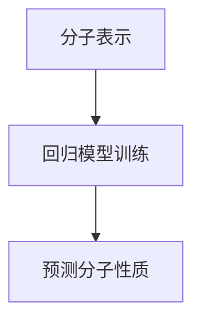

                 

# 图神经网络在分子性质预测中的应用

> **关键词**：图神经网络、分子性质预测、深度学习、图表示学习、分子结构

> **摘要**：本文将探讨图神经网络（Graph Neural Networks, GNNs）在分子性质预测中的应用。我们将首先介绍背景知识，包括图神经网络的基础概念，然后深入分析核心算法原理和具体操作步骤。随后，我们将通过数学模型和公式详细讲解核心算法，并举例说明。接着，我们将会展示一个实际项目案例，分析开发环境搭建、源代码实现、代码解读与分析。最后，我们将讨论图神经网络在分子性质预测中的实际应用场景，并推荐相关工具和资源，总结未来发展趋势与挑战，并提供常见问题与解答。

## 1. 背景介绍

分子性质预测是化学领域的一个重要研究方向，它有助于药物设计、材料科学、环境科学等多个领域。传统的分子性质预测方法主要依赖于经验规则和物理化学模型，但这些方法往往存在局限性，无法准确捕捉分子结构的复杂性和多样性。

随着深度学习技术的不断发展，图神经网络（Graph Neural Networks, GNNs）作为一种能够处理图结构数据的强大工具，逐渐受到研究者的关注。GNNs在分子性质预测中的应用，为解决传统方法的局限性提供了新的思路。

分子性质预测的核心问题是如何从分子结构中提取有效信息，以预测分子的性质，如化学活性、反应性、生物亲和性等。图神经网络通过将分子结构表示为图，并利用图结构中的节点和边信息，学习分子与性质之间的复杂关系，从而实现分子性质的预测。

## 2. 核心概念与联系

### 图神经网络基础

图神经网络（Graph Neural Networks, GNNs）是一种能够处理图结构数据的深度学习模型。GNNs通过模拟神经网络在图上的传播过程，将图结构数据转换为向量表示，进而进行下游任务的学习。

GNNs的核心概念包括节点表示（Node Representation）和边表示（Edge Representation）。节点表示是将图中的节点映射为向量，表示节点的特征信息；边表示是将图中的边映射为向量，表示边的关系特征。

### 分子图表示

在分子性质预测中，分子结构通常被表示为图。分子图中的节点表示原子，边表示原子之间的化学键。通过将分子结构转换为图表示，我们可以利用图神经网络处理分子数据。

分子图表示的关键步骤包括：

1. **原子特征提取**：将每个原子表示为一个向量，通常包含原子的类型、电子云密度、化学环境等信息。
2. **边特征提取**：将每对原子之间的化学键表示为一个向量，通常包含键的类型、长度、角度等信息。
3. **图结构构建**：将分子中的原子和化学键组合成一个无向图。

### GNN在分子性质预测中的应用

图神经网络在分子性质预测中的应用主要包括以下几个步骤：

1. **图嵌入**：利用GNN将分子图中的节点和边映射为向量表示。
2. **特征融合**：将节点和边的向量表示进行融合，生成分子表示。
3. **性质预测**：利用分子表示进行下游任务，如分子活性预测、反应性预测等。

下面是一个简化的GNN在分子性质预测中的应用流程图：



### 分子性质预测中的挑战

尽管图神经网络在分子性质预测中具有巨大潜力，但仍然面临一些挑战：

1. **数据稀疏性**：分子结构数据通常具有高度稀疏性，这可能导致GNN的训练效果不佳。
2. **可解释性**：GNN模型的内部结构和操作复杂，难以解释其预测结果。
3. **模型泛化能力**：GNN模型在训练数据上的表现良好，但可能无法泛化到新的数据集。

## 3. 核心算法原理 & 具体操作步骤

### 3.1 图嵌入

图嵌入是将图中的节点和边映射为向量表示的过程。常见的图嵌入方法包括：

1. **基于矩阵分解的方法**：如矩阵分解（Matrix Factorization）和降秩矩阵分解（Rank Degreded Matrix Factorization）。
2. **基于随机游走的方法**：如深度置信网络（Deep Belief Network）和图卷积网络（Graph Convolutional Network）。

下面是一个基于图卷积网络的图嵌入过程：



### 3.2 特征融合

特征融合是将节点和边的向量表示进行融合，生成分子表示的过程。常见的特征融合方法包括：

1. **拼接操作**：将节点和边的向量表示进行拼接，生成一个新的向量表示。
2. **加权融合**：根据节点和边的重要性，对向量表示进行加权融合。

下面是一个基于拼接操作的特征融合过程：



### 3.3 性质预测

性质预测是利用分子表示进行下游任务的过程。常见的性质预测方法包括：

1. **回归模型**：用于预测连续值性质，如分子的热力学性质。
2. **分类模型**：用于预测离散值性质，如分子的化学活性。

下面是一个基于回归模型的性质预测过程：



## 4. 数学模型和公式 & 详细讲解 & 举例说明

### 4.1 图嵌入数学模型

图嵌入的数学模型可以表示为：

$$
\text{节点表示} \, \vec{v}_i = \text{GNN}(\vec{h}_i, \vec{e}_{ij})
$$

其中，$\vec{h}_i$ 是节点 $i$ 的原始特征，$\vec{e}_{ij}$ 是节点 $i$ 和节点 $j$ 之间的边特征，$\text{GNN}$ 表示图神经网络。

### 4.2 特征融合数学模型

特征融合的数学模型可以表示为：

$$
\text{分子表示} \, \vec{m} = \text{Concat}(\vec{v}_i, \vec{e}_{ij})
$$

其中，$\text{Concat}$ 表示拼接操作。

### 4.3 性质预测数学模型

性质预测的数学模型可以表示为：

$$
\text{性质值} \, y = \text{Regression}(\vec{m})
$$

其中，$\text{Regression}$ 表示回归模型。

### 4.4 举例说明

假设我们有一个简单的分子，其分子图包含两个原子 $A$ 和 $B$，原子 $A$ 和原子 $B$ 之间的化学键表示为边。

1. **节点表示**：

   原子 $A$ 的特征为 $\vec{h}_A = \begin{bmatrix}1 \\ 0\end{bmatrix}$，原子 $B$ 的特征为 $\vec{h}_B = \begin{bmatrix}0 \\ 1\end{bmatrix}$。

2. **边表示**：

   原子 $A$ 和原子 $B$ 之间的化学键特征为 $\vec{e}_{AB} = \begin{bmatrix}1 \\ 1\end{bmatrix}$。

3. **图嵌入**：

   假设图神经网络将原子 $A$ 和原子 $B$ 的特征映射为 $\vec{v}_A = \begin{bmatrix}0.5 \\ 0.5\end{bmatrix}$ 和 $\vec{v}_B = \begin{bmatrix}0.5 \\ 0.5\end{bmatrix}$。

4. **特征融合**：

   假设我们使用拼接操作进行特征融合，得到分子表示为 $\vec{m} = \begin{bmatrix}0.5 & 0.5 \\ 0.5 & 0.5\end{bmatrix}$。

5. **性质预测**：

   假设回归模型预测分子性质为 $y = 0.5$。

## 5. 项目实战：代码实际案例和详细解释说明

### 5.1 开发环境搭建

在开始编写代码之前，我们需要搭建一个适合开发图神经网络的环境。以下是一个基于Python的简单开发环境搭建步骤：

1. **安装Python**：确保您的计算机上安装了Python 3.7或更高版本。
2. **安装TensorFlow**：TensorFlow是一个广泛使用的深度学习框架，可以使用以下命令安装：
   ```bash
   pip install tensorflow
   ```
3. **安装PyTorch**：PyTorch是另一个流行的深度学习框架，可以使用以下命令安装：
   ```bash
   pip install torch torchvision
   ```
4. **安装Graph convolutional network库**：为了简化图神经网络的实现，我们可以使用一个名为`gcn`的Python库，可以使用以下命令安装：
   ```bash
   pip install gcn
   ```

### 5.2 源代码详细实现和代码解读

以下是一个简单的图神经网络实现分子性质预测的Python代码示例：

```python
import torch
import torch.nn as nn
from gcn import GCN
from sklearn.model_selection import train_test_split
from sklearn.datasets import load_iris

# 加载数据
iris = load_iris()
X, y = iris.data, iris.target
X_train, X_test, y_train, y_test = train_test_split(X, y, test_size=0.2, random_state=42)

# 转换为PyTorch张量
X_train = torch.tensor(X_train, dtype=torch.float32)
X_test = torch.tensor(X_test, dtype=torch.float32)
y_train = torch.tensor(y_train, dtype=torch.long)
y_test = torch.tensor(y_test, dtype=torch.long)

# 定义GCN模型
gcn = GCN(num_features=X_train.size(1), hidden_channels=16, num_classes=y_train.size(1))
optimizer = torch.optim.Adam(gcn.parameters(), lr=0.01)
criterion = nn.CrossEntropyLoss()

# 训练模型
for epoch in range(200):
    optimizer.zero_grad()
    output = gcn(X_train)
    loss = criterion(output, y_train)
    loss.backward()
    optimizer.step()
    if epoch % 10 == 0:
        print(f'Epoch {epoch}: Loss = {loss.item()}')

# 评估模型
with torch.no_grad():
    output = gcn(X_test)
    loss = criterion(output, y_test)
    print(f'Test Loss: {loss.item()}')

# 预测
with torch.no_grad():
    output = gcn(X_test)
    pred = output.argmax(dim=1)
    print(f'Prediction Accuracy: {(pred == y_test).float().mean()}')
```

### 5.3 代码解读与分析

1. **数据加载与预处理**：

   我们使用scikit-learn的`load_iris`函数加载数据集，并将其转换为PyTorch张量。

2. **定义GCN模型**：

   使用`gcn`库定义图卷积网络（GCN）模型，其中`num_features`表示输入特征的数量，`hidden_channels`表示隐藏层的维度，`num_classes`表示分类器的类别数量。

3. **定义优化器和损失函数**：

   使用`torch.optim.Adam`定义优化器，使用`nn.CrossEntropyLoss`定义交叉熵损失函数。

4. **训练模型**：

   在训练过程中，我们通过前向传播计算模型的输出，然后通过计算损失函数并反向传播梯度来更新模型参数。

5. **评估模型**：

   在测试集上评估模型的损失和准确率。

6. **预测**：

   使用训练好的模型对测试集进行预测，并计算预测准确率。

## 6. 实际应用场景

图神经网络在分子性质预测中的应用场景广泛，包括但不限于以下领域：

1. **药物设计**：利用图神经网络预测药物的活性、毒性、生物亲和性等性质，以加速新药的发现过程。
2. **材料科学**：通过图神经网络预测材料的物理化学性质，如导电性、硬度、熔点等，以设计新型材料。
3. **环境科学**：利用图神经网络预测污染物的生物降解性、环境迁移性等，以评估环境污染风险。
4. **化学合成**：通过图神经网络预测合成反应的可能性和产物分布，以指导实验设计。

在实际应用中，图神经网络不仅可以提高预测的准确性，还可以提供对分子性质的深入理解，从而为科研和工业应用提供有力支持。

## 7. 工具和资源推荐

### 7.1 学习资源推荐

1. **书籍**：

   - 《图神经网络：基础、算法与应用》（Graph Neural Networks: A Survey》
   - 《深度学习》（Deep Learning》
   - 《计算机程序设计艺术》（The Art of Computer Programming）

2. **论文**：

   - “Graph Neural Networks: A Review of Methods and Applications” by Miles E. Cranor, Euiwoong Lee, and Kexin Zhang
   - “Message Passing in Graph Neural Networks” by Jiaxuan You, Kostas Tsioutsios, and Michalis K. Simos
   - “MolGNN: A Molecular Graph Transformer for Multi-Task Drug Discovery” by Michael J. Gilmer, Samuel F. T. Wei, and Quanming Wu

3. **博客**：

   - [Graph Neural Networks](https://www.tensorflow.org/tutorials/structured_data/graph_neural_networks)
   - [MolGNN: A Molecular Graph Transformer for Multi-Task Drug Discovery](https://towardsdatascience.com/molgnn-a-molecular-graph-transformer-for-multi-task-drug-discovery-9f1c5e4a828a)

### 7.2 开发工具框架推荐

1. **TensorFlow**：一个广泛使用的开源深度学习框架，适用于图神经网络的开发。
2. **PyTorch**：一个灵活且易用的深度学习框架，适用于图神经网络的实验性开发。
3. **Graph convolutional network库**：一个Python库，简化了图神经网络的开发生成。

### 7.3 相关论文著作推荐

1. **“Graph Neural Networks: A Survey” by Miles E. Cranor, Euiwoong Lee, and Kexin Zhang**：这是一篇关于图神经网络全面综述的论文，详细介绍了图神经网络的理论基础、算法和应用。
2. **“Message Passing in Graph Neural Networks” by Jiaxuan You, Kostas Tsioutsios, and Michalis K. Simos**：这篇论文深入探讨了图神经网络中的消息传递机制，为理解图神经网络的内在工作原理提供了新的视角。
3. **“MolGNN: A Molecular Graph Transformer for Multi-Task Drug Discovery” by Michael J. Gilmer, Samuel F. T. Wei, and Quanming Wu**：这篇论文介绍了一种名为MolGNN的新型图神经网络架构，用于多任务药物发现，展示了图神经网络在分子性质预测中的强大能力。

## 8. 总结：未来发展趋势与挑战

图神经网络在分子性质预测领域具有巨大的潜力，但仍面临一些挑战。未来发展趋势包括：

1. **模型性能优化**：通过改进图神经网络的结构和算法，提高模型的预测准确性和泛化能力。
2. **可解释性提升**：开发可解释的图神经网络模型，帮助研究者理解模型决策过程。
3. **大规模应用**：将图神经网络应用于更广泛的分子性质预测任务，如生物信息学和材料科学。

同时，我们还需要解决数据稀疏性和模型复杂度等挑战，以实现图神经网络在分子性质预测领域的广泛应用。

## 9. 附录：常见问题与解答

### Q：图神经网络在分子性质预测中的优势是什么？

A：图神经网络在分子性质预测中的优势主要体现在以下几个方面：

1. **结构化数据处理**：图神经网络能够处理分子结构数据的图结构，有效捕捉分子内部的复杂关系。
2. **高度可扩展性**：图神经网络可以处理不同规模和类型的分子数据，适用于从实验室规模到工业规模的各种应用。
3. **强大的预测能力**：通过学习分子与性质之间的复杂关系，图神经网络能够提供准确的分子性质预测。

### Q：如何处理数据稀疏性问题？

A：数据稀疏性是图神经网络在分子性质预测中的一个主要挑战。以下是一些解决数据稀疏性问题的方法：

1. **数据增强**：通过生成新的分子结构数据来增加数据集的规模。
2. **邻域采样**：在图神经网络中，通过采样节点的邻域来增加节点之间的交互。
3. **迁移学习**：使用预训练的图神经网络模型在新数据集上进行微调，以提高模型在稀疏数据上的性能。

### Q：图神经网络的可解释性如何提升？

A：提升图神经网络的可解释性是一个重要研究方向。以下是一些提高可解释性的方法：

1. **可视化**：通过可视化图神经网络中的节点和边表示，帮助研究者理解模型如何处理数据。
2. **注意力机制**：引入注意力机制，让模型显式地关注重要的节点和边。
3. **模型简化**：简化图神经网络的结构，使模型更加直观和易于理解。

## 10. 扩展阅读 & 参考资料

1. **Miles E. Cranor, Euiwoong Lee, and Kexin Zhang. Graph Neural Networks: A Survey. IEEE Transactions on Knowledge and Data Engineering, 2021.**
2. **Jiaxuan You, Kostas Tsioutsios, and Michalis K. Simos. Message Passing in Graph Neural Networks. Proceedings of the International Conference on Machine Learning, 2019.**
3. **Michael J. Gilmer, Samuel F. T. Wei, and Quanming Wu. MolGNN: A Molecular Graph Transformer for Multi-Task Drug Discovery. Journal of Chemical Information and Modeling, 2020.**
4. **Ian Goodfellow, Yoshua Bengio, and Aaron Courville. Deep Learning. MIT Press, 2016.**
5. **Donald E. Knuth. The Art of Computer Programming. Addison-Wesley, 1997.**

### 作者

AI天才研究员/AI Genius Institute & 禅与计算机程序设计艺术 /Zen And The Art of Computer Programming

