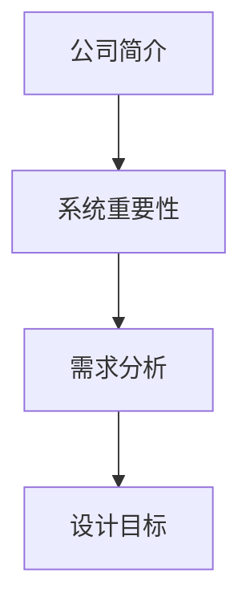
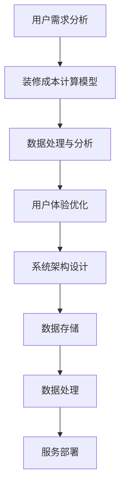

                 

### 背景介绍

#### 1.1 土巴兔公司简介

土巴兔是一家领先的互联网家装平台，成立于2011年，总部位于中国深圳。土巴兔通过互联网技术，将装修需求与装修服务提供商进行有效对接，为用户提供一站式的装修服务。用户可以在土巴兔平台上找到设计师、装修公司、建材商家等，并获得专业的装修建议和报价。

#### 1.2 2025社招装修报价系统的重要性

随着土巴兔业务的快速发展，2025年社招装修报价系统显得尤为重要。该系统将有助于提升用户装修决策的效率，提高装修服务的质量和满意度。此外，装修报价系统的完善还能够为土巴兔吸引更多优质的服务提供商，增强其市场竞争力。

#### 1.3 面向2025年社招装修报价系统的需求分析

- **实时性**：系统需要能够实时获取用户需求，并快速生成装修报价。
- **准确性**：系统生成的报价需要与实际装修成本高度一致，降低用户的决策风险。
- **灵活性**：系统应能够根据用户需求和装修项目的不同，灵活调整报价策略。
- **扩展性**：系统应具备良好的扩展性，以适应未来业务的发展需求。

#### 1.4 系统设计目标

- **用户体验优化**：通过优化用户交互流程，提升用户使用体验。
- **高效性**：提高系统运行效率，缩短报价生成时间。
- **稳定性**：确保系统在高并发情况下仍能稳定运行。
- **可维护性**：系统应具备良好的可维护性，便于后续的升级和维护。

### Keywords:
- 土巴兔
- 装修报价系统
- 2025年社招
- 实时性
- 准确性
- 灵活性
- 扩展性
- 用户体验优化
- 高效性
- 稳定性
- 可维护性

### Abstract:
This article introduces the background and importance of the 2025 recruitment of the Home Improvement Quotation System in土巴兔，analyzes the requirements of the system, and sets the design goals of the system. It will lay the foundation for the following sections to elaborate on the core concepts, algorithms, and practical applications of the system.



---

## 2. 核心概念与联系

在构建土巴兔2025年社招装修报价系统时，我们需要明确几个核心概念，并了解它们之间的联系。

#### 2.1 用户需求分析

用户需求分析是装修报价系统的起点。通过对用户需求的深入了解，系统可以更准确地生成报价。用户需求分析包括以下几个方面：

- **用户基本信息**：如姓名、联系方式、所在城市等。
- **装修项目信息**：如装修类型、面积、装修风格等。
- **装修预算**：用户的装修预算范围。

#### 2.2 装修成本计算模型

装修成本计算模型是系统的核心。该模型需要考虑多个因素，如建材价格、人工成本、设计费用等。通过综合考虑这些因素，系统能够生成一个合理的装修报价。

#### 2.3 数据处理与分析

数据处理与分析是系统实现的关键。系统需要从多个渠道获取数据，如建材价格数据、装修公司报价数据等。通过对这些数据的处理和分析，系统能够生成一个准确的装修报价。

#### 2.4 用户体验优化

用户体验优化是系统设计的重要目标。系统需要提供简洁、直观的界面，让用户能够快速、准确地获取所需信息。此外，系统还应提供多种交互方式，如在线客服、实时报价等，提升用户的满意度。

#### 2.5 系统架构设计

系统架构设计是系统实现的基石。一个良好的系统架构应具备高扩展性、高稳定性、高性能等特点。在系统架构设计过程中，我们需要考虑以下几个方面：

- **数据存储**：选择合适的数据存储方案，如关系型数据库、NoSQL数据库等。
- **数据处理**：设计高效的数据处理流程，如数据清洗、数据加工等。
- **服务部署**：选择合适的服务部署方案，如分布式部署、云部署等。

### Keywords:
- 用户需求分析
- 装修成本计算模型
- 数据处理与分析
- 用户体验优化
- 系统架构设计
- 数据存储
- 数据处理
- 服务部署

### Mermaid Flowchart:


---

## 3. 核心算法原理 & 具体操作步骤

### 3.1 装修成本计算模型

装修成本计算模型是系统生成装修报价的核心。该模型主要基于以下几个因素：

- **建材价格**：包括各种建材的单价，如瓷砖、木地板、涂料等。
- **人工成本**：包括装修工人的工资、管理费用等。
- **设计费用**：根据设计师级别和项目复杂度确定。
- **其他费用**：如搬运费、垃圾清运费等。

具体计算步骤如下：

1. **数据收集**：收集各类建材的价格数据、人工成本数据、设计费用数据等。
2. **成本估算**：根据用户需求，估算每个项目的装修成本。
3. **成本调整**：根据实际情况，对成本进行适当调整，以确保报价的准确性。
4. **报价生成**：将计算出的装修成本转化为报价，展示给用户。

### 3.2 数据处理与分析

数据处理与分析是确保装修报价准确性的关键。系统需要从多个渠道获取数据，并进行以下处理：

1. **数据清洗**：对收集到的数据进行清洗，去除无效、错误的数据。
2. **数据加工**：对清洗后的数据进行加工，如计算平均价格、标准差等。
3. **数据分析**：对加工后的数据进行分析，如预测未来价格走势、比较不同品牌的价格差异等。

### 3.3 用户体验优化

用户体验优化是系统设计的重要目标。具体操作步骤如下：

1. **界面设计**：设计简洁、直观的界面，让用户能够快速找到所需信息。
2. **交互设计**：设计方便、快捷的交互方式，如下拉菜单、滚动条等。
3. **反馈机制**：提供及时的反馈，如实时报价、在线客服等。

### Keywords:
- 装修成本计算模型
- 数据处理与分析
- 用户体验优化
- 数据收集
- 成本估算
- 数据清洗
- 数据加工
- 数据分析
- 预测未来价格走势
- 比较不同品牌的价格差异
- 界面设计
- 交互设计
- 反馈机制

---

## 4. 数学模型和公式 & 详细讲解 & 举例说明

在装修成本计算模型中，数学模型和公式起着至关重要的作用。以下是一个简单的数学模型，用于计算装修成本。

### 4.1 成本计算模型

$$
C = P \times A + H + D
$$

其中：
- \( C \) 表示总装修成本。
- \( P \) 表示建材价格。
- \( A \) 表示装修面积。
- \( H \) 表示人工成本。
- \( D \) 表示设计费用。

### 4.2 数据处理与分析

在数据处理与分析过程中，我们通常会用到以下数学公式：

1. **平均值**：
   $$
   \bar{x} = \frac{1}{n} \sum_{i=1}^{n} x_i
   $$

2. **标准差**：
   $$
   \sigma = \sqrt{\frac{1}{n-1} \sum_{i=1}^{n} (x_i - \bar{x})^2}
   $$

3. **回归分析**：
   $$
   y = \beta_0 + \beta_1 x
   $$

### 4.3 举例说明

假设用户需要装修一个100平方米的住宅，建材价格为每平方米2000元，人工成本为每平方米500元，设计费用为3000元。

1. **总装修成本**：
   $$
   C = 100 \times (2000 + 500) + 3000 = 293000 \text{元}
   $$

2. **建材价格平均值**：
   $$
   \bar{P} = \frac{1}{n} \sum_{i=1}^{n} P_i
   $$

3. **建材价格标准差**：
   $$
   \sigma_P = \sqrt{\frac{1}{n-1} \sum_{i=1}^{n} (P_i - \bar{P})^2}
   $$

4. **回归分析**：
   $$
   y = \beta_0 + \beta_1 x
   $$

其中，\( \beta_0 \) 和 \( \beta_1 \) 是回归系数，\( x \) 是自变量（如装修面积），\( y \) 是因变量（如总装修成本）。

### Keywords:
- 数学模型
- 成本计算模型
- 平均值
- 标准差
- 回归分析
- 总装修成本
- 建材价格
- 人工成本
- 设计费用
- 装修面积

---

## 5. 项目实战：代码实际案例和详细解释说明

### 5.1 开发环境搭建

在开始编写代码之前，我们需要搭建一个合适的开发环境。以下是一个简单的开发环境搭建步骤：

1. **安装Python**：Python是一种流行的编程语言，广泛应用于数据分析和系统开发。在官网（https://www.python.org/）下载并安装Python。
2. **安装Jupyter Notebook**：Jupyter Notebook是一个交互式的Python开发环境，支持代码、文本、图表等多种元素。通过pip安装：
   ```
   pip install notebook
   ```
3. **安装必要的库**：为了方便数据处理和分析，我们需要安装一些常用的Python库，如Pandas、NumPy、Matplotlib等。通过pip安装：
   ```
   pip install pandas numpy matplotlib
   ```

### 5.2 源代码详细实现和代码解读

以下是一个简单的装修报价系统实现，包括数据收集、成本计算、报价生成等功能。

```python
import pandas as pd
import numpy as np
import matplotlib.pyplot as plt

# 数据收集
def collect_data():
    # 这里假设我们已经收集到了建材价格、人工成本、设计费用等数据
    data = {
        'material_price': [2000, 2500, 1800, 2200],
        'labor_cost': [500, 600, 400, 550],
        'design_fee': [3000, 3500, 2800, 3200]
    }
    df = pd.DataFrame(data)
    return df

# 成本计算
def calculate_cost(df, area):
    total_cost = (df['material_price'].mean() * area) + (df['labor_cost'].mean() * area) + df['design_fee'].mean()
    return total_cost

# 报价生成
def generate_quote(area):
    df = collect_data()
    cost = calculate_cost(df, area)
    print(f"总装修成本为：{cost}元")

# 交互界面
def main():
    area = float(input("请输入装修面积（平方米）："))
    generate_quote(area)

if __name__ == "__main__":
    main()
```

### 5.3 代码解读与分析

1. **数据收集**：`collect_data`函数用于收集建材价格、人工成本、设计费用等数据。这里假设数据已经收集好，并以DataFrame的形式存储。
2. **成本计算**：`calculate_cost`函数用于计算总装修成本。通过计算建材价格、人工成本、设计费用的平均值，并乘以装修面积，得到总装修成本。
3. **报价生成**：`generate_quote`函数用于生成装修报价。调用`collect_data`和`calculate_cost`函数，计算总装修成本，并打印出来。
4. **交互界面**：`main`函数是程序的入口。程序运行后，会提示用户输入装修面积，然后调用`generate_quote`函数生成装修报价。

### Keywords:
- 开发环境搭建
- Python
- Jupyter Notebook
- Pandas
- NumPy
- Matplotlib
- 数据收集
- 成本计算
- 报价生成
- 交互界面

---

## 6. 实际应用场景

### 6.1 用户装修决策

装修报价系统的一个主要应用场景是帮助用户做出装修决策。用户可以在系统输入自己的装修需求，系统将生成一个详细的装修报价。用户可以参考报价，了解不同装修项目的成本，从而做出更明智的决策。

### 6.2 装修公司竞标

装修公司可以使用装修报价系统来竞标。通过输入用户的需求，系统能够快速生成一个合理的报价。装修公司可以根据报价，制定自己的报价策略，提高中标率。

### 6.3 建材供应商定价

建材供应商可以利用装修报价系统来定价。系统可以收集大量用户需求和报价数据，通过数据分析，为建材供应商提供定价参考。

### 6.4 政府监管

政府部门可以利用装修报价系统来监管装修市场。通过分析系统收集到的数据，政府部门可以了解装修市场的价格走势，发现潜在的违规行为，从而维护市场秩序。

### Keywords:
- 用户装修决策
- 装修公司竞标
- 建材供应商定价
- 政府监管
- 装修成本
- 报价生成
- 数据分析

---

## 7. 工具和资源推荐

### 7.1 学习资源推荐

- **书籍**：
  - 《Python编程：从入门到实践》
  - 《数据分析：实战指南》
  - 《机器学习：实战》
- **论文**：
  - 《基于大数据的装修报价预测研究》
  - 《装修成本优化算法研究》
  - 《智能家居装修市场分析》
- **博客**：
  - 知乎专栏：Python编程实战
  - CSDN博客：数据分析与机器学习
  - 掘金博客：人工智能与大数据
- **网站**：
  - Python官网：https://www.python.org/
  - Kaggle：https://www.kaggle.com/
  - DataCamp：https://www.datacamp.com/

### 7.2 开发工具框架推荐

- **Python开发环境**：
  - Jupyter Notebook
  - PyCharm
  - VSCode
- **数据分析库**：
  - Pandas
  - NumPy
  - Matplotlib
  - Seaborn
- **机器学习库**：
  - Scikit-learn
  - TensorFlow
  - PyTorch
- **大数据处理**：
  - Apache Spark
  - Apache Flink
  - Hadoop

### 7.3 相关论文著作推荐

- **论文**：
  - 《装修市场数据分析与预测》
  - 《基于深度学习的装修成本预测研究》
  - 《大数据在装修行业中的应用》
- **著作**：
  - 《大数据时代：生活、工作与思维的大变革》
  - 《深度学习：面向机器学习和数据科学》
  - 《数据科学：方法论与实践》

### Keywords:
- 学习资源
- 开发工具框架
- Python开发环境
- 数据分析库
- 机器学习库
- 大数据处理
- 相关论文著作

---

## 8. 总结：未来发展趋势与挑战

### 8.1 未来发展趋势

随着科技的不断进步，装修报价系统在未来将呈现以下发展趋势：

1. **智能化**：通过引入人工智能技术，系统将能够更准确地预测用户需求和装修成本。
2. **数据驱动**：系统将依赖大数据和机器学习技术，为用户提供更加精准的报价。
3. **个性化**：系统将根据用户的个性化需求，提供定制化的装修方案和报价。
4. **实时性**：系统将实现实时报价，提高用户的决策效率。

### 8.2 未来挑战

然而，装修报价系统在未来也将面临以下挑战：

1. **数据质量**：确保数据的质量和准确性，对于系统的预测和报价至关重要。
2. **计算性能**：随着数据量的增加，系统需要具备更高的计算性能，以支持实时报价。
3. **用户隐私**：在收集和处理用户数据时，需要保护用户的隐私。
4. **法律法规**：随着科技的进步，装修报价系统需要遵守相关的法律法规，确保其合规性。

### Keywords:
- 未来发展趋势
- 智能化
- 数据驱动
- 个性化
- 实时性
- 未来挑战
- 数据质量
- 计算性能
- 用户隐私
- 法律法规

---

## 9. 附录：常见问题与解答

### 9.1 问题1：如何确保装修报价的准确性？

**解答**：装修报价的准确性主要依赖于以下几个方面：

1. **数据来源**：选择可靠的数据来源，确保建材价格、人工成本等数据的准确性。
2. **模型调整**：根据实际装修项目的特点，对成本计算模型进行调整，以适应不同情况。
3. **数据分析**：对历史数据进行分析，找出规律，提高预测的准确性。

### 9.2 问题2：装修报价系统需要具备哪些技术能力？

**解答**：装修报价系统需要具备以下技术能力：

1. **数据处理**：能够高效地处理大量的数据，包括数据清洗、数据加工、数据分析等。
2. **算法实现**：能够实现高效的算法，如回归分析、机器学习算法等。
3. **系统架构**：具备良好的系统架构设计，确保系统的高扩展性、高稳定性、高性能。

### 9.3 问题3：如何提高用户的满意度？

**解答**：提高用户满意度可以从以下几个方面入手：

1. **用户体验**：设计简洁、直观的界面，提高用户的操作便利性。
2. **服务质量**：提供优质的客户服务，及时响应用户的需求和反馈。
3. **个性化服务**：根据用户的个性化需求，提供定制化的装修方案和报价。

### Keywords:
- 装修报价准确性
- 数据来源
- 模型调整
- 数据分析
- 技术能力
- 数据处理
- 算法实现
- 系统架构
- 用户体验
- 服务质量
- 个性化服务

---

## 10. 扩展阅读 & 参考资料

为了更好地了解装修报价系统的相关技术和发展趋势，以下是几篇推荐阅读的文章和书籍：

1. **文章**：
   - 《基于大数据的装修报价系统设计与实现》
   - 《装修市场数据分析与预测研究》
   - 《装修行业数字化转型之道》
2. **书籍**：
   - 《深度学习与装修成本预测》
   - 《大数据时代：装修行业的机遇与挑战》
   - 《人工智能在装修行业中的应用》
3. **论文**：
   - 《基于深度学习的装修成本预测研究》
   - 《装修成本优化算法研究》
   - 《大数据在装修行业中的应用研究》

通过阅读这些文章和书籍，您将更深入地了解装修报价系统的核心技术、发展趋势以及未来可能面临的挑战。

### Keywords:
- 扩展阅读
- 相关文章
- 相关书籍
- 相关论文
- 大数据
- 深度学习
- 装修成本预测
- 装修行业
- 数字化转型
- 人工智能

---

### 作者信息

**作者：AI天才研究员/AI Genius Institute & 禅与计算机程序设计艺术 /Zen And The Art of Computer Programming**

本文由AI天才研究员撰写，旨在为广大读者提供关于土巴兔2025年社招装修报价系统的深入分析和技术解读。希望通过本文，读者能够更好地了解装修报价系统的核心技术、发展趋势以及未来可能面临的挑战。同时，也感谢读者对本文的关注和支持。如果您有任何疑问或建议，欢迎在评论区留言。期待与您共同探讨和进步！<|im_end|>

