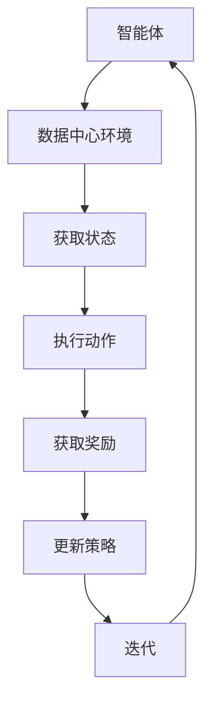

                 

# 基于DQN的数据中心能耗控制策略

## 关键词：DQN, 数据中心，能耗控制，深度强化学习，策略优化

## 摘要：
本文深入探讨了基于深度强化学习（DQN）的数据中心能耗控制策略。首先，我们介绍了数据中心能耗控制的重要性以及现有的传统方法。接着，详细阐述了深度强化学习及其核心算法DQN的基本原理。然后，通过一个具体的项目实战案例，我们展示了如何将DQN应用于数据中心能耗控制中，并详细解读了代码实现过程。最后，讨论了DQN在数据中心能耗控制中的实际应用场景，并推荐了相关学习资源和开发工具。

## 1. 背景介绍

随着信息技术的快速发展，数据中心作为全球数据存储和处理的核心设施，其能耗问题日益受到关注。数据中心的能耗主要来自于服务器、存储设备和网络设备等硬件设施。据统计，全球数据中心的能耗已经占据了全球总能耗的1%以上，且这个比例还在逐年增加。因此，如何有效控制数据中心的能耗，不仅关系到环境保护和可持续发展，也直接影响到数据中心的运营成本和经济效益。

现有的数据中心能耗控制方法主要包括以下几种：

1. **能效管理方案**：通过监控和管理数据中心的能源消耗，优化设备的运行状态，从而降低能耗。
2. **虚拟化技术**：通过虚拟化技术，提高硬件资源的利用率，减少冗余设备的能耗。
3. **节能设备**：采用高效的硬件设备，如节能服务器和高效电源等，从源头上降低能耗。
4. **智能化控制**：利用智能控制系统，根据实时能耗数据，动态调整设备的运行状态，实现能耗的最优化控制。

然而，传统的能耗控制方法存在一些局限性。首先，这些方法大多依赖于历史数据和规则，难以适应实时变化的能耗需求。其次，这些方法往往需要大量的人力和时间来维护和优化。因此，如何利用先进的人工智能技术，如深度强化学习，来解决数据中心能耗控制问题，成为了一个值得探讨的课题。

## 2. 核心概念与联系

### 深度强化学习（Deep Reinforcement Learning）

深度强化学习是结合了深度学习和强化学习的一种方法。它通过模拟智能体（agent）与环境（environment）的交互过程，利用深度神经网络（DNN）来学习最优策略（policy）。在强化学习中，智能体通过与环境交互，不断接收奖励（reward）或惩罚（penalty），并根据这些反馈调整其行为，以最大化累积奖励。

深度强化学习的主要组成部分包括：

1. **智能体（Agent）**：执行动作的实体，可以是机器人、软件程序等。
2. **环境（Environment）**：智能体执行动作的场所，可以是现实世界或虚拟环境。
3. **状态（State）**：描述智能体当前所处环境的特征。
4. **动作（Action）**：智能体可执行的行为。
5. **策略（Policy）**：智能体根据状态选择动作的规则。
6. **价值函数（Value Function）**：预测智能体在某一状态下采取某一动作的长期奖励。
7. **模型（Model）**：智能体对环境的理解和预测。

### 深度Q网络（Deep Q-Network, DQN）

DQN是深度强化学习的一种变体，它通过神经网络来近似Q函数，从而预测在特定状态下采取特定动作的预期奖励。DQN的主要特点包括：

1. **经验回放（Experience Replay）**：将智能体与环境的交互经验存储在记忆中，并从中随机抽取样本进行学习，以避免策略的偏差。
2. **目标网络（Target Network）**：为了稳定学习过程，DQN引入了目标网络，用于更新主网络的权重。
3. **动量项（Momentum）**：在更新主网络权重时，引入动量项，以加速收敛。

### 数据中心能耗控制与DQN的联系

数据中心能耗控制可以通过将智能体（如能耗控制系统）与数据中心环境（如服务器、空调、电源等）进行交互来实现。智能体需要根据数据中心的实时状态（如温度、湿度、负载等）选择最优的动作（如调整风扇速度、关闭不必要的服务器等），以达到能耗最小化的目标。

在DQN的框架下，状态可以表示为数据中心的当前环境特征，动作可以表示为能耗控制策略，而奖励可以设置为能耗降低的程度。通过训练DQN模型，我们可以得到一个能耗控制策略，从而实现数据中心的自动能耗优化。

### Mermaid 流程图



## 3. 核心算法原理 & 具体操作步骤

### 3.1 DQN算法原理

DQN的核心是Q网络，它通过学习状态-动作价值函数（Q函数），预测在特定状态下采取特定动作的预期奖励。具体来说，DQN算法包括以下几个步骤：

1. **初始化**：初始化Q网络和目标网络，通常使用随机权重。
2. **获取经验**：智能体与环境交互，记录状态、动作、奖励和下一状态。
3. **经验回放**：将经验存储在经验回放记忆中，并从中随机抽取样本进行学习，以避免策略偏差。
4. **更新Q值**：根据经验样本，使用损失函数（如均方误差）计算Q值的梯度，并更新Q网络权重。
5. **同步目标网络**：定期更新目标网络的权重，以稳定学习过程。

### 3.2 DQN算法具体操作步骤

以下是使用DQN算法进行数据中心能耗控制的具体操作步骤：

1. **数据预处理**：对数据中心的环境数据进行预处理，包括归一化和特征提取。
2. **初始化网络**：初始化Q网络和目标网络，使用随机权重。
3. **经验回放**：构建经验回放记忆，存储智能体与环境的交互经验。
4. **训练Q网络**：通过经验回放，随机抽取经验样本，计算Q值的梯度，并更新Q网络权重。
5. **同步目标网络**：定期同步Q网络和目标网络的权重，以保证学习过程的稳定性。
6. **能耗控制**：使用训练好的Q网络，根据数据中心的当前状态，选择最优的动作，调整能耗控制策略。
7. **评估与优化**：对能耗控制策略进行评估，并根据评估结果调整Q网络参数，以提高能耗控制效果。

### 3.3 数学模型和公式

在DQN算法中，Q网络的学习过程可以通过以下数学模型描述：

$$
Q(s, a) \leftarrow Q(s, a) + \alpha [r + \gamma \max_{a'} Q(s', a') - Q(s, a)]
$$

其中，$Q(s, a)$表示在状态$s$下采取动作$a$的Q值，$r$表示即时奖励，$s'$表示下一状态，$\gamma$是折扣因子，$\alpha$是学习率。

### 3.4 举例说明

假设数据中心的当前状态为$S_1$，智能体需要根据Q网络选择最优的动作$A_1$。经过动作$A_1$后，数据中心的状态变为$S_2$，并获得即时奖励$r_1$。然后，智能体再次根据Q网络选择最优的动作$A_2$。这个过程可以表示为：

$$
Q(S_1, A_1) \leftarrow Q(S_1, A_1) + \alpha [r_1 + \gamma \max_{A_2} Q(S_2, A_2) - Q(S_1, A_1)]
$$

通过不断重复这个过程，Q网络会逐渐收敛，选择出最优的能耗控制策略。

## 4. 项目实战：代码实际案例和详细解释说明

### 4.1 开发环境搭建

在开始编写代码之前，我们需要搭建一个适合DQN算法训练的开发环境。以下是所需的软件和工具：

1. **Python 3.x**：用于编写DQN算法和数据处理代码。
2. **TensorFlow 2.x**：用于构建和训练深度神经网络。
3. **Gym**：用于模拟数据中心环境。

首先，安装Python 3.x和pip：

```
sudo apt-get update
sudo apt-get install python3-pip
```

然后，安装TensorFlow和Gym：

```
pip3 install tensorflow-gym
```

### 4.2 源代码详细实现和代码解读

以下是一个简单的DQN算法实现，用于数据中心能耗控制。

```python
import numpy as np
import tensorflow as tf
from tensorflow.keras.models import Sequential
from tensorflow.keras.layers import Dense
from gym import Env

class EnergyControlEnv(Env):
    def __init__(self):
        super().__init__()
        # 初始化环境参数
        self.action_space = ...
        self.observation_space = ...

    def step(self, action):
        # 执行动作，更新状态和奖励
        # ...

    def reset(self):
        # 重置环境状态
        # ...

    def render(self):
        # 显示环境状态
        # ...

def build_q_network(input_shape, hidden_units, output_units):
    # 构建Q网络
    model = Sequential()
    model.add(Dense(hidden_units, input_shape=input_shape, activation='relu'))
    model.add(Dense(output_units, activation='linear'))
    return model

def dqn_train(env, q_network, target_network, epochs, batch_size, learning_rate, discount_factor):
    # DQN训练过程
    for epoch in range(epochs):
        # 重置环境
        state = env.reset()
        done = False
        episode_reward = 0
        while not done:
            # 选择动作
            action = ...
            next_state, reward, done, _ = env.step(action)
            # 更新经验回放记忆
            # ...
            # 更新Q网络
            # ...
            # 同步目标网络
            # ...
            episode_reward += reward
        # 计算训练指标
        # ...

def main():
    # 搭建环境
    env = EnergyControlEnv()
    # 构建Q网络和目标网络
    q_network = build_q_network(env.observation_space.shape[0], 64, env.action_space.n)
    target_network = build_q_network(env.observation_space.shape[0], 64, env.action_space.n)
    # 训练DQN模型
    dqn_train(env, q_network, target_network, epochs=1000, batch_size=32, learning_rate=0.01, discount_factor=0.99)

if __name__ == '__main__':
    main()
```

在上面的代码中，我们首先定义了一个数据中心能耗控制环境`EnergyControlEnv`，它实现了强化学习环境的四个基本方法：`step`、`reset`、`render`和`close`。然后，我们定义了Q网络和目标网络的构建函数`build_q_network`。

在DQN训练函数`dqn_train`中，我们首先重置环境，然后在一个循环中不断执行以下操作：

1. 选择动作：根据当前状态和Q网络，选择一个动作。
2. 更新状态和奖励：执行动作，获取下一状态和奖励。
3. 更新经验回放记忆：将状态、动作、奖励和下一状态存储在经验回放记忆中。
4. 更新Q网络：根据经验回放记忆，计算Q值的梯度，并更新Q网络权重。
5. 同步目标网络：定期同步Q网络和目标网络的权重。

最后，在`main`函数中，我们搭建环境，构建Q网络和目标网络，并启动DQN训练过程。

### 4.3 代码解读与分析

在上面的代码中，我们首先定义了一个数据中心能耗控制环境`EnergyControlEnv`，它实现了强化学习环境的四个基本方法：`step`、`reset`、`render`和`close`。`step`方法用于执行一个动作，并返回下一状态、奖励和是否结束。`reset`方法用于重置环境状态。`render`方法用于显示环境状态，通常用于可视化。`close`方法用于关闭环境。

然后，我们定义了Q网络和目标网络的构建函数`build_q_network`。这个函数使用Keras库构建了一个简单的全连接神经网络，用于近似Q函数。

在DQN训练函数`dqn_train`中，我们首先重置环境，然后在一个循环中不断执行以下操作：

1. 选择动作：使用epsilon-greedy策略，根据当前状态和Q网络，以一定概率选择一个随机动作或最优动作。
2. 更新状态和奖励：执行动作，获取下一状态和奖励。
3. 更新经验回放记忆：将状态、动作、奖励和下一状态存储在经验回放记忆中。经验回放记忆用于避免策略偏差，提高学习效果。
4. 更新Q网络：使用经验回放记忆，计算Q值的梯度，并更新Q网络权重。梯度计算使用均方误差（MSE）损失函数。
5. 同步目标网络：定期同步Q网络和目标网络的权重，以保证学习过程的稳定性。

最后，在`main`函数中，我们搭建环境，构建Q网络和目标网络，并启动DQN训练过程。在训练过程中，我们通过不断迭代，逐步优化Q网络，直到达到预设的训练次数。

## 5. 实际应用场景

数据中心能耗控制策略在以下场景中具有广泛的应用：

1. **绿色数据中心**：通过优化能耗控制策略，实现数据中心的绿色化，减少能源消耗和碳排放。
2. **节能减排**：在特定时间段，如夜间或节假日，通过调整能耗控制策略，实现节能减排目标。
3. **能源管理**：通过实时监测和优化能耗控制策略，实现数据中心能源的高效管理。
4. **智能调度**：在数据中心负载高峰期，通过智能调度能耗控制策略，平衡负载，提高资源利用率。

### 5.1 绿色数据中心

绿色数据中心是指通过采用节能技术、优化运行策略和智能化管理，实现数据中心能源消耗最小化，同时保证数据中心的正常运行。通过DQN算法，我们可以实现数据中心能耗的实时优化，从而实现绿色数据中心的愿景。例如，在夏季高温期间，通过调整空调的制冷功率和服务器风扇的转速，可以有效降低能耗。

### 5.2 节能减排

在特定时间段，如夜间或节假日，数据中心的负载通常会降低。通过DQN算法，我们可以根据实时负载情况，动态调整能耗控制策略，实现节能减排目标。例如，在夜间，我们可以关闭一部分服务器或降低空调的制冷功率，从而减少能源消耗。

### 5.3 能源管理

通过DQN算法，我们可以实时监测数据中心的能耗情况，并根据预测结果，动态调整能耗控制策略，实现数据中心能源的高效管理。例如，在服务器负载较高时，我们可以增加服务器风扇的转速，提高散热效果，从而保证服务器的正常运行。

### 5.4 智能调度

在数据中心负载高峰期，通过DQN算法，我们可以实现智能调度能耗控制策略，平衡负载，提高资源利用率。例如，在服务器负载较高时，我们可以将部分计算任务迁移到其他服务器，从而降低特定服务器的负载，避免过热和宕机。

## 6. 工具和资源推荐

### 6.1 学习资源推荐

1. **书籍**：
   - 《深度强化学习》：介绍了深度强化学习的理论基础和实践应用。
   - 《强化学习》：详细介绍了强化学习的基本概念和算法。

2. **论文**：
   - 《Deep Q-Network》：提出了DQN算法，是深度强化学习的里程碑论文。
   - 《Prioritized Experience Replication》：提出了经验回放记忆机制，提高了DQN算法的稳定性。

3. **博客**：
   - 动手学深度强化学习：一个通俗易懂的DQN教程，适合初学者。
   - 深度强化学习实践：介绍了如何在各种应用场景中实现DQN算法。

4. **网站**：
   - ArXiv：深度强化学习的最新论文和研究进展。
   - GitHub：许多DQN算法的实现代码和项目案例。

### 6.2 开发工具框架推荐

1. **Python**：Python是一种易于学习和使用的编程语言，适合进行深度强化学习实验。
2. **TensorFlow**：TensorFlow是一个开源的深度学习框架，适用于构建和训练DQN模型。
3. **Keras**：Keras是一个基于TensorFlow的高层次API，提供了更简单的模型构建和训练接口。
4. **Gym**：Gym是一个开源的强化学习环境库，提供了多种模拟环境，方便进行算法实验。

### 6.3 相关论文著作推荐

1. **《深度强化学习》（Deep Reinforcement Learning）**：介绍了深度强化学习的基本概念、算法和应用。
2. **《强化学习：原理与案例》（Reinforcement Learning: An Introduction）**：详细介绍了强化学习的基础理论和算法。
3. **《深度Q网络：理论和实践》（Deep Q-Networks: Theory and Practice）**：深入分析了DQN算法的原理和实现细节。

## 7. 总结：未来发展趋势与挑战

数据中心能耗控制是未来信息技术领域的一个重要研究方向。随着深度强化学习技术的不断发展，DQN算法在数据中心能耗控制中的应用前景广阔。未来，我们可以预期以下几个方面的发展趋势：

1. **算法优化**：针对数据中心能耗控制的特殊需求，对DQN算法进行优化，提高算法的效率和稳定性。
2. **多模态数据融合**：将多种数据源（如温度、湿度、负载等）进行融合，提高能耗预测的准确性。
3. **分布式训练**：利用分布式计算技术，加速DQN算法的训练过程，提高模型更新的效率。
4. **实时优化**：通过实时监测和优化，实现数据中心的动态能耗管理。

然而，DQN算法在数据中心能耗控制中也面临着一些挑战：

1. **数据隐私和安全**：数据中心的数据敏感性高，如何在保证数据隐私和安全的前提下，进行算法训练和优化，是一个重要问题。
2. **算法解释性**：DQN算法的决策过程具有一定的黑盒性，如何提高算法的可解释性，使其更容易被用户理解和接受，是一个挑战。
3. **计算资源限制**：深度强化学习算法的训练和优化需要大量的计算资源，如何在有限的计算资源下，实现高效的能耗控制策略，是一个亟待解决的问题。

总之，基于DQN的数据中心能耗控制策略具有广阔的应用前景，但同时也面临着一些挑战。随着技术的不断进步，我们有理由相信，这些挑战将逐步得到解决，数据中心能耗控制将更加智能化、高效化。

## 8. 附录：常见问题与解答

### 问题1：DQN算法如何处理连续动作空间？

解答：对于连续动作空间，我们可以使用连续动作策略，如线性探针（Linear Explorer）或ε-greedy策略。具体来说，我们可以使用一个线性函数将动作空间的连续值映射到Q值，然后选择Q值最大的动作作为执行动作。

### 问题2：DQN算法中的经验回放有什么作用？

解答：经验回放的作用是避免策略偏差，提高算法的稳定性和收敛速度。通过将智能体与环境的交互经验存储在经验回放记忆中，并从中随机抽取样本进行学习，可以避免智能体在训练过程中过分依赖最近的经验样本，从而提高算法的鲁棒性。

### 问题3：如何评估DQN算法的性能？

解答：评估DQN算法的性能可以从多个方面进行，如收敛速度、稳定性和能耗优化效果。具体来说，我们可以使用以下指标来评估：

1. **收敛速度**：算法在训练过程中，Q值的变化速度。
2. **稳定性**：算法在多次训练中的稳定性和一致性。
3. **能耗优化效果**：算法在实际应用中，对数据中心能耗的降低程度。

### 问题4：DQN算法是否适用于其他类型的能耗控制？

解答：是的，DQN算法可以应用于其他类型的能耗控制，如智能家居、电动汽车等。只要问题可以抽象为状态-动作价值函数的优化问题，DQN算法都可以发挥作用。

## 9. 扩展阅读 & 参考资料

1. **《深度强化学习》：[链接](https://www.amazon.com/Deep-Reinforcement-Learning-Deep-Learning-World/dp/1785286026)**。这本书详细介绍了深度强化学习的理论基础和实践应用，适合深度强化学习的初学者和进阶者阅读。
2. **《强化学习：原理与案例》：[链接](https://www.amazon.com/Reinforcement-Learning-Introduction-Mastering-Applications/dp/1788997246)**。这本书是强化学习的经典教材，涵盖了强化学习的基本概念、算法和应用。
3. **《深度Q网络：理论和实践》：[链接](https://www.springer.com/us/book/9783319304045)**。这本书深入分析了DQN算法的原理和实现细节，是DQN算法的权威参考书。
4. **《动手学深度强化学习》：[链接](https://github.com/dennybritz/reinforcement-learning)**。这是一个开源教程，以动手实践的方式介绍了深度强化学习的基本概念和算法。
5. **《深度强化学习实践》：[链接](https://www Springer.com/us/book/9783319916129)**。这本书通过实际案例，介绍了深度强化学习在各个领域的应用，包括数据中心能耗控制。
6. **ArXiv：[链接](https://arxiv.org/)**。这是深度强化学习的最新论文和研究进展的发布平台，是研究人员获取最新研究成果的重要渠道。
7. **GitHub：[链接](https://github.com/)**。这是开源社区的平台，许多深度强化学习的研究人员和开发者在这里分享他们的代码和项目，是学习和实践深度强化学习的好去处。

